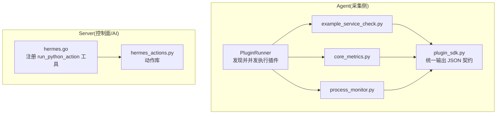
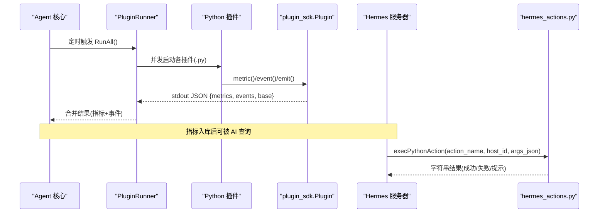
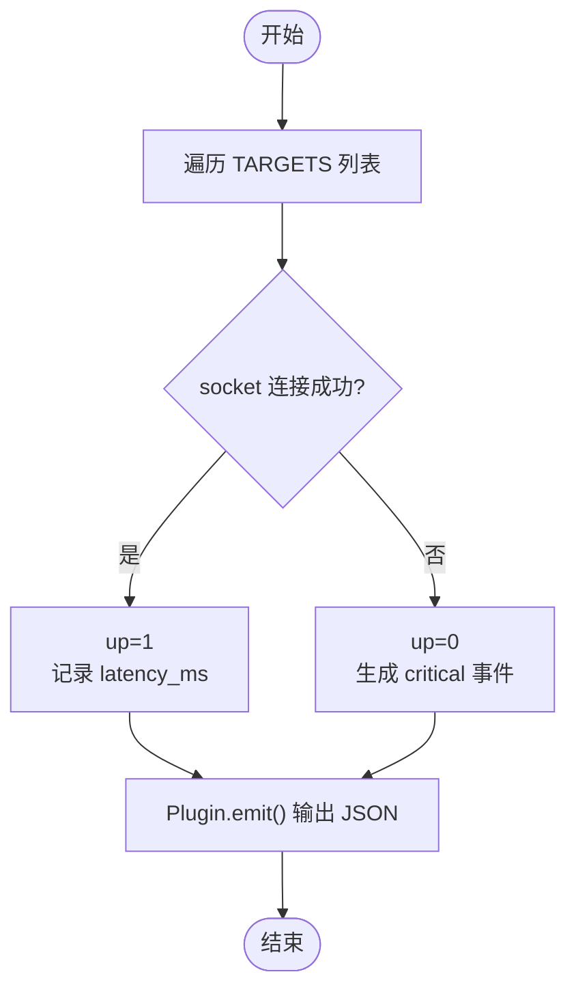
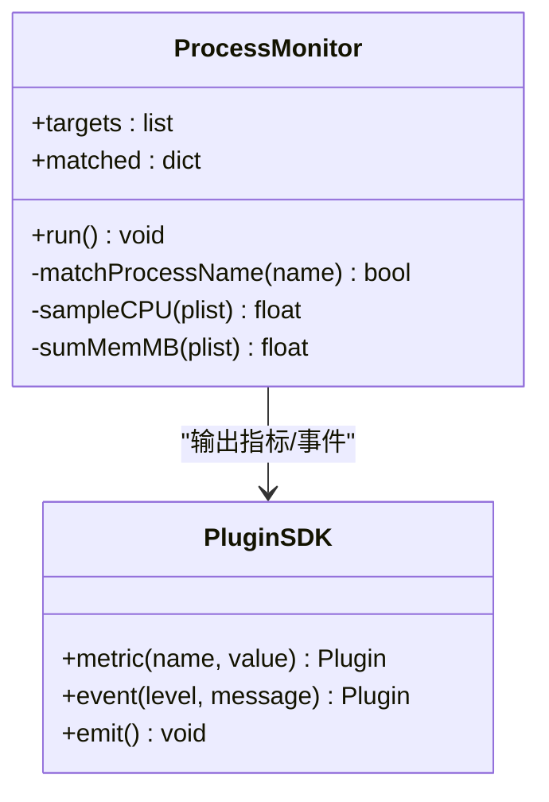
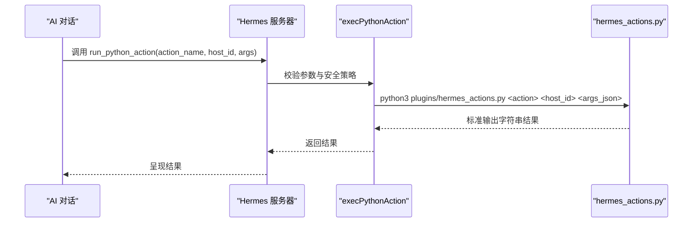
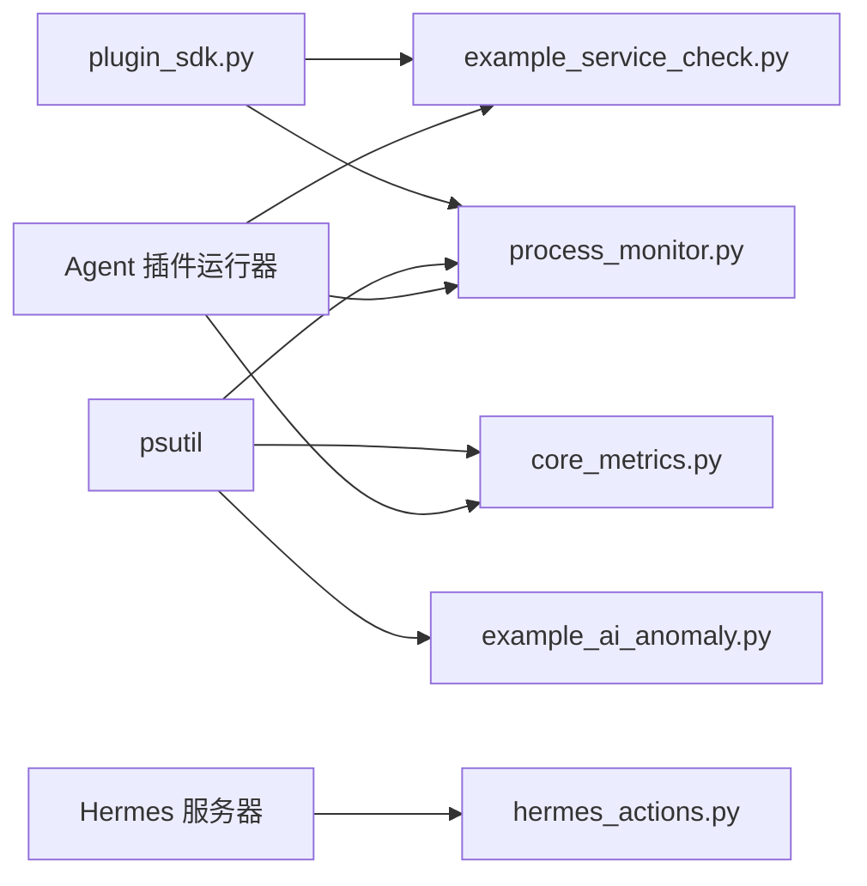

# 示例插件解析

<cite>
**本文引用的文件**
- [plugins/example_service_check.py](file://plugins/example_service_check.py)
- [plugins/core_metrics.py](file://plugins/core_metrics.py)
- [plugins/process_monitor.py](file://plugins/process_monitor.json)
- [plugins/process_monitor.py](file://plugins/process_monitor.py)
- [plugins/hermes_actions.py](file://plugins/hermes_actions.py)
- [plugins/plugin_sdk.py](file://plugins/plugin_sdk.py)
- [cmd/agent/plugins.go](file://cmd/agent/plugins.go)
- [cmd/server/hermes.go](file://cmd/server/hermes.go)
</cite>

## 目录
1. [简介](#简介)
2. [项目结构](#项目结构)
3. [核心组件](#核心组件)
4. [架构总览](#架构总览)
5. [详细组件分析](#详细组件分析)
6. [依赖关系分析](#依赖关系分析)
7. [性能与稳定性考量](#性能与稳定性考量)
8. [故障排查指南](#故障排查指南)
9. [结论](#结论)
10. [附录：快速开发你的第一个插件](#附录快速开发你的第一个插件)

## 简介
本文件聚焦于 Python 插件层中的四个示例实现，帮助读者理解如何在 AIOps 监控系统中扩展自定义采集、异常检测与自动化动作。重点覆盖：
- 服务健康检查（TCP 连通性与时延）
- 核心指标采集（非 Linux 平台兜底）
- 进程监控（按名称匹配聚合 CPU/内存）
- AI 动作集成（Hermes 可调用的运维动作）

同时说明插件间协作模式、数据共享机制，以及如何基于现有示例快速开发自己的插件。

## 项目结构
Python 插件位于 plugins 目录，Go 核心在 cmd/agent 和 cmd/server 中负责发现、执行与结果合并；Hermes 工具通过命令行调用 hermes_actions.py 暴露可执行的运维动作。



图表来源
- [cmd/agent/plugins.go:102-147](file://cmd/agent/plugins.go#L102-L147)
- [plugins/plugin_sdk.py:27-58](file://plugins/plugin_sdk.py#L27-L58)
- [cmd/server/hermes.go:130-144](file://cmd/server/hermes.go#L130-L144)
- [plugins/hermes_actions.py:137-171](file://plugins/hermes_actions.py#L137-L171)

章节来源
- [cmd/agent/plugins.go:1-178](file://cmd/agent/plugins.go#L1-L178)
- [plugins/plugin_sdk.py:1-58](file://plugins/plugin_sdk.py#L1-L58)
- [cmd/server/hermes.go:130-144](file://cmd/server/hermes.go#L130-L144)

## 核心组件
- 插件 SDK：定义统一的输入输出契约，所有插件通过 stdout 输出 JSON，包含 metrics、events、base 三类字段。
- Agent 插件运行器：安全发现 .py/.sh 脚本，限制并发数，超时保护，合并结果。
- Hermes 动作引擎：将 Python 动作函数注册为工具，供 AI 调用执行。

章节来源
- [plugins/plugin_sdk.py:1-58](file://plugins/plugin_sdk.py#L1-L58)
- [cmd/agent/plugins.go:1-178](file://cmd/agent/plugins.go#L1-L178)
- [cmd/server/hermes.go:130-144](file://cmd/server/hermes.go#L130-L144)

## 架构总览
下图展示了从 Agent 侧插件执行到 Server 侧 AI 调用的整体流程。



图表来源
- [cmd/agent/plugins.go:102-172](file://cmd/agent/plugins.go#L102-L172)
- [plugins/plugin_sdk.py:27-58](file://plugins/plugin_sdk.py#L27-L58)
- [cmd/server/hermes.go:533-564](file://cmd/server/hermes.go#L533-L564)
- [plugins/hermes_actions.py:147-171](file://plugins/hermes_actions.py#L147-L171)

## 详细组件分析

### 示例一：服务健康检查 example_service_check.py
- 业务场景
  - 对外部依赖服务进行 TCP 探活，产出 up/latency 指标；不可达时产生 critical 事件，便于告警与 AI 诊断。
- 技术实现
  - 使用 socket.create_connection 探测目标 (host, port)，记录是否可达与耗时毫秒值。
  - 通过 plugin_sdk.Plugin.metric 输出指标，通过 event 输出异常事件。
- 关键算法
  - 单次连接建立计时，得到延迟；根据连接结果设置 up=1/0。
- 配置选项
  - TARGETS 列表：(host, port, name)。建议指向外部依赖，避免探测本机监控 API。
- 逐步解读
  - 遍历 TARGETS -> 尝试连接 -> 计算延迟 -> 写入指标 -> 不可达则写 critical 事件 -> emit 输出 JSON。
- 运行效果展示
  - 正常：输出 svc.<name>.up=1 与 svc.<name>.latency_ms 数值。
  - 异常：输出 svc.<name>.up=0 并附带 critical 事件消息。
- 与其他插件协作
  - 与 process_monitor 类似，均通过 Plugin SDK 输出指标与事件，由 Agent 合并上报。



图表来源
- [plugins/example_service_check.py:18-41](file://plugins/example_service_check.py#L18-L41)
- [plugins/plugin_sdk.py:27-58](file://plugins/plugin_sdk.py#L27-L58)

章节来源
- [plugins/example_service_check.py:1-42](file://plugins/example_service_check.py#L1-L42)
- [plugins/plugin_sdk.py:1-58](file://plugins/plugin_sdk.py#L1-L58)

### 示例二：核心指标采集 core_metrics.py
- 业务场景
  - 在非 Linux 平台（Windows/macOS）上，作为 Go 原生采集器就绪前的兜底，提供基础系统指标。
- 技术实现
  - 使用 psutil 获取 CPU、内存、磁盘、网络速率、负载、进程数、开机时间等。
  - 网络速率通过两次 net_io_counters 差值除以间隔计算。
- 关键算法
  - 双采样求差值计算瞬时速率；loadavg 兼容处理。
- 配置选项
  - 无显式配置；自动识别平台根盘路径。
- 逐步解读
  - 导入 psutil -> 读取 CPU%、内存、磁盘 -> 双采样网络计数 -> 计算速率 -> 汇总 base 字典 -> 以 {"base": {...}} 输出。
- 运行效果展示
  - 输出 base 字段包含 cpu_percent、mem_total、net_sent_rate 等基础指标。
- 与其他插件协作
  - 仅当 Go 原生采集器不可用时生效；其 base 会被 Agent 合并进最终指标集。

```mermaid
flowchart TD
Start(["开始"]) --> CheckPsutil{"是否安装 psutil?"}
CheckPsutil --> |否| Exit["输出空 JSON 并退出"]
CheckPsutil --> |是| ReadMetrics["读取 CPU/内存/磁盘/网络"]
ReadMetrics --> NetRate["双采样计算网络速率"]
NetRate --> BuildBase["构建 base 字典"]
BuildBase --> Output["json.dump({\"base\": base})"]
Output --> End(["结束"])
```

图表来源
- [plugins/core_metrics.py:18-64](file://plugins/core_metrics.py#L18-L64)

章节来源
- [plugins/core_metrics.py:1-65](file://plugins/core_metrics.py#L1-L65)

### 示例三：进程监控 process_monitor.py + process_monitor.json
- 业务场景
  - 监控关键进程是否存在及资源占用，进程数为 0 时产生 critical 事件，满足“关键进程存活”的运维诉求。
- 技术实现
  - 从同目录 process_monitor.json 读取目标进程名列表（子串匹配、不区分大小写）。
  - 使用 psutil.process_iter 枚举进程，按名称匹配分组，再采样 CPU 与内存。
- 关键算法
  - 子串匹配聚合多个同名进程；CPU 先初始化一次基线，再间隔采样求差值。
- 配置选项
  - process_monitor.json 的 processes 数组，支持常见进程名如 nginx、mysqld、redis-server、sshd、java、python。
- 逐步解读
  - 加载配置 -> 枚举进程并按名匹配 -> 建立 CPU 基线 -> 间隔采样 -> 输出 proc.<name>.count/cpu/mem_mb -> 未命中则 critical 事件 -> emit。
- 运行效果展示
  - 正常运行：proc.<name>.count>0，附带 CPU 与内存指标。
  - 缺失：proc.<name>.count=0 并产生 critical 事件。
- 与其他插件协作
  - 与 service_check 一致，通过 Plugin SDK 输出指标与事件，由 Agent 合并上报。



图表来源
- [plugins/process_monitor.py:28-86](file://plugins/process_monitor.py#L28-L86)
- [plugins/plugin_sdk.py:27-58](file://plugins/plugin_sdk.py#L27-L58)

章节来源
- [plugins/process_monitor.py:1-86](file://plugins/process_monitor.py#L1-L86)
- [plugins/process_monitor.json:1-6](file://plugins/process_monitor.json#L1-L6)

### 示例四：AI 动作集成 hermes_actions.py
- 业务场景
  - 为 Hermes AI 提供可执行的运维动作，如重启服务、清理缓存、Kubernetes Pod 扩缩容、只读状态检查等。
- 技术实现
  - 每个函数为一个动作，接受 (host_id, args) 参数，返回字符串结果；通过 ACTIONS 注册表路由。
  - Server 端通过 run_python_action 工具调用，传入 action_name、host_id、args_json。
- 关键算法
  - 参数校验与安全白名单（如 clear_cache 仅允许 /tmp 与 /var/cache）。
  - 子进程调用系统命令（systemctl、kubectl），带超时与错误处理。
- 配置选项
  - 动作参数由 args 传递；server 侧需开启 HermesAutoApprove 才允许自动执行写操作。
- 逐步解读
  - main 解析命令行参数 -> 查找 ACTIONS 映射 -> 调用对应函数 -> 打印结果。
- 运行效果展示
  - 成功：返回“操作成功”或摘要信息。
  - 失败：返回错误原因或提示信息。
- 与其他组件协作
  - Server 通过 execPythonAction 调用该脚本，受安全策略约束（自动执行开关）。



图表来源
- [cmd/server/hermes.go:533-564](file://cmd/server/hermes.go#L533-L564)
- [plugins/hermes_actions.py:147-171](file://plugins/hermes_actions.py#L147-L171)

章节来源
- [plugins/hermes_actions.py:1-171](file://plugins/hermes_actions.py#L1-L171)
- [cmd/server/hermes.go:130-144](file://cmd/server/hermes.go#L130-L144)
- [cmd/server/hermes.go:533-564](file://cmd/server/hermes.go#L533-L564)

## 依赖关系分析
- 插件对 SDK 的依赖
  - example_service_check.py、process_monitor.py 依赖 plugin_sdk.Plugin 输出指标与事件。
- 插件对第三方库的依赖
  - core_metrics.py、process_monitor.py、example_ai_anomaly.py 可选依赖 psutil；若无则优雅降级或跳过。
- Agent 对插件的编排
  - 并发执行、限流（最大 4）、超时保护、结果合并。
- Server 对动作的调用
  - 通过命令行方式调用 hermes_actions.py，受自动执行策略保护。



图表来源
- [plugins/plugin_sdk.py:27-58](file://plugins/plugin_sdk.py#L27-L58)
- [plugins/core_metrics.py:18-22](file://plugins/core_metrics.py#L18-L22)
- [plugins/process_monitor.py:20-26](file://plugins/process_monitor.py#L20-L26)
- [cmd/agent/plugins.go:102-147](file://cmd/agent/plugins.go#L102-L147)
- [cmd/server/hermes.go:533-564](file://cmd/server/hermes.go#L533-L564)

章节来源
- [cmd/agent/plugins.go:1-178](file://cmd/agent/plugins.go#L1-L178)
- [plugins/core_metrics.py:1-65](file://plugins/core_metrics.py#L1-L65)
- [plugins/process_monitor.py:1-86](file://plugins/process_monitor.py#L1-L86)
- [plugins/hermes_actions.py:1-171](file://plugins/hermes_actions.py#L1-L171)

## 性能与稳定性考量
- 并发与限流
  - 插件并发上限为 4，避免大量 Python 进程同时创建导致资源抖动。
- 超时保护
  - 单个插件执行有上下文超时；Hermes 动作执行也设置了 30s 超时。
- 崩溃隔离
  - 插件作为独立子进程运行，崩溃不会影响 Agent 核心。
- 平台差异
  - 非 Linux 平台通过 core_metrics.py 兜底；Linux 使用 Go 原生采集，忽略 Python 基础指标。

[本节为通用指导，无需特定文件引用]

## 故障排查指南
- 插件无输出
  - 检查是否正确调用 Plugin.emit() 或 json.dump 输出 JSON。
  - 确认 stdout 未被其他日志干扰。
- 指标未入库
  - 确认 Agent 已发现并执行插件（查看日志中“插件执行失败”提示）。
  - 核对指标命名空间，避免冲突。
- 事件未触发
  - 检查条件逻辑（如进程匹配、服务可达性）是否符合预期。
- 动作执行失败
  - 确认 server 侧是否开启自动执行策略。
  - 检查系统命令可用性（systemctl/kubectl）与权限。
  - 关注超时与错误输出。

章节来源
- [cmd/agent/plugins.go:102-172](file://cmd/agent/plugins.go#L102-L172)
- [cmd/server/hermes.go:533-564](file://cmd/server/hermes.go#L533-L564)

## 结论
通过 Python 插件层，AIOps 监控系统实现了灵活的自定义采集与 AI 驱动的动作能力。示例插件展示了：
- 如何以最小成本接入指标与事件
- 如何在跨平台环境下补齐基础指标
- 如何通过配置文件驱动进程监控
- 如何将运维动作暴露给 AI 安全可控地执行

这些模式可作为扩展新采集源与自动化能力的模板。

[本节为总结，无需特定文件引用]

## 附录：快速开发你的第一个插件
- 步骤
  1. 新建一个 Python 脚本（例如 my_plugin.py），放在 plugins 目录。
  2. 引入 plugin_sdk.Plugin，使用 metric/event/base 记录数据。
  3. 在末尾调用 emit() 输出 JSON。
  4. 确保脚本可执行且无阻塞逻辑。
  5. 重启 Agent，观察日志与指标。
- 参考路径
  - 服务健康检查：[plugins/example_service_check.py:18-41](file://plugins/example_service_check.py#L18-L41)
  - 进程监控：[plugins/process_monitor.py:28-86](file://plugins/process_monitor.py#L28-L86)
  - 基础指标兜底：[plugins/core_metrics.py:18-64](file://plugins/core_metrics.py#L18-L64)
  - 插件 SDK：[plugins/plugin_sdk.py:27-58](file://plugins/plugin_sdk.py#L27-L58)
- 注意事项
  - 指标键建议自带命名空间，避免冲突。
  - 事件 level 使用 info/warning/critical。
  - 插件应快速返回，避免长时间阻塞。
  - 如需系统命令调用，参考 hermes_actions.py 的错误与超时处理。

章节来源
- [plugins/example_service_check.py:1-42](file://plugins/example_service_check.py#L1-L42)
- [plugins/process_monitor.py:1-86](file://plugins/process_monitor.py#L1-L86)
- [plugins/core_metrics.py:1-65](file://plugins/core_metrics.py#L1-L65)
- [plugins/plugin_sdk.py:1-58](file://plugins/plugin_sdk.py#L1-L58)
- [plugins/hermes_actions.py:1-171](file://plugins/hermes_actions.py#L1-L171)