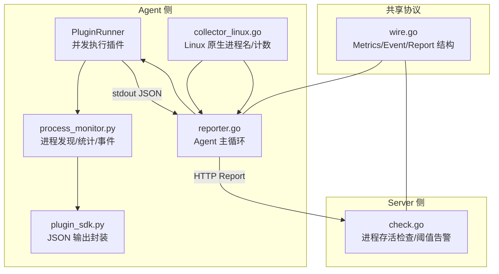
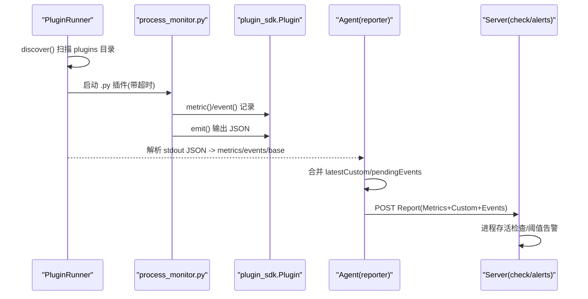
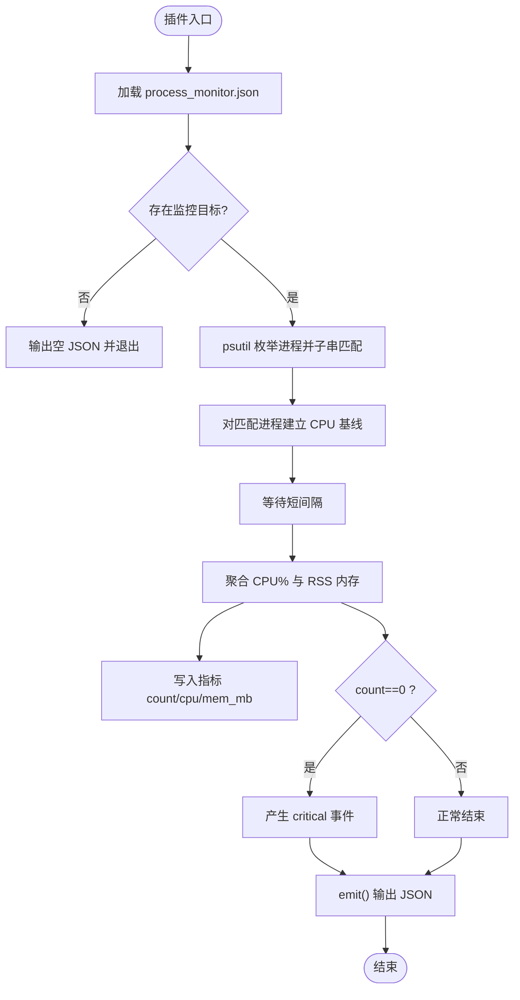
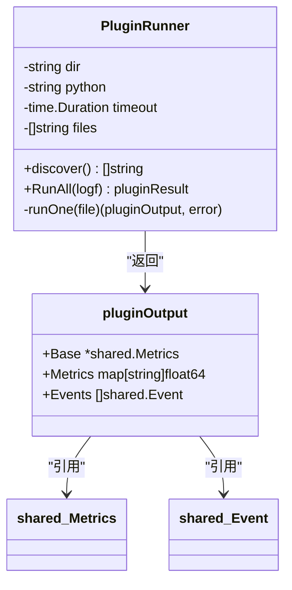
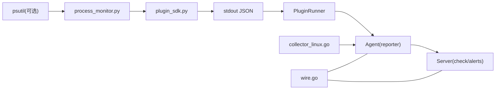

# 进程监控插件

<cite>
**本文引用的文件**   
- [plugins/process_monitor.py](file://plugins/process_monitor.py)
- [plugins/process_monitor.json](file://plugins/process_monitor.json)
- [plugins/plugin_sdk.py](file://plugins/plugin_sdk.py)
- [cmd/agent/plugins.go](file://cmd/agent/plugins.go)
- [cmd/agent/reporter.go](file://cmd/agent/reporter.go)
- [shared/wire.go](file://shared/wire.go)
- [cmd/agent/collector_linux.go](file://cmd/agent/collector_linux.go)
- [cmd/server/check.go](file://cmd/server/check.go)
</cite>

## 目录
1. [简介](#简介)
2. [项目结构](#项目结构)
3. [核心组件](#核心组件)
4. [架构总览](#架构总览)
5. [详细组件分析](#详细组件分析)
6. [依赖关系分析](#依赖关系分析)
7. [性能与可观测性](#性能与可观测性)
8. [故障排查指南](#故障排查指南)
9. [结论](#结论)
10. [附录：配置与使用](#附录配置与使用)

## 简介
本文件全面解析进程监控插件的技术实现，围绕以下目标展开：
- 深入剖析 process_monitor.py 的进程发现、状态监控与资源统计逻辑
- 说明跨平台差异处理与兼容性方案（Go 原生采集 + Python 插件兜底）
- 解释进程生命周期管理与异常检测算法（含服务端阈值与事件机制）
- 展示如何配置监控规则以跟踪关键业务进程
- 说明进程崩溃自动恢复与告警机制的实现细节
- 提供进程性能分析与瓶颈定位方法
- 结合生产环境场景与故障案例给出实操建议

## 项目结构
进程监控由“Agent 插件执行器 + Python 插件 + SDK + 共享协议”共同组成。Python 插件通过标准输出向 Go 核心上报指标与事件；Go 核心负责并发调度、超时控制、结果合并与上报。

图表来源
- [cmd/agent/plugins.go:102-172](file://cmd/agent/plugins.go#L102-L172)
- [plugins/process_monitor.py:1-86](file://plugins/process_monitor.py#L1-L86)
- [plugins/plugin_sdk.py:27-58](file://plugins/plugin_sdk.py#L27-L58)
- [cmd/agent/reporter.go:405-439](file://cmd/agent/reporter.go#L405-L439)
- [cmd/agent/collector_linux.go:427-505](file://cmd/agent/collector_linux.go#L427-L505)
- [shared/wire.go:120-138](file://shared/wire.go#L120-L138)
- [cmd/server/check.go:650-666](file://cmd/server/check.go#L650-L666)

章节来源
- [cmd/agent/plugins.go:102-172](file://cmd/agent/plugins.go#L102-L172)
- [plugins/process_monitor.py:1-86](file://plugins/process_monitor.py#L1-L86)
- [plugins/plugin_sdk.py:27-58](file://plugins/plugin_sdk.py#L27-L58)
- [cmd/agent/reporter.go:405-439](file://cmd/agent/reporter.go#L405-L439)
- [cmd/agent/collector_linux.go:427-505](file://cmd/agent/collector_linux.go#L427-L505)
- [shared/wire.go:120-138](file://shared/wire.go#L120-L138)
- [cmd/server/check.go:650-666](file://cmd/server/check.go#L650-L666)

## 核心组件
- Python 进程监控插件：基于 psutil 枚举进程、子串匹配、CPU/RSS 聚合、缺失时产生 critical 事件
- 插件 SDK：统一将指标与事件序列化为 JSON 输出到 stdout
- Agent 插件执行器：安全白名单发现、并发限制、超时隔离、结果合并
- 共享协议：定义 Metrics/Event/Report 等数据结构，贯穿 Agent 与 Server
- Linux 原生采集：读取 /proc 获取进程数与进程名列表，作为进程存活检查的数据源之一

章节来源
- [plugins/process_monitor.py:1-86](file://plugins/process_monitor.py#L1-L86)
- [plugins/plugin_sdk.py:27-58](file://plugins/plugin_sdk.py#L27-L58)
- [cmd/agent/plugins.go:62-100](file://cmd/agent/plugins.go#L62-L100)
- [cmd/agent/plugins.go:102-172](file://cmd/agent/plugins.go#L102-L172)
- [shared/wire.go:120-138](file://shared/wire.go#L120-L138)
- [cmd/agent/collector_linux.go:427-505](file://cmd/agent/collector_linux.go#L427-L505)

## 架构总览
下图展示了从插件发现、执行、结果合并到上报与服务器端检查的完整链路。

图表来源
- [cmd/agent/plugins.go:102-172](file://cmd/agent/plugins.go#L102-L172)
- [plugins/process_monitor.py:63-85](file://plugins/process_monitor.py#L63-L85)
- [plugins/plugin_sdk.py:48-58](file://plugins/plugin_sdk.py#L48-L58)
- [cmd/agent/reporter.go:423-439](file://cmd/agent/reporter.go#L423-L439)
- [cmd/server/check.go:650-666](file://cmd/server/check.go#L650-L666)

## 详细组件分析

### 进程监控插件（process_monitor.py）
- 配置文件加载：同目录 process_monitor.json 中 processes 数组为监控目标（子串匹配、不区分大小写）
- 进程发现：psutil.process_iter(["name"]) 遍历进程，按小写子串匹配归入目标集合
- CPU 采样策略：先对每个进程调用一次 cpu_percent(None) 建立基线，sleep 短间隔后再采样差值，得到更准确的瞬时占用
- 资源统计：聚合匹配进程的 CPU% 与 RSS 内存（MB），并产出指标 proc.<name>.count/cpu/mem_mb
- 异常检测：当 count=0 时产生 critical 事件，用于“关键进程是否存活”的强信号
- 容错设计：导入 psutil 失败或无 targets 时静默退出，避免影响 Agent 核心

图表来源
- [plugins/process_monitor.py:28-40](file://plugins/process_monitor.py#L28-L40)
- [plugins/process_monitor.py:42-61](file://plugins/process_monitor.py#L42-L61)
- [plugins/process_monitor.py:63-85](file://plugins/process_monitor.py#L63-L85)

章节来源
- [plugins/process_monitor.py:1-86](file://plugins/process_monitor.py#L1-L86)
- [plugins/process_monitor.json:1-5](file://plugins/process_monitor.json#L1-L5)

### 插件 SDK（plugin_sdk.py）
- 提供 Plugin 类，支持 metric(name, value)、event(level, message)、base(**fields)
- emit() 将 metrics/events/base 序列化为 JSON 输出到 stdout，供 Go 核心读取
- 约定：指标键自带命名空间；事件级别 info|warning|critical；插件应快速返回

章节来源
- [plugins/plugin_sdk.py:1-58](file://plugins/plugin_sdk.py#L1-L58)

### Agent 插件执行器（plugins.go）
- 安全发现：仅允许 .py/.sh 扩展，忽略 dotfiles 与 SDK 辅助文件
- 并发执行：最多 4 个并发子进程，避免大量 Python 进程同时创建导致抖动
- 超时隔离：每个插件独立 context.WithTimeout，挂起/崩溃不影响核心
- 结果合并：合并 base/custom metrics/events，并为事件补全 source 字段

图表来源
- [cmd/agent/plugins.go:45-55](file://cmd/agent/plugins.go#L45-L55)
- [cmd/agent/plugins.go:62-100](file://cmd/agent/plugins.go#L62-L100)
- [cmd/agent/plugins.go:102-172](file://cmd/agent/plugins.go#L102-L172)
- [shared/wire.go:120-138](file://shared/wire.go#L120-L138)

章节来源
- [cmd/agent/plugins.go:62-100](file://cmd/agent/plugins.go#L62-L100)
- [cmd/agent/plugins.go:102-172](file://cmd/agent/plugins.go#L102-L172)

### 共享协议（wire.go）
- Metrics：包含 CPU/内存/磁盘/网络/负载/进程数/进程名等基础指标
- Event：插件产生的离散事件（info|warning|critical）
- Report：Agent 每次上报的完整载荷（Host 信息 + Metrics + Custom + Events）

章节来源
- [shared/wire.go:12-53](file://shared/wire.go#L12-L53)
- [shared/wire.go:110-138](file://shared/wire.go#L110-L138)

### Linux 原生采集（collector_linux.go）
- readProcInfo：单次遍历 /proc 获取进程数与唯一进程名列表，减少 I/O
- readProcNameDegraded：优先读 /proc/[pid]/comm，权限不足时降级读 /proc/[pid]/cmdline 并提取 basename
- 受限标记：若全部 comm 被拦截且 cmdline 也失败，则返回 "restricted" 提示权限问题

章节来源
- [cmd/agent/collector_linux.go:427-505](file://cmd/agent/collector_linux.go#L427-L505)

### 服务器端进程检查与告警（check.go）
- 进程存活检查：根据 hostID 取最新进程名列表，进行不区分大小写的子串匹配
- 阈值告警：针对“进程存活失败次数”设置 warn/crit 阈值，达到后生成 check.proc_fail 类型告警
- 事件融合：插件产生的 events 与阈值告警并存，便于统一治理与路由

章节来源
- [cmd/server/check.go:650-666](file://cmd/server/check.go#L650-L666)
- [cmd/server/check.go:787-802](file://cmd/server/check.go#L787-L802)

## 依赖关系分析
- Python 插件依赖 psutil（可选）与本地 plugin_sdk.py
- Agent 插件执行器依赖操作系统能力（exec.CommandContext）、文件系统访问与并发原语
- 数据契约由 shared/wire.go 统一约束，确保 Agent 与 Server 结构一致
- Linux 原生采集与 Python 插件互补：前者提供系统级概览，后者提供业务进程维度细粒度指标

图表来源
- [plugins/process_monitor.py:20-24](file://plugins/process_monitor.py#L20-L24)
- [plugins/plugin_sdk.py:48-58](file://plugins/plugin_sdk.py#L48-L58)
- [cmd/agent/plugins.go:102-172](file://cmd/agent/plugins.go#L102-L172)
- [cmd/agent/reporter.go:423-439](file://cmd/agent/reporter.go#L423-L439)
- [cmd/agent/collector_linux.go:427-505](file://cmd/agent/collector_linux.go#L427-L505)
- [shared/wire.go:120-138](file://shared/wire.go#L120-L138)
- [cmd/server/check.go:650-666](file://cmd/server/check.go#L650-L666)

章节来源
- [plugins/process_monitor.py:20-24](file://plugins/process_monitor.py#L20-L24)
- [plugins/plugin_sdk.py:48-58](file://plugins/plugin_sdk.py#L48-L58)
- [cmd/agent/plugins.go:102-172](file://cmd/agent/plugins.go#L102-L172)
- [cmd/agent/reporter.go:423-439](file://cmd/agent/reporter.go#L423-L439)
- [cmd/agent/collector_linux.go:427-505](file://cmd/agent/collector_linux.go#L427-L505)
- [shared/wire.go:120-138](file://shared/wire.go#L120-L138)
- [cmd/server/check.go:650-666](file://cmd/server/check.go#L650-L666)

## 性能与可观测性
- 插件并发上限：默认最多 4 个并发 Python 子进程，避免进程风暴
- 超时保护：单个插件执行超时会被中断并记录，不影响其他插件与核心
- CPU 采样优化：先建立基线再采样差值，提高瞬时 CPU% 准确性
- 指标命名规范：建议以业务前缀命名（如 proc.nginx.*），避免冲突
- 事件降噪：插件事件与阈值告警并存，可在服务端做去重与抑制

[本节为通用指导，无需源码引用]

## 故障排查指南
- 插件未产出任何指标
  - 检查 process_monitor.json 是否配置了 processes 列表
  - 确认 Python 环境已安装 psutil；否则插件会静默退出
- 进程未被匹配
  - 确认进程名子串匹配策略与大小写不敏感行为
  - 在 Linux 上若 /proc/[pid]/comm 被安全模块拦截，会降级读取 cmdline；必要时检查权限
- 频繁 critical 事件
  - 确认业务进程确实在运行，或调整匹配规则
  - 结合服务端阈值与告警治理（静默/抑制/路由）降低噪声
- 插件执行缓慢或阻塞
  - 缩短插件 interval 需谨慎，避免过多并发
  - 检查 psutil 调用开销，必要时拆分插件或降低采样频率

章节来源
- [plugins/process_monitor.py:20-24](file://plugins/process_monitor.py#L20-L24)
- [plugins/process_monitor.py:28-40](file://plugins/process_monitor.py#L28-L40)
- [cmd/agent/collector_linux.go:476-505](file://cmd/agent/collector_linux.go#L476-L505)
- [cmd/server/check.go:787-802](file://cmd/server/check.go#L787-L802)

## 结论
进程监控插件通过“轻量 Python 插件 + 严格沙箱执行 + 统一 JSON 契约”的方式，实现了跨平台、可扩展的业务进程监控。配合 Linux 原生采集与服务端阈值/事件治理，既能满足“关键进程存活”的强信号需求，也能提供 CPU/内存等资源维度的细粒度观测。生产环境中建议结合告警治理与自动化剧本，形成“发现—告警—处置—验证”的闭环。

[本节为总结性内容，无需源码引用]

## 附录：配置与使用
- 配置监控目标
  - 编辑 plugins/process_monitor.json 的 processes 数组，填写需要监控的进程名字符串（子串匹配、不区分大小写）
- 启用与周期
  - Agent 启动参数 --plugin-interval 控制插件执行周期；--plugins-dir 指定插件目录
- 指标与事件
  - 指标：proc.<name>.count / proc.<name>.cpu / proc.<name>.mem_mb
  - 事件：当 count=0 时产生 critical 事件
- 进程存活检查（服务端）
  - 使用内置“进程存活”检查类型，依据主机最新进程名列表进行子串匹配
  - 可配置“进程存活失败次数”阈值，触发 check.proc_fail 告警
- 告警治理
  - 支持静默（时段/星期）、抑制（主因抑衍生）、路由（按级别/主机分流渠道）

章节来源
- [plugins/process_monitor.json:1-5](file://plugins/process_monitor.json#L1-L5)
- [plugins/process_monitor.py:63-85](file://plugins/process_monitor.py#L63-L85)
- [cmd/server/check.go:650-666](file://cmd/server/check.go#L650-L666)
- [cmd/server/check.go:787-802](file://cmd/server/check.go#L787-L802)