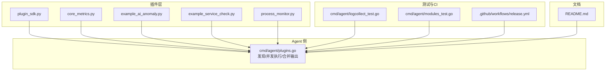
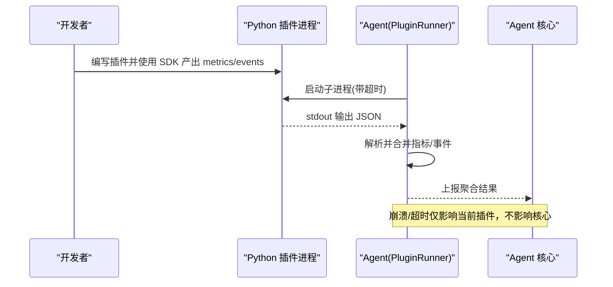
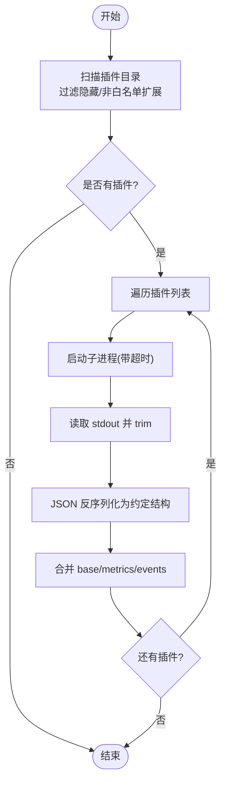
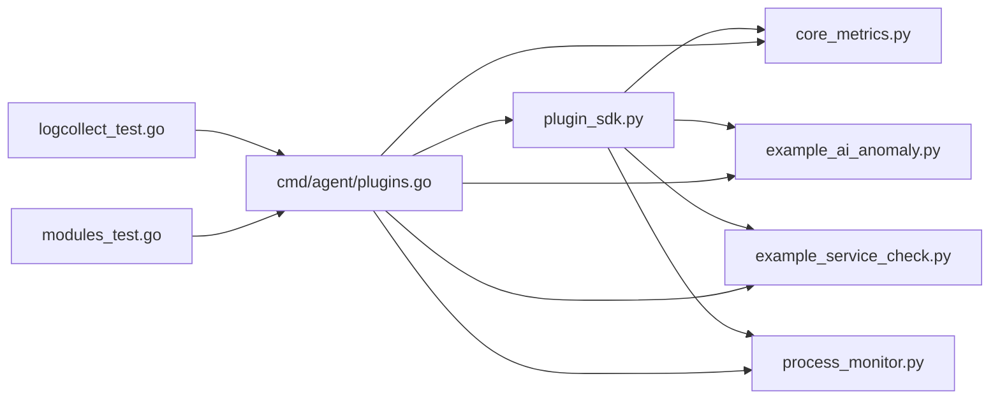

# 调试与测试

<cite>
**本文引用的文件**   
- [README.md](file://README.md)
- [plugins/plugin_sdk.py](file://plugins/plugin_sdk.py)
- [plugins/core_metrics.py](file://plugins/core_metrics.py)
- [plugins/example_ai_anomaly.py](file://plugins/example_ai_anomaly.py)
- [plugins/example_service_check.py](file://plugins/example_service_check.py)
- [plugins/process_monitor.py](file://plugins/process_monitor.py)
- [cmd/agent/plugins.go](file://cmd/agent/plugins.go)
- [cmd/agent/logcollect_test.go](file://cmd/agent/logcollect_test.go)
- [cmd/agent/modules_test.go](file://cmd/agent/modules_test.go)
- [.github/workflows/release.yml](file:.github/workflows/release.yml)
</cite>

## 目录
1. [简介](#简介)
2. [项目结构](#项目结构)
3. [核心组件](#核心组件)
4. [架构总览](#架构总览)
5. [详细组件分析](#详细组件分析)
6. [依赖关系分析](#依赖关系分析)
7. [性能考虑](#性能考虑)
8. [故障排查指南](#故障排查指南)
9. [结论](#结论)
10. [附录](#附录)

## 简介
本指南聚焦于插件层的调试与测试，覆盖本地开发环境搭建、IDE 配置、调试技巧（日志、断点、性能与内存）、单元测试与集成测试规范、端到端验证方法以及持续集成流水线。目标是帮助开发者快速定位问题、稳定迭代插件，并确保与 Agent 的交互符合预期。

## 项目结构
与插件调试和测试直接相关的目录与文件：
- 插件 SDK 与示例：plugins/*.py
- Agent 侧插件加载器：cmd/agent/plugins.go
- 现有测试用例：cmd/agent/*_test.go
- CI 构建与镜像发布：.github/workflows/release.yml
- 用户文档与环境说明：README.md

图表来源
- [plugins/plugin_sdk.py:1-58](file://plugins/plugin_sdk.py#L1-L58)
- [plugins/core_metrics.py:1-65](file://plugins/core_metrics.py#L1-L65)
- [plugins/example_ai_anomaly.py:1-70](file://plugins/example_ai_anomaly.py#L1-L70)
- [plugins/example_service_check.py:1-41](file://plugins/example_service_check.py#L1-L41)
- [plugins/process_monitor.py:1-86](file://plugins/process_monitor.py#L1-L86)
- [cmd/agent/plugins.go:1-178](file://cmd/agent/plugins.go#L1-L178)
- [cmd/agent/logcollect_test.go:1-84](file://cmd/agent/logcollect_test.go#L1-L84)
- [cmd/agent/modules_test.go:1-68](file://cmd/agent/modules_test.go#L1-L68)
- [.github/workflows/release.yml](file:.github/workflows/release.yml#L1-L130)
- [README.md:383-435](file://README.md#L383-L435)

章节来源
- [README.md:383-435](file://README.md#L383-L435)

## 核心组件
- 插件 SDK：提供 metric/event/base 等便捷 API，最终将结果以 JSON 写入 stdout，供 Go 核心读取。
- 插件加载器（Agent）：扫描 plugins 目录，按白名单扩展名发现可执行脚本；并发运行并合并指标与事件；对崩溃/超时进行隔离处理。
- 示例插件：基础指标兜底、异常检测、服务健康检查、进程监控等，覆盖常见采集场景。
- 测试与 CI：Go 侧已有部分测试；CI 负责多架构镜像构建与推送。

章节来源
- [plugins/plugin_sdk.py:1-58](file://plugins/plugin_sdk.py#L1-L58)
- [cmd/agent/plugins.go:1-178](file://cmd/agent/plugins.go#L1-L178)
- [plugins/core_metrics.py:1-65](file://plugins/core_metrics.py#L1-L65)
- [plugins/example_ai_anomaly.py:1-70](file://plugins/example_ai_anomaly.py#L1-L70)
- [plugins/example_service_check.py:1-41](file://plugins/example_service_check.py#L1-L41)
- [plugins/process_monitor.py:1-86](file://plugins/process_monitor.py#L1-L86)

## 架构总览
插件作为独立子进程被 Agent 调度执行，通过标准输入输出与 Agent 通信。SDK 简化了数据产出格式，Agent 负责并发控制、超时保护、输出解析与聚合。

图表来源
- [cmd/agent/plugins.go:102-172](file://cmd/agent/plugins.go#L102-L172)
- [plugins/plugin_sdk.py:27-58](file://plugins/plugin_sdk.py#L27-L58)

## 详细组件分析

### 插件 SDK 与约定
- 约定输出字段：metrics（自定义指标）、events（离散事件）、base（基础指标，非 Linux 兜底）。
- SDK 方法：metric(name, value)、event(level, message)、base(**fields)、emit()。
- 命名建议：指标 key 建议带命名空间，避免冲突。
- 健壮性：插件应快速返回，崩溃/超时不会影响 Agent 核心。

章节来源
- [plugins/plugin_sdk.py:1-58](file://plugins/plugin_sdk.py#L1-L58)

### Agent 插件加载器（PluginRunner）
- 发现策略：仅允许 .py/.sh 扩展名，忽略隐藏文件与 SDK/requirements.txt。
- 并发执行：限制最大并发数，避免同时拉起过多 Python 进程。
- 超时保护：为每个插件设置上下文超时，挂起不会阻塞其他插件。
- 输出合并：统一解析 JSON，填充 source 字段，合并 base/metrics/events。

图表来源
- [cmd/agent/plugins.go:62-100](file://cmd/agent/plugins.go#L62-L100)
- [cmd/agent/plugins.go:102-172](file://cmd/agent/plugins.go#L102-L172)

章节来源
- [cmd/agent/plugins.go:1-178](file://cmd/agent/plugins.go#L1-L178)

### 示例插件要点
- core_metrics.py：在非 Linux 平台提供 CPU/内存/磁盘/网络/负载/进程数/运行时长等基础指标兜底。
- example_ai_anomaly.py：基于滚动窗口计算 z-score 判定 CPU 异常，持久化状态到本地文件。
- example_service_check.py：TCP 端口连通性与时延探测，不可达产生 critical 事件。
- process_monitor.py：从同目录配置文件读取目标进程名，统计 count/cpu/mem，缺失则告警。

章节来源
- [plugins/core_metrics.py:1-65](file://plugins/core_metrics.py#L1-L65)
- [plugins/example_ai_anomaly.py:1-70](file://plugins/example_ai_anomaly.py#L1-L70)
- [plugins/example_service_check.py:1-41](file://plugins/example_service_check.py#L1-L41)
- [plugins/process_monitor.py:1-86](file://plugins/process_monitor.py#L1-L86)

### 本地开发环境搭建
- Python 环境
  - 版本：建议使用 Python 3.8+（与 psutil 兼容）。
  - 虚拟环境：推荐 venv/conda 隔离依赖。
  - 依赖安装：进入 plugins 目录，使用 requirements.txt 安装可选依赖（如 psutil）。
- Agent 配置
  - 在 config.json 中指定 plugins_dir 与 python 解释器路径。
  - 调整 plugin_interval 控制插件执行周期。
- IDE 设置
  - VS Code：安装 Python 扩展，配置解释器指向虚拟环境；为插件目录添加断点；在终端中以仓库根目录运行 Agent，确保能定位到 plugins/。
  - PyCharm：创建 Python 运行配置，Working directory 指向仓库根目录，Program 指向 aiops-agent 二进制或 go run ./cmd/agent，并在 plugins 目录打断点。
- 快速验证
  - 启动 Agent 后，观察控制台是否打印“插件执行失败”等日志；在插件中增加 print 输出便于定位。

章节来源
- [README.md:383-435](file://README.md#L383-L435)
- [plugins/requirements.txt:1-4](file://plugins/requirements.txt#L1-L4)

### 调试技巧
- 日志输出
  - 插件侧：在关键路径增加 print 输出，注意不要污染 stdout 的 JSON 输出（仅在调试分支打印）。
  - Agent 侧：查看控制台日志中的“插件执行失败”信息，包含错误原因。
- 断点调试
  - 在插件函数入口、SDK emit 前、外部 IO（网络/文件）前后设置断点。
  - 使用 IDE 的 Attach to Process 或直接在插件代码中触发断点。
- 性能分析
  - 使用 cProfile 对插件热点函数采样，识别耗时瓶颈。
  - 关注多个插件叠加 sleep/delay 导致的整体延迟。
- 内存泄漏检测
  - 使用 tracemalloc 或 memory_profiler 对比插件生命周期内内存变化。
  - 避免长时间持有大对象引用；及时关闭文件句柄和网络连接。

[本节为通用指导，不直接分析具体文件]

### 单元测试框架与编写规范
- 测试框架
  - Go 侧：使用内置 testing 包，参考 cmd/agent/*_test.go 的写法。
  - Python 侧：可使用 unittest/pytest 对插件逻辑进行单测（例如模拟 psutil、网络 IO）。
- 测试要点
  - 模拟数据生成：构造不同长度的历史样本、边界值（零、负数、极大值）。
  - 边界条件：空目录、无权限、文件损坏、网络超时、进程枚举异常。
  - 异常场景：非法 JSON 输出、超长字符串、缺失必要字段。
- 现有测试参考
  - logcollect_test.go：验证日志目标展开与加密封装。
  - modules_test.go：验证模块分发与参数校验。

章节来源
- [cmd/agent/logcollect_test.go:1-84](file://cmd/agent/logcollect_test.go#L1-L84)
- [cmd/agent/modules_test.go:1-68](file://cmd/agent/modules_test.go#L1-L68)

### 集成测试与端到端验证
- 与 Agent 交互
  - 启动 Agent，放置插件到 plugins 目录，确认插件被自动发现并按周期执行。
  - 通过服务端面板或 API 查看指标与事件是否出现。
- 端到端流程
  - 插件产出 → Agent 解析合并 → 上报至服务端 → 存储/告警 → 通知渠道。
  - 可通过临时修改阈值或静默规则，验证告警链路。
- 工具辅助
  - 使用 httptest 在服务端侧模拟下游依赖，或在插件侧 mock 外部服务。

[本节为通用指导，不直接分析具体文件]

### 持续集成与自动化测试流水线
- 当前 CI
  - GitHub Actions 工作流在推送 v* 标签时构建多架构镜像并推送到华为云 SWR。
- 建议补充
  - 在 PR 触发 go build + go vet + go test。
  - 对 Python 插件执行 lint 与基本测试（如 pytest）。
  - 前端 JS 语法检查（如有需要）。

章节来源
- [.github/workflows/release.yml:1-L130](file:.github/workflows/release.yml#L1-L130)

## 依赖关系分析
- 插件与 SDK：所有示例插件均依赖 plugin_sdk.py 提供的 API。
- Agent 与插件：Agent 通过命令行调用 Python 解释器执行插件，严格解析 stdout JSON。
- 测试与代码：Go 测试覆盖 Agent 侧部分能力；Python 插件尚未见集中测试文件。

图表来源
- [plugins/plugin_sdk.py:1-58](file://plugins/plugin_sdk.py#L1-L58)
- [plugins/core_metrics.py:1-65](file://plugins/core_metrics.py#L1-L65)
- [plugins/example_ai_anomaly.py:1-70](file://plugins/example_ai_anomaly.py#L1-L70)
- [plugins/example_service_check.py:1-41](file://plugins/example_service_check.py#L1-L41)
- [plugins/process_monitor.py:1-86](file://plugins/process_monitor.py#L1-L86)
- [cmd/agent/plugins.go:1-178](file://cmd/agent/plugins.go#L1-L178)
- [cmd/agent/logcollect_test.go:1-84](file://cmd/agent/logcollect_test.go#L1-L84)
- [cmd/agent/modules_test.go:1-68](file://cmd/agent/modules_test.go#L1-L68)

章节来源
- [cmd/agent/plugins.go:1-178](file://cmd/agent/plugins.go#L1-L178)

## 性能考虑
- 并发上限：Agent 限制并发插件数为固定值，避免资源争用。
- 超时保护：单个插件超时不会阻塞其他插件。
- 采样延迟：示例插件存在多次 sleep/delay，建议在批量场景下参数化或共享时钟以减少叠加延迟。
- 指标命名：保持命名空间一致，避免重复计算与聚合开销。

章节来源
- [cmd/agent/plugins.go:102-172](file://cmd/agent/plugins.go#L102-L172)
- [plugins/core_metrics.py:37-41](file://plugins/core_metrics.py#L37-L41)
- [plugins/example_ai_anomaly.py:17-26](file://plugins/example_ai_anomaly.py#L17-L26)
- [plugins/process_monitor.py:54-61](file://plugins/process_monitor.py#L54-L61)

## 故障排查指南
- 插件未执行
  - 检查 plugins_dir 与 python 路径是否正确。
  - 确认插件文件名不在黑名单且扩展名为 .py/.sh。
- 插件崩溃/超时
  - 查看 Agent 控制台日志中的“插件执行失败”信息。
  - 在插件关键路径增加 print 输出，定位异常位置。
- 指标未上报
  - 确认插件 stdout 输出为合法 JSON，且包含 metrics 字段。
  - 核对指标命名是否符合命名空间约定。
- 事件未触发
  - 检查 events.level 是否为 info/warning/critical。
  - 确认服务端阈值与治理规则未抑制该事件。
- 日志采集问题
  - 参考现有测试用例，验证日志目标展开与加密封装逻辑。

章节来源
- [cmd/agent/plugins.go:124-146](file://cmd/agent/plugins.go#L124-L146)
- [cmd/agent/logcollect_test.go:51-84](file://cmd/agent/logcollect_test.go#L51-L84)

## 结论
通过 SDK 与 Agent 的解耦设计，插件开发简洁且具备高容错性。结合完善的本地调试手段、规范的测试方法与持续的 CI 流水线，可有效保障插件质量与系统稳定性。建议逐步完善 Python 插件测试覆盖，并在 CI 中加入静态检查与基础测试步骤。

## 附录
- 环境变量与配置覆盖：参考 README 的配置与环境变量说明，便于在 Docker 或生产环境中灵活调整。
- 安全建议：确保 plugins 目录权限最小化，避免任意执行风险。

章节来源
- [README.md:556-576](file://README.md#L556-L576)