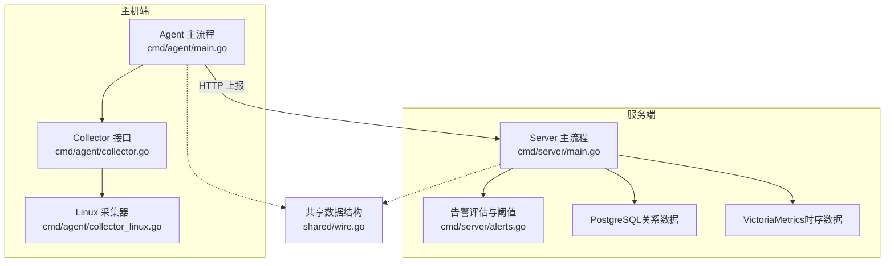
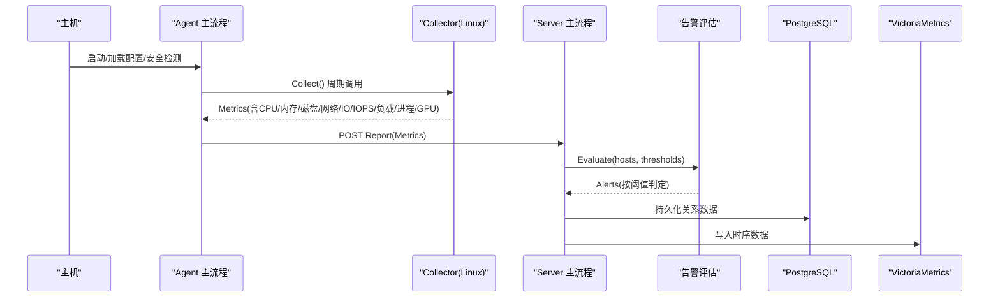
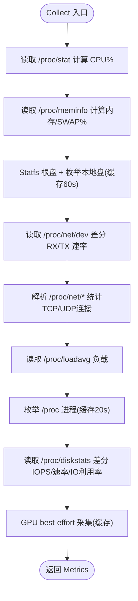
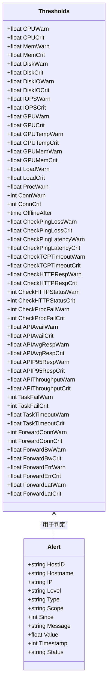
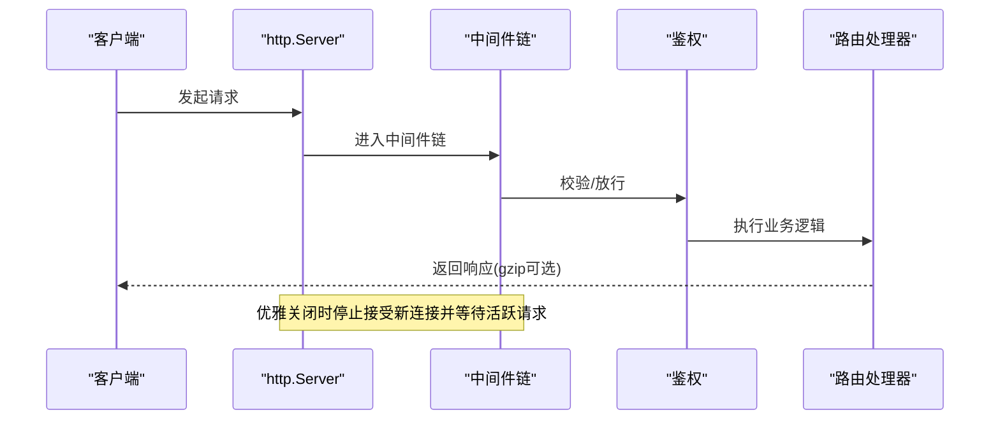
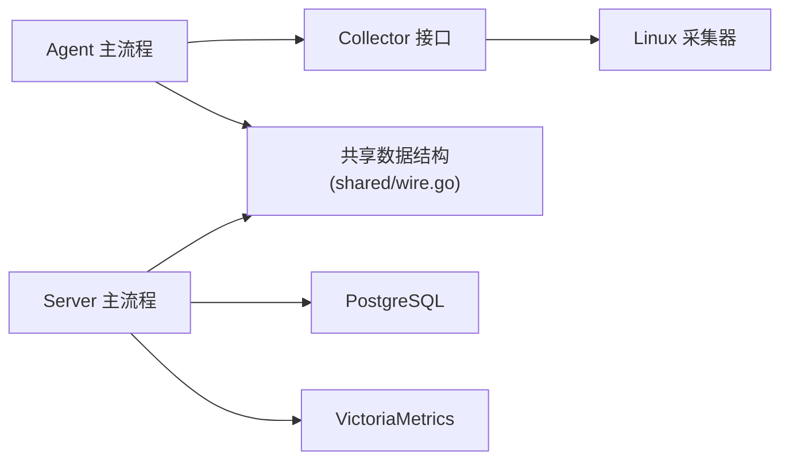

# 性能问题诊断

<cite>
**本文引用的文件**   
- [README.md](file://README.md)
- [cmd/agent/main.go](file://cmd/agent/main.go)
- [cmd/server/main.go](file://cmd/server/main.go)
- [cmd/agent/collector.go](file://cmd/agent/collector.go)
- [cmd/agent/collector_linux.go](file://cmd/agent/collector_linux.go)
- [cmd/server/alerts.go](file://cmd/server/alerts.go)
- [shared/wire.go](file://shared/wire.go)
</cite>

## 目录
1. [简介](#简介)
2. [项目结构](#项目结构)
3. [核心组件](#核心组件)
4. [架构总览](#架构总览)
5. [详细组件分析](#详细组件分析)
6. [依赖关系分析](#依赖关系分析)
7. [性能考量与容量规划](#性能考量与容量规划)
8. [常见问题排查指南](#常见问题排查指南)
9. [结论](#结论)
10. [附录：指标、阈值与工具清单](#附录指标阈值与工具清单)

## 简介
本指南面向运维与SRE工程师，聚焦如何在本系统（AIOps Monitor）中识别和诊断性能瓶颈，包括CPU使用率过高、内存泄漏、磁盘IO瓶颈、网络延迟等。文档结合源码实现，给出监控指标含义、阈值建议、常见问题的定位步骤与优化建议，并补充基准与压力测试的实践方法。

## 项目结构
本项目采用“Agent + Server”的混合架构：
- Agent侧负责跨平台原生采集基础指标（CPU/内存/磁盘/网络/TCP连接/负载/进程/GPU），并通过HTTP上报到服务端。
- Server侧接收指标、持久化至PostgreSQL（关系数据）与VictoriaMetrics（时序数据），提供告警、拨测、API监控、转发、终端、AI巡检等能力。

图示来源
- [cmd/agent/main.go:74-237](file://cmd/agent/main.go#L74-L237)
- [cmd/agent/collector.go:1-32](file://cmd/agent/collector.go#L1-L32)
- [cmd/agent/collector_linux.go:76-209](file://cmd/agent/collector_linux.go#L76-L209)
- [cmd/server/main.go:227-354](file://cmd/server/main.go#L227-L354)
- [cmd/server/alerts.go:1-58](file://cmd/server/alerts.go#L1-L58)
- [shared/wire.go:1-53](file://shared/wire.go#L1-L53)

章节来源
- [README.md:179-380](file://README.md#L179-L380)
- [cmd/agent/main.go:74-237](file://cmd/agent/main.go#L74-L237)
- [cmd/server/main.go:227-354](file://cmd/server/main.go#L227-L354)

## 核心组件
- Agent 主流程：加载配置、安全环境检测、Relay 模式、启动采集与插件执行、信号处理与优雅退出。
- Collector 接口与平台实现：统一抽象，Linux 通过 /proc 与 syscall 采集；Windows/macOS 对应实现。
- 共享数据结构：定义 Metrics、Report、Event 等协议类型，确保前后端一致。
- Server 主流程：初始化存储（PG+VM）、中间件（CORS、gzip、限体、安全头）、路由、后台任务（告警、拨测、API监控、调度、SLO、AI巡检、VM写入）。
- 告警与阈值：内置保守/标准/宽松三档阈值，覆盖 CPU/内存/磁盘/IO/IOPS/GPU/负载/进程/连接/拨测/API/任务/转发等维度。

章节来源
- [cmd/agent/main.go:74-237](file://cmd/agent/main.go#L74-L237)
- [cmd/agent/collector.go:1-32](file://cmd/agent/collector.go#L1-L32)
- [cmd/agent/collector_linux.go:76-209](file://cmd/agent/collector_linux.go#L76-L209)
- [shared/wire.go:1-53](file://shared/wire.go#L1-L53)
- [cmd/server/main.go:227-354](file://cmd/server/main.go#L227-L354)
- [cmd/server/alerts.go:1-58](file://cmd/server/alerts.go#L1-L58)

## 架构总览
下图展示从采集到告警的关键路径与数据流向。

图示来源
- [cmd/agent/main.go:219-236](file://cmd/agent/main.go#L219-L236)
- [cmd/agent/collector_linux.go:76-209](file://cmd/agent/collector_linux.go#L76-L209)
- [cmd/server/main.go:286-292](file://cmd/server/main.go#L286-L292)
- [cmd/server/alerts.go:204-464](file://cmd/server/alerts.go#L204-L464)
- [shared/wire.go:120-138](file://shared/wire.go#L120-L138)

## 详细组件分析

### 指标采集与计算（Linux）
- CPU：读取 /proc/stat，差分 idle/total 得到使用率。
- 内存/SWAP：读取 /proc/meminfo，计算总量、可用量与使用百分比。
- 磁盘：对根盘 Statfs 获取总量/已用；枚举所有本地挂载点，过滤伪文件系统，缓存60秒。
- 网络：读取 /proc/net/dev，差分 RX/TX 字节数得到速率。
- TCP/UDP：解析 /proc/net/tcp* 与 udp*，统计各状态计数与总数。
- 负载：读取 /proc/loadavg。
- 进程：枚举 /proc，合并计数与名称列表，20秒缓存。
- IO：读取 /proc/diskstats，累计读写字节与I/O次数，差分得到速率与IOPS，估算IO利用率。
- GPU：优先 nvidia-smi，其次 amdgpu sysfs，macOS ioreg，best-effort 且缓存。

图示来源
- [cmd/agent/collector_linux.go:76-209](file://cmd/agent/collector_linux.go#L76-L209)
- [cmd/agent/collector_linux.go:252-312](file://cmd/agent/collector_linux.go#L252-L312)
- [cmd/agent/collector_linux.go:314-340](file://cmd/agent/collector_linux.go#L314-L340)
- [cmd/agent/collector_linux.go:353-378](file://cmd/agent/collector_linux.go#L353-L378)
- [cmd/agent/collector_linux.go:399-412](file://cmd/agent/collector_linux.go#L399-L412)
- [cmd/agent/collector_linux.go:432-474](file://cmd/agent/collector_linux.go#L432-L474)
- [cmd/agent/collector_linux.go:584-616](file://cmd/agent/collector_linux.go#L584-L616)

章节来源
- [cmd/agent/collector.go:1-32](file://cmd/agent/collector.go#L1-L32)
- [cmd/agent/collector_linux.go:76-209](file://cmd/agent/collector_linux.go#L76-L209)

### 告警评估与阈值
- 支持三类预设：保守（敏感）、标准（推荐默认）、宽松（低噪）。
- 覆盖指标：CPU/内存/磁盘/磁盘IO/IOPS/GPU/负载/进程异常/连接数/离线判定/拨测/Ping/TCP/HTTP/进程存活/API可用率与P95/吞吐量/定时任务失败与超时/端口转发连接/带宽/错误率/延迟。
- 评估逻辑：基于最新样本与阈值比较，生成告警对象，包含级别、类型、范围与作用域。

图示来源
- [cmd/server/alerts.go:19-52](file://cmd/server/alerts.go#L19-L52)
- [cmd/server/alerts.go:165-178](file://cmd/server/alerts.go#L165-L178)

章节来源
- [cmd/server/alerts.go:54-163](file://cmd/server/alerts.go#L54-L163)
- [cmd/server/alerts.go:204-464](file://cmd/server/alerts.go#L204-L464)

### 服务端关键路径与中间件
- 中间件链：安全头 → CORS → gzip → 请求体限制 → 鉴权 → 路由。
- gzip 压缩：对多数JSON响应进行压缩，WebSocket/代理/终端流跳过缓冲。
- 请求体限制：防止超大JSON导致内存耗尽。
- 优雅关闭：SIGINT/SIGTERM 触发HTTP服务停止、刷新PG状态后退出。
- 存储绑定：强制要求 PG 与 VM 环境变量，未配置拒绝启动。

图示来源
- [cmd/server/main.go:72-136](file://cmd/server/main.go#L72-L136)
- [cmd/server/main.go:138-205](file://cmd/server/main.go#L138-L205)
- [cmd/server/main.go:294-323](file://cmd/server/main.go#L294-L323)
- [cmd/server/main.go:255-272](file://cmd/server/main.go#L255-L272)

章节来源
- [cmd/server/main.go:227-354](file://cmd/server/main.go#L227-L354)

## 依赖关系分析
- Agent 与 Server 通过 shared/wire.go 定义的 Report/Metrics 契约通信，避免接口漂移。
- Linux 采集器依赖 /proc 与 syscall，零第三方依赖；Windows/macOS 分别使用 Win32 API/sysctl。
- Server 依赖 PG（关系数据）与 VM（时序数据），二者缺一不可。

图示来源
- [cmd/agent/main.go:219-236](file://cmd/agent/main.go#L219-L236)
- [cmd/agent/collector.go:1-32](file://cmd/agent/collector.go#L1-L32)
- [cmd/agent/collector_linux.go:76-209](file://cmd/agent/collector_linux.go#L76-L209)
- [shared/wire.go:1-53](file://shared/wire.go#L1-L53)
- [cmd/server/main.go:255-272](file://cmd/server/main.go#L255-L272)

章节来源
- [shared/wire.go:1-53](file://shared/wire.go#L1-L53)
- [cmd/server/main.go:255-272](file://cmd/server/main.go#L255-L272)

## 性能考量与容量规划
- 带宽：gzip 压缩使多主机轮询 JSON 体积降低约8-10倍，3000主机每3秒轮询可降至约100KB/s。
- 上报吞吐：3000主机×每10秒≈300次写入/秒，Upsert短暂持有写锁。
- 内存占用：每主机三层历史约1-2MB，3000主机约4-7GB（可通过保留策略调整）。
- 渲染：主机列表分页（每页9条），仅渲染当前页DOM。
- 调优：增大上报间隔（如10-15秒）可降低大集群带宽压力。

章节来源
- [README.md:1003-1012](file://README.md#L1003-L1012)

## 常见问题排查指南

### CPU使用率过高
- 现象：CPU%持续高于阈值，或负载（Load5）超过核心数×阈值。
- 定位步骤：
  - 查看主机卡片趋势图，确认是否突增或长期高位。
  - 检查进程名列表与进程数变化，判断是否存在进程异常增长。
  - 核对负载与CPU%相关性，若负载高但CPU%不高，可能为IO阻塞或等待。
- 相关指标：cpu_percent、load5、proc_count、process_names。
- 参考阈值：标准档 CPU警告80%/严重95%，负载警告4.0×核、严重8.0×核。
- 优化建议：
  - 缩短采集间隔会放大带宽与CPU开销，适当放宽至10-15秒。
  - 针对热点进程进行代码级剖析（外部工具），在业务层做限流/降级。

章节来源
- [cmd/server/alerts.go:228-274](file://cmd/server/alerts.go#L228-L274)
- [cmd/server/alerts.go:330-351](file://cmd/server/alerts.go#L330-L351)
- [cmd/agent/collector_linux.go:76-92](file://cmd/agent/collector_linux.go#L76-L92)
- [cmd/agent/collector_linux.go:399-412](file://cmd/agent/collector_linux.go#L399-L412)

### 内存泄漏
- 现象：MemPercent持续上升，SwapUsed增加，进程数异常波动。
- 定位步骤：
  - 观察内存与SWAP趋势，确认是否单调递增。
  - 对比进程数与进程名，定位可疑进程。
  - 结合日志采集（error/warn）与事件（plugin event）辅助定位。
- 相关指标：mem_percent、swap_percent、proc_count、process_names。
- 参考阈值：标准档 内存警告85%/严重95%。
- 优化建议：
  - 对可疑进程进行堆栈/内存剖析（外部工具）。
  - 合理设置GC参数（应用层），减少长生命周期对象引用。

章节来源
- [cmd/server/alerts.go:235-241](file://cmd/server/alerts.go#L235-L241)
- [cmd/agent/collector_linux.go:94-109](file://cmd/agent/collector_linux.go#L94-L109)
- [cmd/agent/collector_linux.go:432-474](file://cmd/agent/collector_linux.go#L432-L474)

### 磁盘IO瓶颈
- 现象：DiskIOUtilPercent升高，IOPS飙升，读写速率异常。
- 定位步骤：
  - 查看磁盘IO利用率与IOPS趋势，确认是否为突发或持续。
  - 结合磁盘使用率与挂载点，定位具体卷。
  - 关联日志采集，查找大量写入或数据库慢查询。
- 相关指标：disk_io_util_percent、disk_read_rate、disk_write_rate、disk_read_iops、disk_write_iops。
- 参考阈值：标准档 IO利用率警告80%/严重95%，IOPS警告50000/严重100000。
- 优化建议：
  - 调整写入批大小与刷盘策略，减少随机写。
  - 扩容磁盘或迁移热数据至更快介质。

章节来源
- [cmd/server/alerts.go:308-329](file://cmd/server/alerts.go#L308-L329)
- [cmd/agent/collector_linux.go:148-167](file://cmd/agent/collector_linux.go#L148-L167)
- [cmd/agent/collector_linux.go:584-616](file://cmd/agent/collector_linux.go#L584-L616)

### 网络延迟与连接异常
- 现象：拨测HTTP/TCP/Ping出现高延迟或丢包；TCP连接数激增（TIME_WAIT/CLOSE_WAIT）。
- 定位步骤：
  - 查看拨测结果与趋势，确认是链路问题还是目标服务问题。
  - 检查TCP状态分布，关注异常状态占比。
  - 结合端口转发监控（连接数/带宽/错误率/延迟）定位隧道瓶颈。
- 相关指标：check_http_resp、check_tcp_timeout、check_ping_latency、conns（按状态）、forward_*。
- 参考阈值：标准档 HTTP响应警告1000ms/严重5000ms，TCP超时警告1000ms/严重5000ms，Ping延迟警告100ms/严重500ms。
- 优化建议：
  - 调整连接池与超时参数，避免连接泄漏。
  - 启用连接复用与KeepAlive，减少握手开销。

章节来源
- [cmd/server/alerts.go:111-127](file://cmd/server/alerts.go#L111-L127)
- [cmd/server/alerts.go:466-516](file://cmd/server/alerts.go#L466-L516)
- [cmd/agent/collector_linux.go:353-378](file://cmd/agent/collector_linux.go#L353-L378)

### 服务器自身性能（Server）
- 现象：面板卡顿、API响应慢、内存持续增长。
- 定位步骤：
  - 检查中间件链是否开启gzip（应开启），确认请求体限制是否过小。
  - 观察PG与VM写入是否成为瓶颈（延迟/错误）。
  - 查看告警评估与拨测循环是否过于频繁。
- 优化建议：
  - 合理设置上报间隔与批量大小。
  - 将大规模场景的时序数据外置至VM（已默认）。
  - 在必要时扩展Server实例或使用反向代理负载均衡。

章节来源
- [cmd/server/main.go:186-205](file://cmd/server/main.go#L186-L205)
- [cmd/server/main.go:138-145](file://cmd/server/main.go#L138-L145)
- [cmd/server/main.go:286-292](file://cmd/server/main.go#L286-L292)

## 结论
通过Agent原生采集与Server阈值评估，系统提供了全面的性能观测与告警能力。结合合理的阈值设定、采集间隔与存储后端（PG+VM），可在数千主机规模下保持稳定运行。针对典型瓶颈（CPU/内存/IO/网络），可按本文步骤快速定位并实施优化。

## 附录：指标、阈值与工具清单

### 关键指标与含义
- CPU：cpu_percent（使用率）、load1/5/15（系统负载）
- 内存：mem_total/used/percent、swap_total/used/percent
- 磁盘：disk_total/used/percent、disks[]（分卷）
- 网络：net_sent_rate、net_recv_rate、conns[]（按协议/状态）
- IO：disk_read_rate、disk_write_rate、disk_io_util_percent、disk_read_iops、disk_write_iops
- 进程：proc_count、process_names[]
- GPU：util_percent、mem_used/total/percent、temp
- 拨测：check_http_resp、check_tcp_timeout、check_ping_latency、check_proc_fail
- API监控：api_avail_percent、api_avg_resp_ms、api_p95_resp_ms、api_throughput_rps
- 任务：task_fail_count、task_timeout_sec
- 转发：forward_conn/bw/err/lat

章节来源
- [shared/wire.go:12-53](file://shared/wire.go#L12-L53)
- [cmd/server/alerts.go:19-52](file://cmd/server/alerts.go#L19-L52)

### 阈值建议（标准档）
- CPU：警告80%/严重95%
- 内存：警告85%/严重95%
- 磁盘：警告80%/严重90%
- 磁盘IO：警告80%/严重95%
- IOPS：警告50000/严重100000
- GPU：警告80%/严重95%
- 负载：警告4.0×核/严重8.0×核
- 进程变化：0.5（±50%）
- 拨测：Ping丢包10%/30%，延迟100ms/500ms；TCP超时1000ms/5000ms；HTTP响应1000ms/5000ms
- API：可用率99%/95%，平均响应500ms/2000ms，P95 1000ms/5000ms，吞吐100/10 req/s
- 任务：失败1/5次，超时60s/300s
- 转发：连接200/280，带宽80%/95%，错误率5%/15%，延迟1000ms/5000ms

章节来源
- [cmd/server/alerts.go:97-127](file://cmd/server/alerts.go#L97-L127)
- [README.md:446-477](file://README.md#L446-L477)

### 性能分析与工具实践
- 采集侧（Agent）：
  - 调整 --interval 与 --plugin-interval，平衡实时性与资源消耗。
  - 使用 --log-paths 采集关键日志，配合 error/warn 级别筛选。
- 服务端（Server）：
  - 启用 gzip 压缩，减少带宽。
  - 合理设置请求体限制，避免内存溢出。
  - 观察PG与VM写入延迟与错误，必要时扩容或优化索引。
- 外部工具（通用建议）：
  - CPU/内存剖析：perf、pprof、eBPF工具集（bpftrace/perf-tools）。
  - IO剖析：iostat、iotop、blktrace。
  - 网络剖析：ss、tcpdump、iperf3。
  - 压测：wrk、ab、locust、jmeter（针对API/拨测目标）。

[本节为通用指导，不直接分析具体文件]