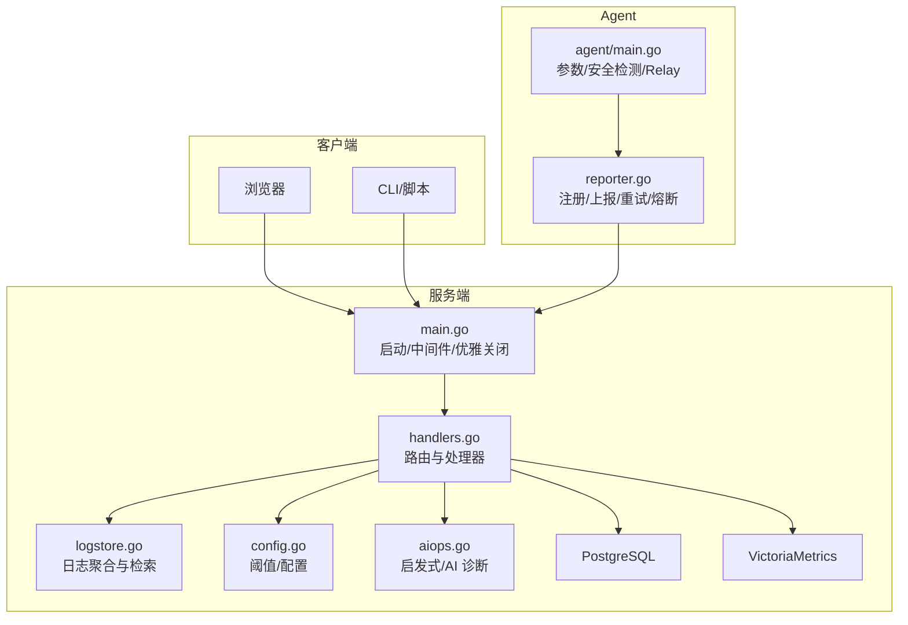
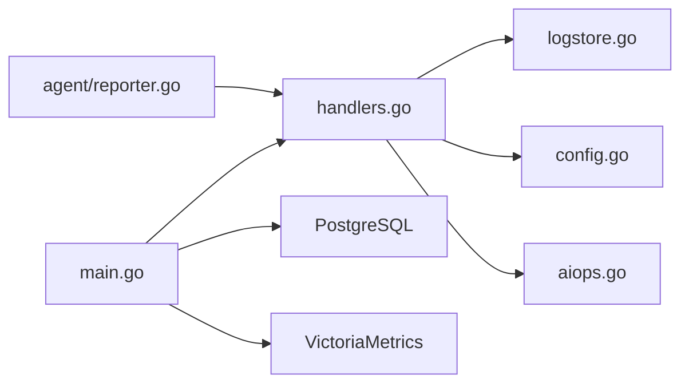
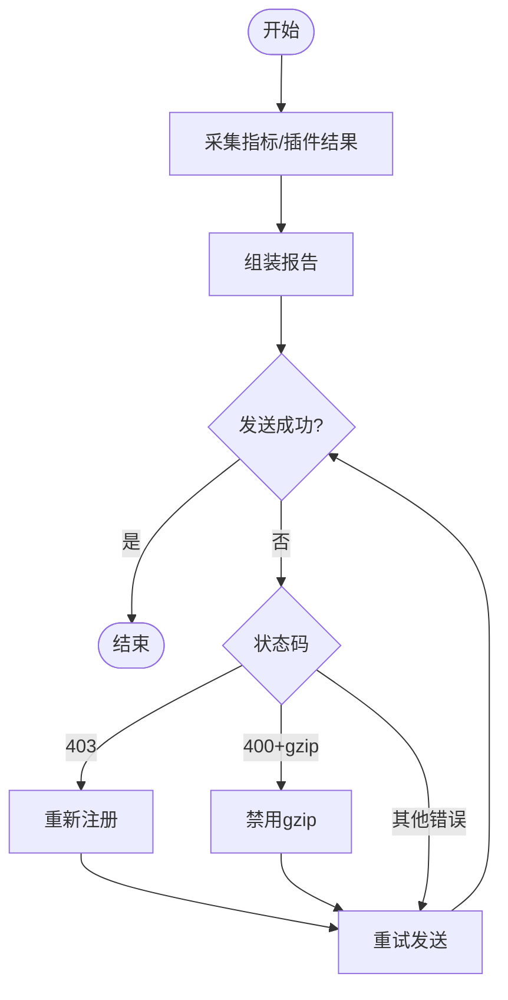
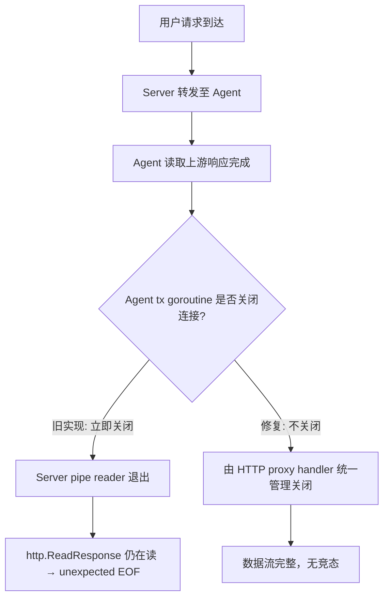

# 故障排除

<cite>
**本文引用的文件**   
- [README.md](file://README.md)
- [cmd/server/main.go](file://cmd/server/main.go)
- [cmd/server/handlers.go](file://cmd/server/handlers.go)
- [cmd/server/logstore.go](file://cmd/server/logstore.go)
- [cmd/agent/main.go](file://cmd/agent/main.go)
- [cmd/agent/reporter.go](file://cmd/agent/reporter.go)
- [cmd/server/config.go](file://cmd/server/config.go)
- [cmd/server/aiops.go](file://cmd/server/aiops.go)
- [HTTP_PROXY_FIX.md](file://HTTP_PROXY_FIX.md)
</cite>

## 目录
1. [简介](#简介)
2. [项目结构](#项目结构)
3. [核心组件](#核心组件)
4. [架构总览](#架构总览)
5. [详细组件分析](#详细组件分析)
6. [依赖关系分析](#依赖关系分析)
7. [性能与容量注意事项](#性能与容量注意事项)
8. [故障排查指南](#故障排查指南)
9. [结论](#结论)
10. [附录：错误码与处理建议](#附录错误码与处理建议)

## 简介
本指南面向 AIOps Monitor 的运维与 SRE 团队，聚焦“问题定位—根因分析—修复验证”的闭环流程。内容覆盖日志分析方法、性能瓶颈诊断、网络连接与代理问题、数据库与时序存储异常、端口转发与 HTTP 代理稳定性、Agent 上报失败、远程终端连通性、AI 巡检与诊断等常见场景，并提供可操作的命令与检查清单。

## 项目结构
系统由服务端（Go）与 Agent（Go）组成，配合 PostgreSQL（关系数据）与 VictoriaMetrics（时序数据）。前端面板内嵌于服务端二进制中，通过 /api/v1/* 暴露 API。



图示来源
- [cmd/server/main.go:227-355](file://cmd/server/main.go#L227-L355)
- [cmd/server/handlers.go:96-346](file://cmd/server/handlers.go#L96-L346)
- [cmd/server/logstore.go:1-43](file://cmd/server/logstore.go#L1-L43)
- [cmd/server/config.go:97-112](file://cmd/server/config.go#L97-L112)
- [cmd/server/aiops.go:747-776](file://cmd/server/aiops.go#L747-L776)
- [cmd/agent/main.go:74-238](file://cmd/agent/main.go#L74-L238)
- [cmd/agent/reporter.go:21-84](file://cmd/agent/reporter.go#L21-L84)

章节来源
- [README.md:924-976](file://README.md#L924-L976)

## 核心组件
- 服务端主进程：负责监听、中间件链（CORS、安全头、gzip、限流）、健康检查、TLS、优雅关闭、依赖初始化（PG/VM/配置/告警/拨测/剧本/SLO/AI/消息中心）。
- 路由与处理器：集中注册所有 /api/v1/* 接口，包括 Agent 上报、终端、转发、日志、AI、SRE 工作流等。
- 日志聚合：内存环形缓冲 + 分页检索 + 统计面板 + 最近错误导出供 AI 使用。
- Agent 主程序：加载配置、命令行参数、安全环境检测、Relay 模式、多服务端上报、插件执行、日志采集。
- Agent 上报器：连接复用、HTTP/1.1 禁用 HTTP/2、重试、gzip 降级、断路器、403 重新注册、事件重入队。
- 配置与阈值：27 组 warn/crit 阈值，零值自动回退默认；支持环境变量覆盖。
- AI 巡检与诊断：未配置 LLM 时启用启发式规则，结合指标与错误日志给出根因方向。

章节来源
- [cmd/server/main.go:227-355](file://cmd/server/main.go#L227-L355)
- [cmd/server/handlers.go:96-346](file://cmd/server/handlers.go#L96-L346)
- [cmd/server/logstore.go:1-43](file://cmd/server/logstore.go#L1-L43)
- [cmd/agent/main.go:74-238](file://cmd/agent/main.go#L74-L238)
- [cmd/agent/reporter.go:21-84](file://cmd/agent/reporter.go#L21-L84)
- [cmd/server/config.go:97-112](file://cmd/server/config.go#L97-L112)
- [cmd/server/aiops.go:747-776](file://cmd/server/aiops.go#L747-L776)

## 架构总览
下图展示一次典型的主机指标上报与告警评估流程，以及日志采集与检索路径。

```mermaid
sequenceDiagram
participant Agent as "Agent"
participant Reporter as "上报器(reporter.go)"
participant Server as "服务端(main.go/handlers.go)"
participant Store as "存储(PG/VM)"
participant Notifier as "告警引擎"
Agent->>Reporter : 周期采集并组装报告
Reporter->>Server : POST /api/v1/agent/report (带 gzip/鉴权)
Server->>Store : 写入时序(VM)/关系(PG)
Server->>Notifier : 触发阈值评估
Notifier-->>Server : 产生告警/恢复
Server-->>Agent : 返回状态码(200/400/403/5xx)
Note over Reporter,Server : 400→禁用gzip重试; 403→重新注册后重试
```

图示来源
- [cmd/agent/reporter.go:139-253](file://cmd/agent/reporter.go#L139-L253)
- [cmd/server/handlers.go:96-120](file://cmd/server/handlers.go#L96-L120)
- [cmd/server/main.go:274-292](file://cmd/server/main.go#L274-L292)

## 详细组件分析

### 服务端启动与依赖校验
- 强制要求配置 AIOPS_POSTGRES_DSN 与 AIOPS_VM_URL，缺失则拒绝启动。
- 对 PG 连接进行有限次重试，避免冷启动竞争导致启动失败。
- 可选 TLS 证书/私钥，未配置时以明文 HTTP 运行并输出警告。
- 优雅关闭：SIGINT/SIGTERM 触发 HTTP 服务停止、持久化刷新、退出。

章节来源
- [cmd/server/main.go:251-272](file://cmd/server/main.go#L251-L272)
- [cmd/server/main.go:305-324](file://cmd/server/main.go#L305-L324)

### 日志聚合与检索
- 内存环形缓冲上限固定，重启后仅恢复最近 N 条用于热尾。
- 提供按主机/级别/关键字/时间范围检索与分页，以及统计面板（级别分布、Top 主机、时间分布）。
- 为 AI 巡检提供最近错误/告警上下文。

章节来源
- [cmd/server/logstore.go:1-43](file://cmd/server/logstore.go#L1-L43)
- [cmd/server/logstore.go:80-166](file://cmd/server/logstore.go#L80-L166)
- [cmd/server/logstore.go:181-254](file://cmd/server/logstore.go#L181-L254)
- [cmd/server/logstore.go:256-284](file://cmd/server/logstore.go#L256-L284)

### Agent 启动与安全环境检测
- 支持 Relay 网关模式，本地监听并反向代理到云端监控中心。
- 启动时检测麒麟 kysec/SELinux/AppArmor/firewalld/Defender/SIP 等安全模块，输出诊断与建议命令或切换宽容模式。
- 支持 --security-mode auto/permissive/enforcing 控制策略。

章节来源
- [cmd/agent/main.go:129-136](file://cmd/agent/main.go#L129-L136)
- [cmd/agent/main.go:142-208](file://cmd/agent/main.go#L142-L208)

### Agent 上报器：健壮性与自愈
- 连接池隔离、HTTP/1.1（禁用 HTTP/2），提升服务端重启后的恢复速度。
- 每目标独立重试、gzip 降级、断路器（连续失败打开冷却期）。
- 403 触发重新注册；400 且含 gzip 时禁用压缩并重试；事件仅在全部目标失败时重入队。

章节来源
- [cmd/agent/reporter.go:21-84](file://cmd/agent/reporter.go#L21-L84)
- [cmd/agent/reporter.go:139-253](file://cmd/agent/reporter.go#L139-L253)
- [cmd/agent/reporter.go:452-567](file://cmd/agent/reporter.go#L452-L567)

### 端口转发与 HTTP 代理稳定性
- 已知竞态条件导致“unexpected EOF”，已在文档中说明修复方案（Agent 端 tx goroutine 不关闭连接，Server 端由 HTTP proxy handler 统一控制）。
- 建议通过健康检查与日志确认修复效果。

章节来源
- [HTTP_PROXY_FIX.md:91-108](file://HTTP_PROXY_FIX.md#L91-L108)

### AI 巡检与启发式诊断
- 未配置 LLM 时，基于规则生成根因方向提示，并结合上下文（指标/错误日志）辅助定位。
- 针对离线/GPU/进程异常等类型提供针对性排查建议。

章节来源
- [cmd/server/aiops.go:747-776](file://cmd/server/aiops.go#L747-L776)

## 依赖关系分析
- 外部依赖：PostgreSQL（关系数据）、VictoriaMetrics（时序数据）。
- 内部耦合：
  - main.go 负责中间件链与生命周期管理，调用 handlers.go 的路由。
  - logstore.go 被 handlers 层用于日志检索与 AI 上下文。
  - reporter.go 与 handlers.go 的 Agent 上报接口强耦合。
  - config.go 提供阈值与开关，影响告警与功能启停。
  - aiops.go 依赖 logstore 与 store 提供的上下文。



图示来源
- [cmd/server/main.go:227-355](file://cmd/server/main.go#L227-L355)
- [cmd/server/handlers.go:96-346](file://cmd/server/handlers.go#L96-L346)
- [cmd/server/logstore.go:1-43](file://cmd/server/logstore.go#L1-L43)
- [cmd/server/config.go:97-112](file://cmd/server/config.go#L97-L112)
- [cmd/server/aiops.go:747-776](file://cmd/server/aiops.go#L747-L776)
- [cmd/agent/reporter.go:21-84](file://cmd/agent/reporter.go#L21-L84)

## 性能与容量注意事项
- 响应压缩：服务端对非流式文本/JSON 启用 gzip，WebSocket/终端/转发/代理路径跳过压缩以避免缓冲。
- 请求体限制：通用最大 100MiB，防止超大 JSON 耗尽内存。
- 日志缓存：内存上限固定，重启后仅恢复最近 N 条，避免 WAL 抖动。
- 上报连接：HTTP/1.1 禁用 HTTP/2，减少单连接失效导致的批量失败；连接池隔离与超时保护。

章节来源
- [cmd/server/main.go:147-205](file://cmd/server/main.go#L147-L205)
- [cmd/server/main.go:104-145](file://cmd/server/main.go#L104-L145)
- [cmd/server/logstore.go:31-36](file://cmd/server/logstore.go#L31-L36)
- [cmd/agent/reporter.go:33-49](file://cmd/agent/reporter.go#L33-L49)

## 故障排查指南

### 一、常见问题速查
- Agent 上报失败
  - 检查服务端地址与端口可达性
  - 查看 Agent 日志中的错误信息（如上报失败、注册被拒、gzip 损坏）
  - 关注 403/400/5xx 行为与重试/降级逻辑
- 远程终端连不上
  - 反代需正确配置 WebSocket 升级与缓冲关闭
  - 跨网络需确保服务端地址公网可达
  - 确认未全局禁用终端
- 面板显示连接失败
  - 检查服务端健康端点
  - 浏览器控制台查看 CORS/认证错误
  - 尝试强制刷新
- 主机显示离线
  - 默认 60 秒未上报判离线，可在阈值设置调整
  - 检查 Agent 进程与网络连通性
- GPU 信息不显示
  - NVIDIA 需安装 nvidia-smi；AMD Linux 需 sysfs 权限；macOS 仅 Apple Silicon
  - GPU 为 best-effort，无工具不影响其他指标

章节来源
- [README.md:924-976](file://README.md#L924-L976)

### 二、系统化排查流程

#### 1) 日志分析方法
- 服务端日志
  - 启动阶段：是否成功连接 PG/VM、是否启用 TLS、dist 目录是否正确
  - 运行时：告警评估、拨测结果、转发/代理错误、终端会话异常
- Agent 日志
  - 注册/上报：403 重新注册、400 gzip 降级、断路器打开
  - 安全环境：kysec/SELinux/AppArmor 拦截提示
  - 日志采集：--log-paths 增量上报与加密开关
- 检索与统计
  - 使用日志检索页面按主机/级别/关键字/时间筛选
  - 观察级别分布、Top 主机、时间分布，快速定位热点

章节来源
- [cmd/server/main.go:251-272](file://cmd/server/main.go#L251-L272)
- [cmd/server/logstore.go:80-166](file://cmd/server/logstore.go#L80-L166)
- [cmd/server/logstore.go:181-254](file://cmd/server/logstore.go#L181-L254)
- [cmd/agent/reporter.go:139-253](file://cmd/agent/reporter.go#L139-L253)
- [cmd/agent/main.go:142-208](file://cmd/agent/main.go#L142-L208)

#### 2) 性能问题诊断
- 带宽与 CPU
  - 大量主机轮询下，gzip 显著降低带宽；确认未误关
  - 大请求体受限于 100MiB，避免超限
- 连接与超时
  - Agent 侧连接池与超时合理，避免长连接阻塞
  - 服务端 ReadHeaderTimeout/IdleTimeout 已配置，避免慢请求攻击
- 存储压力
  - 日志仅内存缓存，重启后恢复少量历史，避免 WAL 抖动
  - 时序写入 VM，关系写入 PG，二者缺一不可

章节来源
- [cmd/server/main.go:147-205](file://cmd/server/main.go#L147-L205)
- [cmd/server/main.go:104-145](file://cmd/server/main.go#L104-L145)
- [cmd/server/logstore.go:31-36](file://cmd/server/logstore.go#L31-L36)
- [cmd/agent/reporter.go:33-49](file://cmd/agent/reporter.go#L33-L49)

#### 3) 网络连接与代理排查
- 基础连通性
  - 从 Agent 所在主机 curl 服务端 /healthz
  - 检查防火墙/安全组放行 8529 端口
- 反代与 WebSocket
  - 若经 Nginx 反代，必须配置 Upgrade 头与关闭缓冲
- HTTP 代理稳定性
  - 参考“竞态条件分析”与修复方案，确认不再出现 unexpected EOF
  - 使用健康检查与日志验证修复效果

章节来源
- [README.md:924-976](file://README.md#L924-L976)
- [HTTP_PROXY_FIX.md:91-108](file://HTTP_PROXY_FIX.md#L91-L108)

#### 4) 数据库与时序存储定位
- 启动失败
  - 未配置 AIOPS_POSTGRES_DSN 或 AIOPS_VM_URL 将直接拒绝启动
  - PG 连接失败会重试若干次，仍失败则终止
- 运行时异常
  - 检查 PG 连接串、权限、网络延迟
  - 检查 VM 地址与写入通道

章节来源
- [cmd/server/main.go:251-272](file://cmd/server/main.go#L251-L272)

#### 5) 端口转发与 HTTP 代理问题
- 现象：偶尔出现 unexpected EOF、偶发无法刷新
- 原因：Agent 与 Server 端连接关闭时机不一致导致竞态
- 解决：遵循修复方案，确保数据流完整性
- 验证：健康检查 + 日志确认稳定

章节来源
- [HTTP_PROXY_FIX.md:91-108](file://HTTP_PROXY_FIX.md#L91-L108)

#### 6) 告警与阈值相关问题
- 阈值零值自动回退默认，避免持续误报
- 根据五大维度（主机/拨测/API/任务/转发）细粒度调整 warn/crit
- 注意离线判定时长与业务容忍度匹配

章节来源
- [cmd/server/config.go:97-112](file://cmd/server/config.go#L97-L112)

#### 7) AI 巡检与诊断
- 未配置 LLM 时，启发式规则仍可给出根因方向
- 结合错误日志与指标趋势缩小范围，再深入具体服务/进程

章节来源
- [cmd/server/aiops.go:747-776](file://cmd/server/aiops.go#L747-L776)

### 三、关键流程图

#### Agent 上报与自愈流程


图示来源
- [cmd/agent/reporter.go:139-253](file://cmd/agent/reporter.go#L139-L253)

#### 端口转发竞态修复要点


图示来源
- [HTTP_PROXY_FIX.md:91-108](file://HTTP_PROXY_FIX.md#L91-L108)

## 结论
通过统一的日志检索、健壮的 Agent 上报机制、严格的依赖校验与合理的性能优化，AIOps Monitor 在复杂网络与高负载环境下具备良好稳定性。建议在生产环境中启用 TLS、合理配置阈值、定期审查转发与代理链路，并结合 AI 巡检与启发式诊断加速排障。

## 附录：错误码与处理建议
- 400（请求格式错误）
  - 当携带 gzip 时触发：外网代理可能损坏压缩流，Agent 会自动禁用 gzip 并重试
  - 未携带 gzip 时的 400：请求体格式错误，检查上报数据结构
- 403（禁止访问）
  - 通常表示指纹未绑定或 Token 失效，Agent 会重新注册后重试
- 5xx（服务端错误）
  - 网络抖动或服务端过载，Agent 会在同一周期内重试，超过阈值触发断路器
- 200（成功）
  - 正常上报，事件不会重入队

章节来源
- [cmd/agent/reporter.go:139-253](file://cmd/agent/reporter.go#L139-L253)