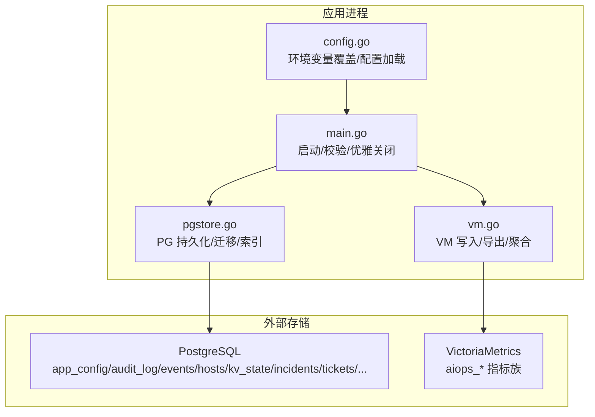
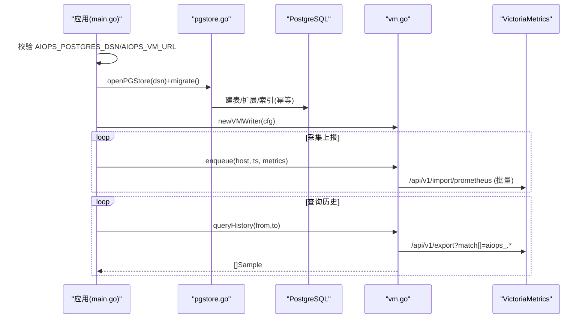

# 数据库问题定位

<cite>
**本文引用的文件列表**
- [README.md](file://README.md)
- [docker-compose.yml](file://docker-compose.yml)
- [cmd/server/main.go](file://cmd/server/main.go)
- [cmd/server/pgstore.go](file://cmd/server/pgstore.go)
- [cmd/server/vm.go](file://cmd/server/vm.go)
- [cmd/server/config.go](file://cmd/server/config.go)
- [fresh-test-prev-backup.sql](file://fresh-test-prev-backup.sql)
- [pg-backup-vectorfix.sql](file://pg-backup-vectorfix.sql)
</cite>

## 目录
1. [简介](#简介)
2. [项目结构与存储架构](#项目结构与存储架构)
3. [核心组件与数据流](#核心组件与数据流)
4. [常见问题与定位方法](#常见问题与定位方法)
5. [健康检查与监控指标解读](#健康检查与监控指标解读)
6. [备份、恢复与迁移](#备份恢复与迁移)
7. [性能调优建议](#性能调优建议)
8. [故障恢复流程](#故障恢复流程)
9. [维护最佳实践](#维护最佳实践)
10. [附录：关键配置与环境变量](#附录关键配置与环境变量)

## 简介
本指南聚焦于 AIOps Monitor 在统一存储架构下的 PostgreSQL（关系型）与 VictoriaMetrics（时序）两类数据库的运维与排障。平台自 v5.5.0 起强制依赖 PG + VM，未配置任一后端将拒绝启动；所有关系数据落 PG，所有时序数据落 VM，内置单文件库已停用。本文面向一线运维与 SRE，提供从连接池、查询性能、存储空间到备份恢复、迁移与调优的全链路问题定位方法。

## 项目结构与存储架构
- 服务端启动时校验并强制要求 AIOPS_POSTGRES_DSN 与 AIOPS_VM_URL 环境变量均已配置，否则直接退出。
- 启动阶段对 PG 进行带重试的连接建立与迁移，确保容器冷启动场景下 PG 初始化完成后再继续。
- 运行时通过 pgStore 抽象层执行 SQL 与 JSONB 读写；VM 通过 HTTP 文本格式批量写入与导出。

图表来源
- [cmd/server/main.go:207-355](file://cmd/server/main.go#L207-L355)
- [cmd/server/pgstore.go:43-212](file://cmd/server/pgstore.go#L43-L212)
- [cmd/server/vm.go:19-172](file://cmd/server/vm.go#L19-L172)
- [cmd/server/config.go:617-623](file://cmd/server/config.go#L617-L623)

章节来源
- [cmd/server/main.go:207-355](file://cmd/server/main.go#L207-L355)
- [cmd/server/pgstore.go:43-212](file://cmd/server/pgstore.go#L43-L212)
- [cmd/server/vm.go:19-172](file://cmd/server/vm.go#L19-L172)
- [cmd/server/config.go:617-623](file://cmd/server/config.go#L617-L623)
- [README.md:561-575](file://README.md#L561-L575)

## 核心组件与数据流
- 启动与依赖校验
  - 读取 AIOPS_POSTGRES_DSN 与 AIOPS_VM_URL，缺失则终止。
  - 调用 mustOpenPG 进行最多 10 次、间隔 2s 的重试，成功后执行 migrate 建表与索引。
- 运行时写入
  - 审计日志、事件、告警历史、终端录制元数据、AI 向量记忆等通过 pgStore 写入 PG。
  - 主机指标、拨测与 API 探测结果以 Prometheus 文本格式批量推送到 VM。
- 查询与展示
  - 短窗口趋势由内存缓存服务，长窗口与聚合计算从 VM 拉取并通过 PromQL 现算。
  - 会话录制内容存本地文件，PG 仅保留元数据索引。

图表来源
- [cmd/server/main.go:207-355](file://cmd/server/main.go#L207-L355)
- [cmd/server/pgstore.go:43-212](file://cmd/server/pgstore.go#L43-L212)
- [cmd/server/vm.go:125-172](file://cmd/server/vm.go#L125-L172)
- [cmd/server/vm.go:713-800](file://cmd/server/vm.go#L713-L800)

章节来源
- [cmd/server/main.go:207-355](file://cmd/server/main.go#L207-L355)
- [cmd/server/pgstore.go:43-212](file://cmd/server/pgstore.go#L43-L212)
- [cmd/server/vm.go:125-172](file://cmd/server/vm.go#L125-L172)
- [cmd/server/vm.go:713-800](file://cmd/server/vm.go#L713-L800)

## 常见问题与定位方法

### 一、PostgreSQL 连接失败或无法启动
- 现象
  - 启动日志提示缺少 AIOPS_POSTGRES_DSN 或连接失败，服务终止。
- 可能原因
  - 环境变量未设置或拼写错误。
  - DSN 中的用户/密码/主机/端口/SSL 参数不正确。
  - PG 尚未就绪（容器冷启动）。
- 定位步骤
  - 确认环境变量存在且非空。
  - 使用客户端直连测试连通性。
  - 查看启动日志中重试次数与错误信息。
- 参考实现
  - 启动校验与致命退出逻辑。
  - 带重试的 PG 连接与迁移。

章节来源
- [cmd/server/main.go:255-272](file://cmd/server/main.go#L255-L272)
- [cmd/server/main.go:207-225](file://cmd/server/main.go#L207-L225)
- [cmd/server/pgstore.go:49-75](file://cmd/server/pgstore.go#L49-L75)

### 二、连接池耗尽（MaxOpenConns 过小）
- 现象
  - 高并发写入或大量并发查询时出现“等待可用连接”或超时。
- 根因
  - 默认最大连接数较小，在高负载下不够用。
- 定位步骤
  - 观察 PG 活跃连接数与等待队列。
  - 评估业务峰值 QPS 与平均事务时长。
- 处理建议
  - 适当增大 MaxOpenConns，结合 PG max_connections 与系统资源综合调整。
  - 关注长事务与慢查询，避免连接长时间占用。
- 参考实现
  - 连接池大小与生命周期设置。

章节来源
- [cmd/server/pgstore.go:54-56](file://cmd/server/pgstore.go#L54-L56)

### 三、查询性能问题（PG 慢查询/锁竞争）
- 现象
  - 面板加载缓慢、审计/事件/告警历史分页卡顿。
- 可能原因
  - 大表无合适索引或统计信息陈旧。
  - 长事务导致锁等待。
  - 全表扫描或低效 SQL。
- 定位步骤
  - 启用并分析 PG 慢查询日志。
  - 检查相关表的索引使用情况与统计信息。
  - 排查长事务与锁等待。
- 优化建议
  - 为高频查询字段添加索引（如时间戳、状态、key）。
  - 定期 VACUUM/ANALYZE，更新统计信息。
  - 拆分大事务，减少锁持有时间。
- 参考实现
  - 审计日志、事件、告警历史、终端录制索引定义。

章节来源
- [cmd/server/pgstore.go:98-110](file://cmd/server/pgstore.go#L98-L110)
- [cmd/server/pgstore.go:201-210](file://cmd/server/pgstore.go#L201-L210)
- [cmd/server/pgstore.go:118-127](file://cmd/server/pgstore.go#L118-L127)

### 四、存储空间不足（PG 膨胀/向量表增长）
- 现象
  - PG 磁盘空间告警，写入变慢或失败。
- 可能原因
  - 审计日志、事件、告警历史持续追加未清理。
  - AI 诊断向量与通用记忆表持续增长。
- 定位步骤
  - 检查各表大小与增长速率。
  - 评估向量表命中与衰减策略是否生效。
- 处理建议
  - 对超大表实施归档与分区策略。
  - 定期清理过期记录与低优先级记忆。
  - 合理设置 PG WAL 与自动清理策略。
- 参考实现
  - 向量表结构、索引与衰减/清理逻辑。

章节来源
- [cmd/server/pgstore.go:128-156](file://cmd/server/pgstore.go#L128-L156)
- [cmd/server/pgstore.go:775-800](file://cmd/server/pgstore.go#L775-L800)

### 五、VictoriaMetrics 写入失败或历史不可查
- 现象
  - 指标不入库、历史曲线为空、API 聚合异常。
- 可能原因
  - VM URL 未配置或不可达。
  - 网络/认证/路径错误。
  - VM 侧限流或容量不足。
- 定位步骤
  - 检查 AIOPS_VM_URL 与网络可达性。
  - 查看 vm.go 的写入与导出日志。
  - 在 VM 端验证 /api/v1/import/prometheus 与 /api/v1/export 接口。
- 处理建议
  - 修正 URL 与鉴权，必要时扩容 VM 集群。
  - 控制批量大小与推送频率，避免拥塞。
- 参考实现
  - VM 写入批处理与导出解析。

章节来源
- [cmd/server/vm.go:125-172](file://cmd/server/vm.go#L125-L172)
- [cmd/server/vm.go:225-294](file://cmd/server/vm.go#L225-L294)
- [cmd/server/vm.go:713-800](file://cmd/server/vm.go#L713-L800)

### 六、连接数与带宽压力（多主机轮询）
- 现象
  - 面板轮询带宽占用高，HTTP 响应延迟上升。
- 可能原因
  - 主机数量大、轮询频繁。
- 处理建议
  - 适度增大上报间隔以降低带宽。
  - 利用 gzip 压缩与分页渲染。
- 参考说明
  - 文档中对 gzip 压缩与规模能力的说明。

章节来源
- [README.md:1003-1011](file://README.md#L1003-L1011)

## 健康检查与监控指标解读

### 健康检查清单
- 启动前
  - 校验 AIOPS_POSTGRES_DSN 与 AIOPS_VM_URL 是否存在且非空。
  - 验证 PG 可连接并完成迁移。
- 运行期
  - PG：连接池使用率、慢查询、锁等待、表大小增长。
  - VM：导入接口成功率、导出接口可用性、指标量级与标签基数。
  - 应用：写入队列长度、HTTP 请求耗时、错误率。

### 关键监控指标（来自 VM 指标族）
- 主机指标：aiops_cpu_percent、aiops_mem_percent、aiops_disk_percent、aiops_net_conns、aiops_load1/5/15 等。
- 拨测指标：aiops_check_up、aiops_check_latency_ms、aiops_check_status_code、aiops_check_loss_pct。
- API 指标：aiops_api_up、aiops_api_latency_ms、aiops_api_status_code、aiops_api_dns/tcp/tls/ttfb_ms、aiops_api_cert_days、aiops_api_resp_bytes。
- 连接细分：aiops_net_conn_count（按 proto+state 标签）。
- GPU 细分：aiops_gpu_util_percent、aiops_gpu_temp_c、aiops_gpu_mem_*（按 gpu 标签）。
- 磁盘卷：aiops_disk_vol_percent/used/total（按 path 标签）。

章节来源
- [cmd/server/vm.go:506-571](file://cmd/server/vm.go#L506-L571)
- [cmd/server/vm.go:174-223](file://cmd/server/vm.go#L174-L223)
- [cmd/server/vm.go:296-343](file://cmd/server/vm.go#L296-L343)
- [cmd/server/vm.go:747-800](file://cmd/server/vm.go#L747-L800)

## 备份、恢复与迁移

### PostgreSQL 备份与恢复
- 备份
  - 使用 pg_dump 导出包含 vector 扩展与全部业务表结构的脚本。
  - 示例脚本见仓库中的备份样例，涵盖 app_config、audit_log、events、hosts、kv_state、incidents、tickets、terminal_recordings、diagnosis_embeddings、ai_memory_embeddings 等。
- 恢复
  - 在新环境创建同名数据库后，使用 psql 导入备份脚本。
  - 若涉及向量维度变更，需先对齐 embedding 列维度再导入。
- 注意事项
  - 备份中包含敏感配置（JSONB），请妥善保管。
  - 导入前确认目标 PG 版本与扩展兼容。

章节来源
- [fresh-test-prev-backup.sql:1-74](file://fresh-test-prev-backup.sql#L1-L74)
- [pg-backup-vectorfix.sql:1-74](file://pg-backup-vectorfix.sql#L1-L74)

### VictoriaMetrics 备份与恢复
- 备份
  - 使用 /api/v1/export 导出 NDJSON 序列，按时间范围与 match[] 过滤指标族。
- 恢复
  - 通过 /api/v1/import/prometheus 重新导入。
- 注意事项
  - 注意时间戳单位（毫秒）与 label 一致性。
  - 大批量导入建议分片与限速。

章节来源
- [cmd/server/vm.go:225-294](file://cmd/server/vm.go#L225-L294)
- [cmd/server/vm.go:713-800](file://cmd/server/vm.go#L713-L800)

### 数据迁移要点
- 向量维度一致性
  - 向量化模型维度必须与 PG 中 vector(N) 列一致，否则 RAG 写入失败。
- 兼容性迁移
  - 终端录制已从“整段内容入库”迁移为“内容存文件、PG 仅存元数据”，迁移脚本会删除旧列。
- 配置迁移
  - 应用配置以 JSONB 形式存储在 app_config，迁移时需保证结构兼容。

章节来源
- [cmd/server/pgstore.go:128-156](file://cmd/server/pgstore.go#L128-L156)
- [cmd/server/pgstore.go:118-127](file://cmd/server/pgstore.go#L118-L127)
- [cmd/server/pgstore.go:282-300](file://cmd/server/pgstore.go#L282-L300)

## 性能调优建议

### PostgreSQL
- 连接池
  - 根据峰值并发与平均事务时长调整 MaxOpenConns、MaxIdleConns、ConnMaxLifetime。
- 索引与统计
  - 为高频查询字段建立索引（如时间戳、状态、key）。
  - 定期 ANALYZE/VACUUM，保持统计信息准确。
- 事务与锁
  - 拆分大事务，避免长事务持有锁。
  - 监控锁等待与死锁，及时优化。
- 存储与 WAL
  - 合理设置 WAL 大小与回收策略，避免磁盘爆满。

章节来源
- [cmd/server/pgstore.go:54-56](file://cmd/server/pgstore.go#L54-L56)
- [cmd/server/pgstore.go:98-110](file://cmd/server/pgstore.go#L98-L110)
- [cmd/server/pgstore.go:201-210](file://cmd/server/pgstore.go#L201-L210)

### VictoriaMetrics
- 写入吞吐
  - 控制批量大小与推送频率，避免拥塞。
- 查询性能
  - 合理使用 PromQL 聚合窗口与标签基数，避免笛卡尔积。
- 容量规划
  - 监控指标量级与标签基数，预留足够磁盘与内存。

章节来源
- [cmd/server/vm.go:125-172](file://cmd/server/vm.go#L125-L172)
- [cmd/server/vm.go:467-498](file://cmd/server/vm.go#L467-L498)

## 故障恢复流程

### 启动失败（PG/VM 未就绪）
- 步骤
  - 检查环境变量 AIOPS_POSTGRES_DSN 与 AIOPS_VM_URL。
  - 验证 PG 连通性与 VM 地址可达。
  - 查看启动日志中的重试与错误信息。
- 参考实现
  - 启动校验与重试逻辑。

章节来源
- [cmd/server/main.go:255-272](file://cmd/server/main.go#L255-L272)
- [cmd/server/main.go:207-225](file://cmd/server/main.go#L207-L225)

### 写入失败（VM 不可用）
- 步骤
  - 检查 VM URL 与网络连通性。
  - 查看 vm.go 的写入日志与错误码。
  - 在 VM 端验证导入接口与配额。
- 参考实现
  - VM 写入与错误日志。

章节来源
- [cmd/server/vm.go:506-571](file://cmd/server/vm.go#L506-L571)

### 数据不一致（PG 与 VM）
- 步骤
  - 对比 PG 中的最新主机信息与 VM 中的最近样本时间戳。
  - 若 VM 缺失，优先从 VM 补拉历史；若 PG 缺失，从 PG 重建主机元数据。
- 参考实现
  - VM 历史查询与样本重组。

章节来源
- [cmd/server/vm.go:713-800](file://cmd/server/vm.go#L713-L800)

## 维护最佳实践
- 安全
  - 设置 AIOPS_SECRET_KEY 启用静态加密，生产环境务必开启 TLS。
- 配置管理
  - 使用环境变量覆盖配置文件，便于容器化部署与密钥注入。
- 监控与告警
  - 对 PG 连接池、慢查询、锁等待与 VM 导入成功率建立告警。
- 备份与演练
  - 定期执行 PG 与 VM 的备份演练，验证恢复流程。
- 容量规划
  - 基于主机规模与指标粒度预估 PG 与 VM 的磁盘与内存需求。

章节来源
- [README.md:561-575](file://README.md#L561-L575)
- [cmd/server/main.go:341-351](file://cmd/server/main.go#L341-L351)
- [cmd/server/config.go:617-623](file://cmd/server/config.go#L617-L623)

## 附录：关键配置与环境变量
- 必填
  - AIOPS_POSTGRES_DSN：PostgreSQL 连接串，未配置拒绝启动。
  - AIOPS_VM_URL：VictoriaMetrics 地址，未配置拒绝启动。
- 可选
  - AIOPS_SECRET_KEY：配置密钥静态加密主密钥。
  - AIOPS_TLS_CERT/AIOPS_TLS_KEY：TLS 证书与私钥路径。
  - AIOPS_FORWARD_LISTEN/AIOPS_FORWARD_PORT_RANGE：转发监听与端口范围。
  - AIOPS_RELAY_SECRET：中继节点共享密钥。
  - AIOPS_FORWARD_DISABLED/AIOPS_TERMINAL_DISABLED/AIOPS_ALLOW_ANONYMOUS_AGENTS/AIOPS_TRUST_PROXY/AIOPS_REQUIRE_TOKEN：功能开关与安全策略。

章节来源
- [README.md:561-575](file://README.md#L561-L575)
- [cmd/server/config.go:617-623](file://cmd/server/config.go#L617-L623)
- [docker-compose.yml:68-71](file://docker-compose.yml#L68-L71)