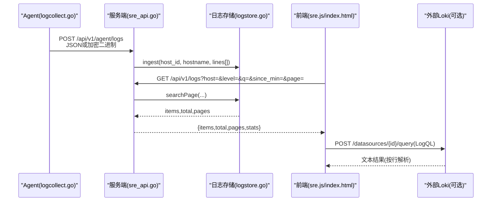
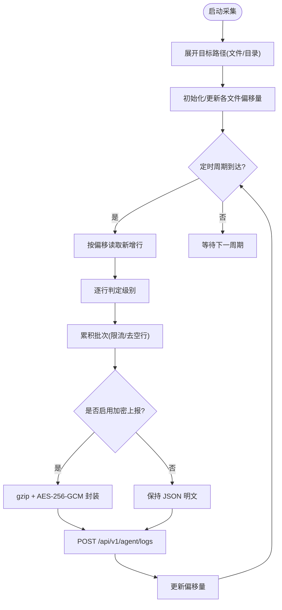
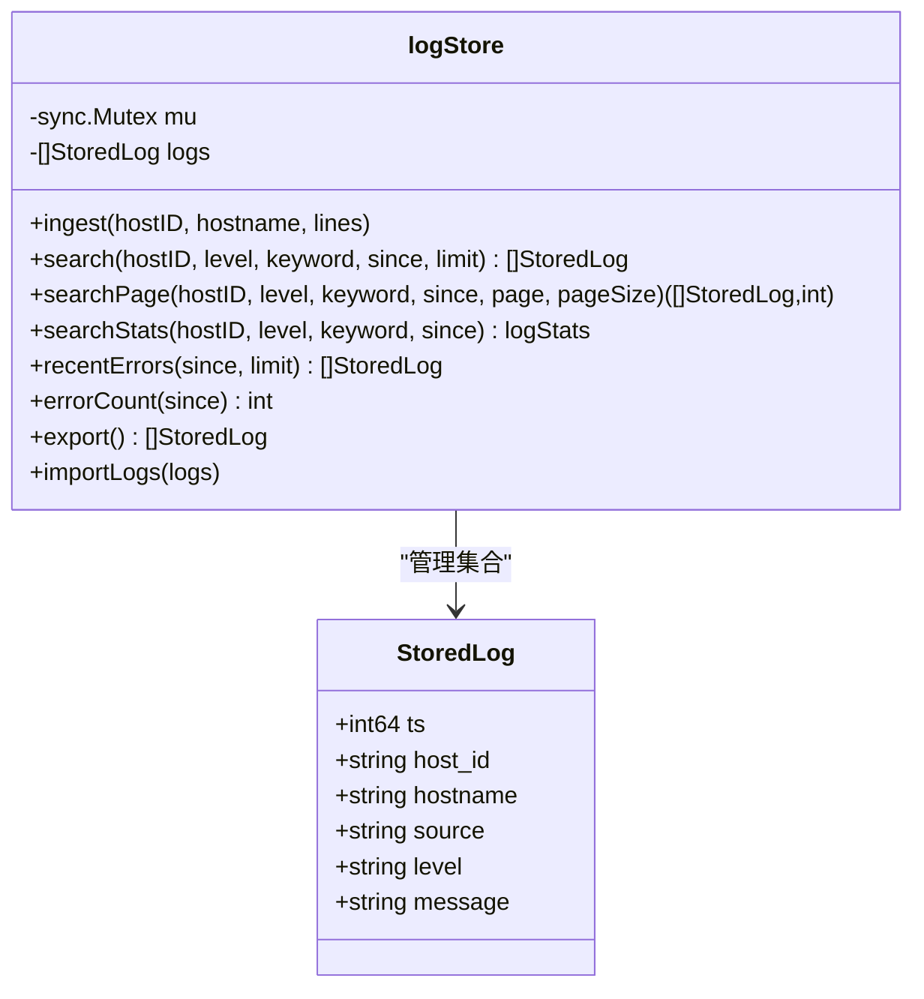
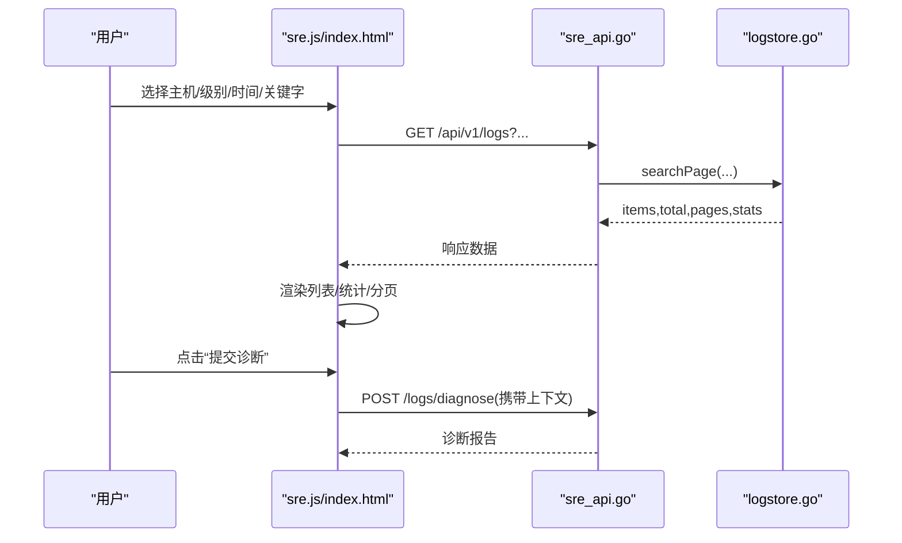
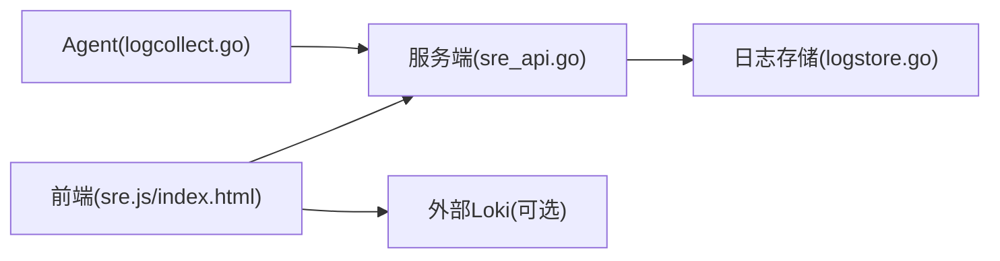

# 日志分析方法

<cite>
**本文引用的文件**   
- [cmd/agent/logcollect.go](file://cmd/agent/logcollect.go)
- [cmd/server/logstore.go](file://cmd/server/logstore.go)
- [cmd/server/sre_api.go](file://cmd/server/sre_api.go)
- [cmd/server/web/index.html](file://cmd/server/web/index.html)
- [cmd/server/web/js/sre.js](file://cmd/server/web/js/sre.js)
- [cmd/server/web/js/nav.js](file://cmd/server/web/js/nav.js)
- [config.example.json](file://config.example.json)
- [server_config.example.json](file://server_config.example.json)
</cite>

## 目录
1. [简介](#简介)
2. [项目结构](#项目结构)
3. [核心组件](#核心组件)
4. [架构总览](#架构总览)
5. [详细组件分析](#详细组件分析)
6. [依赖关系分析](#依赖关系分析)
7. [性能与容量特性](#性能与容量特性)
8. [故障排查指南](#故障排查指南)
9. [结论](#结论)
10. [附录：常用查询与操作](#附录：常用查询与操作)

## 简介
本指南面向运维与 SRE 工程师，系统化说明 AIOps Monitor 的日志采集、传输、存储与检索机制，覆盖服务端日志、Agent 日志、以及可接入的外部日志源（如 Loki）。文档包含：
- 日志来源与位置
- 日志级别与关键字段含义
- 常用检索方法与示例
- 实时查看与历史检索
- 典型故障场景的定位思路

## 项目结构
围绕“日志”能力，关键代码分布在 Agent 端与服务端：
- Agent 侧负责增量采集、自动识别新文件、批量上报与可选加密传输
- 服务端提供内存环形缓冲、分页检索、统计聚合，并支持对接外部 Loki 数据源进行 LogQL 查询
- 前端提供日志检索界面、筛选器、分页与诊断入口

```mermaid
graph TB
subgraph "Agent 端"
A1["logcollect.go<br/>增量采集/分类/上报"]
A2["main.go<br/>命令行参数: --log-paths"]
end
subgraph "服务端"
S1["sre_api.go<br/>接收日志/搜索/诊断"]
S2["logstore.go<br/>内存环形缓冲/分页/统计"]
W1["web/index.html<br/>日志检索 UI"]
W2["web/js/sre.js<br/>本地聚合/Loki 双模式"]
W3["web/js/nav.js<br/>级别/时间范围筛选"]
end
A1 --> |POST /api/v1/agent/logs| S1
S1 --> S2
W2 --> |GET /api/v1/logs| S1
W2 --> |POST /datasources/{id}/query (LogQL)| 外部Loki
```

图表来源
- [cmd/agent/logcollect.go:37-84](file://cmd/agent/logcollect.go#L37-L84)
- [cmd/server/sre_api.go:730-775](file://cmd/server/sre_api.go#L730-L775)
- [cmd/server/logstore.go:59-166](file://cmd/server/logstore.go#L59-L166)
- [cmd/server/web/index.html:585-606](file://cmd/server/web/index.html#L585-L606)
- [cmd/server/web/js/sre.js:884-901](file://cmd/server/web/js/sre.js#L884-L901)
- [cmd/server/web/js/nav.js:461-482](file://cmd/server/web/js/nav.js#L461-L482)

章节来源
- [cmd/agent/logcollect.go:22-34](file://cmd/agent/logcollect.go#L22-L34)
- [cmd/server/logstore.go:12-19](file://cmd/server/logstore.go#L12-L19)
- [cmd/server/web/index.html:585-606](file://cmd/server/web/index.html#L585-L606)
- [cmd/server/web/js/sre.js:884-901](file://cmd/server/web/js/sre.js#L884-L901)

## 核心组件
- Agent 日志采集器
  - 支持文件或目录路径；目录自动发现 .log/.out/.err/.txt 及轮转文件
  - 增量读取（记录偏移量），检测旋转/截断后从头重读
  - 每行自动分级 error/warn/info/debug
  - 批量上报，默认 gzip + AES-256-GCM 加密传输（注册阶段由服务端下发密钥）
- 服务端日志存储与检索
  - 内存环形缓冲（固定上限），重启后仅恢复最近少量到 PG 以快速回填
  - 支持按主机、级别、关键字、时间范围检索与分页
  - 提供统计面板（级别分布、Top 主机、时间分布）
  - 支持对接 Loki 数据源，使用 LogQL 直接查询
- 前端日志检索
  - 本地聚合与 Loki 两种模式切换
  - 级别、时间范围、关键字筛选；分页浏览
  - 单条日志一键触发启发式诊断

章节来源
- [cmd/agent/logcollect.go:86-127](file://cmd/agent/logcollect.go#L86-L127)
- [cmd/agent/logcollect.go:169-181](file://cmd/agent/logcollect.go#L169-L181)
- [cmd/agent/logcollect.go:208-230](file://cmd/agent/logcollect.go#L208-L230)
- [cmd/server/logstore.go:31-41](file://cmd/server/logstore.go#L31-L41)
- [cmd/server/logstore.go:80-106](file://cmd/server/logstore.go#L80-L106)
- [cmd/server/logstore.go:109-166](file://cmd/server/logstore.go#L109-L166)
- [cmd/server/logstore.go:181-254](file://cmd/server/logstore.go#L181-L254)
- [cmd/server/web/js/sre.js:903-918](file://cmd/server/web/js/sre.js#L903-L918)

## 架构总览
下图展示从 Agent 采集到服务端检索的端到端流程，包括加密上报、内存缓冲、分页检索与外部 Loki 直查。



图表来源
- [cmd/agent/logcollect.go:208-230](file://cmd/agent/logcollect.go#L208-L230)
- [cmd/server/sre_api.go:730-775](file://cmd/server/sre_api.go#L730-L775)
- [cmd/server/logstore.go:109-166](file://cmd/server/logstore.go#L109-L166)
- [cmd/server/web/js/sre.js:960-986](file://cmd/server/web/js/sre.js#L960-L986)

## 详细组件分析

### Agent 日志采集器
- 目标展开
  - 支持单个文件或目录；目录扫描匹配常见日志后缀与轮转命名
- 增量读取
  - 维护每个文件的偏移量；首次出现定位至末尾，后续只采新增行
  - 检测到文件大小小于上次偏移时视为旋转/截断，从头重读
  - 单次周期限制最大读取大小，避免长尾影响
- 级别判定
  - 基于关键词启发式归类为 error/warn/info/debug
- 上报策略
  - 批量打包，默认启用 gzip + AES-256-GCM 加密（需服务端下发 log_key）
  - 明文模式用于调试（通过开关控制）



图表来源
- [cmd/agent/logcollect.go:37-84](file://cmd/agent/logcollect.go#L37-L84)
- [cmd/agent/logcollect.go:86-127](file://cmd/agent/logcollect.go#L86-L127)
- [cmd/agent/logcollect.go:129-167](file://cmd/agent/logcollect.go#L129-L167)
- [cmd/agent/logcollect.go:169-181](file://cmd/agent/logcollect.go#L169-L181)
- [cmd/agent/logcollect.go:183-206](file://cmd/agent/logcollect.go#L183-L206)
- [cmd/agent/logcollect.go:208-230](file://cmd/agent/logcollect.go#L208-L230)

章节来源
- [cmd/agent/logcollect.go:22-34](file://cmd/agent/logcollect.go#L22-L34)
- [cmd/agent/logcollect.go:37-84](file://cmd/agent/logcollect.go#L37-L84)
- [cmd/agent/logcollect.go:86-127](file://cmd/agent/logcollect.go#L86-L127)
- [cmd/agent/logcollect.go:129-167](file://cmd/agent/logcollect.go#L129-L167)
- [cmd/agent/logcollect.go:169-181](file://cmd/agent/logcollect.go#L169-L181)
- [cmd/agent/logcollect.go:183-206](file://cmd/agent/logcollect.go#L183-L206)
- [cmd/agent/logcollect.go:208-230](file://cmd/agent/logcollect.go#L208-L230)

### 服务端日志存储与检索
- 数据结构
  - 每条日志包含时间戳、主机标识与名称、来源路径、级别、消息体
- 入库与裁剪
  - 入队追加，超过上限则丢弃最旧条目，保证内存占用稳定
- 检索与分页
  - 支持 host/level/keyword/time 过滤，返回最新优先的结果集与总数
  - 分页接口计算 total/pages，便于前端渲染
- 统计面板
  - 级别分布、Top 主机、近 1h/6h/24h 时间分布
- 持久化
  - 周期性导出最近 N 条写入 PG，重启后可快速回填内存缓冲



图表来源
- [cmd/server/logstore.go:21-29](file://cmd/server/logstore.go#L21-L29)
- [cmd/server/logstore.go:59-78](file://cmd/server/logstore.go#L59-L78)
- [cmd/server/logstore.go:80-106](file://cmd/server/logstore.go#L80-L106)
- [cmd/server/logstore.go:109-166](file://cmd/server/logstore.go#L109-L166)
- [cmd/server/logstore.go:181-254](file://cmd/server/logstore.go#L181-L254)
- [cmd/server/logstore.go:256-284](file://cmd/server/logstore.go#L256-L284)
- [cmd/server/logstore.go:292-317](file://cmd/server/logstore.go#L292-L317)

章节来源
- [cmd/server/logstore.go:12-19](file://cmd/server/logstore.go#L12-L19)
- [cmd/server/logstore.go:31-41](file://cmd/server/logstore.go#L31-L41)
- [cmd/server/logstore.go:59-78](file://cmd/server/logstore.go#L59-L78)
- [cmd/server/logstore.go:80-106](file://cmd/server/logstore.go#L80-L106)
- [cmd/server/logstore.go:109-166](file://cmd/server/logstore.go#L109-L166)
- [cmd/server/logstore.go:181-254](file://cmd/server/logstore.go#L181-L254)
- [cmd/server/logstore.go:256-284](file://cmd/server/logstore.go#L256-L284)
- [cmd/server/logstore.go:292-317](file://cmd/server/logstore.go#L292-L317)

### 前端日志检索与交互
- 本地聚合模式
  - 下拉选择主机、级别、时间范围，输入关键字，调用后端分页接口
  - 显示统计面板与分页控件
- Loki 模式
  - 切换数据源后隐藏主机/级别筛选，显示 Job 筛选
  - 关键字框变为 LogQL 输入，直接查询外部 Loki
- 诊断联动
  - 错误/警告行旁提供“提交诊断”按钮，结合上下文执行启发式分析



图表来源
- [cmd/server/web/index.html:585-606](file://cmd/server/web/index.html#L585-L606)
- [cmd/server/web/js/sre.js:884-901](file://cmd/server/web/js/sre.js#L884-L901)
- [cmd/server/web/js/sre.js:903-918](file://cmd/server/web/js/sre.js#L903-L918)
- [cmd/server/web/js/sre.js:960-986](file://cmd/server/web/js/sre.js#L960-L986)
- [cmd/server/web/js/nav.js:461-482](file://cmd/server/web/js/nav.js#L461-L482)
- [cmd/server/sre_api.go:740-775](file://cmd/server/sre_api.go#L740-L775)

章节来源
- [cmd/server/web/index.html:585-606](file://cmd/server/web/index.html#L585-L606)
- [cmd/server/web/js/sre.js:884-901](file://cmd/server/web/js/sre.js#L884-L901)
- [cmd/server/web/js/sre.js:903-918](file://cmd/server/web/js/sre.js#L903-L918)
- [cmd/server/web/js/sre.js:960-986](file://cmd/server/web/js/sre.js#L960-L986)
- [cmd/server/web/js/nav.js:461-482](file://cmd/server/web/js/nav.js#L461-L482)
- [cmd/server/sre_api.go:740-775](file://cmd/server/sre_api.go#L740-L775)

## 依赖关系分析
- Agent 与服务端
  - Agent 通过 HTTP 将日志批量上报至服务端统一入口
  - 服务端对请求进行鉴权与解析，随后写入内存缓冲
- 前端与后端
  - 前端通过 REST 接口获取本地聚合日志与统计数据
  - 在 Loki 模式下，前端通过数据源查询接口直接访问外部系统
- 外部依赖
  - Loki：作为可选外部日志源，支持 LogQL 查询



图表来源
- [cmd/agent/logcollect.go:208-230](file://cmd/agent/logcollect.go#L208-L230)
- [cmd/server/sre_api.go:730-775](file://cmd/server/sre_api.go#L730-L775)
- [cmd/server/logstore.go:59-78](file://cmd/server/logstore.go#L59-L78)
- [cmd/server/web/js/sre.js:960-986](file://cmd/server/web/js/sre.js#L960-L986)

章节来源
- [cmd/agent/logcollect.go:208-230](file://cmd/agent/logcollect.go#L208-L230)
- [cmd/server/sre_api.go:730-775](file://cmd/server/sre_api.go#L730-L775)
- [cmd/server/logstore.go:59-78](file://cmd/server/logstore.go#L59-L78)
- [cmd/server/web/js/sre.js:960-986](file://cmd/server/web/js/sre.js#L960-L986)

## 性能与容量特性
- 采集频率与批大小
  - 采集周期约 10 秒，每批最多保留最近 500 行，避免瞬时峰值导致过大负载
- 内存缓冲上限
  - 内存环形缓冲固定上限，超出即丢弃最旧条目，确保服务稳定性
- 持久化窗口
  - 仅导出最近若干条写入数据库，降低 WAL 压力并加速重启恢复
- 网络传输
  - 默认压缩与加密，减少带宽占用并保障安全；调试时可关闭加密

章节来源
- [cmd/agent/logcollect.go:37-84](file://cmd/agent/logcollect.go#L37-L84)
- [cmd/server/logstore.go:31-41](file://cmd/server/logstore.go#L31-L41)
- [cmd/server/logstore.go:292-317](file://cmd/server/logstore.go#L292-L317)

## 故障排查指南
- Agent 未上报日志
  - 检查是否配置了 --log-paths 或配置文件中的 log_paths
  - 确认路径存在且可读；目录模式会按规则匹配日志文件名
  - 若启用加密上报，确认注册阶段已下发 log_key
- 服务端无日志或检索为空
  - 确认 Agent 已成功连接并上报
  - 检查时间范围与关键字条件是否过严
  - 注意内存缓冲上限，重启后仅恢复最近少量日志
- 无法解密日志
  - 确认 Content-Type 与 X-Log-Enc 头是否正确设置
  - 核对 log_key 长度与一致性
- 外部 Loki 查询失败
  - 校验数据源配置与权限
  - 检查 LogQL 语法与 job 标签是否存在

章节来源
- [cmd/agent/logcollect.go:22-34](file://cmd/agent/logcollect.go#L22-L34)
- [cmd/agent/logcollect.go:86-127](file://cmd/agent/logcollect.go#L86-L127)
- [cmd/agent/logcollect.go:208-230](file://cmd/agent/logcollect.go#L208-L230)
- [cmd/server/logstore.go:12-19](file://cmd/server/logstore.go#L12-L19)
- [cmd/server/logstore.go:292-317](file://cmd/server/logstore.go#L292-L317)
- [cmd/server/web/js/sre.js:960-986](file://cmd/server/web/js/sre.js#L960-L986)

## 结论
AIOps Monitor 的日志体系以“轻量、安全、易用”为核心：Agent 侧增量采集与可选加密上报，服务端内存缓冲与分页检索，前端提供直观检索与诊断联动，并可无缝扩展至 Loki 等外部系统。通过合理的阈值与容量设计，系统在大规模环境下仍保持稳定与高效。

## 附录：常用查询与操作
- 配置 Agent 采集路径
  - 命令行：--log-paths 逗号分隔的文件或目录
  - 配置文件：log_paths 字段
- 服务端检索接口
  - GET /api/v1/logs?host=&level=&q=&since_min=&page=&page_size=
- 外部 Loki 查询
  - POST /api/v1/datasources/{id}/query，body 含 query(LogQL)、limit、since_min
- 前端筛选
  - 级别：error/warn/info/debug
  - 时间范围：近 15 分钟/1 小时/6 小时/1 天/全部
  - 关键字：本地聚合为全文匹配；Loki 模式为 LogQL

章节来源
- [config.example.json:1-16](file://config.example.json#L1-L16)
- [cmd/server/sre_api.go:740-775](file://cmd/server/sre_api.go#L740-L775)
- [cmd/server/web/js/sre.js:903-918](file://cmd/server/web/js/sre.js#L903-L918)
- [cmd/server/web/js/nav.js:461-482](file://cmd/server/web/js/nav.js#L461-L482)