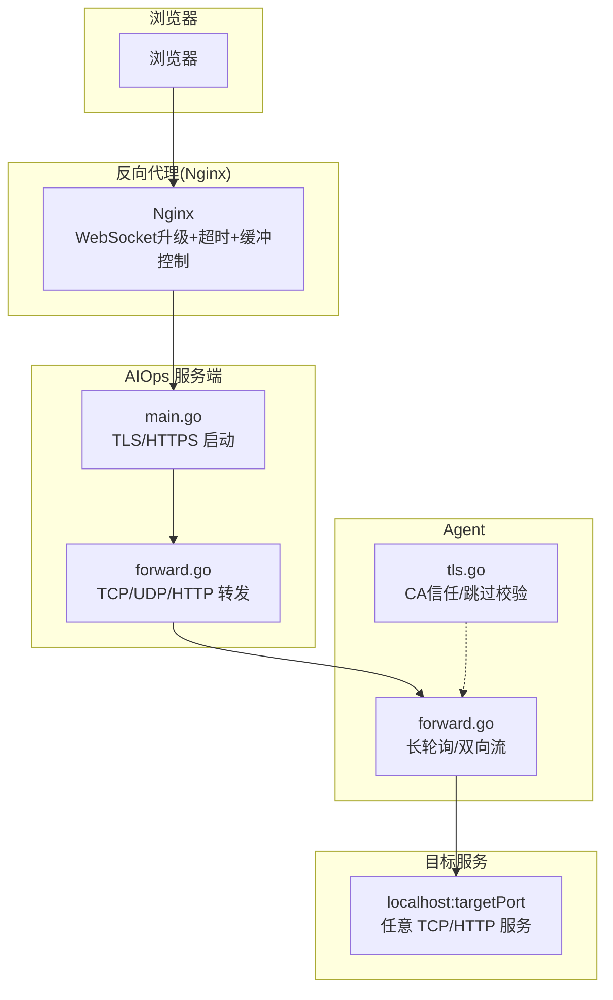
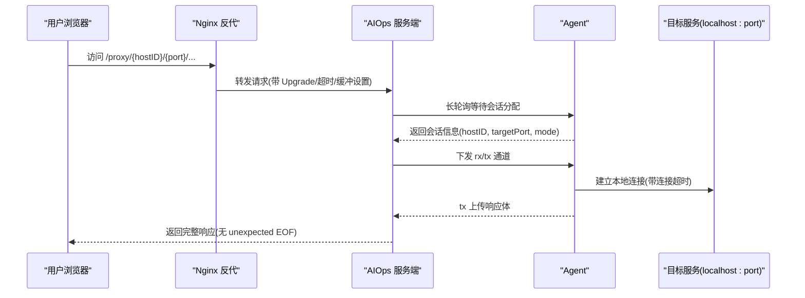
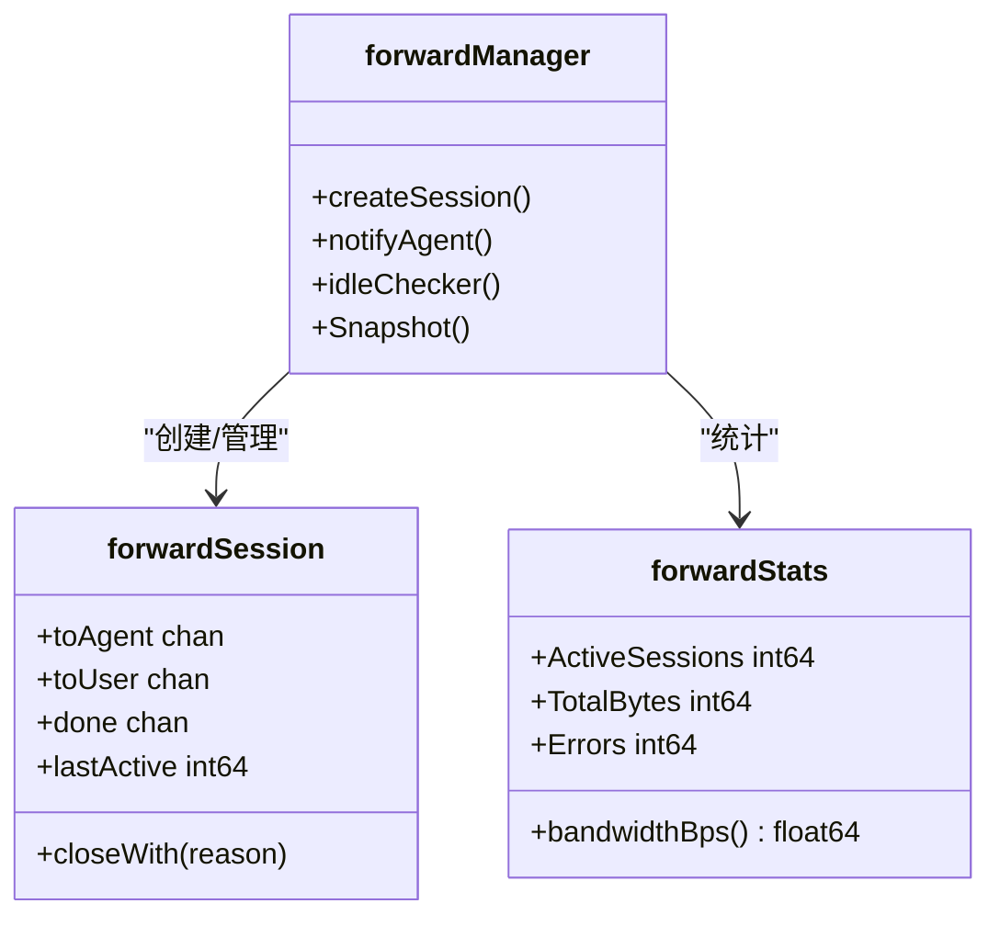
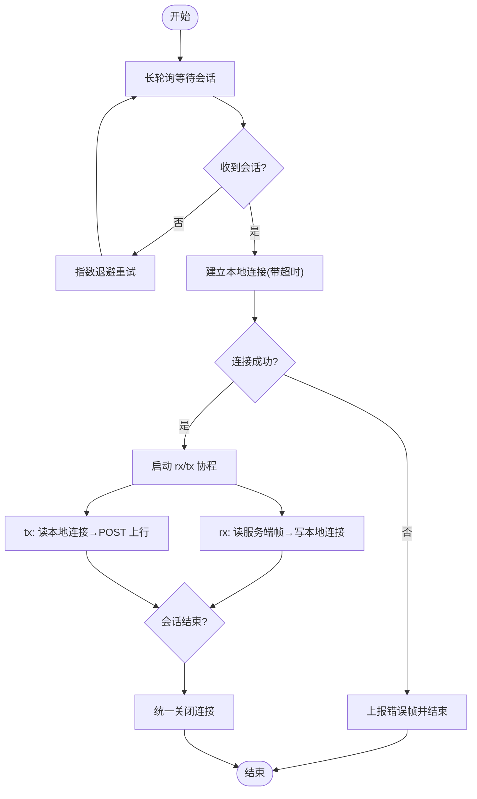
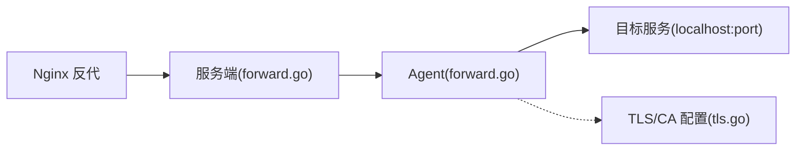

# 网络连接排查

<cite>
**本文引用的文件**   
- [README.md](file://README.md)
- [HTTP_PROXY_FIX.md](file://HTTP_PROXY_FIX.md)
- [FORWARD_GUIDE.md](file://FORWARD_GUIDE.md)
- [DEPLOY_GUIDE.md](file://DEPLOY_GUIDE.md)
- [config.example.json](file://config.example.json)
- [cmd/server/forward.go](file://cmd/server/forward.go)
- [cmd/agent/forward.go](file://cmd/agent/forward.go)
- [cmd/agent/tls.go](file://cmd/agent/tls.go)
- [deploy/nginx-aiops.conf](file://deploy/nginx-aiops.conf)
- [docker/nginx/nginx-frontend.conf](file://docker/nginx/nginx-frontend.conf)
- [cmd/server/main.go](file://cmd/server/main.go)
</cite>

## 目录
1. [简介](#简介)
2. [项目结构](#项目结构)
3. [核心组件](#核心组件)
4. [架构总览](#架构总览)
5. [详细组件分析](#详细组件分析)
6. [依赖关系分析](#依赖关系分析)
7. [性能与稳定性考量](#性能与稳定性考量)
8. [故障排查指南](#故障排查指南)
9. [结论](#结论)
10. [附录](#附录)

## 简介
本指南面向部署与运维人员，聚焦 AIOps Monitor 在跨网络环境下的连接问题定位与修复。内容覆盖防火墙与安全组、代理与反向代理（Nginx）、TLS/证书、端口冲突与监听地址、Agent 长轮询与转发通道、HTTP 代理竞态修复、以及常用连通性测试方法与最佳实践。

## 项目结构
与网络连接相关的关键位置：
- 服务端转发与 HTTP 代理实现：cmd/server/forward.go
- Agent 转发通道与 TLS 配置：cmd/agent/forward.go、cmd/agent/tls.go
- Nginx 反代示例（整体反代与前端分离）：deploy/nginx-aiops.conf、docker/nginx/nginx-frontend.conf
- 服务端 TLS 启动逻辑：cmd/server/main.go
- 文档与使用指南：README.md、FORWARD_GUIDE.md、HTTP_PROXY_FIX.md、DEPLOY_GUIDE.md
- Agent 配置样例：config.example.json

图示来源
- [cmd/server/main.go:330-355](file://cmd/server/main.go#L330-L355)
- [cmd/server/forward.go:1-120](file://cmd/server/forward.go#L1-L120)
- [cmd/agent/forward.go:1-120](file://cmd/agent/forward.go#L1-L120)
- [cmd/agent/tls.go:1-74](file://cmd/agent/tls.go#L1-L74)
- [deploy/nginx-aiops.conf:1-68](file://deploy/nginx-aiops.conf#L1-L68)
- [docker/nginx/nginx-frontend.conf:1-193](file://docker/nginx/nginx-frontend.conf#L1-L193)

章节来源
- [README.md:436-576](file://README.md#L436-L576)
- [FORWARD_GUIDE.md:1-223](file://FORWARD_GUIDE.md#L1-L223)

## 核心组件
- 服务端转发管理器：负责 TCP/UDP 端口映射、HTTP 反向代理、会话生命周期、空闲清理、带宽与延迟统计等。
- Agent 转发通道：通过长轮询获取待处理会话，建立到 localhost:targetPort 的本地连接，并以 rx/tx 两条 HTTP 流与服务端双向中继。
- TLS 与证书：服务端支持 HTTPS；Agent 支持自定义 CA 信任或跳过校验（仅内网/临时场景）。
- 反向代理（Nginx）：需正确配置 WebSocket 升级、关闭缓冲、拉长超时，避免终端/转发中断。

章节来源
- [cmd/server/forward.go:1-120](file://cmd/server/forward.go#L1-L120)
- [cmd/agent/forward.go:1-120](file://cmd/agent/forward.go#L1-L120)
- [cmd/agent/tls.go:1-74](file://cmd/agent/tls.go#L1-L74)
- [deploy/nginx-aiops.conf:1-68](file://deploy/nginx-aiops.conf#L1-L68)

## 架构总览
下图展示“浏览器 → Nginx → 服务端 → Agent → 目标服务”的端到端路径，标注了关键网络点与易错项。

图示来源
- [cmd/server/forward.go:325-446](file://cmd/server/forward.go#L325-L446)
- [cmd/agent/forward.go:97-185](file://cmd/agent/forward.go#L97-L185)
- [deploy/nginx-aiops.conf:18-60](file://deploy/nginx-aiops.conf#L18-L60)

## 详细组件分析

### 服务端转发与 HTTP 代理
- 会话模型：每个转发会话包含 toAgent/toUser 双通道、完成信号 done、空闲时间戳等，用于统一生命周期管理。
- 空闲检测：周期性扫描并关闭长时间无数据传输的会话，防止资源泄漏。
- 并发与限流：限制最大并发会话数、HTTP 请求体大小上限，避免 OOM 与资源耗尽。
- 带宽与延迟统计：滑动窗口记录最近 60 秒字节数，计算平均带宽与平均延迟。
- HTTP 代理竞态修复：通过 rawForwardReader 的非阻塞排空与 done 二次确认，彻底消除“unexpected EOF”。

图示来源
- [cmd/server/forward.go:121-183](file://cmd/server/forward.go#L121-L183)
- [cmd/server/forward.go:234-258](file://cmd/server/forward.go#L234-L258)
- [cmd/server/forward.go:281-310](file://cmd/server/forward.go#L281-L310)
- [cmd/server/forward.go:325-446](file://cmd/server/forward.go#L325-L446)

章节来源
- [cmd/server/forward.go:1-120](file://cmd/server/forward.go#L1-L120)
- [cmd/server/forward.go:281-310](file://cmd/server/forward.go#L281-L310)
- [cmd/server/forward.go:325-446](file://cmd/server/forward.go#L325-L446)

### Agent 转发通道与 TLS
- 长轮询：Agent 定期向服务端查询是否有待处理的转发会话，失败时指数退避重试。
- 双向流：rx 从服务端读取帧写入本地连接；tx 将本地连接输出 POST 回传服务端。
- 超时与健壮性：连接建立有超时；会话有最大时长限制；异常恢复不崩溃 Agent。
- TLS 配置：支持自定义 CA 根证书注入系统信任池，或跳过校验（仅内网/临时），所有客户端 Transport 统一应用。

图示来源
- [cmd/agent/forward.go:54-95](file://cmd/agent/forward.go#L54-L95)
- [cmd/agent/forward.go:97-185](file://cmd/agent/forward.go#L97-L185)
- [cmd/agent/tls.go:19-39](file://cmd/agent/tls.go#L19-L39)
- [cmd/agent/tls.go:47-73](file://cmd/agent/tls.go#L47-L73)

章节来源
- [cmd/agent/forward.go:1-120](file://cmd/agent/forward.go#L1-L120)
- [cmd/agent/tls.go:1-74](file://cmd/agent/tls.go#L1-L74)

### 反向代理（Nginx）配置要点
- WebSocket 升级：必须设置 Upgrade 与 Connection 头，否则终端/实时推送无法工作。
- 关闭缓冲：对终端与 Agent 长轮询/流式传输，需关闭 proxy_buffering 与 proxy_request_buffering。
- 拉长超时：终端与 Agent 通道需要较长超时（如 24 小时），避免被默认 60s 切断。
- 大文件/转发：client_max_body_size 需与服务端一致，避免 413 截断。

章节来源
- [deploy/nginx-aiops.conf:1-68](file://deploy/nginx-aiops.conf#L1-L68)
- [docker/nginx/nginx-frontend.conf:1-193](file://docker/nginx/nginx-frontend.conf#L1-L193)

### 服务端 TLS/HTTPS
- 环境变量 AIOPS_TLS_CERT/AIOPS_TLS_KEY 启用 HTTPS，自动为 Cookie 设置 Secure 标志。
- 未配置时将明文 HTTP 运行并告警，建议置于 HTTPS 终止代理之后。

章节来源
- [cmd/server/main.go:330-355](file://cmd/server/main.go#L330-L355)

## 依赖关系分析
- 服务端依赖 Nginx 的反代能力（WebSocket 升级、缓冲与超时策略）。
- Agent 依赖服务端提供的长轮询与 rx/tx 接口，且受 TLS/CA 配置影响。
- 转发规则的生命周期由服务端统一管理，Agent 仅作为数据面隧道。

图示来源
- [cmd/server/forward.go:1-120](file://cmd/server/forward.go#L1-L120)
- [cmd/agent/forward.go:1-120](file://cmd/agent/forward.go#L1-L120)
- [cmd/agent/tls.go:1-74](file://cmd/agent/tls.go#L1-L74)
- [deploy/nginx-aiops.conf:1-68](file://deploy/nginx-aiops.conf#L1-L68)

## 性能与稳定性考量
- 并发与会话上限：服务端限制最大并发会话数，避免资源耗尽。
- 空闲清理：空闲超过阈值自动关闭，释放资源。
- 带宽与延迟统计：提供近 60 秒平均带宽与平均延迟，便于容量规划与告警。
- 超时与保活：Agent 侧连接与会话均有超时保护；服务端 TCP KeepAlive 可提升长连接存活率。

章节来源
- [cmd/server/forward.go:33-40](file://cmd/server/forward.go#L33-L40)
- [cmd/server/forward.go:281-310](file://cmd/server/forward.go#L281-L310)
- [cmd/agent/forward.go:30-36](file://cmd/agent/forward.go#L30-L36)

## 故障排查指南

### 常见问题与定位思路
- 防火墙/安全组放行
  - 现象：Agent 无法上报、面板不可达、转发失败。
  - 检查：确保服务端端口（默认 8529）及转发端口范围已放行。
  - 参考：[README.md:924-976](file://README.md#L924-L976)

- 代理与反向代理（Nginx）
  - 现象：指标正常但远程终端连不上、偶尔刷新才出结果。
  - 原因：缺少 WebSocket 升级、缓冲开启、超时过短。
  - 解决：按 Nginx 示例配置 Upgrade、关闭缓冲、拉长超时。
  - 参考：[deploy/nginx-aiops.conf:18-60](file://deploy/nginx-aiops.conf#L18-L60)、[docker/nginx/nginx-frontend.conf:106-125](file://docker/nginx/nginx-frontend.conf#L106-L125)

- TLS/证书问题
  - 现象：Agent 报证书错误或握手失败。
  - 解决：服务端启用 HTTPS；Agent 配置自定义 CA 或仅在临时/内网场景跳过校验。
  - 参考：[cmd/agent/tls.go:19-39](file://cmd/agent/tls.go#L19-L39)、[cmd/server/main.go:330-355](file://cmd/server/main.go#L330-L355)

- 端口冲突与监听地址
  - 现象：转发端口绑定失败或外部不可达。
  - 解决：调整 forward_listen 与 Docker 端口映射；避免端口占用。
  - 参考：[README.md:482-486](file://README.md#L482-L486)

- HTTP 代理“unexpected EOF”
  - 现象：代理页面偶发无法解析上游响应。
  - 根因：会话生命周期竞态导致响应提前截断。
  - 修复：服务端 rawForwardReader 增加非阻塞排空与 done 二次确认；Agent 端移除不当 SetDeadline。
  - 参考：[HTTP_PROXY_FIX.md:1-110](file://HTTP_PROXY_FIX.md#L1-L110)、[cmd/server/forward.go:325-446](file://cmd/server/forward.go#L325-L446)

- 跨网络/外网访问
  - 现象：安装命令生成内网地址、终端跨网不可用。
  - 解决：安装时填写公网可达的服务端地址；Nginx 域名与证书正确配置。
  - 参考：[README.md:934-940](file://README.md#L934-L940)

### 连通性测试方法与工具
- 基础连通性
  - ping：验证主机可达性与丢包/延迟。
  - telnet：验证端口是否开放并可建立 TCP 连接。
  - curl：测试 HTTP/HTTPS 状态码、响应头、证书信息（含 -v 调试）。
- 代理与反代
  - 通过 Nginx 域名访问，观察是否出现 413/502/504 等错误。
  - 使用浏览器开发者工具查看 WebSocket 升级是否成功。
- 转发与代理
  - 使用 FORWARD_GUIDE.md 中的 API 创建 TCP/UDP 转发规则，并用本地客户端直连。
  - 使用 /proxy/{hostID}/{port}/path 直接访问目标 Web 服务。
- 日志与诊断
  - 服务端与 Agent 日志中关注“转发会话”、“长轮询失败”、“TLS 握手”等关键字。
  - 参考：[FORWARD_GUIDE.md:1-223](file://FORWARD_GUIDE.md#L1-L223)

章节来源
- [FORWARD_GUIDE.md:1-223](file://FORWARD_GUIDE.md#L1-L223)
- [HTTP_PROXY_FIX.md:1-110](file://HTTP_PROXY_FIX.md#L1-L110)
- [README.md:924-976](file://README.md#L924-L976)

### 反向代理配置问题与解决方案
- 缺失 WebSocket 升级头：终端/实时推送无法连接。
- 未关闭缓冲：长连接被缓冲导致延迟或中断。
- 超时过短：默认 60s 会切断终端/Agent 长轮询。
- 大文件/转发：client_max_body_size 过小导致 413。
- 解决方案：参照 Nginx 示例配置，逐项核对 Upgrade、缓冲、超时、body size。

章节来源
- [deploy/nginx-aiops.conf:18-60](file://deploy/nginx-aiops.conf#L18-L60)
- [docker/nginx/nginx-frontend.conf:106-125](file://docker/nginx/nginx-frontend.conf#L106-L125)

### 网络调试技巧与流程
- 分层定位：浏览器/Nginx → 服务端 → Agent → 目标服务，逐层验证。
- 抓包与日志：结合 tcpdump/Wireshark 与程序日志，定位握手、重传、RST 等。
- 最小化复现：先在本机直连服务端，再经 Nginx，最后跨网访问，逐步缩小范围。
- 变更灰度：更新二进制或配置后，先单节点验证，再全量发布。

### 跨网络环境部署的最佳实践
- 统一入口：使用 Nginx 做 HTTPS 终止与路由，集中管理证书与超时。
- 明确监听：Docker 部署下将 forward_listen 设为 0.0.0.0，并确保端口映射与防火墙放行。
- 安全加固：生产环境启用 TLS；Agent 使用自定义 CA 信任，避免跳过校验。
- 容量规划：根据转发会话上限、带宽与延迟统计，合理评估并发与资源。
- 监控告警：利用内置转发指标（活跃会话、错误率、带宽、延迟）设置阈值告警。

章节来源
- [README.md:482-576](file://README.md#L482-L576)
- [cmd/server/forward.go:1-120](file://cmd/server/forward.go#L1-L120)
- [cmd/agent/tls.go:1-74](file://cmd/agent/tls.go#L1-L74)

## 结论
通过理解服务端转发与 Agent 通道的协作机制、完善 Nginx 反代配置、正确启用 TLS 与证书信任、合理设置端口与超时，并结合系统化连通性测试与日志诊断，可高效定位并解决跨网络环境下的各类连接问题。

## 附录
- 快速参考
  - 服务端环境变量：AIOPS_TLS_CERT/AIOPS_TLS_KEY、AIOPS_FORWARD_LISTEN、AIOPS_FORWARD_PORT_RANGE 等。
  - Agent 配置：server/servers、tls_skip_verify、ca_cert 等。
  - 转发模式：TCP/UDP 端口映射与 HTTP 反向代理的区别与适用场景。

章节来源
- [README.md:436-576](file://README.md#L436-L576)
- [config.example.json:1-16](file://config.example.json#L1-L16)
- [FORWARD_GUIDE.md:186-223](file://FORWARD_GUIDE.md#L186-L223)