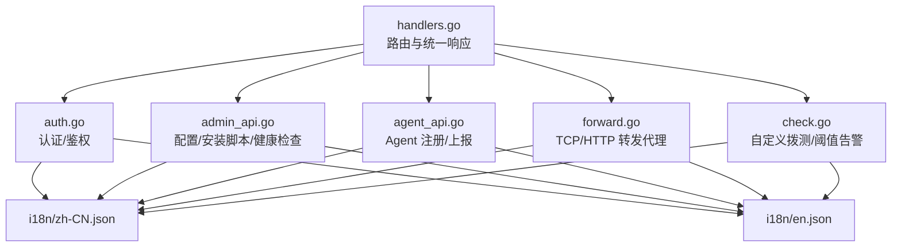
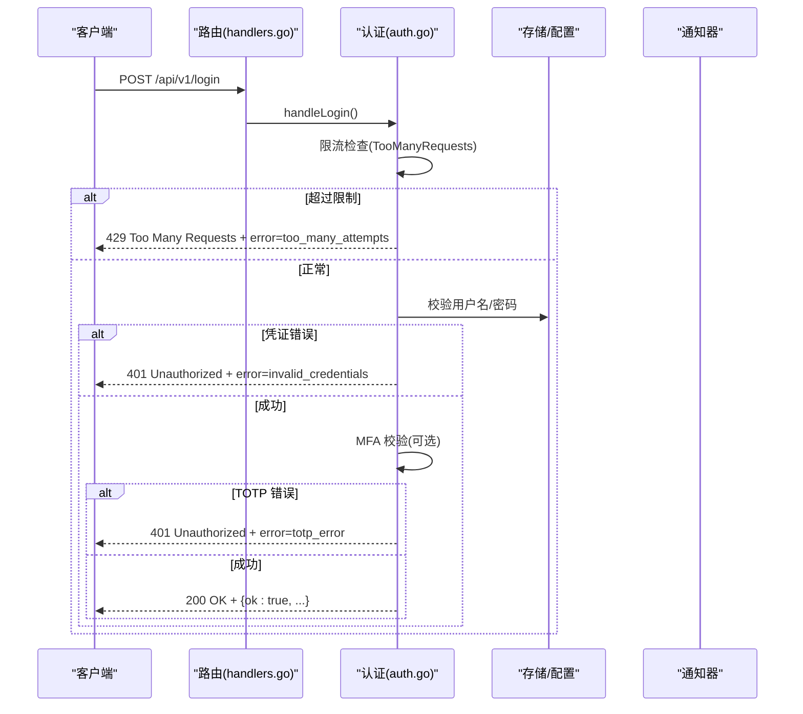
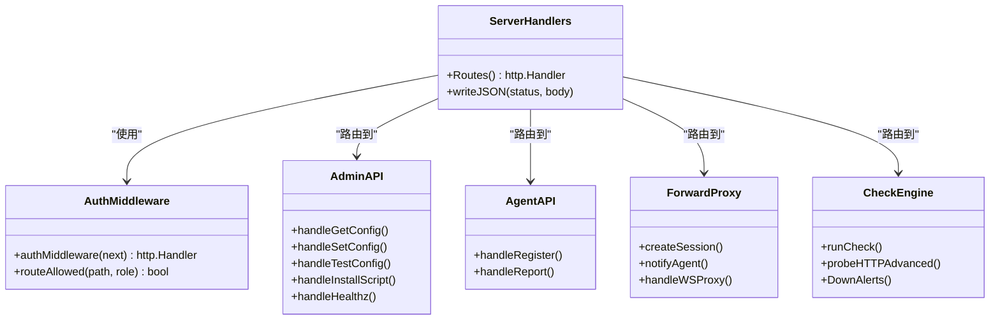

# 错误码参考

<cite>
**本文引用的文件**   
- [handlers.go](file://cmd/server/handlers.go)
- [auth.go](file://cmd/server/auth.go)
- [admin_api.go](file://cmd/server/admin_api.go)
- [agent_api.go](file://cmd/server/agent_api.go)
- [forward.go](file://cmd/server/forward.go)
- [check.go](file://cmd/server/check.go)
- [i18n/zh-CN.json](file://cmd/server/i18n/zh-CN.json)
- [i18n/en.json](file://cmd/server/i18n/en.json)
</cite>

## 目录
1. [简介](#简介)
2. [项目结构](#项目结构)
3. [核心组件](#核心组件)
4. [架构总览](#架构总览)
5. [详细组件分析](#详细组件分析)
6. [依赖关系分析](#依赖关系分析)
7. [性能与稳定性考量](#性能与稳定性考量)
8. [故障排查指南](#故障排查指南)
9. [结论](#结论)
10. [附录：错误码清单与查询指南](#附录错误码清单与查询指南)

## 简介
本文件为 AIOps Monitor 的错误码参考，覆盖以下三类错误码：
- HTTP 状态码：服务端对外返回的通用 HTTP 响应码。
- API 业务错误码：通过 JSON 响应体中的 error 字段表达的业务语义错误（多语言）。
- 拨测/告警相关状态：自定义检查、转发代理等模块产生的状态与阈值告警信息。

文档提供触发条件、处理方法、版本兼容说明与升级变更提示，并给出快速定位与排障建议。

## 项目结构
错误码主要分布在以下位置：
- 路由与统一写响应：handlers.go
- 认证与鉴权：auth.go
- 管理接口与脚本：admin_api.go
- Agent 注册与上报：agent_api.go
- 端口转发与 HTTP 代理：forward.go
- 自定义拨测引擎：check.go
- 国际化消息文本：i18n/zh-CN.json、i18n/en.json

图表来源
- [handlers.go:100-350](file://cmd/server/handlers.go#L100-L350)
- [auth.go:110-172](file://cmd/server/auth.go#L110-L172)
- [admin_api.go:12-174](file://cmd/server/admin_api.go#L12-L174)
- [agent_api.go:30-130](file://cmd/server/agent_api.go#L30-L130)
- [forward.go:1-120](file://cmd/server/forward.go#L1-120)
- [check.go:1-120](file://cmd/server/check.go#L1-L120)

章节来源
- [handlers.go:100-350](file://cmd/server/handlers.go#L100-L350)

## 核心组件
- 统一响应写入：writeJSON 负责设置 Content-Type 并写出 JSON 响应体，所有业务错误均通过该函数输出。
- 认证中间件：对非公开路径进行会话校验与 RBAC 权限控制，未登录或权限不足时返回 401/403。
- Agent 接入：注册需 Token（可配置），上报按指纹鉴权；失败返回 400/403。
- 转发代理：会话上限、Agent 离线、超时、解析失败等场景返回 502/503/400。
- 拨测引擎：HTTP/TCP/Ping/进程检查，支持阈值告警与历史趋势持久化。

章节来源
- [handlers.go:352-357](file://cmd/server/handlers.go#L352-L357)
- [auth.go:110-172](file://cmd/server/auth.go#L110-L172)
- [agent_api.go:30-130](file://cmd/server/agent_api.go#L30-L130)
- [forward.go:32-120](file://cmd/server/forward.go#L32-L120)
- [check.go:249-328](file://cmd/server/check.go#L249-L328)

## 架构总览
下图展示一次典型“登录”请求的错误分支流程（含 401/403/429 等）：

图表来源
- [handlers.go:132-135](file://cmd/server/handlers.go#L132-L135)
- [auth.go:176-307](file://cmd/server/auth.go#L176-L307)

## 详细组件分析

### 认证与鉴权错误
- 常见 HTTP 状态码
  - 401 Unauthorized：未登录或会话无效。
  - 403 Forbidden：权限不足或中继密钥不匹配。
  - 429 Too Many Requests：登录尝试过于频繁。
- 常见 API 错误码（error 字段）
  - auth.invalid_credentials：用户名或密码错误。
  - auth.totp_error：动态验证码错误。
  - auth.too_many_attempts：登录尝试过于频繁。
  - auth.mfa_required_first：请先完成两步验证绑定。
  - auth.insufficient_permission：权限不足。
  - auth.relay_unauthorized：中继密钥验证失败。
- 触发条件与处理
  - 未携带有效会话：返回 401，引导重新登录。
  - 角色不足：返回 403，提升角色或调整路由策略。
  - 中继密钥不匹配：返回 403，核对 X-Relay-Secret 配置。
  - 暴力破解防护：返回 429，等待冷却后重试。

章节来源
- [auth.go:110-172](file://cmd/server/auth.go#L110-L172)
- [auth.go:176-307](file://cmd/server/auth.go#L176-L307)
- [i18n/zh-CN.json:1-21](file://cmd/server/i18n/zh-CN.json#L1-L21)
- [i18n/en.json:1-21](file://cmd/server/i18n/en.json#L1-L21)

### 管理接口与脚本错误
- 常见 HTTP 状态码
  - 400 Bad Request：JSON 格式不合法或参数缺失。
  - 500 Internal Server Error：内部异常。
- 常见 API 错误码（error 字段）
  - common.invalid_json：JSON 格式不合法。
- 触发条件与处理
  - 请求体无法解析：修正 JSON 格式并重试。
  - 保存失败：检查后端存储与权限。

章节来源
- [admin_api.go:45-77](file://cmd/server/admin_api.go#L45-L77)
- [i18n/zh-CN.json:346-353](file://cmd/server/i18n/zh-CN.json#L346-L353)
- [i18n/en.json:346-353](file://cmd/server/i18n/en.json#L346-L353)

### Agent 注册与上报错误
- 常见 HTTP 状态码
  - 400 Bad Request：请求格式错误或缺失必要字段。
  - 403 Forbidden：Token 无效/缺失或指纹不匹配。
- 常见 API 错误码（error 字段）
  - agent.invalid_token：无效或缺失的接入 Token。
  - agent.fingerprint_required：指纹信息必填。
  - agent.fingerprint_failed：指纹鉴权失败。
- 触发条件与处理
  - 新 Agent 注册需 Token：若已开启强制 Token，请传入正确 token。
  - 已知主机免 Token 重注册：服务端重启恢复场景允许指纹匹配直接重注册。
  - 上报指纹不匹配：确认 Agent 指纹与服务端一致。

章节来源
- [agent_api.go:30-84](file://cmd/server/agent_api.go#L30-L84)
- [agent_api.go:94-130](file://cmd/server/agent_api.go#L94-L130)
- [i18n/zh-CN.json:253-255](file://cmd/server/i18n/zh-CN.json#L253-L255)
- [i18n/en.json:253-255](file://cmd/server/i18n/en.json#L253-L255)

### 端口转发与 HTTP 代理错误
- 常见 HTTP 状态码
  - 400 Bad Request：请求体过大或解析失败。
  - 502 Bad Gateway：上游不可达或会话关闭。
  - 503 Service Unavailable：活跃会话过多。
  - 504 Gateway Timeout：Agent 接入超时。
- 常见 API 错误码（error 字段）
  - forward.disabled：转发被管理员禁用。
  - forward.invalid_port：端口号无效。
  - forward.host_port_required：host_id 和 target_port 必填。
  - forward.listen_failed：监听端口失败。
  - forward.rule_not_found：规则不存在。
  - forward.agent_offline：Agent 未在线或未启用转发通道。
  - forward.agent_timeout：Agent 接入超时。
  - forward.session_closed：转发会话已关闭。
  - forward.parse_response_failed：无法解析上游响应。
  - forward.body_too_large：请求体超过大小限制。
  - forward.too_many_sessions：活跃会话数过多。
  - forward.tcp_agent_offline：Agent 未在线，连接被拒绝。
  - forward.tcp_closed：TCP 转发已关闭。
- 触发条件与处理
  - 会话过多：减少并发或扩容，稍后重试。
  - Agent 离线：检查 Agent 运行状态与网络连通性。
  - 解析失败：检查上游服务响应格式与长度限制。

章节来源
- [forward.go:32-120](file://cmd/server/forward.go#L32-L120)
- [forward.go:449-526](file://cmd/server/forward.go#L449-L526)
- [forward.go:1535-1582](file://cmd/server/forward.go#L1535-L1582)
- [i18n/zh-CN.json:357-375](file://cmd/server/i18n/zh-CN.json#L357-L375)
- [i18n/en.json:357-370](file://cmd/server/i18n/en.json#L357-L370)

### 自定义拨测与阈值告警
- 常见 HTTP 状态码
  - 200 OK：拨测结果或历史记录查询成功。
- 常见 API 错误码（error 字段）
  - check_api.invalid_params：名称/目标/类型不合法。
- 阈值告警（由拨测指标触发）
  - alert.check_http_resp：HTTP 响应时间超阈。
  - alert.check_http_status：HTTP 非 2xx 状态码连续出现。
  - alert.check_tcp_timeout：TCP 连接超时。
  - alert.check_ping_loss：Ping 丢包率超阈。
  - alert.check_ping_latency：Ping 平均延迟超阈。
  - alert.check_proc_fail：进程存活检测失败次数超阈。
- 触发条件与处理
  - 参数非法：检查拨测配置的名称、目标地址与类型。
  - 阈值告警：根据具体指标调优阈值或修复目标服务。

章节来源
- [check.go:249-328](file://cmd/server/check.go#L249-L328)
- [check.go:474-521](file://cmd/server/check.go#L474-L521)
- [check.go:760-805](file://cmd/server/check.go#L760-L805)
- [i18n/zh-CN.json:251](file://cmd/server/i18n/zh-CN.json#L251)
- [i18n/en.json:251](file://cmd/server/i18n/en.json#L251)
- [i18n/zh-CN.json:46-56](file://cmd/server/i18n/zh-CN.json#L46-L56)
- [i18n/en.json:46-56](file://cmd/server/i18n/en.json#L46-L56)

## 依赖关系分析
- handlers.go 作为路由入口，将请求分发到各功能模块处理器。
- auth.go 提供认证与 RBAC 中间件，影响所有受保护接口的错误分支。
- admin_api.go、agent_api.go、forward.go、check.go 各自实现特定领域逻辑，并在错误时通过 writeJSON 输出统一格式的 JSON 响应。
- i18n 文件集中维护错误消息的多语言文案，避免硬编码。

图表来源
- [handlers.go:100-350](file://cmd/server/handlers.go#L100-L350)
- [auth.go:110-172](file://cmd/server/auth.go#L110-L172)
- [admin_api.go:12-174](file://cmd/server/admin_api.go#L12-L174)
- [agent_api.go:30-130](file://cmd/server/agent_api.go#L30-L130)
- [forward.go:1-120](file://cmd/server/forward.go#L1-L120)
- [check.go:249-328](file://cmd/server/check.go#L249-L328)

## 性能与稳定性考量
- 转发代理具备会话上限与带宽统计，防止 OOM 与资源耗尽。
- 拨测引擎内置去抖（连续两次失败才标记 down），降低抖动告警。
- 日志压缩与重试机制有助于在弱网环境下稳定上报。

[本节为通用指导，无需列出具体文件来源]

## 故障排查指南
- 登录失败
  - 现象：401/429。
  - 排查：检查用户名/密码、MFA 配置、IP 限流窗口。
- Agent 注册失败
  - 现象：403（Token 无效）或 400（缺少指纹）。
  - 排查：核对安装 Token、Agent 指纹与服务端一致性。
- 转发代理失败
  - 现象：502/503/504。
  - 排查：查看 Agent 在线状态、会话数量、上游响应格式与大小限制。
- 拨测异常
  - 现象：阈值告警或参数非法。
  - 排查：检查目标可达性、证书有效期、关键字/JSON 断言配置。

章节来源
- [auth.go:176-307](file://cmd/server/auth.go#L176-L307)
- [agent_api.go:30-130](file://cmd/server/agent_api.go#L30-L130)
- [forward.go:449-526](file://cmd/server/forward.go#L449-L526)
- [check.go:249-328](file://cmd/server/check.go#L249-L328)

## 结论
本参考文档系统化梳理了 AIOps Monitor 的 HTTP 状态码、API 业务错误码与拨测/告警相关状态，结合触发条件与处理方法，帮助开发者快速定位问题并进行修复。建议在集成时优先关注认证鉴权、Agent 接入与转发代理三大高频错误域，并结合 i18n 文案进行用户友好的错误提示。

[本节为总结，无需列出具体文件来源]

## 附录：错误码清单与查询指南

### HTTP 状态码速查
- 200 OK：请求成功。
- 400 Bad Request：请求格式错误或参数缺失。
- 401 Unauthorized：未登录或会话无效。
- 403 Forbidden：权限不足或中继密钥不匹配。
- 429 Too Many Requests：操作频率超限。
- 500 Internal Server Error：内部异常。
- 502 Bad Gateway：上游不可达或会话关闭。
- 503 Service Unavailable：活跃会话过多。
- 504 Gateway Timeout：Agent 接入超时。

章节来源
- [auth.go:110-172](file://cmd/server/auth.go#L110-L172)
- [admin_api.go:45-77](file://cmd/server/admin_api.go#L45-L77)
- [agent_api.go:30-130](file://cmd/server/agent_api.go#L30-L130)
- [forward.go:1535-1582](file://cmd/server/forward.go#L1535-L1582)

### API 业务错误码（error 字段）
- 认证与鉴权
  - auth.invalid_credentials：用户名或密码错误。
  - auth.totp_error：动态验证码错误。
  - auth.too_many_attempts：登录尝试过于频繁。
  - auth.mfa_required_first：请先完成两步验证绑定。
  - auth.insufficient_permission：权限不足。
  - auth.relay_unauthorized：中继密钥验证失败。
- 通用
  - common.invalid_json：JSON 格式不合法。
- Agent 接入
  - agent.invalid_token：无效或缺失的接入 Token。
  - agent.fingerprint_required：指纹信息必填。
  - agent.fingerprint_failed：指纹鉴权失败。
- 转发代理
  - forward.disabled：转发被管理员禁用。
  - forward.invalid_port：端口号无效。
  - forward.host_port_required：host_id 和 target_port 必填。
  - forward.listen_failed：监听端口失败。
  - forward.rule_not_found：规则不存在。
  - forward.agent_offline：Agent 未在线或未启用转发通道。
  - forward.agent_timeout：Agent 接入超时。
  - forward.session_closed：转发会话已关闭。
  - forward.parse_response_failed：无法解析上游响应。
  - forward.body_too_large：请求体超过大小限制。
  - forward.too_many_sessions：活跃会话数过多。
  - forward.tcp_agent_offline：Agent 未在线，连接被拒绝。
  - forward.tcp_closed：TCP 转发已关闭。
- 拨测
  - check_api.invalid_params：名称/目标/类型不合法。

章节来源
- [i18n/zh-CN.json:1-21](file://cmd/server/i18n/zh-CN.json#L1-L21)
- [i18n/zh-CN.json:346-353](file://cmd/server/i18n/zh-CN.json#L346-L353)
- [i18n/zh-CN.json:253-255](file://cmd/server/i18n/zh-CN.json#L253-L255)
- [i18n/zh-CN.json:357-375](file://cmd/server/i18n/zh-CN.json#L357-L375)
- [i18n/zh-CN.json:251](file://cmd/server/i18n/zh-CN.json#L251)

### 拨测与阈值告警（消息 key）
- alert.check_http_resp：HTTP 响应时间超阈。
- alert.check_http_status：HTTP 非 2xx 状态码连续出现。
- alert.check_tcp_timeout：TCP 连接超时。
- alert.check_ping_loss：Ping 丢包率超阈。
- alert.check_ping_latency：Ping 平均延迟超阈。
- alert.check_proc_fail：进程存活检测失败次数超阈。

章节来源
- [i18n/zh-CN.json:46-56](file://cmd/server/i18n/zh-CN.json#L46-L56)
- [check.go:760-805](file://cmd/server/check.go#L760-L805)

### 版本兼容与升级变更
- v5.2.6：Agent 注册支持已知主机免 Token 重注册（基于指纹匹配），用于服务端重启恢复。
- v5.4.0：首次登录默认凭据强制改密；全局 MFA 策略可在登录后要求先完成绑定。
- v5.4.1：转发代理停用规则时真正停止监听并断开在途会话；HTTP 代理中增加更多错误提示与诊断信息。

章节来源
- [agent_api.go:48-67](file://cmd/server/agent_api.go#L48-L67)
- [auth.go:252-307](file://cmd/server/auth.go#L252-L307)
- [forward.go:730-765](file://cmd/server/forward.go#L730-L765)

### 错误码查询与使用指南
- 快速定位
  - 先看 HTTP 状态码：401/403/429 多为认证/鉴权/限流；502/503/504 多为转发/上游问题。
  - 再看 error 字段：对照 i18n 键值定位具体原因。
- 常用路径
  - 认证：/api/v1/login、/api/v1/me、/api/v1/logout。
  - Agent：/api/v1/agent/register、/api/v1/agent/report。
  - 转发：/api/v1/forward/*、/proxy/{hostID}/{port}/{path...}。
  - 拨测：/api/v1/checks/*。
- 建议
  - 前端统一捕获 401 跳转登录，403 提示权限不足，429 显示冷却倒计时。
  - 转发代理错误应记录 session ID 与 close reason，便于回溯。
  - 拨测阈值告警应与业务 SLA 对齐，避免误报。

章节来源
- [handlers.go:100-350](file://cmd/server/handlers.go#L100-L350)
- [auth.go:110-172](file://cmd/server/auth.go#L110-L172)
- [agent_api.go:30-130](file://cmd/server/agent_api.go#L30-L130)
- [forward.go:449-526](file://cmd/server/forward.go#L449-L526)
- [check.go:249-328](file://cmd/server/check.go#L249-L328)