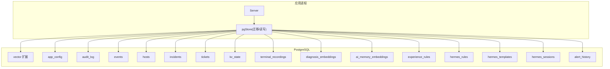
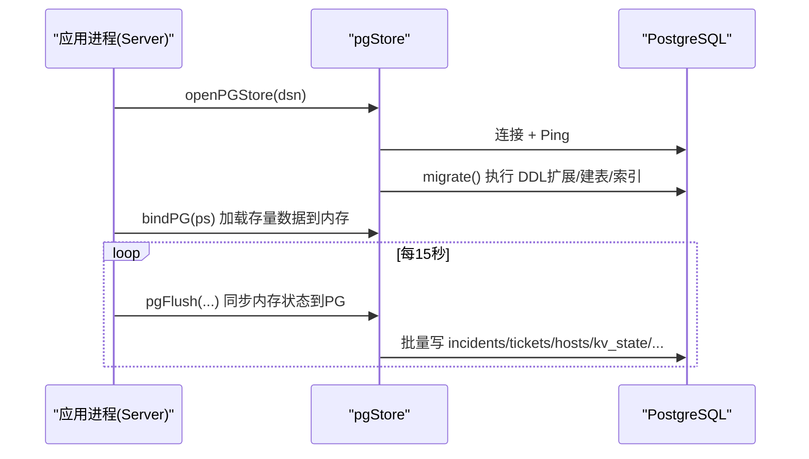
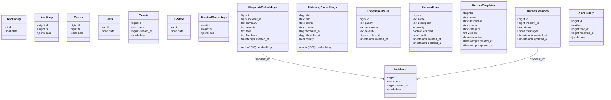
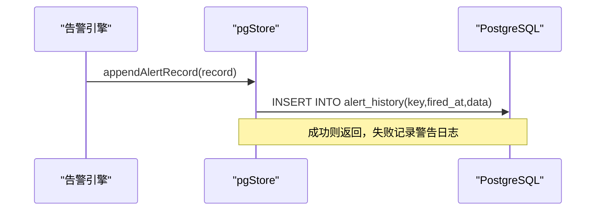
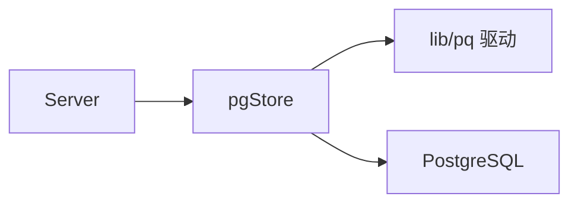

# PostgreSQL 关系型数据库设计

<cite>
**本文引用的文件**   
- [pgstore.go](file://cmd/server/pgstore.go)
- [fresh-test-prev-backup.sql](file://fresh-test-prev-backup.sql)
- [pg-backup-vectorfix.sql](file://pg-backup-vectorfix.sql)
</cite>

## 目录
1. [简介](#简介)
2. [项目结构](#项目结构)
3. [核心组件](#核心组件)
4. [架构总览](#架构总览)
5. [详细组件分析](#详细组件分析)
6. [依赖分析](#依赖分析)
7. [性能考虑](#性能考虑)
8. [故障排查指南](#故障排查指南)
9. [结论](#结论)
10. [附录](#附录)

## 简介
本文件面向 AIOps Monitor 的 PostgreSQL 关系型数据层，系统性梳理并说明核心表结构设计、字段定义、主外键与约束、索引策略、数据完整性保证机制；同时给出初始化脚本来源、迁移方案、性能优化建议、备份恢复与容量规划指导。该项目的关系数据统一落库 PostgreSQL，时序数据落 VictoriaMetrics，二者缺一不可。

## 项目结构
本项目将全部关系型持久化逻辑集中在服务端存储层中，通过启动时自动执行 DDL（含扩展、建表、索引）完成“自举式”迁移。关键位置：
- 服务启动时连接 PG 并执行迁移：[pgstore.go:47-75](file://cmd/server/pgstore.go#L47-L75)
- 迁移脚本（DDL）集中定义：[pgstore.go:77-212](file://cmd/server/pgstore.go#L77-L212)
- 历史导出样例（可参考结构与约束）：[fresh-test-prev-backup.sql](file://fresh-test-prev-backup.sql)、[pg-backup-vectorfix.sql](file://pg-backup-vectorfix.sql)

图表来源
- [pgstore.go:47-75](file://cmd/server/pgstore.go#L47-L75)
- [pgstore.go:77-212](file://cmd/server/pgstore.go#L77-L212)

章节来源
- [pgstore.go:47-75](file://cmd/server/pgstore.go#L47-L75)
- [pgstore.go:77-212](file://cmd/server/pgstore.go#L77-L212)

## 核心组件
本节聚焦于用户管理、主机元数据、审计日志、插件事件、告警记录、配置等核心表的定义与使用方式。需要特别说明的是：当前版本未提供独立的 users 表，用户信息以 JSONB 形式存储在 app_config 中；告警记录持久化在 alert_history 表中。

- 用户管理（users）
  - 现状：无独立 users 表，用户列表与认证相关字段保存在 app_config.data 的 JSONB 结构中。
  - 影响：用户变更通过更新 app_config 单行实现；如需规范化，可在后续版本引入独立 users 表并通过迁移脚本升级。
  - 参考路径：[pgstore.go:94-97](file://cmd/server/pgstore.go#L94-L97)、[fresh-test-prev-backup.sql:44-47](file://fresh-test-prev-backup.sql#L44-L47)

- 主机元数据（hosts）
  - 用途：保存每台 Agent 上报的主机标识与最新状态快照（JSONB）。
  - 关键字段：id（文本主键）、data（JSONB）。
  - 参考路径：[pgstore.go:110-113](file://cmd/server/pgstore.go#L110-L113)、[fresh-test-prev-backup.sql:286-289](file://fresh-test-prev-backup.sql#L286-L289)

- 审计日志（audit_log）
  - 用途：追加写入系统操作与事件审计记录。
  - 关键字段：id（BIGSERIAL 主键）、ts（时间戳）、data（JSONB）。
  - 索引：按 ts 建立 B-Tree 索引用于时间范围查询。
  - 参考路径：[pgstore.go:98-103](file://cmd/server/pgstore.go#L98-L103)、[fresh-test-prev-backup.sql:54-58](file://fresh-test-prev-backup.sql#L54-L58)

- 插件事件（events）
  - 用途：插件或系统产生的事件流（如拨测异常、自定义监控异常）。
  - 关键字段：id（BIGSERIAL 主键）、ts（时间戳）、data（JSONB）。
  - 索引：按 ts 建立 B-Tree 索引。
  - 参考路径：[pgstore.go:104-109](file://cmd/server/pgstore.go#L104-L109)、[fresh-test-prev-backup.sql:119-123](file://fresh-test-prev-backup.sql#L119-L123)

- 告警记录（alert_records → alert_history）
  - 现状：告警触发与恢复记录持久化在 alert_history 表（非 alert_records）。
  - 关键字段：id（BIGSERIAL 主键）、key（告警键）、fired_at（触发时间）、resolved_at（恢复时间）、data（JSONB）。
  - 索引：按 key 与 fired_at DESC 建立索引。
  - 参考路径：[pgstore.go:201-209](file://cmd/server/pgstore.go#L201-L209)

- 配置（config → app_config）
  - 用途：应用全局配置（包含阈值、通知渠道、AI 配置、用户列表等），以单行 JSONB 存储。
  - 关键字段：id（INT 主键，固定为 1）、data（JSONB）。
  - 参考路径：[pgstore.go:94-97](file://cmd/server/pgstore.go#L94-L97)、[fresh-test-prev-backup.sql:44-47](file://fresh-test-prev-backup.sql#L44-L47)

章节来源
- [pgstore.go:94-109](file://cmd/server/pgstore.go#L94-L109)
- [pgstore.go:201-209](file://cmd/server/pgstore.go#L201-L209)
- [fresh-test-prev-backup.sql:44-58](file://fresh-test-prev-backup.sql#L44-L58)
- [fresh-test-prev-backup.sql:119-123](file://fresh-test-prev-backup.sql#L119-L123)

## 架构总览
下图展示服务端与 PostgreSQL 的关系数据交互，包括迁移、读写与定时刷新流程。

图表来源
- [pgstore.go:47-75](file://cmd/server/pgstore.go#L47-L75)
- [pgstore.go:1055-1171](file://cmd/server/pgstore.go#L1055-L1171)

## 详细组件分析

### 表结构与字段定义（核心表）
以下为核心表的字段、类型、主键与约束摘要（基于代码与导出脚本）：

- app_config
  - id: integer, PK
  - data: jsonb, NOT NULL
  - 说明：全局配置单行（id=1），包含用户、阈值、通知、AI 等配置。
  - 参考：[pgstore.go:94-97](file://cmd/server/pgstore.go#L94-L97)、[fresh-test-prev-backup.sql:44-47](file://fresh-test-prev-backup.sql#L44-L47)

- audit_log
  - id: bigint (BIGSERIAL), PK
  - ts: bigint
  - data: jsonb, NOT NULL
  - 索引：audit_log_ts(ts)
  - 参考：[pgstore.go:98-103](file://cmd/server/pgstore.go#L98-L103)、[fresh-test-prev-backup.sql:54-58](file://fresh-test-prev-backup.sql#L54-L58)

- events
  - id: bigint (BIGSERIAL), PK
  - ts: bigint
  - data: jsonb, NOT NULL
  - 索引：events_ts(ts)
  - 参考：[pgstore.go:104-109](file://cmd/server/pgstore.go#L104-L109)、[fresh-test-prev-backup.sql:119-123](file://fresh-test-prev-backup.sql#L119-L123)

- hosts
  - id: text, PK
  - data: jsonb, NOT NULL
  - 参考：[pgstore.go:110-113](file://cmd/server/pgstore.go#L110-L113)、[fresh-test-prev-backup.sql:286-289](file://fresh-test-prev-backup.sql#L286-L289)

- incidents
  - id: bigint, PK
  - status: text
  - created_at: bigint
  - data: jsonb, NOT NULL
  - 索引：incidents_status(status)
  - 参考：[pgstore.go:80-86](file://cmd/server/pgstore.go#L80-L86)、[fresh-test-prev-backup.sql:296-301](file://fresh-test-prev-backup.sql#L296-L301)

- tickets
  - id: bigint, PK
  - status: text
  - created_at: bigint
  - data: jsonb, NOT NULL
  - 索引：tickets_status(status)
  - 参考：[pgstore.go:87-93](file://cmd/server/pgstore.go#L87-L93)、[fresh-test-prev-backup.sql:318-323](file://fresh-test-prev-backup.sql#L318-L323)

- kv_state
  - k: text, PK
  - data: jsonb, NOT NULL
  - 参考：[pgstore.go:114-117](file://cmd/server/pgstore.go#L114-L117)、[fresh-test-prev-backup.sql:308-311](file://fresh-test-prev-backup.sql#L308-L311)

- terminal_recordings
  - id: text, PK
  - ts: bigint
  - info: jsonb, NOT NULL
  - 索引：terminal_recordings_ts(ts DESC)
  - 说明：仅存会话元数据，录制内容存放本地文件，避免大对象膨胀 PG。
  - 参考：[pgstore.go:120-127](file://cmd/server/pgstore.go#L120-L127)

- diagnosis_embeddings（RAG 诊断向量记忆）
  - id: bigint (BIGSERIAL), PK
  - incident_id: bigint
  - embedding: vector(1536)
  - summary: text, NOT NULL
  - severity: text
  - tags: text
  - feedback: text DEFAULT ''
  - created_at: TIMESTAMPTZ DEFAULT NOW()
  - 索引：diag_emb_incident(incident_id)
  - 参考：[pgstore.go:129-139](file://cmd/server/pgstore.go#L129-L139)、[fresh-test-prev-backup.sql:84-93](file://fresh-test-prev-backup.sql#L84-L93)

- ai_memory_embeddings（通用 AI 记忆）
  - id: bigint (BIGSERIAL), PK
  - kind: text, NOT NULL
  - source: text
  - content: text, NOT NULL
  - embedding: vector(1536)
  - created_at: bigint, NOT NULL
  - last_hit_at: bigint DEFAULT 0
  - priority: real DEFAULT 1.0
  - 索引：ai_mem_kind(kind)、ai_mem_created(created_at DESC)、ai_mem_kind_created(kind, created_at DESC)
  - 参考：[pgstore.go:141-156](file://cmd/server/pgstore.go#L141-L156)

- experience_rules（经验规则库）
  - id: bigint (BIGSERIAL), PK
  - pattern: text, NOT NULL
  - conclusion: text, NOT NULL
  - severity: text
  - incident_id: bigint
  - created_at: TIMESTAMPTZ DEFAULT NOW()
  - 参考：[pgstore.go:157-165](file://cmd/server/pgstore.go#L157-L165)、[fresh-test-prev-backup.sql:149-156](file://fresh-test-prev-backup.sql#L149-L156)

- hermes_rules（Hermes 诊断规则）
  - id: bigint (BIGSERIAL), PK
  - name: text, NOT NULL
  - description: text DEFAULT ''
  - priority: int DEFAULT 0
  - enabled: boolean DEFAULT true
  - config: jsonb, NOT NULL
  - created_at: TIMESTAMPTZ DEFAULT NOW()
  - updated_at: TIMESTAMPTZ DEFAULT NOW()
  - 索引：hermes_rules_enabled(enabled)
  - 参考：[pgstore.go:167-177](file://cmd/server/pgstore.go#L167-L177)、[fresh-test-prev-backup.sql:182-191](file://fresh-test-prev-backup.sql#L182-L191)

- hermes_templates（Hermes 提示模板）
  - id: bigint (BIGSERIAL), PK
  - name: text, NOT NULL
  - description: text DEFAULT ''
  - content: text, NOT NULL
  - category: text DEFAULT 'system'
  - version: int DEFAULT 1
  - active: boolean DEFAULT true
  - created_at: TIMESTAMPTZ DEFAULT NOW()
  - updated_at: TIMESTAMPTZ DEFAULT NOW()
  - 索引：hermes_templates_active(active)
  - 参考：[pgstore.go:179-190](file://cmd/server/pgstore.go#L179-L190)、[fresh-test-prev-backup.sql:250-260](file://fresh-test-prev-backup.sql#L250-L260)

- hermes_sessions（Hermes 会话记忆）
  - id: bigint (BIGSERIAL), PK
  - incident_id: bigint DEFAULT 0
  - status: text DEFAULT 'active'
  - messages: jsonb DEFAULT '[]', NOT NULL
  - created_at: TIMESTAMPTZ DEFAULT NOW()
  - updated_at: TIMESTAMPTZ DEFAULT NOW()
  - 参考：[pgstore.go:192-199](file://cmd/server/pgstore.go#L192-L199)、[fresh-test-prev-backup.sql:217-224](file://fresh-test-prev-backup.sql#L217-L224)

- alert_history（告警历史）
  - id: bigint (BIGSERIAL), PK
  - key: text, NOT NULL
  - fired_at: bigint, NOT NULL
  - resolved_at: bigint DEFAULT 0
  - data: jsonb, NOT NULL
  - 索引：alert_history_key(key)、alert_history_fired(fired_at DESC)
  - 参考：[pgstore.go:201-209](file://cmd/server/pgstore.go#L201-L209)

#### 类图（核心实体与关系）

图表来源
- [pgstore.go:77-212](file://cmd/server/pgstore.go#L77-L212)
- [fresh-test-prev-backup.sql:44-323](file://fresh-test-prev-backup.sql#L44-L323)

章节来源
- [pgstore.go:77-212](file://cmd/server/pgstore.go#L77-L212)
- [fresh-test-prev-backup.sql:44-323](file://fresh-test-prev-backup.sql#L44-L323)

### 数据完整性与关联关系
- 主键约束：所有核心表均定义主键，确保唯一性与快速定位。
- 外键关系：当前未显式声明外键约束，但存在逻辑关联：
  - diagnosis_embeddings.incident_id → incidents.id
  - hermes_sessions.incident_id → incidents.id
- 一致性保障：
  - 增量迁移：migrate() 使用 IF NOT EXISTS 与 ADD COLUMN IF NOT EXISTS 保证幂等。
  - 原子更新：hosts 采用事务内 DELETE+INSERT 全量替换，避免脏数据残留。
  - KV 上写：kv_state 使用 ON CONFLICT DO UPDATE 实现 upsert。
  - 配置单行：app_config 固定 id=1，ON CONFLICT 更新。
  - 终端录制：terminal_recordings 仅存元数据，内容放本地文件，降低 PG 压力。

章节来源
- [pgstore.go:237-263](file://cmd/server/pgstore.go#L237-L263)
- [pgstore.go:276-280](file://cmd/server/pgstore.go#L276-L280)
- [pgstore.go:296-300](file://cmd/server/pgstore.go#L296-L300)
- [pgstore.go:120-127](file://cmd/server/pgstore.go#L120-L127)

### 初始化与迁移方案
- 启动时自动迁移：openPGStore 调用 migrate() 创建扩展与表结构，若失败则回退至内嵌存储模式。
- 迁移要点：
  - 启用 vector 扩展（支持 RAG 向量检索）。
  - 创建所有业务表与索引。
  - 兼容旧表结构（如 terminal_recordings 删除冗余列、ai_memory_embeddings 补列）。
- 参考路径：
  - [pgstore.go:47-75](file://cmd/server/pgstore.go#L47-L75)
  - [pgstore.go:77-212](file://cmd/server/pgstore.go#L77-L212)

章节来源
- [pgstore.go:47-75](file://cmd/server/pgstore.go#L47-L75)
- [pgstore.go:77-212](file://cmd/server/pgstore.go#L77-L212)

### 数据流与处理逻辑（示例：告警记录写入）

图表来源
- [pgstore.go:413-422](file://cmd/server/pgstore.go#L413-L422)

章节来源
- [pgstore.go:413-422](file://cmd/server/pgstore.go#L413-L422)

## 依赖分析
- 外部依赖：lib/pq（Go PostgreSQL 驱动）。
- 内部依赖：pgStore 被 Server.bindPG 绑定后，周期性 flush 内存态到 PG。
- 耦合与内聚：
  - 高内聚：所有 DDL 与 SQL 访问集中在 pgstore.go，便于维护。
  - 低耦合：通过接口方法暴露读写能力，上层模块无需感知具体表结构。

图表来源
- [pgstore.go:1-15](file://cmd/server/pgstore.go#L1-L15)
- [pgstore.go:1055-1171](file://cmd/server/pgstore.go#L1055-L1171)

章节来源
- [pgstore.go:1-15](file://cmd/server/pgstore.go#L1-L15)
- [pgstore.go:1055-1171](file://cmd/server/pgstore.go#L1055-L1171)

## 性能考虑
- 索引策略
  - 时间序列表：audit_log.ts、events.ts、terminal_recordings.ts 已建索引，利于时间窗口查询。
  - 状态过滤：incidents.status、tickets.status、hermes_rules.enabled、hermes_templates.active 建索引，提升筛选效率。
  - 告警历史：alert_history.key、alert_history.fired_at 建索引，支撑按键聚合与最近告警查询。
  - 向量检索：diagnosis_embeddings 与 ai_memory_embeddings 使用 pgvector，配合 HNSW/IVFFlat 索引可获得高效相似度检索（需根据实际负载评估索引参数）。
- 写入优化
  - hosts 全量替换在事务内完成，减少中间态不一致风险。
  - kv_state/app_config 使用 ON CONFLICT 实现 upsert，避免额外 SELECT。
  - 终端录制内容落盘，PG 仅存元数据，控制单行大小。
- 读取优化
  - 限制返回条数（LIMIT）与倒序排序（DESC）结合索引，提高分页与最近记录查询性能。
  - 对大 JSONB 字段按需提取（JSONB 操作符）以减少网络传输。
- 分区策略（建议）
  - 对于高吞吐且持续增长的时间序列表（如 audit_log、events、alert_history），可按时间范围进行分区（按月/周），并结合保留策略清理历史数据。
  - 注意：当前未实现分区，需在后续版本通过迁移脚本逐步实施。

[本节为通用性能建议，不直接分析具体文件]

## 故障排查指南
- 连接失败
  - 现象：启动时报错并回退内嵌存储。
  - 排查：检查 AIOPS_POSTGRES_DSN 是否正确、网络连通性、PG 权限。
  - 参考：[pgstore.go:17-30](file://cmd/server/pgstore.go#L17-L30)
- 迁移失败
  - 现象：migrate() 报错导致无法启用 PG 后端。
  - 排查：确认 vector 扩展可用、表/索引是否重复创建、权限是否足够。
  - 参考：[pgstore.go:47-75](file://cmd/server/pgstore.go#L47-L75)
- 写入告警失败
  - 现象：写入 alert_history 失败，日志出现警告。
  - 排查：检查连接池、磁盘空间、锁等待与慢查询。
  - 参考：[pgstore.go:413-422](file://cmd/server/pgstore.go#L413-L422)
- 向量检索异常
  - 现象：相似案例检索报错或结果异常。
  - 排查：确认 vector 扩展与维度一致（默认 1536），必要时重建索引或调整参数。
  - 参考：[pgstore.go:540-600](file://cmd/server/pgstore.go#L540-L600)

章节来源
- [pgstore.go:17-30](file://cmd/server/pgstore.go#L17-L30)
- [pgstore.go:47-75](file://cmd/server/pgstore.go#L47-L75)
- [pgstore.go:413-422](file://cmd/server/pgstore.go#L413-L422)
- [pgstore.go:540-600](file://cmd/server/pgstore.go#L540-L600)

## 结论
本项目采用“轻量结构化 + JSONB 灵活扩展”的设计，在保证核心关系数据可靠性的同时，兼顾了快速迭代与灵活性。通过启动时自动迁移与幂等 DDL，降低了运维复杂度；结合合理的索引与 upsert 策略，提升了读写性能。未来可在高增长表上引入分区与更细粒度的索引优化，进一步提升可扩展性与稳定性。

[本节为总结性内容，不直接分析具体文件]

## 附录

### 数据库初始化脚本来源
- 运行时自动迁移（推荐）：由 pgstore.migrate() 在启动时执行，详见：
  - [pgstore.go:77-212](file://cmd/server/pgstore.go#L77-L212)
- 历史导出样例（可用于参考结构与约束）：
  - [fresh-test-prev-backup.sql](file://fresh-test-prev-backup.sql)
  - [pg-backup-vectorfix.sql](file://pg-backup-vectorfix.sql)

章节来源
- [pgstore.go:77-212](file://cmd/server/pgstore.go#L77-L212)
- [fresh-test-prev-backup.sql](file://fresh-test-prev-backup.sql)
- [pg-backup-vectorfix.sql](file://pg-backup-vectorfix.sql)

### 表结构变更迁移方案
- 原则
  - 幂等：IF NOT EXISTS / ADD COLUMN IF NOT EXISTS。
  - 向后兼容：新增字段带默认值，避免破坏旧数据。
  - 分步执行：先加列/索引，再迁移数据，最后删旧列。
- 步骤
  - 编写迁移 SQL（DDL），放入 migrate() 或独立迁移脚本。
  - 在 openPGStore 中顺序执行，任一失败则中止并回退。
  - 发布前在测试环境验证兼容性。
- 参考：
  - [pgstore.go:77-212](file://cmd/server/pgstore.go#L77-L212)

章节来源
- [pgstore.go:77-212](file://cmd/server/pgstore.go#L77-L212)

### 备份与恢复方案
- 备份
  - 使用 pg_dump 对数据库进行逻辑备份，包含扩展、表结构、数据与索引。
  - 定期备份并异地留存，建议开启 WAL 归档以实现时间点恢复。
- 恢复
  - 使用 psql 导入备份文件，或在目标实例执行迁移脚本重建结构。
  - 校验关键表行数与抽样数据，确保一致性。
- 参考样例（导出脚本）：
  - [fresh-test-prev-backup.sql](file://fresh-test-prev-backup.sql)
  - [pg-backup-vectorfix.sql](file://pg-backup-vectorfix.sql)

章节来源
- [fresh-test-prev-backup.sql](file://fresh-test-prev-backup.sql)
- [pg-backup-vectorfix.sql](file://pg-backup-vectorfix.sql)

### 容量规划指导
- 估算指标
  - 审计日志与事件表：按日写入量 × 保留天数 × 单行大小估算。
  - 告警历史：按告警频率 × 平均生命周期 × 单行大小估算。
  - 向量表：按条目数 × 向量维度 × 浮点精度估算。
- 建议
  - 对高增长表设置分区与保留策略（如 30/90 天滚动）。
  - 合理设置 PG 共享缓冲、工作内存与 WAL 参数，匹配 I/O 能力。
  - 监控表大小与索引大小，及时清理无用数据与重建碎片索引。

[本节为通用容量规划建议，不直接分析具体文件]