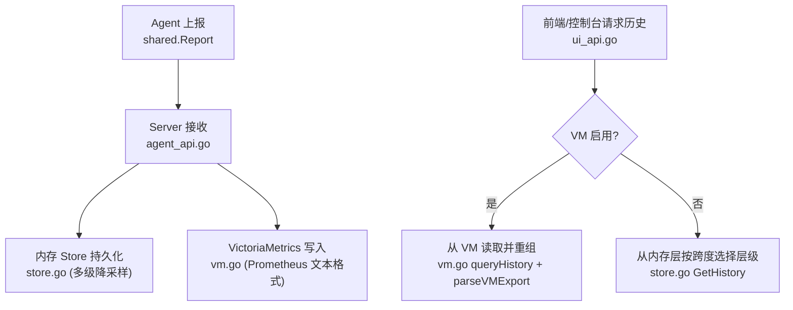
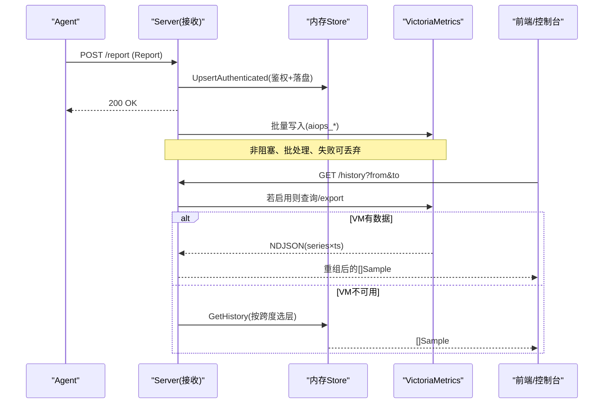
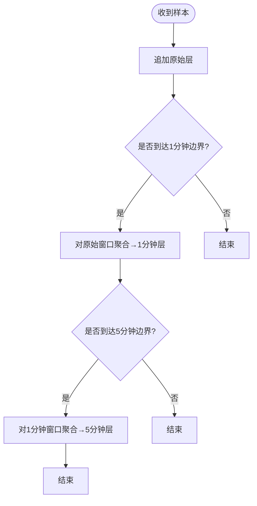
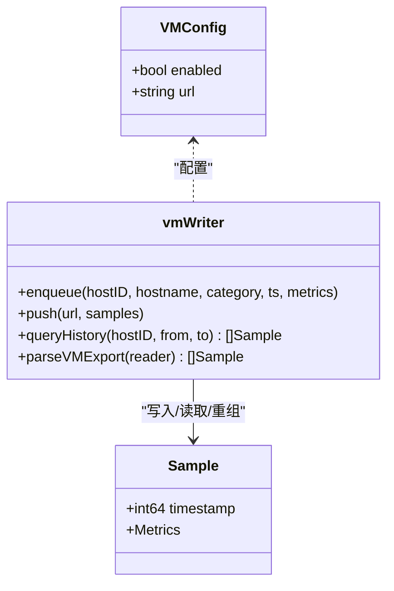
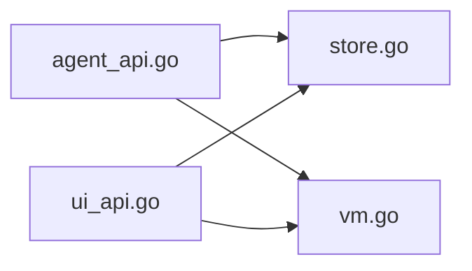

# VictoriaMetrics 时序数据模型

<cite>
**本文引用的文件**
- [shared/wire.go](file://shared/wire.go)
- [cmd/server/store.go](file://cmd/server/store.go)
- [cmd/server/vm.go](file://cmd/server/vm.go)
- [cmd/server/ui_api.go](file://cmd/server/ui_api.go)
- [cmd/server/agent_api.go](file://cmd/server/agent_api.go)
- [cmd/server/storage_test.go](file://cmd/server/storage_test.go)
- [cmd/server/check_vm_test.go](file://cmd/server/check_vm_test.go)
- [README_EN.md](file://README_EN.md)
</cite>

## 目录
1. [简介](#简介)
2. [项目结构](#项目结构)
3. [核心组件](#核心组件)
4. [架构总览](#架构总览)
5. [详细组件分析](#详细组件分析)
6. [依赖关系分析](#依赖关系分析)
7. [性能与容量规划](#性能与容量规划)
8. [故障排查指南](#故障排查指南)
9. [结论](#结论)
10. [附录：指标命名规范与查询优化](#附录：指标命名规范与查询优化)

## 简介
本文件系统化梳理本项目中基于 VictoriaMetrics 的时序数据模型，覆盖数据结构、多时间粒度聚合策略（原始数据、1分钟聚合、5分钟聚合）、指标命名规范、时间戳处理机制、数据保留策略与降采样算法，并给出 CPU、内存、磁盘、网络、GPU 等指标的存储格式与计算方式。同时提供查询优化建议、压缩与容量规划思路，以及数据导出导入方案和历史数据清理策略。

## 项目结构
围绕时序数据的关键代码集中在以下位置：
- 共享数据结构定义：shared/wire.go
- 服务端内存层与多级降采样：cmd/server/store.go
- VictoriaMetrics 集成（写入/读取/解析）：cmd/server/vm.go
- 历史查询入口（优先 VM，回退内存层）：cmd/server/ui_api.go
- Agent 上报接入与镜像到 VM：cmd/server/agent_api.go
- 测试用例（VM 导出解析与拨测/接口指标）：cmd/server/storage_test.go、cmd/server/check_vm_test.go
- 设计要点与性能说明：README_EN.md

图表来源
- [cmd/server/agent_api.go:107-129](file://cmd/server/agent_api.go#L107-L129)
- [cmd/server/store.go:268-307](file://cmd/server/store.go#L268-L307)
- [cmd/server/vm.go:505-571](file://cmd/server/vm.go#L505-L571)
- [cmd/server/ui_api.go:87-108](file://cmd/server/ui_api.go#L87-L108)

章节来源
- [shared/wire.go:1-139](file://shared/wire.go#L1-L139)
- [cmd/server/store.go:1-800](file://cmd/server/store.go#L1-L800)
- [cmd/server/vm.go:1-804](file://cmd/server/vm.go#L1-L804)
- [cmd/server/ui_api.go:87-108](file://cmd/server/ui_api.go#L87-L108)
- [cmd/server/agent_api.go:107-129](file://cmd/server/agent_api.go#L107-L129)
- [README_EN.md:991-1019](file://README_EN.md#L991-L1019)

## 核心组件
- 共享数据结构（wire 契约）
  - Metrics：主机基础指标快照（CPU、内存、Swap、磁盘、网络、负载、进程数、GPU、连接统计、磁盘 IO/IOPS、API 业务指标、任务指标等）。
  - Sample：带服务器接收时间戳的 Metrics 快照。
  - Report：Agent 上报载荷，包含主机元信息、Metrics、自定义指标与事件。
- 内存层 Host 与 Store
  - Host：单台主机的元数据与最新样本，以及三级历史缓存（原始、1分钟、5分钟）。
  - Store：维护所有 Host、事件环、活动日志、告警状态与历史；提供 UpsertAuthenticated、GetHistory 等方法。
- VictoriaMetrics 集成
  - vmWriter：将样本批量转换为 Prometheus 文本格式，通过 /api/v1/import/prometheus 推送；支持拨测与 API 探测指标族；提供 /export NDJSON 解析与 PromQL 瞬时查询。

章节来源
- [shared/wire.go:8-92](file://shared/wire.go#L8-L92)
- [cmd/server/store.go:29-51](file://cmd/server/store.go#L29-L51)
- [cmd/server/vm.go:30-77](file://cmd/server/vm.go#L30-L77)

## 架构总览
系统采用“内存多层级缓存 + 可选外部 TSDB”的双写/双读模式：
- 写入路径：Agent 上报 → Server 鉴权与去重 → 更新内存层（含多级降采样）→ 非阻塞镜像到 VictoriaMetrics（Prometheus 文本格式）。
- 读取路径：历史查询优先走 VM（持久化、重启不丢），若 VM 未启用或无数据则回退到内存层，并按时间跨度自动选择合适层级（原始/1分钟/5分钟）。

图表来源
- [cmd/server/agent_api.go:107-129](file://cmd/server/agent_api.go#L107-L129)
- [cmd/server/store.go:268-307](file://cmd/server/store.go#L268-L307)
- [cmd/server/vm.go:505-571](file://cmd/server/vm.go#L505-L571)
- [cmd/server/ui_api.go:87-108](file://cmd/server/ui_api.go#L87-L108)

## 详细组件分析

### 数据结构与字段语义
- shared.Metrics
  - CPU：CPUPercent、CPUCores
  - 内存：MemTotal/MemUsed/MemPercent；SwapTotal/SwapUsed/SwapPercent
  - 磁盘：DiskTotal/DiskUsed/DiskPercent；Disks[]（每分区 path/total/used/percent）
  - 网络：NetSentRate/NetRecvRate；Conns[]（proto/state/count）；NetConns（兼容旧字段）
  - 系统：Load1/Load5/Load15；ProcCount；Uptime
  - GPU：GPUs[]（name/util_percent/mem_used/free/total/percent/temp）
  - 磁盘IO/IOPS：DiskReadRate/DiskWriteRate/DiskIOUtilPercent；DiskReadIOPS/DiskWriteIOPS
  - 可选：API 业务指标（可用率、平均/P95响应、吞吐）；任务指标（失败次数、超时时长）
- shared.Sample
  - Timestamp：服务器接收时间（秒）
  - Metrics：上述指标快照
- shared.Report
  - 主机元信息（host_id/hostname/os/platform/arch/ip/kernel/category/fingerprint）
  - Metrics、Custom、Events

章节来源
- [shared/wire.go:8-139](file://shared/wire.go#L8-L139)

### 多级降采样与保留策略
- 三层历史（内存层）
  - 原始层：约 1.5 小时（~5s 间隔，最多 1200 点）
  - 1分钟聚合：最近 48 小时（最多 2880 点）
  - 5分钟聚合：最近 30 天（最多 8640 点）
- 触发条件
  - 每收到一个样本即入原始层；到达 1 分钟/5 分钟边界时，对窗口内样本进行聚合生成新点。
- 聚合规则（aggregateSamples）
  - 数值型指标取均值（如 CPU%、内存使用量、网络速率、负载、进程数等）
  - 总量类（内存/磁盘/swap）先对分子分母分别求均值再计算百分比
  - 计数器/单调值（如 Uptime）取最大值
  - 列表型（Disks/GPUs/Conns）按 key（path/name/proto+state）分组后逐键聚合
- 读取选择
  - 时间跨度 < 2h：返回原始层
  - 2h ≤ 跨度 < 48h：返回 1 分钟层
  - 跨度 ≥ 48h：返回 5 分钟层

图表来源
- [cmd/server/store.go:268-307](file://cmd/server/store.go#L268-L307)
- [cmd/server/store.go:355-573](file://cmd/server/store.go#L355-L573)
- [cmd/server/store.go:615-648](file://cmd/server/store.go#L615-L648)

章节来源
- [cmd/server/store.go:12-27](file://cmd/server/store.go#L12-L27)
- [cmd/server/store.go:268-307](file://cmd/server/store.go#L268-L307)
- [cmd/server/store.go:355-573](file://cmd/server/store.go#L355-L573)
- [cmd/server/store.go:615-648](file://cmd/server/store.go#L615-L648)

### VictoriaMetrics 写入与读取
- 写入格式
  - 使用 Prometheus 文本格式，通过 /api/v1/import/prometheus 批量写入
  - 指标前缀统一为 aiops_，标签包含 host、instance、category（可选）
  - 多维系列：
    - 磁盘分区：aiops_disk_vol_{percent,used_bytes,total_bytes}，标签 path
    - GPU：aiops_gpu_{util_percent,temp_c,mem_percent,mem_used_bytes,mem_free_bytes,mem_total_bytes}，标签 gpu
    - 连接计数：aiops_net_conn_count，标签 proto、state
- 读取与重组
  - 通过 /api/v1/export 获取 NDJSON（每行一条 series，values/timestamps 数组）
  - 按时间戳合并为 per-timestamp 的 Sample，重建 Disks/GPUs/Conns 等列表
  - 拨测与 API 探测指标族：aiops_check_*、aiops_api_*，同样经 export 重组
- 配置与开关
  - 通过环境变量 AIOPS_VM_URL 启用；未配置时启动报错提示
  - 写入为非阻塞队列，缓冲满则丢弃，确保不影响上报主路径

图表来源
- [cmd/server/vm.go:30-77](file://cmd/server/vm.go#L30-L77)
- [cmd/server/vm.go:505-571](file://cmd/server/vm.go#L505-L571)
- [cmd/server/vm.go:715-804](file://cmd/server/vm.go#L715-L804)

章节来源
- [cmd/server/vm.go:1-804](file://cmd/server/vm.go#L1-L804)
- [cmd/server/config.go:617-621](file://cmd/server/config.go#L617-L621)
- [cmd/server/main.go:258-259](file://cmd/server/main.go#L258-L259)

### 时间戳处理机制
- 上报侧：Sample.Timestamp 为服务器接收时间（秒）
- VM 写入：毫秒时间戳（ms）
- VM 读取：NDJSON timestamps 为毫秒，解析时统一除以 1000 转为秒
- 拨测/API 指标：同样遵循 ms→s 转换并在重组时排序

章节来源
- [cmd/server/vm.go:747-804](file://cmd/server/vm.go#L747-L804)
- [cmd/server/check_vm_test.go:1-35](file://cmd/server/check_vm_test.go#L1-L35)

### 指标命名规范与存储格式
- 统一前缀：aiops_
- 主机维度：host、instance、category（可选）
- 磁盘分区：aiops_disk_vol_*，标签 path
- GPU：aiops_gpu_*，标签 gpu
- 连接计数：aiops_net_conn_count，标签 proto、state
- 拨测：aiops_check_up/_latency_ms/_status_code/_loss_pct 等，标签 check_id、check_type、name
- API 探测：aiops_api_up/_latency_ms/_status_code/_dns_ms/_tcp_ms/_tls_ms/_ttfb_ms/_cert_days/_resp_bytes，标签 api_id、system、endpoint

章节来源
- [cmd/server/vm.go:505-571](file://cmd/server/vm.go#L505-L571)
- [cmd/server/vm.go:174-223](file://cmd/server/vm.go#L174-L223)
- [cmd/server/vm.go:296-343](file://cmd/server/vm.go#L296-L343)

### 各类指标的计算与聚合方式
- CPU：百分比取均值；核数取最后值
- 内存/交换：分子分母分别均值后再算百分比
- 磁盘（根分区）：同上；分区明细按 path 分组聚合
- 网络速率：均值；连接总数：均值；按(proto,state)分组计数均值
- 负载/进程数：均值；Uptime：取最大
- GPU：按 name 分组，利用率/温度/显存均取均值，再计算百分比

章节来源
- [cmd/server/store.go:355-573](file://cmd/server/store.go#L355-L573)

### 历史查询与回退策略
- 优先从 VM 读取（持久化、重启不丢）
- 若 VM 未启用或无数据，回退到内存层，按时间跨度自动选择层级（原始/1分钟/5分钟）

章节来源
- [cmd/server/ui_api.go:87-108](file://cmd/server/ui_api.go#L87-L108)
- [cmd/server/store.go:615-648](file://cmd/server/store.go#L615-L648)

## 依赖关系分析
- 模块耦合
  - agent_api.go 负责鉴权与落盘，并调用 vmWriter.enqueue 镜像到 VM
  - store.go 实现多级降采样与历史查询
  - vm.go 负责与 VM 的写入/读取/解析
  - ui_api.go 作为历史查询入口，协调 VM 与内存层
- 外部依赖
  - VictoriaMetrics：通过 HTTP 文本协议写入与导出
  - PostgreSQL（可选）：用于审计日志、事件、告警状态等元数据的持久化（与时序数据分离）

图表来源
- [cmd/server/agent_api.go:107-129](file://cmd/server/agent_api.go#L107-L129)
- [cmd/server/store.go:268-307](file://cmd/server/store.go#L268-L307)
- [cmd/server/vm.go:505-571](file://cmd/server/vm.go#L505-L571)
- [cmd/server/ui_api.go:87-108](file://cmd/server/ui_api.go#L87-L108)

章节来源
- [cmd/server/agent_api.go:107-129](file://cmd/server/agent_api.go#L107-L129)
- [cmd/server/store.go:268-307](file://cmd/server/store.go#L268-L307)
- [cmd/server/vm.go:505-571](file://cmd/server/vm.go#L505-L571)
- [cmd/server/ui_api.go:87-108](file://cmd/server/ui_api.go#L87-L108)

## 性能与容量规划
- 带宽与压缩
  - 上报 JSON 使用 gzip，压缩比约 8-10x；WebSocket 升级自动跳过
- 吞吐与内存
  - 典型规模：3000 主机 × 10s 上报 ≈ 300 次写入/秒
  - 内存占用：每台主机三层历史约 1-2 MB，3000 主机约 4-7 GB（可通过保留常量调优）
- 查询优化
  - 合理设置 from/to 跨度以命中更合适的层级（原始/1分钟/5分钟）
  - 在 VM 侧利用 PromQL 聚合（如 avg_over_time、quantile_over_time）减少传输与重组开销
- 容量规划
  - 内存层仅短期热缓存，长期趋势由 VM 承担
  - 结合 VM 的 retention 策略与压缩能力规划磁盘空间

章节来源
- [README_EN.md:991-1019](file://README_EN.md#L991-L1019)

## 故障排查指南
- VM 未启用导致无法查看历史
  - 检查环境变量 AIOPS_VM_URL 是否配置；未配置时服务启动会报错提示
- 历史曲线缺失 GPU/磁盘分区/连接计数
  - 确认 VM 写入包含对应标签（gpu/path/proto+state），且解析逻辑已按标签重建列表
  - 参考测试用例验证 NDJSON 重组正确性
- 上报延迟或丢失
  - VM 写入为队列非阻塞，缓冲满会丢弃；关注队列长度与 VM 可用性
- 拨测/API 指标异常
  - 校验 label 转义与指标名称前缀；确认 export 重组顺序与时间戳单位转换

章节来源
- [cmd/server/main.go:258-259](file://cmd/server/main.go#L258-L259)
- [cmd/server/storage_test.go:1-72](file://cmd/server/storage_test.go#L1-L72)
- [cmd/server/check_vm_test.go:1-35](file://cmd/server/check_vm_test.go#L1-L35)

## 结论
本项目通过“内存多层级缓存 + VictoriaMetrics 外部 TSDB”的组合，实现了高吞吐、低延迟的监控数据采集与可视化，同时具备长周期、大规模的趋势查询能力。统一的指标命名与严格的标签约定，配合标准化的导出/导入流程，使系统在可扩展性与可运维性上达到良好平衡。

## 附录：指标命名规范与查询优化

### 指标命名与标签约定
- 前缀：aiops_
- 主机维度：host、instance、category（可选）
- 磁盘分区：aiops_disk_vol_{percent,used_bytes,total_bytes}，标签 path
- GPU：aiops_gpu_{util_percent,temp_c,mem_percent,mem_used_bytes,mem_free_bytes,mem_total_bytes}，标签 gpu
- 连接计数：aiops_net_conn_count，标签 proto、state
- 拨测：aiops_check_up/_latency_ms/_status_code/_loss_pct 等，标签 check_id、check_type、name
- API 探测：aiops_api_up/_latency_ms/_status_code/_dns_ms/_tcp_ms/_tls_ms/_ttfb_ms/_cert_days/_resp_bytes，标签 api_id、system、endpoint

章节来源
- [cmd/server/vm.go:505-571](file://cmd/server/vm.go#L505-L571)
- [cmd/server/vm.go:174-223](file://cmd/server/vm.go#L174-L223)
- [cmd/server/vm.go:296-343](file://cmd/server/vm.go#L296-L343)

### 查询优化建议
- 使用 PromQL 在 VM 侧完成聚合（avg_over_time、quantile_over_time、count_over_time），减少数据回传
- 合理设置时间窗口，避免跨度过大导致大量数据重组
- 针对高频指标，优先使用 1 分钟/5 分钟层级进行概览，原始层仅用于短时精查

章节来源
- [cmd/server/vm.go:414-498](file://cmd/server/vm.go#L414-L498)
- [cmd/server/ui_api.go:87-108](file://cmd/server/ui_api.go#L87-L108)

### 数据导出/导入与历史清理
- 导出：通过 /api/v1/export 获取 NDJSON（series × values × timestamps），按时间戳重组为 Sample
- 导入：通过 /api/v1/import/prometheus 批量写入 Prometheus 文本格式
- 清理：
  - 内存层：受 histRawMax/hist1mMax/hist5mMax 限制，超出自动裁剪
  - VM 层：依据 VM 自身 retention 策略管理长期数据生命周期

章节来源
- [cmd/server/vm.go:747-804](file://cmd/server/vm.go#L747-L804)
- [cmd/server/store.go:12-27](file://cmd/server/store.go#L12-L27)