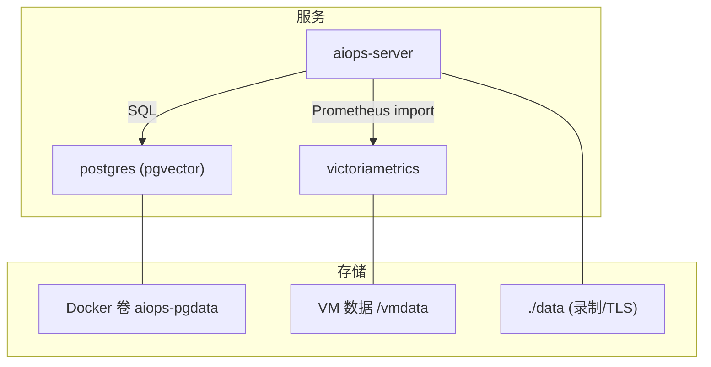
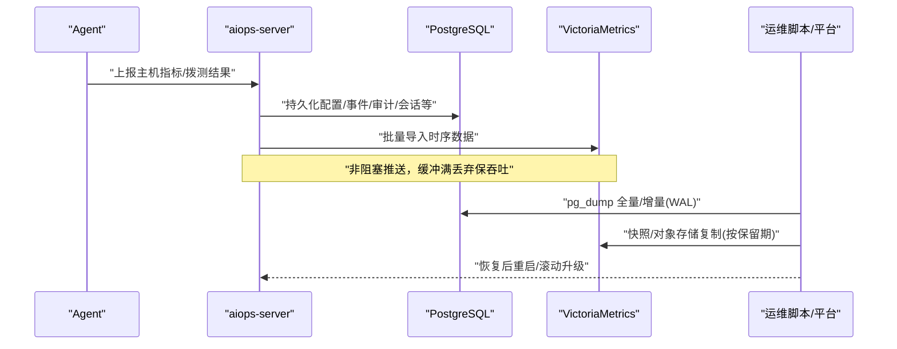
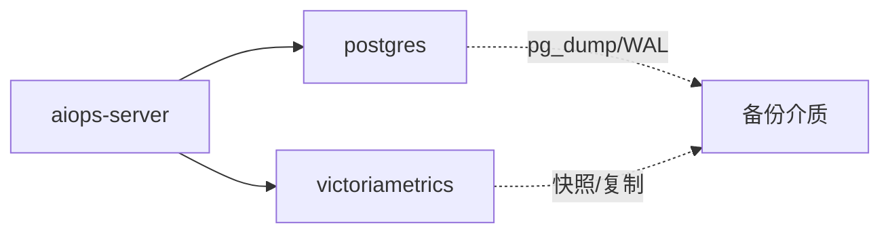

# 备份恢复与高可用

<cite>
**本文引用的文件**   
- [docker-compose.yml](file://docker-compose.yml)
- [cmd/server/main.go](file://cmd/server/main.go)
- [cmd/server/pgstore.go](file://cmd/server/pgstore.go)
- [cmd/server/vm.go](file://cmd/server/vm.go)
- [README.md](file://README.md)
- [fresh-test-prev-backup.sql](file://fresh-test-prev-backup.sql)
- [pg-backup-vectorfix.sql](file://pg-backup-vectorfix.sql)
</cite>

## 目录
1. [引言](#引言)
2. [项目结构](#项目结构)
3. [核心组件](#核心组件)
4. [架构总览](#架构总览)
5. [详细组件分析](#详细组件分析)
6. [依赖关系分析](#依赖关系分析)
7. [性能与容量规划](#性能与容量规划)
8. [故障排查指南](#故障排查指南)
9. [结论](#结论)
10. [附录](#附录)

## 引言
本文件面向生产环境，围绕 AIOps Monitor 的“备份、恢复与高可用”提供可落地的方案。系统采用统一存储：关系数据（配置/用户/审计/事件/工单/会话等）持久化至 PostgreSQL；时序数据（指标/趋势/SLO 计算源）写入 VictoriaMetrics。服务端启动时强制要求 PG + VM 均就绪，缺失任一将拒绝启动，从而避免状态静默落入本地文件导致不可恢复的风险。

## 项目结构
- 三容器编排：aiops-server（Go 单二进制 + 内嵌前端）、postgres（pgvector 扩展）、victoriametrics（时序库）。
- 关键环境变量：AIOPS_POSTGRES_DSN、AIOPS_VM_URL、AIOPS_SECRET_KEY（静态加密主密钥）、可选 AIOPS_TLS_CERT/AIOPS_TLS_KEY。
- 数据卷：PostgreSQL 使用具名卷 aiops-pgdata；VictoriaMetrics 数据路径 /vmdata；应用录制文件位于 ./data。

图示来源
- [docker-compose.yml:49-144](file://docker-compose.yml#L49-L144)
- [cmd/server/main.go:251-272](file://cmd/server/main.go#L251-L272)

章节来源
- [docker-compose.yml:1-144](file://docker-compose.yml#L1-L144)
- [cmd/server/main.go:251-272](file://cmd/server/main.go#L251-L272)
- [README.md:95-103](file://README.md#L95-L103)

## 核心组件
- PostgreSQL 层
  - 承载所有关系型数据与向量索引（pgvector），包含 app_config、audit_log、events、incidents、tickets、hosts、kv_state、terminal_recordings、diagnosis_embeddings、ai_memory_embeddings 等表。
  - 通过 pg_dump 进行逻辑备份，支持全量与增量（WAL 归档 + PITR）。
- VictoriaMetrics 层
  - 承载全部时序数据（主机指标、拨测、API 监控、SLO 计算源），默认保留期 36 个月，可通过参数调整。
  - 通过 /api/v1/import/prometheus 接收文本格式批量写入，/api/v1/export 用于导出历史。
- 服务端
  - 启动时校验并连接 PG 与 VM，未配置或不可达则拒绝启动。
  - 对敏感配置启用 AES-256-GCM 静态加密（需妥善备份 AIOPS_SECRET_KEY）。

章节来源
- [cmd/server/pgstore.go:77-212](file://cmd/server/pgstore.go#L77-L212)
- [cmd/server/vm.go:19-77](file://cmd/server/vm.go#L19-L77)
- [cmd/server/main.go:251-272](file://cmd/server/main.go#L251-L272)
- [docker-compose.yml:86-98](file://docker-compose.yml#L86-L98)

## 架构总览
下图展示运行时数据流与持久化路径，以及备份/恢复的关键节点。

图示来源
- [cmd/server/vm.go:125-172](file://cmd/server/vm.go#L125-L172)
- [cmd/server/pgstore.go:77-212](file://cmd/server/pgstore.go#L77-L212)
- [docker-compose.yml:86-98](file://docker-compose.yml#L86-L98)

## 详细组件分析

### PostgreSQL 备份策略与恢复流程
- 备份范围
  - 数据库对象与数据：app_config、audit_log、events、incidents、tickets、hosts、kv_state、terminal_recordings、diagnosis_embeddings、ai_memory_embeddings、hermes_*、experience_rules 等。
  - 参考仓库提供的 SQL 样例，覆盖完整 schema 与示例数据，便于演练与验证。
- 全量备份
  - 使用 pg_dump 生成逻辑备份（含 DDL/DML/序列/索引），适用于跨版本迁移与快速恢复。
  - 建议每日一次全量，保留 N 份（如最近 7 天）。
- 增量备份与时间点恢复（PITR）
  - 开启 WAL 归档，定时归档到对象存储或共享存储；结合最近一次全量可实现任意时间点恢复。
  - 注意：pgvector 扩展需在恢复后确保已启用。
- 一致性保证
  - 逻辑备份在事务边界内一致；若需热备一致性，配合物理备份（pg_basebackup）+ WAL 归档实现。
- 恢复步骤（逻辑恢复）
  - 准备新 PG 实例并创建数据库与用户。
  - 执行 pg_restore 或 psql 导入最新全量备份。
  - 回放 WAL 至目标时间点（PITR）。
  - 校验关键表行数与业务键（如 app_config.id=1）。
- 恢复步骤（物理恢复）
  - 停止旧实例，替换数据目录为备份副本。
  - 配置 recovery.signal 与 restore_command，指定目标时间。
  - 启动实例完成恢复，确认 pgvector 可用。

章节来源
- [fresh-test-prev-backup.sql:1-679](file://fresh-test-prev-backup.sql#L1-L679)
- [pg-backup-vectorfix.sql:1-449](file://pg-backup-vectorfix.sql#L1-L449)
- [cmd/server/pgstore.go:77-212](file://cmd/server/pgstore.go#L77-L212)

### VictoriaMetrics 备份策略与恢复流程
- 备份范围
  - 数据目录 /vmdata（由 docker-compose 映射），包含所有时序数据块。
  - 保留期由 -retentionPeriod 控制（示例 36 个月）。
- 全量备份
  - 直接复制 /vmdata 或使用对象存储同步工具（如 rclone/sync）定期快照。
  - 建议在低峰期执行，减少 IO 抖动。
- 增量/近实时保护
  - 利用文件系统级快照（云盘 LVM/ZFS/Btrfs）或对象存储版本化，实现分钟级增量。
- 恢复步骤
  - 停止 VM 进程，替换 /vmdata 为备份副本。
  - 以相同参数启动 VM，检查 UI 与 API 是否可查询历史。
- 注意事项
  - 恢复后如需查看近期窗口，需等待 VM 构建索引与合并。
  - 多副本部署时，优先从单一权威副本恢复，再同步其余副本。

章节来源
- [docker-compose.yml:86-98](file://docker-compose.yml#L86-L98)
- [cmd/server/vm.go:125-172](file://cmd/server/vm.go#L125-L172)

### 数据一致性保障
- 启动强约束
  - 服务端启动时强制要求 PG 与 VM 均连通，否则拒绝启动，避免“静默写本地”的不一致风险。
- 写入模型
  - 关系数据：事务性写入 PG，具备 ACID 特性。
  - 时序数据：批量导入 VM，失败不阻塞采集，但会记录告警日志以便追踪。
- 配置与密钥安全
  - 配置项中的敏感字段经 AES-256-GCM 静态加密落库，AIOPS_SECRET_KEY 丢失将无法解密。

章节来源
- [cmd/server/main.go:251-272](file://cmd/server/main.go#L251-L272)
- [docker-compose.yml:64-78](file://docker-compose.yml#L64-L78)

### 灾难恢复预案
- 场景一：单机磁盘损坏（PG/VM 同机）
  - 立即在新机部署 PG/VM，按上述流程恢复数据，切换 DNS/负载均衡指向新实例。
- 场景二：误删数据
  - 使用 PITR 回滚至删除前时间点；若无 PITR，使用最近全量 + WAL 回放。
- 场景三：服务中断（进程崩溃/配置错误）
  - 先恢复运行态（拉起容器/进程），再逐步恢复数据；必要时先只读挂载数据目录做诊断。
- 场景四：密钥丢失（AIOPS_SECRET_KEY）
  - 无法解密已存凭据，需重建凭据并重新录入；因此必须离线备份该密钥。

章节来源
- [cmd/server/main.go:251-272](file://cmd/server/main.go#L251-L272)
- [docker-compose.yml:64-78](file://docker-compose.yml#L64-L78)

### 高可用架构设计
- 当前形态
  - 单实例 aiops-server + 单实例 PG + 单实例 VM（compose 默认）。
- 推荐演进
  - PG：主从复制 + 自动故障转移（如 Patroni + etcd/Consul），或托管云 RDS 高可用版。
  - VM：多副本集群（VCluster/VMSingle 多副本模式），外部 LB 接入。
  - Server：无状态，水平扩展，前置 LB/Ingress 健康检查与灰度发布。
- 主从复制与自动切换
  - PG：基于流复制与仲裁，切换期间短暂不可写；应用侧需重试与短超时。
  - VM：多副本间数据最终一致，查询可路由到任意副本。

章节来源
- [docker-compose.yml:49-144](file://docker-compose.yml#L49-L144)
- [cmd/server/main.go:251-272](file://cmd/server/main.go#L251-L272)

### 自动化备份脚本（思路与要点）
- PostgreSQL
  - 每日全量：pg_dump 输出到对象存储，命名带日期与版本号。
  - 每小时增量：归档 WAL 到对象存储，保留周期与清理策略分离。
  - 恢复演练：每月在隔离环境执行一次 pg_restore + PITR 验证。
- VictoriaMetrics
  - 每日快照：rsync/rclone 同步 /vmdata 到对象存储，保留最近 N 份。
  - 恢复演练：在隔离环境替换 /vmdata 并启动 VM，验证查询。
- 密钥管理
  - AIOPS_SECRET_KEY 单独加密归档，限制访问权限，纳入机密管理。

[本节为通用实践说明，无需代码片段]

### 监控告警配置与维护计划
- 监控项
  - PG：连接数、慢查询、WAL 积压、备份任务成功/失败、空间使用率。
  - VM：写入延迟、磁盘使用率、查询延迟、保留期命中情况。
  - Server：进程存活、HTTP 响应码、PG/VM 连接成功率、内存/CPU。
- 告警渠道
  - 飞书/钉钉/邮件/短信/语音电话，按级别分流。
- 维护计划
  - 每周：备份完整性校验、索引统计更新、过期备份清理。
  - 每月：恢复演练、容量评估、阈值调优。
  - 每季：版本升级演练、灾备切换演练。

章节来源
- [README.md:561-575](file://README.md#L561-L575)
- [docker-compose.yml:86-98](file://docker-compose.yml#L86-L98)

### 备份验证测试与恢复演练流程
- 验证清单
  - 全量恢复后登录面板，核对 app_config、用户、审计日志、事件、工单。
  - 随机抽取若干主机 ID，在 VM 中查询其指标曲线是否连续。
  - 校验终端会话元数据列表与录制文件对应关系。
- 演练步骤
  - 准备隔离环境 → 部署 PG/VM → 导入最新全量 → 回放 WAL 至 T → 启动 Server → 功能与数据核验 → 记录 RTO/RPO。

章节来源
- [fresh-test-prev-backup.sql:376-468](file://fresh-test-prev-backup.sql#L376-L468)
- [pg-backup-vectorfix.sql:155-333](file://pg-backup-vectorfix.sql#L155-L333)

### RTO/RPO 目标设定
- RPO（数据丢失容忍）
  - 仅逻辑备份：RPO ≈ 全量间隔（建议 ≤ 24h）。
  - 逻辑备份 + WAL：RPO ≈ 归档间隔（建议 ≤ 5min）。
- RTO（恢复时长）
  - 小库（< 50GB）：逻辑恢复通常 10–30 分钟。
  - 大库：考虑并行恢复、预分配磁盘、预热缓存，目标 1–4 小时。
- 目标建议
  - 一般生产：RPO ≤ 5min，RTO ≤ 1h。
  - 关键业务：RPO ≤ 1min，RTO ≤ 15min（需物理备份 + 多副本 + 自动化切换）。

[本节为通用指导，无需代码片段]

## 依赖关系分析
- 启动依赖
  - aiops-server 依赖 postgres 与 victoriametrics，compose 中设置了 depends_on 与健康检查。
- 数据依赖
  - 关系数据强依赖 PG；时序数据强依赖 VM。
- 外部依赖
  - 可选 TLS 证书、镜像加速器、对象存储（备份）。

图示来源
- [docker-compose.yml:79-84](file://docker-compose.yml#L79-L84)
- [cmd/server/main.go:251-272](file://cmd/server/main.go#L251-L272)

章节来源
- [docker-compose.yml:79-84](file://docker-compose.yml#L79-L84)
- [cmd/server/main.go:251-272](file://cmd/server/main.go#L251-L272)

## 性能与容量规划
- PG
  - 连接池：MaxOpenConns/MaxIdleConns 合理设置，避免连接风暴。
  - 索引：按查询热点建索引（如时间戳、状态、标签）。
  - 备份：压缩传输、并发导出，降低备份窗口。
- VM
  - 保留期：根据成本与合规调整 retentionPeriod。
  - 写入：批量导入，避免高频小包。
  - 查询：PromQL 聚合尽量下推到 VM 侧现算。

章节来源
- [cmd/server/pgstore.go:49-75](file://cmd/server/pgstore.go#L49-L75)
- [docker-compose.yml:90-93](file://docker-compose.yml#L90-L93)
- [cmd/server/vm.go:125-172](file://cmd/server/vm.go#L125-L172)

## 故障排查指南
- 启动失败
  - 检查 AIOPS_POSTGRES_DSN 与 AIOPS_VM_URL 是否正确，网络可达性与鉴权。
  - 查看日志中关于 PG/VM 连接失败的提示。
- 数据不一致
  - 对比 app_config 与 kv_state 关键字段；核对 hosts 列表与 VM 中是否存在对应 host label。
- 备份异常
  - 检查 pg_dump 返回码与对象存储上传状态；确认 WAL 归档路径可写。
- 恢复后查询异常
  - 确认 VM 索引构建进度；必要时等待一段时间或触发 compaction。

章节来源
- [cmd/server/main.go:251-272](file://cmd/server/main.go#L251-L272)
- [docker-compose.yml:64-78](file://docker-compose.yml#L64-L78)

## 结论
通过将关系数据与时序数据分别落至 PostgreSQL 与 VictoriaMetrics，并在启动阶段强制校验二者可用性，AIOps Monitor 提供了清晰的数据边界与可恢复性基础。配合完善的备份策略（全量 + 增量/PITR）、恢复演练与高可用演进（PG 主从/VM 多副本），可在满足 RTO/RPO 目标的同时，保障服务的持续稳定运行。

## 附录
- 相关参考
  - 仓库 README 中对统一存储与 compose 一键启动的说明。
  - 两个 SQL 样例可用于恢复演练与结构对照。

章节来源
- [README.md:95-103](file://README.md#L95-L103)
- [fresh-test-prev-backup.sql:1-679](file://fresh-test-prev-backup.sql#L1-L679)
- [pg-backup-vectorfix.sql:1-449](file://pg-backup-vectorfix.sql#L1-L449)