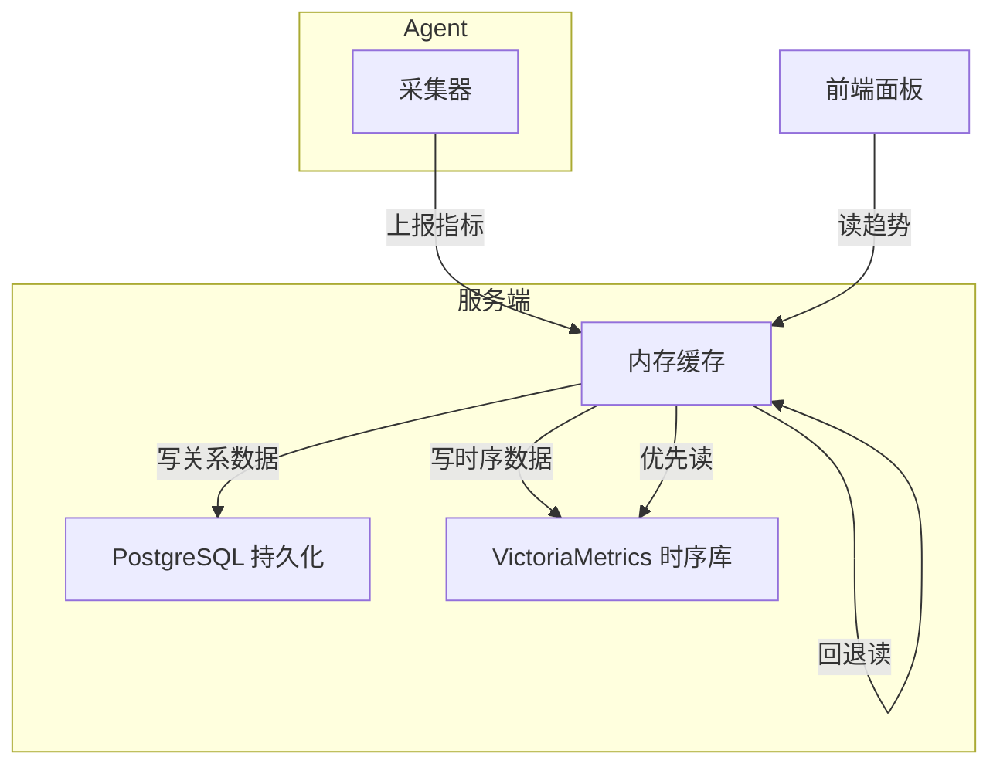
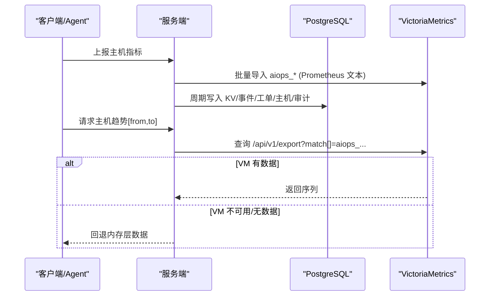
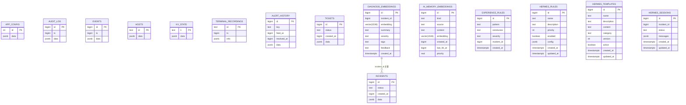
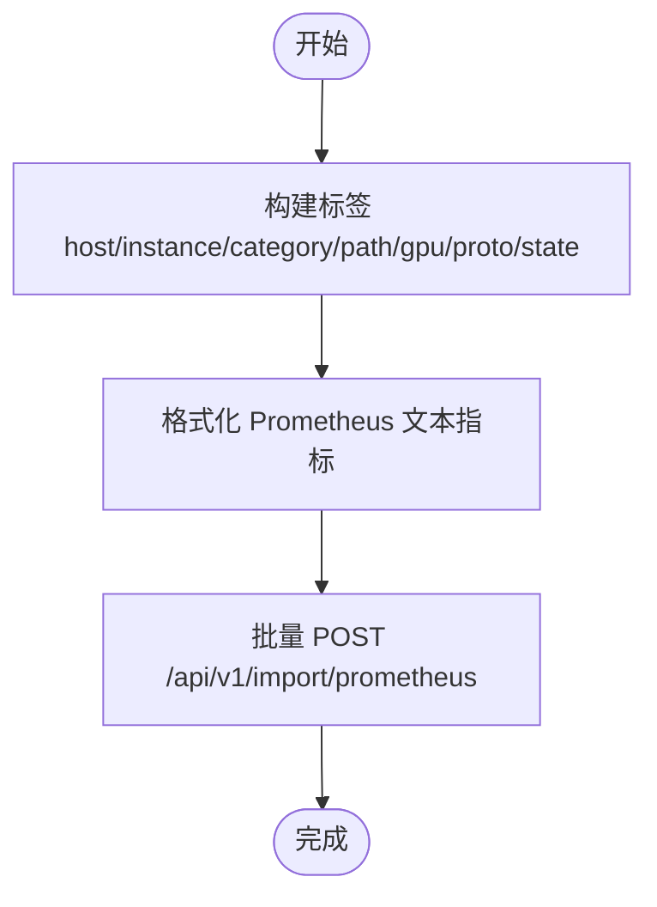
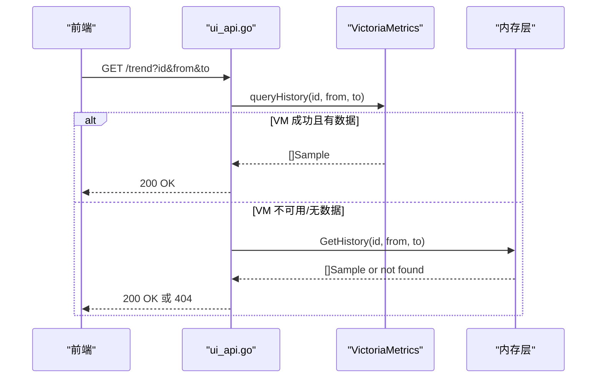
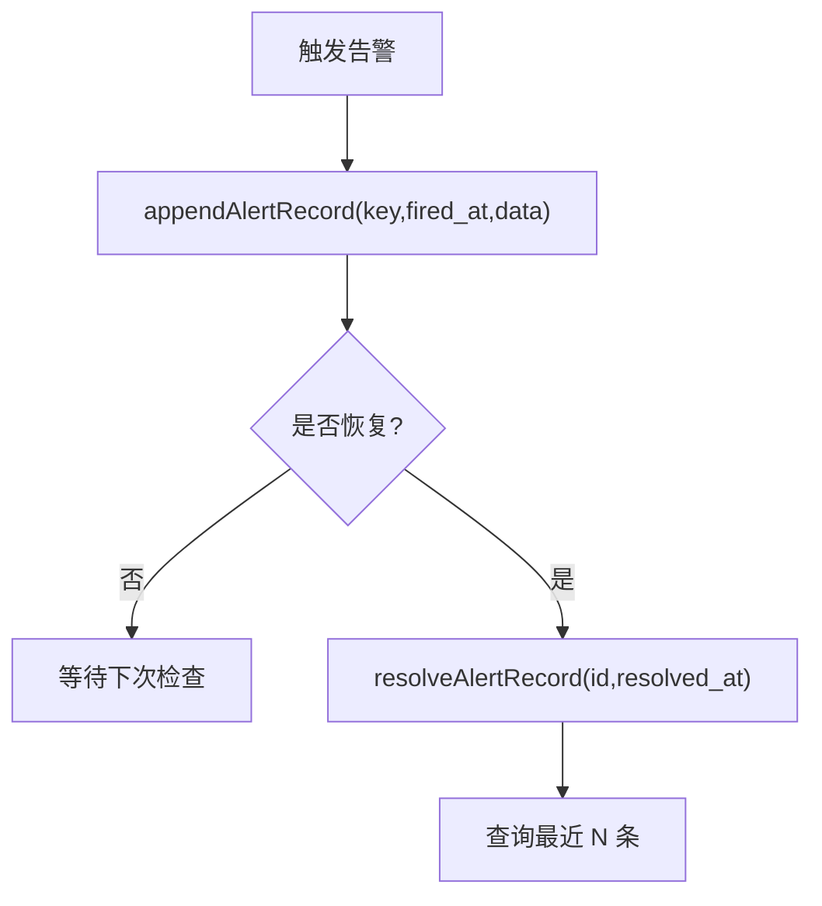
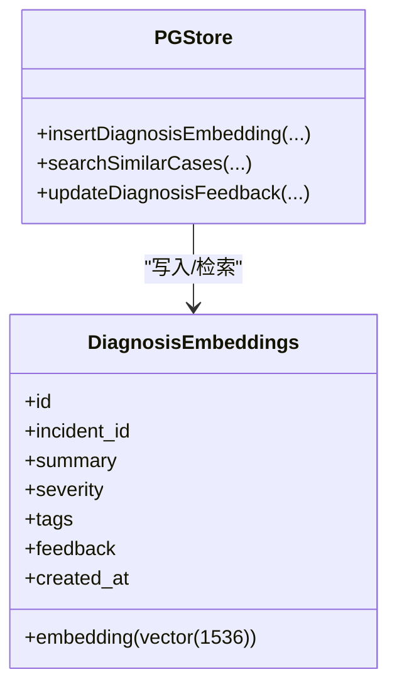
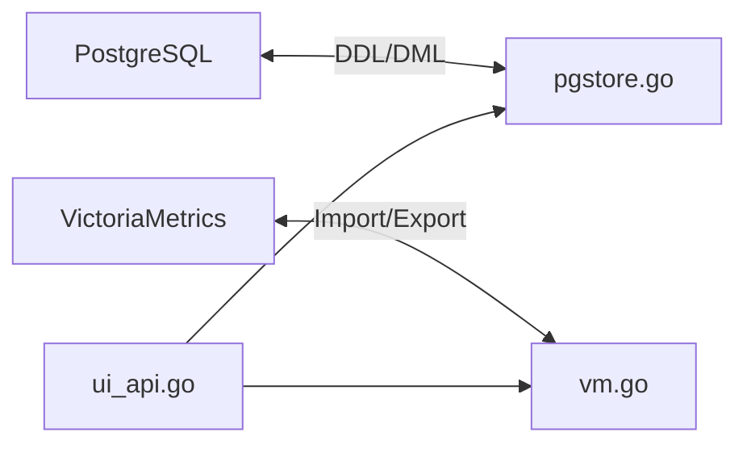

# 数据库设计

<cite>
**本文引用的文件**   
- [pgstore.go](file://cmd/server/pgstore.go)
- [vm.go](file://cmd/server/vm.go)
- [ui_api.go](file://cmd/server/ui_api.go)
- [fresh-test-prev-backup.sql](file://fresh-test-prev-backup.sql)
- [pg-backup-vectorfix.sql](file://pg-backup-vectorfix.sql)
</cite>

## 目录
1. [引言](#引言)
2. [项目结构](#项目结构)
3. [核心组件](#核心组件)
4. [架构总览](#架构总览)
5. [详细组件分析](#详细组件分析)
6. [依赖关系分析](#依赖关系分析)
7. [性能与容量规划](#性能与容量规划)
8. [初始化、迁移与备份恢复](#初始化迁移与备份恢复)
9. [故障排查指南](#故障排查指南)
10. [结论](#结论)

## 引言
本文件面向 AIOps Monitor 的数据库设计，覆盖 PostgreSQL 关系型数据模型（用户/配置/审计/事件/工单/会话等）与 VictoriaMetrics 时序数据模型（指标命名、时间戳处理、查询聚合）。文档基于源码中的表定义、索引策略、约束条件以及 VM 写入/读取逻辑进行系统化梳理，并提供初始化脚本路径、迁移方案、备份恢复策略、性能优化建议与容量规划指导。

## 项目结构
- 关系型存储：PostgreSQL，通过环境变量 AIOPS_POSTGRES_DSN 启用；服务启动时自动执行 DDL 迁移并创建必要索引。
- 时序存储：VictoriaMetrics，通过环境变量 AIOPS_VM_URL 启用；主机指标、拨测与 API 监控结果以 Prometheus 文本格式批量导入。
- 前端趋势图：优先从 VM 读取历史，若不可用则回退到内存层。

图表来源
- [pgstore.go:77-212](file://cmd/server/pgstore.go#L77-L212)
- [vm.go:505-571](file://cmd/server/vm.go#L505-L571)
- [ui_api.go:87-108](file://cmd/server/ui_api.go#L87-L108)

章节来源
- [pgstore.go:77-212](file://cmd/server/pgstore.go#L77-L212)
- [vm.go:505-571](file://cmd/server/vm.go#L505-L571)
- [ui_api.go:87-108](file://cmd/server/ui_api.go#L87-L108)

## 核心组件
- PostgreSQL 表族
  - 应用配置：app_config
  - 审计日志：audit_log
  - 事件记录：events
  - 主机元数据：hosts
  - KV 状态：kv_state
  - 终端录制索引：terminal_recordings
  - 告警历史：alert_history
  - 事件/工单：incidents, tickets
  - AI 诊断向量记忆：diagnosis_embeddings
  - 通用 AI 记忆：ai_memory_embeddings
  - 经验规则：experience_rules
  - Hermes Agent 规则/模板/会话：hermes_rules, hermes_templates, hermes_sessions
- VictoriaMetrics 时序数据
  - 主机指标：aiops_* 系列
  - 自定义拨测：aiops_check_* 系列
  - API 监控：aiops_api_* 系列

章节来源
- [pgstore.go:77-212](file://cmd/server/pgstore.go#L77-L212)
- [vm.go:174-223](file://cmd/server/vm.go#L174-L223)
- [vm.go:296-343](file://cmd/server/vm.go#L296-L343)
- [vm.go:505-571](file://cmd/server/vm.go#L505-L571)

## 架构总览
- 启动阶段：连接 PG，执行 migrate() 确保所有表与索引存在；加载 KV 状态与实例态（事件、工单、会话、消息、SLO 燃烧状态、剧本执行历史等）。
- 运行期：
  - 主机指标上报：内存层 + 可选地批量推送到 VM。
  - 趋势查询：优先走 VM 的 /api/v1/export，失败或无数据时回退内存层。
  - 关系数据变更：周期性 flush 到 PG（KV、事件、工单、主机、审计等）。
  - 终端录制：仅将元数据存 PG，内容落本地文件。
  - AI 能力：诊断与通用记忆向量化存储于 PG（vector(1536)），支持相似度检索。

图表来源
- [vm.go:505-571](file://cmd/server/vm.go#L505-L571)
- [vm.go:713-742](file://cmd/server/vm.go#L713-L742)
- [ui_api.go:87-108](file://cmd/server/ui_api.go#L87-L108)
- [pgstore.go:1115-1171](file://cmd/server/pgstore.go#L1115-L1171)

## 详细组件分析

### PostgreSQL 表结构与关系
- app_config
  - 用途：集中存放系统配置（JSONB），id=1 为唯一行。
  - 主键：id
  - 字段要点：data JSONB NOT NULL
  - 参考路径：[pgstore.go:94-97](file://cmd/server/pgstore.go#L94-L97)、[fresh-test-prev-backup.sql:44-47](file://fresh-test-prev-backup.sql#L44-L47)
- audit_log
  - 用途：追加式审计日志，按 ts 排序查询。
  - 主键：id(BIGSERIAL)
  - 索引：ts
  - 字段要点：ts BIGINT, data JSONB
  - 参考路径：[pgstore.go:98-103](file://cmd/server/pgstore.go#L98-L103)、[fresh-test-prev-backup.sql:54-58](file://fresh-test-prev-backup.sql#L54-L58)
- events
  - 用途：插件/系统事件记录，按 ts 排序。
  - 主键：id(BIGSERIAL)
  - 索引：ts
  - 字段要点：ts BIGINT, data JSONB
  - 参考路径：[pgstore.go:104-109](file://cmd/server/pgstore.go#L104-L109)、[fresh-test-prev-backup.sql:119-123](file://fresh-test-prev-backup.sql#L119-L123)
- hosts
  - 用途：主机元数据与最新快照（JSONB），用于列表展示与离线判定。
  - 主键：id(TEXT)
  - 字段要点：data JSONB
  - 参考路径：[pgstore.go:110-113](file://cmd/server/pgstore.go#L110-L113)、[fresh-test-prev-backup.sql:286-289](file://fresh-test-prev-backup.sql#L286-L289)
- kv_state
  - 用途：KV 状态（如 alert_states、sessions、messages、ai_inspections、remediation_runs、slo_burning、logs、playbook_executions 等）。
  - 主键：k(TEXT)
  - 字段要点：data JSONB
  - 参考路径：[pgstore.go:114-117](file://cmd/server/pgstore.go#L114-L117)、[fresh-test-prev-backup.sql:308-311](file://fresh-test-prev-backup.sql#L308-L311)
- terminal_recordings
  - 用途：终端会话录制的“永久审计索引”，只存 info 元数据，实际帧文件落盘。
  - 主键：id(TEXT)
  - 索引：ts DESC
  - 字段要点：ts BIGINT, info JSONB
  - 兼容处理：DROP COLUMN IF EXISTS recording
  - 参考路径：[pgstore.go:120-127](file://cmd/server/pgstore.go#L120-L127)
- diagnosis_embeddings
  - 用途：AI 诊断向量记忆（RAG），incident_id 关联事件，embedding vector(1536)。
  - 主键：id(BIGSERIAL)
  - 索引：incident_id
  - 字段要点：embedding vector(1536), summary TEXT, severity TEXT, tags TEXT, feedback TEXT DEFAULT '', created_at TIMESTAMPTZ
  - 参考路径：[pgstore.go:129-138](file://cmd/server/pgstore.go#L129-L138)、[fresh-test-prev-backup.sql:84-93](file://fresh-test-prev-backup.sql#L84-L93)
- ai_memory_embeddings
  - 用途：通用 AI 记忆（chat/file/url/history/diagnosis），支持优先级与命中时间衰减。
  - 主键：id(BIGSERIAL)
  - 索引：kind, created_at DESC, (kind, created_at DESC)
  - 字段要点：kind TEXT, source TEXT, content TEXT, embedding vector(1536), created_at BIGINT, last_hit_at BIGINT DEFAULT 0, priority REAL DEFAULT 1.0
  - 兼容处理：ADD COLUMN IF NOT EXISTS last_hit_at/priority
  - 参考路径：[pgstore.go:141-156](file://cmd/server/pgstore.go#L141-L156)
- experience_rules
  - 用途：经验规则库（高频问题最佳实践）。
  - 主键：id(BIGSERIAL)
  - 字段要点：pattern TEXT, conclusion TEXT, severity TEXT, incident_id BIGINT, created_at TIMESTAMPTZ
  - 参考路径：[pgstore.go:158-165](file://cmd/server/pgstore.go#L158-L165)、[fresh-test-prev-backup.sql:149-156](file://fresh-test-prev-backup.sql#L149-L156)
- hermes_rules
  - 用途：Hermes Agent 规则库（诊断规则+行动策略）。
  - 主键：id(BIGSERIAL)
  - 索引：enabled
  - 字段要点：name TEXT, description TEXT DEFAULT '', priority INT DEFAULT 0, enabled BOOLEAN DEFAULT true, config JSONB, created_at/updated_at TIMESTAMPTZ
  - 参考路径：[pgstore.go:167-177](file://cmd/server/pgstore.go#L167-L177)、[fresh-test-prev-backup.sql:182-191](file://fresh-test-prev-backup.sql#L182-L191)
- hermes_templates
  - 用途：Hermes Agent 提示模板库（系统提示+场景模板）。
  - 主键：id(BIGSERIAL)
  - 索引：active
  - 字段要点：name TEXT, description TEXT DEFAULT '', content TEXT, category TEXT DEFAULT 'system', version INT DEFAULT 1, active BOOLEAN DEFAULT true, created_at/updated_at TIMESTAMPTZ
  - 参考路径：[pgstore.go:179-190](file://cmd/server/pgstore.go#L179-L190)、[fresh-test-prev-backup.sql:250-260](file://fresh-test-prev-backup.sql#L250-L260)
- hermes_sessions
  - 用途：Hermes Agent 会话记忆（messages JSONB）。
  - 主键：id(BIGSERIAL)
  - 字段要点：incident_id BIGINT DEFAULT 0, status TEXT DEFAULT 'active', messages JSONB DEFAULT '[]', created_at/updated_at TIMESTAMPTZ
  - 参考路径：[pgstore.go:192-199](file://cmd/server/pgstore.go#L192-L199)、[fresh-test-prev-backup.sql:217-224](file://fresh-test-prev-backup.sql#L217-L224)
- alert_history
  - 用途：告警历史持久化（触发插入，恢复更新 resolved_at）。
  - 主键：id(BIGSERIAL)
  - 索引：key, fired_at DESC
  - 字段要点：key TEXT, fired_at BIGINT, resolved_at BIGINT DEFAULT 0, data JSONB
  - 参考路径：[pgstore.go:201-209](file://cmd/server/pgstore.go#L201-L209)
- incidents
  - 用途：事件（告警/SLO/手动汇聚 + 时间线）。
  - 主键：id(BIGINT)
  - 索引：status
  - 字段要点：status TEXT, created_at BIGINT, data JSONB
  - 参考路径：[pgstore.go:80-86](file://cmd/server/pgstore.go#L80-L86)、[fresh-test-prev-backup.sql:296-301](file://fresh-test-prev-backup.sql#L296-L301)
- tickets
  - 用途：工单管理。
  - 主键：id(BIGINT)
  - 索引：status
  - 字段要点：status TEXT, created_at BIGINT, data JSONB
  - 参考路径：[pgstore.go:87-92](file://cmd/server/pgstore.go#L87-L92)、[fresh-test-prev-backup.sql:318-323](file://fresh-test-prev-backup.sql#L318-L323)

图表来源
- [pgstore.go:77-212](file://cmd/server/pgstore.go#L77-L212)
- [fresh-test-prev-backup.sql:44-323](file://fresh-test-prev-backup.sql#L44-L323)

章节来源
- [pgstore.go:77-212](file://cmd/server/pgstore.go#L77-L212)
- [fresh-test-prev-backup.sql:44-323](file://fresh-test-prev-backup.sql#L44-L323)

### VictoriaMetrics 时序数据模型
- 主机指标（aiops_*）
  - 指标族示例：cpu_percent、mem_percent、disk_percent、net_sent_rate、load1/5/15、proc_count、gpu_util_percent、net_conn_count 等。
  - Label：host、instance、category、path（分区）、gpu（显卡名）、proto/state（连接计数）。
  - 时间戳：毫秒级 Unix 时间戳。
  - 写入接口：/api/v1/import/prometheus（text/plain）。
  - 参考路径：[vm.go:505-571](file://cmd/server/vm.go#L505-L571)
- 自定义拨测（aiops_check_*）
  - 指标族：aiops_check_up、aiops_check_latency_ms、aiops_check_status_code、aiops_check_loss_pct、aiops_check_dns/tcp/tls/ttfb_ms、aiops_check_cert_days、aiops_check_resp_bytes。
  - Label：check_id、check_type、name。
  - 参考路径：[vm.go:174-223](file://cmd/server/vm.go#L174-L223)
- API 监控（aiops_api_*）
  - 指标族：aiops_api_up、aiops_api_latency_ms、aiops_api_status_code、aiops_api_dns/tcp/tls/ttfb_ms、aiops_api_cert_days、aiops_api_resp_bytes。
  - Label：api_id、system、endpoint。
  - 参考路径：[vm.go:296-343](file://cmd/server/vm.go#L296-L343)
- 查询聚合
  - PromQL 瞬时查询：avg_over_time、quantile_over_time(0.95)、count_over_time 等，计算平均/ P95/可用率/采样数。
  - 参考路径：[vm.go:467-498](file://cmd/server/vm.go#L467-L498)

图表来源
- [vm.go:505-571](file://cmd/server/vm.go#L505-L571)

章节来源
- [vm.go:174-223](file://cmd/server/vm.go#L174-L223)
- [vm.go:296-343](file://cmd/server/vm.go#L296-L343)
- [vm.go:467-498](file://cmd/server/vm.go#L467-L498)
- [vm.go:505-571](file://cmd/server/vm.go#L505-L571)

### 关键流程与时序

#### 主机趋势查询（UI）

图表来源
- [ui_api.go:87-108](file://cmd/server/ui_api.go#L87-L108)
- [vm.go:713-742](file://cmd/server/vm.go#L713-L742)

章节来源
- [ui_api.go:87-108](file://cmd/server/ui_api.go#L87-L108)
- [vm.go:713-742](file://cmd/server/vm.go#L713-L742)

#### 告警历史写入与恢复

图表来源
- [pgstore.go:413-448](file://cmd/server/pgstore.go#L413-L448)

章节来源
- [pgstore.go:413-448](file://cmd/server/pgstore.go#L413-L448)

#### AI 诊断向量检索（RAG）

图表来源
- [pgstore.go:554-600](file://cmd/server/pgstore.go#L554-L600)

章节来源
- [pgstore.go:554-600](file://cmd/server/pgstore.go#L554-L600)

## 依赖关系分析
- 运行时依赖
  - PostgreSQL：必须提供 AIOPS_POSTGRES_DSN，否则拒绝启动（根据 README 说明）。
  - VictoriaMetrics：必须提供 AIOPS_VM_URL，否则拒绝启动（根据 README 说明）。
- 代码耦合
  - pgstore.go 负责所有关系数据的 DDL/DML 与迁移。
  - vm.go 负责时序数据的写入与查询（Prometheus 文本协议）。
  - ui_api.go 协调 VM 与内存层的趋势读取。

图表来源
- [pgstore.go:77-212](file://cmd/server/pgstore.go#L77-L212)
- [vm.go:505-571](file://cmd/server/vm.go#L505-L571)
- [ui_api.go:87-108](file://cmd/server/ui_api.go#L87-L108)

章节来源
- [pgstore.go:77-212](file://cmd/server/pgstore.go#L77-L212)
- [vm.go:505-571](file://cmd/server/vm.go#L505-L571)
- [ui_api.go:87-108](file://cmd/server/ui_api.go#L87-L108)

## 性能与容量规划
- 写入吞吐
  - VM 写入采用批处理与 fire-and-forget，缓冲满即丢弃，避免阻塞 Agent 上报。
  - PG 写入使用预编译语句与事务批量 upsert（如 hosts/incidents/tickets）。
- 索引策略
  - 时间序列类：audit_log.ts、events.ts、alert_history.fired_at DESC。
  - 过滤类：incidents.status、tickets.status、hermes_rules.enabled、hermes_templates.active。
  - 向量检索：diagnosis_embeddings.incident_id、ai_memory_embeddings(kind, created_at DESC)。
- 查询优化
  - 趋势查询优先走 VM，减少 PG 压力；必要时回退内存层。
  - 对大表（audit_log/events/alert_history）采用 LIMIT 分页与倒序再正序输出，避免全表扫描。
- 容量规划
  - PG：重点控制 JSONB 体积（尤其是 logs、messages、ai_inspections 等 KV 项），定期归档或清理。
  - VM：合理设置保留策略（TTL），结合 label 基数控制（host/instance/category/path/gpu/proto/state）避免高基导致膨胀。
  - 向量表：控制 embedding 维度与条目数量，必要时按 incident_id 分片或归档旧数据。

章节来源
- [vm.go:125-172](file://cmd/server/vm.go#L125-L172)
- [pgstore.go:237-263](file://cmd/server/pgstore.go#L237-L263)
- [pgstore.go:413-448](file://cmd/server/pgstore.go#L413-L448)
- [ui_api.go:87-108](file://cmd/server/ui_api.go#L87-L108)

## 初始化、迁移与备份恢复

### 初始化与迁移
- 启动时自动执行 DDL 迁移（包含扩展 vector、建表、索引、兼容列添加等）。
- 参考路径：
  - [pgstore.go:77-212](file://cmd/server/pgstore.go#L77-L212)

### 备份与恢复
- 提供两个 SQL 导出样例，可用于参考表结构与初始数据：
  - [fresh-test-prev-backup.sql](file://fresh-test-prev-backup.sql)
  - [pg-backup-vectorfix.sql](file://pg-backup-vectorfix.sql)
- 建议策略
  - 使用 pg_dump 定时全量备份，配合 WAL 增量备份实现时间点恢复。
  - 针对大表（audit_log、events、alert_history）可考虑按时间范围拆分备份。
  - 向量表需关注 pgvector 扩展版本一致性，迁移时需保证 vector 类型兼容。

章节来源
- [pgstore.go:77-212](file://cmd/server/pgstore.go#L77-L212)
- [fresh-test-prev-backup.sql:1-679](file://fresh-test-prev-backup.sql#L1-L679)
- [pg-backup-vectorfix.sql:1-449](file://pg-backup-vectorfix.sql#L1-L449)

## 故障排查指南
- PG 连接失败
  - 现象：无法连接 PG，服务可能回落内嵌存储或拒绝启动（取决于配置）。
  - 排查：检查 AIOPS_POSTGRES_DSN 是否正确、网络连通性、权限。
  - 参考路径：[pgstore.go:17-30](file://cmd/server/pgstore.go#L17-L30)
- VM 写入失败
  - 现象：日志中出现“VictoriaMetrics 写入失败”警告。
  - 排查：确认 AIOPS_VM_URL 可达、端口开放、/api/v1/import/prometheus 正常。
  - 参考路径：[vm.go:560-571](file://cmd/server/vm.go#L560-L571)
- 趋势查询为空
  - 现象：前端趋势图无数据。
  - 排查：优先检查 VM 是否启用且可查询；若不可用，确认内存层是否有近期数据。
  - 参考路径：[ui_api.go:87-108](file://cmd/server/ui_api.go#L87-L108)
- 向量检索异常
  - 现象：RAG 检索失败或维度不匹配。
  - 排查：确认 embedding 维度与 PG 列一致（默认 1536），向量端点返回维度一致。
  - 参考路径：[pgstore.go:129-138](file://cmd/server/pgstore.go#L129-L138)

章节来源
- [pgstore.go:17-30](file://cmd/server/pgstore.go#L17-L30)
- [vm.go:560-571](file://cmd/server/vm.go#L560-L571)
- [ui_api.go:87-108](file://cmd/server/ui_api.go#L87-L108)
- [pgstore.go:129-138](file://cmd/server/pgstore.go#L129-L138)

## 结论
本设计通过 PostgreSQL 承载结构化与半结构化数据（配置、审计、事件、工单、会话、AI 记忆等），并通过 VictoriaMetrics 承载海量时序数据（主机指标、拨测、API 监控）。在启动阶段自动迁移表结构，运行期通过批处理与索引优化保障吞吐与查询性能。建议在生产环境严格配置 PG 与 VM 的连接参数，制定合理的备份与保留策略，并结合业务规模调整 label 基数与索引策略，以获得稳定可扩展的运维平台体验。