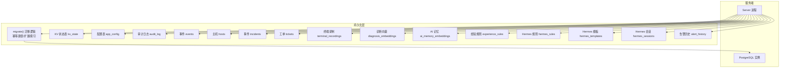
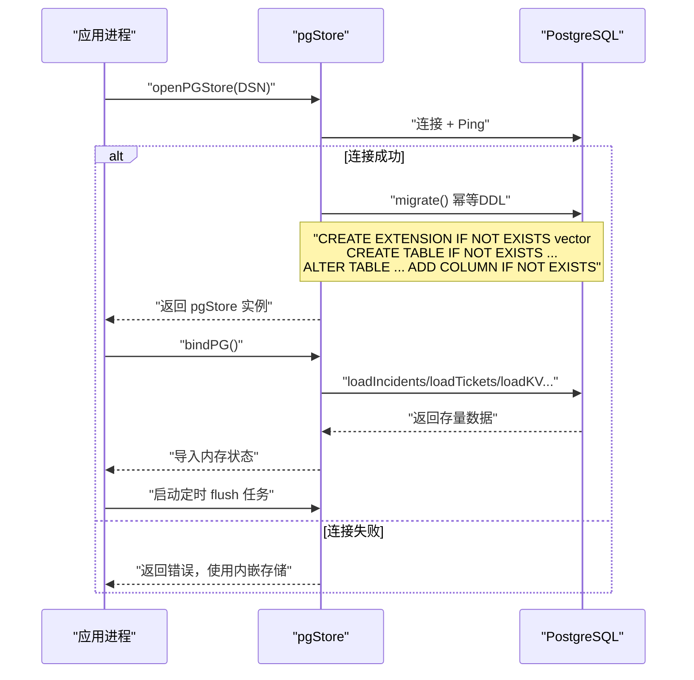
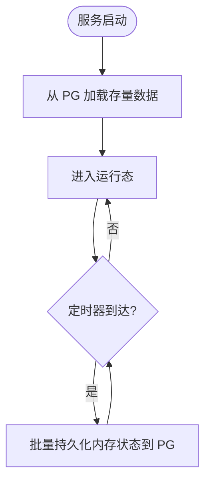
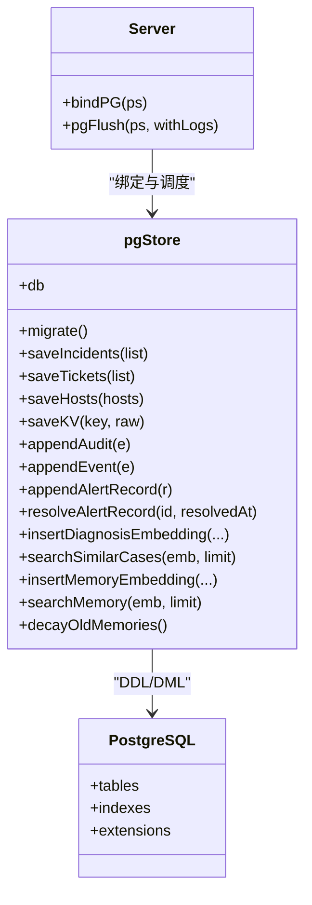

# 数据迁移与版本管理

<cite>
**本文引用的文件**   
- [pgstore.go](file://cmd/server/pgstore.go)
- [fresh-test-prev-backup.sql](file://fresh-test-prev-backup.sql)
</cite>

## 目录
1. [引言](#引言)
2. [项目结构](#项目结构)
3. [核心组件](#核心组件)
4. [架构总览](#架构总览)
5. [详细组件分析](#详细组件分析)
6. [依赖关系分析](#依赖关系分析)
7. [性能考量](#性能考量)
8. [故障排查指南](#故障排查指南)
9. [结论](#结论)
10. [附录](#附录)

## 引言
本文件聚焦于 AIOps Monitor 的数据库迁移与版本管理策略，围绕 PostgreSQL 存储层的初始化、增量变更、向后兼容、升级路径、回滚策略、生产环境最佳实践、零停机升级方案、数据一致性检查以及迁移失败处理流程展开。文档基于代码仓库中实际实现进行分析，确保所有说明均可追溯至源码与脚本。

## 项目结构
本项目采用“应用内联式迁移”的模式：在启动时通过 Go 代码执行 DDL（CREATE/ALTER/INDEX），保证新表、扩展与索引存在且幂等；同时提供 SQL 备份文件用于冷备与恢复。

图表来源
- [pgstore.go:77-212](file://cmd/server/pgstore.go#L77-L212)

章节来源
- [pgstore.go:77-212](file://cmd/server/pgstore.go#L77-L212)

## 核心组件
- 连接与迁移入口
  - openPGStore：从环境变量读取 DSN，建立连接并执行迁移；若失败则回落至内嵌存储模式。
  - migrate：一次性幂等 DDL，包含扩展启用、表创建、索引创建与兼容性 ALTER。
- 运行时同步
  - bindPG：启动时将 PG 中的关键状态导入内存，定时将内存状态刷写回 PG。
  - pgFlush：周期性持久化（含大对象节流）。
- 数据模型快照
  - fresh-test-prev-backup.sql：完整数据库导出，可作为基线或恢复点。

章节来源
- [pgstore.go:47-75](file://cmd/server/pgstore.go#L47-L75)
- [pgstore.go:77-212](file://cmd/server/pgstore.go#L77-L212)
- [pgstore.go:1055-1171](file://cmd/server/pgstore.go#L1055-L1171)
- [fresh-test-prev-backup.sql:1-679](file://fresh-test-prev-backup.sql#L1-L679)

## 架构总览
下图展示服务启动时的迁移与数据加载时序，体现幂等迁移、兼容处理与数据导入流程。

图表来源
- [pgstore.go:47-75](file://cmd/server/pgstore.go#L47-L75)
- [pgstore.go:77-212](file://cmd/server/pgstore.go#L77-L212)
- [pgstore.go:1055-1171](file://cmd/server/pgstore.go#L1055-L1171)

## 详细组件分析

### 迁移策略与幂等性
- 扩展与表
  - 使用 CREATE EXTENSION IF NOT EXISTS 与 CREATE TABLE IF NOT EXISTS 保证幂等。
  - 对已存在的旧表进行兼容性调整，如删除冗余列、新增字段默认值等。
- 索引
  - 使用 CREATE INDEX IF NOT EXISTS 避免重复创建。
- 兼容性处理
  - 针对历史版本遗留结构，使用 ALTER TABLE DROP COLUMN IF NOT EXISTS / ADD COLUMN IF NOT EXISTS 平滑演进。

章节来源
- [pgstore.go:77-212](file://cmd/server/pgstore.go#L77-L212)

### 数据模型概览（与迁移相关）
- 基础表
  - incidents、tickets、app_config、audit_log、events、hosts、kv_state、terminal_recordings
- AI/RAG 相关
  - diagnosis_embeddings（诊断向量）、ai_memory_embeddings（通用记忆向量）
- Hermes Agent
  - hermes_rules、hermes_templates、hermes_sessions
- 告警历史
  - alert_history

章节来源
- [pgstore.go:77-212](file://cmd/server/pgstore.go#L77-L212)
- [fresh-test-prev-backup.sql:41-679](file://fresh-test-prev-backup.sql#L41-L679)

### 启动加载与周期持久化
- 启动加载
  - 从 PG 载入 incidents/tickets/KV 等状态到内存，保障重启后一致。
- 周期刷新
  - 每 15 秒触发一次 flush，大对象（如聚合日志）按较低频率写入，降低 IO 压力。

图表来源
- [pgstore.go:1055-1171](file://cmd/server/pgstore.go#L1055-L1171)

章节来源
- [pgstore.go:1055-1171](file://cmd/server/pgstore.go#L1055-L1171)

### 向后兼容性与数据升级路径
- 向后兼容
  - 通过 IF NOT EXISTS 与 IF NOT EXISTS 的 ALTER 语句，确保老库与新二进制共存。
  - 对历史遗留列进行清理（如 terminal_recordings 的 recording 列），回归“元数据在 PG、内容在本地文件”的设计。
- 升级路径
  - 新版本部署即自动完成增量 DDL，无需人工干预。
  - 对于需要额外初始数据的场景，建议结合外部脚本或工具在迁移完成后注入。

章节来源
- [pgstore.go:118-156](file://cmd/server/pgstore.go#L118-L156)

### 回滚策略
- 当前实现未内置显式的“反向迁移”机制。
- 推荐做法
  - 在升级前对 PG 执行全量备份（参考提供的 SQL 导出文件）。
  - 若升级异常，优先回滚到上一个稳定版本的二进制，再评估是否需要还原数据库。
  - 如需降级到更早版本，需先确认目标版本是否支持当前 schema，必要时先回退到中间版本再逐步降级。

章节来源
- [pgstore.go:77-212](file://cmd/server/pgstore.go#L77-L212)
- [fresh-test-prev-backup.sql:1-679](file://fresh-test-prev-backup.sql#L1-L679)

### 数据库初始化流程
- 首次启动
  - 设置 AIOPS_POSTGRES_DSN 后，服务自动连接并执行幂等迁移。
  - 若未配置 DSN，服务将回落到内嵌存储模式。
- 初始化校验
  - 连接成功后会 Ping 数据库，超时或失败直接报错并退出。

章节来源
- [pgstore.go:17-30](file://cmd/server/pgstore.go#L17-L30)
- [pgstore.go:47-75](file://cmd/server/pgstore.go#L47-L75)

### 增量更新脚本规范
- 幂等原则
  - 所有 DDL 必须可重复执行，不产生副作用。
- 兼容原则
  - 新增字段需提供默认值；删除字段需谨慎，优先软废弃。
- 索引优化
  - 新增查询热点字段应配套索引，并使用 IF NOT EXISTS。
- 记录与追踪
  - 建议在变更清单中记录每次迁移的目的、影响范围与验证步骤。

[本节为通用规范说明，不直接分析具体文件]

### 数据验证方法
- 启动期自检
  - 连接 Ping 失败即拒绝启动，避免半可用状态。
- 运行期校验
  - 可通过查询关键表是否存在、索引是否就绪来辅助验证。
  - 借助已有的 SQL 导出文件对比结构差异，快速定位不一致。

章节来源
- [pgstore.go:47-75](file://cmd/server/pgstore.go#L47-L75)
- [fresh-test-prev-backup.sql:1-679](file://fresh-test-prev-backup.sql#L1-L679)

### 生产环境迁移最佳实践
- 变更前准备
  - 全量备份数据库（建议使用与仓库一致的导出格式）。
  - 在预生产环境演练迁移与回滚。
- 发布策略
  - 滚动发布，观察迁移耗时与锁等待情况。
  - 控制并发连接数与事务大小，避免长事务阻塞。
- 监控与告警
  - 关注迁移期间 PG 慢查询、锁等待、磁盘 IO。
  - 对迁移失败设置强告警，并联动自动化回滚。

[本节为通用实践说明，不直接分析具体文件]

### 零停机升级方案
- 前提条件
  - 多副本部署，具备流量切换能力。
- 步骤建议
  - 先升级一个节点，观察迁移与运行指标。
  - 逐步滚动升级其余节点，保持至少一个健康节点对外提供服务。
  - 若出现严重问题，立即回滚该节点至上一版本镜像。

[本节为通用方案说明，不直接分析具体文件]

### 数据一致性检查
- 结构一致性
  - 比对运行库结构与 SQL 导出文件的表/索引定义。
- 数据完整性
  - 校验关键表主键唯一性、外键约束（如有）。
  - 抽样核对 JSONB 字段结构是否符合预期。
- 业务一致性
  - 对比内存状态与 PG 持久化结果，确保 flush 正常。

章节来源
- [pgstore.go:1055-1171](file://cmd/server/pgstore.go#L1055-L1171)
- [fresh-test-prev-backup.sql:1-679](file://fresh-test-prev-backup.sql#L1-L679)

### 迁移失败处理流程与故障恢复
- 常见失败原因
  - 连接失败（DSN 错误、网络不通、权限不足）。
  - 迁移 DDL 冲突（非幂等语句、权限不足）。
  - 资源不足（磁盘空间、锁等待超时）。
- 处理流程
  - 立即停止滚动升级，锁定受影响节点。
  - 查看服务日志，定位具体失败的 DDL 或连接阶段。
  - 修复问题后重试迁移；必要时回滚到上一版本。
- 恢复手段
  - 使用 SQL 导出文件进行恢复（注意版本匹配）。
  - 若仅个别表损坏，可尝试单独重建表与索引。

章节来源
- [pgstore.go:47-75](file://cmd/server/pgstore.go#L47-L75)
- [fresh-test-prev-backup.sql:1-679](file://fresh-test-prev-backup.sql#L1-L679)

## 依赖关系分析
- 组件耦合
  - Server 与 pgStore 紧密耦合：启动绑定、定时 flush、异常告警。
  - pgStore 与 PG 强耦合：所有 DDL/DML 均直连 PG。
- 外部依赖
  - PostgreSQL 扩展 vector（pgvector）用于向量检索。
- 潜在风险
  - 迁移过程中长时间持有锁可能影响在线读写。
  - 大对象（如 logs）频繁写入造成 IO 抖动。

图表来源
- [pgstore.go:77-212](file://cmd/server/pgstore.go#L77-L212)
- [pgstore.go:1055-1171](file://cmd/server/pgstore.go#L1055-L1171)

章节来源
- [pgstore.go:77-212](file://cmd/server/pgstore.go#L77-L212)
- [pgstore.go:1055-1171](file://cmd/server/pgstore.go#L1055-L1171)

## 性能考量
- 连接池
  - 最大连接数与空闲连接数合理配置，避免连接风暴。
- 事务与批写
  - 批量写入尽量使用事务包裹，减少往返开销。
- 索引设计
  - 针对高频查询字段建立合适索引，避免过度索引导致写入变慢。
- 大对象写入
  - 对大对象（如聚合日志）采用低频写入策略，降低 IO 压力。

章节来源
- [pgstore.go:47-75](file://cmd/server/pgstore.go#L47-L75)
- [pgstore.go:1055-1171](file://cmd/server/pgstore.go#L1055-L1171)

## 故障排查指南
- 启动失败
  - 检查 AIOPS_POSTGRES_DSN 是否正确，网络连通性与权限。
  - 查看迁移阶段日志，定位具体失败的 DDL。
- 数据不一致
  - 对比内存状态与 PG 持久化结果，确认 flush 是否正常。
  - 使用 SQL 导出文件比对结构差异。
- 性能问题
  - 关注慢查询与锁等待，评估索引是否有效。
  - 调整 flush 频率与大对象写入策略。

章节来源
- [pgstore.go:47-75](file://cmd/server/pgstore.go#L47-L75)
- [pgstore.go:1055-1171](file://cmd/server/pgstore.go#L1055-L1171)
- [fresh-test-prev-backup.sql:1-679](file://fresh-test-prev-backup.sql#L1-L679)

## 结论
本项目采用“应用内联式幂等迁移”的策略，通过启动时执行 DDL 确保数据库结构与代码版本一致，辅以 SQL 导出文件作为基线与恢复手段。在生产环境中，建议结合全量备份、滚动发布、监控告警与回滚预案，实现安全可控的零停机升级。未来可在迁移框架中引入更明确的版本号与反向迁移能力，进一步提升可观测性与可回滚性。

[本节为总结性内容，不直接分析具体文件]

## 附录
- 关键表与索引清单（与迁移相关）
  - incidents、tickets、app_config、audit_log、events、hosts、kv_state、terminal_recordings
  - diagnosis_embeddings、ai_memory_embeddings
  - hermes_rules、hermes_templates、hermes_sessions
  - alert_history
- 参考导出文件
  - fresh-test-prev-backup.sql：可用于结构比对与恢复

章节来源
- [pgstore.go:77-212](file://cmd/server/pgstore.go#L77-L212)
- [fresh-test-prev-backup.sql:1-679](file://fresh-test-prev-backup.sql#L1-L679)