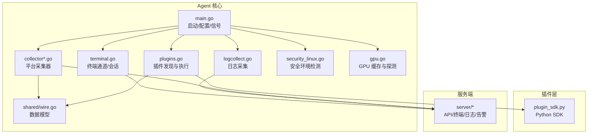
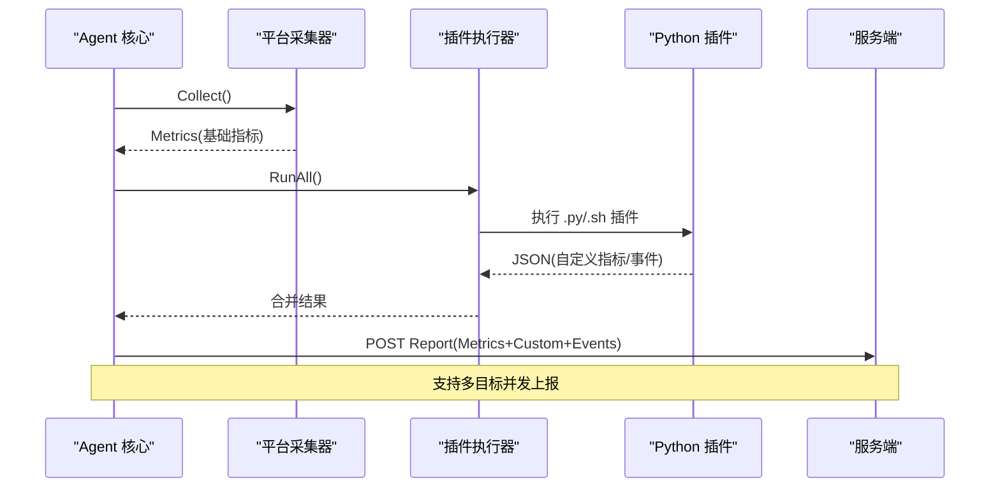
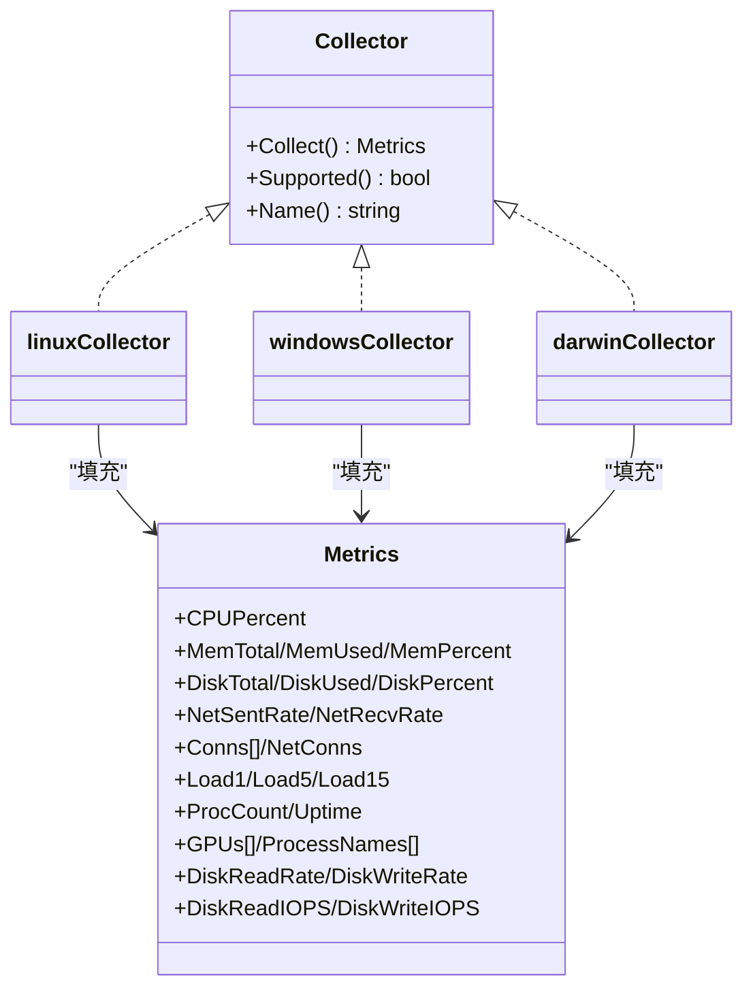
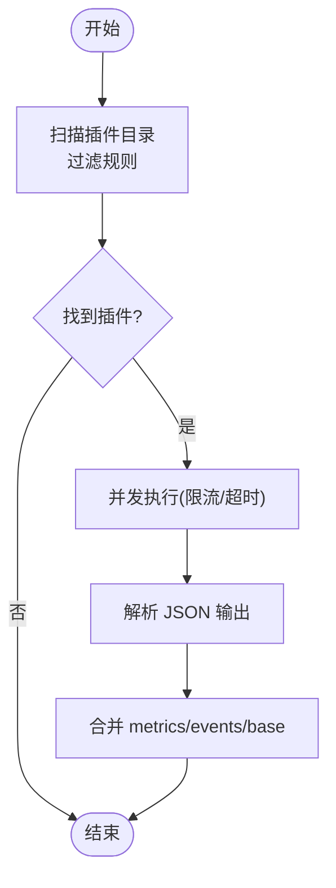
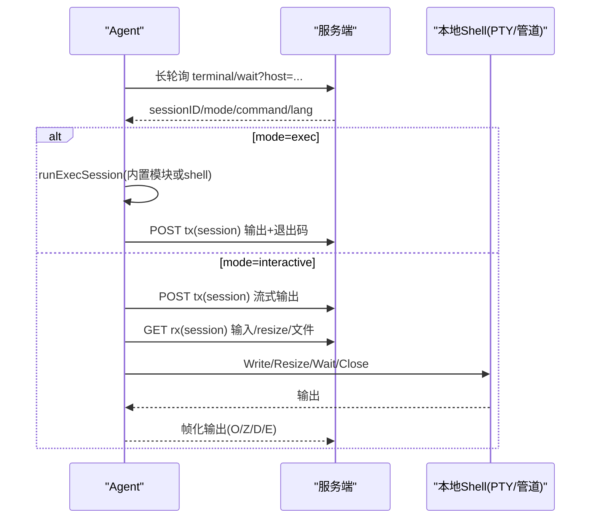
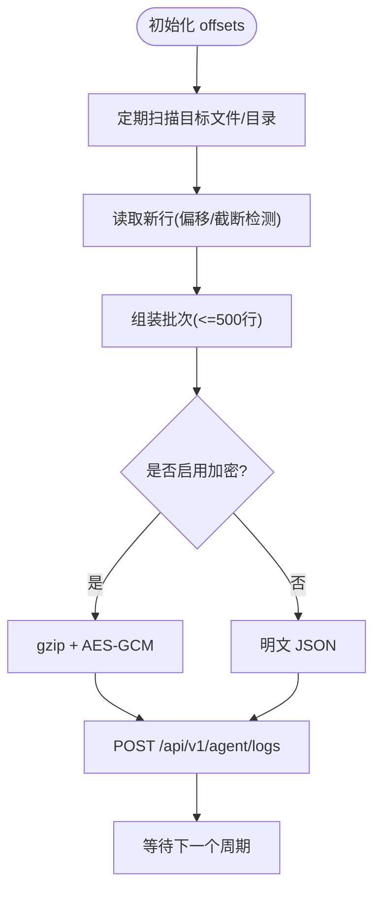
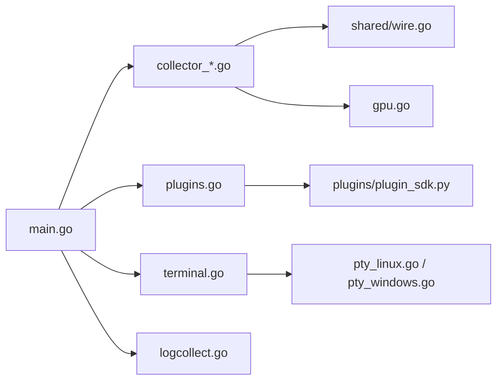

# Agent 客户端架构

<cite>
**本文引用的文件**   
- [cmd/agent/main.go](file://cmd/agent/main.go)
- [cmd/agent/modules.go](file://cmd/agent/modules.go)
- [cmd/agent/plugins.go](file://cmd/agent/plugins.go)
- [cmd/agent/collector.go](file://cmd/agent/collector.go)
- [cmd/agent/collector_linux.go](file://cmd/agent/collector_linux.go)
- [cmd/agent/collector_windows.go](file://cmd/agent/collector_windows.go)
- [cmd/agent/collector_darwin.go](file://cmd/agent/collector_darwin.go)
- [cmd/agent/terminal.go](file://cmd/agent/terminal.go)
- [cmd/agent/logcollect.go](file://cmd/agent/logcollect.go)
- [cmd/agent/security_linux.go](file://cmd/agent/security_linux.go)
- [cmd/agent/pty_linux.go](file://cmd/agent/pty_linux.go)
- [cmd/agent/pty_windows.go](file://cmd/agent/pty_windows.go)
- [cmd/agent/gpu.go](file://cmd/agent/gpu.go)
- [plugins/plugin_sdk.py](file://plugins/plugin_sdk.py)
- [shared/wire.go](file://shared/wire.go)
</cite>

## 目录
1. [简介](#简介)
2. [项目结构](#项目结构)
3. [核心组件](#核心组件)
4. [架构总览](#架构总览)
5. [详细组件分析](#详细组件分析)
6. [依赖关系分析](#依赖关系分析)
7. [性能考虑](#性能考虑)
8. [故障排查指南](#故障排查指南)
9. [结论](#结论)
10. [附录：配置与示例](#附录配置与示例)

## 简介
本文件为 AIOps Monitor Agent 客户端的架构文档，聚焦以下能力：
- 跨平台指标采集器（Linux/Windows/macOS）
- 插件执行引擎（Python SDK 集成）
- 远程终端代理（PTY 管理、WebSocket/HTTP 转发）
- 日志采集器（增量 tail、批量上报、可选加密）
- 数据采集流程、插件发现机制、终端会话管理、安全认证与心跳保活
- 平台差异处理、资源监控优化、错误恢复策略与性能调优建议
- 具体实现示例与配置方法

## 项目结构
Agent 采用“Go 核心 + Python 插件”的混合架构。Go 负责系统级采集、进程调度、网络通信与安全；Python 插件通过标准输出 JSON 协议向 Go 核心上报自定义指标与事件。

图表来源
- [cmd/agent/main.go:74-238](file://cmd/agent/main.go#L74-L238)
- [cmd/agent/collector.go:1-32](file://cmd/agent/collector.go#L1-L32)
- [cmd/agent/plugins.go:36-178](file://cmd/agent/plugins.go#L36-L178)
- [cmd/agent/terminal.go:25-80](file://cmd/agent/terminal.go#L25-L80)
- [cmd/agent/logcollect.go:22-84](file://cmd/agent/logcollect.go#L22-L84)
- [cmd/agent/security_linux.go:143-165](file://cmd/agent/security_linux.go#L143-L165)
- [cmd/agent/gpu.go:14-37](file://cmd/agent/gpu.go#L14-L37)
- [shared/wire.go:8-53](file://shared/wire.go#L8-L53)

章节来源
- [cmd/agent/main.go:74-238](file://cmd/agent/main.go#L74-L238)

## 核心组件
- 启动与配置：加载配置文件与命令行参数，初始化 TLS、Relay 模式、安全模块诊断、主机标识与多服务器目标列表，创建采集器与插件运行器，注册信号处理并进入主循环。
- 平台采集器：按构建标签选择 Linux/Windows/macOS 实现，统一暴露 Collector 接口，返回 Metrics 快照。
- 插件执行引擎：一次性发现插件文件，并发执行并合并结果，限制并发度与超时，隔离崩溃风险。
- 远程终端代理：反向长轮询等待服务端发起会话，使用 PTY（或回退管道）建立交互式 shell，支持上传下载与 ZMODEM。
- 日志采集器：增量 tail 指定文件或目录，批量化上报，支持 gzip+AES-GCM 加密。
- GPU 采集：nvidia-smi/sysfs/ioreg 最佳努力采集，带缓存避免频繁 fork。
- 安全模块检测：自动识别 kysec/SELinux/AppArmor/firewalld，提供宽容/强制模式切换与修复命令提示。

章节来源
- [cmd/agent/main.go:74-238](file://cmd/agent/main.go#L74-L238)
- [cmd/agent/collector.go:1-32](file://cmd/agent/collector.go#L1-L32)
- [cmd/agent/plugins.go:36-178](file://cmd/agent/plugins.go#L36-L178)
- [cmd/agent/terminal.go:25-80](file://cmd/agent/terminal.go#L25-L80)
- [cmd/agent/logcollect.go:22-84](file://cmd/agent/logcollect.go#L22-L84)
- [cmd/agent/gpu.go:14-37](file://cmd/agent/gpu.go#L14-L37)
- [cmd/agent/security_linux.go:143-165](file://cmd/agent/security_linux.go#L143-L165)

## 架构总览
Agent 以“采集一次、广播到所有目标”的方式工作：每个周期调用本地采集器与插件，合并后 POST 至配置的多个服务端。终端与日志通道独立于指标上报，基于指纹认证，不依赖安装 Token。

图表来源
- [cmd/agent/main.go:219-236](file://cmd/agent/main.go#L219-L236)
- [cmd/agent/collector.go:12-16](file://cmd/agent/collector.go#L12-L16)
- [cmd/agent/plugins.go:102-147](file://cmd/agent/plugins.go#L102-L147)
- [plugins/plugin_sdk.py:27-58](file://plugins/plugin_sdk.py#L27-L58)
- [shared/wire.go:120-138](file://shared/wire.go#L120-L138)

## 详细组件分析

### 跨平台指标采集器
- 设计要点
  - 统一接口：Collector.Collect() 返回 shared.Metrics，Supported()/Name() 用于能力与名称。
  - 平台差异：Linux 直接读 /proc 与 syscall；Windows 调用 Win32 API；macOS 调用 sysctl/netstat/top/ioreg。
  - 速率计算：对单调计数器使用差分/时间间隔计算速率，处理溢出与非正间隔。
  - 磁盘枚举：Linux 扫描 /proc/mounts 去重伪文件系统；Windows 枚举固定盘符；macOS 解析 df 输出。
  - 连接统计：按 TCP 状态聚合计数，兼容旧 NetConns 字段。
  - GPU：优先 nvidia-smi，其次 AMD sysfs 或 macOS ioreg，带缓存。
- 关键实现路径
  - Linux：[collector_linux.go:76-209](file://cmd/agent/collector_linux.go#L76-L209)
  - Windows：[collector_windows.go:89-207](file://cmd/agent/collector_windows.go#L89-L207)
  - macOS：[collector_darwin.go:41-109](file://cmd/agent/collector_darwin.go#L41-L109)
  - 公共接口与工具：[collector.go:12-32](file://cmd/agent/collector.go#L12-L32)、[gpu.go:25-37](file://cmd/agent/gpu.go#L25-L37)
  - 数据模型：[shared/wire.go:12-53](file://shared/wire.go#L12-L53)

图表来源
- [cmd/agent/collector.go:12-16](file://cmd/agent/collector.go#L12-L16)
- [cmd/agent/collector_linux.go:76-209](file://cmd/agent/collector_linux.go#L76-L209)
- [cmd/agent/collector_windows.go:89-207](file://cmd/agent/collector_windows.go#L89-L207)
- [cmd/agent/collector_darwin.go:41-109](file://cmd/agent/collector_darwin.go#L41-L109)
- [shared/wire.go:12-53](file://shared/wire.go#L12-L53)

章节来源
- [cmd/agent/collector.go:1-32](file://cmd/agent/collector.go#L1-L32)
- [cmd/agent/collector_linux.go:76-209](file://cmd/agent/collector_linux.go#L76-L209)
- [cmd/agent/collector_windows.go:89-207](file://cmd/agent/collector_windows.go#L89-L207)
- [cmd/agent/collector_darwin.go:41-109](file://cmd/agent/collector_darwin.go#L41-L109)
- [cmd/agent/gpu.go:25-37](file://cmd/agent/gpu.go#L25-L37)
- [shared/wire.go:12-53](file://shared/wire.go#L12-L53)

### 插件执行引擎（Python SDK 集成）
- 插件发现：启动时扫描插件目录，忽略隐藏/下划线前缀与 SDK 辅助文件，白名单仅允许 .py/.sh，拒绝无扩展名与可执行二进制。
- 执行模型：每个插件作为独立子进程运行，设置超时；并发上限（默认 4），失败不影响核心。
- 输出契约：JSON 包含 base（非 Linux 兜底）、metrics（自定义 gauge）、events（AI/异常/服务检查）。
- Python SDK：提供 Plugin.metric()/event()/base()/emit() 便捷 API。

图表来源
- [cmd/agent/plugins.go:62-100](file://cmd/agent/plugins.go#L62-L100)
- [cmd/agent/plugins.go:102-147](file://cmd/agent/plugins.go#L102-L147)
- [cmd/agent/plugins.go:149-172](file://cmd/agent/plugins.go#L149-L172)
- [plugins/plugin_sdk.py:27-58](file://plugins/plugin_sdk.py#L27-L58)

章节来源
- [cmd/agent/plugins.go:36-178](file://cmd/agent/plugins.go#L36-L178)
- [plugins/plugin_sdk.py:1-58](file://plugins/plugin_sdk.py#L1-L58)

### 远程终端代理（PTY 管理与 WebSocket/HTTP 转发）
- 连接模型：Agent 主动拨号，长轮询等待服务端触发会话；成功后建立两条 HTTP 流（rx/tx）桥接本地 shell。
- PTY 实现：Linux 使用 /dev/ptmx + ioctl；Windows 使用 ConPTY；不可用时回退为管道 stdio。
- 会话管理：支持 exec 一次性命令与交互式会话；会话超时释放资源；指数退避重连；半开连接心跳检测。
- 文件传输：按钮式上传/下载与 ZMODEM 透传，帧格式定义明确，具备大小校验与错误提示。

图表来源
- [cmd/agent/terminal.go:206-231](file://cmd/agent/terminal.go#L206-L231)
- [cmd/agent/terminal.go:253-305](file://cmd/agent/terminal.go#L253-L305)
- [cmd/agent/terminal.go:338-423](file://cmd/agent/terminal.go#L338-L423)
- [cmd/agent/pty_linux.go:20-36](file://cmd/agent/pty_linux.go#L20-L36)
- [cmd/agent/pty_windows.go:75-185](file://cmd/agent/pty_windows.go#L75-L185)

章节来源
- [cmd/agent/terminal.go:25-80](file://cmd/agent/terminal.go#L25-L80)
- [cmd/agent/terminal.go:206-423](file://cmd/agent/terminal.go#L206-L423)
- [cmd/agent/pty_linux.go:1-37](file://cmd/agent/pty_linux.go#L1-L37)
- [cmd/agent/pty_windows.go:1-327](file://cmd/agent/pty_windows.go#L1-L327)

### 日志采集器
- 采集范围：支持文件与目录；目录周期性展开，新增文件从当前末尾开始采集；检测到旋转/截断自动复位。
- 批处理与上报：每 10s 扫描，最多收集最近 500 行；支持 gzip+AES-256-GCM 加密上报。
- 级别分类：根据关键字将行归类为 error/warn/info/debug。

图表来源
- [cmd/agent/logcollect.go:37-84](file://cmd/agent/logcollect.go#L37-L84)
- [cmd/agent/logcollect.go:86-127](file://cmd/agent/logcollect.go#L86-L127)
- [cmd/agent/logcollect.go:129-167](file://cmd/agent/logcollect.go#L129-L167)
- [cmd/agent/logcollect.go:183-206](file://cmd/agent/logcollect.go#L183-L206)
- [cmd/agent/logcollect.go:208-231](file://cmd/agent/logcollect.go#L208-L231)

章节来源
- [cmd/agent/logcollect.go:22-231](file://cmd/agent/logcollect.go#L22-L231)

### 安全认证与心跳保活
- 认证：所有出站请求携带 X-Agent-Fingerprint（机器指纹），不依赖安装 Token；服务端据此鉴权。
- 心跳与保活：终端 rx 流使用 deadlineReader 周期性刷新读取超时，检测半开连接；终端会话有最大时长限制；上报与插件执行均有超时保护。
- 安全模块：启动时检测 kysec/SELinux/AppArmor/firewalld，支持 permissive/enforcing/auto 三种模式，必要时自动恢复 enforcing。

章节来源
- [cmd/agent/terminal.go:110-143](file://cmd/agent/terminal.go#L110-L143)
- [cmd/agent/terminal.go:338-360](file://cmd/agent/terminal.go#L338-L360)
- [cmd/agent/security_linux.go:43-53](file://cmd/agent/security_linux.go#L43-L53)
- [cmd/agent/security_linux.go:324-380](file://cmd/agent/security_linux.go#L324-L380)

### 内置模块（Playbook 执行）
- 机制：以特殊前缀的命令由 Agent 内部模块执行，无需 shell，跨系统一致，返回合并输出与退出码。
- 模块类型：gather_facts/service/package/copy 等，自动选择系统工具（systemctl/sc/brew、包管理器、choco/winget 等）。

章节来源
- [cmd/agent/modules.go:29-47](file://cmd/agent/modules.go#L29-L47)
- [cmd/agent/modules.go:99-160](file://cmd/agent/modules.go#L99-L160)
- [cmd/agent/modules.go:162-239](file://cmd/agent/modules.go#L162-L239)
- [cmd/agent/modules.go:241-262](file://cmd/agent/modules.go#L241-L262)

## 依赖关系分析
- 组件耦合
  - main.go 组合 collector、plugin runner、身份与配置，驱动整体生命周期。
  - 平台采集器共享 shared.Metrics 与 rate/round 工具函数。
  - 终端与日志通道均依赖 fingerprint 进行认证，彼此解耦。
  - GPU 采集被各平台采集器复用，带全局缓存。
- 外部依赖
  - Linux：/proc、sysfs、ioctl、nvidia-smi（可选）
  - Windows：Win32 API、ConPTY、nvidia-smi（可选）
  - macOS：sysctl、netstat、top、ioreg、df
  - Python：插件 SDK 与解释器路径

图表来源
- [cmd/agent/main.go:219-236](file://cmd/agent/main.go#L219-L236)
- [cmd/agent/collector.go:1-16](file://cmd/agent/collector.go#L1-L16)
- [cmd/agent/plugins.go:36-55](file://cmd/agent/plugins.go#L36-L55)
- [cmd/agent/terminal.go:206-231](file://cmd/agent/terminal.go#L206-L231)
- [cmd/agent/logcollect.go:37-84](file://cmd/agent/logcollect.go#L37-L84)
- [cmd/agent/gpu.go:25-37](file://cmd/agent/gpu.go#L25-L37)
- [cmd/agent/pty_linux.go:20-36](file://cmd/agent/pty_linux.go#L20-L36)
- [cmd/agent/pty_windows.go:75-185](file://cmd/agent/pty_windows.go#L75-L185)
- [shared/wire.go:8-53](file://shared/wire.go#L8-L53)
- [plugins/plugin_sdk.py:27-58](file://plugins/plugin_sdk.py#L27-L58)

章节来源
- [cmd/agent/main.go:219-236](file://cmd/agent/main.go#L219-L236)
- [cmd/agent/collector.go:1-16](file://cmd/agent/collector.go#L1-L16)
- [cmd/agent/plugins.go:36-55](file://cmd/agent/plugins.go#L36-L55)
- [cmd/agent/terminal.go:206-231](file://cmd/agent/terminal.go#L206-L231)
- [cmd/agent/logcollect.go:37-84](file://cmd/agent/logcollect.go#L37-L84)
- [cmd/agent/gpu.go:25-37](file://cmd/agent/gpu.go#L25-L37)
- [cmd/agent/pty_linux.go:20-36](file://cmd/agent/pty_linux.go#L20-L36)
- [cmd/agent/pty_windows.go:75-185](file://cmd/agent/pty_windows.go#L75-L185)
- [shared/wire.go:8-53](file://shared/wire.go#L8-L53)
- [plugins/plugin_sdk.py:27-58](file://plugins/plugin_sdk.py#L27-L58)

## 性能考虑
- 采集器优化
  - Linux：/proc 枚举与进程信息缓存（TTL 控制），减少 I/O 开销；rate 函数处理计数器回绕。
  - Windows：内存池复用 ifTable 缓冲区，避免频繁分配；IOCTL_DISK_PERFORMANCE 累计差分为速率。
  - macOS：系统工具调用带超时，防止阻塞；disk IO 汇总 ioreg 数值。
- 插件执行
  - 并发上限（默认 4），单次执行超时，失败隔离；首次延迟启动，后续按间隔调度。
- GPU 采集
  - 全局缓存 TTL，避免每次报告都 fork 外部工具；nvidia-smi 挂起保护（硬超时）。
- 日志采集
  - 增量 tail，大文件只读尾部 2MB；批量压缩与可选加密，降低带宽与存储成本。
- 网络与心跳
  - 终端 rx 使用 deadlineReader 检测半开连接；指数退避重连；会话最大时长限制。

章节来源
- [cmd/agent/collector_linux.go:124-131](file://cmd/agent/collector_linux.go#L124-L131)
- [cmd/agent/collector_linux.go:175-186](file://cmd/agent/collector_linux.go#L175-L186)
- [cmd/agent/collector_windows.go:290-330](file://cmd/agent/collector_windows.go#L290-L330)
- [cmd/agent/collector_darwin.go:201-212](file://cmd/agent/collector_darwin.go#L201-L212)
- [cmd/agent/plugins.go:114-147](file://cmd/agent/plugins.go#L114-L147)
- [cmd/agent/gpu.go:25-37](file://cmd/agent/gpu.go#L25-L37)
- [cmd/agent/logcollect.go:129-167](file://cmd/agent/logcollect.go#L129-L167)
- [cmd/agent/terminal.go:110-143](file://cmd/agent/terminal.go#L110-L143)

## 故障排查指南
- 权限与安全模块
  - 现象：部分 /proc 路径无法读取，采集不完整。
  - 处理：查看安全模块检测结果与修复命令；尝试 permissive 模式并自动恢复；以 root 运行或添加白名单。
- 插件执行失败
  - 现象：插件执行报错或被跳过。
  - 处理：检查插件输出是否为合法 JSON；确认插件目录白名单扩展名；关注并发与超时。
- 终端会话问题
  - 现象：会话卡住或断开。
  - 处理：检查半开连接心跳；确认 PTY 可用（Windows ConPTY）；查看会话超时与重退避。
- 日志上报异常
  - 现象：未收到日志或乱码。
  - 处理：确认 log-paths 配置；检查加密开关与服务端密钥；观察批量大小与轮转检测。

章节来源
- [cmd/agent/security_linux.go:280-322](file://cmd/agent/security_linux.go#L280-L322)
- [cmd/agent/security_linux.go:324-380](file://cmd/agent/security_linux.go#L324-L380)
- [cmd/agent/plugins.go:149-172](file://cmd/agent/plugins.go#L149-L172)
- [cmd/agent/terminal.go:110-143](file://cmd/agent/terminal.go#L110-L143)
- [cmd/agent/logcollect.go:208-231](file://cmd/agent/logcollect.go#L208-L231)

## 结论
Agent 客户端通过“Go 核心 + Python 插件”的混合架构实现了跨平台、可扩展、高可靠的监控与运维能力。平台采集器保证零依赖与高性能，插件引擎提供灵活的业务指标与事件上报，远程终端与日志采集增强了可观测性与可运维性。结合安全模块自检与多种容错机制，Agent 能在复杂生产环境中稳定运行。

## 附录：配置与示例
- 启动参数（节选）
  - --server/--servers：服务端地址（单/多目标）
  - --interval/--plugin-interval：指标与插件周期
  - --plugins-dir/--python：插件目录与解释器
  - --log-paths/--log-encrypt：日志采集路径与加密开关
  - --relay/--listen/--relay-secret：中继模式
  - --tls-skip-verify/--ca-cert：TLS 信任配置
  - --security-mode：安全模块模式（auto/permissive/enforcing）
- 插件示例（Python）
  - 使用 plugin_sdk.Plugin 记录指标与事件，最后 emit() 输出 JSON。
- 终端与文件传输
  - 浏览器侧通过终端界面发起交互、上传/下载；Agent 侧按帧协议处理。

章节来源
- [cmd/agent/main.go:91-124](file://cmd/agent/main.go#L91-L124)
- [plugins/plugin_sdk.py:27-58](file://plugins/plugin_sdk.py#L27-L58)
- [cmd/agent/terminal.go:425-598](file://cmd/agent/terminal.go#L425-L598)