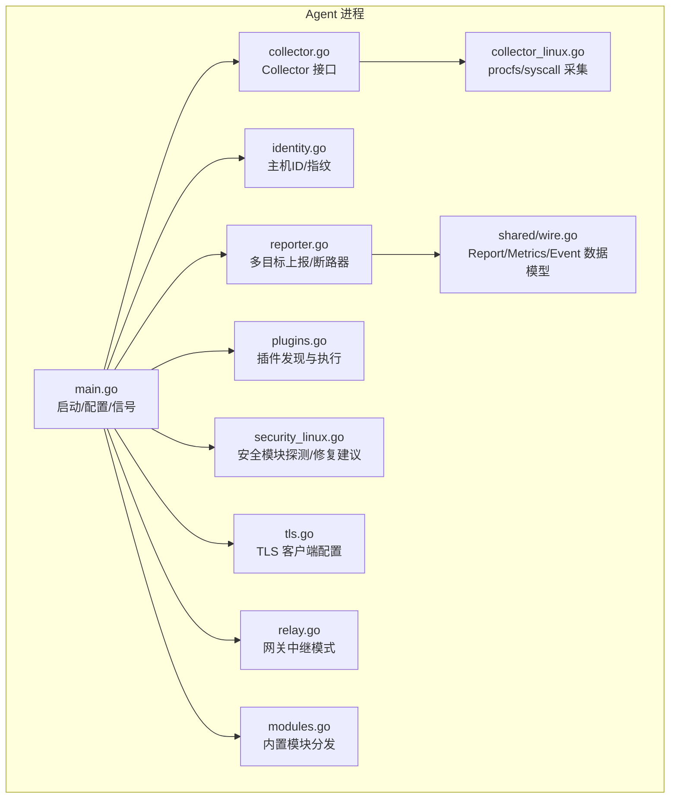
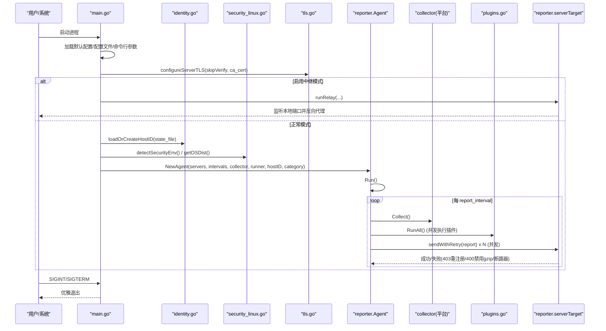
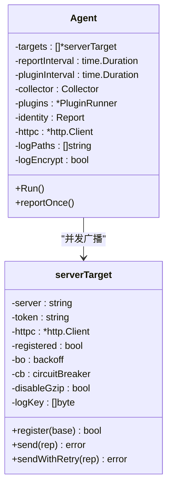
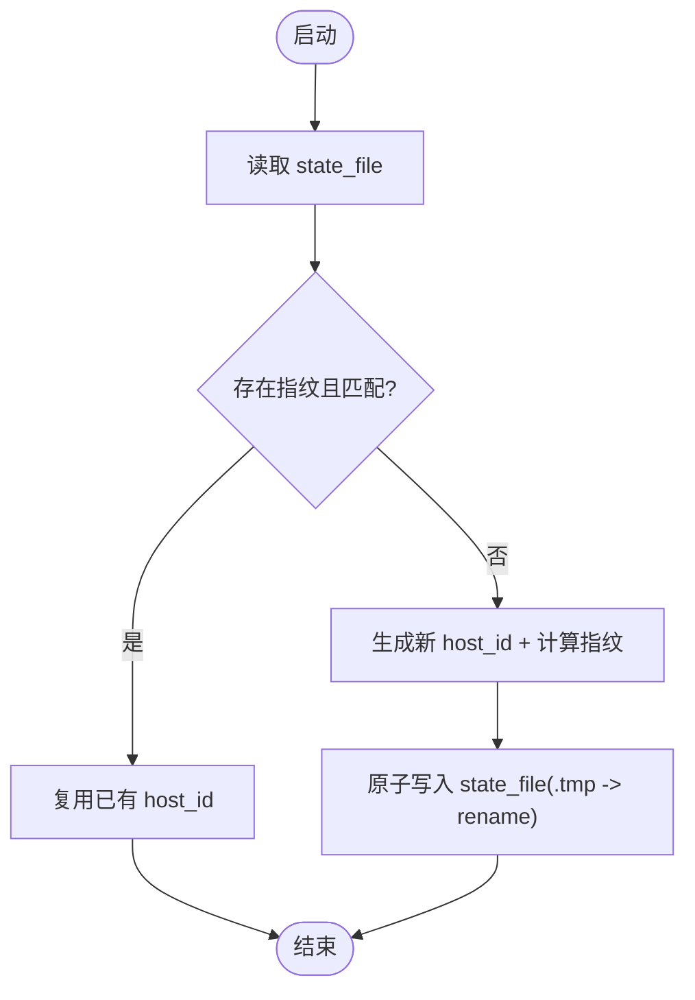
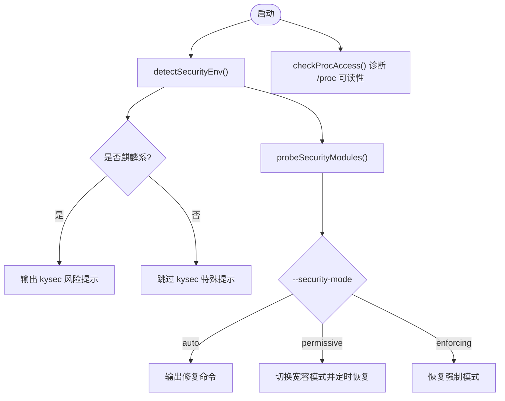
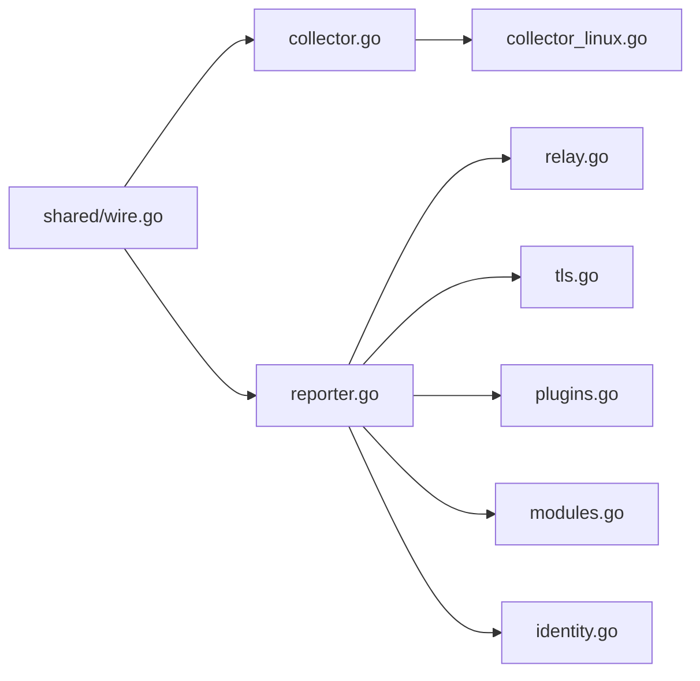

# Agent 核心架构

<cite>
**本文引用的文件**   
- [cmd/agent/main.go](file://cmd/agent/main.go)
- [cmd/agent/reporter.go](file://cmd/agent/reporter.go)
- [cmd/agent/identity.go](file://cmd/agent/identity.go)
- [cmd/agent/modules.go](file://cmd/agent/modules.go)
- [cmd/agent/plugins.go](file://cmd/agent/plugins.go)
- [cmd/agent/collector.go](file://cmd/agent/collector.go)
- [cmd/agent/collector_linux.go](file://cmd/agent/collector_linux.go)
- [cmd/agent/security_linux.go](file://cmd/agent/security_linux.go)
- [cmd/agent/tls.go](file://cmd/agent/tls.go)
- [cmd/agent/relay.go](file://cmd/agent/relay.go)
- [shared/wire.go](file://shared/wire.go)
- [config.example.json](file://config.example.json)
- [server_config.example.json](file://server_config.example.json)
- [README.md](file://README.md)
</cite>

## 目录
1. [简介](#简介)
2. [项目结构](#项目结构)
3. [核心组件](#核心组件)
4. [架构总览](#架构总览)
5. [详细组件分析](#详细组件分析)
6. [依赖关系分析](#依赖关系分析)
7. [性能与并发特性](#性能与并发特性)
8. [配置与优先级规则](#配置与优先级规则)
9. [故障排查指南](#故障排查指南)
10. [结论](#结论)

## 简介
本文件面向 AIOps Monitor Agent 的核心架构，聚焦以下主题：Agent 启动流程、配置加载机制、多服务器并发上报、主机身份管理与持久化、信号处理与生命周期管理、安全环境检测、分类标签管理、日志采集与加密上报、中继模式（Relay）等。文档同时提供配置示例、命令行参数说明、默认值与优先级规则，以及常见问题的定位方法。

## 项目结构
Agent 位于 cmd/agent 下，采用“核心 + 平台特定实现 + 插件层”的混合架构：
- 核心入口与生命周期：main.go
- 指标采集接口与平台实现：collector.go、collector_linux.go（Linux）、collector_windows.go、collector_darwin.go、collector_other.go
- 上报与多服务端广播：reporter.go
- 主机身份与指纹：identity.go
- 插件执行器：plugins.go
- 内置模块（Playbook 模块分发）：modules.go
- 安全环境检测（Linux）：security_linux.go
- TLS 客户端配置：tls.go
- 网关中继模式：relay.go
- 共享数据结构（与后端一致）：shared/wire.go

图表来源
- [cmd/agent/main.go:74-237](file://cmd/agent/main.go#L74-L237)
- [cmd/agent/reporter.go:259-370](file://cmd/agent/reporter.go#L259-L370)
- [cmd/agent/identity.go:30-57](file://cmd/agent/identity.go#L30-L57)
- [cmd/agent/collector.go:12-16](file://cmd/agent/collector.go#L12-L16)
- [cmd/agent/collector_linux.go:66-74](file://cmd/agent/collector_linux.go#L66-L74)
- [cmd/agent/plugins.go:45-55](file://cmd/agent/plugins.go#L45-L55)
- [cmd/agent/security_linux.go:46-53](file://cmd/agent/security_linux.go#L46-L53)
- [cmd/agent/tls.go:47-73](file://cmd/agent/tls.go#L47-L73)
- [cmd/agent/relay.go:31-89](file://cmd/agent/relay.go#L31-L89)
- [shared/wire.go:120-139](file://shared/wire.go#L120-L139)

章节来源
- [cmd/agent/main.go:74-237](file://cmd/agent/main.go#L74-L237)
- [shared/wire.go:120-139](file://shared/wire.go#L120-L139)

## 核心组件
- 配置与启动：解析配置文件与命令行参数，构建默认配置，应用 TLS 信任策略，选择 Relay 或正常模式，初始化主机 ID、采集器、插件运行器，注册信号处理器并进入主循环。
- 数据采集：通过 Collector 接口在 Linux 上直接读取 procfs/syscall，其他平台回退到 core 插件；支持磁盘 IO、网络速率、连接状态、负载、进程数、GPU 等指标。
- 插件层：按周期并发执行 Python/shell 插件，输出自定义指标与事件，合并后随基础指标一起上报。
- 多服务端上报：单采集一次，广播至所有目标服务端；每个目标独立连接池、重试、熔断与 gzip 降级；403 自动重新注册。
- 主机身份：基于 OS machine-id + 首张非回环 MAC 生成机器指纹，持久化到 state_file，克隆场景自动识别并重建 host_id。
- 安全环境检测：启动时探测 kysec/SELinux/AppArmor/firewalld 等，根据 --security-mode 输出修复命令或临时切换宽容模式并定时恢复。
- 中继模式：以反向代理方式将本地请求转发到上游云监控中心，拦截安装脚本重写 SERVER 地址，注入共享密钥用于鉴权。
- 日志采集：可选监听若干日志路径，增量采集并按批次上报，支持 gzip+AES-GCM 加密（由服务端下发 log_key）。

章节来源
- [cmd/agent/main.go:74-237](file://cmd/agent/main.go#L74-L237)
- [cmd/agent/reporter.go:259-370](file://cmd/agent/reporter.go#L259-L370)
- [cmd/agent/identity.go:30-57](file://cmd/agent/identity.go#L30-L57)
- [cmd/agent/collector_linux.go:76-200](file://cmd/agent/collector_linux.go#L76-L200)
- [cmd/agent/plugins.go:102-147](file://cmd/agent/plugins.go#L102-L147)
- [cmd/agent/security_linux.go:143-165](file://cmd/agent/security_linux.go#L143-L165)
- [cmd/agent/relay.go:31-89](file://cmd/agent/relay.go#L31-L89)

## 架构总览
下图展示 Agent 从启动到周期性上报的主流程，包括配置加载、身份持久化、安全检测、多目标并发上报与断路器保护。

图表来源
- [cmd/agent/main.go:74-237](file://cmd/agent/main.go#L74-L237)
- [cmd/agent/reporter.go:319-370](file://cmd/agent/reporter.go#L319-L370)
- [cmd/agent/identity.go:30-57](file://cmd/agent/identity.go#L30-L57)
- [cmd/agent/security_linux.go:46-53](file://cmd/agent/security_linux.go#L46-L53)
- [cmd/agent/tls.go:47-73](file://cmd/agent/tls.go#L47-L73)
- [cmd/agent/relay.go:31-89](file://cmd/agent/relay.go#L31-L89)

## 详细组件分析

### 启动流程与生命周期
- 配置加载顺序：默认值 → 配置文件（config.json）→ 命令行参数覆盖。
- 安全环境检测：启动时探测操作系统与安全模块，必要时输出修复命令或切换到宽容模式并设置定时器自动恢复。
- 中继模式：若启用 --relay，则仅作为反向代理监听本地端口，不进入采集上报循环。
- 主循环：注册所有目标服务端（带指数退避），并行启动插件循环、终端通道、转发通道、日志采集通道；高频基础指标上报循环使用 defer/recover 保证异常不中断进程。
- 信号处理：捕获 SIGINT/SIGTERM，记录日志后退出。

章节来源
- [cmd/agent/main.go:74-237](file://cmd/agent/main.go#L74-L237)
- [cmd/agent/reporter.go:319-370](file://cmd/agent/reporter.go#L319-L370)

### 配置加载机制与优先级
- 默认配置：包含 server、interval、plugin-interval、disk-path、plugins-dir、python、state-file、category、token、listen、log_encrypt 等。
- 配置文件：支持单 server 与多 servers 数组；当 servers 非空时优先于 server+token。
- 命令行参数：覆盖配置文件与默认值；支持 --config、--server、--interval、--plugin-interval、--plugins-dir、--python、--disk-path、--category、--token、--relay、--listen、--relay-secret、--log-paths、--log-encrypt、--tls-skip-verify、--ca-cert、--security-mode 等。
- TLS 信任：支持自定义 CA 证书与跳过校验（仅实验室/自签场景）。

章节来源
- [cmd/agent/main.go:44-124](file://cmd/agent/main.go#L44-L124)
- [cmd/agent/tls.go:19-39](file://cmd/agent/tls.go#L19-L39)
- [config.example.json:1-16](file://config.example.json#L1-L16)

### 多服务器并发上报机制
- 目标隔离：每个 serverTarget 拥有独立的 http.Client（连接池隔离）、token、注册状态、重试与断路器。
- 并发广播：一次采集结果并发发送至所有目标，互不影响；任一目标失败不会阻塞其他目标。
- 重试与降级：同一周期内最多重试 3 次；遇到 400 且已压缩则禁用 gzip 并立即重试；遇到 403 则先重新注册再重试。
- 断路器：连续失败达到阈值打开断路器，暂停向该目标上报一段时间，并在半开时尝试恢复；打开时重置注册标记以便下次成功上报后重新注册。
- 事件去重：仅当全部目标均失败时才将事件重新入队，避免重复投递。

图表来源
- [cmd/agent/reporter.go:259-312](file://cmd/agent/reporter.go#L259-L312)
- [cmd/agent/reporter.go:452-567](file://cmd/agent/reporter.go#L452-L567)

章节来源
- [cmd/agent/reporter.go:259-312](file://cmd/agent/reporter.go#L259-L312)
- [cmd/agent/reporter.go:452-567](file://cmd/agent/reporter.go#L452-L567)

### 主机身份管理与持久化
- 主机 ID：随机生成并持久化到 state_file；每次启动优先复用已有 ID。
- 防克隆指纹：结合 OS machine-id 与首张非回环 MAC 计算哈希指纹写入状态文件；若当前机器指纹与存储不一致，判定为克隆并重新生成 host_id，避免多机争用同一主机记录。
- 原子写：先写临时文件再 rename，防止崩溃导致状态损坏。

图表来源
- [cmd/agent/identity.go:30-57](file://cmd/agent/identity.go#L30-L57)
- [cmd/agent/identity.go:59-71](file://cmd/agent/identity.go#L59-L71)
- [cmd/agent/identity.go:128-134](file://cmd/agent/identity.go#L128-L134)

章节来源
- [cmd/agent/identity.go:30-57](file://cmd/agent/identity.go#L30-L57)
- [cmd/agent/identity.go:59-71](file://cmd/agent/identity.go#L59-L71)

### 分类标签管理
- 分类字段：category 可在配置或命令行中设置，随 Report 一并上报，用于面板分组与过滤。
- 影响范围：分类不参与身份绑定，仅用于组织视图与筛选。

章节来源
- [cmd/agent/main.go:99-100](file://cmd/agent/main.go#L99-L100)
- [shared/wire.go:124-139](file://shared/wire.go#L124-L139)

### 安全环境检测逻辑（Linux）
- 检测项：kysec、SELinux、AppArmor、firewalld；同时识别发行版信息（ID/PrettyName/Version）。
- 行为：
  - auto：输出 enforcing 模块对应的修复命令。
  - permissive：自动切换为宽容模式，并设置定时器在指定时间后恢复 enforcing。
  - enforcing：恢复强制模式。
- 诊断：检查关键 /proc 路径是否可访问，提示权限不足时的可能原因与修复建议。

图表来源
- [cmd/agent/main.go:142-208](file://cmd/agent/main.go#L142-L208)
- [cmd/agent/security_linux.go:46-53](file://cmd/agent/security_linux.go#L46-L53)
- [cmd/agent/security_linux.go:143-165](file://cmd/agent/security_linux.go#L143-L165)
- [cmd/agent/security_linux.go:324-352](file://cmd/agent/security_linux.go#L324-L352)
- [cmd/agent/security_linux.go:294-322](file://cmd/agent/security_linux.go#L294-L322)

章节来源
- [cmd/agent/main.go:142-208](file://cmd/agent/main.go#L142-L208)
- [cmd/agent/security_linux.go:46-53](file://cmd/agent/security_linux.go#L46-L53)
- [cmd/agent/security_linux.go:143-165](file://cmd/agent/security_linux.go#L143-L165)
- [cmd/agent/security_linux.go:324-352](file://cmd/agent/security_linux.go#L324-L352)
- [cmd/agent/security_linux.go:294-322](file://cmd/agent/security_linux.go#L294-L322)

### 插件系统与自定义指标/事件
- 插件发现：扫描 plugins_dir，白名单允许 .py/.sh，忽略 SDK 与 dotfiles。
- 并发执行：限制最大并发子进程数量，超时控制，崩溃/超时不影响核心。
- 输出合并：基础指标（当原生不可用时回退）、自定义指标、事件列表合并后随 Report 上报。

章节来源
- [cmd/agent/plugins.go:62-100](file://cmd/agent/plugins.go#L62-L100)
- [cmd/agent/plugins.go:102-147](file://cmd/agent/plugins.go#L102-L147)
- [cmd/agent/reporter.go:423-439](file://cmd/agent/reporter.go#L423-L439)

### 中继模式（Relay）
- 功能：监听本地端口，反向代理到上游云监控中心；拦截安装脚本，重写 SERVER 指向本机，使内网机器无需直连云端。
- 安全：可选 relay_secret，注入 X-Relay-Secret 头供上游校验；对 Host 头进行严格清洗，防止命令注入。
- 传输：高 MaxIdleConnsPerHost 提升并发复用；短超时用于安装脚本拉取。

章节来源
- [cmd/agent/relay.go:31-89](file://cmd/agent/relay.go#L31-L89)
- [cmd/agent/relay.go:136-189](file://cmd/agent/relay.go#L136-L189)

### 内置模块（Playbook 模块分发）
- 机制：服务端下发 modulePrefix+" "+JSON 封套命令，Agent 解析后调用内置模块（gather_facts/service/package/copy），跨系统一致执行。
- 优势：运维无需记忆各平台命令，统一通过 Playbook 编排执行。

章节来源
- [cmd/agent/modules.go:18-47](file://cmd/agent/modules.go#L18-L47)
- [cmd/agent/modules.go:49-66](file://cmd/agent/modules.go#L49-L66)
- [cmd/agent/modules.go:99-160](file://cmd/agent/modules.go#L99-L160)
- [cmd/agent/modules.go:162-239](file://cmd/agent/modules.go#L162-L239)
- [cmd/agent/modules.go:241-262](file://cmd/agent/modules.go#L241-L262)

## 依赖关系分析
- 数据契约：shared/wire.go 定义 Metrics/GPUInfo/ConnStat/DiskInfo/Report/Event 等结构，Agent 与后端共用，确保协议一致性。
- 采集器：collector.go 定义接口，Linux 实现直接读取 procfs/syscall，其他平台回退到 core 插件。
- 上报层：reporter.go 聚合采集结果，并发广播至多个目标，具备重试、熔断、gzip 降级与注册态管理。
- 安全与 TLS：security_linux.go 负责安全模块探测与修复建议；tls.go 集中配置所有出站 HTTP 客户端的 TLS 信任策略。
- 中继：relay.go 作为反向代理，修改安装脚本并注入共享密钥。

图表来源
- [shared/wire.go:120-139](file://shared/wire.go#L120-L139)
- [cmd/agent/collector.go:12-16](file://cmd/agent/collector.go#L12-L16)
- [cmd/agent/collector_linux.go:66-74](file://cmd/agent/collector_linux.go#L66-L74)
- [cmd/agent/reporter.go:259-312](file://cmd/agent/reporter.go#L259-L312)
- [cmd/agent/relay.go:31-89](file://cmd/agent/relay.go#L31-L89)
- [cmd/agent/tls.go:47-73](file://cmd/agent/tls.go#L47-L73)
- [cmd/agent/plugins.go:45-55](file://cmd/agent/plugins.go#L45-L55)
- [cmd/agent/modules.go:18-47](file://cmd/agent/modules.go#L18-L47)
- [cmd/agent/identity.go:30-57](file://cmd/agent/identity.go#L30-L57)

章节来源
- [shared/wire.go:120-139](file://shared/wire.go#L120-L139)
- [cmd/agent/collector.go:12-16](file://cmd/agent/collector.go#L12-L16)
- [cmd/agent/reporter.go:259-312](file://cmd/agent/reporter.go#L259-L312)

## 性能与并发特性
- 连接复用：reportTransport 复用连接，禁用 HTTP/2 以避免服务端重启导致的批量失败，缩短恢复时间。
- 并发上限：插件执行限制最大并发子进程数，避免资源抖动。
- 缓存策略：Linux 采集器缓存磁盘枚举与进程信息，降低频繁 I/O 开销。
- 重试与熔断：上报在同一周期内多次重试，配合断路器减少无效请求，提高外网稳定性。
- 压缩策略：大于阈值的 payload 才启用 gzip，遇 400 自动降级关闭压缩。

章节来源
- [cmd/agent/reporter.go:33-49](file://cmd/agent/reporter.go#L33-L49)
- [cmd/agent/plugins.go:116-116](file://cmd/agent/plugins.go#L116-L116)
- [cmd/agent/collector_linux.go:60-64](file://cmd/agent/collector_linux.go#L60-L64)
- [cmd/agent/reporter.go:213-253](file://cmd/agent/reporter.go#L213-L253)
- [cmd/agent/reporter.go:139-200](file://cmd/agent/reporter.go#L139-L200)

## 配置与优先级规则
- 优先级：命令行参数 > 配置文件 > 默认值。
- 多服务端：servers 数组非空时优先于 server+token。
- 关键参数：
  - --server/--interval/--plugin-interval/--plugins-dir/--python/--disk-path/--category/--token/--relay/--listen/--relay-secret/--config/--log-paths/--log-encrypt/--tls-skip-verify/--ca-cert/--security-mode
- 配置文件示例：
  - 单服务端与多服务端并存，推荐生产使用 servers 数组。
- 服务端配置参考：server_config.example.json 包含告警、阈值、账户、转发等配置项。

章节来源
- [cmd/agent/main.go:74-124](file://cmd/agent/main.go#L74-L124)
- [config.example.json:1-16](file://config.example.json#L1-L16)
- [server_config.example.json:1-36](file://server_config.example.json#L1-L36)
- [README.md:383-434](file://README.md#L383-L434)

## 故障排查指南
- 无法上报（403）：可能是 Token 失效或指纹未绑定，Agent 会自动重新注册；检查服务端 require_token 与 install_token 配置。
- 400 错误：疑似 gzip 被外网代理损坏，Agent 会禁用压缩并重试；检查中间代理是否破坏 Content-Encoding。
- 外网不稳定：断路器打开会暂停上报一段时间，等待半开探测；确认网络连通性与上游服务可用性。
- 安全模块拦截：查看启动日志中的安全模块检测结果与 /proc 路径访问诊断；按 auto 模式输出的修复命令操作，或使用 permissive 模式临时放行。
- 中继模式问题：确认 --listen 绑定地址与上游地址正确；检查 X-Relay-Secret 是否与上游 relay_secret 一致；安装脚本是否被正确改写 SERVER。
- 插件执行失败：检查插件输出是否为合法 JSON；确认 Python 解释器路径与插件扩展名在白名单内。

章节来源
- [cmd/agent/reporter.go:213-253](file://cmd/agent/reporter.go#L213-L253)
- [cmd/agent/reporter.go:139-200](file://cmd/agent/reporter.go#L139-L200)
- [cmd/agent/reporter.go:452-567](file://cmd/agent/reporter.go#L452-L567)
- [cmd/agent/security_linux.go:294-322](file://cmd/agent/security_linux.go#L294-L322)
- [cmd/agent/relay.go:136-189](file://cmd/agent/relay.go#L136-L189)
- [cmd/agent/plugins.go:149-172](file://cmd/agent/plugins.go#L149-L172)

## 结论
AIOps Monitor Agent 采用“核心 Go 采集 + Python 插件 + 多目标并发上报”的混合架构，具备健壮的生命周期管理、灵活的安全环境适配、稳定的外网容错能力与开箱即用的中继模式。通过清晰的配置优先级、完善的身份持久化与指纹防克隆机制，Agent 能在复杂企业环境中稳定运行并提供高质量的可观测性数据。