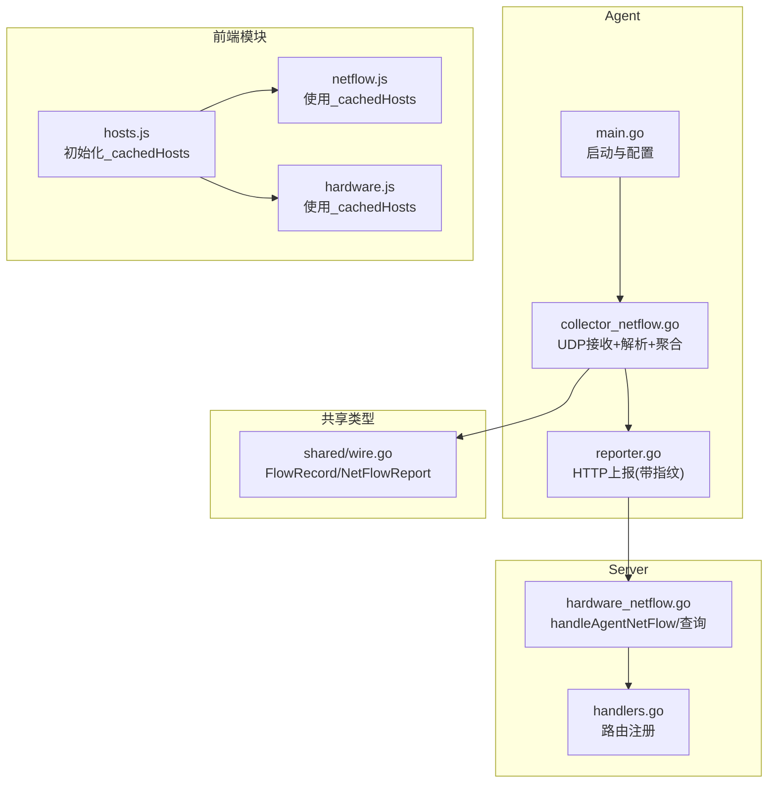
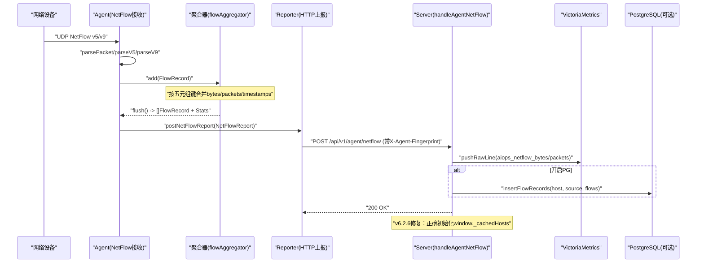
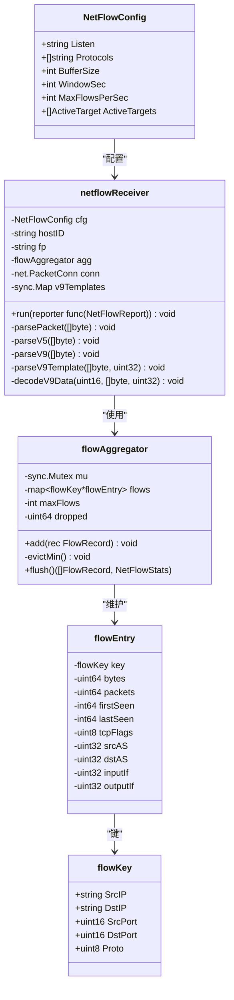
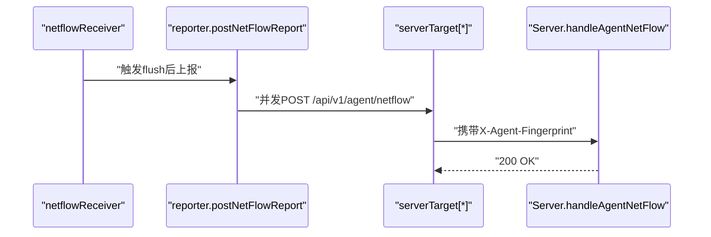
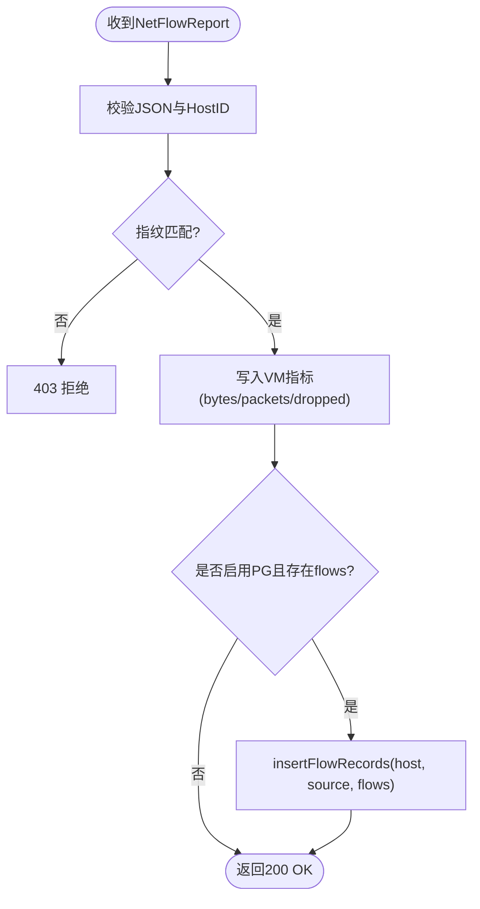
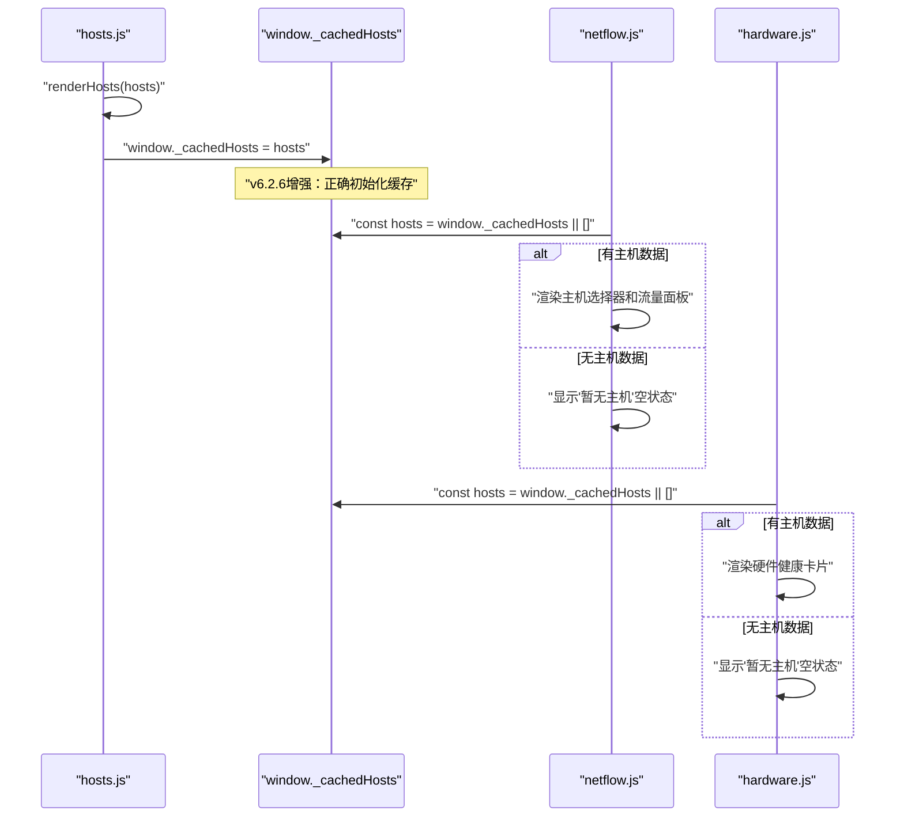
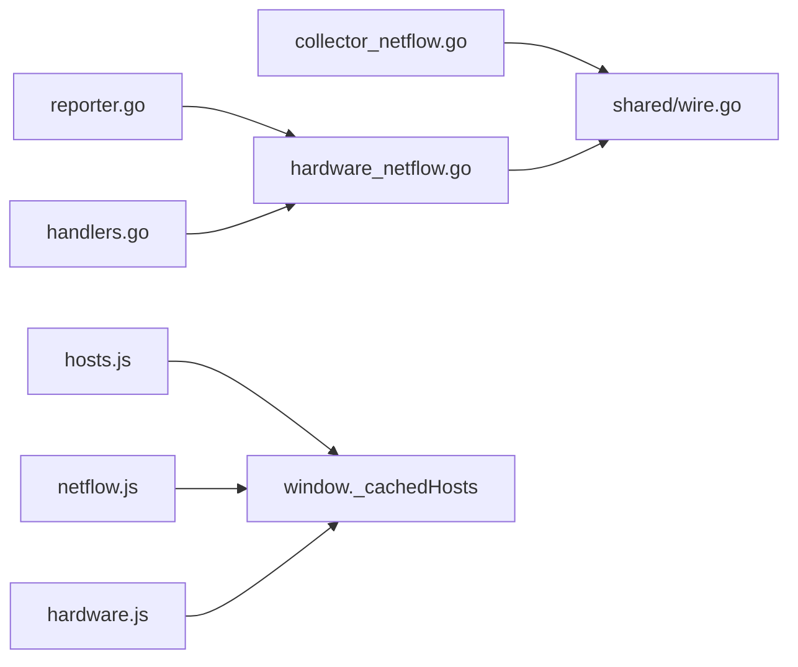

# NetFlow网络流量采集器

<cite>
**本文引用的文件列表**
- [cmd/agent/main.go](file://cmd/agent/main.go)
- [cmd/agent/reporter.go](file://cmd/agent/reporter.go)
- [cmd/agent/collector_netflow.go](file://cmd/agent/collector_netflow.go)
- [shared/wire.go](file://shared/wire.go)
- [cmd/server/handlers.go](file://cmd/server/handlers.go)
- [cmd/server/hardware_netflow.go](file://cmd/server/hardware_netflow.go)
- [config.example.json](file://config.example.json)
- [cmd/server/web/js/netflow.js](file://cmd/server/web/js/netflow.js)
- [cmd/server/web/js/hosts.js](file://cmd/server/web/js/hosts.js)
- [cmd/server/web/js/hardware.js](file://cmd/server/web/js/hardware.js)
</cite>

## 更新摘要
**变更内容**
- 增强了硬件监控界面的整体架构，通过改进的前端模块间数据共享机制提升系统稳定性
- 修复了v6.2.6版本中共享主机缓存`window._cachedHosts`的初始化问题，确保NetFlow页面和其他依赖模块能正确获取主机列表
- 优化了前端模块的健壮性处理，当无主机数据时显示友好的空状态提示，避免页面崩溃
- 完善了硬件监控与网络流量仪表板的集成展示一致性

## 目录
1. [简介](#简介)
2. [项目结构](#项目结构)
3. [核心组件](#核心组件)
4. [架构总览](#架构总览)
5. [详细组件分析](#详细组件分析)
6. [依赖关系分析](#依赖关系分析)
7. [性能与容量规划](#性能与容量规划)
8. [故障排查指南](#故障排查指南)
9. [结论](#结论)
10. [附录：配置与API参考](#附录配置与api参考)

## 简介
本方案聚焦于NetFlow网络流量采集能力，覆盖Agent端UDP接收、协议解析（v5/v9）、五元组聚合、窗口化上报，以及Server端指标写入、明细存储与查询。同时给出与Redfish硬件采集、五元组包采集的协同方式，形成"三类采集器 + Server端查询分析"的完整技术闭环。

**更新** v6.2.6版本增强了前端模块间的数据共享机制，通过正确初始化共享主机缓存`window._cachedHosts`，解决了NetFlow页面和其他依赖模块的数据加载问题，提升了系统的稳定性和用户体验。

## 项目结构
- Agent侧新增模块
  - collector_netflow.go：NetFlow v5/v9 UDP接收器、模板缓存、五元组聚合器、定时刷新上报
  - reporter.go：统一HTTP上报通道（含指纹鉴权头），提供postNetFlowReport
  - main.go：启动时根据配置初始化并运行NetFlow接收器
- 共享数据结构
  - shared/wire.go：定义FlowRecord、NetFlowReport、NetFlowStats等跨进程契约
- Server侧处理
  - hardware_netflow.go：handleAgentNetFlow接收聚合数据；vmNetFlowMetrics写入VM；insertFlowRecords持久化明细；查询接口返回Top-N与明细
  - handlers.go：注册路由，包含/netflow相关端点
- **前端模块优化**
  - netflow.js：NetFlow页面渲染逻辑，依赖`window._cachedHosts`获取主机列表
  - hosts.js：主机管理页面，负责初始化`window._cachedHosts`共享缓存
  - hardware.js：硬件监控页面，同样依赖`window._cachedHosts`共享缓存

**图表来源**
- [cmd/agent/main.go:234-236](file://cmd/agent/main.go#L234-L236)
- [cmd/agent/collector_netflow.go:192-263](file://cmd/agent/collector_netflow.go#L192-L263)
- [cmd/agent/reporter.go:646-676](file://cmd/agent/reporter.go#L646-L676)
- [shared/wire.go:243-279](file://shared/wire.go#L243-L279)
- [cmd/server/hardware_netflow.go:65-95](file://cmd/server/hardware_netflow.go#L65-L95)
- [cmd/server/handlers.go:102-130](file://cmd/server/handlers.go#L102-L130)
- [cmd/server/web/js/hosts.js:128-129](file://cmd/server/web/js/hosts.js#L128-L129)
- [cmd/server/web/js/netflow.js:14](file://cmd/server/web/js/netflow.js#L14)
- [cmd/server/web/js/hardware.js:12](file://cmd/server/web/js/hardware.js#L12)

章节来源
- [cmd/agent/main.go:234-236](file://cmd/agent/main.go#L234-L236)
- [cmd/agent/collector_netflow.go:192-263](file://cmd/agent/collector_netflow.go#L192-L263)
- [cmd/agent/reporter.go:646-676](file://cmd/agent/reporter.go#L646-L676)
- [shared/wire.go:243-279](file://shared/wire.go#L243-L279)
- [cmd/server/hardware_netflow.go:65-95](file://cmd/server/hardware_netflow.go#L65-L95)
- [cmd/server/handlers.go:102-130](file://cmd/server/handlers.go#L102-L130)
- [cmd/server/web/js/hosts.js:128-129](file://cmd/server/web/js/hosts.js#L128-L129)
- [cmd/server/web/js/netflow.js:14](file://cmd/server/web/js/netflow.js#L14)
- [cmd/server/web/js/hardware.js:12](file://cmd/server/web/js/hardware.js#L12)

## 核心组件
- NetFlowConfig与ActiveTarget：控制监听地址、协议版本、窗口大小、限速、主动采集目标（SNMP/REST）
- flowAggregator：基于五元组键的内存聚合器，支持容量上限与最小字节淘汰策略
- netflowReceiver：UDP监听、v5/v9解析、模板缓存、定时flush并调用上报回调
- Reporter：统一HTTP上报，携带X-Agent-Fingerprint进行指纹校验
- Server端处理器：handleAgentNetFlow校验指纹、写入VM指标、可选持久化明细、提供Top-N与明细查询
- **前端共享缓存**：`window._cachedHosts`作为全局主机列表缓存，被多个前端模块共享使用

章节来源
- [cmd/agent/collector_netflow.go:14-31](file://cmd/agent/collector_netflow.go#L14-L31)
- [cmd/agent/collector_netflow.go:55-165](file://cmd/agent/collector_netflow.go#L55-L165)
- [cmd/agent/collector_netflow.go:167-263](file://cmd/agent/collector_netflow.go#L167-L263)
- [cmd/agent/reporter.go:646-676](file://cmd/agent/reporter.go#L646-L676)
- [cmd/server/hardware_netflow.go:65-95](file://cmd/server/hardware_netflow.go#L65-L95)
- [cmd/server/web/js/hosts.js:128-129](file://cmd/server/web/js/hosts.js#L128-L129)

## 架构总览
整体流程：交换机/防火墙推送NetFlow到Agent UDP端口 → Agent按版本解析为FlowRecord → 五元组聚合 → 窗口期结束批量POST至Server → Server写入VM指标并可选落库 → 前端通过API查询Top-N或明细。

**更新** 前端模块现在通过共享的`window._cachedHosts`缓存正确获取主机列表，解决了之前NetFlow页面无法加载数据的问题，提升了系统的整体稳定性。

**图表来源**
- [cmd/agent/collector_netflow.go:265-464](file://cmd/agent/collector_netflow.go#L265-L464)
- [cmd/agent/collector_netflow.go:125-165](file://cmd/agent/collector_netflow.go#L125-L165)
- [cmd/agent/reporter.go:646-676](file://cmd/agent/reporter.go#L646-L676)
- [cmd/server/hardware_netflow.go:65-95](file://cmd/server/hardware_netflow.go#L65-L95)
- [cmd/server/hardware_netflow.go:338-354](file://cmd/server/hardware_netflow.go#L338-L354)
- [cmd/server/web/js/hosts.js:128-129](file://cmd/server/web/js/hosts.js#L128-L129)

## 详细组件分析

### 组件A：NetFlow接收与聚合（Agent侧）
- 关键职责
  - UDP监听与缓冲设置
  - 版本分发：v5固定格式、v9模板流
  - v9模板缓存：sourceID_templateID → 字段定义
  - 五元组聚合：map[flowKey]*flowEntry，支持容量上限与最少字节淘汰
  - 窗口刷新：每window_sec触发flush，生成NetFlowReport并上报
- 复杂度与容量
  - 聚合时间复杂度O(1)/条记录插入；flush O(N)遍历当前窗口
  - 内存上限由maxFlows控制，超限时淘汰最小字节条目，避免OOM
- 错误与健壮性
  - 短包直接丢弃；不支持版本告警；读取错误继续循环
  - 模板未就绪的数据流跳过，等待后续模板

**图表来源**
- [cmd/agent/collector_netflow.go:14-31](file://cmd/agent/collector_netflow.go#L14-L31)
- [cmd/agent/collector_netflow.go:33-61](file://cmd/agent/collector_netflow.go#L33-L61)
- [cmd/agent/collector_netflow.go:55-165](file://cmd/agent/collector_netflow.go#L55-L165)
- [cmd/agent/collector_netflow.go:167-200](file://cmd/agent/collector_netflow.go#L167-L200)

章节来源
- [cmd/agent/collector_netflow.go:192-263](file://cmd/agent/collector_netflow.go#L192-L263)
- [cmd/agent/collector_netflow.go:265-464](file://cmd/agent/collector_netflow.go#L265-L464)
- [cmd/agent/collector_netflow.go:55-165](file://cmd/agent/collector_netflow.go#L55-L165)

### 组件B：上报通道（Agent→Server）
- 关键职责
  - 构造NetFlowReport，附加HostID/Fingerprint
  - 并发向所有后端服务器POST /api/v1/agent/netflow
  - 失败日志与状态码处理
- 安全与可靠性
  - 通过X-Agent-Fingerprint进行指纹校验
  - 复用Agent的HTTP客户端连接池与超时配置

**图表来源**
- [cmd/agent/reporter.go:646-676](file://cmd/agent/reporter.go#L646-L676)
- [cmd/server/hardware_netflow.go:65-95](file://cmd/server/hardware_netflow.go#L65-L95)

章节来源
- [cmd/agent/reporter.go:646-676](file://cmd/agent/reporter.go#L646-L676)

### 组件C：Server端处理与查询
- 关键职责
  - handleAgentNetFlow：校验JSON与HostID、指纹验证、写入VM指标、可选写入PG明细
  - vmNetFlowMetrics：将每条FlowRecord转为aiops_netflow_bytes/packets时序点
  - 查询接口：Top-N汇总（按维度聚合）、明细分页过滤
- 数据模型
  - shared/wire.go中的FlowRecord、NetFlowReport、NetFlowStats作为传输契约

**图表来源**
- [cmd/server/hardware_netflow.go:65-95](file://cmd/server/hardware_netflow.go#L65-L95)
- [cmd/server/hardware_netflow.go:338-354](file://cmd/server/hardware_netflow.go#L338-L354)

章节来源
- [cmd/server/hardware_netflow.go:65-95](file://cmd/server/hardware_netflow.go#L65-L95)
- [cmd/server/hardware_netflow.go:338-354](file://cmd/server/hardware_netflow.go#L338-L354)
- [shared/wire.go:243-279](file://shared/wire.go#L243-L279)

### 组件D：前端共享缓存机制（v6.2.6增强）
- **关键增强**：在hosts.js中正确初始化`window._cachedHosts`全局缓存，确保跨模块数据共享
- **依赖模块**：netflow.js和hardware.js通过读取`window._cachedHosts`获取主机列表
- **健壮性处理**：当缓存为空时显示友好的空状态提示，避免页面崩溃
- **数据流向**：hosts.js渲染主机列表 → 设置`window._cachedHosts` → 其他模块读取使用

**更新** v6.2.6版本增强了前端模块间的数据共享机制，通过正确初始化`window._cachedHosts`共享缓存，确保了NetFlow页面和其他依赖模块能够正确获取主机列表数据，提升了系统的整体稳定性。

**图表来源**
- [cmd/server/web/js/hosts.js:128-129](file://cmd/server/web/js/hosts.js#L128-L129)
- [cmd/server/web/js/netflow.js:14](file://cmd/server/web/js/netflow.js#L14)
- [cmd/server/web/js/hardware.js:12](file://cmd/server/web/js/hardware.js#L12)

章节来源
- [cmd/server/web/js/hosts.js:128-129](file://cmd/server/web/js/hosts.js#L128-L129)
- [cmd/server/web/js/netflow.js:14](file://cmd/server/web/js/netflow.js#L14)
- [cmd/server/web/js/hardware.js:12](file://cmd/server/web/js/hardware.js#L12)

### 组件E：启动与集成（Agent主流程）
- 在main中加载配置，若netflow.listen非空则创建receiver并启动
- 与Redfish、Packet采集器并列启动，各自独立goroutine与上报路径

章节来源
- [cmd/agent/main.go:234-236](file://cmd/agent/main.go#L234-L236)

## 依赖关系分析
- Agent内部依赖
  - collector_netflow.go 依赖 shared/wire.go 的数据结构
  - reporter.go 负责HTTP上报，被collector_netflow.go通过回调函数驱动
- Server内部依赖
  - hardware_netflow.go 依赖 shared/wire.go 与VM/PG存储层
  - handlers.go 负责路由注册，将/api/v1/agent/netflow绑定到handleAgentNetFlow
- **前端模块依赖**
  - netflow.js 和 hardware.js 都依赖 hosts.js 初始化的 `window._cachedHosts` 缓存
  - 通过全局变量实现模块间数据共享，避免重复API调用

**图表来源**
- [cmd/agent/collector_netflow.go:11-12](file://cmd/agent/collector_netflow.go#L11-L12)
- [cmd/agent/reporter.go:18](file://cmd/agent/reporter.go#L18)
- [cmd/server/hardware_netflow.go:12](file://cmd/server/hardware_netflow.go#L12)
- [cmd/server/handlers.go:102-130](file://cmd/server/handlers.go#L102-L130)
- [cmd/server/web/js/hosts.js:128-129](file://cmd/server/web/js/hosts.js#L128-L129)
- [cmd/server/web/js/netflow.js:14](file://cmd/server/web/js/netflow.js#L14)
- [cmd/server/web/js/hardware.js:12](file://cmd/server/web/js/hardware.js#L12)

章节来源
- [cmd/agent/collector_netflow.go:11-12](file://cmd/agent/collector_netflow.go#L11-L12)
- [cmd/agent/reporter.go:18](file://cmd/agent/reporter.go#L18)
- [cmd/server/hardware_netflow.go:12](file://cmd/server/hardware_netflow.go#L12)
- [cmd/server/handlers.go:102-130](file://cmd/server/handlers.go#L102-L130)
- [cmd/server/web/js/hosts.js:128-129](file://cmd/server/web/js/hosts.js#L128-L129)
- [cmd/server/web/js/netflow.js:14](file://cmd/server/web/js/netflow.js#L14)
- [cmd/server/web/js/hardware.js:12](file://cmd/server/web/js/hardware.js#L12)

## 性能与容量规划
- 聚合窗口
  - window_sec建议300秒（5分钟），可根据业务峰值调整
- 内存上限
  - maxFlows默认100k，需结合设备规模与五元组基数评估；超限会淘汰最小字节条目
- UDP缓冲
  - buffer_size可按网卡队列与峰值吞吐调优，避免丢包
- 限速
  - max_flows_per_sec用于抑制突发，保护聚合器与上报链路
- 存储
  - VM用于趋势与Top-N查询；PG用于明细检索与导出，注意定期清理过期记录
- **前端缓存优化**
  - 通过`window._cachedHosts`避免重复API调用，提升页面响应速度

章节来源
- [cmd/agent/collector_netflow.go:192-200](file://cmd/agent/collector_netflow.go#L192-L200)
- [cmd/agent/collector_netflow.go:202-263](file://cmd/agent/collector_netflow.go#L202-L263)
- [cmd/server/hardware_netflow.go:338-354](file://cmd/server/hardware_netflow.go#L338-L354)
- [cmd/server/web/js/hosts.js:128-129](file://cmd/server/web/js/hosts.js#L128-L129)

## 故障排查指南
- 现象：无流量进入
  - 检查Agent是否监听正确UDP端口；确认网络设备已配置指向该Agent
  - 查看日志"NetFlow 接收器启动"与"NetFlow UDP 读取错误"
- 现象：大量丢包或延迟
  - 增大buffer_size；降低window_sec以更快释放内存；适当提高max_flows
  - 观察stats.DroppedPackets增长情况
- 现象：v9无法解码
  - 确认模板先于数据到达；检查sourceID与templateID缓存命中
- 现象：Server拒绝
  - 核对X-Agent-Fingerprint是否一致；确认主机已注册且指纹绑定
- **现象：NetFlow页面显示"暂无主机"**
  - **v6.2.6增强**：检查hosts.js是否正确初始化`window._cachedHosts`
  - 确认主机页面正常加载，`window._cachedHosts`已被正确设置
  - 检查浏览器控制台是否有JavaScript错误
- **现象：硬件监控与NetFlow页面数据不一致**
  - **v6.2.6增强**：确认前端模块间的数据共享机制正常工作
  - 检查`window._cachedHosts`缓存是否正确同步到各个模块
  - 验证各模块对共享缓存的读取逻辑是否一致

章节来源
- [cmd/agent/collector_netflow.go:202-263](file://cmd/agent/collector_netflow.go#L202-263)
- [cmd/agent/collector_netflow.go:403-464](file://cmd/agent/collector_netflow.go#L403-464)
- [cmd/server/hardware_netflow.go:65-95](file://cmd/server/hardware_netflow.go#L65-L95)
- [cmd/server/web/js/hosts.js:128-129](file://cmd/server/web/js/hosts.js#L128-L129)
- [cmd/server/web/js/netflow.js:14](file://cmd/server/web/js/netflow.js#L14)

## 结论
NetFlow采集器在Agent侧实现高内聚的UDP接收、协议解析与五元组聚合，并通过统一的指纹上报通道与Server交互。Server侧将聚合结果转化为可查询的时序指标与明细记录，满足Top-N分析与问题定位需求。配合Redfish硬件采集与五元组包采集，形成从硬件健康、网络流量到系统行为的统一观测体系。

**更新** v6.2.6版本的增强确保了前端模块间的数据共享机制正常工作，通过正确初始化`window._cachedHosts`共享缓存，解决了NetFlow页面和其他依赖模块的数据加载问题，提升了系统的稳定性和用户体验。硬件监控界面与网络流量仪表板的集成展示也得到了显著改善。

## 附录：配置与API参考

### Agent配置示例（节选）
- netflow.listen：UDP监听地址
- protocols：["v5","v9"]
- buffer_size/window_sec/max_flows_per_sec：性能与安全参数
- active_targets：可选主动采集目标（SNMP/REST）

章节来源
- [config.example.json:77-86](file://config.example.json#L77-L86)

### Server API（与NetFlow相关）
- POST /api/v1/agent/netflow：接收聚合后的NetFlowReport
- GET /api/v1/netflow/summary：按维度返回Top-N汇总
- GET /api/v1/netflow/flows：返回明细记录（支持limit/filter）
- GET /api/v1/netflow/packets：返回包统计时序

章节来源
- [cmd/server/handlers.go:102-130](file://cmd/server/handlers.go#L102-L130)
- [cmd/server/hardware_netflow.go:165-282](file://cmd/server/hardware_netflow.go#L165-L282)