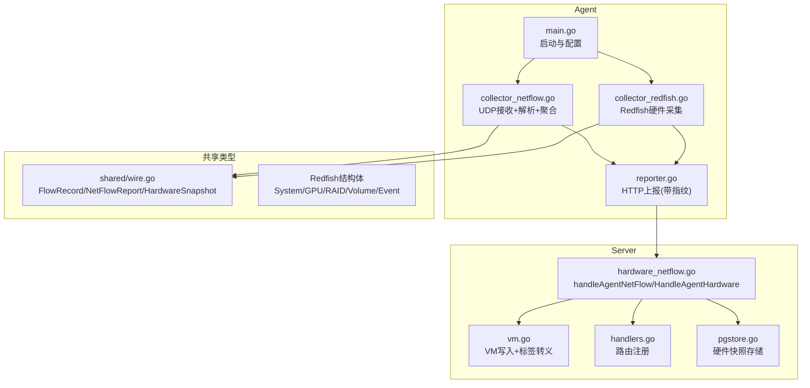
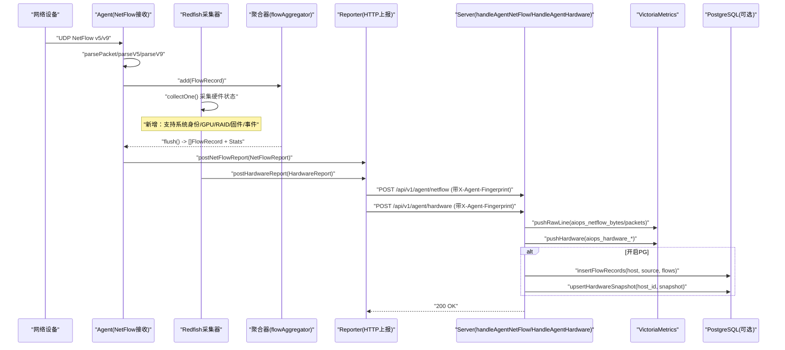
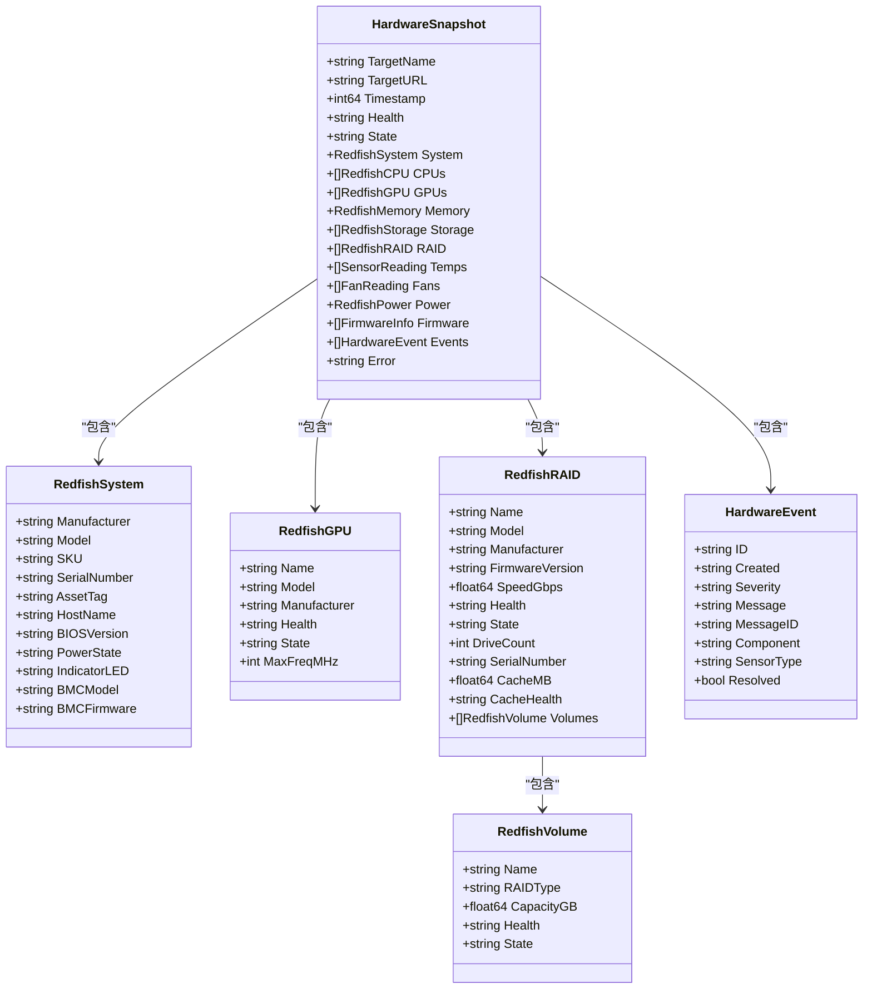
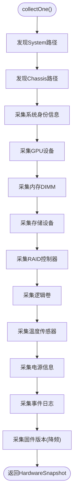
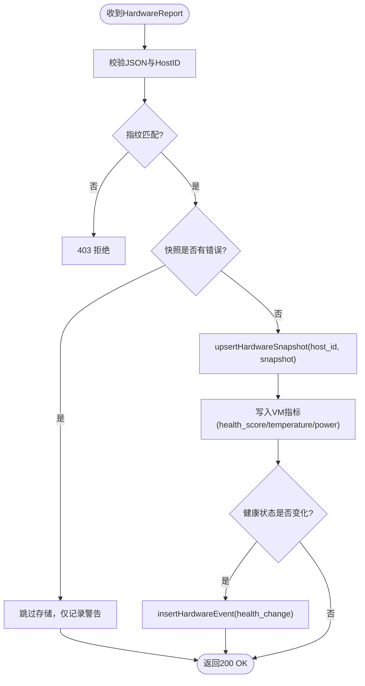
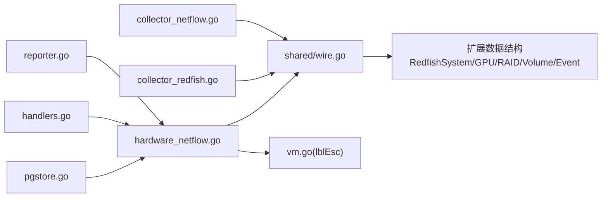

# NetFlow网络流量采集器

<cite>
**本文引用的文件列表**
- [shared/wire.go](file://shared/wire.go)
- [cmd/agent/collector_redfish.go](file://cmd/agent/collector_redfish.go)
- [cmd/agent/collector_netflow.go](file://cmd/agent/collector_netflow.go)
- [cmd/server/handlers.go](file://cmd/server/handlers.go)
- [cmd/server/hardware_netflow.go](file://cmd/server/hardware_netflow.go)
- [cmd/server/pgstore.go](file://cmd/server/pgstore.go)
- [cmd/server/vm.go](file://cmd/server/vm.go)
</cite>

## 更新摘要
**变更内容**
- HardwareSnapshot结构体扩展：新增Identity、Firmware、Events、RAID、Volumes字段以支持增强的Redfish采集能力
- 新增多个Redfish相关结构体定义：RedfishSystem、RedfishGPU、RedfishRAID、RedfishVolume、HardwareEvent等
- 增强Redfish采集器的硬件状态采集功能，支持更详细的系统信息、固件版本、事件日志和存储配置
- 确保与Redfish采集器增强功能的兼容性，完善硬件监控的数据模型

## 目录
1. [简介](#简介)
2. [项目结构](#项目结构)
3. [核心组件](#核心组件)
4. [架构总览](#架构总览)
5. [详细组件分析](#详细组件分析)
6. [依赖关系分析](#依赖关系分析)
7. [性能与容量规划](#性能与容量规划)
8. [故障排查指南](#故障排查指南)
9. [结论](#结论)
10. [附录：配置与API参考](#附录配置与api参考)

## 简介
本方案聚焦于NetFlow网络流量采集能力，覆盖Agent端UDP接收、协议解析（v5/v9）、五元组聚合、窗口化上报，以及Server端指标写入、明细存储与查询。同时给出与Redfish硬件采集、五元组包采集的协同方式，形成"三类采集器 + Server端查询分析"的完整技术闭环。

**更新** v6.2.6版本增强了共享数据结构的扩展能力，HardwareSnapshot新增Identity、Firmware、Events、RAID、Volumes字段以支持增强的Redfish采集功能，新增RedfishSystem、RedfishGPU、RedfishRAID、RedfishVolume、HardwareEvent等新结构体定义，确保与Redfish采集器增强功能的兼容性。

## 项目结构
- Agent侧新增模块
  - collector_netflow.go：NetFlow v5/v9 UDP接收器、模板缓存、五元组聚合器、定时刷新上报
  - collector_redfish.go：Redfish REST API客户端，支持增强的硬件信息采集
  - reporter.go：统一HTTP上报通道（含指纹鉴权头），提供postNetFlowReport和postHardwareReport
  - main.go：启动时根据配置初始化并运行NetFlow接收器和Redfish采集器
- 共享数据结构
  - shared/wire.go：定义FlowRecord、NetFlowReport、HardwareSnapshot等跨进程契约，包含扩展的Redfish结构体
- Server侧处理
  - hardware_netflow.go：handleAgentNetFlow接收聚合数据；handleAgentHardware接收硬件快照；vmNetFlowMetrics写入VM；insertFlowRecords持久化明细；查询接口返回Top-N与明细
  - handlers.go：注册路由，包含/netflow和/hardware相关端点
  - vm.go：VictoriaMetrics写入逻辑，包含增强的标签转义功能
  - pgstore.go：PostgreSQL存储层，支持硬件快照和事件记录

**图表来源**
- [cmd/agent/collector_redfish.go:137-182](file://cmd/agent/collector_redfish.go#L137-L182)
- [cmd/agent/collector_netflow.go:192-263](file://cmd/agent/collector_netflow.go#L192-L263)
- [cmd/agent/reporter.go:646-676](file://cmd/agent/reporter.go#L646-L676)
- [shared/wire.go:144-163](file://shared/wire.go#L144-L163)
- [cmd/server/handlers.go:292-301](file://cmd/server/handlers.go#L292-L301)
- [cmd/server/hardware_netflow.go:19-77](file://cmd/server/hardware_netflow.go#L19-L77)

章节来源
- [cmd/agent/collector_redfish.go:137-182](file://cmd/agent/collector_redfish.go#L137-L182)
- [cmd/agent/collector_netflow.go:192-263](file://cmd/agent/collector_netflow.go#L192-L263)
- [cmd/agent/reporter.go:646-676](file://cmd/agent/reporter.go#L646-L676)
- [shared/wire.go:144-163](file://shared/wire.go#L144-L163)
- [cmd/server/handlers.go:292-301](file://cmd/server/handlers.go#L292-L301)
- [cmd/server/hardware_netflow.go:19-77](file://cmd/server/hardware_netflow.go#L19-L77)

## 核心组件
- NetFlowConfig与ActiveTarget：控制监听地址、协议版本、窗口大小、限速、主动采集目标（SNMP/REST）
- flowAggregator：基于五元组键的内存聚合器，支持容量上限与最小字节淘汰策略
- netflowReceiver：UDP监听、v5/v9解析、模板缓存、定时flush并调用上报回调
- RedfishCollector：Redfish REST API客户端，支持增强的硬件信息采集，包括系统身份、GPU、RAID、固件版本、事件日志等
- Reporter：统一HTTP上报，携带X-Agent-Fingerprint进行指纹校验
- Server端处理器：handleAgentNetFlow校验指纹、写入VM指标、可选持久化明细、提供Top-N与明细查询；handleAgentHardware处理硬件快照
- **安全增强**：lblEsc函数对所有标签值进行转义处理，防止Prometheus标签注入攻击
- **扩展的数据模型**：HardwareSnapshot及其相关的Redfish结构体支持更丰富的硬件信息采集

章节来源
- [cmd/agent/collector_netflow.go:14-31](file://cmd/agent/collector_netflow.go#L14-L31)
- [cmd/agent/collector_redfish.go:93-134](file://cmd/agent/collector_redfish.go#L93-L134)
- [cmd/agent/reporter.go:646-676](file://cmd/agent/reporter.go#L646-L676)
- [cmd/server/hardware_netflow.go:19-77](file://cmd/server/hardware_netflow.go#L19-L77)
- [shared/wire.go:144-163](file://shared/wire.go#L144-L163)

## 架构总览
整体流程：交换机/防火墙推送NetFlow到Agent UDP端口 → Agent按版本解析为FlowRecord → 五元组聚合 → 窗口期结束批量POST至Server → Server写入VM指标并可选落库 → 前端通过API查询Top-N或明细。同时，Redfish采集器独立运行，定期从BMC/iDRAC/iLO采集硬件状态，通过独立的硬件上报通道传输。

**更新** 本次更新重点增强了共享数据结构的扩展能力，HardwareSnapshot新增多个字段以支持更详细的硬件信息采集，包括系统身份信息、固件版本、事件日志、RAID控制器和逻辑卷等。

**图表来源**
- [cmd/agent/collector_netflow.go:265-464](file://cmd/agent/collector_netflow.go#L265-L464)
- [cmd/agent/collector_redfish.go:337-787](file://cmd/agent/collector_redfish.go#L337-L787)
- [cmd/agent/reporter.go:646-676](file://cmd/agent/reporter.go#L646-L676)
- [cmd/server/hardware_netflow.go:19-77](file://cmd/server/hardware_netflow.go#L19-L77)
- [cmd/server/hardware_netflow.go:79-109](file://cmd/server/hardware_netflow.go#L79-L109)

## 详细组件分析

### 组件A：扩展的共享数据结构
- **关键职责**
  - HardwareSnapshot结构体扩展：新增Identity、Firmware、Events、RAID、Volumes字段
  - 新增RedfishSystem结构体：存储整机身份信息（厂商/型号/序列号/BIOS等）
  - 新增RedfishGPU结构体：支持GPU设备信息采集
  - 新增RedfishRAID结构体：存储RAID控制器信息
  - 新增RedfishVolume结构体：存储逻辑卷信息
  - 新增HardwareEvent结构体：存储BMC事件日志
- **数据结构层次**
  - HardwareSnapshot作为顶层容器，包含所有硬件相关信息
  - RedfishSystem提供系统身份标识，便于运维人员识别具体设备
  - Firmware数组存储固件版本信息，支持降频采集
  - Events数组存储最近的事件日志，用于故障诊断
  - RAID数组存储RAID控制器及其关联的逻辑卷
- **向后兼容性**
  - 所有新增字段都使用omitempty标签，保持向后兼容
  - 旧版本的Agent和服务端可以正常处理不包含新字段的快照

**图表来源**
- [shared/wire.go:144-163](file://shared/wire.go#L144-L163)
- [shared/wire.go:165-180](file://shared/wire.go#L165-L180)
- [shared/wire.go:208-218](file://shared/wire.go#L208-L218)
- [shared/wire.go:220-234](file://shared/wire.go#L220-L234)
- [shared/wire.go:236-243](file://shared/wire.go#L236-L243)
- [shared/wire.go:182-196](file://shared/wire.go#L182-L196)

章节来源
- [shared/wire.go:144-163](file://shared/wire.go#L144-L163)
- [shared/wire.go:165-180](file://shared/wire.go#L165-L180)
- [shared/wire.go:208-218](file://shared/wire.go#L208-L218)
- [shared/wire.go:220-234](file://shared/wire.go#L220-L234)
- [shared/wire.go:236-243](file://shared/wire.go#L236-L243)
- [shared/wire.go:182-196](file://shared/wire.go#L182-L196)

### 组件B：增强的Redfish采集器
- **关键职责**
  - collectOne方法扩展：支持采集系统身份信息、GPU设备、RAID控制器、固件版本、事件日志
  - fillManagerInfo方法：获取BMC自身信息（iDRAC9/iBMC + 固件版本）
  - collectVolumes方法：读取逻辑RAID卷信息
  - collectEvents方法：采集BMC事件日志，支持多种厂商格式
  - logServicePaths方法：动态发现LogService路径，适配不同厂商实现
- **增强的采集能力**
  - 系统身份信息：厂商、型号、序列号、资产标签、主机名、BIOS版本等
  - GPU设备支持：从Processors集合中识别ProcessorType=GPU的设备
  - RAID控制器信息：存储控制器型号、固件版本、速度、健康状态、缓存信息等
  - 逻辑卷信息：RAID类型、容量、健康状态等
  - 固件版本信息：降频采集（每小时一次），避免频繁访问UpdateService
  - 事件日志：支持Dell SEL、华为iBMC等多种格式，限制最多40条
- **错误处理和健壮性**
  - 采集失败时保留上一次快照，避免数据丢失
  - 连续失败退避机制：3次失败后退避5分钟
  - 各采集项独立错误处理，单个失败不影响其他采集

**图表来源**
- [cmd/agent/collector_redfish.go:337-787](file://cmd/agent/collector_redfish.go#L337-L787)
- [cmd/agent/collector_redfish.go:803-821](file://cmd/agent/collector_redfish.go#L803-L821)
- [cmd/agent/collector_redfish.go:824-864](file://cmd/agent/collector_redfish.go#L824-L864)
- [cmd/agent/collector_redfish.go:927-1022](file://cmd/agent/collector_redfish.go#L927-L1022)

章节来源
- [cmd/agent/collector_redfish.go:337-787](file://cmd/agent/collector_redfish.go#L337-L787)
- [cmd/agent/collector_redfish.go:803-821](file://cmd/agent/collector_redfish.go#L803-L821)
- [cmd/agent/collector_redfish.go:824-864](file://cmd/agent/collector_redfish.go#L824-L864)
- [cmd/agent/collector_redfish.go:927-1022](file://cmd/agent/collector_redfish.go#L927-L1022)

### 组件C：NetFlow接收与聚合（保持不变）
- 关键职责
  - UDP监听与缓冲设置
  - 版本分发：v5固定格式、v9模板流
  - v9模板缓存：sourceID_templateID → 字段定义
  - 五元组聚合：map[flowKey]*flowEntry，支持容量上限与最少字节淘汰
  - 窗口刷新：每window_sec触发flush，生成NetFlowReport并上报
- 复杂度与容量
  - 聚合时间复杂度O(1)/条记录插入；flush O(N)遍历当前窗口
  - 内存上限由maxFlows控制，超限时淘汰最小字节条目，避免OOM
- 错误与健壮性
  - 短包直接丢弃；不支持版本告警；读取错误继续循环
  - 模板未就绪的数据流跳过，等待后续模板
  - 改进了v5版本的时间戳转换处理，提高了时间精度

章节来源
- [cmd/agent/collector_netflow.go:192-263](file://cmd/agent/collector_netflow.go#L192-L263)
- [cmd/agent/collector_netflow.go:265-464](file://cmd/agent/collector_netflow.go#L265-L464)
- [cmd/agent/collector_netflow.go:55-165](file://cmd/agent/collector_netflow.go#L55-L165)

### 组件D：增强的Server端处理
- **关键职责**
  - handleAgentHardware：处理Redfish硬件快照，支持新的数据结构
  - handleAgentNetFlow：处理NetFlow聚合数据（保持不变）
  - vmHardwareMetrics：将硬件快照转换为VM指标，支持新的字段
  - vmNetFlowMetrics：将FlowRecord转为aiops_netflow_bytes/packets时序点
  - 查询接口：Top-N汇总（按维度聚合）、明细分页过滤、硬件历史查询
- **增强的处理能力**
  - 支持新的HardwareSnapshot字段：System、GPUs、RAID、Firmware、Events等
  - 智能快照存储：采集失败的快照不会覆盖之前的有效数据
  - 健康状态变化检测：仅在状态变化时记录事件，避免重复告警
  - 多目标支持：同一主机可配置多个Redfish目标，分别采集
- **安全增强**
  - 所有标签值通过lblEsc函数进行转义处理
  - 防止恶意标签值注入攻击
  - 转义规则：反斜杠、引号、换行符等特殊字符

**图表来源**
- [cmd/server/hardware_netflow.go:19-77](file://cmd/server/hardware_netflow.go#L19-L77)
- [cmd/server/hardware_netflow.go:340-373](file://cmd/server/hardware_netflow.go#L340-L373)
- [cmd/server/vm.go:499-503](file://cmd/server/vm.go#L499-L503)

章节来源
- [cmd/server/hardware_netflow.go:19-77](file://cmd/server/hardware_netflow.go#L19-L77)
- [cmd/server/hardware_netflow.go:340-373](file://cmd/server/hardware_netflow.go#L340-L373)
- [cmd/server/vm.go:499-503](file://cmd/server/vm.go#L499-L503)

### 组件E：标签转义安全机制（保持不变）
- 关键职责
  - lblEsc函数对所有Prometheus标签值进行转义处理
  - 防止特殊字符导致的标签注入攻击
  - 统一的转义规则应用于所有指标写入场景
- 转义规则
  - 反斜杠 `\` → `\\`
  - 双引号 `"` → `\"`
  - 换行符 `\n` → 空格
- 应用范围
  - 基础系统指标的所有标签
  - NetFlow流量的源/目的IP标签
  - GPU、磁盘、连接数等所有动态标签

章节来源
- [cmd/server/vm.go:499-503](file://cmd/server/vm.go#L499-L503)

### 组件F：启动与集成（保持不变）
- 在main中加载配置，若netflow.listen非空则创建receiver并启动
- 与Redfish、Packet采集器并列启动，各自独立goroutine与上报路径
- Windows网络采集器独立运行，提供准确的网络接口统计信息

章节来源
- [cmd/agent/main.go:234-236](file://cmd/agent/main.go#L234-L236)

## 依赖关系分析
- Agent内部依赖
  - collector_netflow.go 依赖 shared/wire.go 的数据结构
  - collector_redfish.go 依赖 shared/wire.go 的扩展数据结构
  - reporter.go 负责HTTP上报，被collector_netflow.go和collector_redfish.go通过回调函数驱动
- Server内部依赖
  - hardware_netflow.go 依赖 shared/wire.go 与VM/PG存储层
  - vm.go 提供安全的标签转义功能，被所有指标写入逻辑使用
  - handlers.go 负责路由注册，将/api/v1/agent/netflow和/api/v1/agent/hardware绑定到相应处理器
  - pgstore.go 提供硬件快照和事件的持久化存储
- **扩展的数据模型依赖**
  - 所有组件都依赖shared/wire.go中的扩展数据结构
  - Redfish采集器和服务端处理器需要正确处理新的字段

**图表来源**
- [cmd/agent/collector_netflow.go:11-12](file://cmd/agent/collector_netflow.go#L11-L12)
- [cmd/agent/collector_redfish.go:16](file://cmd/agent/collector_redfish.go#L16)
- [cmd/agent/reporter.go:18](file://cmd/agent/reporter.go#L18)
- [cmd/server/hardware_netflow.go:12](file://cmd/server/hardware_netflow.go#L12)
- [cmd/server/vm.go:499-503](file://cmd/server/vm.go#L499-L503)
- [cmd/server/handlers.go:292-301](file://cmd/server/handlers.go#L292-L301)
- [shared/wire.go:144-163](file://shared/wire.go#L144-L163)

章节来源
- [cmd/agent/collector_netflow.go:11-12](file://cmd/agent/collector_netflow.go#L11-L12)
- [cmd/agent/collector_redfish.go:16](file://cmd/agent/collector_redfish.go#L16)
- [cmd/agent/reporter.go:18](file://cmd/agent/reporter.go#L18)
- [cmd/server/hardware_netflow.go:12](file://cmd/server/hardware_netflow.go#L12)
- [cmd/server/vm.go:499-503](file://cmd/server/vm.go#L499-L503)
- [cmd/server/handlers.go:292-301](file://cmd/server/handlers.go#L292-L301)
- [shared/wire.go:144-163](file://shared/wire.go#L144-L163)

## 性能与容量规划
- 聚合窗口
  - window_sec建议300秒（5分钟），可根据业务峰值调整
- 内存上限
  - maxFlows默认100k，需结合设备规模与五元组基数评估；超限会淘汰最小字节条目
- UDP缓冲
  - buffer_size可按网卡队列与峰值吞吐调优，避免丢包
- 限速
  - max_flows_per_sec用于抑制突发，保护聚合器与上报链路
- 存储
  - VM用于趋势与Top-N查询；PG用于明细检索与导出，注意定期清理过期记录
- **Redfish采集优化**
  - 固件版本采集降频：每小时一次，避免频繁访问UpdateService
  - 事件日志采集限流：300秒间隔，最多40条，避免BMC压力过大
  - 各采集项独立错误处理，单个失败不影响整体采集
- **Windows网络采集优化**
  - 修复后的网络接口统计更加准确，避免了回环网卡流量的干扰

章节来源
- [cmd/agent/collector_netflow.go:192-200](file://cmd/agent/collector_netflow.go#L192-L200)
- [cmd/agent/collector_netflow.go:202-263](file://cmd/agent/collector_netflow.go#L202-263)
- [cmd/agent/collector_redfish.go:756-784](file://cmd/agent/collector_redfish.go#L756-L784)
- [cmd/agent/collector_redfish.go:792-798](file://cmd/agent/collector_redfish.go#L792-L798)
- [cmd/server/hardware_netflow.go:352-368](file://cmd/server/hardware_netflow.go#L352-L368)

## 故障排查指南
- 现象：无流量进入
  - 检查Agent是否监听正确UDP端口；确认网络设备已配置指向该Agent
  - 查看日志"NetFlow 接收器启动"与"NetFlow UDP 读取错误"
- 现象：大量丢包或延迟
  - 增大buffer_size；降低window_sec以更快释放内存；适当提高max_flows
  - 观察stats.DroppedPackets增长情况
- 现象：v9无法解码
  - 确认模板先于数据到达；检查sourceID与templateID缓存命中
- 现象：Server拒绝
  - 核对X-Agent-Fingerprint是否一致；确认主机已注册且指纹绑定
- 现象：Windows网络流量统计异常
  - 检查是否正确跳过了回环网卡接口
  - 确认MIB_IFROW结构体偏移量已修复（offType=516）
  - 验证物理网卡的收发流量统计是否准确
- 现象：硬件快照为空或不完整
  - 检查Redfish采集器日志，确认BMC连接和认证是否正常
  - 查看是否有"硬件采集失败"警告，确认错误原因
  - 检查是否启用了skip_tls_verify，对于自签名证书的情况
- 现象：硬件信息缺失（如GPU/RAID/固件）
  - 确认BMC固件版本是否支持相应的Redfish API
  - 检查采集频率是否过低（固件版本每小时采集一次）
  - 查看事件日志中是否有相关错误信息
- 现象：标签注入攻击或指标异常
  - 确认所有标签值都经过了lblEsc转义处理
  - 检查是否存在未转义的特殊字符（反斜杠、引号、换行符）
  - 验证Prometheus指标格式是否符合规范

章节来源
- [cmd/agent/collector_netflow.go:202-263](file://cmd/agent/collector_netflow.go#L202-263)
- [cmd/agent/collector_netflow.go:403-464](file://cmd/agent/collector_netflow.go#L403-464)
- [cmd/agent/collector_redfish.go:157-181](file://cmd/agent/collector_redfish.go#L157-L181)
- [cmd/server/hardware_netflow.go:55-58](file://cmd/server/hardware_netflow.go#L55-L58)
- [cmd/server/vm.go:499-503](file://cmd/server/vm.go#L499-L503)

## 结论
NetFlow采集器在Agent侧实现高内聚的UDP接收、协议解析与五元组聚合，并通过统一的指纹上报通道与Server交互。Server侧将聚合结果转化为可查询的时序指标与明细记录，满足Top-N分析与问题定位需求。配合Redfish硬件采集与五元组包采集，形成从硬件健康、网络流量到系统行为的统一观测体系。

**更新** v6.2.6版本的增强显著提升了系统的稳定性和数据采集能力：
- 扩展了HardwareSnapshot结构体，新增Identity、Firmware、Events、RAID、Volumes字段
- 新增了RedfishSystem、RedfishGPU、RedfishRAID、RedfishVolume、HardwareEvent等结构体定义
- 增强了Redfish采集器的硬件信息采集能力，支持更详细的系统状态监控
- 确保了与Redfish采集器增强功能的兼容性，完善了硬件监控的数据模型

这些改进使得系统在复杂网络环境和企业级数据中心都能提供更加全面、准确和可靠的硬件监控能力。

## 附录：配置与API参考

### Agent配置示例（节选）
- netflow.listen：UDP监听地址
- protocols：["v5","v9"]
- buffer_size/window_sec/max_flows_per_sec：性能与安全参数
- active_targets：可选主动采集目标（SNMP/REST）
- redfish_targets：Redfish BMC/iDRAC/iLO目标配置

章节来源
- [config.example.json:77-86](file://config.example.json#L77-L86)

### Server API（与NetFlow和硬件相关）
- POST /api/v1/agent/netflow：接收聚合后的NetFlowReport
- POST /api/v1/agent/hardware：接收Redfish硬件快照
- GET /api/v1/netflow/summary：按维度返回Top-N汇总
- GET /api/v1/netflow/flows：返回明细记录（支持limit/filter）
- GET /api/v1/netflow/packets：返回包统计时序
- GET /api/v1/hardware/health：返回最新硬件快照
- GET /api/v1/hardware/history：返回硬件指标历史
- GET /api/v1/hardware/events：返回硬件状态变更事件

章节来源
- [cmd/server/handlers.go:292-301](file://cmd/server/handlers.go#L292-L301)
- [cmd/server/hardware_netflow.go:115-200](file://cmd/server/hardware_netflow.go#L115-L200)
- [cmd/server/hardware_netflow.go:202-319](file://cmd/server/hardware_netflow.go#L202-L319)