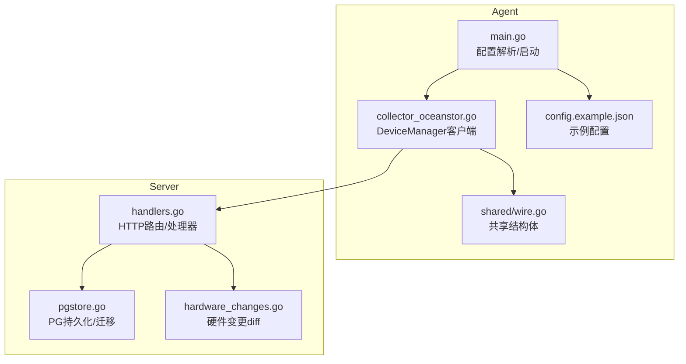
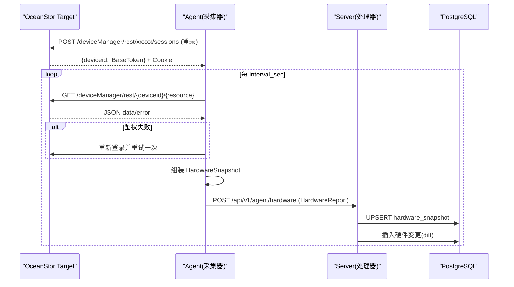
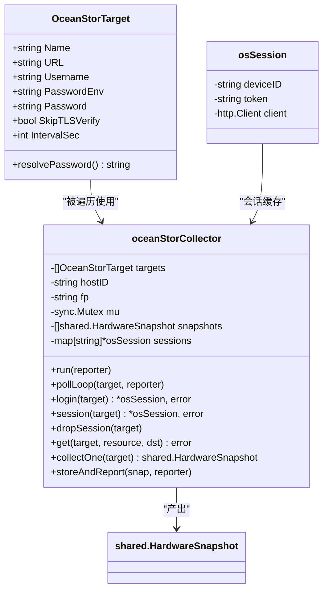
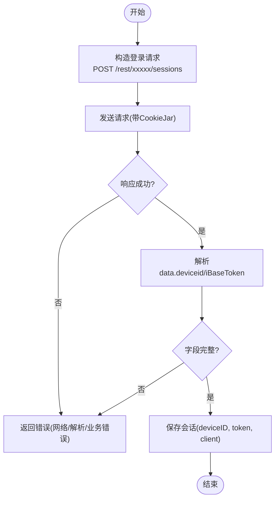
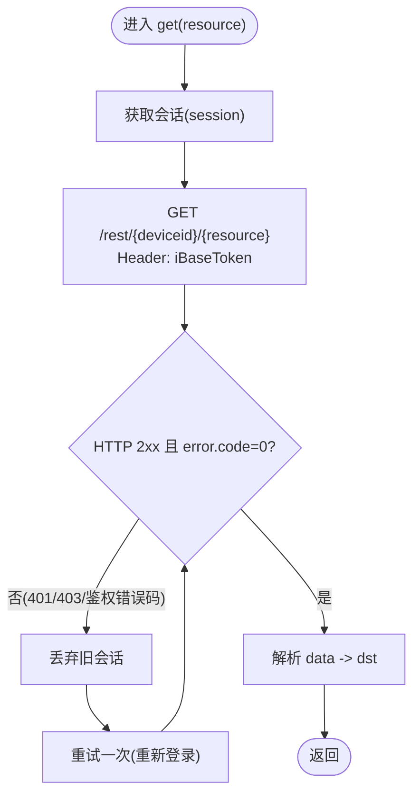
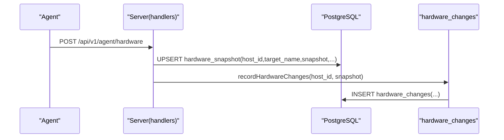
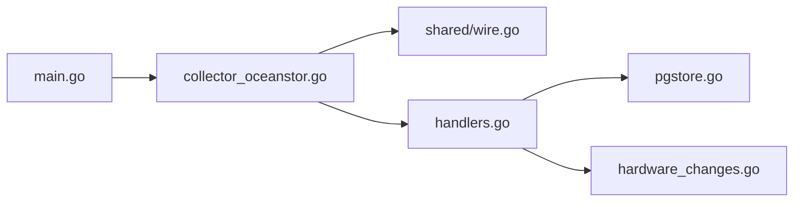

# OceanStor存储采集器

<cite>
**本文引用的文件**   
- [cmd/agent/main.go](file://cmd/agent/main.go)
- [cmd/agent/collector_oceanstor.go](file://cmd/agent/collector_oceanstor.go)
- [shared/wire.go](file://shared/wire.go)
- [config.example.json](file://config.example.json)
- [cmd/server/handlers.go](file://cmd/server/handlers.go)
- [cmd/server/pgstore.go](file://cmd/server/pgstore.go)
- [cmd/server/hardware_changes.go](file://cmd/server/hardware_changes.go)
</cite>

## 目录
1. [简介](#简介)
2. [项目结构](#项目结构)
3. [核心组件](#核心组件)
4. [架构总览](#架构总览)
5. [详细组件分析](#详细组件分析)
6. [依赖关系分析](#依赖关系分析)
7. [性能与容量规划](#性能与容量规划)
8. [故障排查指南](#故障排查指南)
9. [结论](#结论)
10. [附录：配置与API参考](#附录配置与api参考)

## 简介
本文件聚焦于 OceanStor 存储采集器的设计与实现，说明其在 Agent 端通过华为 DeviceManager REST API 采集硬件状态、告警与固件信息，并将结果以统一的结构上报至 Server 端进行持久化、变更追踪与展示。OceanStor 不支持 Redfish，因此采用独立的采集器实现，复用共享数据结构与前端能力，避免重复建设。

## 项目结构
围绕 OceanStor 采集的关键文件与职责如下：
- Agent 端
  - 配置加载与运行入口：cmd/agent/main.go
  - OceanStor 采集器实现：cmd/agent/collector_oceanstor.go
  - 共享数据模型（HardwareSnapshot 等）：shared/wire.go
  - 示例配置（含 OceanStor 相关字段）：config.example.json
- Server 端
  - HTTP 路由与处理器注册：cmd/server/handlers.go
  - PostgreSQL 持久化与迁移：cmd/server/pgstore.go
  - 硬件资产变更检测与记录：cmd/server/hardware_changes.go

**图示来源**
- [cmd/agent/main.go:228-241](file://cmd/agent/main.go#L228-L241)
- [cmd/agent/collector_oceanstor.go:85-98](file://cmd/agent/collector_oceanstor.go#L85-L98)
- [shared/wire.go:144-164](file://shared/wire.go#L144-L164)
- [cmd/server/handlers.go:105-120](file://cmd/server/handlers.go#L105-L120)
- [cmd/server/pgstore.go:79-100](file://cmd/server/pgstore.go#L79-L100)
- [cmd/server/hardware_changes.go:147-163](file://cmd/server/hardware_changes.go#L147-L163)

**章节来源**
- [cmd/agent/main.go:228-241](file://cmd/agent/main.go#L228-L241)
- [cmd/agent/collector_oceanstor.go:85-98](file://cmd/agent/collector_oceanstor.go#L85-L98)
- [shared/wire.go:144-164](file://shared/wire.go#L144-L164)
- [config.example.json:1-98](file://config.example.json#L1-L98)
- [cmd/server/handlers.go:105-120](file://cmd/server/handlers.go#L105-L120)
- [cmd/server/pgstore.go:79-100](file://cmd/server/pgstore.go#L79-L100)
- [cmd/server/hardware_changes.go:147-163](file://cmd/server/hardware_changes.go#L147-L163)

## 核心组件
- OceanStorTarget 与会话管理
  - 目标定义包含名称、URL、用户名、密码来源（环境变量或明文）、TLS 跳过校验、采集间隔等。
  - 登录流程返回 deviceid 与 iBaseToken，并维护 cookie jar；后续请求需同时携带 token 头与 cookie。
  - 自动重登机制：遇到鉴权错误码时丢弃旧会话并重试一次。
- 数据采集与映射
  - 依次拉取 system、enclosure、disk、controller、power、fan、alarm/currentalarm 等资源。
  - 将设备侧枚举值映射为统一的健康度与健康状态语义，便于前端一致展示。
  - 磁盘容量按扇区数换算为 GB，SSD 剩余寿命由“已用百分比”反算。
- 快照聚合与上报
  - 每个 target 独立 goroutine 定时轮询，结果写入内存快照列表，合并后一次性上报 HardwareReport。
  - 复用 shared.HardwareSnapshot 结构，使 OceanStor 与 Redfish 共享同一套 UI 与告警链路。

**章节来源**
- [cmd/agent/collector_oceanstor.go:44-92](file://cmd/agent/collector_oceanstor.go#L44-L92)
- [cmd/agent/collector_oceanstor.go:144-192](file://cmd/agent/collector_oceanstor.go#L144-L192)
- [cmd/agent/collector_oceanstor.go:224-272](file://cmd/agent/collector_oceanstor.go#L224-L272)
- [cmd/agent/collector_oceanstor.go:397-545](file://cmd/agent/collector_oceanstor.go#L397-L545)
- [cmd/agent/collector_oceanstor.go:547-605](file://cmd/agent/collector_oceanstor.go#L547-L605)
- [shared/wire.go:144-164](file://shared/wire.go#L144-L164)

## 架构总览
OceanStor 采集器作为独立模块运行在 Agent 中，周期性访问 DeviceManager REST 接口，组装 HardwareSnapshot 并通过统一通道上报至 Server。Server 端接收后持久化最新快照、记录硬件变更事件，并为上层查询与展示提供数据支撑。

**图示来源**
- [cmd/agent/collector_oceanstor.go:144-192](file://cmd/agent/collector_oceanstor.go#L144-L192)
- [cmd/agent/collector_oceanstor.go:224-272](file://cmd/agent/collector_oceanstor.go#L224-L272)
- [cmd/agent/collector_oceanstor.go:122-140](file://cmd/agent/collector_oceanstor.go#L122-L140)
- [cmd/server/handlers.go:105-120](file://cmd/server/handlers.go#L105-L120)
- [cmd/server/pgstore.go:79-100](file://cmd/server/pgstore.go#L79-L100)
- [cmd/server/hardware_changes.go:147-163](file://cmd/server/hardware_changes.go#L147-L163)

## 详细组件分析

### OceanStor 采集器类图

**图示来源**
- [cmd/agent/collector_oceanstor.go:44-92](file://cmd/agent/collector_oceanstor.go#L44-L92)
- [cmd/agent/collector_oceanstor.go:69-92](file://cmd/agent/collector_oceanstor.go#L69-L92)
- [cmd/agent/collector_oceanstor.go:94-140](file://cmd/agent/collector_oceanstor.go#L94-L140)
- [shared/wire.go:144-164](file://shared/wire.go#L144-L164)

**章节来源**
- [cmd/agent/collector_oceanstor.go:44-92](file://cmd/agent/collector_oceanstor.go#L44-L92)
- [cmd/agent/collector_oceanstor.go:94-140](file://cmd/agent/collector_oceanstor.go#L94-L140)
- [shared/wire.go:144-164](file://shared/wire.go#L144-L164)

### 登录与会话流程

**图示来源**
- [cmd/agent/collector_oceanstor.go:144-192](file://cmd/agent/collector_oceanstor.go#L144-L192)

**章节来源**
- [cmd/agent/collector_oceanstor.go:144-192](file://cmd/agent/collector_oceanstor.go#L144-L192)

### 资源获取与鉴权重试

**图示来源**
- [cmd/agent/collector_oceanstor.go:224-272](file://cmd/agent/collector_oceanstor.go#L224-L272)

**章节来源**
- [cmd/agent/collector_oceanstor.go:224-272](file://cmd/agent/collector_oceanstor.go#L224-L272)

### 数据建模与映射要点
- 健康度映射：将设备侧 HEALTHSTATUS 数值映射为 OK/Warning/Critical，避免过度告警。
- 运行状态映射：RUNNINGSTATUS 映射为可读状态（如 Normal/Running/LinkUp/Offline 等）。
- 告警级别映射：将 major/critical 归一化为 Critical，warning 保留 Warning。
- 容量与寿命：磁盘容量按扇区数换算为 GB；SSD 剩余寿命由“已用百分比”反算为“剩余百分比”。

**章节来源**
- [cmd/agent/collector_oceanstor.go:319-393](file://cmd/agent/collector_oceanstor.go#L319-L393)
- [cmd/agent/collector_oceanstor.go:547-579](file://cmd/agent/collector_oceanstor.go#L547-L579)

### Server 端处理与持久化
- 处理器注册：Server 在路由中注册硬件相关端点，用于接收 Agent 上报的硬件快照。
- 持久化：PostgreSQL 负责持久化最新快照与硬件变更事件；支持扩展索引与迁移。
- 变更检测：对相邻两次快照做部件级 diff，仅记录新增、移除、替换与固件版本变化。

**图示来源**
- [cmd/server/handlers.go:105-120](file://cmd/server/handlers.go#L105-L120)
- [cmd/server/pgstore.go:79-100](file://cmd/server/pgstore.go#L79-L100)
- [cmd/server/hardware_changes.go:147-163](file://cmd/server/hardware_changes.go#L147-L163)

**章节来源**
- [cmd/server/handlers.go:105-120](file://cmd/server/handlers.go#L105-L120)
- [cmd/server/pgstore.go:79-100](file://cmd/server/pgstore.go#L79-L100)
- [cmd/server/hardware_changes.go:147-163](file://cmd/server/hardware_changes.go#L147-L163)

## 依赖关系分析
- Agent 内部
  - main.go 负责读取配置并注入 OceanStorTargets，启动采集器。
  - collector_oceanstor.go 依赖 shared.HardwareSnapshot 输出统一结构。
- Server 内部
  - handlers.go 暴露 HTTP 接口，调用 pgstore 与 hardware_changes 完成持久化与变更记录。
- 外部依赖
  - PostgreSQL：可选持久化后端，通过环境变量 DSN 启用；未配置则回退内嵌存储。
  - 网络设备：华为 OceanStor DeviceManager REST 服务（HTTPS 8088/443）。

**图示来源**
- [cmd/agent/main.go:228-241](file://cmd/agent/main.go#L228-L241)
- [cmd/agent/collector_oceanstor.go:85-98](file://cmd/agent/collector_oceanstor.go#L85-L98)
- [shared/wire.go:144-164](file://shared/wire.go#L144-L164)
- [cmd/server/handlers.go:105-120](file://cmd/server/handlers.go#L105-L120)
- [cmd/server/pgstore.go:79-100](file://cmd/server/pgstore.go#L79-L100)
- [cmd/server/hardware_changes.go:147-163](file://cmd/server/hardware_changes.go#L147-L163)

**章节来源**
- [cmd/agent/main.go:228-241](file://cmd/agent/main.go#L228-L241)
- [cmd/agent/collector_oceanstor.go:85-98](file://cmd/agent/collector_oceanstor.go#L85-L98)
- [shared/wire.go:144-164](file://shared/wire.go#L144-L164)
- [cmd/server/handlers.go:105-120](file://cmd/server/handlers.go#L105-L120)
- [cmd/server/pgstore.go:79-100](file://cmd/server/pgstore.go#L79-L100)
- [cmd/server/hardware_changes.go:147-163](file://cmd/server/hardware_changes.go#L147-L163)

## 性能与容量规划
- 采集频率
  - 默认最小间隔 30s，建议根据设备数量与网络状况调整 interval_sec。
- 并发与内存
  - 每个 target 独立 goroutine；快照在内存中聚合后批量上报，降低频繁上报开销。
- 鉴权重试
  - 遇到鉴权错误自动重登一次，减少人工干预。
- 存储增长
  - 最新快照按 host_id+target_name 唯一键 UPSERT，避免历史膨胀。
  - 硬件变更仅记录差异行，适合长期审计。

[本节为通用指导，不直接分析具体文件]

## 故障排查指南
- 认证失败
  - 检查 password_env 是否指向正确的环境变量，或 password 是否配置。
  - 确认 URL 端口（常见 8088/443）与证书策略（skip_tls_verify）。
  - 观察日志中的登录与鉴权错误码，必要时开启调试日志。
- 资源为空或解析异常
  - 部分资源可能无数据（例如当前无告警），属于正常情况。
  - 若 data 为 null 或空对象，不会视为错误。
- 会话过期
  - 遇到 401/403 或特定错误码会自动丢弃会话并重试一次。
- 服务器端问题
  - 确认 Server 已注册硬件上报端点，PG 连接可用，表结构已迁移。

**章节来源**
- [cmd/agent/collector_oceanstor.go:55-67](file://cmd/agent/collector_oceanstor.go#L55-L67)
- [cmd/agent/collector_oceanstor.go:224-272](file://cmd/agent/collector_oceanstor.go#L224-L272)
- [cmd/server/handlers.go:105-120](file://cmd/server/handlers.go#L105-L120)
- [cmd/server/pgstore.go:79-100](file://cmd/server/pgstore.go#L79-L100)

## 结论
OceanStor 采集器通过 DeviceManager REST 接口补齐了存储设备的可观测性，并以统一的数据结构与 Redfish 体系融合，既保证了前端一致性，也降低了运维复杂度。配合 Server 端的变更追踪与持久化，可实现从“现状快照”到“变更审计”的闭环。

[本节为总结性内容，不直接分析具体文件]

## 附录：配置与API参考

### Agent 配置项（节选）
- redfish_targets：Redfish 服务器 BMC 采集（非 OceanStor）
- oceanstor_targets：华为 OceanStor 存储/磁盘框采集
  - name/url/username/password_env/password/skip_tls_verify/interval_sec
- netflow/packet_capture：网络流量与五元组包采集（与 OceanStor 无关）

**章节来源**
- [config.example.json:54-96](file://config.example.json#L54-L96)

### 关键数据结构（节选）
- shared.HardwareSnapshot：统一硬件快照结构，OceanStor 与 Redfish 共用
- shared.HardwareReport：Agent 上报载体，包含多个快照
- shared.FlowRecord/NetFlowReport：网络流量与包采集（与 OceanStor 无关）

**章节来源**
- [shared/wire.go:144-164](file://shared/wire.go#L144-L164)
- [shared/wire.go:343-348](file://shared/wire.go#L343-L348)
- [shared/wire.go:354-389](file://shared/wire.go#L354-L389)

### Server 端端点（节选）
- POST /api/v1/agent/hardware：接收硬件快照（含 OceanStor）
- 其他主机/指标/告警等端点：见路由注册

**章节来源**
- [cmd/server/handlers.go:105-120](file://cmd/server/handlers.go#L105-L120)