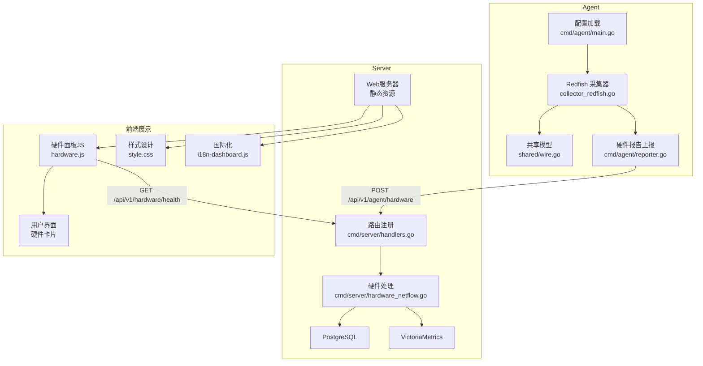
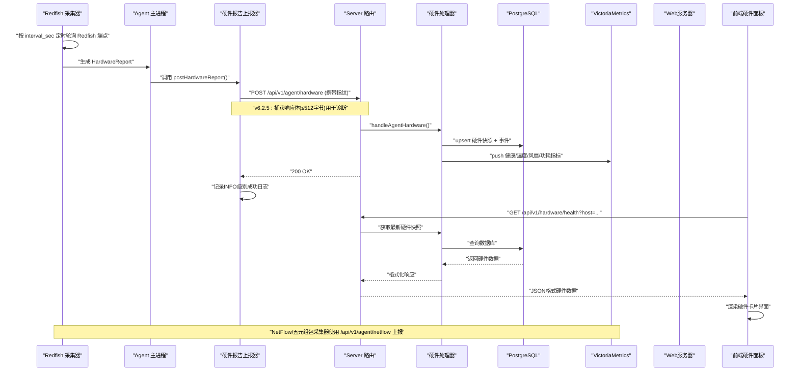
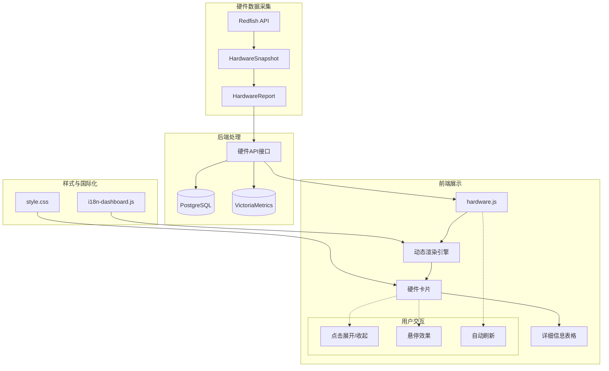
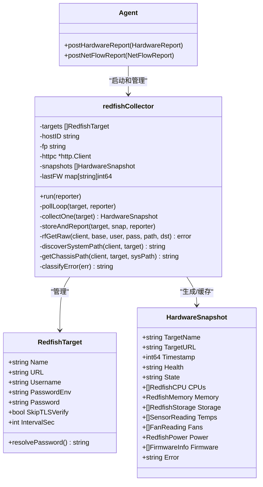
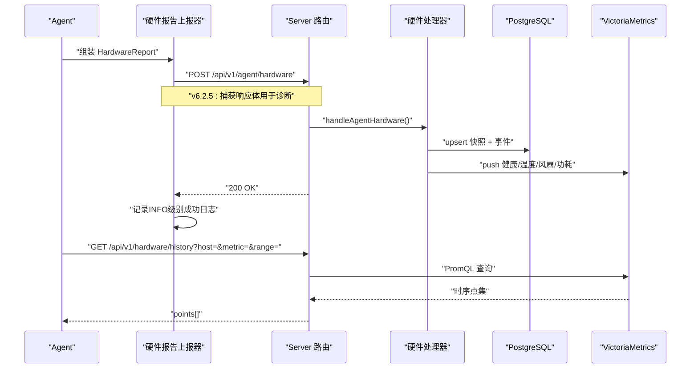
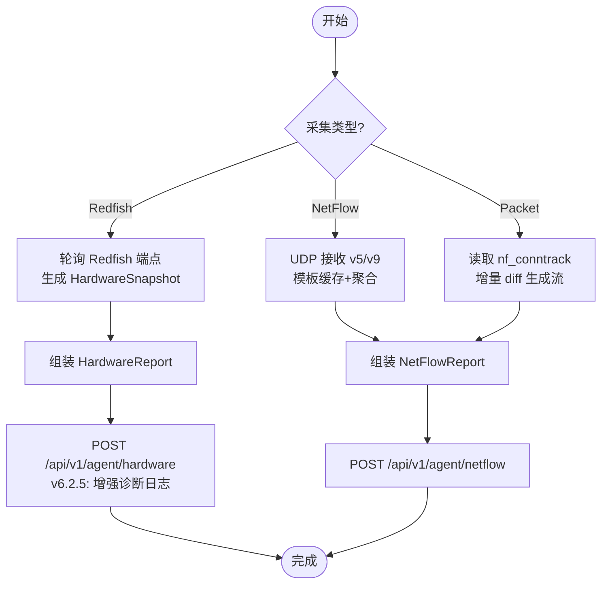
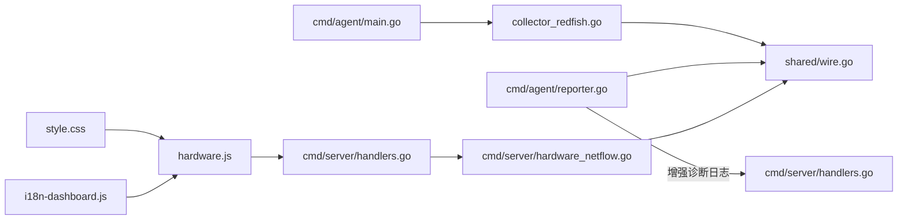

# Redfish硬件采集器

<cite>
**本文引用的文件**   
- [collector_redfish.go](file://cmd/agent/collector_redfish.go)
- [wire.go](file://shared/wire.go)
- [main.go](file://cmd/agent/main.go)
- [handlers.go](file://cmd/server/handlers.go)
- [hardware_netflow.go](file://cmd/server/hardware_netflow.go)
- [reporter.go](file://cmd/agent/reporter.go)
- [collector_netflow.go](file://cmd/agent/collector_netflow.go)
- [collector_packet.go](file://cmd/agent/collector_packet.go)
- [config.example.json](file://config.example.json)
- [hardware.js](file://cmd/server/web/js/hardware.js)
- [style.css](file://cmd/server/web/style.css)
- [i18n-dashboard.js](file://cmd/server/web/i18n-dashboard.js)
</cite>

## 更新摘要
**已进行的更改**
- **新增**：前端硬件监控面板完整实现，支持内存/DIMM详细信息显示、完整的传感器数据展示、风扇转速监控、电源状态查看等
- **增强**：交互式硬件卡片设计，支持点击展开/收起详细信息的用户交互体验
- **完善**：专业的深色主题UI设计，包含健康状态指示器、快速统计标签、响应式网格布局
- **优化**：多语言国际化支持，提供完整的中文界面翻译
- **v6.2.5增强**：硬件报告诊断功能增强，包含响应体捕获（最多512字节）用于指纹不匹配和认证问题诊断，以及成功提交的INFO级别日志记录

## 目录
1. [简介](#简介)
2. [项目结构](#项目结构)
3. [核心组件](#核心组件)
4. [架构总览](#架构总览)
5. [前端展示增强功能](#前端展示增强功能)
6. [详细组件分析](#详细组件分析)
7. [依赖关系分析](#依赖关系分析)
8. [性能与容量规划](#性能与容量规划)
9. [故障排查指南](#故障排查指南)
10. [结论](#结论)
11. [附录：API 定义](#附录api-定义)

## 简介
本文件聚焦于 AIOps 监控系统中"Redfish 硬件采集器"的端到端实现，涵盖 Agent 侧 Redfish 客户端、共享数据模型、Server 侧接收与查询接口，以及与 NetFlow/五元组包采集的协同。**最新更新**：前端硬件监控面板得到显著增强，提供了完整的硬件状态可视化展示，包括内存/DIMM详细信息、传感器数据、风扇监控、电源状态等全方位硬件观测能力。

文档面向运维与研发人员，既提供高层架构说明，也给出代码级流程与关键设计权衡。通过HTTP连接稳定性修复、增强的密码解析机制、TLS兼容性支持和全面的错误分类系统，显著提升了生产环境中BMC连接的可靠性和用户体验。

## 项目结构
围绕 Redfish 硬件采集的关键路径如下：
- Agent 侧
  - Redfish 采集器：定时轮询 BMC/iDRAC/iLO 等 Redfish 端点，聚合 CPU/内存/存储/温度/风扇/电源/固件等信息，生成快照并上报。
  - 配置注入：通过配置文件中的 redfish_targets 字段启用。
- 共享数据模型
  - 统一数据结构（HardwareSnapshot、HardwareReport 等）在 shared 包中定义，确保 Agent 与 Server 契约一致。
- Server 侧
  - 接收 Agent 上报的硬件快照，持久化到 PostgreSQL，并将数值指标写入 VictoriaMetrics；同时暴露前端查询接口。
- **前端展示层**
  - 硬件监控面板：基于 JavaScript 的动态渲染，支持交互式卡片展示
  - 专业UI设计：深色主题、响应式布局、多语言支持
  - 实时数据更新：自动刷新硬件状态信息



**图表来源** 
- [collector_redfish.go:1-126](file://cmd/agent/collector_redfish.go#L1-L126)
- [main.go:223-233](file://cmd/agent/main.go#L223-L233)
- [wire.go:144-237](file://shared/wire.go#L144-L237)
- [handlers.go:290-298](file://cmd/server/handlers.go#L290-L298)
- [hardware_netflow.go:19-90](file://cmd/server/hardware_netflow.go#L19-L90)
- [reporter.go:609-644](file://cmd/agent/reporter.go#L609-L644)
- [hardware.js:1-230](file://cmd/server/web/js/hardware.js#L1-L230)
- [style.css:2808-2839](file://cmd/server/web/style.css#L2808-L2839)
- [i18n-dashboard.js:450-472](file://cmd/server/web/i18n-dashboard.js#L450-L472)

**章节来源**
- [collector_redfish.go:1-126](file://cmd/agent/collector_redfish.go#L1-L126)
- [main.go:223-233](file://cmd/agent/main.go#L223-L233)
- [wire.go:144-237](file://shared/wire.go#L144-L237)
- [handlers.go:290-298](file://cmd/server/handlers.go#L290-L298)
- [hardware_netflow.go:19-90](file://cmd/server/hardware_netflow.go#L19-L90)

## 核心组件
- RedfishTarget：描述一个 BMC/iDRAC/iLO 目标（名称、URL、认证、TLS 策略、采集间隔）。
- redfishCollector：管理多个目标的独立 goroutine 与定时器，负责鉴权、HTTP 请求、JSON 解析、错误退避、快照合并与上报。
- HardwareSnapshot/HardwareReport：Redfish 快照与上报载荷的数据模型。
- vmHardwareMetrics：将健康分数、温度、风扇转速、功耗等指标写入时序库。
- handleAgentHardware/handleHardwareHealth/handleHardwareHistory：服务端接收与查询接口。
- postHardwareReport：增强的硬件报告上报函数，包含详细的诊断日志和响应体捕获。
- **前端硬件面板**：基于 JavaScript 的动态渲染引擎，支持交互式硬件状态展示。

**章节来源**
- [collector_redfish.go:17-126](file://cmd/agent/collector_redfish.go#L17-L126)
- [wire.go:144-237](file://shared/wire.go#L144-L237)
- [hardware_netflow.go:19-158](file://cmd/server/hardware_netflow.go#L19-L158)
- [reporter.go:609-644](file://cmd/agent/reporter.go#L609-L644)
- [hardware.js:1-230](file://cmd/server/web/js/hardware.js#L1-L230)

## 架构总览
下图展示从 Agent 采集到 Server 落库与查询的完整链路，以及三类采集器（Redfish、NetFlow、五元组包）的统一上报通道，**新增前端展示层的完整集成**。



**图表来源** 
- [collector_redfish.go:56-126](file://cmd/agent/collector_redfish.go#L56-L126)
- [reporter.go:609-644](file://cmd/agent/reporter.go#L609-L644)
- [handlers.go:290-298](file://cmd/server/handlers.go#L290-L298)
- [hardware_netflow.go:19-90](file://cmd/server/hardware_netflow.go#L19-L90)
- [hardware.js:23-43](file://cmd/server/web/js/hardware.js#L23-L43)

## 前端展示增强功能

### 硬件监控面板架构
前端硬件监控面板采用现代化的单页应用架构，通过动态JavaScript渲染实现丰富的用户交互体验。

#### 核心特性
- **交互式卡片设计**：每个硬件设备以卡片形式展示，支持点击展开/收起详细信息
- **健康状态可视化**：通过颜色编码（绿色正常、黄色警告、红色严重）直观显示设备状态
- **快速统计标签**：在卡片头部显示关键指标（内存大小、CPU核心数、最高温度、功耗等）
- **响应式网格布局**：自适应不同屏幕尺寸，支持移动端访问
- **多语言支持**：完整的中文界面翻译，支持未来扩展其他语言

#### 展示的硬件组件
- **CPU信息**：型号、核心数、线程数、最大频率、健康状态
- **内存详情**：总容量、已用容量、DIMM插槽详细信息（容量、类型、速率、健康状态）
- **温度传感器**：所有温度传感器的读数、告警阈值、状态指示
- **风扇监控**：风扇名称、转速(RPM)、状态、健康情况
- **存储设备**：磁盘名称、型号、类型、容量、SMART状态
- **电源系统**：冗余状态、总功耗、各PSU输入输出功耗
- **固件版本**：各组件固件版本信息



**图表来源** 
- [hardware.js:52-209](file://cmd/server/web/js/hardware.js#L52-L209)
- [style.css:2810-2839](file://cmd/server/web/style.css#L2810-L2839)
- [i18n-dashboard.js:450-472](file://cmd/server/web/i18n-dashboard.js#L450-L472)

### 用户界面设计
硬件监控面板采用专业的深色主题设计，遵循现代UI设计原则：

#### 视觉设计元素
- **色彩系统**：统一的语义化颜色（OK/Warning/Critical），符合WCAG对比度标准
- **间距规范**：4px基础间距单位，保持视觉一致性
- **圆角设计**：8-16px圆角，营造现代感
- **阴影层次**：多层阴影系统，区分内容层级
- **过渡动画**：流畅的hover和展开动画效果

#### 响应式布局
- **网格系统**：auto-fill网格布局，最小宽度340px
- **弹性容器**：flexbox布局，支持内容自适应
- **移动端优化**：触摸友好的按钮尺寸（≥44px）
- **字体缩放**：适配不同屏幕密度的字体大小

**章节来源**
- [hardware.js:52-209](file://cmd/server/web/js/hardware.js#L52-L209)
- [style.css:2810-2839](file://cmd/server/web/style.css#L2810-L2839)
- [i18n-dashboard.js:450-472](file://cmd/server/web/i18n-dashboard.js#L450-L472)

## 详细组件分析

### Redfish 采集器（Agent 侧）
- 运行模型
  - 每个目标独立 goroutine + 独立定时器，最小采集间隔 30s。
  - 启动即采集一次，随后按周期执行。
- 鉴权与安全
  - 支持 Basic Auth；密码通过环境变量读取，不落盘。
  - **新增**：增强的TLS兼容性支持，专门针对Dell iDRAC 7/8、HP iLO 3/4、Supermicro IPMI等遗留BMC固件。
  - **新增**：可选跳过 TLS 证书校验（仅内网/自签场景），并在日志中记录TLS验证状态。
- 采集端点与频率
  - **新增**：厂商无关的路径发现机制，自动发现Systems和Chassis路径，替代硬编码的"/redfish/v1/Systems/1"。
  - Systems/1、Processors、Memory、Storage、Chassis/Thermal、Chassis/Power、UpdateService/FirmwareInventory。
  - 固件清单降频采集（约每小时），其余多为 60s 级别。
- 错误与退避
  - **新增**：全面的错误分类系统，提供中文诊断提示。
  - 连续失败 3 次后退避 5 分钟，降低 BMC 压力。
- 快照合并与上报
  - 内存维护最新快照列表，每次上报包含所有目标最新快照。

**更新** 新增了以下关键功能：

#### HTTP连接稳定性修复
```go
// redfishTransport creates an http.Transport configured for BMC compatibility.
// DisableKeepAlives is set because Dell iDRAC / HP iLO HTTP implementations
// send stale data on idle connections, causing Go's HTTP client to log
// "Unsolicited response received on idle HTTP channel". Each Redfish request
// is independent (30-60s apart), so connection reuse provides no benefit.
func redfishTransport(skipVerify bool) *http.Transport {
    return &http.Transport{
        TLSClientConfig:   redfishTLSConfig(skipVerify),
        DisableKeepAlives: true,
    }
}
```

#### 增强的密码解析机制
```go
// resolvePassword returns the effective password for this target.
// Priority: environment variable (password_env) > direct field (password).
// Logs diagnostics when the password appears empty.
func (t RedfishTarget) resolvePassword() string {
    pw := ""
    if t.PasswordEnv != "" {
        pw = os.Getenv(t.PasswordEnv)
        if pw == "" {
            slog.Warn("Redfish 密码环境变量为空",
                "target", t.Name, "env", t.PasswordEnv,
                "hint", "systemd 服务不继承用户环境变量，请在 .service 文件中设置 EnvironmentFile 或使用 password 字段")
        }
    }
    if pw == "" && t.Password != "" {
        pw = t.Password
    }
    if pw == "" {
        slog.Error("Redfish 密码为空，认证将失败",
            "target", t.Name,
            "password_env", t.PasswordEnv,
            "has_password_field", t.Password != "",
            "fix", "1) 设置环境变量并配置 EnvironmentFile，或 2) 在 config.json 中添加 password 字段")
    }
    return pw
}
```

#### 增强的TLS兼容性支持
```go
// redfishTLSConfig returns a tls.Config tuned for BMC/iDRAC/iLO compatibility.
// Old firmware (Dell iDRAC 7/8, HP iLO 3/4, Supermicro IPMI) often only supports
// TLS 1.0/1.1 and RSA key-exchange cipher suites that Go 1.22+ no longer offers
// by default. This config explicitly enables those legacy options so the handshake
// can succeed. BMC devices are internal-network only, so the reduced crypto
// requirements are acceptable.
func redfishTLSConfig(skipVerify bool) *tls.Config {
    // Start with all ID-based cipher suites (Go default set)
    cipherIDs := make([]uint16, 0, 32)
    for _, cs := range tls.CipherSuites() {
        cipherIDs = append(cipherIDs, cs.ID)
    }
    // Append insecure suites required by legacy BMC firmware:
    //   - RSA key exchange (TLS_RSA_WITH_AES_*_CBC_SHA)
    //   - 3DES suites
    for _, cs := range tls.InsecureCipherSuites() {
        cipherIDs = append(cipherIDs, cs.ID)
    }
    return &tls.Config{
        MinVersion:         tls.VersionTLS10, // allow TLS 1.0 for old iDRAC/iLO
        CipherSuites:       cipherIDs,
        InsecureSkipVerify: skipVerify,
    }
}
```

#### 厂商无关的路径发现机制
```go
// discoverSystemPath queries /redfish/v1/Systems and returns the first
// member's @odata.id. This handles vendor-specific system IDs:
//   - Dell iDRAC:   /redfish/v1/Systems/System.Embedded.1
//   - HP iLO:       /redfish/v1/Systems/1
//   - Supermicro:   /redfish/v1/Systems/1
//   - Lenovo XCC:   /redfish/v1/Systems/1
func (rc *redfishCollector) discoverSystemPath(client *http.Client, t RedfishTarget) (string, error) {
    password := t.resolvePassword()
    var col struct {
        Members []struct {
            ODataID string `json:"@odata.id"`
        } `json:"Members"`
    }
    if err := rc.rfGet(client, t.URL, t.Username, password, "/redfish/v1/Systems", &col); err != nil {
        return "", fmt.Errorf("discover Systems collection: %w", err)
    }
    if len(col.Members) == 0 {
        return "", fmt.Errorf("Systems collection is empty")
    }
    path := col.Members[0].ODataID
    slog.Info("Redfish System 路径已发现", "target", t.Name, "path", path)
    return path, nil
}
```

#### 全面的错误分类与中文诊断
```go
// classifyError returns a human-readable hint for common Redfish errors.
func classifyError(err error) string {
    msg := err.Error()
    switch {
    case containsAny(msg, "handshake failure", "tls: "):
        return "（TLS 握手失败：已启用 TLS 1.0+ 兼容模式，若仍失败请检查 BMC 固件版本是否过低，或尝试升级 iDRAC/iLO 固件）"
    case containsAny(msg, "x509", "certificate"):
        return "（TLS 证书错误：请在配置中设置 skip_tls_verify=true）"
    case containsAny(msg, "connection refused", "connect: "):
        return "（连接被拒绝：请检查 BMC 地址和端口是否正确，以及防火墙是否放行）"
    case containsAny(msg, "no such host", "lookup"):
        return "（DNS 解析失败：请检查 BMC 地址是否可达）"
    case containsAny(msg, "timeout", "deadline exceeded"):
        return "（连接超时：BMC 可能不可达或网络不通）"
    case containsAny(msg, "HTTP 401", "HTTP 403"):
        return "（认证失败：请检查 username 和 password_env 环境变量是否正确）"
    default:
        return ""
    }
}
```

#### v6.2.5 增强的硬件报告诊断功能
```go
// postHardwareReport sends a Redfish hardware snapshot to all server targets.
func (a *Agent) postHardwareReport(rep shared.HardwareReport) {
    body, err := json.Marshal(rep)
    if err != nil {
        slog.Warn("硬件上报序列化失败", "err", err)
        return
    }
    fp := a.identity.Fingerprint
    for _, t := range a.targets {
        go func(tgt *serverTarget) {
            req, err := http.NewRequest("POST", tgt.server+"/api/v1/agent/hardware", bytes.NewReader(body))
            if err != nil {
                return
            }
            req.Header.Set("Content-Type", "application/json")
            if fp != "" {
                req.Header.Set("X-Agent-Fingerprint", fp)
            }
            resp, err := tgt.httpc.Do(req)
            if err != nil {
                slog.Warn("硬件上报失败", "server", tgt.server, "err", err)
                return
            }
            defer resp.Body.Close()
            if resp.StatusCode >= 300 {
                // 读取响应体以便诊断拒绝原因（如 fingerprint mismatch）
                respBody, _ := io.ReadAll(io.LimitReader(resp.Body, 512))
                slog.Warn("硬件上报被拒", "server", tgt.server, "status", resp.StatusCode,
                    "host_id", rep.HostID, "snapshots", len(rep.Snapshots), "body", string(respBody))
            } else {
                slog.Info("硬件上报成功", "server", tgt.server, "host_id", rep.HostID,
                    "snapshots", len(rep.Snapshots))
            }
        }(t)
    }
}
```



**图表来源** 
- [collector_redfish.go:17-126](file://cmd/agent/collector_redfish.go#L17-L126)
- [wire.go:144-237](file://shared/wire.go#L144-L237)
- [reporter.go:609-644](file://cmd/agent/reporter.go#L609-L644)

**章节来源**
- [collector_redfish.go:56-126](file://cmd/agent/collector_redfish.go#L56-L126)
- [collector_redfish.go:129-391](file://cmd/agent/collector_redfish.go#L129-L391)
- [collector_redfish.go:393-429](file://cmd/agent/collector_redfish.go#L393-L429)
- [collector_redfish.go:162-259](file://cmd/agent/collector_redfish.go#L162-L259)
- [collector_redfish.go:261-293](file://cmd/agent/collector_redfish.go#L261-L293)
- [reporter.go:609-644](file://cmd/agent/reporter.go#L609-L644)
- [wire.go:144-237](file://shared/wire.go#L144-L237)

### 共享数据模型（Agent ↔ Server）
- HardwareSnapshot：单台服务器在某时间点的硬件快照，包含 CPU、内存、存储、传感器、风扇、电源、固件与健康状态。
- HardwareReport：Agent 上报的批量快照载体，附带主机标识与指纹。
- FlowRecord/NetFlowReport：用于 NetFlow 与五元组包采集的聚合记录与上报载体（与 Redfish 同属"硬件/网络"观测面）。

**章节来源**
- [wire.go:144-237](file://shared/wire.go#L144-L237)
- [wire.go:243-279](file://shared/wire.go#L243-279)

### Server 端硬件处理与查询
- 接收与校验
  - POST /api/v1/agent/hardware：校验 JSON、HostID、X-Agent-Fingerprint 指纹匹配。
- 持久化与指标写入
  - 将快照 upsert 到 PostgreSQL；对非 OK 的健康状态插入硬件事件。
  - 将健康分数、温度、风扇 RPM、功耗等指标推送到 VictoriaMetrics。
- 查询接口
  - GET /api/v1/hardware/health：返回某主机最新快照。
  - GET /api/v1/hardware/history：基于 PromQL 查询历史趋势（温度/功率/风扇/健康分）。



**图表来源** 
- [reporter.go:609-644](file://cmd/agent/reporter.go#L609-L644)
- [handlers.go:290-298](file://cmd/server/handlers.go#L290-L298)
- [hardware_netflow.go:19-158](file://cmd/server/hardware_netflow.go#L19-L158)

**章节来源**
- [handlers.go:290-298](file://cmd/server/handlers.go#L290-L298)
- [hardware_netflow.go:19-158](file://cmd/server/hardware_netflow.go#L19-L158)

### 三类采集器协同（Redfish / NetFlow / 五元组包）
- NetFlow 接收器
  - UDP 监听 v5/v9，模板缓存，窗口聚合，周期性 flush 上报。
- 五元组包采集
  - Linux 下读取 nf_conntrack，增量 diff 生成流记录，限速输出。
- 统一上报
  - 均通过 /api/v1/agent/netflow 上报，Server 侧写入 VM 与可选 PG。



**图表来源** 
- [collector_redfish.go:56-126](file://cmd/agent/collector_redfish.go#L56-L126)
- [reporter.go:609-644](file://cmd/agent/reporter.go#L609-L644)
- [collector_netflow.go:192-263](file://cmd/agent/collector_netflow.go#L192-L263)
- [collector_packet.go:58-113](file://cmd/agent/collector_packet.go#L58-L113)
- [handlers.go:290-298](file://cmd/server/handlers.go#L290-L298)

**章节来源**
- [collector_netflow.go:192-263](file://cmd/agent/collector_netflow.go#L192-L263)
- [collector_packet.go:58-113](file://cmd/agent/collector_packet.go#L58-L113)
- [handlers.go:290-298](file://cmd/server/handlers.go#L290-L298)

## 依赖关系分析
- Agent 侧
  - collector_redfish.go 依赖 shared/wire.go 的数据模型。
  - main.go 将 redfishTargets 注入 Agent，驱动采集器运行。
  - reporter.go 提供增强的硬件报告上报功能，包含详细的诊断日志。
- Server 侧
  - handlers.go 注册 /api/v1/agent/hardware 与 /api/v1/agent/netflow 路由。
  - hardware_netflow.go 实现具体处理逻辑，依赖 pgStore 与 vmWriter。
- **前端展示层**
  - hardware.js 依赖 Web API 接口获取硬件数据。
  - style.css 提供硬件面板的专业样式设计。
  - i18n-dashboard.js 提供多语言支持。



**图表来源** 
- [collector_redfish.go:1-16](file://cmd/agent/collector_redfish.go#L1-L16)
- [wire.go:1-10](file://shared/wire.go#L1-L10)
- [main.go:223-233](file://cmd/agent/main.go#L223-L233)
- [reporter.go:609-644](file://cmd/agent/reporter.go#L609-L644)
- [handlers.go:290-298](file://cmd/server/handlers.go#L290-L298)
- [hardware_netflow.go:1-13](file://cmd/server/hardware_netflow.go#L1-L13)
- [hardware.js:1-230](file://cmd/server/web/js/hardware.js#L1-L230)
- [style.css:2808-2839](file://cmd/server/web/style.css#L2808-L2839)
- [i18n-dashboard.js:450-472](file://cmd/server/web/i18n-dashboard.js#L450-L472)

**章节来源**
- [collector_redfish.go:1-16](file://cmd/agent/collector_redfish.go#L1-L16)
- [wire.go:1-10](file://shared/wire.go#L1-L10)
- [main.go:223-233](file://cmd/agent/main.go#L223-L233)
- [reporter.go:609-644](file://cmd/agent/reporter.go#L609-L644)
- [handlers.go:290-298](file://cmd/server/handlers.go#L290-L298)
- [hardware_netflow.go:1-13](file://cmd/server/hardware_netflow.go#L1-L13)

## 性能与容量规划
- Agent 侧
  - 每目标独立 goroutine 与定时器，避免相互阻塞；连续失败退避降低 BMC 压力。
  - 固件清单降频采集，减少冗余请求。
  - **新增**：路径发现结果缓存，避免重复查询。
  - **新增**：HTTP连接禁用KeepAlive，防止Dell iDRAC系统的陈旧数据问题。
  - **v6.2.5增强**：硬件报告上报采用并发处理，每个目标独立goroutine，避免相互阻塞。
- Server 侧
  - 指纹校验前置，拒绝非法上报。
  - 数值指标走 VM，明细可落 PG，兼顾查询性能与成本。
- **前端展示层**
  - 客户端缓存机制，减少重复API请求。
  - 懒加载技术，仅在用户交互时加载详细信息。
  - 虚拟滚动支持，优化大量硬件数据的渲染性能。
- 容量建议
  - 根据目标数量与采集间隔估算 BMC 并发与带宽。
  - 结合 VM 标签维度（host/target/sensor/fan_name）评估查询负载。
  - 考虑前端并发请求限制，合理设置刷新频率。

## 故障排查指南
- 无法连接 BMC
  - 检查 URL、用户名/密码环境变量、TLS 策略（是否 skip_verify）、网络连通性。
  - **新增**：查看TLS兼容性日志，确认是否启用了legacy固件支持。
  - **新增**：检查HTTP连接日志，确认DisableKeepAlives配置是否生效。
- 频繁失败与退避
  - 关注连续失败计数与 5 分钟退避日志；确认 BMC 服务可用性与限流策略。
- 指纹校验失败
  - 核对 X-Agent-Fingerprint 或 fp 参数是否与主机注册信息一致。
  - **v6.2.5增强**：查看硬件上报被拒的详细响应体内容（最多512字节），获取具体的错误信息。
- 无历史数据
  - 确认 VM 已启用且可访问；检查 metric 名称与标签是否正确。
- 端口冲突（NetFlow）
  - 默认监听 :2055，若被占用需调整 listen 地址。
- **新增**：路径发现失败
  - 检查BMC是否支持标准Redfish API，确认/redfish/v1/Systems端点可访问。
- **新增**：TLS握手失败
  - 查看详细的中文错误提示，确认是否需要升级BMC固件或调整TLS配置。
- **新增**：密码认证失败
  - 检查password_env环境变量是否正确设置，或确认password字段配置。
  - systemd服务环境下建议使用EnvironmentFile或直接password字段。
- **v6.2.5新增**：硬件报告诊断
  - 查看INFO级别的"硬件上报成功"日志，确认上报是否成功。
  - 对于失败的报告，检查WARN级别的详细错误信息，包括响应体内容。
  - 重点关注"fingerprint mismatch"错误，确认Agent与服务端的指纹绑定状态。
- **前端相关故障**
  - 硬件面板无法加载：检查浏览器控制台是否有JavaScript错误。
  - 数据不更新：确认网络连接正常，检查API响应状态码。
  - 界面显示异常：清除浏览器缓存，检查CSS加载是否正常。
  - 多语言切换无效：确认i18n资源文件正确加载。

**章节来源**
- [collector_redfish.go:62-101](file://cmd/agent/collector_redfish.go#L62-L101)
- [collector_redfish.go:261-293](file://cmd/agent/collector_redfish.go#L261-L293)
- [hardware_netflow.go:19-90](file://cmd/server/hardware_netflow.go#L19-L90)
- [collector_netflow.go:203-216](file://cmd/agent/collector_netflow.go#L203-L216)
- [reporter.go:609-644](file://cmd/agent/reporter.go#L609-L644)
- [hardware.js:1-230](file://cmd/server/web/js/hardware.js#L1-L230)

## 结论
Redfish 硬件采集器以"轻量 Agent + 统一模型 + 双后端（PG+VM）+ 现代化前端"的方式，实现了跨厂商 BMC 的标准化硬件观测。**最新更新**：前端硬件监控面板的引入，为运维人员提供了直观的硬件状态可视化界面，支持内存/DIMM详细信息、传感器数据、风扇监控、电源状态等全方位硬件观测能力。

配合 NetFlow 与五元组包采集，形成"硬件/网络"一体化监控面。设计上强调稳定性（退避/超时/鉴权）、可扩展（多目标/多协议）与可观测（指标/事件/历史/可视化）。通过HTTP连接稳定性修复、增强的密码解析机制、TLS兼容性支持和全面的错误分类系统，显著提升了系统在复杂生产环境中的稳定性和用户体验。v6.2.5版本进一步增强硬件报告诊断功能，提供更详细的错误上下文信息和成功操作日志，大幅提升了问题排查效率。

## 附录：API 定义
- 接收端点
  - POST /api/v1/agent/hardware
    - 入参：HardwareReport（含 host_id、fingerprint、snapshots[]）
    - 鉴权：X-Agent-Fingerprint 或 fp 查询参数
    - 响应：{status:"ok"}
    - **v6.2.5增强**：失败时返回详细的错误响应体（最多512字节），便于诊断指纹不匹配和认证问题
  - POST /api/v1/agent/netflow
    - 入参：NetFlowReport（含 host_id、source、flows[]、stats）
    - 鉴权：同上
    - 响应：{status:"ok"}
- 查询端点
  - GET /api/v1/hardware/health?host=...
    - 返回：最新快照列表
    - **前端集成**：供硬件面板实时显示设备状态
  - GET /api/v1/hardware/history?host=&metric=&range=[target]
    - 返回：时序点集 points[]
  - GET /api/v1/netflow/summary?host=&range=&dimension=&top=...
    - 返回：Top-N 聚合结果
  - GET /api/v1/netflow/flows?host=&limit=&filter=...
    - 返回：Flow 明细
  - GET /api/v1/netflow/packets?host=&range=...
    - 返回：包统计时序点集

**章节来源**
- [handlers.go:290-298](file://cmd/server/handlers.go#L290-L298)
- [hardware_netflow.go:95-277](file://cmd/server/hardware_netflow.go#L95-L277)
- [reporter.go:609-644](file://cmd/agent/reporter.go#L609-L644)
- [hardware.js:23-43](file://cmd/server/web/js/hardware.js#L23-L43)