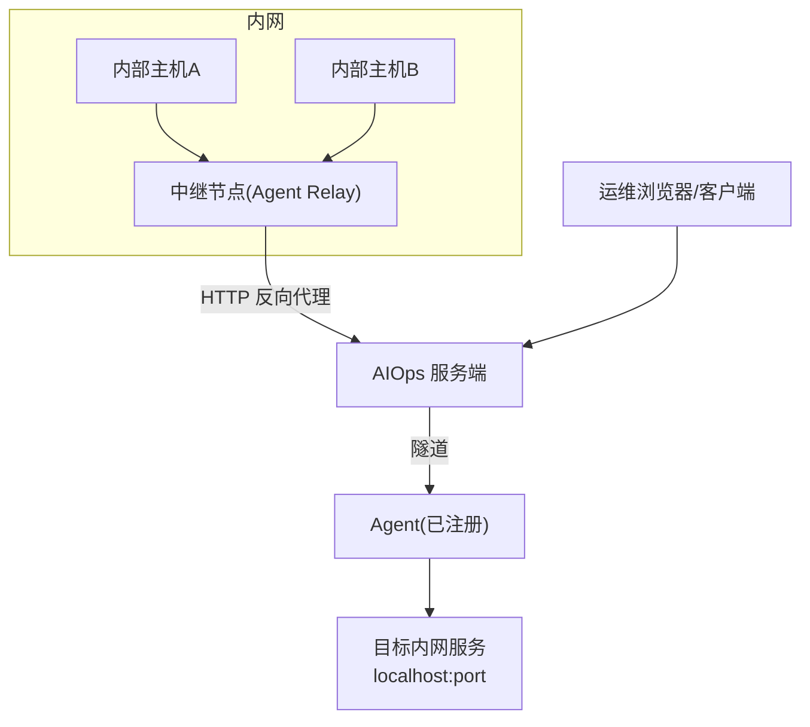
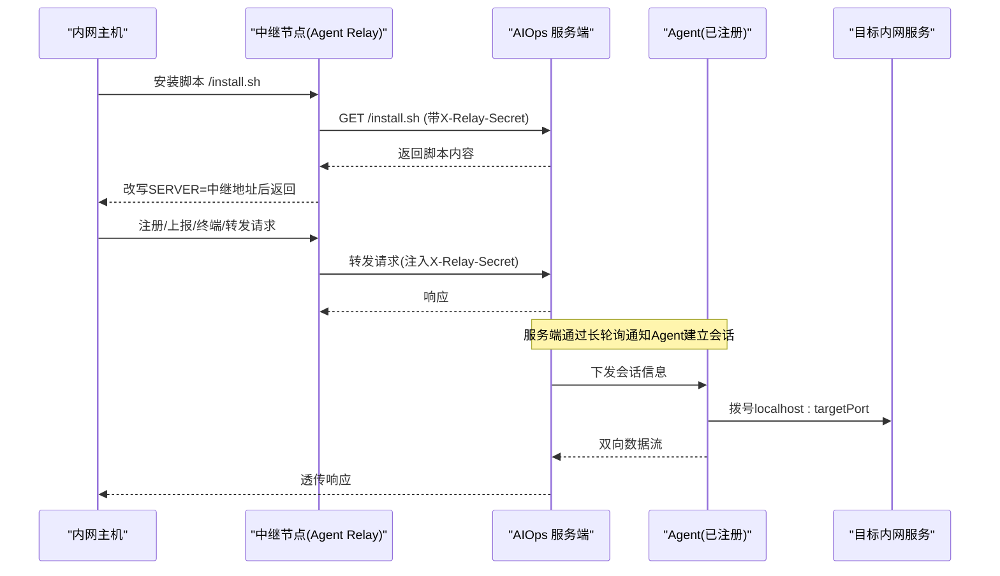
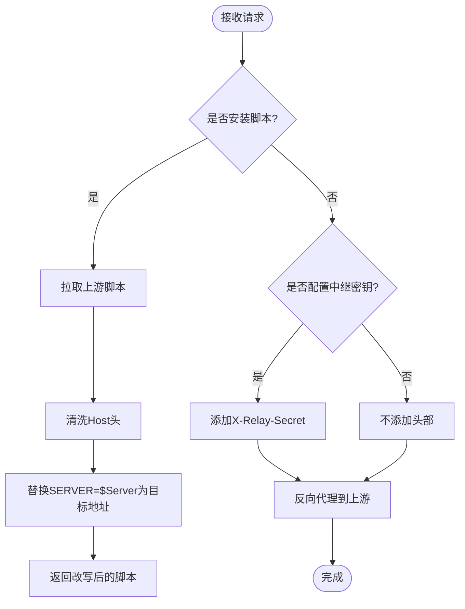
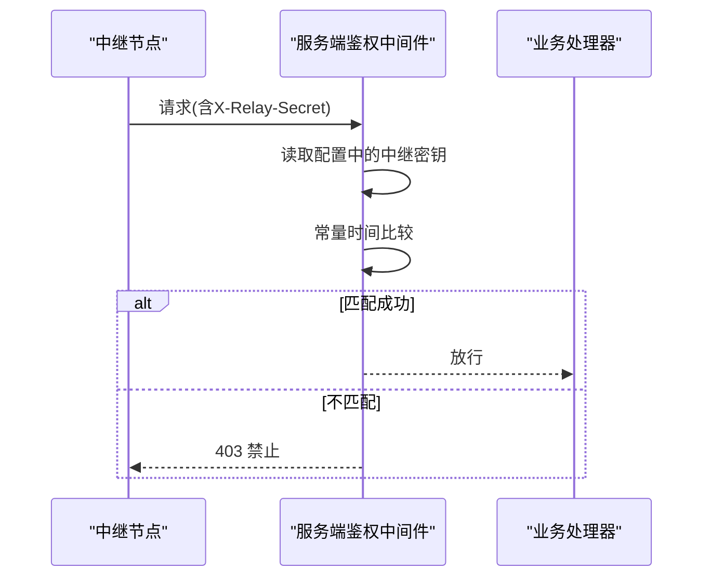
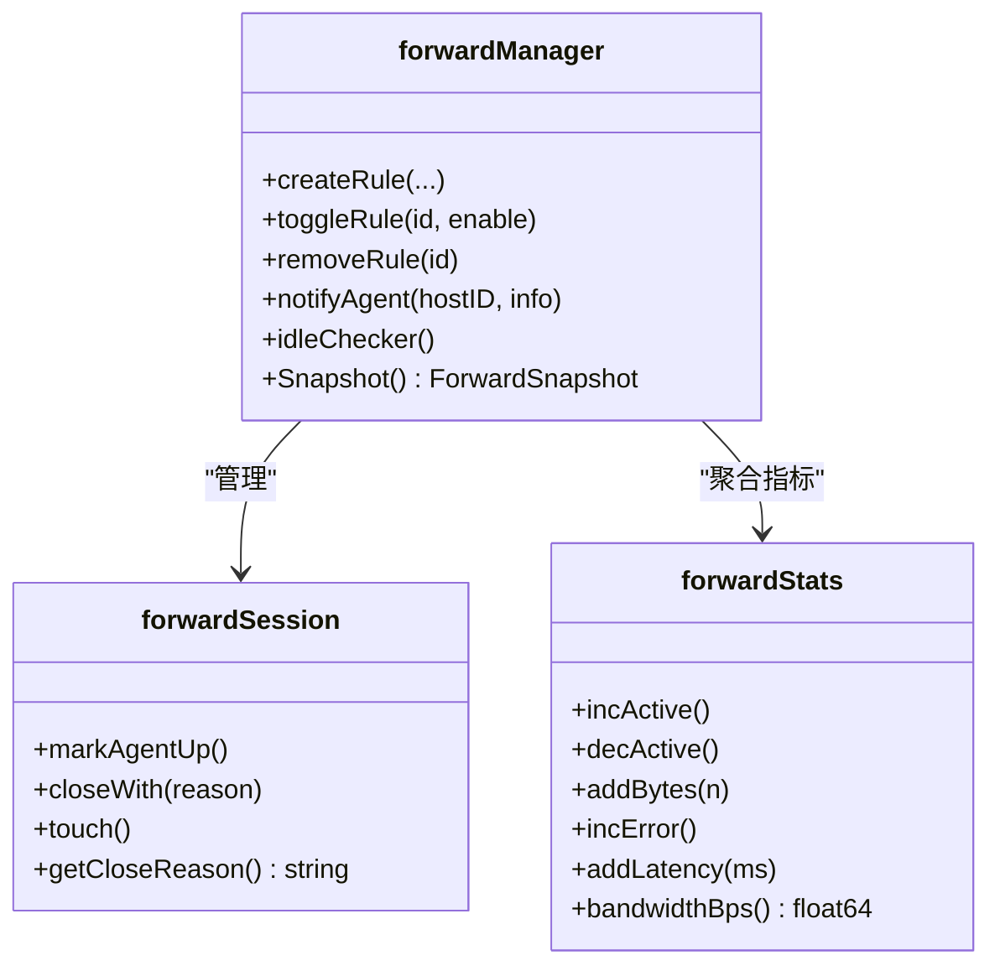
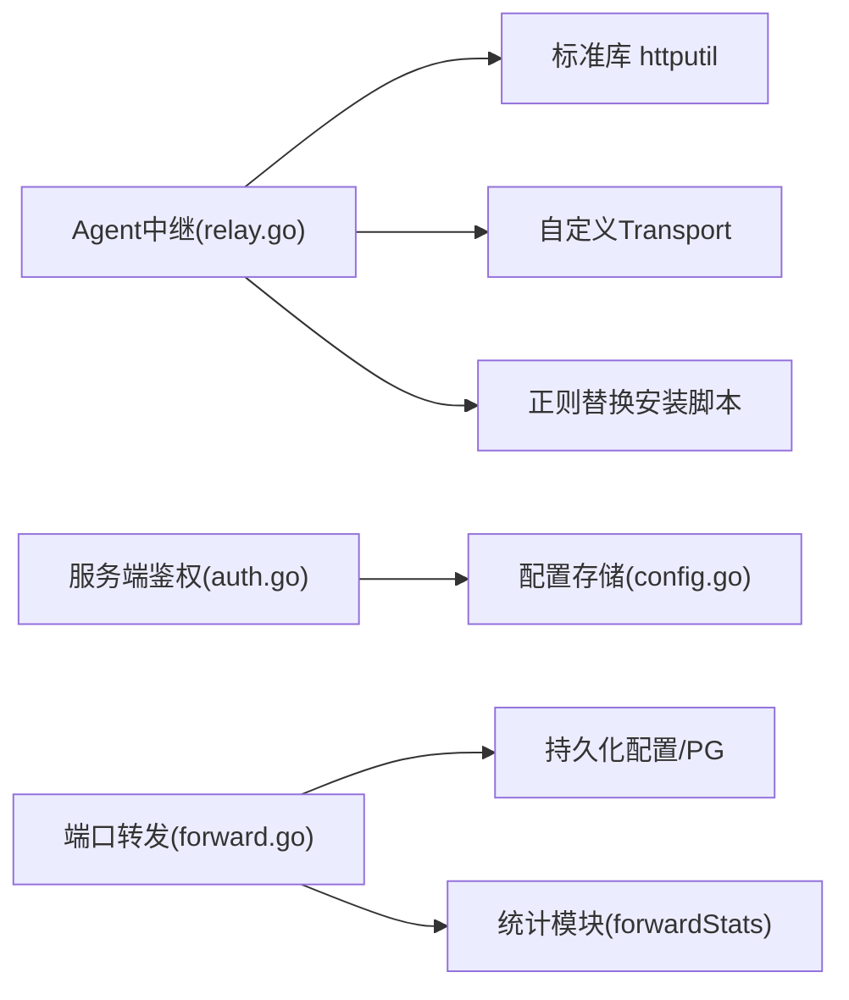

# 中继网关模式

<cite>
**本文引用的文件列表**
- [cmd/agent/relay.go](file://cmd/agent/relay.go)
- [cmd/server/auth.go](file://cmd/server/auth.go)
- [cmd/server/config.go](file://cmd/server/config.go)
- [cmd/server/forward.go](file://cmd/server/forward.go)
- [cmd/server/forward_api.go](file://cmd/server/forward_api.go)
- [FORWARD_GUIDE.md](file://FORWARD_GUIDE.md)
- [DEPLOY_GUIDE.md](file://DEPLOY_GUIDE.md)
- [README.md](file://README.md)
- [server_config.example.json](file://server_config.example.json)
</cite>

## 目录
1. [简介](#简介)
2. [项目结构](#项目结构)
3. [核心组件](#核心组件)
4. [架构总览](#架构总览)
5. [详细组件分析](#详细组件分析)
6. [依赖关系分析](#依赖关系分析)
7. [性能与连接池](#性能与连接池)
8. [安全与密钥管理](#安全与密钥管理)
9. [部署拓扑与配置选项](#部署拓扑与配置选项)
10. [故障转移与高可用](#故障转移与高可用)
11. [企业级部署示例与网络规划](#企业级部署示例与网络规划)
12. [排障指南](#排障指南)
13. [结论](#结论)

## 简介
本文件面向 AIOps Monitor 的“中继网关模式”，系统性阐述反向代理机制、请求转发逻辑、认证验证、负载均衡支持，以及内网穿透场景、安全密钥管理、连接池管理与性能监控。文档同时提供中继模式部署拓扑、关键配置项、故障转移策略与企业级部署建议和网络规划要点。

## 项目结构
与中继网关模式直接相关的代码位于 Agent 与服务端两个模块：
- Agent 侧：以“中继模式”运行，监听本地端口，将请求反向代理到上游云端服务器，并注入共享密钥头；对安装脚本进行地址重写，使内网机器自动通过中继接入。
- Server 侧：校验中继共享密钥（可选），并提供端口转发与 HTTP 反向代理能力，用于从服务端访问被控主机内网服务。

图示来源
- [cmd/agent/relay.go:31-89](file://cmd/agent/relay.go#L31-L89)
- [cmd/server/auth.go:113-172](file://cmd/server/auth.go#L113-L172)
- [cmd/server/forward.go:23-41](file://cmd/server/forward.go#L23-L41)

章节来源
- [cmd/agent/relay.go:17-89](file://cmd/agent/relay.go#L17-L89)
- [cmd/server/auth.go:113-172](file://cmd/server/auth.go#L113-L172)
- [cmd/server/forward.go:23-41](file://cmd/server/forward.go#L23-L41)

## 核心组件
- 中继反向代理（Agent 侧）
  - 监听本地端口，使用单主机反向代理将请求转发至上游服务端。
  - 拦截安装脚本，动态改写 SERVER 地址为自身地址，实现零配置接入。
  - 可选注入 X-Relay-Secret 头，供服务端校验中继身份。
- 服务端中继鉴权（Server 侧）
  - 当配置了中继共享密钥时，校验所有携带该头的请求是否匹配。
  - 未携带头的直连请求仍允许（非中继路径）。
- 端口转发与 HTTP 反向代理（Server 侧）
  - TCP 端口映射：在本地监听端口，经 Agent 隧道转发到目标主机 localhost:targetPort。
  - HTTP 反向代理：/proxy/{hostID}/{port}/... 无状态代理，支持 WebSocket。

章节来源
- [cmd/agent/relay.go:31-89](file://cmd/agent/relay.go#L31-L89)
- [cmd/server/auth.go:113-172](file://cmd/server/auth.go#L113-L172)
- [cmd/server/forward.go:23-41](file://cmd/server/forward.go#L23-L41)
- [FORWARD_GUIDE.md:1-223](file://FORWARD_GUIDE.md#L1-L223)

## 架构总览
中继网关模式的核心流程如下：
- 内网主机无需直连云端，仅中继节点具备外网访问能力。
- 中继节点作为反向代理，统一承载 Agent 注册、上报、终端与转发通道等流量。
- 服务端对来自中继的请求进行共享密钥校验，防止非法中继接入。
- 运维人员通过服务端提供的端口转发或 HTTP 代理，访问被控主机内网服务。

图示来源
- [cmd/agent/relay.go:45-57](file://cmd/agent/relay.go#L45-L57)
- [cmd/server/auth.go:113-172](file://cmd/server/auth.go#L113-L172)
- [cmd/server/forward.go:500-526](file://cmd/server/forward.go#L500-L526)

## 详细组件分析

### 中继反向代理（Agent 侧）
- 功能要点
  - 基于单主机反向代理，设置较短 FlushInterval 提升终端/长轮询实时性。
  - 自定义 Transport，提高空闲连接复用率，降低大量并发 Agent 带来的 TCP 抖动。
  - 拦截安装脚本，正则替换 SERVER/$Server 赋值行为，将目标指向中继自身地址。
  - 可选注入 X-Relay-Secret 头，配合服务端校验。
- 安全加固
  - 对 Host 头做白名单过滤，避免命令注入风险。
  - 限制安装脚本最大读取大小，防止异常大响应导致内存压力。
- 性能优化
  - 提高 MaxIdleConnsPerHost，减少握手开销。
  - 启用 HTTP/2 尝试，提升吞吐。

图示来源
- [cmd/agent/relay.go:45-89](file://cmd/agent/relay.go#L45-L89)
- [cmd/agent/relay.go:136-189](file://cmd/agent/relay.go#L136-L189)
- [cmd/agent/relay.go:91-103](file://cmd/agent/relay.go#L91-L103)

章节来源
- [cmd/agent/relay.go:31-89](file://cmd/agent/relay.go#L31-L89)
- [cmd/agent/relay.go:91-103](file://cmd/agent/relay.go#L91-L103)
- [cmd/agent/relay.go:136-189](file://cmd/agent/relay.go#L136-L189)

### 服务端中继鉴权
- 功能要点
  - 若配置了中继共享密钥，则对所有携带 X-Relay-Secret 的请求进行常量时间比较校验。
  - 未携带该头的请求视为直连，不受中继鉴权影响。
  - 校验失败记录系统日志并拒绝请求。
- 集成点
  - 鉴权中间件在路由放行前执行，覆盖所有非公开路径。
  - 与 RBAC、MFA、登录限流等共同构成多层防护。

图示来源
- [cmd/server/auth.go:113-172](file://cmd/server/auth.go#L113-L172)
- [cmd/server/config.go:790-796](file://cmd/server/config.go#L790-L796)

章节来源
- [cmd/server/auth.go:113-172](file://cmd/server/auth.go#L113-L172)
- [cmd/server/config.go:790-796](file://cmd/server/config.go#L790-L796)

### 端口转发与 HTTP 反向代理（服务端）
- TCP 端口映射
  - 创建规则后在服务端本地监听端口，经 Agent 隧道转发到目标主机 localhost:targetPort。
  - 支持 UDP 协议；支持组操作（批量启停、复制、编辑）。
- HTTP 反向代理
  - 无状态代理 /proxy/{hostID}/{port}/...，支持所有 HTTP 方法与 WebSocket。
  - 自动添加转发头，过滤 hop-by-hop 头。
- 会话与统计
  - 会话生命周期管理、空闲超时清理、带宽滑动窗口统计、平均延迟采样。
  - 健康检查接口暴露最大会话数、最大请求体等参数。

图示来源
- [cmd/server/forward.go:234-258](file://cmd/server/forward.go#L234-L258)
- [cmd/server/forward.go:137-183](file://cmd/server/forward.go#L137-L183)
- [cmd/server/forward.go:56-135](file://cmd/server/forward.go#L56-L135)

章节来源
- [cmd/server/forward.go:23-41](file://cmd/server/forward.go#L23-L41)
- [cmd/server/forward.go:234-258](file://cmd/server/forward.go#L234-L258)
- [cmd/server/forward.go:500-526](file://cmd/server/forward.go#L500-L526)
- [cmd/server/forward_api.go:88-98](file://cmd/server/forward_api.go#L88-98)
- [FORWARD_GUIDE.md:1-223](file://FORWARD_GUIDE.md#L1-L223)

## 依赖关系分析
- Agent 中继依赖
  - 标准库 net/http/httputil 实现单主机反向代理。
  - 自定义 http.Transport 控制连接池与超时。
  - 正则表达式处理安装脚本中 SERVER 赋值行。
- 服务端依赖
  - 鉴权中间件依赖配置存储获取中继密钥。
  - 端口转发依赖持久化配置与数据库（PostgreSQL）保存规则。
  - 统计模块使用原子变量与滑动窗口计算带宽与延迟。

图示来源
- [cmd/agent/relay.go:37-43](file://cmd/agent/relay.go#L37-L43)
- [cmd/agent/relay.go:91-103](file://cmd/agent/relay.go#L91-L103)
- [cmd/agent/relay.go:109-116](file://cmd/agent/relay.go#L109-L116)
- [cmd/server/auth.go:113-172](file://cmd/server/auth.go#L113-L172)
- [cmd/server/config.go:790-796](file://cmd/server/config.go#L790-L796)
- [cmd/server/forward.go:56-135](file://cmd/server/forward.go#L56-L135)

章节来源
- [cmd/agent/relay.go:37-43](file://cmd/agent/relay.go#L37-L43)
- [cmd/server/auth.go:113-172](file://cmd/server/auth.go#L113-L172)
- [cmd/server/forward.go:56-135](file://cmd/server/forward.go#L56-L135)

## 性能与连接池
- 中继节点连接池
  - MaxIdleConnsPerHost 提升至 50，MaxIdleConns 提升至 100，显著降低多 Agent 并发时的 TCP 握手抖动。
  - IdleConnTimeout 设置为 90s，Dialer KeepAlive 30s，有助于保持活跃连接。
  - 强制尝试 HTTP/2，提升吞吐与多路复用能力。
- 服务端转发性能
  - 会话上限 maxForwardSessions 默认 300，避免资源耗尽。
  - 最大请求体限制 100MB，防止 OOM。
  - 带宽滑动窗口（最近 60 秒）与平均延迟采样，便于观测与告警。
- 超时与缓冲
  - 服务端转发读超时 30s，TCP KeepAlive 60s。
  - 安装脚本拉取使用短超时客户端（15s），限制最大读取大小（256KB）。

章节来源
- [cmd/agent/relay.go:91-103](file://cmd/agent/relay.go#L91-L103)
- [cmd/server/forward.go:34-41](file://cmd/server/forward.go#L34-L41)
- [cmd/server/forward.go:56-135](file://cmd/server/forward.go#L56-L135)
- [cmd/agent/relay.go:105-116](file://cmd/agent/relay.go#L105-L116)

## 安全与密钥管理
- 中继共享密钥
  - Agent 中继可注入 X-Relay-Secret 头；服务端若配置 relay_secret，则必须匹配才能放行。
  - 未配置中继密钥时，中继仍为开放反向代理，需结合网络隔离与 TLS 终止保障安全。
- 安装脚本安全
  - Host 头白名单过滤，避免命令注入。
  - 安装脚本大小限制，防止异常响应。
- 其他安全特性
  - 登录限流、RBAC、MFA、全局 MFA 策略。
  - 信任代理开关 trust_proxy，仅在可信反向代理后开启。
  - 环境变量覆盖敏感配置（如 AIOPS_RELAY_SECRET、AIOPS_FORWARD_LISTEN）。

章节来源
- [cmd/server/auth.go:113-172](file://cmd/server/auth.go#L113-L172)
- [cmd/server/config.go:467-478](file://cmd/server/config.go#L467-478)
- [cmd/server/config.go:619-654](file://cmd/server/config.go#L619-L654)
- [cmd/agent/relay.go:123-134](file://cmd/agent/relay.go#L123-L134)
- [cmd/agent/relay.go:136-189](file://cmd/agent/relay.go#L136-L189)

## 部署拓扑与配置选项
- 典型拓扑
  - 单一中继节点集中代理内网 Agent 流量，仅该节点具备互联网访问能力。
  - 服务端可通过端口转发或 HTTP 代理访问被控主机内网服务。
- 关键配置项
  - 中继共享密钥：AIOPS_RELAY_SECRET 或 server_config.json 的 relay_secret。
  - 转发监听地址：AIOPS_FORWARD_LISTEN（Docker 部署常设为 0.0.0.0）。
  - 转发端口范围：AIOPS_FORWARD_PORT_RANGE（默认 10100-10300）。
  - 是否禁用转发/终端：AIOPS_FORWARD_DISABLED、AIOPS_TERMINAL_DISABLED。
  - 信任代理：AIOPS_TRUST_PROXY（仅在可信反向代理后开启）。
  - 强制 Token：AIOPS_REQUIRE_TOKEN。
- 配置文件参考
  - server_config.example.json 包含基础字段，生产环境建议结合环境变量覆盖敏感项。

章节来源
- [README.md:556-573](file://README.md#L556-L573)
- [server_config.example.json:1-36](file://server_config.example.json#L1-L36)
- [cmd/server/config.go:713-748](file://cmd/server/config.go#L713-L748)

## 故障转移与高可用
- 中继节点高可用
  - 可在多个中继节点间按区域/机房部署，结合 DNS 或 L4/L7 负载均衡分发流量。
  - 各中继独立注入 X-Relay-Secret，服务端统一校验。
- 服务端高可用
  - 服务端无状态层可与外部负载均衡组合；持久化配置与数据落盘或 PG。
  - 端口转发与会话由服务端进程维护，跨实例需会话亲和或采用无状态代理替代。
- 故障转移策略
  - 客户端侧重试与退避（浏览器/工具自带）。
  - 服务端健康检查接口 /api/v1/forward/health 可用于探针。
  - 安装脚本改写确保内网主机始终指向当前可用的中继地址。

章节来源
- [cmd/server/forward_api.go:295-303](file://cmd/server/forward_api.go#L295-L303)
- [FORWARD_GUIDE.md:168-183](file://FORWARD_GUIDE.md#L168-L183)

## 企业级部署示例与网络规划
- 部署建议
  - 中继节点绑定内网 IP，避免公网暴露；如需公网访问，务必启用 TLS 并在前置反向代理处终止。
  - 使用环境变量注入中继密钥与转发监听地址，避免明文写入配置文件。
  - 严格限制服务端转发监听地址，默认 127.0.0.1，仅在容器或受控网络下改为 0.0.0.0。
- 网络规划
  - 划分 DMZ 与内网区，中继置于 DMZ 或受限子网，仅允许特定源访问。
  - 使用防火墙策略限制中继到上游服务端的出站方向与端口。
  - 对服务端转发端口段进行 ACL 控制，仅允许运维网段访问。
- 容量规划
  - 根据并发 Agent 数量调整中继连接池参数与服务端会话上限。
  - 关注带宽滑动窗口与平均延迟指标，设定阈值告警。

章节来源
- [cmd/server/config.go:713-748](file://cmd/server/config.go#L713-L748)
- [cmd/server/forward.go:34-41](file://cmd/server/forward.go#L34-L41)
- [cmd/server/forward.go:56-135](file://cmd/server/forward.go#L56-L135)

## 排障指南
- 常见问题
  - 中继密钥不匹配：服务端记录警告并返回 403，检查 AIOPS_RELAY_SECRET 与中继启动参数是否一致。
  - 安装脚本无法改写：确认 Host 头合法且未被篡改；检查正则匹配与上游返回内容。
  - 端口转发不可用：检查 forward_listen 与端口范围配置；查看健康检查接口返回。
  - HTTP 代理超时：关注服务端与 Agent 端超时日志，定位上游服务慢响应或网络问题。
- 诊断步骤
  - 查看服务端鉴权中间件日志与系统日志。
  - 使用 /api/v1/forward/stats 与 /api/v1/forward/health 观察会话与带宽指标。
  - 核对环境变量覆盖是否正确生效。

章节来源
- [cmd/server/auth.go:113-172](file://cmd/server/auth.go#L113-L172)
- [cmd/server/forward_api.go:88-98](file://cmd/server/forward_api.go#L88-98)
- [DEPLOY_GUIDE.md:1-107](file://DEPLOY_GUIDE.md#L1-L107)

## 结论
中继网关模式通过“一个出口、统一代理”的方式，有效解决了内网主机无法直连云端的难题。结合中继共享密钥、严格的安装脚本改写与安全头过滤，以及服务端端口转发与 HTTP 代理能力，形成了完整的企业级内网穿透与运维通道方案。在生产环境中，应重视网络隔离、TLS 终止、连接池与性能监控，并通过环境变量覆盖敏感配置，确保系统的安全性与可运维性。