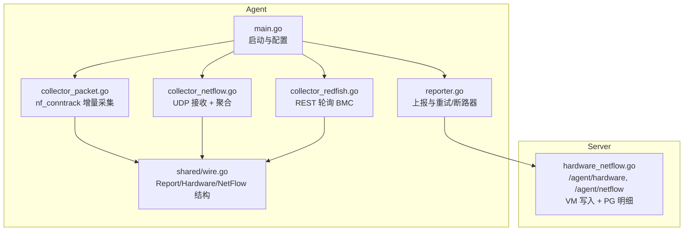
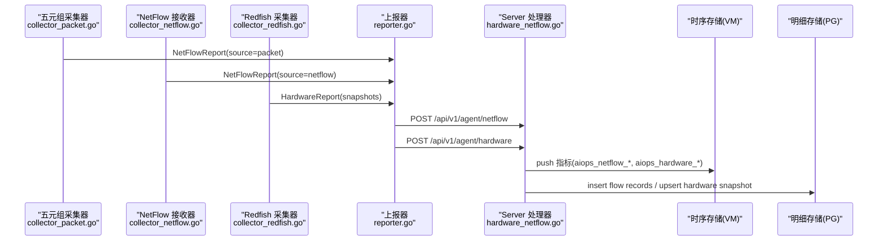
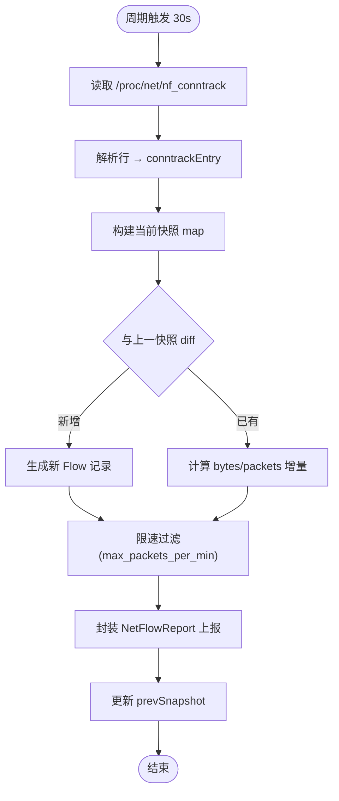
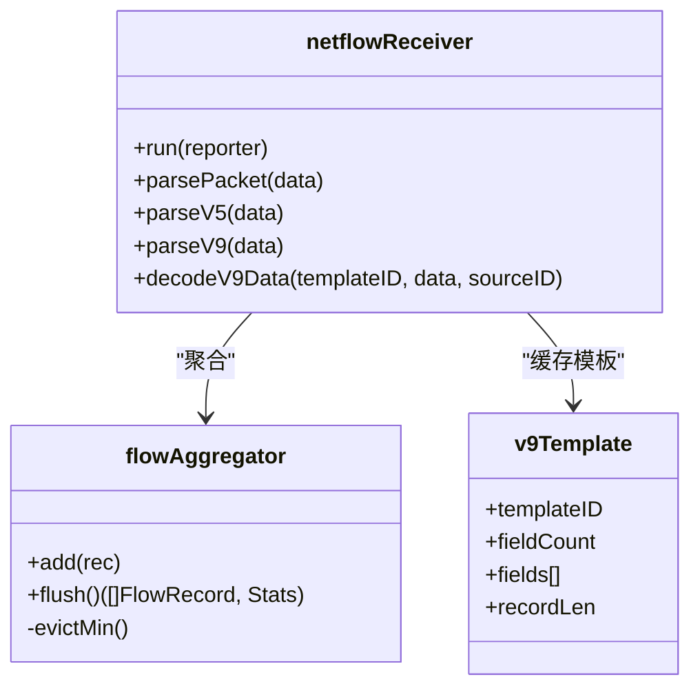
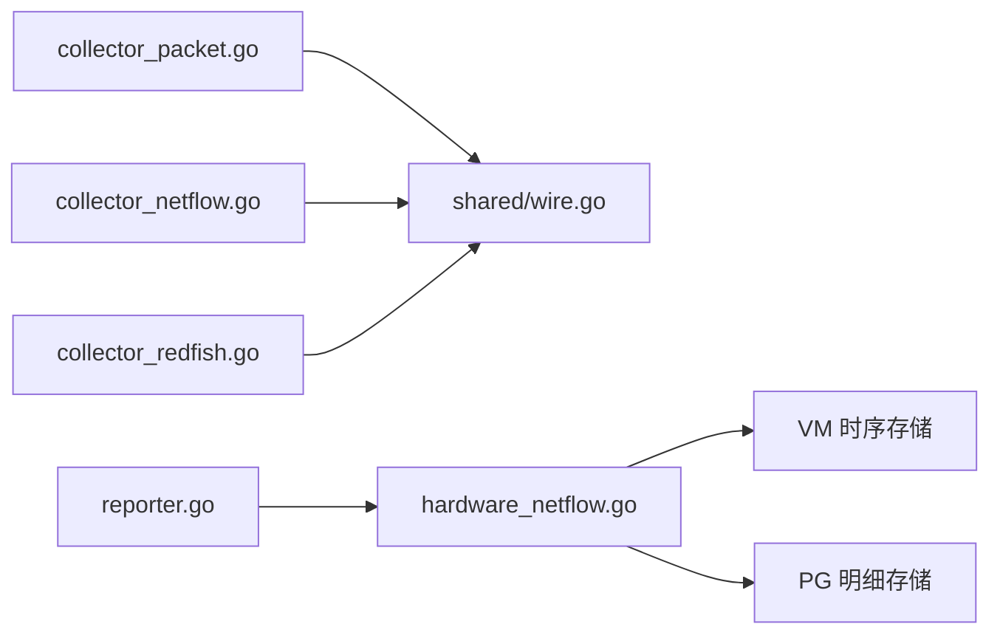

# 五元组包采集器

<cite>
**本文引用的文件列表**
- [cmd/agent/main.go](file://cmd/agent/main.go)
- [cmd/agent/reporter.go](file://cmd/agent/reporter.go)
- [cmd/agent/collector_packet.go](file://cmd/agent/collector_packet.go)
- [cmd/agent/collector_netflow.go](file://cmd/agent/collector_netflow.go)
- [cmd/agent/collector_redfish.go](file://cmd/agent/collector_redfish.go)
- [shared/wire.go](file://shared/wire.go)
- [cmd/server/hardware_netflow.go](file://cmd/server/hardware_netflow.go)
- [config.example.json](file://config.example.json)
</cite>

## 目录
1. [简介](#简介)
2. [项目结构](#项目结构)
3. [核心组件](#核心组件)
4. [架构总览](#架构总览)
5. [详细组件分析](#详细组件分析)
6. [依赖关系分析](#依赖关系分析)
7. [性能与容量规划](#性能与容量规划)
8. [故障排查指南](#故障排查指南)
9. [结论](#结论)
10. [附录：配置项说明](#附录配置项说明)

## 简介
本项目在 Agent 侧实现了三类采集能力：Redfish 硬件状态采集、NetFlow 网络流量接收与聚合、以及基于 Linux nf_conntrack 的五元组包采集。Server 端提供统一的 HTTP 接口接收数据，并将指标写入时序存储（VM）和明细持久化（PG），同时暴露查询 API 供前端展示与分析。

本技术文档聚焦“五元组包采集器”的实现与集成，并给出与 NetFlow、Redfish 的协同工作方式、数据流路径、存储选型与查询方案。

## 项目结构
Agent 与 Server 采用 Go 语言实现，共享数据结构位于 shared 包，确保前后端契约一致。关键文件如下：
- Agent 入口与运行循环：cmd/agent/main.go、cmd/agent/reporter.go
- 采集模块：
  - 五元组包采集：cmd/agent/collector_packet.go
  - NetFlow 接收与聚合：cmd/agent/collector_netflow.go
  - Redfish 硬件采集：cmd/agent/collector_redfish.go
- 共享数据模型：shared/wire.go
- Server 处理与查询：cmd/server/hardware_netflow.go
- 配置示例：config.example.json

图表来源
- [cmd/agent/main.go:1-245](file://cmd/agent/main.go#L1-L245)
- [cmd/agent/reporter.go:1-669](file://cmd/agent/reporter.go#L1-L669)
- [cmd/agent/collector_packet.go:1-284](file://cmd/agent/collector_packet.go#L1-L284)
- [cmd/agent/collector_netflow.go:1-484](file://cmd/agent/collector_netflow.go#L1-L484)
- [cmd/agent/collector_redfish.go:1-429](file://cmd/agent/collector_redfish.go#L1-L429)
- [shared/wire.go:1-279](file://shared/wire.go#L1-L279)
- [cmd/server/hardware_netflow.go:1-364](file://cmd/server/hardware_netflow.go#L1-L364)

章节来源
- [cmd/agent/main.go:1-245](file://cmd/agent/main.go#L1-L245)
- [cmd/agent/reporter.go:1-669](file://cmd/agent/reporter.go#L1-L669)
- [cmd/agent/collector_packet.go:1-284](file://cmd/agent/collector_packet.go#L1-L284)
- [cmd/agent/collector_netflow.go:1-484](file://cmd/agent/collector_netflow.go#L1-L484)
- [cmd/agent/collector_redfish.go:1-429](file://cmd/agent/collector_redfish.go#L1-L429)
- [shared/wire.go:1-279](file://shared/wire.go#L1-L279)
- [cmd/server/hardware_netflow.go:1-364](file://cmd/server/hardware_netflow.go#L1-L364)
- [config.example.json:1-96](file://config.example.json#L1-L96)

## 核心组件
- 五元组包采集器（Linux）：周期性读取 /proc/net/nf_conntrack，解析连接条目，维护上一快照，计算增量 Flow 记录，限速后以 NetFlowReport 上报。
- NetFlow 接收器：监听 UDP，支持 v5/v9，按五元组聚合到时间窗口，定时 flush 为 NetFlowReport 上报。
- Redfish 采集器：按目标独立定时器轮询 BMC REST API，组装 HardwareSnapshot 并通过独立通道上报。
- 上报层：统一使用指纹认证，HTTP/1.1 连接池，带重试、退避与熔断；对硬件与流量分别走不同端点。
- Server 端：/agent/hardware 与 /agent/netflow 接收数据，写入 VM 指标与 PG 明细，并提供查询 API。

章节来源
- [cmd/agent/collector_packet.go:1-284](file://cmd/agent/collector_packet.go#L1-L284)
- [cmd/agent/collector_netflow.go:1-484](file://cmd/agent/collector_netflow.go#L1-L484)
- [cmd/agent/collector_redfish.go:1-429](file://cmd/agent/collector_redfish.go#L1-L429)
- [cmd/agent/reporter.go:1-669](file://cmd/agent/reporter.go#L1-L669)
- [cmd/server/hardware_netflow.go:1-364](file://cmd/server/hardware_netflow.go#L1-L364)

## 架构总览
Agent 侧三类采集器各自独立运行，产出结构化报告通过 reporter 并发上报至 Server。Server 将指标推入 VM，必要时落盘 PG 明细，并提供查询接口。

图表来源
- [cmd/agent/collector_packet.go:59-113](file://cmd/agent/collector_packet.go#L59-L113)
- [cmd/agent/collector_netflow.go:203-263](file://cmd/agent/collector_netflow.go#L203-L263)
- [cmd/agent/collector_redfish.go:56-101](file://cmd/agent/collector_redfish.go#L56-L101)
- [cmd/agent/reporter.go:608-668](file://cmd/agent/reporter.go#L608-L668)
- [cmd/server/hardware_netflow.go:19-90](file://cmd/server/hardware_netflow.go#L19-L90)

## 详细组件分析

### 五元组包采集器（Linux nf_conntrack）
- 运行条件：仅 Linux 平台生效；需启用 packet_capture.enabled=true。
- 数据源：/proc/net/nf_conntrack，每 30s 扫描一次。
- 解析逻辑：逐行解析协议、四元组、状态等字段，构建 conntrackEntry。
- 增量计算：维护 prevSnapshot map，对比当前快照生成增量 FlowRecord（bytes/packets 差值）。
- 限速策略：默认每分钟最多输出 6000 条 Flow（可配置 max_packets_per_min）。
- 上报格式：NetFlowReport，source="packet"，WindowSec=30。

图表来源
- [cmd/agent/collector_packet.go:59-113](file://cmd/agent/collector_packet.go#L59-L113)
- [cmd/agent/collector_packet.go:116-138](file://cmd/agent/collector_packet.go#L116-L138)
- [cmd/agent/collector_packet.go:142-216](file://cmd/agent/collector_packet.go#L142-L216)
- [cmd/agent/collector_packet.go:223-270](file://cmd/agent/collector_packet.go#L223-L270)

章节来源
- [cmd/agent/collector_packet.go:1-284](file://cmd/agent/collector_packet.go#L1-L284)

### NetFlow 接收器（v5/v9）
- 监听地址：默认 :2055，支持多协议版本。
- 解析流程：
  - v5：固定头+48字节记录，直接提取五元组、TCP Flags、AS、接口号等。
  - v9：模板流式，先缓存 Template，再解码 Data FlowSet。
- 聚合窗口：默认 300s，按五元组 key 合并 bytes/packets/TCP flags 等。
- 内存上限：最大 flows 数（默认 100k），超限时淘汰最小流量 entry。
- 上报：flush 时生成 NetFlowReport，source="netflow"。

图表来源
- [cmd/agent/collector_netflow.go:168-263](file://cmd/agent/collector_netflow.go#L168-L263)
- [cmd/agent/collector_netflow.go:282-340](file://cmd/agent/collector_netflow.go#L282-L340)
- [cmd/agent/collector_netflow.go:342-464](file://cmd/agent/collector_netflow.go#L342-L464)
- [cmd/agent/collector_netflow.go:55-165](file://cmd/agent/collector_netflow.go#L55-L165)

章节来源
- [cmd/agent/collector_netflow.go:1-484](file://cmd/agent/collector_netflow.go#L1-L484)

### Redfish 硬件采集器
- 目标管理：每个 target 独立 goroutine + 定时器，间隔可配（最低 30s）。
- 采集范围：System/Processors/Memory/Storage/Thermal/Power/Firmware 等。
- 安全：支持 BasicAuth、TLS1.2、可选跳过证书校验；密码从环境变量注入不落盘。
- 上报：HardwareReport，包含多个 HardwareSnapshot。

章节来源
- [cmd/agent/collector_redfish.go:1-429](file://cmd/agent/collector_redfish.go#L1-L429)

### 上报与可靠性
- 指纹认证：所有上报携带 X-Agent-Fingerprint，服务端校验 host→fp 绑定。
- 传输优化：HTTP/1.1 连接复用，禁用 HTTP/2 提升重启恢复速度；小负载不压缩，大负载 gzip。
- 重试与降级：单周期内最多 3 次重试；遇 400 且 gzip 则禁用压缩并重试；403 自动重新注册。
- 熔断器：连续失败达到阈值打开断路器，冷却期后半开试探，避免雪崩。
- 多后端：同一份采集结果广播到多个 server，互不影响。

章节来源
- [cmd/agent/reporter.go:1-669](file://cmd/agent/reporter.go#L1-L669)

### Server 端处理与查询
- 接收端点：
  - /api/v1/agent/hardware：接收 HardwareReport，upsert 快照，写 VM 指标，健康异常写事件。
  - /api/v1/agent/netflow：接收 NetFlowReport，写 VM 指标，可选写入 PG 明细。
- 查询端点：
  - /api/v1/hardware/history：按 metric 拉取历史（temperature/power/fan_rpm/health_score）。
  - /api/v1/netflow/summary：按维度 top-N 汇总。
  - /api/v1/netflow/flows：PG 明细查询（支持 limit/filter）。
  - /api/v1/netflow/packets：packet 来源的包统计时序。

章节来源
- [cmd/server/hardware_netflow.go:1-364](file://cmd/server/hardware_netflow.go#L1-L364)

## 依赖关系分析
- 数据结构契约：Agent 与 Server 共用 shared/wire.go 中的 Report、HardwareReport、NetFlowReport、FlowRecord 等类型，保证前后端一致性。
- 运行时耦合：
  - collector_packet.go 依赖 Linux /proc 文件系统。
  - collector_netflow.go 依赖 UDP 端口与交换机/防火墙推送。
  - collector_redfish.go 依赖 BMC REST API。
  - reporter.go 依赖 HTTP 客户端与 TLS 配置。
  - server 处理器依赖 VM 与 PG 存储。

图表来源
- [shared/wire.go:140-279](file://shared/wire.go#L140-L279)
- [cmd/agent/collector_packet.go:1-284](file://cmd/agent/collector_packet.go#L1-L284)
- [cmd/agent/collector_netflow.go:1-484](file://cmd/agent/collector_netflow.go#L1-L484)
- [cmd/agent/collector_redfish.go:1-429](file://cmd/agent/collector_redfish.go#L1-L429)
- [cmd/agent/reporter.go:608-668](file://cmd/agent/reporter.go#L608-L668)
- [cmd/server/hardware_netflow.go:19-90](file://cmd/server/hardware_netflow.go#L19-L90)

章节来源
- [shared/wire.go:1-279](file://shared/wire.go#L1-L279)
- [cmd/server/hardware_netflow.go:1-364](file://cmd/server/hardware_netflow.go#L1-L364)

## 性能与容量规划
- 五元组采集器
  - 采样频率：30s 一次，适合中低流量主机；高流量场景建议结合 BPF/eBPF 或内核旁路方案。
  - 限速：max_packets_per_min 控制输出规模，避免上游拥塞。
  - I/O：/proc 文件较大时需关注 Scanner Buffer 大小与 CPU 开销。
- NetFlow 接收器
  - 聚合窗口：window_sec 越大聚合越粗但吞吐更高；过小会导致频繁 flush 与上报压力。
  - 内存上限：maxFlows 控制内存占用，超限会淘汰低流量流，注意业务容忍度。
  - UDP 缓冲：buffer_size 根据峰值流量调整，避免丢包。
- 上报链路
  - 连接池与超时：MaxIdleConnsPerHost、Timeout 影响并发与稳定性。
  - 压缩与带宽：gzip 阈值与代理兼容性；遇到 400 自动降级。
  - 熔断与重试：保护后端，避免雪崩。
- Server 存储
  - VM 指标：aiops_netflow_bytes/packets/dropped 等，按标签维度聚合查询。
  - PG 明细：insertFlowRecords 用于明细检索与导出，需评估表大小与索引策略。

[本节为通用指导，无需具体文件引用]

## 故障排查指南
- 五元组采集器无法工作
  - 现象：日志提示仅支持 Linux 或未启用。
  - 检查：操作系统是否为 Linux；packet_capture.enabled 是否 true；/proc/net/nf_conntrack 是否可读。
  - 参考路径：[collector_packet.go:59-67](file://cmd/agent/collector_packet.go#L59-L67)
- 读取 /proc 失败
  - 现象：读取错误告警。
  - 检查：权限不足或被安全模块拦截；尝试 root 运行或白名单放行。
  - 参考路径：[collector_packet.go:116-138](file://cmd/agent/collector_packet.go#L116-L138)
- NetFlow 无数据
  - 现象：未收到 UDP 报文或聚合为空。
  - 检查：listen 端口是否正确；交换机/防火墙是否推送 v5/v9；buffer_size 是否过小导致丢包。
  - 参考路径：[collector_netflow.go:203-263](file://cmd/agent/collector_netflow.go#L203-L263)
- v9 模板未就绪
  - 现象：Data FlowSet 被忽略。
  - 检查：是否先收到 Template FlowSet；缓存键 sourceID_templateID 是否存在。
  - 参考路径：[collector_netflow.go:375-401](file://cmd/agent/collector_netflow.go#L375-L401)
- 上报被拒或失败
  - 现象：403/400/5xx 或网络错误。
  - 检查：X-Agent-Fingerprint 是否匹配；gzip 是否被代理损坏；重试与熔断状态。
  - 参考路径：[reporter.go:139-253](file://cmd/agent/reporter.go#L139-L253)
- Server 查询无数据
  - 现象：/api/v1/netflow/* 返回空。
  - 检查：VM 是否启用；range 参数是否正确；host 是否匹配。
  - 参考路径：[hardware_netflow.go:160-277](file://cmd/server/hardware_netflow.go#L160-L277)

章节来源
- [cmd/agent/collector_packet.go:59-138](file://cmd/agent/collector_packet.go#L59-L138)
- [cmd/agent/collector_netflow.go:203-401](file://cmd/agent/collector_netflow.go#L203-L401)
- [cmd/agent/reporter.go:139-253](file://cmd/agent/reporter.go#L139-L253)
- [cmd/server/hardware_netflow.go:160-277](file://cmd/server/hardware_netflow.go#L160-L277)

## 结论
五元组包采集器以轻量方式利用 nf_conntrack 实现增量 Flow 采集，配合 NetFlow 接收器与 Redfish 采集器形成完整的 Agent 侧数据采集矩阵。上报层具备高可用特性（重试、降级、熔断），Server 端将指标与明细分层存储，兼顾实时分析与历史追溯。生产部署建议结合业务流量特征调优窗口、限速与缓冲区，并在高流量环境考虑 eBPF 等更高效的采集方案。

[本节为总结性内容，无需具体文件引用]

## 附录：配置项说明
- 基础配置
  - server/servers：单/多服务端上报地址与 Token。
  - report_interval/plugin_interval：基础指标与插件执行周期。
  - disk_path/plugins_dir/python/state_file/category/token：主机标识与插件环境。
- TLS 与安全
  - tls_skip_verify/ca_cert：服务端证书校验策略。
- 中继模式
  - relay/listen/relay_secret：网关转发模式。
- 日志采集
  - log_paths/log_encrypt：日志路径与加密上报开关。
- Redfish 硬件采集
  - redfish_targets[].name/url/username/password_env/skip_tls_verify/interval_sec：BMC 目标与采集频率。
- NetFlow 接收
  - netflow.listen/protocols/buffer_size/window_sec/max_flows_per_sec/active_targets：UDP 监听、协议版本、聚合窗口与限速。
- 五元组包采集
  - packet_capture.enabled/interface/bpf_filter/sample_rate/max_packets_per_min：启停、网卡、BPF 过滤、采样率与限速。

章节来源
- [config.example.json:1-96](file://config.example.json#L1-L96)