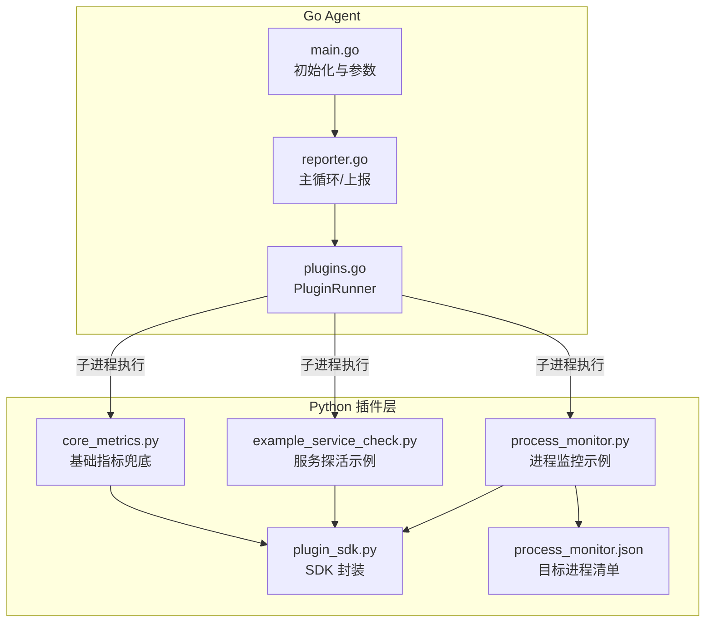
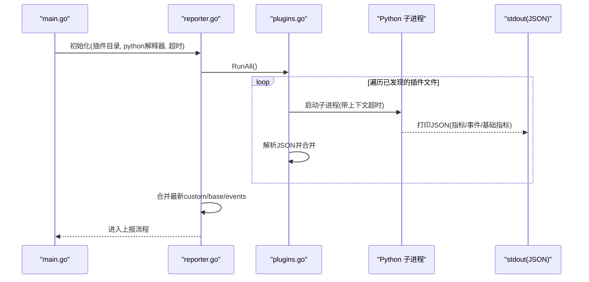
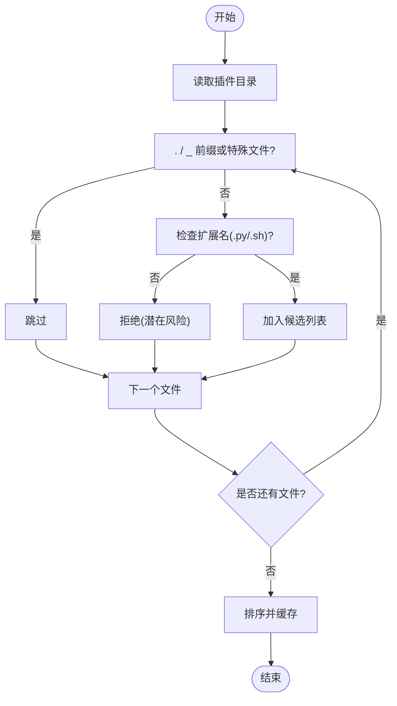
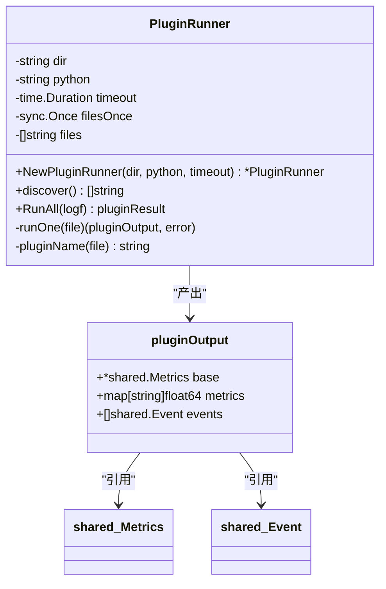
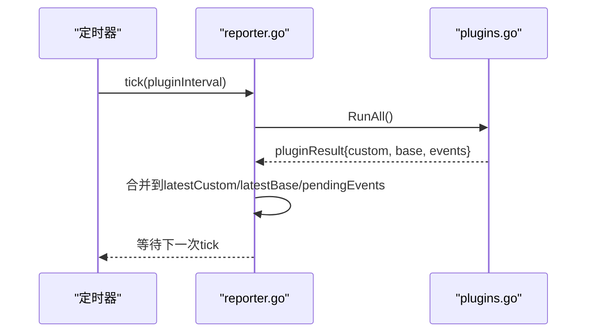
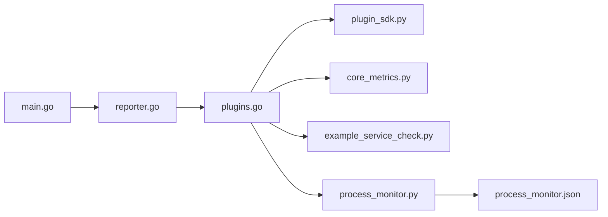

# 插件执行引擎

<cite>
**本文引用的文件**   
- [cmd/agent/plugins.go](file://cmd/agent/plugins.go)
- [cmd/agent/reporter.go](file://cmd/agent/reporter.go)
- [cmd/agent/main.go](file://cmd/agent/main.go)
- [plugins/plugin_sdk.py](file://plugins/plugin_sdk.py)
- [plugins/core_metrics.py](file://plugins/core_metrics.py)
- [plugins/example_service_check.py](file://plugins/example_service_check.py)
- [plugins/process_monitor.py](file://plugins/process_monitor.py)
- [plugins/process_monitor.json](file://plugins/process_monitor.json)
</cite>

## 目录
1. [简介](#简介)
2. [项目结构](#项目结构)
3. [核心组件](#核心组件)
4. [架构总览](#架构总览)
5. [详细组件分析](#详细组件分析)
6. [依赖关系分析](#依赖关系分析)
7. [性能与资源控制](#性能与资源控制)
8. [故障排查指南](#故障排查指南)
9. [结论](#结论)
10. [附录：SDK 参考与示例解析](#附录sdk-参考与示例解析)

## 简介
本文件面向 AIOps Monitor 的 Python 插件执行引擎，系统性阐述以下主题：
- 插件发现机制与安全白名单策略
- Python 进程隔离执行、超时控制与并发限制
- SDK 接口规范与数据交换协议（stdout JSON）
- 插件生命周期管理、错误恢复与事件合并
- 插件开发指南、调试方法与最佳实践
- 完整 SDK 参考、示例插件解析与常见问题解决方案

## 项目结构
与插件执行引擎直接相关的代码与脚本分布如下：
- Go Agent 侧
  - 插件运行器与调度：cmd/agent/plugins.go
  - 主循环与上报编排：cmd/agent/reporter.go
  - 启动入口与配置注入：cmd/agent/main.go
- Python 插件层
  - SDK 封装：plugins/plugin_sdk.py
  - 示例与兜底采集：plugins/core_metrics.py、plugins/example_service_check.py、plugins/process_monitor.py
  - 插件配置：plugins/process_monitor.json

图表来源
- [cmd/agent/main.go:74-140](file://cmd/agent/main.go#L74-L140)
- [cmd/agent/reporter.go:405-439](file://cmd/agent/reporter.go#L405-L439)
- [cmd/agent/plugins.go:45-178](file://cmd/agent/plugins.go#L45-L178)
- [plugins/plugin_sdk.py:27-58](file://plugins/plugin_sdk.py#L27-L58)
- [plugins/core_metrics.py:1-65](file://plugins/core_metrics.py#L1-L65)
- [plugins/example_service_check.py:1-42](file://plugins/example_service_check.py#L1-L42)
- [plugins/process_monitor.py:1-86](file://plugins/process_monitor.py#L1-L86)
- [plugins/process_monitor.json:1-6](file://plugins/process_monitor.json#L1-L6)

章节来源
- [cmd/agent/main.go:74-140](file://cmd/agent/main.go#L74-L140)
- [cmd/agent/reporter.go:405-439](file://cmd/agent/reporter.go#L405-L439)
- [cmd/agent/plugins.go:45-178](file://cmd/agent/plugins.go#L45-L178)

## 核心组件
- PluginRunner（插件运行器）
  - 职责：扫描插件目录、过滤安全白名单、并发执行插件、合并输出。
  - 关键特性：
    - 首次发现缓存，避免重复 IO。
    - 并发上限为 4，防止大量 Python 进程同时创建导致系统抖动。
    - 每个插件独立 goroutine + context 超时，崩溃/挂起不影响核心。
    - 对非 .py 可执行文件也支持，但默认仅允许 .py/.sh 扩展名。
- Agent 主循环（reporter.go）
  - 职责：定时触发插件执行、合并自定义指标与事件、上报到服务端。
  - 关键特性：
    - 插件循环与上报循环分离，插件周期可独立配置。
    - 插件 panic 被 recover 保护并自动重启插件循环。
    - 事件在全部目标失败时重排队，保证至少一次投递语义。
- Python SDK（plugin_sdk.py）
  - 职责：提供简洁 API 收集指标与事件，并以约定 JSON 格式输出到 stdout。
  - 约定字段：metrics、events、base（可选）。

章节来源
- [cmd/agent/plugins.go:45-178](file://cmd/agent/plugins.go#L45-L178)
- [cmd/agent/reporter.go:405-439](file://cmd/agent/reporter.go#L405-L439)
- [plugins/plugin_sdk.py:27-58](file://plugins/plugin_sdk.py#L27-L58)

## 架构总览
插件执行引擎采用“Go 核心 + Python 插件”的混合架构：
- Go 负责高可靠调度、进程隔离、超时控制、结果聚合与上报。
- Python 插件通过标准输出以 JSON 协议返回指标与事件，实现跨语言、跨平台能力扩展。

图表来源
- [cmd/agent/main.go:139-140](file://cmd/agent/main.go#L139-L140)
- [cmd/agent/reporter.go:405-439](file://cmd/agent/reporter.go#L405-L439)
- [cmd/agent/plugins.go:104-172](file://cmd/agent/plugins.go#L104-L172)

## 详细组件分析

### 插件发现与安全白名单
- 发现逻辑
  - 读取插件目录，跳过隐藏文件、下划线前缀文件、SDK 与 requirements.txt。
  - 使用扩展名白名单：仅允许 .py 与 .sh；拒绝无扩展名及潜在危险扩展。
  - 结果排序后缓存，避免运行时频繁扫描。
- 安全考量
  - 禁止无扩展名文件，降低误将二进制当作脚本执行的风险。
  - 建议插件目录权限收紧（如 0700），配合部署流程确保不可写。

图表来源
- [cmd/agent/plugins.go:62-100](file://cmd/agent/plugins.go#L62-L100)

章节来源
- [cmd/agent/plugins.go:62-100](file://cmd/agent/plugins.go#L62-L100)

### 插件执行与进程隔离
- 并发控制
  - 使用有界通道作为信号量，限制最大并发插件数为 4。
  - 每个插件一个 goroutine，互不阻塞。
- 超时控制
  - 使用 context.WithTimeout 为每个插件设置超时（由构造参数传入，默认 15s）。
  - 超时或崩溃不会传播至核心，仅记录日志并跳过该插件。
- 输出解析
  - 读取 stdout，trim 空白后尝试 JSON 反序列化。
  - 空输出视为无结果，不报错。

图表来源
- [cmd/agent/plugins.go:45-178](file://cmd/agent/plugins.go#L45-L178)

章节来源
- [cmd/agent/plugins.go:104-172](file://cmd/agent/plugins.go#L104-L172)

### 插件生命周期与合并策略
- 生命周期
  - 启动时立即执行一次插件（延迟启动优化），之后按配置的插件间隔周期性执行。
  - 插件循环自身被 defer/recover 包裹，panic 后自动重启循环。
- 合并策略
  - custom 指标：同键覆盖，保留最新值。
  - base 基础指标：若原生采集不可用，则使用 core 插件产出的 base 作为兜底。
  - events 事件：追加到 pendingEvents，上报时一并发送；全部目标失败时重排队。

图表来源
- [cmd/agent/reporter.go:405-439](file://cmd/agent/reporter.go#L405-L439)
- [cmd/agent/reporter.go:452-567](file://cmd/agent/reporter.go#L452-L567)

章节来源
- [cmd/agent/reporter.go:405-439](file://cmd/agent/reporter.go#L405-L439)
- [cmd/agent/reporter.go:452-567](file://cmd/agent/reporter.go#L452-L567)

### 数据交换协议（stdout JSON）
- 协议定义
  - 插件向 stdout 输出一个 JSON 对象，包含可选字段：
    - metrics：自定义指标（gauge），键建议带命名空间。
    - events：离散事件数组，level 取 info | warning | critical。
    - base：基础指标（仅非 Linux 兜底时使用）。
- 字段约束
  - Go 端严格 json.Unmarshal，非法 JSON 会被记录并跳过。
  - events.source 为空时，Go 端自动补全为插件名。

章节来源
- [plugins/plugin_sdk.py:1-22](file://plugins/plugin_sdk.py#L1-L22)
- [cmd/agent/plugins.go:17-27](file://cmd/agent/plugins.go#L17-L27)

### SDK 接口规范
- 类与方法
  - Plugin.metric(name, value)：记录数值型指标。
  - Plugin.event(level, message)：产生一条事件。
  - Plugin.base(**fields)：高级用法，提供基础指标（非 Linux 兜底）。
  - Plugin.emit()：将结果以 JSON 写入 stdout。
- 使用约定
  - 指标键建议自带命名空间，避免冲突。
  - 插件应快速返回，不要长期阻塞。
  - 崩溃/超时不会影响 Agent 核心。

章节来源
- [plugins/plugin_sdk.py:27-58](file://plugins/plugin_sdk.py#L27-L58)

### 示例插件解析
- core_metrics.py
  - 在非 Linux 平台通过 psutil 采集 CPU/内存/磁盘/网络/负载等基础指标，输出 base。
  - 未安装 psutil 时静默退出，不产出任何内容。
- example_service_check.py
  - 基于 socket 探测外部服务可达性与时延，产出 up/latency 指标，不可达时产生 critical 事件。
- process_monitor.py
  - 从同目录 process_monitor.json 读取目标进程名列表，统计匹配进程数量、CPU 与内存占用。
  - 当某目标进程数为 0 时产生 critical 事件。

章节来源
- [plugins/core_metrics.py:1-65](file://plugins/core_metrics.py#L1-L65)
- [plugins/example_service_check.py:1-42](file://plugins/example_service_check.py#L1-L42)
- [plugins/process_monitor.py:1-86](file://plugins/process_monitor.py#L1-L86)
- [plugins/process_monitor.json:1-6](file://plugins/process_monitor.json#L1-L6)

## 依赖关系分析
- 组件耦合
  - main.go 负责加载配置并构造 PluginRunner 与 Agent。
  - reporter.go 驱动插件循环与上报循环，依赖 PluginRunner 产出。
  - plugins.go 依赖 os/exec 启动 Python 子进程，并通过 stdout 与插件通信。
- 外部依赖
  - Python 插件可能依赖第三方库（如 psutil），需确保环境可用。
  - 插件目录中的 requirements.txt 不会被自动安装，需运维侧准备环境。

图表来源
- [cmd/agent/main.go:139-140](file://cmd/agent/main.go#L139-L140)
- [cmd/agent/reporter.go:405-439](file://cmd/agent/reporter.go#L405-L439)
- [cmd/agent/plugins.go:104-172](file://cmd/agent/plugins.go#L104-L172)

章节来源
- [cmd/agent/main.go:139-140](file://cmd/agent/main.go#L139-L140)
- [cmd/agent/reporter.go:405-439](file://cmd/agent/reporter.go#L405-L439)
- [cmd/agent/plugins.go:104-172](file://cmd/agent/plugins.go#L104-L172)

## 性能与资源控制
- 并发限制
  - 插件并发上限为 4，避免一次性拉起过多 Python 进程造成系统抖动。
- 超时控制
  - 单个插件执行超时由构造参数决定（默认 15s），防止长时间挂起。
- 采样延迟叠加
  - 多个插件各自 sleep 采样会导致整体延迟叠加，建议将采样间隔参数化或由 Agent 注入共享时钟以减少叠加。
- 上报稳定性
  - 上报路径具备重试、gzip 降级、断路器与注册态维护，保障在多后端场景下的稳定与快速恢复。

章节来源
- [cmd/agent/plugins.go:116-122](file://cmd/agent/plugins.go#L116-L122)
- [cmd/agent/plugins.go:149-158](file://cmd/agent/plugins.go#L149-L158)
- [cmd/agent/reporter.go:213-253](file://cmd/agent/reporter.go#L213-L253)

## 故障排查指南
- 插件未产出数据
  - 检查插件是否输出合法 JSON；空输出将被忽略。
  - 确认插件目录权限与白名单（仅 .py/.sh）。
  - 查看 Agent 日志中“插件执行失败”的记录。
- 插件超时或卡死
  - 调整 --plugin-interval 与插件内部耗时，确保单次执行远小于超时阈值。
  - 避免在插件中进行长阻塞 I/O，必要时拆分任务或使用异步。
- 事件丢失
  - 仅在所有上报目标均失败时才会重排队事件；检查服务端连通性与鉴权状态。
- 基础指标缺失（非 Linux）
  - 确认 core_metrics.py 所在环境已安装 psutil，且未被安全模块拦截。
- 进程监控无数据
  - 检查 process_monitor.json 是否正确填写目标进程名；注意大小写不敏感子串匹配。

章节来源
- [cmd/agent/plugins.go:149-172](file://cmd/agent/plugins.go#L149-L172)
- [cmd/agent/reporter.go:452-567](file://cmd/agent/reporter.go#L452-L567)
- [plugins/core_metrics.py:18-22](file://plugins/core_metrics.py#L18-L22)
- [plugins/process_monitor.py:28-40](file://plugins/process_monitor.py#L28-L40)

## 结论
AIOps Monitor 的插件执行引擎通过严格的发现白名单、进程隔离、超时与并发控制，以及稳健的合并与上报机制，实现了高可靠的 Python 插件生态。SDK 简化了插件开发，示例覆盖了常见场景。结合本文的开发指南与排障建议，可快速构建高质量的可插拔采集能力。

## 附录：SDK 参考与示例解析

### SDK 参考
- 类：Plugin
  - metric(name, value)：记录自定义指标（数值型）。
  - event(level, message)：产生事件（info | warning | critical）。
  - base(**fields)：提供基础指标（非 Linux 兜底）。
  - emit()：将结果以 JSON 写入 stdout。
- 输出协议
  - metrics：自定义指标映射。
  - events：事件数组，source 可由 Go 端自动填充。
  - base：基础指标字典（可选）。

章节来源
- [plugins/plugin_sdk.py:27-58](file://plugins/plugin_sdk.py#L27-L58)
- [cmd/agent/plugins.go:17-27](file://cmd/agent/plugins.go#L17-L27)

### 示例插件要点
- core_metrics.py
  - 用途：非 Linux 平台的基础指标兜底。
  - 关键点：psutil 可用性检测、两次采样计算速率、loadavg 兼容处理。
- example_service_check.py
  - 用途：外部服务 TCP 探活与延迟度量。
  - 关键点：socket 连接超时、up/latency 指标、不可达事件。
- process_monitor.py
  - 用途：按名称匹配进程并统计资源占用。
  - 关键点：配置文件读取、进程枚举与 CPU 基线采样、缺失进程告警。

章节来源
- [plugins/core_metrics.py:1-65](file://plugins/core_metrics.py#L1-L65)
- [plugins/example_service_check.py:1-42](file://plugins/example_service_check.py#L1-L42)
- [plugins/process_monitor.py:1-86](file://plugins/process_monitor.py#L1-L86)
- [plugins/process_monitor.json:1-6](file://plugins/process_monitor.json#L1-L6)