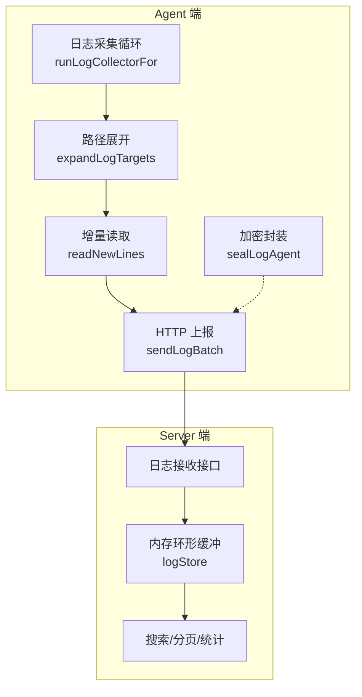
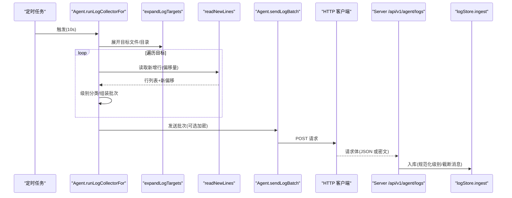
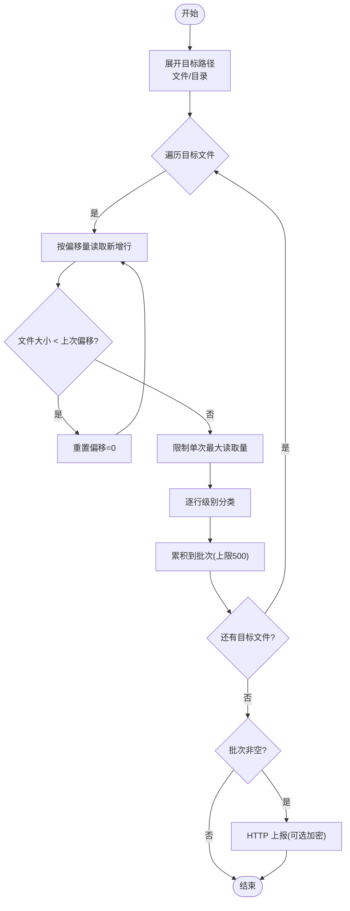
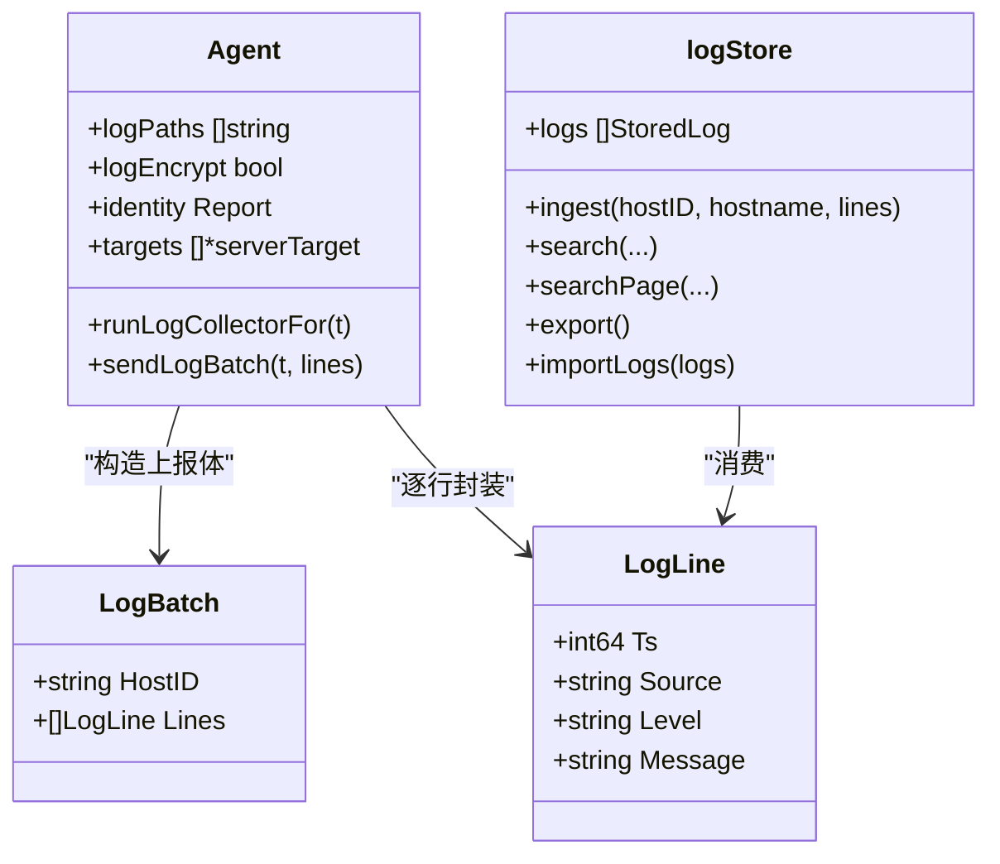

# 日志采集器

<cite>
**本文引用的文件**   
- [cmd/agent/logcollect.go](file://cmd/agent/logcollect.go)
- [cmd/agent/main.go](file://cmd/agent/main.go)
- [cmd/agent/reporter.go](file://cmd/agent/reporter.go)
- [cmd/server/logstore.go](file://cmd/server/logstore.go)
- [shared/wire.go](file://shared/wire.go)
- [config.example.json](file://config.example.json)
</cite>

## 目录
1. [简介](#简介)
2. [项目结构](#项目结构)
3. [核心组件](#核心组件)
4. [架构总览](#架构总览)
5. [详细组件分析](#详细组件分析)
6. [依赖关系分析](#依赖关系分析)
7. [性能考量](#性能考量)
8. [故障排查指南](#故障排查指南)
9. [结论](#结论)
10. [附录：配置与示例](#附录配置与示例)

## 简介
本文件面向 AIOps Monitor 的“日志采集器”子系统，聚焦 Agent 侧增量日志采集、文件监听策略、日志轮转处理、加密传输、路径配置、格式解析、过滤规则、性能优化、错误重试机制、存储策略与清理策略，并提供配置示例与故障排查方法。

## 项目结构
日志采集相关代码主要分布在以下位置：
- Agent 端：负责增量 tail、批量上报、可选加密压缩
- Server 端：接收并缓存日志，提供检索与统计
- 共享协议：定义日志行与批次的数据结构

图表来源
- [cmd/agent/logcollect.go:37-84](file://cmd/agent/logcollect.go#L37-L84)
- [cmd/agent/logcollect.go:86-127](file://cmd/agent/logcollect.go#L86-L127)
- [cmd/agent/logcollect.go:129-167](file://cmd/agent/logcollect.go#L129-L167)
- [cmd/agent/logcollect.go:183-206](file://cmd/agent/logcollect.go#L183-L206)
- [cmd/agent/logcollect.go:208-230](file://cmd/agent/logcollect.go#L208-L230)
- [cmd/server/logstore.go:59-78](file://cmd/server/logstore.go#L59-L78)
- [cmd/server/logstore.go:80-106](file://cmd/server/logstore.go#L80-L106)

章节来源
- [cmd/agent/logcollect.go:37-84](file://cmd/agent/logcollect.go#L37-L84)
- [cmd/server/logstore.go:59-78](file://cmd/server/logstore.go#L59-L78)

## 核心组件
- 增量采集循环：按固定周期扫描目标文件，仅读取新增行，维护偏移量；周期性重新扫描目录以纳入新文件。
- 路径展开与匹配：支持直接文件或目录；目录内自动识别常见日志后缀及轮转文件。
- 增量读取与轮转检测：基于文件大小与偏移量判断是否轮转或截断，必要时从头重读；限制单次最大读取量。
- 级别分类：根据关键字对每行进行 error/warn/info/debug 分级。
- 加密传输：可选 gzip + AES-256-GCM 加密后上传，附带 Content-Type 与自定义头标识。
- 服务端存储：内存环形缓冲，容量上限；支持搜索、分页与统计；可导出最近 N 条用于持久化恢复。

章节来源
- [cmd/agent/logcollect.go:37-84](file://cmd/agent/logcollect.go#L37-L84)
- [cmd/agent/logcollect.go:86-127](file://cmd/agent/logcollect.go#L86-L127)
- [cmd/agent/logcollect.go:129-167](file://cmd/agent/logcollect.go#L129-L167)
- [cmd/agent/logcollect.go:169-181](file://cmd/agent/logcollect.go#L169-L181)
- [cmd/agent/logcollect.go:183-206](file://cmd/agent/logcollect.go#L183-L206)
- [cmd/agent/logcollect.go:208-230](file://cmd/agent/logcollect.go#L208-L230)
- [cmd/server/logstore.go:31-41](file://cmd/server/logstore.go#L31-L41)
- [cmd/server/logstore.go:59-78](file://cmd/server/logstore.go#L59-L78)
- [cmd/server/logstore.go:80-106](file://cmd/server/logstore.go#L80-L106)

## 架构总览
Agent 启动后为每个服务端目标启动一个日志采集协程，周期性执行增量采集与上报；Server 端将日志写入内存环形缓冲，提供检索与统计能力。

图表来源
- [cmd/agent/logcollect.go:37-84](file://cmd/agent/logcollect.go#L37-L84)
- [cmd/agent/logcollect.go:86-127](file://cmd/agent/logcollect.go#L86-L127)
- [cmd/agent/logcollect.go:129-167](file://cmd/agent/logcollect.go#L129-L167)
- [cmd/agent/logcollect.go:208-230](file://cmd/agent/logcollect.go#L208-L230)
- [cmd/server/logstore.go:59-78](file://cmd/server/logstore.go#L59-L78)

## 详细组件分析

### 增量采集流程与文件监听策略
- 启动条件：当存在日志路径且机器指纹有效时启用。
- 目标展开：支持单个文件与目录；目录会扫描其下符合命名规则的日志文件（含轮转文件）。
- 增量读取：维护每个文件的偏移量；若文件变小则视为轮转/截断，重置偏移从头读取；限制单次最多读取约 2MB，避免单周期开销过大。
- 新文件发现：每约 60 秒重新扫描目录，纳入新出现的日志文件。
- 批大小控制：单批次最多保留最近 500 行，超过则丢弃旧行。

图表来源
- [cmd/agent/logcollect.go:37-84](file://cmd/agent/logcollect.go#L37-L84)
- [cmd/agent/logcollect.go:86-127](file://cmd/agent/logcollect.go#L86-L127)
- [cmd/agent/logcollect.go:129-167](file://cmd/agent/logcollect.go#L129-L167)

章节来源
- [cmd/agent/logcollect.go:37-84](file://cmd/agent/logcollect.go#L37-L84)
- [cmd/agent/logcollect.go:86-127](file://cmd/agent/logcollect.go#L86-L127)
- [cmd/agent/logcollect.go:129-167](file://cmd/agent/logcollect.go#L129-L167)

### 日志路径配置与格式解析
- 配置来源：命令行参数 --log-paths（逗号分隔）与配置文件 log_paths 字段均可生效，后者在 main 中加载，前者覆盖。
- 路径语义：支持绝对路径的文件或目录；目录会被展开为具体日志文件。
- 文件名匹配：包含 .log/.out/.err/.txt 后缀，或名称中包含 .log 的轮转文件（如 access.log.1、error.log.2024-01-01）。
- 安全清洗（服务端安装脚本注入时）：对路径做白名单字符过滤与长度限制，防止命令注入。

章节来源
- [cmd/agent/main.go:104-120](file://cmd/agent/main.go#L104-L120)
- [cmd/agent/logcollect.go:86-127](file://cmd/agent/logcollect.go#L86-L127)
- [cmd/server/install.go:26-62](file://cmd/server/install.go#L26-L62)

### 日志轮转与截断处理
- 轮转/截断检测：当文件大小小于上次记录的偏移量时，认为发生轮转或截断，重置偏移量为 0，从文件开头重新读取。
- 大跳跃保护：当新增数据超过阈值（约 2MB），只读取末尾部分，避免单周期 IO 压力过大。

章节来源
- [cmd/agent/logcollect.go:129-167](file://cmd/agent/logcollect.go#L129-L167)

### 日志格式解析与过滤规则
- 级别分类：根据行内容中的关键字（如 ERROR/FATAL/PANIC/CRITICAL/WARN/DEBUG/TRACE 等）推断级别，归一化为 error/warn/info/debug。
- 空白行过滤：忽略纯空白行。
- 服务端规范化：再次对级别进行规范化映射，确保一致。

章节来源
- [cmd/agent/logcollect.go:169-181](file://cmd/agent/logcollect.go#L169-L181)
- [cmd/server/logstore.go:45-57](file://cmd/server/logstore.go#L45-L57)

### 加密传输与安全
- 加密开关：默认开启，可通过 --log-encrypt=false 关闭（调试场景）。
- 加密算法：gzip 压缩后使用 AES-256-GCM 加密，nonce 前置；Content-Type 设置为 application/octet-stream，并通过自定义头 X-Log-Enc 标识加密方式。
- TLS 信任：支持跳过证书校验（不安全）或指定 CA PEM 以信任自签名证书。

章节来源
- [cmd/agent/logcollect.go:183-206](file://cmd/agent/logcollect.go#L183-L206)
- [cmd/agent/logcollect.go:208-230](file://cmd/agent/logcollect.go#L208-L230)
- [cmd/agent/main.go:108-124](file://cmd/agent/main.go#L108-L124)

### 错误重试与健壮性
- 采集层：HTTP 客户端具备超时设置；当前实现未内置显式重试逻辑，失败会在下一个周期继续尝试。
- 上报层：基础指标上报有断路器与指数退避，但日志上报走独立 HTTP 客户端，未复用该机制。
- 进程级健壮性：主循环通过 recover 捕获 panic，保证采集不中断。

章节来源
- [cmd/agent/logcollect.go:35](file://cmd/agent/logcollect.go#L35)
- [cmd/agent/logcollect.go:208-230](file://cmd/agent/logcollect.go#L208-L230)
- [cmd/agent/reporter.go:374-381](file://cmd/agent/reporter.go#L374-L381)

### 存储策略与清理策略（服务端）
- 内存环形缓冲：容量上限固定，超出时丢弃最旧条目，保持最新数据。
- 消息长度限制：单条消息过长会被截断，降低内存占用。
- 持久化窗口：仅导出最近若干条用于重启恢复，避免 WAL 抖动。
- 重启恢复：导入持久化快照，继续追加新日志。

章节来源
- [cmd/server/logstore.go:31-41](file://cmd/server/logstore.go#L31-L41)
- [cmd/server/logstore.go:59-78](file://cmd/server/logstore.go#L59-L78)
- [cmd/server/logstore.go:292-317](file://cmd/server/logstore.go#L292-L317)

## 依赖关系分析
- Agent 日志采集模块依赖：
  - 共享数据结构：LogLine、LogBatch
  - Agent 主体：身份标识、HTTP 客户端、目标服务器信息
- Server 日志存储模块依赖：
  - 共享数据结构：LogLine
  - 内部：内存缓冲、锁、统计与分页逻辑

图表来源
- [shared/wire.go:93-106](file://shared/wire.go#L93-L106)
- [cmd/agent/logcollect.go:208-230](file://cmd/agent/logcollect.go#L208-L230)
- [cmd/server/logstore.go:59-78](file://cmd/server/logstore.go#L59-L78)

章节来源
- [shared/wire.go:93-106](file://shared/wire.go#L93-L106)
- [cmd/agent/logcollect.go:208-230](file://cmd/agent/logcollect.go#L208-L230)
- [cmd/server/logstore.go:59-78](file://cmd/server/logstore.go#L59-L78)

## 性能考量
- 采样频率：10 秒一次采集，目录扫描约 60 秒一次，平衡实时性与开销。
- 批大小限制：单批次最多 500 行，避免网络与序列化压力。
- 单次读取上限：约 2MB，防止突发增长导致单周期 IO 过高。
- 内存缓冲上限：服务端内存缓冲固定容量，避免无限增长。
- 压缩与加密：gzip + AES-GCM 增加 CPU 开销，建议仅在需要时使用；调试时可关闭加密。

[本节为通用指导，无需特定文件引用]

## 故障排查指南
- 无日志产出
  - 检查是否配置了 --log-paths 或 config.json 中的 log_paths。
  - 确认路径指向真实存在的文件或目录；目录需包含匹配后缀的日志文件。
  - 查看 Agent 启动日志中“日志采集已启用”提示，确认是否因缺少机器指纹而禁用。
- 无法看到历史日志
  - 设计为仅采集新增行；首次启用不会回溯历史。
- 轮转后丢失
  - 确认轮转策略产生的文件名包含 .log 后缀或符合匹配规则；否则不会被纳入。
- 加密问题
  - 若服务端未下发密钥或客户端关闭加密，将回退为明文 JSON；注意 Content-Type 与自定义头变化。
  - 自签证书场景可使用 ca-cert 或 tls-skip-verify（仅测试环境）。
- 性能抖动
  - 观察是否有超大日志文件导致单次读取接近上限；考虑拆分日志或调整采集频率。
  - 关注服务端内存缓冲是否接近上限，必要时扩容或缩短查询时间窗口。

章节来源
- [cmd/agent/logcollect.go:37-84](file://cmd/agent/logcollect.go#L37-L84)
- [cmd/agent/logcollect.go:86-127](file://cmd/agent/logcollect.go#L86-L127)
- [cmd/agent/logcollect.go:183-206](file://cmd/agent/logcollect.go#L183-L206)
- [cmd/agent/main.go:108-124](file://cmd/agent/main.go#L108-L124)

## 结论
AIOps Monitor 日志采集器采用轻量增量 tail 方案，结合目录扫描、轮转检测、级别分类与可选加密传输，满足生产环境的低侵入与高可用需求。服务端以内存环形缓冲承载近期日志，兼顾检索性能与资源占用。建议在大规模日志场景中合理控制路径范围、批大小与加密开关，并结合服务端缓冲上限规划查询窗口。

[本节为总结，无需特定文件引用]

## 附录：配置与示例
- 命令行参数
  - --log-paths：逗号分隔的日志文件或目录路径
  - --log-encrypt：是否启用加密上报（默认开启）
  - --tls-skip-verify：跳过服务端 TLS 证书校验（仅测试）
  - --ca-cert：信任的 CA 证书路径（PEM）
- 配置文件字段
  - log_paths：数组，同 --log-paths
  - log_encrypt：布尔值，默认 true
  - tls_skip_verify：布尔值
  - ca_cert：字符串
- 安装界面
  - 安装向导支持输入多行路径，自动生成 config.json 的 log_paths 字段，并在安装后启用加密上报。

章节来源
- [cmd/agent/main.go:104-120](file://cmd/agent/main.go#L104-L120)
- [config.example.json:1-16](file://config.example.json#L1-L16)