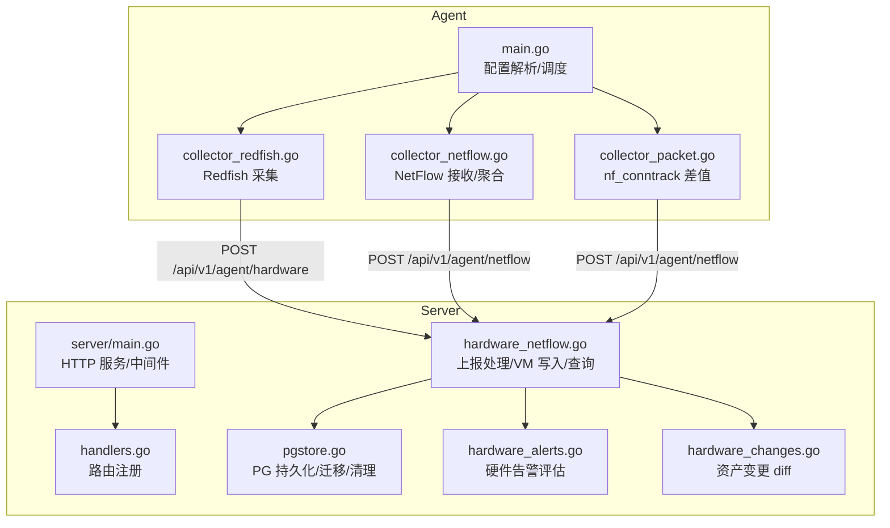
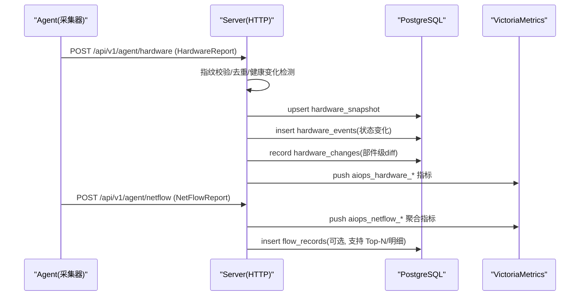
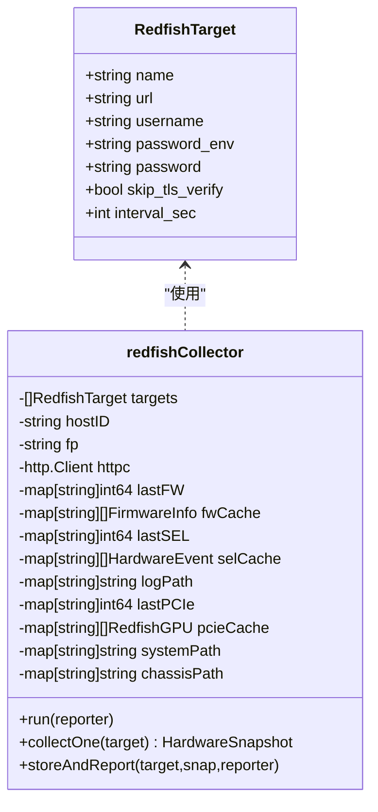
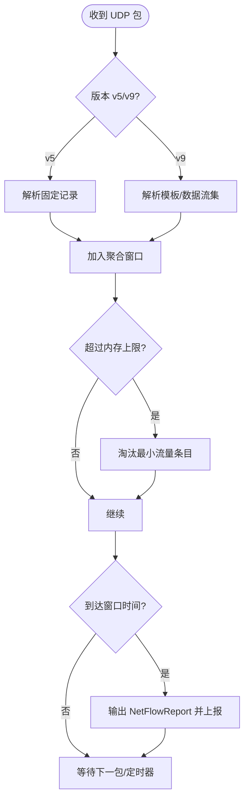
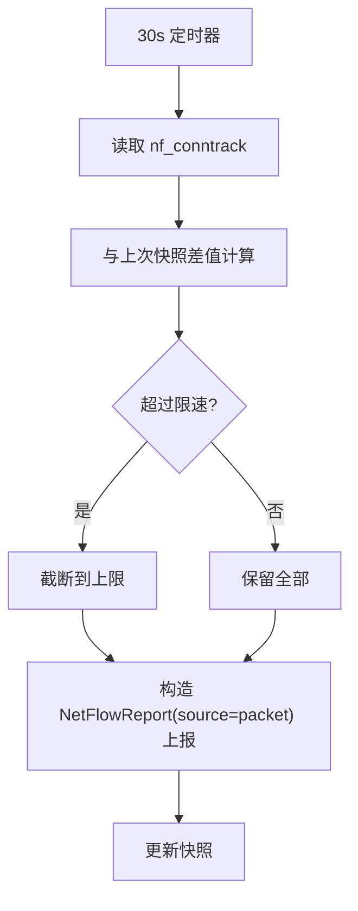
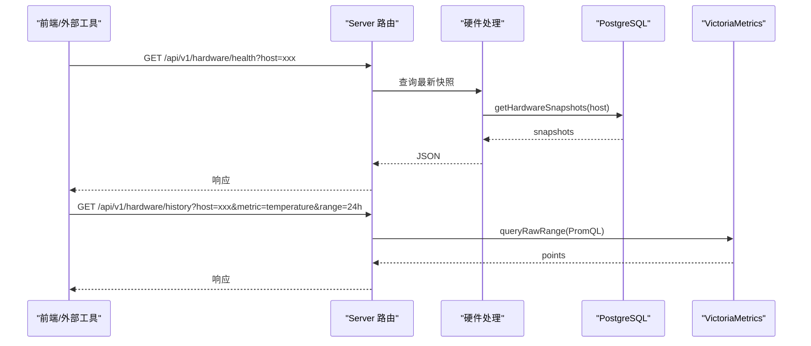
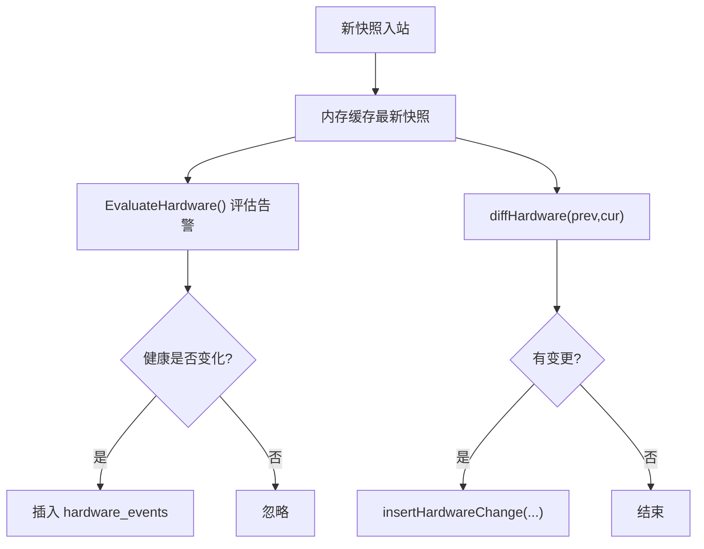
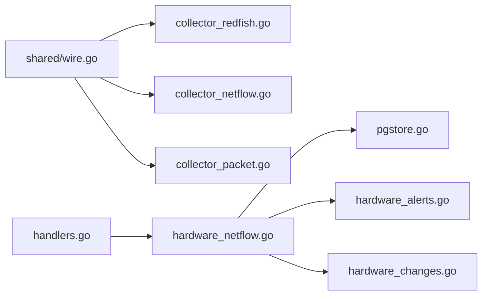

# 硬件聚合系统

<cite>
**本文引用的文件**   
- [cmd/agent/main.go](file://cmd/agent/main.go)
- [shared/wire.go](file://shared/wire.go)
- [cmd/agent/collector_redfish.go](file://cmd/agent/collector_redfish.go)
- [cmd/agent/collector_netflow.go](file://cmd/agent/collector_netflow.go)
- [cmd/agent/collector_packet.go](file://cmd/agent/collector_packet.go)
- [cmd/server/main.go](file://cmd/server/main.go)
- [cmd/server/handlers.go](file://cmd/server/handlers.go)
- [cmd/server/hardware_netflow.go](file://cmd/server/hardware_netflow.go)
- [cmd/server/pgstore.go](file://cmd/server/pgstore.go)
- [cmd/server/hardware_alerts.go](file://cmd/server/hardware_alerts.go)
- [cmd/server/hardware_changes.go](file://cmd/server/hardware_changes.go)
- [config.example.json](file://config.example.json)
</cite>

## 目录
1. [简介](#简介)
2. [项目结构](#项目结构)
3. [核心组件](#核心组件)
4. [架构总览](#架构总览)
5. [详细组件分析](#详细组件分析)
6. [依赖关系分析](#依赖关系分析)
7. [性能与容量规划](#性能与容量规划)
8. [故障排查指南](#故障排查指南)
9. [结论](#结论)
10. [附录：API 与配置参考](#附录api-与配置参考)

## 简介
本方案围绕“三类采集器 + Server 端查询分析”的硬件聚合系统，覆盖 Redfish 硬件状态采集、NetFlow 网络流量采集、五元组包报文采集的完整技术路径。系统由 Agent（Go）与 Server（Go HTTP）组成，Agent 负责多源数据采集与上报，Server 负责接收、持久化、时序写入与前端查询。存储采用 PostgreSQL（关系数据）+ VictoriaMetrics（时序指标），并内置硬件告警与资产变更追溯能力。

## 项目结构
- Agent 侧新增模块
  - collector_redfish.go：Redfish REST 客户端，轮询 BMC/iDRAC/iLO，产出 HardwareSnapshot
  - collector_netflow.go：NetFlow v5/v9 UDP 接收器 + 内存聚合窗口，产出 NetFlowReport
  - collector_packet.go：Linux nf_conntrack 增量快照，产出 NetFlowReport（source=packet）
  - main.go：解析 redfish_targets/netflow/packet_capture 配置，按需启动采集 goroutine
- Server 侧
  - handlers.go：注册 /api/v1/agent/hardware、/api/v1/agent/netflow 等路由
  - hardware_netflow.go：实现硬件/NetFlow 上报处理、VM 写入、历史查询
  - pgstore.go：PostgreSQL 建表、迁移、Upsert/查询、分区与清理
  - hardware_alerts.go：基于 BMC 健康/阈值生成统一告警
  - hardware_changes.go：部件级 diff，记录硬件资产变更
- 共享数据结构
  - shared/wire.go：HardwareSnapshot、NetFlowReport、FlowRecord 等跨进程契约

图表来源
- [cmd/agent/main.go:228-241](file://cmd/agent/main.go#L228-L241)
- [cmd/agent/collector_redfish.go:146-197](file://cmd/agent/collector_redfish.go#L146-L197)
- [cmd/agent/collector_netflow.go:203-263](file://cmd/agent/collector_netflow.go#L203-L263)
- [cmd/agent/collector_packet.go:59-113](file://cmd/agent/collector_packet.go#L59-L113)
- [cmd/server/handlers.go:295-304](file://cmd/server/handlers.go#L295-L304)
- [cmd/server/hardware_netflow.go:21-114](file://cmd/server/hardware_netflow.go#L21-L114)
- [cmd/server/pgstore.go:79-200](file://cmd/server/pgstore.go#L79-L200)
- [cmd/server/hardware_alerts.go:118-254](file://cmd/server/hardware_alerts.go#L118-L254)
- [cmd/server/hardware_changes.go:143-164](file://cmd/server/hardware_changes.go#L143-L164)

章节来源
- [cmd/agent/main.go:228-241](file://cmd/agent/main.go#L228-L241)
- [cmd/server/handlers.go:295-304](file://cmd/server/handlers.go#L295-L304)

## 核心组件
- 共享数据结构（wire）
  - HardwareSnapshot：整机/处理器/内存/存储/RAID/风扇/温度/电源/固件/事件等
  - NetFlowReport/FlowRecord：五元组聚合结果与统计信息
  - HardwareReport：一次上报包含多个 target 的快照集合
- Agent 采集器
  - Redfish：TLS 兼容旧固件、按目标独立定时器、失败退避、缓存降频（固件/PCIe GPU/事件日志）
  - NetFlow：UDP 监听、v5/v9 解析、模板缓存、滑动窗口聚合、内存上限保护与丢弃计数
  - Packet：仅 Linux，定时读取 nf_conntrack，差值计算增量 Flow，限速
- Server 处理
  - 指纹鉴权、最新快照内存缓存、PG Upsert、VM 时序写入、硬件告警与变更记录
  - 前端查询：健康/历史/事件、Top-N 汇总、明细分页、包统计

章节来源
- [shared/wire.go:144-390](file://shared/wire.go#L144-L390)
- [cmd/agent/collector_redfish.go:95-143](file://cmd/agent/collector_redfish.go#L95-L143)
- [cmd/agent/collector_netflow.go:55-165](file://cmd/agent/collector_netflow.go#L55-L165)
- [cmd/agent/collector_packet.go:26-56](file://cmd/agent/collector_packet.go#L26-L56)
- [cmd/server/hardware_netflow.go:21-114](file://cmd/server/hardware_netflow.go#L21-L114)

## 架构总览

图表来源
- [cmd/server/handlers.go:295-304](file://cmd/server/handlers.go#L295-L304)
- [cmd/server/hardware_netflow.go:21-114](file://cmd/server/hardware_netflow.go#L21-L114)
- [cmd/server/pgstore.go:79-200](file://cmd/server/pgstore.go#L79-L200)

## 详细组件分析

### Redfish 硬件采集器
- 运行模型：每个 target 独立 goroutine + 定时器；首次立即采集，后续按 interval_sec（≥30s）
- TLS 兼容：显式启用 TLS 1.0+ 与部分不安全套件以适配老旧 BMC；可跳过证书校验
- 路径发现：动态发现 Systems/Chassis 链接，避免硬编码路径导致 404
- 关键流程：System → Processors/Memory/Storage → Thermal/Fans → Power → Events → Firmware（降频）
- 错误处理：分类提示（TLS/证书/连接/DNS/超时/认证），连续失败退避 5 分钟
- 上报：聚合所有 target 快照为 HardwareReport 一次性上报

图表来源
- [cmd/agent/collector_redfish.go:58-143](file://cmd/agent/collector_redfish.go#L58-L143)
- [cmd/agent/collector_redfish.go:146-197](file://cmd/agent/collector_redfish.go#L146-L197)

章节来源
- [cmd/agent/collector_redfish.go:21-93](file://cmd/agent/collector_redfish.go#L21-L93)
- [cmd/agent/collector_redfish.go:146-197](file://cmd/agent/collector_redfish.go#L146-L197)
- [cmd/agent/collector_redfish.go:381-776](file://cmd/agent/collector_redfish.go#L381-L776)

### NetFlow 接收器与聚合器
- 运行模型：UDP 监听 + 周期 flush（默认 5min）；支持 v5 固定格式与 v9 模板解码
- 聚合器：按五元组 key 合并 bytes/packets/TCP flags，内存上限 100K，超出淘汰最小流量项
- 背压：UDP 读缓冲可配，flush 未完成时丢弃计数；可按 max_flows_per_sec 采样
- 主动采集预留：ActiveTargets 结构已定义，便于扩展 SNMP/REST 拉取

图表来源
- [cmd/agent/collector_netflow.go:203-263](file://cmd/agent/collector_netflow.go#L203-L263)
- [cmd/agent/collector_netflow.go:265-484](file://cmd/agent/collector_netflow.go#L265-L484)
- [cmd/agent/collector_netflow.go:55-165](file://cmd/agent/collector_netflow.go#L55-L165)

章节来源
- [cmd/agent/collector_netflow.go:14-31](file://cmd/agent/collector_netflow.go#L14-31)
- [cmd/agent/collector_netflow.go:55-165](file://cmd/agent/collector_netflow.go#L55-L165)
- [cmd/agent/collector_netflow.go:203-263](file://cmd/agent/collector_netflow.go#L203-L263)

### 五元组包采集（Linux nf_conntrack）
- 运行模型：每 30s 读取 /proc/net/nf_conntrack，与上次快照做差，得到增量 Flow
- 限速：max_packets_per_min 控制单窗口最大输出条数
- 平台限制：仅 Linux；其他平台直接跳过

图表来源
- [cmd/agent/collector_packet.go:59-113](file://cmd/agent/collector_packet.go#L59-L113)
- [cmd/agent/collector_packet.go:115-270](file://cmd/agent/collector_packet.go#L115-L270)

章节来源
- [cmd/agent/collector_packet.go:17-24](file://cmd/agent/collector_packet.go#L17-24)
- [cmd/agent/collector_packet.go:59-113](file://cmd/agent/collector_packet.go#L59-L113)

### Server 端处理与存储
- 上报入口
  - POST /api/v1/agent/hardware：指纹校验 → 内存缓存最新快照 → PG Upsert → VM 写指标 → 健康事件（仅变化）→ 资产变更 diff
  - POST /api/v1/agent/netflow：指纹校验 → VM 写聚合指标 → PG 写明细（可选）
- 查询接口
  - GET /api/v1/hardware/health/history/events：健康/历史/事件
  - GET /api/v1/netflow/summary/flows/packets：Top-N/明细/包统计
- 存储设计
  - hardware_snapshot：按 host_id+target_name UPSERT
  - hardware_events：健康状态变更事件
  - flow_records：Flow 明细（支持 Top-N/筛选/导出）
  - VM 指标：aiops_hardware_*、aiops_netflow_*（基数可控的聚合序列）

图表来源
- [cmd/server/handlers.go:295-304](file://cmd/server/handlers.go#L295-L304)
- [cmd/server/hardware_netflow.go:120-205](file://cmd/server/hardware_netflow.go#L120-L205)
- [cmd/server/pgstore.go:79-200](file://cmd/server/pgstore.go#L79-L200)

章节来源
- [cmd/server/handlers.go:295-304](file://cmd/server/handlers.go#L295-L304)
- [cmd/server/hardware_netflow.go:21-114](file://cmd/server/hardware_netflow.go#L21-L114)
- [cmd/server/hardware_netflow.go:120-205](file://cmd/server/hardware_netflow.go#L120-L205)
- [cmd/server/pgstore.go:79-200](file://cmd/server/pgstore.go#L79-L200)

### 硬件告警与资产变更
- 告警策略：基于 BMC 自身 Health/Status 与传感器阈值（UpperCaution/Critical），对 CPU/GPU/PSU/磁盘/风扇/RAID/机箱等进行分级告警
- 去重：仅在健康状态发生转换时记录事件，避免刷屏
- 资产变更：部件级 diff（槽位不变、身份变 = replaced/changed），仅记录真实变更

图表来源
- [cmd/server/hardware_alerts.go:118-254](file://cmd/server/hardware_alerts.go#L118-L254)
- [cmd/server/hardware_changes.go:143-164](file://cmd/server/hardware_changes.go#L143-L164)

章节来源
- [cmd/server/hardware_alerts.go:118-254](file://cmd/server/hardware_alerts.go#L118-L254)
- [cmd/server/hardware_changes.go:103-164](file://cmd/server/hardware_changes.go#L103-L164)

## 依赖关系分析
- Agent 依赖
  - shared/wire.go：统一数据结构契约
  - net/http + crypto/tls：Redfish 请求
  - net.ListenPacket：NetFlow UDP 接收
  - os + bufio：nf_conntrack 读取
- Server 依赖
  - handlers.go：路由注册
  - hardware_netflow.go：上报处理、VM 写入、查询
  - pgstore.go：PG 连接、迁移、Upsert/查询、分区与清理
  - hardware_alerts.go / hardware_changes.go：告警与变更
- 外部依赖
  - PostgreSQL：关系数据（快照/事件/变更/Flow 明细）
  - VictoriaMetrics：时序指标（硬件数值/NetFlow 聚合）

图表来源
- [shared/wire.go:144-390](file://shared/wire.go#L144-L390)
- [cmd/server/handlers.go:295-304](file://cmd/server/handlers.go#L295-L304)
- [cmd/server/hardware_netflow.go:21-114](file://cmd/server/hardware_netflow.go#L21-L114)
- [cmd/server/pgstore.go:79-200](file://cmd/server/pgstore.go#L79-L200)
- [cmd/server/hardware_alerts.go:118-254](file://cmd/server/hardware_alerts.go#L118-L254)
- [cmd/server/hardware_changes.go:143-164](file://cmd/server/hardware_changes.go#L143-L164)

章节来源
- [cmd/server/main.go:227-356](file://cmd/server/main.go#L227-L356)
- [cmd/server/handlers.go:295-304](file://cmd/server/handlers.go#L295-L304)

## 性能与容量规划
- Agent 侧
  - Redfish：各 target 独立定时器，失败退避 5 分钟；固件/PCIe GPU/事件日志降频采集
  - NetFlow：内存上限 100K flows，超限时淘汰最小流量；UDP 读缓冲可配；可按速率采样
  - Packet：仅 Linux，30s 差值，max_packets_per_min 限速
- Server 侧
  - VM 指标基数封顶：NetFlow 仅发总量/Top-N 对端/Top-N 端口三类序列，避免高基数爆炸
  - PG 分区与清理：flow_records 支持按月分区与定期清理（7 天 TTL 或更短）
  - 健康事件去重：仅状态变化写入 events 表，避免无限增长

[本节为通用指导，不直接分析具体文件]

## 故障排查指南
- Redfish 常见问题
  - TLS 握手失败/证书错误：检查 skip_tls_verify 与固件版本；必要时升级 BMC 固件
  - 401/403：确认用户名与密码环境变量或字段
  - 连接拒绝/超时/DNS 失败：检查 BMC 可达性与防火墙
- NetFlow
  - 无数据：确认设备推送地址/端口/协议版本；查看 dropped 计数与 buffer_size
  - 指标异常：检查 window_sec 与 max_flows_per_sec 设置
- Packet
  - 仅 Linux 生效；若未产生数据，检查 /proc/net/nf_conntrack 权限与内容
- Server
  - 指纹校验失败：核对 X-Agent-Fingerprint 与主机绑定
  - VM 历史为空：确认时间戳单位（毫秒）与 range 参数
  - PG 未配置：相关查询返回空数组，需配置 AIOPS_POSTGRES_DSN

章节来源
- [cmd/agent/collector_redfish.go:347-379](file://cmd/agent/collector_redfish.go#L347-L379)
- [cmd/agent/collector_netflow.go:203-263](file://cmd/agent/collector_netflow.go#L203-L263)
- [cmd/agent/collector_packet.go:59-113](file://cmd/agent/collector_packet.go#L59-L113)
- [cmd/server/hardware_netflow.go:21-114](file://cmd/server/hardware_netflow.go#L21-L114)

## 结论
本方案通过三类采集器与统一的 Server 处理链路，实现了从带外硬件状态到网络流量的全栈监控。设计上强调：
- 向后兼容与零侵入：新增配置 omitempty，未配置即不启动
- 安全与健壮：指纹鉴权、TLS 兼容、失败退避、内存上限与背压
- 可扩展与高性能：VM 指标基数封顶、PG 分区与清理、部件级变更追踪
- 易运维：i18n、前端面板、告警与事件联动

[本节为总结性内容，不直接分析具体文件]

## 附录：API 与配置参考

### Agent 配置示例（节选）
- redfish_targets：BMC 列表（name/url/username/password_env/skip_tls_verify/interval_sec）
- netflow：listen/protocols/buffer_size/window_sec/max_flows_per_sec/active_targets
- packet_capture：enabled/interface/bpf_filter/sample_rate/max_packets_per_min

章节来源
- [config.example.json:54-97](file://config.example.json#L54-L97)

### Server 路由（节选）
- Agent 上报
  - POST /api/v1/agent/hardware
  - POST /api/v1/agent/netflow
- 前端查询
  - GET /api/v1/hardware/health
  - GET /api/v1/hardware/history
  - GET /api/v1/hardware/events
  - GET /api/v1/netflow/summary
  - GET /api/v1/netflow/flows
  - GET /api/v1/netflow/packets

章节来源
- [cmd/server/handlers.go:295-304](file://cmd/server/handlers.go#L295-L304)