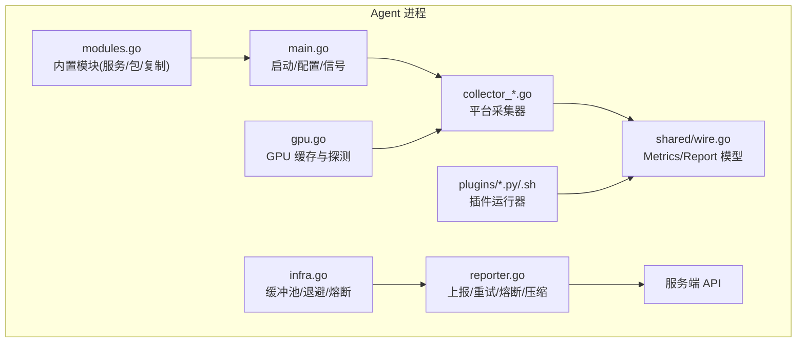
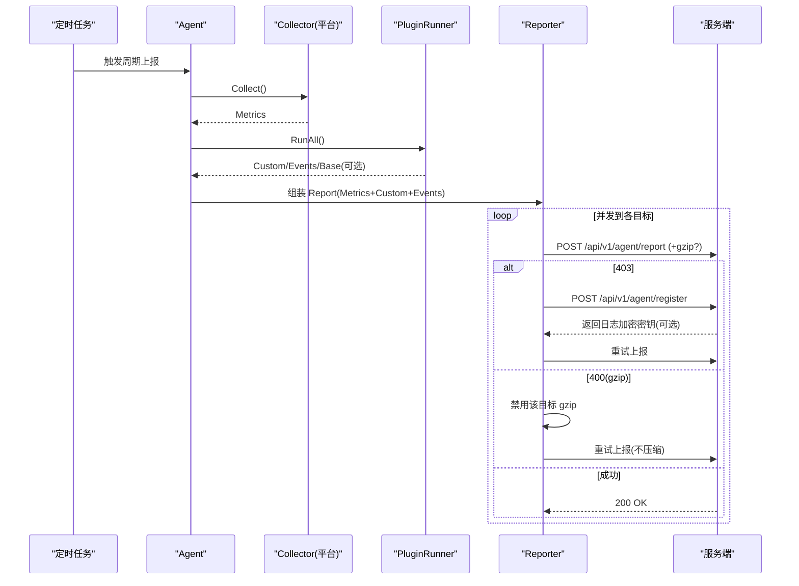
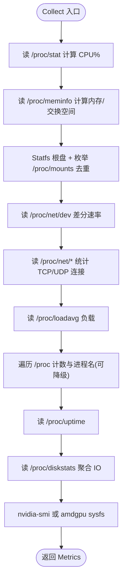
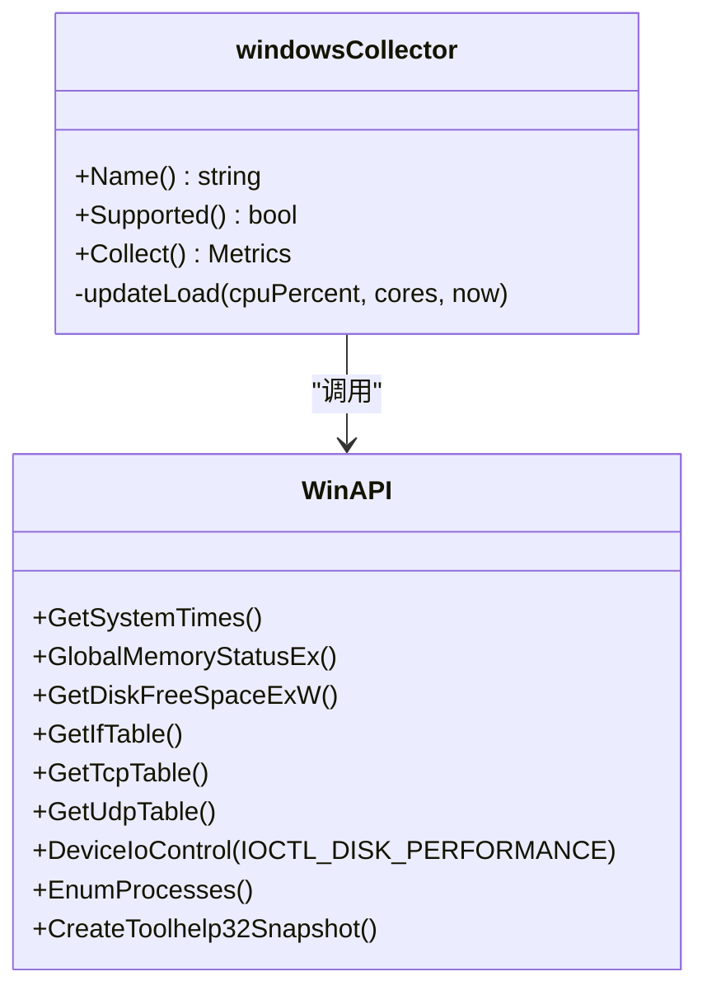
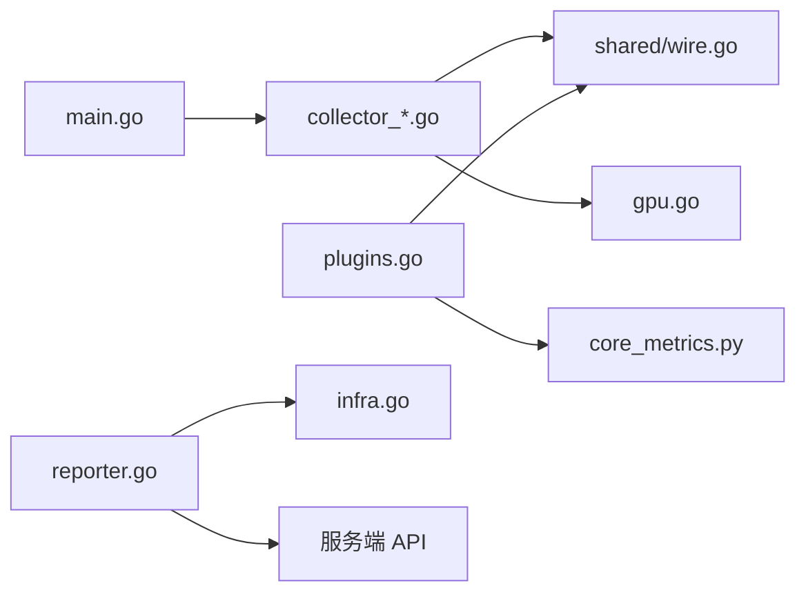

# 系统指标采集器

<cite>
**本文引用的文件**   
- [cmd/agent/main.go](file://cmd/agent/main.go)
- [cmd/agent/collector.go](file://cmd/agent/collector.go)
- [cmd/agent/collector_linux.go](file://cmd/agent/collector_linux.go)
- [cmd/agent/collector_windows.go](file://cmd/agent/collector_windows.go)
- [cmd/agent/collector_darwin.go](file://cmd/agent/collector_darwin.go)
- [cmd/agent/collector_other.go](file://cmd/agent/collector_other.go)
- [cmd/agent/gpu.go](file://cmd/agent/gpu.go)
- [cmd/agent/reporter.go](file://cmd/agent/reporter.go)
- [cmd/agent/infra.go](file://cmd/agent/infra.go)
- [cmd/agent/modules.go](file://cmd/agent/modules.go)
- [shared/wire.go](file://shared/wire.go)
- [plugins/core_metrics.py](file://plugins/core_metrics.py)
- [config.example.json](file://config.example.json)
</cite>

## 目录
1. [简介](#简介)
2. [项目结构](#项目结构)
3. [核心组件](#核心组件)
4. [架构总览](#架构总览)
5. [详细组件分析](#详细组件分析)
6. [依赖关系分析](#依赖关系分析)
7. [性能与优化](#性能与优化)
8. [故障排查指南](#故障排查指南)
9. [结论](#结论)
10. [附录：平台差异与配置](#附录：平台差异与配置)

## 简介
本文件面向 AIOps Monitor 跨平台系统指标采集器（Agent），系统性阐述 CPU、内存、磁盘、网络等基础指标的采集实现，以及 Linux、Windows、macOS 平台的差异化处理逻辑；并深入说明 GPU 监控支持、基础设施信息收集、错误处理机制、采样频率控制、数据压缩传输、重试与熔断策略、资源使用控制与性能调优建议。文档同时提供各平台配置差异说明与最佳实践。

## 项目结构
Agent 采用“原生采集 + 插件扩展”的混合架构：
- 原生采集层：在 Linux/Windows/macOS 上通过系统接口直接采集，零外部依赖，低开销、高频率。
- 插件扩展层：Python/Shell 插件以子进程方式并发执行，产出自定义指标或事件；在非 Linux 平台可作为基础指标兜底。
- 上报层：多目标并发上报，具备 gzip 压缩降级、指数退避重试、滑动窗口熔断、TLS 信任链配置等能力。

图表来源
- [cmd/agent/main.go:74-237](file://cmd/agent/main.go#L74-L237)
- [cmd/agent/collector.go:1-32](file://cmd/agent/collector.go#L1-L32)
- [cmd/agent/collector_linux.go:66-209](file://cmd/agent/collector_linux.go#L66-L209)
- [cmd/agent/collector_windows.go:79-207](file://cmd/agent/collector_windows.go#L79-L207)
- [cmd/agent/collector_darwin.go:31-109](file://cmd/agent/collector_darwin.go#L31-L109)
- [cmd/agent/gpu.go:1-126](file://cmd/agent/gpu.go#L1-L126)
- [cmd/agent/reporter.go:255-370](file://cmd/agent/reporter.go#L255-L370)
- [cmd/agent/infra.go:35-176](file://cmd/agent/infra.go#L35-L176)
- [cmd/agent/modules.go:18-47](file://cmd/agent/modules.go#L18-L47)
- [shared/wire.go:8-139](file://shared/wire.go#L8-L139)

章节来源
- [cmd/agent/main.go:74-237](file://cmd/agent/main.go#L74-L237)
- [cmd/agent/collector.go:1-32](file://cmd/agent/collector.go#L1-L32)
- [shared/wire.go:8-139](file://shared/wire.go#L8-L139)

## 核心组件
- 采集器接口与公共工具
  - Collector 接口定义 Collect/Supported/Name，平台实现通过构建标签选择。
  - 通用 rate/round 辅助函数用于速率计算与数值舍入。
- 平台采集器
  - Linux：procfs/syscall 直采，含 CPU/内存/磁盘/网络/连接/负载/进程/IO 统计，带权限感知与安全提示。
  - Windows：Win32 API (kernel32/psapi/iphlpapi/ntdll)，CPU/内存/页文件/磁盘/网络/IO/TCP状态/进程/负载近似。
  - macOS：sysctl/ioreg/netstat/top/vm_stat/ps，CPU/内存/交换空间/磁盘/网络/IO/连接/负载/进程/启动时间。
  - 其他平台：stubCollector，基础指标由 core 插件补齐。
- GPU 采集
  - NVIDIA：nvidia-smi CSV 解析（Linux/Windows）。
  - AMD：/sys/class/drm/card*/device sysfs（Linux）。
  - Apple：ioreg IOAccelerator 利用率（macOS）。
  - 结果缓存避免频繁 fork 外部命令。
- 上报与可靠性
  - 多目标并发上报、gzip 压缩阈值与降级、403 自动重注册、指数退避重试、滑动窗口熔断。
  - TLS 最小版本、HTTP/1.1 禁用 HTTP/2 提升重启恢复速度。
- 基础设施信息与内置模块
  - 主机指纹、IP、内核/平台版本、分类标签。
  - 内置模块：gather_facts/service/package/copy，统一跨平台运维动作。

章节来源
- [cmd/agent/collector.go:1-32](file://cmd/agent/collector.go#L1-L32)
- [cmd/agent/collector_linux.go:66-209](file://cmd/agent/collector_linux.go#L66-L209)
- [cmd/agent/collector_windows.go:79-207](file://cmd/agent/collector_windows.go#L79-L207)
- [cmd/agent/collector_darwin.go:31-109](file://cmd/agent/collector_darwin.go#L31-L109)
- [cmd/agent/collector_other.go:11-25](file://cmd/agent/collector_other.go#L11-L25)
- [cmd/agent/gpu.go:1-126](file://cmd/agent/gpu.go#L1-L126)
- [cmd/agent/reporter.go:21-200](file://cmd/agent/reporter.go#L21-L200)
- [cmd/agent/modules.go:18-47](file://cmd/agent/modules.go#L18-L47)

## 架构总览
Agent 主循环按固定间隔采集一次基础指标，合并插件产生的自定义指标与事件，广播至所有后端服务器。每个目标独立维护连接池、重试与熔断，互不影响。

图表来源
- [cmd/agent/reporter.go:319-370](file://cmd/agent/reporter.go#L319-L370)
- [cmd/agent/reporter.go:139-200](file://cmd/agent/reporter.go#L139-L200)
- [cmd/agent/reporter.go:90-121](file://cmd/agent/reporter.go#L90-L121)
- [cmd/agent/plugins.go:102-147](file://cmd/agent/plugins.go#L102-L147)
- [shared/wire.go:120-139](file://shared/wire.go#L120-L139)

## 详细组件分析

### 采集器接口与公共工具
- 接口职责
  - Collect：返回当前时刻的系统指标快照。
  - Supported：标识是否具备原生采集能力。
  - Name：便于日志与诊断。
- 公共工具
  - round1/round2：对百分比与负载值进行合理舍入，减少噪声。
  - rate：基于单调计数器差分计算每秒速率，处理回绕与非正间隔。

章节来源
- [cmd/agent/collector.go:1-32](file://cmd/agent/collector.go#L1-L32)

### Linux 采集器（procfs + syscall）
- CPU：读取 /proc/stat，累计 idle+iowait 作为空闲，差分为占用率。
- 内存：/proc/meminfo 解析 MemTotal/MemAvailable/SwapTotal/SwapFree。
- 磁盘：Statfs 获取根盘用量；/proc/mounts 枚举真实卷，跳过伪文件系统与 /boot。
- 网络：/proc/net/dev 累加非 lo 接口的收发字节，差分得速率。
- 连接：/proc/net/{tcp,tcp6,udp,udp6} 统计 TCP 各状态计数与 UDP 总数。
- 负载：/proc/loadavg 解析 1/5/15 分钟负载。
- 进程：单遍 /proc 扫描计数与唯一进程名，必要时降级读取 cmdline。
- 启动时间与 IO：/proc/uptime、/proc/diskstats 聚合物理设备读写字节与操作数。
- GPU：优先 nvidia-smi，其次 amdgpu sysfs。
- 安全感知：记录 /proc 路径权限错误并输出修复建议。

图表来源
- [cmd/agent/collector_linux.go:76-209](file://cmd/agent/collector_linux.go#L76-L209)
- [cmd/agent/collector_linux.go:252-425](file://cmd/agent/collector_linux.go#L252-L425)
- [cmd/agent/collector_linux.go:509-556](file://cmd/agent/collector_linux.go#L509-L556)
- [cmd/agent/collector_linux.go:584-616](file://cmd/agent/collector_linux.go#L584-L616)
- [cmd/agent/gpu.go:59-111](file://cmd/agent/gpu.go#L59-L111)

章节来源
- [cmd/agent/collector_linux.go:66-209](file://cmd/agent/collector_linux.go#L66-L209)
- [cmd/agent/collector_linux.go:252-425](file://cmd/agent/collector_linux.go#L252-L425)
- [cmd/agent/collector_linux.go:509-556](file://cmd/agent/collector_linux.go#L509-L556)
- [cmd/agent/collector_linux.go:584-616](file://cmd/agent/collector_linux.go#L584-L616)

### Windows 采集器（Win32 API）
- CPU：GetSystemTimes 计算占用率。
- 内存与页文件：GlobalMemoryStatusEx 推导物理内存与页文件使用。
- 磁盘：GetDiskFreeSpaceExW 获取根盘与所有本地固定盘。
- 网络：GetIfTable 累加非回环接口字节，差分得速率。
- 磁盘 IO：DeviceIoControl IOCTL_DISK_PERFORMANCE 汇总物理盘累计字节与操作数。
- 连接：GetTcpTable/GetUdpTable 统计 TCP 状态与 UDP 总数。
- 进程：EnumProcesses 计数，CreateToolhelp32Snapshot 列举进程名。
- 负载：无原生 load average，基于 CPU%×核数 EWMA 近似 1/5/15 分钟负载。
- GPU：nvidia-smi（best-effort，缓存）。

图表来源
- [cmd/agent/collector_windows.go:89-207](file://cmd/agent/collector_windows.go#L89-L207)
- [cmd/agent/collector_windows.go:290-396](file://cmd/agent/collector_windows.go#L290-L396)
- [cmd/agent/collector_windows.go:423-466](file://cmd/agent/collector_windows.go#L423-L466)
- [cmd/agent/collector_windows.go:230-261](file://cmd/agent/collector_windows.go#L230-L261)
- [cmd/agent/collector_windows.go:267-285](file://cmd/agent/collector_windows.go#L267-L285)

章节来源
- [cmd/agent/collector_windows.go:79-207](file://cmd/agent/collector_windows.go#L79-L207)
- [cmd/agent/collector_windows.go:290-396](file://cmd/agent/collector_windows.go#L290-L396)
- [cmd/agent/collector_windows.go:423-466](file://cmd/agent/collector_windows.go#L423-L466)
- [cmd/agent/collector_windows.go:230-261](file://cmd/agent/collector_windows.go#L230-L261)
- [cmd/agent/collector_windows.go:267-285](file://cmd/agent/collector_windows.go#L267-L285)

### macOS 采集器（sysctl/ioreg/netstat/top/vm_stat/ps）
- CPU：top -l 2 取第二次样本计算占用率。
- 内存：vm_stat 结合 page size 计算已用内存。
- 交换空间：sysctl vm.swapusage 解析 total/used。
- 磁盘：df -kP 枚举 /dev 卷，跳过 /System 与 /boot。
- 网络：netstat -ibn 累加非 lo 接口 Ibytes/Obytes。
- 磁盘 IO：ioreg IOBlockStorageDriver 统计累计字节与操作数。
- 连接：netstat -an -p tcp/udp 统计 TCP 状态与 UDP 总数。
- 负载：sysctl vm.loadavg。
- 进程：ps -A 计数与 comm 列表。
- 启动时间：sysctl kern.boottime 计算 uptime。
- GPU：ioreg IOAccelerator 提取 Device Utilization % 与 model。

章节来源
- [cmd/agent/collector_darwin.go:41-109](file://cmd/agent/collector_darwin.go#L41-L109)
- [cmd/agent/collector_darwin.go:113-147](file://cmd/agent/collector_darwin.go#L113-L147)
- [cmd/agent/collector_darwin.go:153-197](file://cmd/agent/collector_darwin.go#L153-L197)
- [cmd/agent/collector_darwin.go:219-245](file://cmd/agent/collector_darwin.go#L219-L245)
- [cmd/agent/collector_darwin.go:247-329](file://cmd/agent/collector_darwin.go#L247-L329)
- [cmd/agent/collector_darwin.go:332-366](file://cmd/agent/collector_darwin.go#L332-L366)
- [cmd/agent/collector_darwin.go:400-426](file://cmd/agent/collector_darwin.go#L400-L426)
- [cmd/agent/collector_darwin.go:428-437](file://cmd/agent/collector_darwin.go#L428-L437)
- [cmd/agent/collector_darwin.go:439-476](file://cmd/agent/collector_darwin.go#L439-L476)
- [cmd/agent/collector_darwin.go:478-497](file://cmd/agent/collector_darwin.go#L478-L497)
- [cmd/agent/collector_darwin.go:503-536](file://cmd/agent/collector_darwin.go#L503-L536)

### 其他平台（stub）
- 当无原生采集器时，返回不支持；基础指标可由 core 插件（psutil）补齐。

章节来源
- [cmd/agent/collector_other.go:11-25](file://cmd/agent/collector_other.go#L11-L25)
- [plugins/core_metrics.py:1-65](file://plugins/core_metrics.py#L1-L65)

### GPU 监控支持
- 缓存策略：全局缓存 TTL 约 12 秒，避免高频 fork 外部命令导致报告循环阻塞。
- 探测顺序：
  - Linux/Windows：nvidia-smi CSV 解析，容错缺失字段与单位。
  - Linux：amdgpu sysfs 读取利用率与 VRAM。
  - macOS：ioreg IOAccelerator 提取利用率与型号。
- 超时保护：外部命令强制超时，防止驱动挂死拖垮 Agent。

章节来源
- [cmd/agent/gpu.go:1-126](file://cmd/agent/gpu.go#L1-L126)
- [cmd/agent/collector_linux.go:211-248](file://cmd/agent/collector_linux.go#L211-L248)
- [cmd/agent/collector_darwin.go:153-197](file://cmd/agent/collector_darwin.go#L153-L197)

### 基础设施信息与内置模块
- 基础设施信息：主机名、操作系统/内核版本、架构、IP、机器指纹、分类标签。
- 内置模块：
  - gather_facts：统一获取 IP/主机名/OS/架构/CPU 数量。
  - service：跨平台管理服务（systemctl/sc/brew）。
  - package：跨平台包管理（apt/dnf/yum/apk/zypper/pacman/brew/choco/winget）。
  - copy：跨平台写入文件并设置权限。

章节来源
- [cmd/agent/modules.go:49-97](file://cmd/agent/modules.go#L49-L97)
- [cmd/agent/modules.go:99-160](file://cmd/agent/modules.go#L99-L160)
- [cmd/agent/modules.go:162-239](file://cmd/agent/modules.go#L162-L239)
- [cmd/agent/modules.go:241-262](file://cmd/agent/modules.go#L241-L262)

## 依赖关系分析
- 组件耦合
  - main 负责配置加载、安全环境检测、Relay 模式与 Agent 生命周期。
  - collector_* 实现仅依赖 shared.Metrics 模型与系统接口。
  - reporter 依赖 infra 提供的 backoff/circuitBreaker 与 buffer pool。
  - gpu 被各平台采集器复用，降低外部命令成本。
  - plugins 与 core_metrics.py 为可选扩展，仅在 native 不可用时补全基础指标。
- 外部依赖
  - Linux：/proc 子系统、syscall.Statfs。
  - Windows：kernel32/psapi/iphlpapi/ntdll。
  - macOS：sysctl/ioreg/netstat/top/vm_stat/ps。
  - GPU：nvidia-smi（可选）、ioreg（macOS）。

图表来源
- [cmd/agent/main.go:74-237](file://cmd/agent/main.go#L74-L237)
- [cmd/agent/collector.go:1-32](file://cmd/agent/collector.go#L1-L32)
- [cmd/agent/reporter.go:255-370](file://cmd/agent/reporter.go#L255-L370)
- [cmd/agent/infra.go:35-176](file://cmd/agent/infra.go#L35-L176)
- [cmd/agent/gpu.go:1-126](file://cmd/agent/gpu.go#L1-L126)
- [plugins/core_metrics.py:1-65](file://plugins/core_metrics.py#L1-L65)

章节来源
- [cmd/agent/main.go:74-237](file://cmd/agent/main.go#L74-L237)
- [cmd/agent/reporter.go:255-370](file://cmd/agent/reporter.go#L255-L370)
- [cmd/agent/infra.go:35-176](file://cmd/agent/infra.go#L35-L176)

## 性能与优化
- 采样频率控制
  - 基础指标上报间隔与插件执行间隔可配置，默认分别为 10s/15s。
  - Linux 对磁盘枚举与进程信息采用缓存窗口（60s/20s）以降低开销。
- 数据压缩与传输
  - 小于阈值的载荷不压缩，大于阈值且未禁用 gzip 时使用 gzip 压缩（级别 3）。
  - 若服务端返回 400 且携带 gzip，则对该目标禁用压缩并重试。
  - HTTP/1.1 显式禁用 HTTP/2，提升服务端重启后的恢复速度。
- 重试与熔断
  - 每周期内最多重试 3 次，间隔 1s；失败累计达到阈值打开熔断，冷却后半开试探。
  - 403 自动重新注册，确保指纹绑定有效。
- 资源使用控制
  - 插件并发上限限制（默认 4），避免大量 Python 子进程造成抖动。
  - 外部命令（nvidia-smi/ioreg/top 等）均带超时保护。
  - 使用 sync.Pool 复用缓冲区，降低 GC 压力。
- 性能调优建议
  - 外网不稳定场景：适当增大 report_interval，保持较短重试延迟以避免误判。
  - 高吞吐主机：提高 MaxIdleConnsPerHost 与客户端超时，避免连接池争用。
  - 磁盘 IO 密集：延长磁盘枚举缓存 TTL，减少 Statfs 调用。
  - GPU 探测：保持默认缓存 TTL，避免频繁 fork 外部命令。

章节来源
- [cmd/agent/main.go:94-112](file://cmd/agent/main.go#L94-L112)
- [cmd/agent/collector_linux.go:60-64](file://cmd/agent/collector_linux.go#L60-L64)
- [cmd/agent/reporter.go:33-49](file://cmd/agent/reporter.go#L33-L49)
- [cmd/agent/reporter.go:139-200](file://cmd/agent/reporter.go#L139-L200)
- [cmd/agent/reporter.go:213-253](file://cmd/agent/reporter.go#L213-L253)
- [cmd/agent/infra.go:35-176](file://cmd/agent/infra.go#L35-L176)
- [cmd/agent/plugins.go:102-147](file://cmd/agent/plugins.go#L102-L147)
- [cmd/agent/gpu.go:17-37](file://cmd/agent/gpu.go#L17-L37)

## 故障排查指南
- 常见错误与定位
  - 403 禁止访问：通常因主机未注册或指纹未绑定，Agent 会自动重新注册并重试。
  - 400 请求格式错误：若之前发送了 gzip，可能为代理损坏压缩流，Agent 会禁用该目标压缩并重试。
  - 网络超时/5xx：进入重试与熔断流程，冷却后可自动恢复。
- 权限与安全模块
  - Linux 下若 /proc 路径被 kysec/SELinux/AppArmor/firewalld 拦截，将输出具体路径与修复建议。
  - 支持 permissive 临时切换与自动恢复 enforcing，避免长期放宽安全策略。
- 调试手段
  - 启用 --log-paths 采集日志并加密上报，便于问题回溯。
  - 查看 Agent 日志中“断路器已打开”“上报重试”“注册失败”等关键字快速定位。

章节来源
- [cmd/agent/reporter.go:139-200](file://cmd/agent/reporter.go#L139-L200)
- [cmd/agent/reporter.go:213-253](file://cmd/agent/reporter.go#L213-L253)
- [cmd/agent/collector_linux.go:193-209](file://cmd/agent/collector_linux.go#L193-L209)
- [cmd/agent/security_linux.go:280-322](file://cmd/agent/security_linux.go#L280-L322)
- [cmd/agent/security_linux.go:324-421](file://cmd/agent/security_linux.go#L324-L421)

## 结论
本采集器以“原生采集 + 插件扩展”的混合架构实现了跨平台、低开销、高可靠的系统指标采集与上报。通过缓存、压缩、重试与熔断等机制，在保证精度的同时兼顾稳定性与可恢复性。配合内置模块与日志采集，形成从采集、诊断到运维的一体化解决方案。

## 附录：平台差异与配置
- 平台差异要点
  - Linux：最丰富的原生指标（IO、IOPS、连接状态、进程名等），强依赖 /proc。
  - Windows：通过 Win32 API 覆盖主要指标，负载为近似值；IO 需管理员权限。
  - macOS：依赖系统工具（top/ioreg/netstat 等），注意命令超时与输出格式变化。
  - 其他平台：基础指标由 core_metrics.py（psutil）补齐。
- 关键配置项（示例）
  - server/servers：单/多后端地址与 Token。
  - report_interval/plugin_interval：上报与插件周期。
  - disk_path：监控的主磁盘路径。
  - plugins_dir/python：插件目录与解释器。
  - state_file：主机状态持久化文件。
  - category：主机分类标签。
  - log_paths/log_encrypt：日志采集与加密上报开关。
  - tls_skip_verify/ca_cert：TLS 校验与 CA 证书。
  - relay/listen/relay_secret：中继网关模式。
  - security-mode：安全模块模式（auto/permissive/enforcing）。

章节来源
- [config.example.json:1-16](file://config.example.json#L1-L16)
- [cmd/agent/main.go:44-72](file://cmd/agent/main.go#L44-L72)
- [cmd/agent/main.go:94-112](file://cmd/agent/main.go#L94-L112)
- [cmd/agent/main.go:122-136](file://cmd/agent/main.go#L122-L136)
- [cmd/agent/main.go:142-208](file://cmd/agent/main.go#L142-L208)