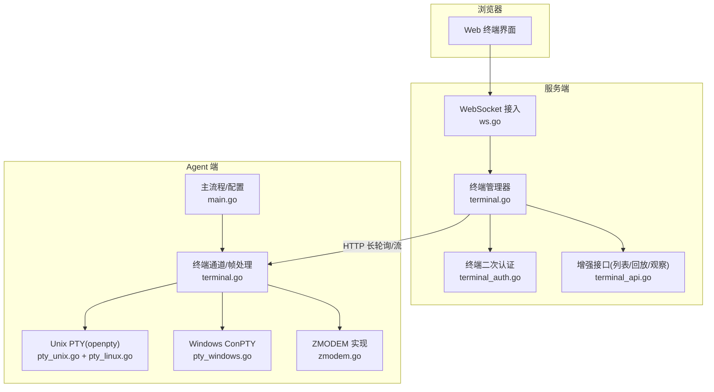
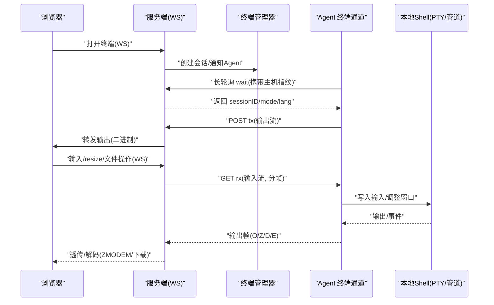
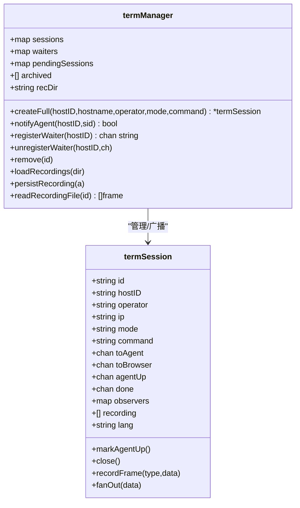
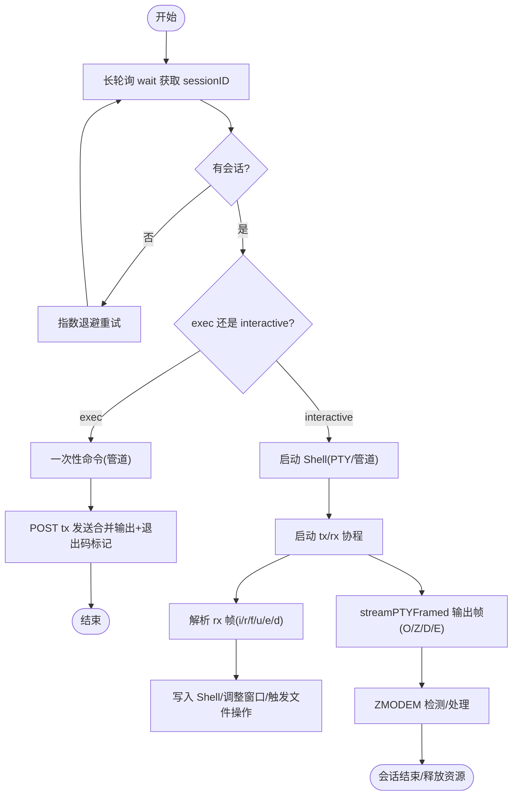
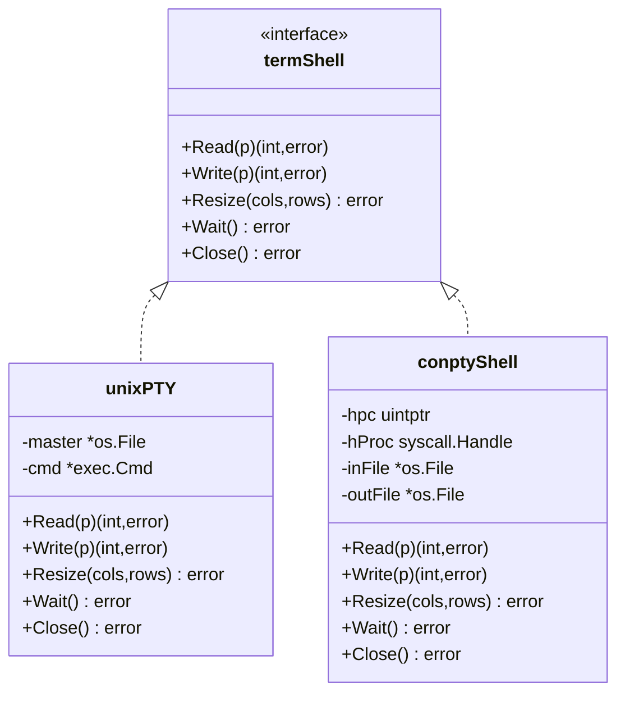
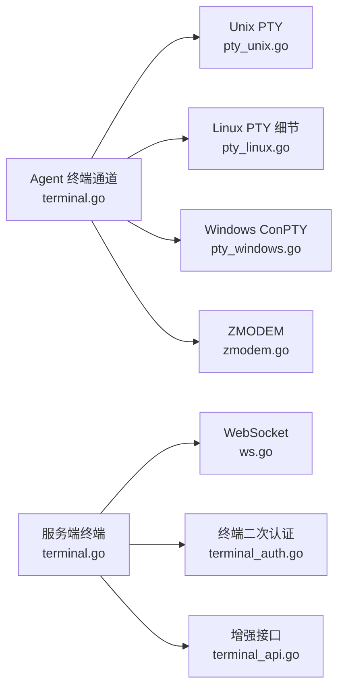

# 终端代理模块

<cite>
**本文引用的文件**   
- [cmd/agent/main.go](file://cmd/agent/main.go)
- [cmd/agent/terminal.go](file://cmd/agent/terminal.go)
- [cmd/agent/pty_linux.go](file://cmd/agent/pty_linux.go)
- [cmd/agent/pty_unix.go](file://cmd/agent/pty_unix.go)
- [cmd/agent/pty_windows.go](file://cmd/agent/pty_windows.go)
- [cmd/agent/zmodem.go](file://cmd/agent/zmodem.go)
- [cmd/agent/console_windows.go](file://cmd/agent/console_windows.go)
- [cmd/server/terminal.go](file://cmd/server/terminal.go)
- [cmd/server/terminal_api.go](file://cmd/server/terminal_api.go)
- [cmd/server/terminal_auth.go](file://cmd/server/terminal_auth.go)
- [cmd/server/ws.go](file://cmd/server/ws.go)
</cite>

## 目录
1. [简介](#简介)
2. [项目结构](#项目结构)
3. [核心组件](#核心组件)
4. [架构总览](#架构总览)
5. [详细组件分析](#详细组件分析)
6. [依赖关系分析](#依赖关系分析)
7. [性能考量](#性能考量)
8. [故障排查指南](#故障排查指南)
9. [结论](#结论)
10. [附录：使用与安全配置建议](#附录使用与安全配置建议)

## 简介
本模块为 AIOps Monitor 的“终端代理”子系统，提供跨平台（Linux/macOS/Windows）的远程交互式终端能力。其核心设计要点包括：
- 反向通道：Agent 无入站端口，主动拨号至服务端；通过长轮询等待会话建立，再打开两条 HTTP 流（rx/tx）桥接浏览器与本地 Shell。
- PTY 机制：在支持的平台使用原生伪终端（Linux openpty、macOS openpty、Windows ConPTY），否则回退到管道 stdio。
- 消息协议：基于自定义帧格式的双向数据封装，支持输入、窗口大小调整、ZMODEM 文件传输、下载等。
- 安全隔离：二次认证（终端密码）、指纹校验、审计录制、限速与资源上限控制。
- 可靠性：指数退避重连、半开连接检测、会话超时清理、执行模式（一次性命令）与交互模式分离。

## 项目结构
终端代理涉及 Agent 端与服务端两部分：
- Agent 端负责：发起长轮询、创建本地 Shell（PTY 或管道）、双向流转发、ZMODEM 处理、错误恢复与资源管理。
- 服务端负责：WebSocket 接入、会话编排、鉴权与审计、持久化录制回放、观察者模式（只读旁路）。

图表来源
- [cmd/server/ws.go:38-70](file://cmd/server/ws.go#L38-L70)
- [cmd/server/terminal.go:438-617](file://cmd/server/terminal.go#L438-L617)
- [cmd/server/terminal_api.go:9-77](file://cmd/server/terminal_api.go#L9-L77)
- [cmd/server/terminal_auth.go:1-172](file://cmd/server/terminal_auth.go#L1-L172)
- [cmd/agent/main.go:74-136](file://cmd/agent/main.go#L74-L136)
- [cmd/agent/terminal.go:206-231](file://cmd/agent/terminal.go#L206-L231)
- [cmd/agent/pty_unix.go:38-80](file://cmd/agent/pty_unix.go#L38-L80)
- [cmd/agent/pty_linux.go:20-36](file://cmd/agent/pty_linux.go#L20-L36)
- [cmd/agent/pty_windows.go:75-185](file://cmd/agent/pty_windows.go#L75-L185)
- [cmd/agent/zmodem.go:701-766](file://cmd/agent/zmodem.go#L701-L766)

章节来源
- [cmd/agent/main.go:74-136](file://cmd/agent/main.go#L74-L136)
- [cmd/server/terminal.go:438-617](file://cmd/server/terminal.go#L438-L617)

## 核心组件
- 终端管理器（服务端）：维护会话、等待队列、归档与回放、观察者推送、审计记录。
- 终端通道（Agent 端）：长轮询等待、rx/tx 双工流、帧解析与写入、ZMODEM 检测与处理、会话超时与异常恢复。
- PTY 适配层：跨平台伪终端抽象，统一 Read/Write/Resize/Wait/Close 接口。
- WebSocket 接入（服务端）：轻量 RFC 6455 实现，仅保留终端所需特性。
- 二次认证（服务端）：终端密码设置/校验、速率限制、会话内缓存验证状态。

章节来源
- [cmd/server/terminal.go:109-128](file://cmd/server/terminal.go#L109-L128)
- [cmd/agent/terminal.go:38-45](file://cmd/agent/terminal.go#L38-L45)
- [cmd/server/ws.go:16-36](file://cmd/server/ws.go#L16-L36)
- [cmd/server/terminal_auth.go:17-40](file://cmd/server/terminal_auth.go#L17-L40)

## 架构总览
终端连接建立与数据流转的关键路径如下：

图表来源
- [cmd/server/terminal.go:438-617](file://cmd/server/terminal.go#L438-L617)
- [cmd/agent/terminal.go:206-231](file://cmd/agent/terminal.go#L206-L231)
- [cmd/agent/terminal.go:338-423](file://cmd/agent/terminal.go#L338-L423)
- [cmd/server/ws.go:38-70](file://cmd/server/ws.go#L38-L70)

## 详细组件分析

### 1) 终端管理器（服务端）
- 会话模型：包含 hostID、operator、mode/exec/command、toAgent/toBrowser 通道、agentUp 信号、观察者集合、录制缓冲、语言偏好等。
- 等待队列与挂起队列：当 Agent 不在长轮询时，将 sessionID 暂存 pendingSessions，下次轮询立即派发，避免批量执行竞态丢失。
- 录制与回放：内存录制（限帧数），结束后落盘 JSON，重启后重建索引；可选写入 PG 做永久留存；提取最近输出行作为摘要供 AI 记忆库复用。
- 观察者：允许第二用户以只读方式旁路观看实时输出，先回放历史再同步直播。
- 鉴权：终端二次认证前置检查，未通过则拒绝升级 WebSocket。

图表来源
- [cmd/server/terminal.go:30-54](file://cmd/server/terminal.go#L30-L54)
- [cmd/server/terminal.go:109-128](file://cmd/server/terminal.go#L109-L128)
- [cmd/server/terminal.go:261-285](file://cmd/server/terminal.go#L261-L285)
- [cmd/server/terminal.go:371-401](file://cmd/server/terminal.go#L371-L401)
- [cmd/server/terminal.go:151-187](file://cmd/server/terminal.go#L151-L187)

章节来源
- [cmd/server/terminal.go:109-128](file://cmd/server/terminal.go#L109-L128)
- [cmd/server/terminal.go:261-285](file://cmd/server/terminal.go#L261-L285)
- [cmd/server/terminal.go:371-401](file://cmd/server/terminal.go#L371-L401)
- [cmd/server/terminal.go:151-187](file://cmd/server/terminal.go#L151-L187)

### 2) 终端通道（Agent 端）
- 长轮询等待：按主机指纹调用 /api/v1/agent/terminal/wait，返回 sessionID/mode/lang。
- 会话生命周期：启动 shell（PTY 或管道），设置会话超时，开启 tx/rx 协程，捕获 panic 不影响 Agent 整体运行。
- 帧协议：
  - rx（服务器→Agent）：[type:1][len:2 BE][payload]，类型 i=输入、r=resize、f=上传元数据、u=上传数据、e=上传结束、d=下载请求。
  - tx（Agent→服务器）：[type:1][len:4 BE][payload]，类型 O=普通输出、Z=ZMODEM 信号、D=下载数据块、E=传输完成。
- ZMODEM 检测：在输出流中探测 ZMODEM 头，自动切换处理逻辑，支持 sz/rz 常见帧与子包。
- 文件传输：按钮式上传/下载（非 ZMODEM）也受 100MB 上限保护，路径净化与相对路径默认落入临时目录。
- 半开连接检测：对 rx 响应体包装 deadlineReader，周期性刷新读取截止时间，快速发现静默断链。

图表来源
- [cmd/agent/terminal.go:206-231](file://cmd/agent/terminal.go#L206-L231)
- [cmd/agent/terminal.go:338-423](file://cmd/agent/terminal.go#L338-L423)
- [cmd/agent/terminal.go:425-598](file://cmd/agent/terminal.go#L425-L598)
- [cmd/agent/terminal.go:378-402](file://cmd/agent/terminal.go#L378-L402)
- [cmd/agent/zmodem.go:701-766](file://cmd/agent/zmodem.go#L701-L766)

章节来源
- [cmd/agent/terminal.go:206-231](file://cmd/agent/terminal.go#L206-L231)
- [cmd/agent/terminal.go:338-423](file://cmd/agent/terminal.go#L338-L423)
- [cmd/agent/terminal.go:425-598](file://cmd/agent/terminal.go#L425-L598)

### 3) PTY 跨平台适配
- Unix/Linux/macOS：openpty 打开 master/slave，设置 winsize，以登录 shell 启动进程并绑定 slave 为控制终端。
- Linux 细节：解锁从设备、查询 pts 编号、TIOCSWINSZ 调整窗口。
- Windows：ConPTY（Win10 1809+），通过 CreatePseudoConsole 创建伪控制台，STARTUPINFOEX 注入句柄，UTF-8 转换（GBK→UTF-8）保证中文显示正确。
- 回退策略：若 PTY 不可用，回退到管道 stdio（由上层 startShell 决定）。

图表来源
- [cmd/agent/terminal.go:38-45](file://cmd/agent/terminal.go#L38-L45)
- [cmd/agent/pty_unix.go:33-95](file://cmd/agent/pty_unix.go#L33-L95)
- [cmd/agent/pty_linux.go:20-36](file://cmd/agent/pty_linux.go#L20-L36)
- [cmd/agent/pty_windows.go:62-185](file://cmd/agent/pty_windows.go#L62-L185)

章节来源
- [cmd/agent/pty_unix.go:38-80](file://cmd/agent/pty_unix.go#L38-L80)
- [cmd/agent/pty_linux.go:20-36](file://cmd/agent/pty_linux.go#L20-L36)
- [cmd/agent/pty_windows.go:75-185](file://cmd/agent/pty_windows.go#L75-L185)

### 4) WebSocket 接入（服务端）
- 轻量实现：仅支持文本/二进制帧、Ping/Pong、关闭、分片重组；满足终端场景即可。
- 心跳保活：服务端每 25s 发送 Ping，保持空闲/最小化浏览器的连接存活，避免被中间件/NAT 断开。
- 与终端管理器协作：将浏览器输入转为帧发送至 Agent，将 Agent 输出帧写回浏览器。

章节来源
- [cmd/server/ws.go:38-70](file://cmd/server/ws.go#L38-L70)
- [cmd/server/terminal.go:597-616](file://cmd/server/terminal.go#L597-L616)

### 5) 终端二次认证与安全
- 二次认证流程：首次需同意协议并设置终端密码；后续每次访问需校验（可缓存于会话）；修改密码需 MFA 或登录密码验证。
- 速率限制：失败次数过多会锁定一段时间，防止暴力破解。
- 审计与隐私：不持久化原始输入按键，仅记录完整命令级审计日志；录制内容含敏感信息，落盘权限严格。

章节来源
- [cmd/server/terminal_auth.go:17-40](file://cmd/server/terminal_auth.go#L17-L40)
- [cmd/server/terminal_auth.go:124-172](file://cmd/server/terminal_auth.go#L124-L172)
- [cmd/server/terminal.go:438-460](file://cmd/server/terminal.go#L438-L460)
- [cmd/server/terminal.go:543-557](file://cmd/server/terminal.go#L543-L557)

### 6) 错误处理与重连机制
- 指数退避：基础间隔乘以 2 的幂次，叠加抖动，超过阈值进入深度退避（固定间隔探测）。
- 半开连接检测：deadlineReader 周期性刷新读取截止时间，超时即视为死链，触发重连。
- 会话超时：交互式会话最长 24 小时，一次性命令输出上限 50MiB，单帧长度上限 65535 字节，超大内容分片发送。
- 异常恢复：会话 goroutine 捕获 panic，确保不影响 Agent 其他功能。

章节来源
- [cmd/agent/terminal.go:75-108](file://cmd/agent/terminal.go#L75-L108)
- [cmd/agent/terminal.go:110-143](file://cmd/agent/terminal.go#L110-L143)
- [cmd/agent/terminal.go:338-360](file://cmd/agent/terminal.go#L338-L360)
- [cmd/server/terminal.go:762-774](file://cmd/server/terminal.go#L762-L774)

## 依赖关系分析
- Agent 侧依赖：
  - 系统 PTY 接口（openpty/ConPTY）
  - HTTP 客户端（长轮询与流）
  - ZMODEM 解析器
- 服务端依赖：
  - 轻量 WebSocket 实现
  - 终端管理器与会话存储
  - 二次认证与审计存储

图表来源
- [cmd/agent/terminal.go:206-231](file://cmd/agent/terminal.go#L206-L231)
- [cmd/agent/pty_unix.go:38-80](file://cmd/agent/pty_unix.go#L38-L80)
- [cmd/agent/pty_linux.go:20-36](file://cmd/agent/pty_linux.go#L20-L36)
- [cmd/agent/pty_windows.go:75-185](file://cmd/agent/pty_windows.go#L75-L185)
- [cmd/agent/zmodem.go:701-766](file://cmd/agent/zmodem.go#L701-L766)
- [cmd/server/terminal.go:438-617](file://cmd/server/terminal.go#L438-L617)
- [cmd/server/ws.go:38-70](file://cmd/server/ws.go#L38-L70)
- [cmd/server/terminal_auth.go:1-172](file://cmd/server/terminal_auth.go#L1-L172)
- [cmd/server/terminal_api.go:9-77](file://cmd/server/terminal_api.go#L9-L77)

章节来源
- [cmd/agent/terminal.go:206-231](file://cmd/agent/terminal.go#L206-L231)
- [cmd/server/terminal.go:438-617](file://cmd/server/terminal.go#L438-L617)

## 性能考量
- 连接池与超时：HTTP 客户端复用连接、合理 KeepAlive 与 IdleTimeout；长轮询等待时间略大于服务端 25s 超时，避免阻塞。
- 分片与上限：rx/tx 帧长度限制与分片发送，避免大粘贴/大文件导致阻塞或截断。
- 半开连接检测：周期性 SetReadDeadline 提升网络异常感知速度。
- 会话回收：交互式会话最大时长、一次性命令输出上限，防止资源泄漏。
- 录制与回放：内存录制帧上限，落盘原子写入，重启后按需加载索引，减少 IO 压力。

[本节为通用指导，无需具体文件引用]

## 故障排查指南
- 无法建立终端：
  - 检查 Agent 是否成功采集到主机指纹；若无指纹，终端通道不会启用。
  - 确认服务端已启用终端功能且二次认证已通过。
- 连接频繁断开：
  - 关注半开连接检测与心跳 Ping；检查代理/NAT 空闲超时配置。
- 中文乱码（Windows）：
  - 确认 ConPTY 启动时 chcp 65001 生效；必要时检查 ensureUTF8 转换路径。
- 文件传输失败：
  - 检查文件大小是否超过 100MB 限制；确认目标路径存在且可写；注意相对路径会被放入临时目录。
- 命令执行异常：
  - exec 模式使用管道而非 PTY，避免 shell 提示符干扰；查看退出码与合并输出。

章节来源
- [cmd/agent/terminal.go:206-231](file://cmd/agent/terminal.go#L206-L231)
- [cmd/agent/terminal.go:338-360](file://cmd/agent/terminal.go#L338-L360)
- [cmd/agent/pty_windows.go:193-212](file://cmd/agent/pty_windows.go#L193-L212)
- [cmd/agent/terminal.go:425-598](file://cmd/agent/terminal.go#L425-L598)

## 结论
该终端代理模块通过反向通道、跨平台 PTY 适配、严格的帧协议与二次认证，提供了稳定、安全、可审计的远程终端能力。其设计兼顾了易用性与健壮性，适合大规模运维场景下的多主机终端管理与审计需求。

[本节为总结，无需具体文件引用]

## 附录：使用与安全配置建议
- 终端连接建立流程（使用者视角）：
  - 在 Web 界面选择目标主机，点击“打开终端”。
  - 若未设置终端密码，按提示设置并保存；随后进行二次认证。
  - 浏览器建立 WebSocket，服务端通知 Agent，Agent 拉起本地 Shell，开始交互。
- 消息协议定义（简要）：
  - rx（浏览器→Agent）：i=输入、r=resize、f=上传元数据、u=上传数据、e=上传结束、d=下载请求。
  - tx（Agent→浏览器）：O=普通输出、Z=ZMODEM 信号、D=下载数据块、E=传输完成。
- 错误处理与重连：
  - 指数退避 + 深度退避；半开连接检测；会话超时自动关闭。
- 安全配置建议：
  - 强制启用终端二次认证，设置强密码策略。
  - 限制单次上传/下载大小（默认 100MB）。
  - 启用会话录制与审计，定期归档与审查。
  - 在生产环境禁用 TLS 跳过校验，配置可信 CA 证书。
  - 仅在必要范围内开放终端功能，结合角色与 IP 白名单策略。

章节来源
- [cmd/server/terminal.go:438-460](file://cmd/server/terminal.go#L438-L460)
- [cmd/server/terminal_auth.go:17-40](file://cmd/server/terminal_auth.go#L17-L40)
- [cmd/agent/terminal.go:425-598](file://cmd/agent/terminal.go#L425-L598)
- [cmd/agent/main.go:122-136](file://cmd/agent/main.go#L122-L136)