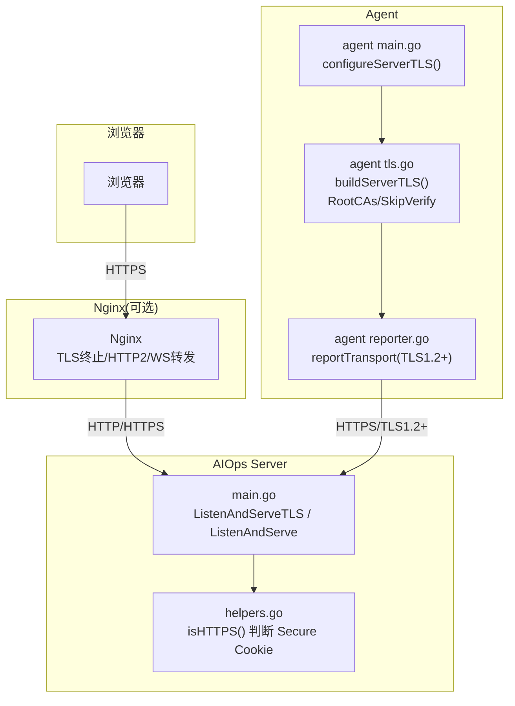
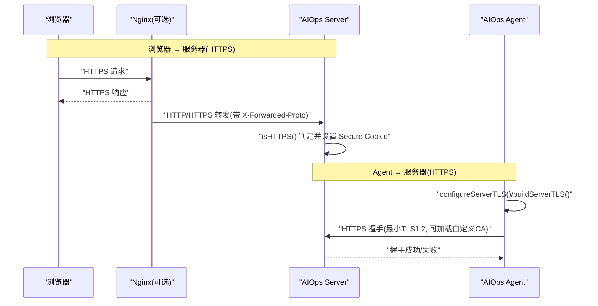
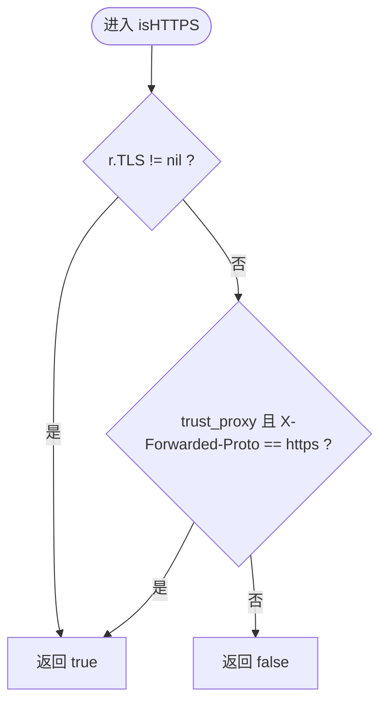
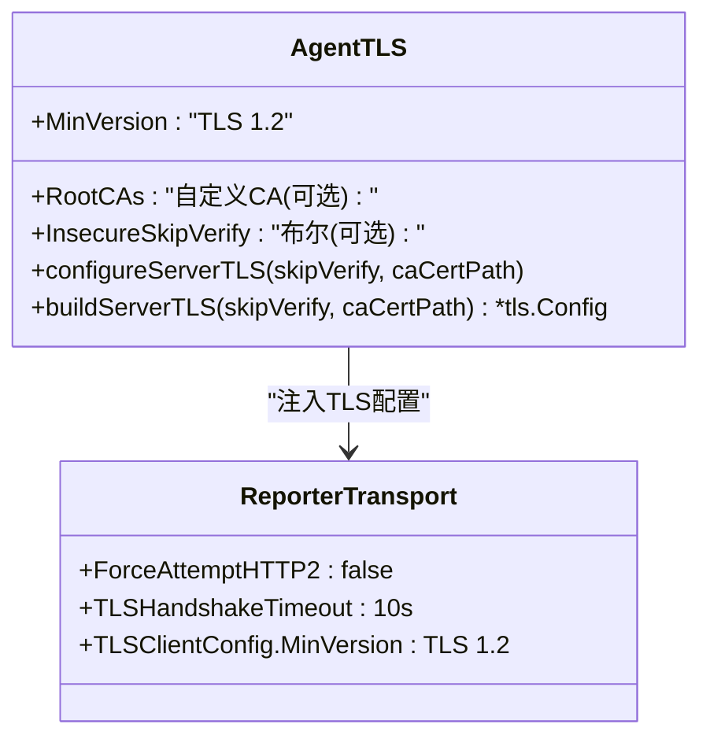
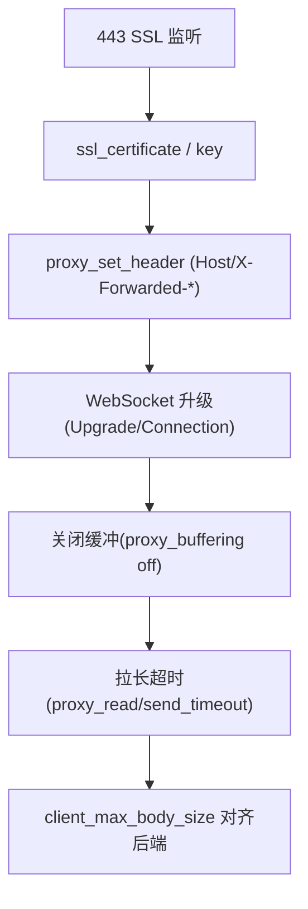
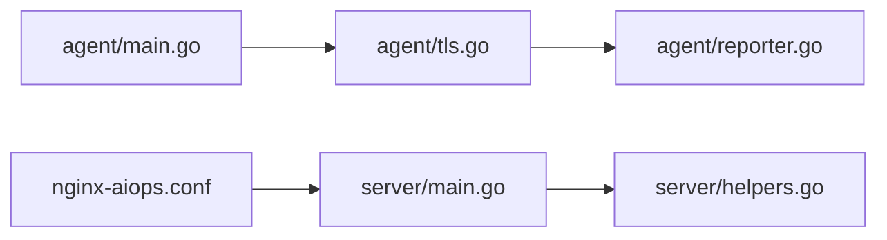

# 传输层安全

<cite>
**本文引用的文件**   
- [cmd/server/main.go](file://cmd/server/main.go)
- [cmd/agent/tls.go](file://cmd/agent/tls.go)
- [cmd/agent/main.go](file://cmd/agent/main.go)
- [cmd/agent/reporter.go](file://cmd/agent/reporter.go)
- [cmd/server/helpers.go](file://cmd/server/helpers.go)
- [deploy/nginx-aiops.conf](file://deploy/nginx-aiops.conf)
- [README.md](file://README.md)
</cite>

## 目录
1. [简介](#简介)
2. [项目结构](#项目结构)
3. [核心组件](#核心组件)
4. [架构总览](#架构总览)
5. [详细组件分析](#详细组件分析)
6. [依赖关系分析](#依赖关系分析)
7. [性能与加密特性](#性能与加密特性)
8. [部署指南](#部署指南)
9. [测试与验证](#测试与验证)
10. [故障排除](#故障排除)
11. [结论](#结论)

## 简介
本文件面向 AIOps Monitor 的传输层安全，聚焦 TLS/HTTPS 配置、证书管理、双向认证机制（含服务端与客户端侧）、安全连接建立流程、证书校验策略、加密算法选择、反向代理集成、安全头设置、以及测试与排障方法。文档同时覆盖 Agent 到 Server 的 HTTPS 通信与浏览器到 Server 的 HTTPS 访问路径，确保端到端机密性与完整性。

## 项目结构
与传输层安全直接相关的代码与配置主要分布在以下位置：
- 服务端监听与 TLS 启动：cmd/server/main.go
- 服务端 HTTPS 判定与安全头：cmd/server/helpers.go、cmd/server/main.go
- Agent 客户端 TLS 构建与应用：cmd/agent/tls.go、cmd/agent/main.go、cmd/agent/reporter.go
- Nginx 反代示例（TLS 终止）：deploy/nginx-aiops.conf
- 环境变量说明（含 AIOPS_TLS_CERT/AIOPS_TLS_KEY）：README.md

图表来源
- [cmd/server/main.go:335-354](file://cmd/server/main.go#L335-L354)
- [cmd/server/helpers.go:84-97](file://cmd/server/helpers.go#L84-L97)
- [cmd/agent/tls.go:19-39](file://cmd/agent/tls.go#L19-L39)
- [cmd/agent/main.go:122-124](file://cmd/agent/main.go#L122-L124)
- [cmd/agent/reporter.go:33-49](file://cmd/agent/reporter.go#L33-L49)
- [deploy/nginx-aiops.conf:18-60](file://deploy/nginx-aiops.conf#L18-L60)

章节来源
- [cmd/server/main.go:335-354](file://cmd/server/main.go#L335-L354)
- [cmd/server/helpers.go:84-97](file://cmd/server/helpers.go#L84-L97)
- [cmd/agent/tls.go:19-39](file://cmd/agent/tls.go#L19-L39)
- [cmd/agent/main.go:122-124](file://cmd/agent/main.go#L122-L124)
- [cmd/agent/reporter.go:33-49](file://cmd/agent/reporter.go#L33-L49)
- [deploy/nginx-aiops.conf:18-60](file://deploy/nginx-aiops.conf#L18-L60)

## 核心组件
- 服务端 TLS 启动与回退
  - 通过环境变量 AIOPS_TLS_CERT 与 AIOPS_TLS_KEY 提供证书与私钥，启用 HTTPS；未配置则降级为 HTTP 并输出告警日志。
  - 当启用 HTTPS 时，isHTTPS(r) 返回 true，从而自动为会话 Cookie 设置 Secure 标志。
- Agent 客户端 TLS 信任链
  - 支持自定义 CA 证书（PEM），用于信任自签名或私有 CA 签发的服务端证书。
  - 提供跳过校验开关（仅建议临时/内网自签场景使用），默认最小 TLS 版本为 1.2。
  - 将 TLS 配置应用到所有 Agent→Server 的 HTTP 客户端传输。
- 反向代理集成
  - Nginx 示例包含 WebSocket 升级、长连接超时、上传大小限制等关键项，确保终端与端口转发在 TLS 终止后正常工作。

章节来源
- [cmd/server/main.go:335-354](file://cmd/server/main.go#L335-L354)
- [cmd/server/helpers.go:84-97](file://cmd/server/helpers.go#L84-L97)
- [cmd/agent/tls.go:19-39](file://cmd/agent/tls.go#L19-L39)
- [cmd/agent/main.go:122-124](file://cmd/agent/main.go#L122-L124)
- [cmd/agent/reporter.go:33-49](file://cmd/agent/reporter.go#L33-L49)
- [deploy/nginx-aiops.conf:18-60](file://deploy/nginx-aiops.conf#L18-L60)

## 架构总览
下图展示浏览器与 Agent 两端分别与服务端的安全连接建立过程，包括 TLS 握手、证书校验、Cookie Secure 标志设置及反向代理透传。

图表来源
- [cmd/server/main.go:335-354](file://cmd/server/main.go#L335-L354)
- [cmd/server/helpers.go:84-97](file://cmd/server/helpers.go#L84-L97)
- [cmd/agent/tls.go:19-39](file://cmd/agent/tls.go#L19-L39)
- [cmd/agent/main.go:122-124](file://cmd/agent/main.go#L122-L124)
- [deploy/nginx-aiops.conf:18-60](file://deploy/nginx-aiops.conf#L18-L60)

## 详细组件分析

### 服务端 TLS/HTTPS 启动与 Cookie Secure 策略
- 启动逻辑
  - 读取环境变量 AIOPS_TLS_CERT 与 AIOPS_TLS_KEY，若均非空则调用 ListenAndServeTLS 以 HTTPS 提供服务；否则以 HTTP 服务并输出警告。
- isHTTPS 判定
  - 优先检查 r.TLS 是否为 nil；若启用了 trust_proxy，则允许基于 X-Forwarded-Proto=https 判定为 HTTPS。
  - 该判定直接影响会话 Cookie 的 Secure 标志设置，避免在非 HTTPS 环境下泄露。
- 安全头
  - 全局中间件设置 X-Content-Type-Options、X-Frame-Options、Referrer-Policy、CSP 等加固头，降低 XSS/点击劫持风险。

图表来源
- [cmd/server/helpers.go:84-97](file://cmd/server/helpers.go#L84-L97)
- [cmd/server/main.go:335-354](file://cmd/server/main.go#L335-L354)

章节来源
- [cmd/server/main.go:335-354](file://cmd/server/main.go#L335-L354)
- [cmd/server/helpers.go:84-97](file://cmd/server/helpers.go#L84-L97)

### Agent 客户端 TLS 配置与证书信任
- 最小协议版本
  - 强制最低 TLS 版本为 1.2，禁用旧版协议以降低安全风险。
- 自定义 CA 证书
  - 支持从 PEM 文件加载自定义 CA 根证书池，用于信任自签名或私有 CA 的服务端证书。
- 跳过校验（不推荐）
  - 提供 InsecureSkipVerify 选项，仅在临时/内网自签环境使用，存在中间人攻击风险。
- 应用范围
  - configureServerTLS 将 TLS 配置注入到所有 Agent→Server 的 HTTP 客户端传输中，包括上报、终端、端口转发、日志采集与中继上游。

图表来源
- [cmd/agent/tls.go:19-39](file://cmd/agent/tls.go#L19-L39)
- [cmd/agent/tls.go:47-73](file://cmd/agent/tls.go#L47-L73)
- [cmd/agent/reporter.go:33-49](file://cmd/agent/reporter.go#L33-L49)
- [cmd/agent/main.go:122-124](file://cmd/agent/main.go#L122-L124)

章节来源
- [cmd/agent/tls.go:19-39](file://cmd/agent/tls.go#L19-L39)
- [cmd/agent/tls.go:47-73](file://cmd/agent/tls.go#L47-L73)
- [cmd/agent/reporter.go:33-49](file://cmd/agent/reporter.go#L33-L49)
- [cmd/agent/main.go:122-124](file://cmd/agent/main.go#L122-L124)

### 反向代理（Nginx）TLS 终止与 WebSocket 支持
- TLS 终止
  - 监听 443，启用 http2，配置 ssl_certificate 与 ssl_certificate_key。
- 关键头部与超时
  - 设置 Host、X-Real-IP、X-Forwarded-For、X-Forwarded-Proto、X-Forwarded-Host。
  - 针对远程终端与端口转发，必须转发 Upgrade 与 Connection 头，关闭缓冲，拉长读写超时。
- 上传大小
  - client_max_body_size 与服务端 maxBodyBytes 对齐，避免大文件被提前截断。

图表来源
- [deploy/nginx-aiops.conf:18-60](file://deploy/nginx-aiops.conf#L18-L60)

章节来源
- [deploy/nginx-aiops.conf:18-60](file://deploy/nginx-aiops.conf#L18-L60)

## 依赖关系分析
- 服务端
  - main.go 负责根据环境变量决定是否启用 TLS；helpers.go 提供 isHTTPS 判定，影响 Cookie Secure 标志。
- Agent
  - agent main.go 在启动阶段调用 configureServerTLS，将 TLS 配置应用到各 HTTP 客户端；tls.go 负责构建 tls.Config；reporter.go 定义共享传输并强制 TLS 1.2+。
- 反向代理
  - nginx-aiops.conf 作为 TLS 终止点，将安全上下文通过 X-Forwarded-Proto 传递给后端，确保 isHTTPS 正确判定。

图表来源
- [cmd/server/main.go:335-354](file://cmd/server/main.go#L335-L354)
- [cmd/server/helpers.go:84-97](file://cmd/server/helpers.go#L84-L97)
- [cmd/agent/main.go:122-124](file://cmd/agent/main.go#L122-L124)
- [cmd/agent/tls.go:19-39](file://cmd/agent/tls.go#L19-L39)
- [cmd/agent/reporter.go:33-49](file://cmd/agent/reporter.go#L33-L49)
- [deploy/nginx-aiops.conf:18-60](file://deploy/nginx-aiops.conf#L18-L60)

章节来源
- [cmd/server/main.go:335-354](file://cmd/server/main.go#L335-L354)
- [cmd/server/helpers.go:84-97](file://cmd/server/helpers.go#L84-L97)
- [cmd/agent/main.go:122-124](file://cmd/agent/main.go#L122-L124)
- [cmd/agent/tls.go:19-39](file://cmd/agent/tls.go#L19-L39)
- [cmd/agent/reporter.go:33-49](file://cmd/agent/reporter.go#L33-L49)
- [deploy/nginx-aiops.conf:18-60](file://deploy/nginx-aiops.conf#L18-L60)

## 性能与加密特性
- 最小协议版本
  - 服务端与 Agent 均强制 TLS 1.2+，禁用旧版协议。
- HTTP/2
  - Agent 侧显式禁用 HTTP/2（ForceAttemptHTTP2=false），以提升服务端重启后的恢复速度；Nginx 侧启用 http2 以获得更好的多路复用性能。
- 握手与连接
  - Agent 侧设置 TLSHandshakeTimeout 与 KeepAlive，减少频繁握手的开销。
- 压缩与带宽
  - 服务端对文本/JSON 响应启用 gzip 压缩，降低带宽占用（不影响 WebSocket 与流式通道）。

章节来源
- [cmd/agent/reporter.go:33-49](file://cmd/agent/reporter.go#L33-L49)
- [cmd/agent/tls.go:62-73](file://cmd/agent/tls.go#L62-L73)
- [deploy/nginx-aiops.conf:18-20](file://deploy/nginx-aiops.conf#L18-L20)

## 部署指南

### 服务端直出 HTTPS（无反向代理）
- 准备证书与私钥
  - 生成或获取证书与私钥文件（例如 fullchain.pem 与 privkey.pem）。
- 设置环境变量
  - AIOPS_TLS_CERT=证书路径
  - AIOPS_TLS_KEY=私钥路径
- 启动服务
  - 程序检测到两个变量均非空后，将以 HTTPS 模式启动；isHTTPS 判定为真，会话 Cookie 自动设置 Secure。
- 注意事项
  - 生产环境务必启用 TLS；未启用时将输出明确警告。

章节来源
- [cmd/server/main.go:335-354](file://cmd/server/main.go#L335-L354)
- [cmd/server/helpers.go:84-97](file://cmd/server/helpers.go#L84-L97)
- [README.md:556-573](file://README.md#L556-L573)

### 通过 Nginx 进行 TLS 终止
- 证书放置
  - 将证书与私钥放入 /etc/nginx/ssl/ 目录。
- 启用 HTTPS 与 HTTP2
  - listen 443 ssl; http2 on;
- 关键配置
  - proxy_set_header Host/X-Real-IP/X-Forwarded-For/X-Forwarded-Proto/X-Forwarded-Host
  - WebSocket 升级：proxy_set_header Upgrade $http_upgrade; proxy_set_header Connection $connection_upgrade;
  - 关闭缓冲：proxy_buffering off; proxy_request_buffering off;
  - 超时：proxy_read_timeout 86400s; proxy_send_timeout 86400s;
  - 上传大小：client_max_body_size 100m（与服务端对齐）
- 80→443 跳转
  - 可选 server 块 return 301 https://$host$request_uri;

章节来源
- [deploy/nginx-aiops.conf:18-60](file://deploy/nginx-aiops.conf#L18-L60)

### 自签名证书与 CA 证书管理（Agent 侧）
- 自签名证书
  - 服务端使用自签名证书时，Agent 需配置 ca_cert 指向包含签发 CA 的 PEM 文件，以便完成证书链校验。
- 跳过校验（仅临时/内网）
  - 可通过 tls_skip_verify=true 跳过校验，但会暴露于中间人攻击风险，不建议在生产使用。
- 配置文件字段
  - ca_cert：自定义 CA 证书路径（PEM）
  - tls_skip_verify：是否跳过服务端证书校验（布尔）

章节来源
- [cmd/agent/tls.go:19-39](file://cmd/agent/tls.go#L19-L39)
- [cmd/agent/main.go:108-110](file://cmd/agent/main.go#L108-L110)
- [config.example.json:1-16](file://config.example.json#L1-L16)

### TLS 版本控制与安全头设置
- TLS 版本
  - 服务端与 Agent 均强制最小 TLS 1.2。
- 安全头
  - 服务端中间件设置 X-Content-Type-Options=nosniff、X-Frame-Options=DENY、Referrer-Policy=no-referrer、CSP 等，增强前端安全性。

章节来源
- [cmd/agent/reporter.go:33-49](file://cmd/agent/reporter.go#L33-L49)
- [cmd/server/main.go:113-136](file://cmd/server/main.go#L113-L136)

## 测试与验证

### 基础连通性测试
- 浏览器访问
  - 使用 https://域名 访问 Web UI，确认页面正常加载且地址栏显示锁图标。
- Agent 上报
  - 观察 Agent 日志，确认“已加载自定义 CA 证书”或“已启用 TLS/HTTPS（加密传输）”等信息。

章节来源
- [cmd/server/main.go:335-354](file://cmd/server/main.go#L335-L354)
- [cmd/agent/tls.go:22-31](file://cmd/agent/tls.go#L22-L31)

### 证书与协议验证
- 查看协商协议
  - 使用 openssl s_client -connect 域名:443 -tls1_2 验证 TLS 版本与证书链。
- 检查安全头
  - 使用 curl -I https://域名 检查响应头是否包含 X-Content-Type-Options、X-Frame-Options、Referrer-Policy、CSP 等。

章节来源
- [cmd/server/main.go:113-136](file://cmd/server/main.go#L113-L136)

### 反向代理链路验证
- WebSocket 终端
  - 打开远程终端，确认能建立连接并保持活跃（Nginx 已开启 Upgrade/Connection 与长超时）。
- 大文件上传/端口转发
  - 确认 client_max_body_size 与服务端 maxBodyBytes 一致，避免 413 错误。

章节来源
- [deploy/nginx-aiops.conf:44-58](file://deploy/nginx-aiops.conf#L44-L58)
- [cmd/server/main.go:104-145](file://cmd/server/main.go#L104-L145)

## 故障排除

### 常见问题与定位
- 未启用 TLS 导致登录凭据明文传输
  - 现象：控制台输出“未配置 TLS（AIOPS_TLS_CERT/AIOPS_TLS_KEY）：以明文 HTTP 提供服务”。
  - 处理：设置 AIOPS_TLS_CERT 与 AIOPS_TLS_KEY 或通过 Nginx 终止 TLS。
- 自签名证书不被信任
  - 现象：Agent 无法连接服务端，提示证书校验失败。
  - 处理：在 Agent 配置中设置 ca_cert 指向包含 CA 的 PEM 文件；避免使用 tls_skip_verify。
- 反向代理下 Cookie 未设置 Secure
  - 现象：在非 HTTPS 环境下 Cookie 未标记 Secure。
  - 处理：确保 Nginx 设置 X-Forwarded-Proto=https，并在服务端启用 trust_proxy。
- 终端无法连接或频繁断开
  - 现象：指标正常但终端连不上。
  - 处理：检查 Nginx 的 Upgrade/Connection 头、关闭缓冲、拉长超时时间。

章节来源
- [cmd/server/main.go:335-354](file://cmd/server/main.go#L335-L354)
- [cmd/agent/tls.go:22-31](file://cmd/agent/tls.go#L22-L31)
- [cmd/server/helpers.go:84-97](file://cmd/server/helpers.go#L84-L97)
- [deploy/nginx-aiops.conf:44-58](file://deploy/nginx-aiops.conf#L44-L58)

## 结论
AIOps Monitor 在服务端与 Agent 两端均已实现严格的 TLS/HTTPS 支持：服务端通过环境变量启用 HTTPS 并自动设置 Secure Cookie；Agent 强制 TLS 1.2+，支持自定义 CA 与可选跳过校验（仅限临时场景）。配合 Nginx 的反向代理与 WebSocket 优化，可实现端到端的安全传输与稳定的实时交互。生产环境应始终启用 TLS，谨慎管理证书与 CA，并通过测试与监控持续验证安全策略的有效性。