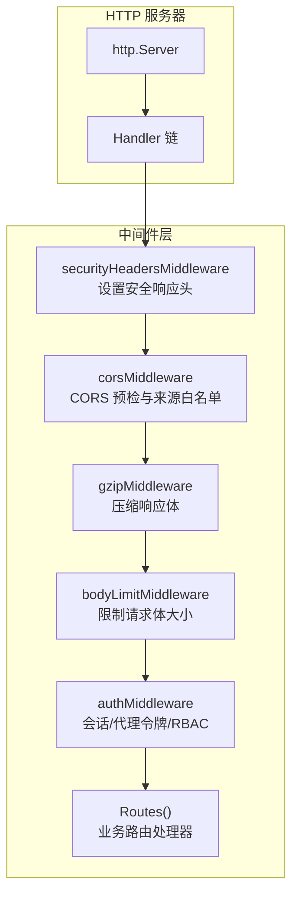
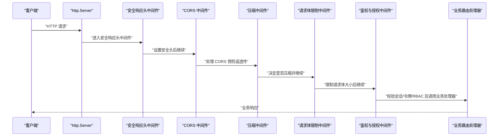
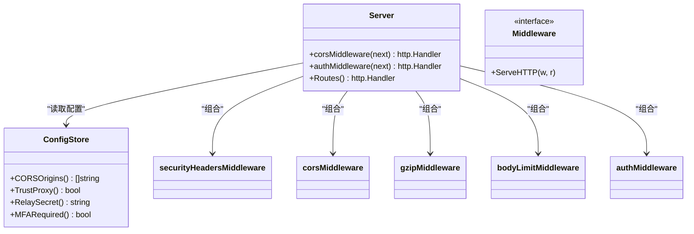

# 安全中间件

<cite>
**本文引用的文件**   
- [cmd/server/main.go](file://cmd/server/main.go)
- [cmd/server/auth.go](file://cmd/server/auth.go)
- [cmd/server/config.go](file://cmd/server/config.go)
- [cmd/server/security_test.go](file://cmd/server/security_test.go)
</cite>

## 目录
1. [简介](#简介)
2. [项目结构](#项目结构)
3. [核心组件](#核心组件)
4. [架构总览](#架构总览)
5. [详细组件分析](#详细组件分析)
6. [依赖关系分析](#依赖关系分析)
7. [性能考量](#性能考量)
8. [故障排查指南](#故障排查指南)
9. [结论](#结论)
10. [附录](#附录)

## 简介
本文件聚焦 AIOps Monitor 的 HTTP 安全中间件链，系统性说明请求处理链路、安全头设置、CORS 策略、内容安全策略（CSP）、点击劫持防护（X-Frame-Options）以及中间件的执行顺序。同时提供自定义安全中间件开发建议、安全日志记录要点、配置示例与性能优化建议，帮助读者在生产环境中正确部署和扩展安全能力。

## 项目结构
与安全中间件直接相关的代码集中在服务端主入口与认证模块中：
- 中间件定义与组装：位于服务启动处，统一包裹路由处理器
- CORS 策略：基于配置的白名单或兼容模式
- 安全响应头：包含 CSP、X-Frame-Options、Referrer-Policy、X-Content-Type-Options 等
- 请求体限制：防止超大负载导致内存耗尽
- 压缩：对文本/JSON 响应启用 gzip，跳过流式通道
- 鉴权与授权：会话校验、代理令牌、RBAC 控制

图表来源
- [cmd/server/main.go:71-102](file://cmd/server/main.go#L71-L102)
- [cmd/server/main.go:112-145](file://cmd/server/main.go#L112-L145)
- [cmd/server/main.go:189-205](file://cmd/server/main.go#L189-L205)
- [cmd/server/main.go:293-294](file://cmd/server/main.go#L293-L294)
- [cmd/server/auth.go:110-172](file://cmd/server/auth.go#L110-L172)

章节来源
- [cmd/server/main.go:71-102](file://cmd/server/main.go#L71-L102)
- [cmd/server/main.go:112-145](file://cmd/server/main.go#L112-L145)
- [cmd/server/main.go:189-205](file://cmd/server/main.go#L189-L205)
- [cmd/server/main.go:293-294](file://cmd/server/main.go#L293-L294)
- [cmd/server/auth.go:110-172](file://cmd/server/auth.go#L110-L172)

## 核心组件
本节概述各安全中间件职责与关键行为，并给出实现位置参考。

- 安全响应头中间件
  - 作用：为所有响应添加保守的安全头，包括禁止 MIME 嗅探、禁止被嵌入框架、严格 Referrer 策略、严格的 CSP（除 /proxy/ 路径）。
  - 关键点：/proxy/ 路径不注入 CSP，避免影响目标站点资源加载；其他路径强制 script-src 'self'，阻断内联脚本执行。
  - 参考实现位置：[cmd/server/main.go:112-136](file://cmd/server/main.go#L112-L136)

- CORS 中间件
  - 作用：支持跨域访问，并在预检 OPTIONS 请求时快速返回；当配置了可信来源列表时仅回显匹配的 Origin，否则使用通配符以兼容旧版本。
  - 关键点：Vary: Origin 用于缓存友好；未匹配来源则不返回 Access-Control-Allow-Origin，浏览器将拒绝跨域。
  - 参考实现位置：[cmd/server/main.go:71-102](file://cmd/server/main.go#L71-L102)

- 请求体限制中间件
  - 作用：通过 MaxBytesReader 限制请求体大小，防止恶意或异常客户端占用过多内存。
  - 关键点：常量上限适用于大多数场景；转发代理相关路径可放宽（由上层逻辑决定）。
  - 参考实现位置：[cmd/server/main.go:137-145](file://cmd/server/main.go#L137-L145)

- 压缩中间件
  - 作用：对接受 gzip 的客户端压缩文本/JSON 响应，提升带宽效率；跳过 WebSocket 升级、终端、转发与代理路径以避免缓冲。
  - 关键点：复用 gzip.Writer 池减少分配开销；动态删除 Content-Length 并设置 Content-Encoding。
  - 参考实现位置：[cmd/server/main.go:189-205](file://cmd/server/main.go#L189-L205)

- 鉴权与授权中间件
  - 作用：非公开路径需有效会话或代理令牌，并进行 RBAC 检查；支持中继共享密钥校验、全局 MFA 受限会话、代理令牌二次复核。
  - 关键点：公开路径清单、代理令牌优先级（Cookie > Query）、受限会话仅允许 MFA 相关端点。
  - 参考实现位置：[cmd/server/auth.go:110-172](file://cmd/server/auth.go#L110-L172)

章节来源
- [cmd/server/main.go:71-102](file://cmd/server/main.go#L71-L102)
- [cmd/server/main.go:112-145](file://cmd/server/main.go#L112-L145)
- [cmd/server/main.go:189-205](file://cmd/server/main.go#L189-L205)
- [cmd/server/auth.go:110-172](file://cmd/server/auth.go#L110-L172)

## 架构总览
下图展示了请求进入 http.Server 后，依次经过安全中间件链并最终到达业务路由的流程。

图表来源
- [cmd/server/main.go:293-294](file://cmd/server/main.go#L293-L294)
- [cmd/server/main.go:71-102](file://cmd/server/main.go#L71-L102)
- [cmd/server/main.go:112-145](file://cmd/server/main.go#L112-L145)
- [cmd/server/main.go:189-205](file://cmd/server/main.go#L189-L205)
- [cmd/server/auth.go:110-172](file://cmd/server/auth.go#L110-L172)

## 详细组件分析

### CORS 配置与策略
- 配置项
  - cors_origins：字符串数组，指定允许的 Origin 列表；为空时使用通配符兼容旧版。
  - 读取接口：ConfigStore.CORSOrigins()
- 行为
  - 若存在 Origin 且命中白名单，则回显 Access-Control-Allow-Origin 为该值，并设置 Vary: Origin。
  - 若未配置白名单，则回显通配符。
  - 对于 OPTIONS 预检请求，直接返回 204 No Content。
- 风险与建议
  - 生产环境务必配置 cors_origins，避免通配符带来的跨站风险。
  - 确保前端与后端域名一致或使用明确子域白名单。

章节来源
- [cmd/server/main.go:71-102](file://cmd/server/main.go#L71-L102)
- [cmd/server/config.go:481-488](file://cmd/server/config.go#L481-L488)
- [cmd/server/config.go:775-781](file://cmd/server/config.go#L775-L781)

### Content Security Policy（CSP）
- 策略要点
  - 默认源 self，脚本仅允许自身资源，样式允许 unsafe-inline（无脚本执行风险），图片/字体允许 data:，连接仅限 self，禁用 object-src，限制 base-uri 与 form-action，禁止 frame-ancestors。
  - /proxy/ 路径不注入 CSP，避免影响目标站点资源加载。
- 效果
  - 阻止内联脚本执行，降低存储型 XSS 风险。
  - 限制跨域数据外泄与框架嵌套。
- 调整建议
  - 如需引入第三方脚本或服务，按需扩展对应指令（如 script-src/connect-src），并最小化权限。

章节来源
- [cmd/server/main.go:112-136](file://cmd/server/main.go#L112-L136)

### X-Frame-Options 与点击劫持防护
- 设置
  - X-Frame-Options: DENY，禁止页面被任何框架嵌入。
- 效果
  - 有效防御点击劫持攻击。
- 替代方案
  - 在 CSP 中使用 frame-ancestors 'none' 同样可实现强保护，二者配合更佳。

章节来源
- [cmd/server/main.go:112-136](file://cmd/server/main.go#L112-L136)

### 请求过滤机制
- 公开路径白名单
  - 登录、健康检查、静态资源、安装脚本、Agent 上报与反向通道等无需会话即可访问。
- 代理令牌鉴权
  - /proxy/ 路径支持 Cookie 或查询参数中的代理令牌，优先 Cookie；令牌签发要求 operator+，但仍按当前角色复核 RBAC。
- 中继共享密钥
  - 当配置 RelaySecret 时，携带 X-Relay-Secret 的请求必须匹配，否则拒绝。
- 全局 MFA 受限会话
  - 当全局强制 MFA 开启且用户未完成 MFA 注册，会话受限，仅允许 MFA 相关端点。

章节来源
- [cmd/server/auth.go:15-49](file://cmd/server/auth.go#L15-L49)
- [cmd/server/auth.go:110-172](file://cmd/server/auth.go#L110-L172)

### 响应安全头设置
- 已设置头部
  - X-Content-Type-Options: nosniff
  - X-Frame-Options: DENY
  - Referrer-Policy: no-referrer
  - Content-Security-Policy: 详见上文
- 目的
  - 防止 MIME 类型混淆、点击劫持、Referer 泄露与跨站脚本执行。

章节来源
- [cmd/server/main.go:112-136](file://cmd/server/main.go#L112-L136)

### 中间件执行顺序
- 外层到内层顺序（从请求进入角度）
  1) securityHeadersMiddleware
  2) corsMiddleware
  3) gzipMiddleware
  4) bodyLimitMiddleware
  5) authMiddleware
  6) Routes()
- 原因
  - 先设置安全头，再处理跨域与压缩，最后进行请求体限制与鉴权，确保响应头始终完整且鉴权失败也能返回安全响应。

章节来源
- [cmd/server/main.go:293-294](file://cmd/server/main.go#L293-L294)

### 自定义安全中间件开发
- 插入位置
  - 在服务启动处组合中间件链，将自定义中间件置于合适层级（例如在鉴权前做审计日志，或在鉴权后做敏感操作审计）。
- 设计原则
  - 幂等与短耗时：避免阻塞请求主线。
  - 错误隔离：自定义中间件不应吞掉业务错误，应透传或记录上下文。
  - 安全头一致性：不要覆盖已有的安全头，除非有充分理由。
- 参考位置
  - 中间件组合入口：[cmd/server/main.go:293-294](file://cmd/server/main.go#L293-L294)
  - 现有中间件范式：[cmd/server/main.go:71-102](file://cmd/server/main.go#L71-L102)、[cmd/server/main.go:112-145](file://cmd/server/main.go#L112-L145)、[cmd/server/main.go:189-205](file://cmd/server/main.go#L189-L205)

### 安全日志记录
- 登录失败与 TOTP 失败
  - 记录 IP、账号、失败原因，便于审计与告警。
- 中继密钥不匹配
  - 记录警告日志，标记来源 IP。
- 密码修改与 MFA 变更
  - 记录操作前后状态，便于追踪。
- 参考实现位置
  - 登录失败与 TOTP 失败：[cmd/server/auth.go:211-248](file://cmd/server/auth.go#L211-L248)
  - 中继密钥不匹配：[cmd/server/auth.go:110-172](file://cmd/server/auth.go#L110-L172)
  - 密码修改与 MFA 变更：[cmd/server/auth.go:432-467](file://cmd/server/auth.go#L432-L467)、[cmd/server/auth.go:560-585](file://cmd/server/auth.go#L560-L585)

## 依赖关系分析
- 配置依赖
  - CORSOrigins：控制跨域策略
  - TrustProxy：是否信任反向代理的客户端 IP 头（影响限流与审计）
  - RelaySecret：中继共享密钥
  - MFARequired：全局 MFA 强制策略
- 运行时依赖
  - 会话与代理令牌：由认证模块维护
  - 审计日志：写入统一存储

图表来源
- [cmd/server/config.go:775-781](file://cmd/server/config.go#L775-L781)
- [cmd/server/main.go:71-102](file://cmd/server/main.go#L71-L102)
- [cmd/server/main.go:112-145](file://cmd/server/main.go#L112-L145)
- [cmd/server/main.go:189-205](file://cmd/server/main.go#L189-L205)
- [cmd/server/auth.go:110-172](file://cmd/server/auth.go#L110-L172)

章节来源
- [cmd/server/config.go:775-781](file://cmd/server/config.go#L775-L781)
- [cmd/server/main.go:71-102](file://cmd/server/main.go#L71-L102)
- [cmd/server/main.go:112-145](file://cmd/server/main.go#L112-L145)
- [cmd/server/main.go:189-205](file://cmd/server/main.go#L189-L205)
- [cmd/server/auth.go:110-172](file://cmd/server/auth.go#L110-L172)

## 性能考量
- 压缩
  - 复用 gzip.Writer 池，减少 GC 压力；跳过流式与代理路径，避免额外缓冲。
  - 参考：[cmd/server/main.go:189-205](file://cmd/server/main.go#L189-L205)
- 请求体限制
  - 使用 MaxBytesReader 限制最大请求体，防止内存耗尽。
  - 参考：[cmd/server/main.go:137-145](file://cmd/server/main.go#L137-L145)
- 响应头设置
  - 在中间件早期设置安全头，避免重复计算与分支判断。
  - 参考：[cmd/server/main.go:112-136](file://cmd/server/main.go#L112-L136)
- 网络超时
  - ReadHeaderTimeout 防慢头攻击；IdleTimeout 控制空闲连接回收。
  - 参考：[cmd/server/main.go:295-303](file://cmd/server/main.go#L295-L303)

## 故障排查指南
- 跨域问题
  - 现象：浏览器控制台报跨域错误或预检失败。
  - 排查：确认 cors_origins 是否包含实际 Origin；检查 Vary: Origin 是否正确设置；OPTIONS 预检是否返回 204。
  - 参考：[cmd/server/main.go:71-102](file://cmd/server/main.go#L71-L102)
- CSP 报错
  - 现象：控制台报 CSP 违规，资源加载失败。
  - 排查：确认是否为 /proxy/ 路径（该路径不注入 CSP）；如需引入外部资源，谨慎扩展 CSP 指令。
  - 参考：[cmd/server/main.go:112-136](file://cmd/server/main.go#L112-L136)
- 代理令牌无效
  - 现象：/proxy/ 路径返回 403 或 401。
  - 排查：确认代理令牌是否有效；检查当前用户角色是否满足 RBAC；注意 Cookie 与 Query 参数的优先级。
  - 参考：[cmd/server/auth.go:130-152](file://cmd/server/auth.go#L130-L152)
- 中继密钥不匹配
  - 现象：携带 X-Relay-Secret 的请求被拒绝。
  - 排查：核对 RelaySecret 配置与请求头值是否一致；查看系统日志中的警告条目。
  - 参考：[cmd/server/auth.go:110-172](file://cmd/server/auth.go#L110-L172)
- 全局 MFA 受限
  - 现象：登录后只能访问 MFA 相关端点。
  - 排查：确认全局 MFA 策略是否开启；用户是否完成 MFA 注册。
  - 参考：[cmd/server/auth.go:158-165](file://cmd/server/auth.go#L158-L165)

章节来源
- [cmd/server/main.go:71-102](file://cmd/server/main.go#L71-L102)
- [cmd/server/main.go:112-136](file://cmd/server/main.go#L112-L136)
- [cmd/server/auth.go:110-172](file://cmd/server/auth.go#L110-L172)

## 结论
AIOps Monitor 的安全中间件链以“安全头先行、跨域可控、压缩高效、请求体受控、鉴权严谨”为核心原则，结合 CSP、X-Frame-Options、Referrer-Policy 等响应头强化前端安全，并通过 CORS 白名单、代理令牌与 RBAC 保障 API 访问安全。生产环境建议：
- 配置 cors_origins，关闭通配符
- 保持 CSP 严格策略，按需最小化扩展
- 启用 TLS/HTTPS，确保会话 Cookie 的 Secure 标志生效
- 合理设置中继共享密钥与全局 MFA 策略
- 监控安全日志，及时响应异常

## 附录

### 中间件配置示例
- 配置 CORS 白名单
  - 在 server_config.json 中添加 cors_origins 字段，填入允许的 Origin 列表。
  - 参考：[cmd/server/config.go:481-488](file://cmd/server/config.go#L481-L488)
- 环境变量覆盖
  - 可通过 AIOPS_* 环境变量覆盖部分配置（如 relay_secret、trust_proxy 等）。
  - 参考：[cmd/server/config.go:619-654](file://cmd/server/config.go#L619-L654)

章节来源
- [cmd/server/config.go:481-488](file://cmd/server/config.go#L481-L488)
- [cmd/server/config.go:619-654](file://cmd/server/config.go#L619-L654)

### 测试用例参考
- 账户锁定与 TOTP 单用性
  - 验证登录失败阈值与 TOTP 重放保护。
  - 参考：[cmd/server/security_test.go:12-46](file://cmd/server/security_test.go#L12-L46)
- 主机列表与配置脱敏
  - 验证敏感信息不在响应中泄露。
  - 参考：[cmd/server/security_test.go:48-118](file://cmd/server/security_test.go#L48-L118)
- 密钥加密往返
  - 验证 AES-GCM 加密与明文兼容。
  - 参考：[cmd/server/security_test.go:120-175](file://cmd/server/security_test.go#L120-L175)

章节来源
- [cmd/server/security_test.go:12-46](file://cmd/server/security_test.go#L12-L46)
- [cmd/server/security_test.go:48-118](file://cmd/server/security_test.go#L48-L118)
- [cmd/server/security_test.go:120-175](file://cmd/server/security_test.go#L120-L175)