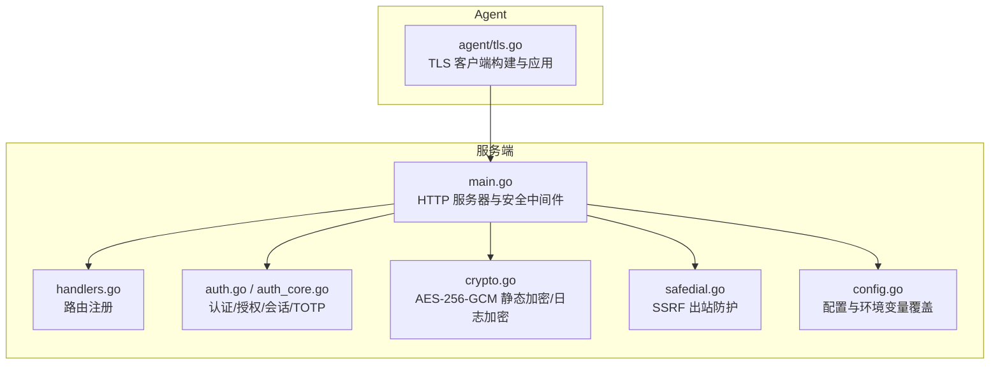
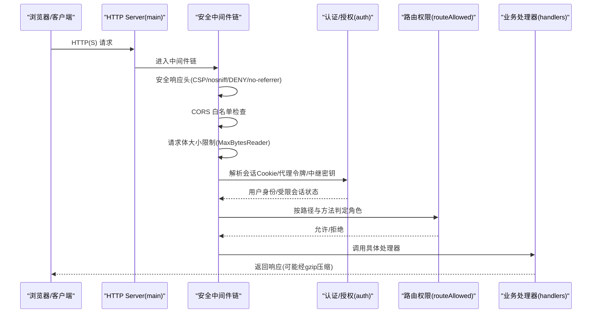
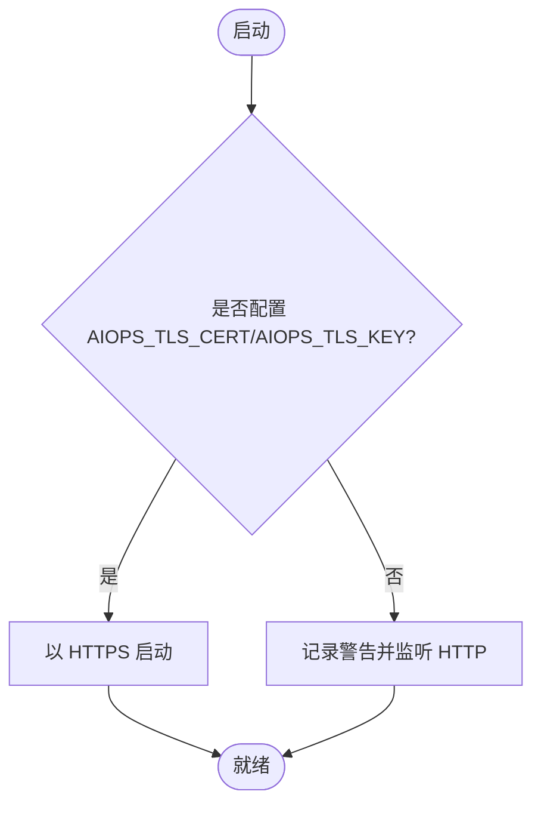
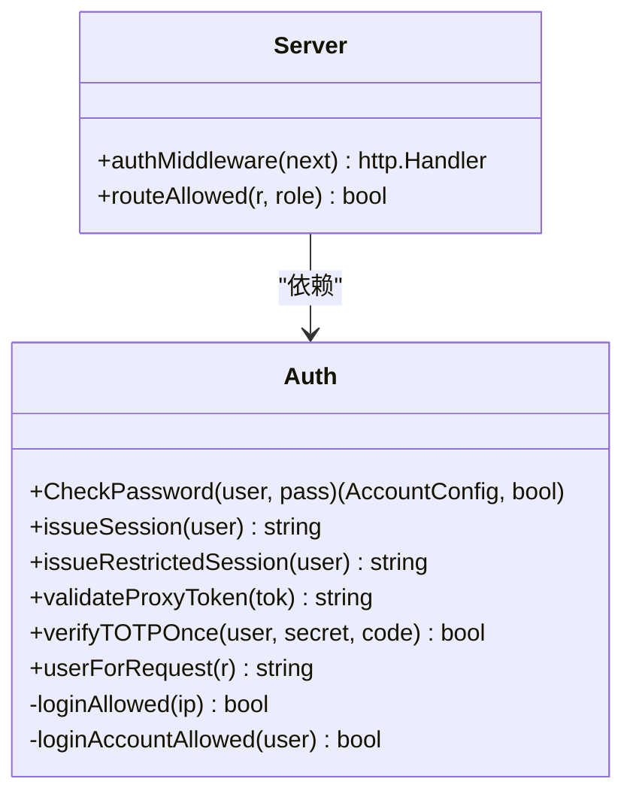
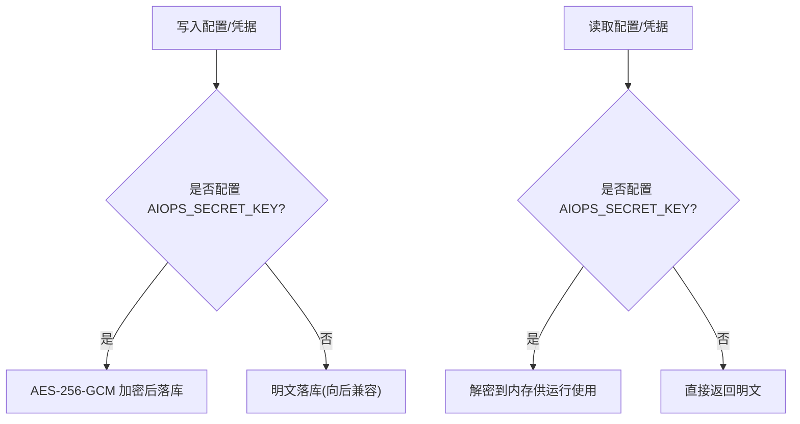
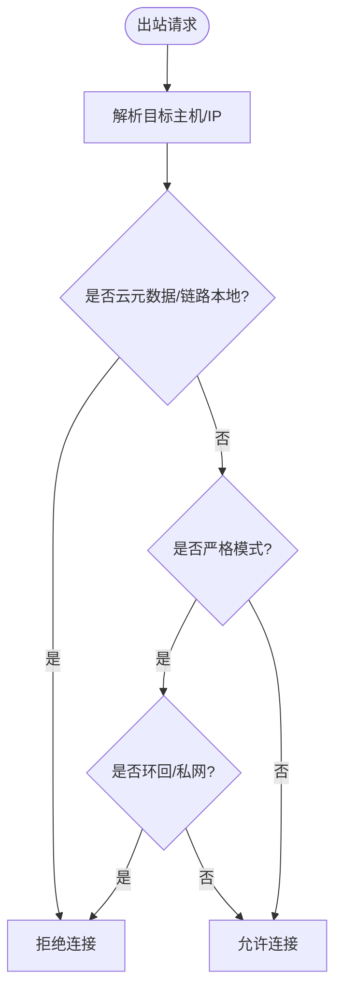
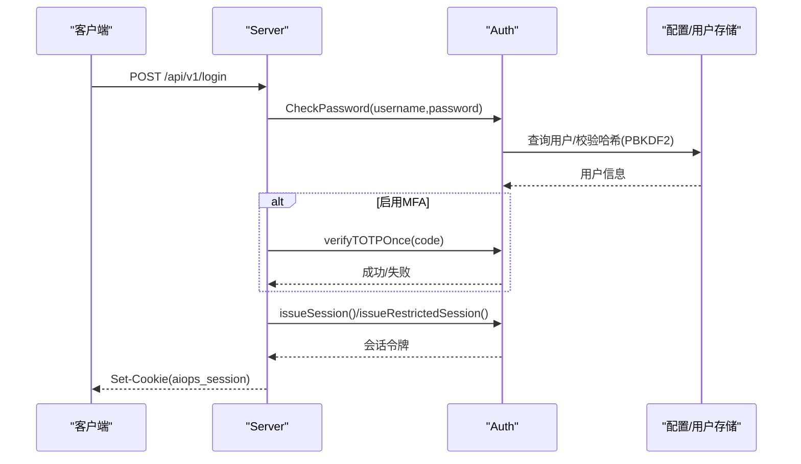
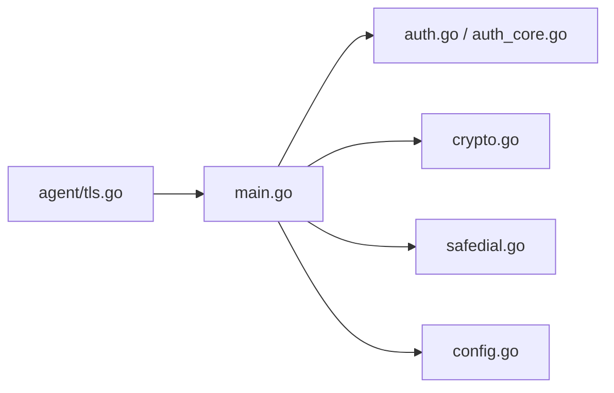

# 安全架构

<cite>
**本文引用的文件**   
- [README.md](file://README.md)
- [cmd/server/main.go](file://cmd/server/main.go)
- [cmd/server/handlers.go](file://cmd/server/handlers.go)
- [cmd/server/auth.go](file://cmd/server/auth.go)
- [cmd/server/auth_core.go](file://cmd/server/auth_core.go)
- [cmd/server/totp.go](file://cmd/server/totp.go)
- [cmd/server/crypto.go](file://cmd/server/crypto.go)
- [cmd/server/safedial.go](file://cmd/server/safedial.go)
- [cmd/agent/tls.go](file://cmd/agent/tls.go)
- [cmd/server/config.go](file://cmd/server/config.go)
- [cmd/server/security_test.go](file://cmd/server/security_test.go)
- [cmd/server/terminal_audit_test.go](file://cmd/server/terminal_audit_test.go)
</cite>

## 目录
1. [引言](#引言)
2. [项目结构](#项目结构)
3. [核心组件](#核心组件)
4. [架构总览](#架构总览)
5. [详细组件分析](#详细组件分析)
6. [依赖关系分析](#依赖关系分析)
7. [性能与可用性考量](#性能与可用性考量)
8. [故障排查指南](#故障排查指南)
9. [结论](#结论)
10. [附录：配置示例与威胁建模](#附录配置示例与威胁建模)

## 引言
本文件为 AIOps Monitor 的安全架构文档，覆盖传输层、应用层、数据层与网络安全的多层防护体系，包括 TLS/HTTPS、RBAC、MFA、CSRF/CSP 防护、静态加密（AES-256-GCM）、SSRF 出站防护、端口访问控制、认证授权流程、会话管理、安全中间件链、输入验证与输出编码、审计日志与合规性要求，并提供安全配置示例与威胁建模分析。

## 项目结构
服务端采用 Go 单二进制，内嵌前端资源；Agent 通过反向通道与服务端通信。安全相关实现主要分布在服务端 main 启动链路、认证与会话、TOTP、静态加密、SSRF 守卫、Agent TLS 客户端等模块中。

图表来源
- [cmd/server/main.go:294-354](file://cmd/server/main.go#L294-L354)
- [cmd/server/handlers.go:97-346](file://cmd/server/handlers.go#L97-L346)
- [cmd/server/auth.go:112-172](file://cmd/server/auth.go#L112-L172)
- [cmd/server/auth_core.go:17-20](file://cmd/server/auth_core.go#L17-L20)
- [cmd/server/crypto.go:18-24](file://cmd/server/crypto.go#L18-L24)
- [cmd/server/safedial.go:14-27](file://cmd/server/safedial.go#L14-L27)
- [cmd/agent/tls.go:13-46](file://cmd/agent/tls.go#L13-L46)

章节来源
- [cmd/server/main.go:294-354](file://cmd/server/main.go#L294-L354)
- [cmd/server/handlers.go:97-346](file://cmd/server/handlers.go#L97-L346)

## 核心组件
- 传输层安全：可选 HTTPS/TLS（服务端），Agent 侧支持自定义 CA 信任与跳过校验开关（仅实验室）。
- 应用层安全：RBAC（admin/operator/viewer）、MFA（TOTP）、CORS 白名单、CSP 严格策略、CSRF 缓解（SameSite + HttpOnly Cookie）、登录限流与账户级限流、终端二次认证。
- 数据安全：配置密钥 AES-256-GCM 静态加密；Agent 日志 gzip + AES-256-GCM 加密上报；密码哈希 PBKDF2-HMAC-SHA256。
- 网络安全：SSRF 出站防护（默认拒绝云元数据与链路本地，可选严格模式拒绝私网）；TCP 转发监听地址默认 127.0.0.1；中继共享密钥校验。
- 审计与合规：登录/操作/告警治理/终端命令审计（含敏感信息脱敏）；强制首次改密；最小权限原则与可观测性。

章节来源
- [cmd/server/main.go:113-136](file://cmd/server/main.go#L113-L136)
- [cmd/server/auth.go:83-108](file://cmd/server/auth.go#L83-L108)
- [cmd/server/auth_core.go:22-28](file://cmd/server/auth_core.go#L22-L28)
- [cmd/server/crypto.go:18-24](file://cmd/server/crypto.go#L18-L24)
- [cmd/server/safedial.go:14-27](file://cmd/server/safedial.go#L14-L27)
- [cmd/server/config.go:710-724](file://cmd/server/config.go#L710-L724)
- [cmd/server/terminal_audit_test.go:8-32](file://cmd/server/terminal_audit_test.go#L8-L32)

## 架构总览
下图展示请求进入后的安全中间件链路与关键鉴权点。

图表来源
- [cmd/server/main.go:113-136](file://cmd/server/main.go#L113-L136)
- [cmd/server/main.go:76-102](file://cmd/server/main.go#L76-L102)
- [cmd/server/main.go:138-145](file://cmd/server/main.go#L138-L145)
- [cmd/server/auth.go:112-172](file://cmd/server/auth.go#L112-L172)
- [cmd/server/handlers.go:97-346](file://cmd/server/handlers.go#L97-L346)

## 详细组件分析

### 传输层安全（TLS/HTTPS、证书管理）
- 服务端可选启用 TLS：当提供证书与私钥时以 HTTPS 对外服务；否则明文 HTTP（建议置于反向代理之后）。
- Agent 侧构建 TLS 客户端：支持自定义 CA 根证书注入系统信任池；提供跳过校验的逃生门（仅临时/内网自签场景使用）。
- 会话 Cookie 在 HTTPS 下自动设置 Secure 标志。

图表来源
- [cmd/server/main.go:335-354](file://cmd/server/main.go#L335-L354)
- [cmd/agent/tls.go:13-46](file://cmd/agent/tls.go#L13-L46)

章节来源
- [cmd/server/main.go:335-354](file://cmd/server/main.go#L335-L354)
- [cmd/agent/tls.go:13-46](file://cmd/agent/tls.go#L13-L46)

### 应用层安全（RBAC、MFA、CSRF/CSP）
- RBAC：基于角色的路由级拦截，viewer 只读，operator+ 可写，admin 可管理用户与全局策略。
- MFA：TOTP（RFC 6238），支持一次性校验与防重放；管理员可开启全局强制 MFA，未绑定用户进入受限会话。
- CSRF/CSP：SameSite=Lax + HttpOnly Cookie；CSP 严格策略（script-src 'self' 等），对 /proxy/ 放行目标站点自身策略。
- 登录限流：IP 维度滑动窗口 + 账户维度独立限流，防止分布式暴力破解。
- 终端二次认证：会话内标记“已验证”，需额外密码或 TOTP。

图表来源
- [cmd/server/auth_core.go:297-321](file://cmd/server/auth_core.go#L297-L321)
- [cmd/server/auth_core.go:380-402](file://cmd/server/auth_core.go#L380-L402)
- [cmd/server/auth_core.go:157-176](file://cmd/server/auth_core.go#L157-L176)
- [cmd/server/auth_core.go:262-285](file://cmd/server/auth_core.go#L262-L285)
- [cmd/server/auth.go:112-172](file://cmd/server/auth.go#L112-L172)
- [cmd/server/auth.go:83-108](file://cmd/server/auth.go#L83-L108)

章节来源
- [cmd/server/auth.go:83-108](file://cmd/server/auth.go#L83-L108)
- [cmd/server/auth.go:112-172](file://cmd/server/auth.go#L112-L172)
- [cmd/server/auth_core.go:297-321](file://cmd/server/auth_core.go#L297-L321)
- [cmd/server/auth_core.go:380-402](file://cmd/server/auth_core.go#L380-L402)
- [cmd/server/auth_core.go:157-176](file://cmd/server/auth_core.go#L157-L176)
- [cmd/server/auth_core.go:262-285](file://cmd/server/auth_core.go#L262-L285)
- [cmd/server/totp.go:16-24](file://cmd/server/totp.go#L16-L24)
- [cmd/server/main.go:113-136](file://cmd/server/main.go#L113-L136)

### 数据安全（静态加密、敏感信息保护）
- 配置静态加密：AIOPS_SECRET_KEY 派生主密钥，对 MFA/SMTP/AI/webhook/relay 等可逆凭据进行 AES-256-GCM 加密落库；无主密钥时透明兼容明文。
- 日志加密上报：注册阶段下发 per-agent 的 log_key（由主密钥+指纹派生），Agent 以 gzip + AES-256-GCM 加密上报，服务端按指纹重派生解密。
- 密码存储：PBKDF2-HMAC-SHA256，带迭代次数与盐值，旧格式自动升级。
- 输出脱敏：配置读取接口对安装 Token、中继密钥、Webhook 头部等进行掩码回显；主机列表不泄露指纹。

图表来源
- [cmd/server/crypto.go:44-67](file://cmd/server/crypto.go#L44-L67)
- [cmd/server/crypto.go:69-103](file://cmd/server/crypto.go#L69-L103)
- [cmd/server/crypto.go:120-130](file://cmd/server/crypto.go#L120-L130)
- [cmd/server/crypto.go:132-173](file://cmd/server/crypto.go#L132-L173)
- [cmd/server/security_test.go:120-174](file://cmd/server/security_test.go#L120-L174)

章节来源
- [cmd/server/crypto.go:44-67](file://cmd/server/crypto.go#L44-L67)
- [cmd/server/crypto.go:69-103](file://cmd/server/crypto.go#L69-L103)
- [cmd/server/crypto.go:120-130](file://cmd/server/crypto.go#L120-L130)
- [cmd/server/crypto.go:132-173](file://cmd/server/crypto.go#L132-L173)
- [cmd/server/security_test.go:120-174](file://cmd/server/security_test.go#L120-L174)

### 网络安全（SSRF 防护、端口访问控制）
- SSRF 出站防护：AI/Webhook 等用户可影响 URL 的出站请求经 Dialer.Control 钩子校验实际 IP，默认拒绝云元数据与链路本地地址；严格模式额外拒绝环回与 RFC1918 私网。
- 端口访问控制：TCP 转发默认监听 127.0.0.1，避免外部直连；可通过环境变量覆盖监听地址与端口范围。
- 中继共享密钥：当配置 relay_secret 时，来自中继的请求必须携带匹配头，否则拒绝。

图表来源
- [cmd/server/safedial.go:45-65](file://cmd/server/safedial.go#L45-L65)
- [cmd/server/safedial.go:67-78](file://cmd/server/safedial.go#L67-L78)
- [cmd/server/config.go:710-724](file://cmd/server/config.go#L710-L724)
- [cmd/server/auth.go:117-125](file://cmd/server/auth.go#L117-L125)

章节来源
- [cmd/server/safedial.go:45-65](file://cmd/server/safedial.go#L45-L65)
- [cmd/server/safedial.go:67-78](file://cmd/server/safedial.go#L67-L78)
- [cmd/server/config.go:710-724](file://cmd/server/config.go#L710-L724)
- [cmd/server/auth.go:117-125](file://cmd/server/auth.go#L117-L125)

### 认证授权流程与会话管理
- 登录流程：用户名/手机号 + 密码 → 可选 TOTP 二次校验 → 签发会话 Cookie（HttpOnly/SameSite/Lax，HTTPS 下 Secure）。
- 受限会话：全局强制 MFA 策略下，未绑定用户进入受限会话，仅允许 MFA 设置与登出。
- 代理令牌：/proxy/ 场景使用一次性短生命周期令牌，仍受 RBAC 复核。
- 会话失效：绝对过期 + 滑动空闲超时；登出/改密时清理对应会话。

图表来源
- [cmd/server/auth.go:176-206](file://cmd/server/auth.go#L176-L206)
- [cmd/server/auth.go:252-307](file://cmd/server/auth.go#L252-L307)
- [cmd/server/auth_core.go:380-402](file://cmd/server/auth_core.go#L380-L402)
- [cmd/server/auth_core.go:331-354](file://cmd/server/auth_core.go#L331-L354)

章节来源
- [cmd/server/auth.go:176-206](file://cmd/server/auth.go#L176-L206)
- [cmd/server/auth.go:252-307](file://cmd/server/auth.go#L252-L307)
- [cmd/server/auth_core.go:331-354](file://cmd/server/auth_core.go#L331-L354)

### 安全中间件链
- 安全响应头：nosniff、DENY、no-referrer、CSP（排除 /proxy/）。
- CORS：支持白名单 Origin，否则回退兼容行为。
- 请求体限制：MaxBytesReader 限制最大请求体，防止内存耗尽。
- gzip 压缩：对非流式响应启用压缩，降低带宽占用。

章节来源
- [cmd/server/main.go:113-136](file://cmd/server/main.go#L113-L136)
- [cmd/server/main.go:76-102](file://cmd/server/main.go#L76-L102)
- [cmd/server/main.go:138-145](file://cmd/server/main.go#L138-L145)
- [cmd/server/main.go:186-205](file://cmd/server/main.go#L186-L205)

### 输入验证与输出编码
- 用户名/密码强度校验：强密码策略（长度、大小写、数字、特殊字符）。
- 终端命令审计：对命令行中的敏感参数进行脱敏处理，避免口令泄漏。
- 配置字段校验：阈值范围、端口范围、必填项等。

章节来源
- [cmd/server/auth.go:60-81](file://cmd/server/auth.go#L60-81)
- [cmd/server/terminal_audit_test.go:8-32](file://cmd/server/terminal_audit_test.go#L8-L32)
- [cmd/server/config.go:502-531](file://cmd/server/config.go#L502-L531)

### 审计日志与合规性
- 登录/失败/重置/变更密码/MFA 启停等操作均记录审计日志。
- 终端会话录制与回放，命令审计包含时间戳与尺寸变化。
- 首次登录强制安全初始化（默认 admin/admin 首登强制改密）。
- 符合最小权限与可观测性原则，便于合规审计。

章节来源
- [cmd/server/auth.go:252-307](file://cmd/server/auth.go#L252-L307)
- [cmd/server/handlers.go:239-242](file://cmd/server/handlers.go#L239-L242)

## 依赖关系分析
- main 组装中间件链与路由，auth 提供认证与会话能力，crypto 提供静态加密与日志加密，safedial 提供 SSRF 防护，config 提供配置与环境变量覆盖。
- Agent TLS 客户端与服务端 TLS 形成端到端加密链路。

图表来源
- [cmd/server/main.go:294-354](file://cmd/server/main.go#L294-L354)
- [cmd/server/auth.go:112-172](file://cmd/server/auth.go#L112-L172)
- [cmd/server/crypto.go:18-24](file://cmd/server/crypto.go#L18-L24)
- [cmd/server/safedial.go:14-27](file://cmd/server/safedial.go#L14-L27)
- [cmd/server/config.go:616-651](file://cmd/server/config.go#L616-L651)
- [cmd/agent/tls.go:41-73](file://cmd/agent/tls.go#L41-L73)

## 性能与可用性考量
- gzip 压缩显著降低轮询带宽成本（多主机场景约 8-10 倍）。
- 会话滑动空闲超时与绝对过期结合，兼顾可用性与安全性。
- SSRF 防护在 DNS 解析后、connect 前执行，天然覆盖重定向与 DNS rebinding。
- 请求体上限与 ReadHeaderTimeout 平衡长连接与慢头攻击防护。

章节来源
- [cmd/server/main.go:186-205](file://cmd/server/main.go#L186-L205)
- [cmd/server/auth_core.go:331-354](file://cmd/server/auth_core.go#L331-L354)
- [cmd/server/safedial.go:67-78](file://cmd/server/safedial.go#L67-L78)
- [cmd/server/main.go:298-303](file://cmd/server/main.go#L298-L303)

## 故障排查指南
- 无法登录/频繁被限流：检查 IP 与账户维度的失败计数窗口；确认是否触发账户锁定。
- MFA 验证码无效：核对设备时间与服务器时间偏差；确认 TOTP 单次使用窗口。
- 配置密钥不可用：确认 AIOPS_SECRET_KEY 已正确设置且未被篡改；查看解密失败日志。
- SSRF 阻断：检查目标是否为云元数据/链路本地/私网（严格模式）；必要时调整策略。
- 端口转发不可达：确认 forward_listen 与端口范围配置；Docker 部署需映射相应端口。

章节来源
- [cmd/server/auth_core.go:182-241](file://cmd/server/auth_core.go#L182-L241)
- [cmd/server/totp.go:57-90](file://cmd/server/totp.go#L57-L90)
- [cmd/server/crypto.go:69-103](file://cmd/server/crypto.go#L69-L103)
- [cmd/server/safedial.go:45-65](file://cmd/server/safedial.go#L45-L65)
- [cmd/server/config.go:710-724](file://cmd/server/config.go#L710-L724)

## 结论
AIOps Monitor 在传输、应用、数据与网络层面构建了纵深防御体系：TLS/HTTPS、RBAC、MFA、CSP/CSRF、静态加密、SSRF 防护、端口访问控制、审计日志与合规性措施共同保障平台安全。生产环境建议启用 TLS、严格 CSP、全局 MFA、SSRF 严格模式与最小化端口暴露，并妥善管理主密钥与中继密钥。

## 附录：配置示例与威胁建模

### 安全配置示例（环境变量与关键项）
- 启用 TLS：AIOPS_TLS_CERT、AIOPS_TLS_KEY
- 静态加密：AIOPS_SECRET_KEY
- SSRF 严格模式：AIOPS_SSRF_STRICT=true
- 转发监听与端口范围：AIOPS_FORWARD_LISTEN、AIOPS_FORWARD_PORT_RANGE
- 中继密钥：AIOPS_RELAY_SECRET
- 强制 Agent Token：AIOPS_REQUIRE_TOKEN=true
- 信任反向代理：AIOPS_TRUST_PROXY=true（仅在可信反代后启用）

章节来源
- [cmd/server/main.go:335-354](file://cmd/server/main.go#L335-L354)
- [cmd/server/crypto.go:28-42](file://cmd/server/crypto.go#L28-L42)
- [cmd/server/safedial.go:40-43](file://cmd/server/safedial.go#L40-L43)
- [cmd/server/config.go:616-651](file://cmd/server/config.go#L616-L651)
- [cmd/server/config.go:710-724](file://cmd/server/config.go#L710-L724)

### 威胁建模分析（STRIDE）
- 欺骗（Spoofing）
  - 风险：伪造会话/代理令牌/中继密钥
  - 缓解：会话 Cookie 安全属性、代理令牌一次性与 RBAC 复核、中继密钥常数时间比较
- 篡改（Tampering）
  - 风险：配置/凭据被修改
  - 缓解：静态加密落库、配置校验、最小权限
- 否认（Repudiation）
  - 风险：操作不可追溯
  - 缓解：全面审计日志、终端命令审计与录制
- 信息泄露（Information Disclosure）
  - 风险：敏感信息明文传输/存储/回显
  - 缓解：TLS、静态加密、输出脱敏、CSP
- 拒绝服务（DoS）
  - 风险：超大请求体/慢头攻击/暴力破解
  - 缓解：请求体上限、ReadHeaderTimeout、登录限流与账户级限流
- 提升权限（Elevation of Privilege）
  - 风险：越权访问/SSRF 内网探测
  - 缓解：RBAC、SSRF 出站防护、端口监听默认 127.0.0.1

章节来源
- [cmd/server/auth.go:112-172](file://cmd/server/auth.go#L112-L172)
- [cmd/server/auth_core.go:182-241](file://cmd/server/auth_core.go#L182-L241)
- [cmd/server/crypto.go:44-67](file://cmd/server/crypto.go#L44-L67)
- [cmd/server/safedial.go:45-65](file://cmd/server/safedial.go#L45-L65)
- [cmd/server/config.go:710-724](file://cmd/server/config.go#L710-L724)
- [cmd/server/main.go:113-136](file://cmd/server/main.go#L113-L136)