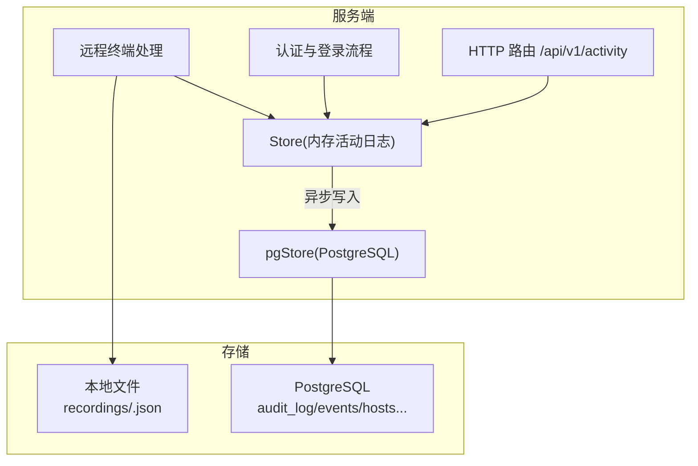
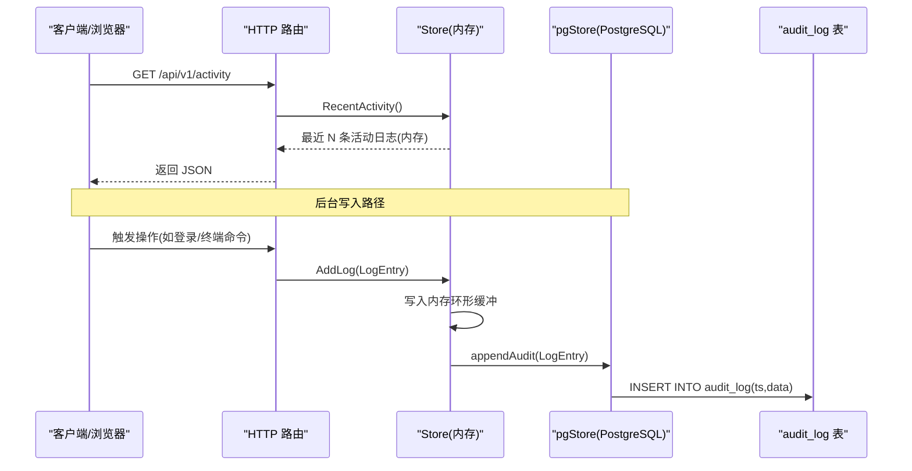
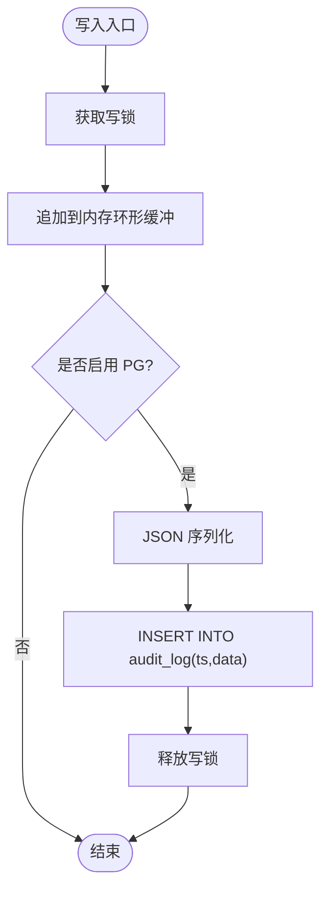
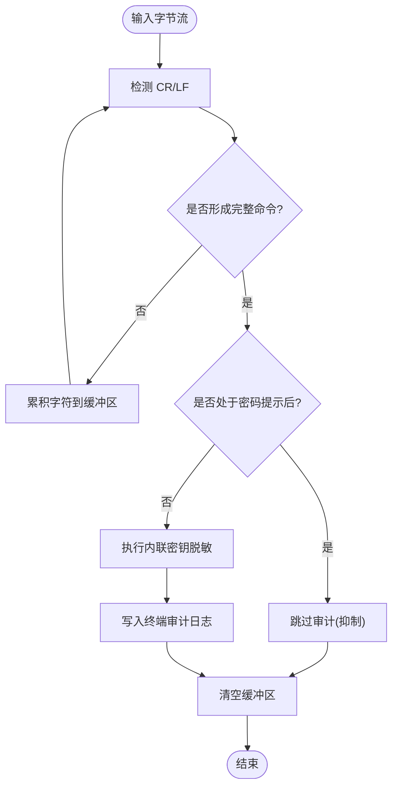
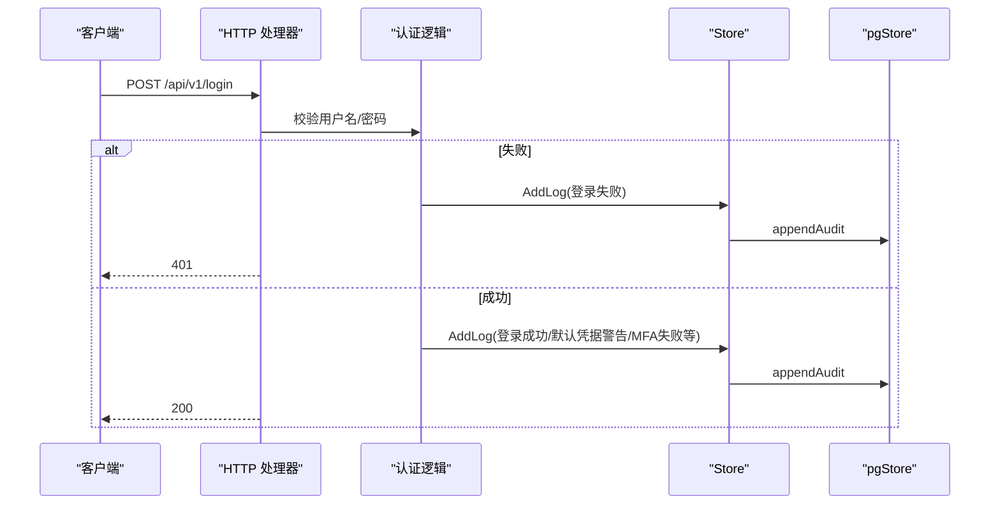
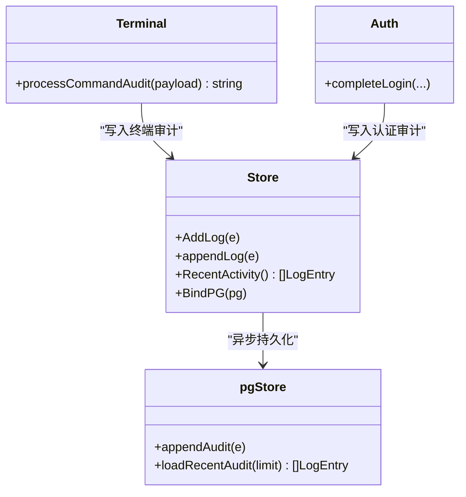

# 审计日志

<cite>
**本文引用的文件**   
- [cmd/server/store.go](file://cmd/server/store.go)
- [cmd/server/pgstore.go](file://cmd/server/pgstore.go)
- [cmd/server/terminal.go](file://cmd/server/terminal.go)
- [cmd/server/auth.go](file://cmd/server/auth.go)
- [cmd/server/handlers.go](file://cmd/server/handlers.go)
- [pg-backup-vectorfix.sql](file://pg-backup-vectorfix.sql)
</cite>

## 目录
1. [简介](#简介)
2. [项目结构](#项目结构)
3. [核心组件](#核心组件)
4. [架构总览](#架构总览)
5. [详细组件分析](#详细组件分析)
6. [依赖关系分析](#依赖关系分析)
7. [性能与容量规划](#性能与容量规划)
8. [故障排查指南](#故障排查指南)
9. [结论](#结论)
10. [附录：配置与集成示例](#附录：配置与集成示例)

## 简介
本文件面向 AIOps Monitor 的审计日志能力，覆盖安全事件记录、操作审计追踪、异常行为检测；深入说明日志格式规范、敏感信息脱敏、日志完整性保护；并提供审计日志查询、安全事件分析、合规性报告生成方法，以及日志配置示例与监控告警集成方案。

## 项目结构
审计日志相关实现集中在服务端模块中，核心由“内存活动日志 + PostgreSQL 持久化”双通道构成：
- 内存层：环形缓冲最近活动日志，供面板快速展示
- 持久层：PostgreSQL 表 audit_log 作为不可变追加式审计轨迹
- 终端会话：命令级审计与录制回放（元数据入 PG，内容存本地文件）

图表来源
- [cmd/server/handlers.go:100-130](file://cmd/server/handlers.go#L100-L130)
- [cmd/server/store.go:687-700](file://cmd/server/store.go#L687-L700)
- [cmd/server/pgstore.go:304-332](file://cmd/server/pgstore.go#L304-L332)
- [cmd/server/terminal.go:480-520](file://cmd/server/terminal.go#L480-L520)
- [cmd/server/auth.go:200-310](file://cmd/server/auth.go#L200-L310)

章节来源
- [cmd/server/handlers.go:100-130](file://cmd/server/handlers.go#L100-L130)
- [cmd/server/store.go:687-700](file://cmd/server/store.go#L687-L700)
- [cmd/server/pgstore.go:304-332](file://cmd/server/pgstore.go#L304-L332)
- [cmd/server/terminal.go:480-520](file://cmd/server/terminal.go#L480-L520)
- [cmd/server/auth.go:200-310](file://cmd/server/auth.go#L200-L310)

## 核心组件
- 活动日志条目 LogEntry：统一记录操作、系统、插件、终端四类事件，包含时间戳、类型、级别、操作者、IP、主机、消息等字段
- 持久化 pgStore：提供 appendAudit/loadRecentAudit 等方法，将审计日志以 JSONB 追加写入 audit_log 表
- 终端审计：在输入流中解析完成命令并脱敏后落库；密码提示后的输入行被抑制，避免入库
- 认证审计：登录成功/失败、默认凭据强制改密、MFA 校验结果等均记录为审计日志

章节来源
- [cmd/server/store.go:60-71](file://cmd/server/store.go#L60-L71)
- [cmd/server/pgstore.go:304-332](file://cmd/server/pgstore.go#L304-L332)
- [cmd/server/terminal.go:1002-1031](file://cmd/server/terminal.go#L1002-L1031)
- [cmd/server/auth.go:200-310](file://cmd/server/auth.go#L200-L310)

## 架构总览
审计日志采用“内存缓存 + 持久化追加”的双轨设计：
- 写入路径：业务逻辑 → Store.appendLog → 内存环形缓冲 + 异步写入 PG
- 读取路径：API 请求 → Store.RecentActivity（内存）或 pgStore.loadRecentAudit（PG）
- 终端会话：命令审计独立于录制内容；录制元数据入 PG，内容留本地文件

图表来源
- [cmd/server/handlers.go:120-130](file://cmd/server/handlers.go#L120-L130)
- [cmd/server/store.go:702-718](file://cmd/server/store.go#L702-L718)
- [cmd/server/pgstore.go:304-332](file://cmd/server/pgstore.go#L304-L332)

## 详细组件分析

### 审计日志数据模型与格式
- 数据结构 LogEntry 字段
  - timestamp: Unix 秒级时间戳
  - kind: operation | system | plugin | terminal
  - level: info | warning | critical
  - actor: 操作者用户名或匿名 IP
  - ip: 真实客户端 IP（可选）
  - host: 目标主机名（可选）
  - message: 人类可读的消息文本
- 持久化格式
  - 以 JSON 序列化后存入 audit_log.data(JSONB)，ts 为时间索引
  - 支持按 ts 倒序分页查询，适合审计回溯与导出

章节来源
- [cmd/server/store.go:60-71](file://cmd/server/store.go#L60-L71)
- [cmd/server/pgstore.go:98-110](file://cmd/server/pgstore.go#L98-L110)
- [pg-backup-vectorfix.sql:164-176](file://pg-backup-vectorfix.sql#L164-L176)

### 写入与持久化流程
- 写入入口
  - Store.AddLog 内部加锁，调用 appendLog 追加到内存环形缓冲，并异步调用 pgStore.appendAudit
- 持久化策略
  - audit_log 为不可变追加表，仅 INSERT，无更新删除，保障审计可追溯性与完整性
  - 启动时从 PG 加载最近 N 条活动日志回填内存，保证重启后面板可见性

图表来源
- [cmd/server/store.go:687-700](file://cmd/server/store.go#L687-L700)
- [cmd/server/pgstore.go:304-312](file://cmd/server/pgstore.go#L304-L312)

章节来源
- [cmd/server/store.go:687-700](file://cmd/server/store.go#L687-L700)
- [cmd/server/pgstore.go:304-312](file://cmd/server/pgstore.go#L304-L312)

### 终端命令审计与敏感信息脱敏
- 命令提取
  - 基于输入流识别回车换行，累积完整命令行进行审计
- 脱敏规则
  - 内联密钥（如 password=、token=、mysql -p…）会被替换为 *** 标记
- 密码抑制
  - 检测到密码提示（sudo/ssh/mysql 等）后，紧随其后的输入行不进入命令审计，防止密码入库
- 录制与审计分离
  - 录制内容为输出帧，不包含原始输入；命令审计作为独立的“终端审计日志”落库

图表来源
- [cmd/server/terminal.go:1002-1031](file://cmd/server/terminal.go#L1002-L1031)
- [cmd/server/terminal.go:547-553](file://cmd/server/terminal.go#L547-L553)
- [cmd/server/terminal_audit_test.go:1-50](file://cmd/server/terminal_audit_test.go#L1-L50)

章节来源
- [cmd/server/terminal.go:1002-1031](file://cmd/server/terminal.go#L1002-L1031)
- [cmd/server/terminal_audit_test.go:1-50](file://cmd/server/terminal_audit_test.go#L1-L50)

### 认证与安全事件审计
- 登录成功/失败：记录用户/IP/原因
- 默认凭据检测：首次使用 admin/admin 登录会强制改密并记录警告
- MFA 校验失败：记录 TOTP 错误
- 账户资料修改、密码变更、MFA 开关等关键操作均记录

图表来源
- [cmd/server/auth.go:200-310](file://cmd/server/auth.go#L200-L310)
- [cmd/server/store.go:702-718](file://cmd/server/store.go#L702-L718)
- [cmd/server/pgstore.go:304-312](file://cmd/server/pgstore.go#L304-L312)

章节来源
- [cmd/server/auth.go:200-310](file://cmd/server/auth.go#L200-L310)

### 审计日志查询与导出
- 内存查询：GET /api/v1/activity 返回最近活动日志（内存环形缓冲）
- 持久化查询：通过 PG 直接查询 audit_log 表，支持按 ts 范围、kind、level、actor、host 等条件筛选
- 导出建议：结合数据库工具导出 CSV/JSON，用于合规报告与离线分析

章节来源
- [cmd/server/handlers.go:120-130](file://cmd/server/handlers.go#L120-L130)
- [cmd/server/pgstore.go:314-332](file://cmd/server/pgstore.go#L314-L332)

### 异常行为检测与告警联动
- 高频失败登录：可基于 audit_log 聚合统计，触发告警
- 默认凭据使用：已内置审计记录，可作为基线告警源
- 终端高危命令：对特定命令模式（如 rm -rf、passwd、chmod 777 等）进行匹配告警
- 告警落地：审计日志与告警历史（alert_history）共同支撑事件溯源

章节来源
- [cmd/server/pgstore.go:200-210](file://cmd/server/pgstore.go#L200-L210)
- [cmd/server/store.go:758-796](file://cmd/server/store.go#L758-L796)

## 依赖关系分析
- Store 负责内存活动日志与生命周期管理，并通过 BindPG 绑定持久化后端
- pgStore 负责所有持久化读写，包括 audit_log、events、hosts、alert_history 等
- 终端与认证模块通过 Store.AddLog 写入审计日志，最终落盘至 PG

图表来源
- [cmd/server/store.go:106-146](file://cmd/server/store.go#L106-L146)
- [cmd/server/pgstore.go:304-332](file://cmd/server/pgstore.go#L304-L332)
- [cmd/server/terminal.go:1002-1031](file://cmd/server/terminal.go#L1002-L1031)
- [cmd/server/auth.go:200-310](file://cmd/server/auth.go#L200-L310)

章节来源
- [cmd/server/store.go:106-146](file://cmd/server/store.go#L106-L146)
- [cmd/server/pgstore.go:304-332](file://cmd/server/pgstore.go#L304-L332)
- [cmd/server/terminal.go:1002-1031](file://cmd/server/terminal.go#L1002-L1031)
- [cmd/server/auth.go:200-310](file://cmd/server/auth.go#L200-L310)

## 性能与容量规划
- 写入性能
  - 内存写入为 O(1) 追加，受限于环形缓冲大小（maxActivity）
  - PG 写入为异步 goroutine，避免阻塞主流程
- 查询性能
  - 内存查询为 O(N) 取尾，N 为 maxActivity
  - PG 查询利用 id/ts 索引，建议按时间窗口分页
- 容量规划
  - audit_log 为不可变追加表，需定期归档与清理策略
  - 终端录制内容存本地文件，PG 仅保存元数据，避免膨胀

章节来源
- [cmd/server/store.go:12-27](file://cmd/server/store.go#L12-L27)
- [cmd/server/pgstore.go:304-332](file://cmd/server/pgstore.go#L304-L332)

## 故障排查指南
- 无法写入 PG
  - 检查 AIOPS_POSTGRES_DSN 环境变量与网络连通性
  - 查看服务日志中的“PG 写审计日志失败”警告
- 审计缺失
  - 确认 Store.BindPG 是否成功初始化
  - 核对 pgStore.migrate 建表是否成功
- 终端命令未审计
  - 确认 processCommandAudit 是否被调用
  - 检查是否命中密码抑制分支

章节来源
- [cmd/server/pgstore.go:17-30](file://cmd/server/pgstore.go#L17-L30)
- [cmd/server/pgstore.go:77-110](file://cmd/server/pgstore.go#L77-L110)
- [cmd/server/terminal.go:1002-1031](file://cmd/server/terminal.go#L1002-L1031)

## 结论
AIOps Monitor 的审计日志体系以“内存 + PG”双轨实现，覆盖操作、系统、插件与终端全链路事件；通过严格的敏感信息脱敏与密码抑制机制，确保审计可用且合规；配合 PG 不可变追加表与时间索引，满足长期追溯与合规报告需求。

## 附录：配置与集成示例

### 审计日志查询示例
- 内存接口
  - GET /api/v1/activity
- 持久化查询（PG）
  - SELECT data FROM audit_log WHERE ts BETWEEN ? AND ? ORDER BY ts DESC LIMIT ?

章节来源
- [cmd/server/handlers.go:120-130](file://cmd/server/handlers.go#L120-L130)
- [cmd/server/pgstore.go:314-332](file://cmd/server/pgstore.go#L314-L332)

### 安全事件分析建议
- 登录失败聚合：按 actor/ip 分组统计，阈值触发告警
- 默认凭据使用：过滤 kind=operation、message 含默认凭据关键字
- 终端高危命令：正则匹配危险命令模式，结合 host/actor 维度下钻

章节来源
- [cmd/server/auth.go:200-310](file://cmd/server/auth.go#L200-L310)
- [cmd/server/terminal.go:1002-1031](file://cmd/server/terminal.go#L1002-L1031)

### 合规性报告生成
- 导出范围：指定时间窗口的 audit_log 数据
- 字段映射：timestamp、kind、level、actor、ip、host、message
- 输出格式：CSV/JSON，便于第三方审计工具消费

章节来源
- [cmd/server/pgstore.go:314-332](file://cmd/server/pgstore.go#L314-L332)

### 日志配置与环境变量
- 启用 PG 持久化
  - 设置环境变量 AIOPS_POSTGRES_DSN
- 其他相关开关
  - AIOPS_TERMINAL_DISABLED：全局禁用远程终端（影响终端审计）
  - AIOPS_FORWARD_DISABLED：全局禁用端口转发（与审计无关但影响整体安全面）

章节来源
- [cmd/server/pgstore.go:17-30](file://cmd/server/pgstore.go#L17-L30)

### 监控告警集成方案
- 指标采集
  - 定时任务扫描 audit_log，计算单位时间内失败登录次数、高危命令次数
- 告警渠道
  - 飞书/钉钉 Webhook、邮件 SMTP、短信/语音电话（多云）
- 告警治理
  - 静默/抑制/路由规则，避免告警风暴

章节来源
- [cmd/server/handlers.go:119-125](file://cmd/server/handlers.go#L119-L125)