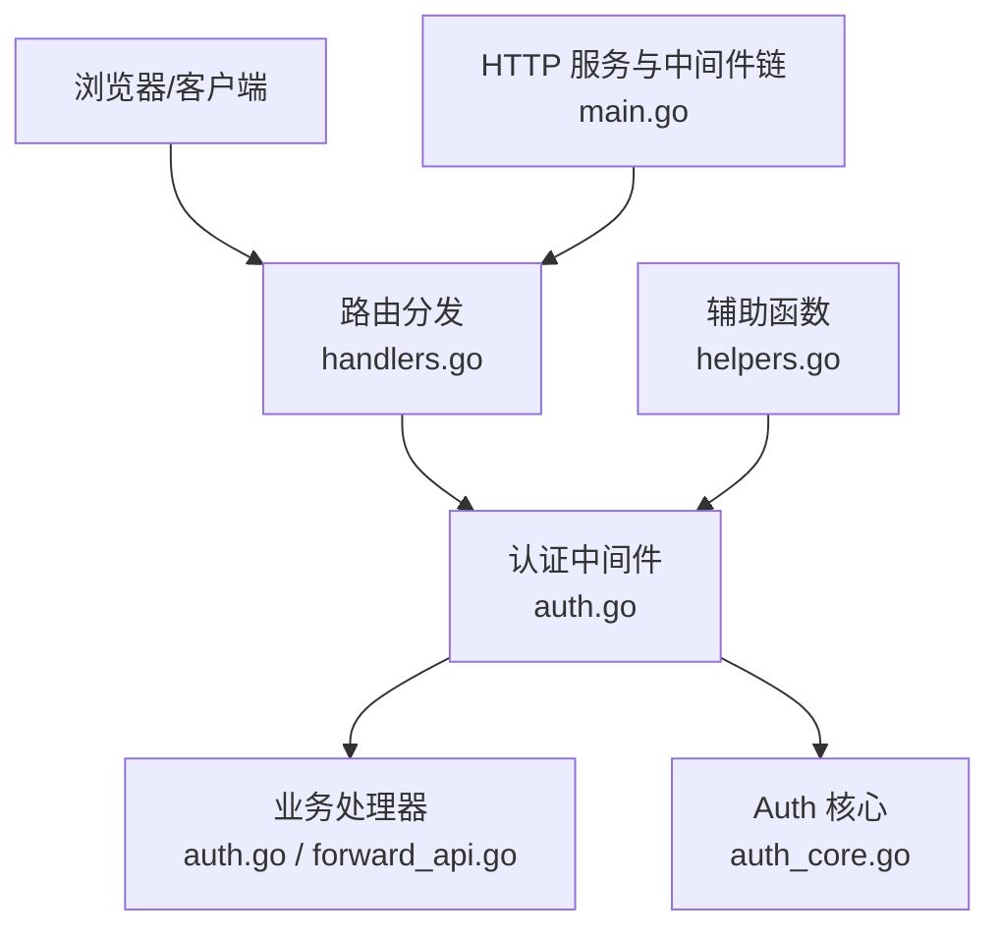
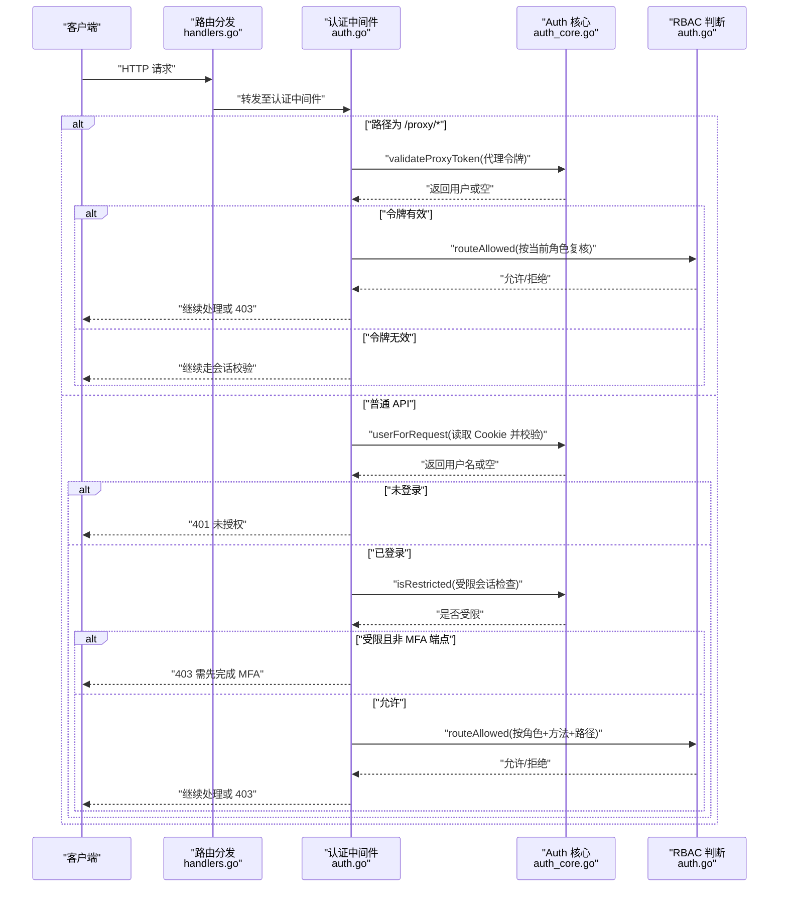
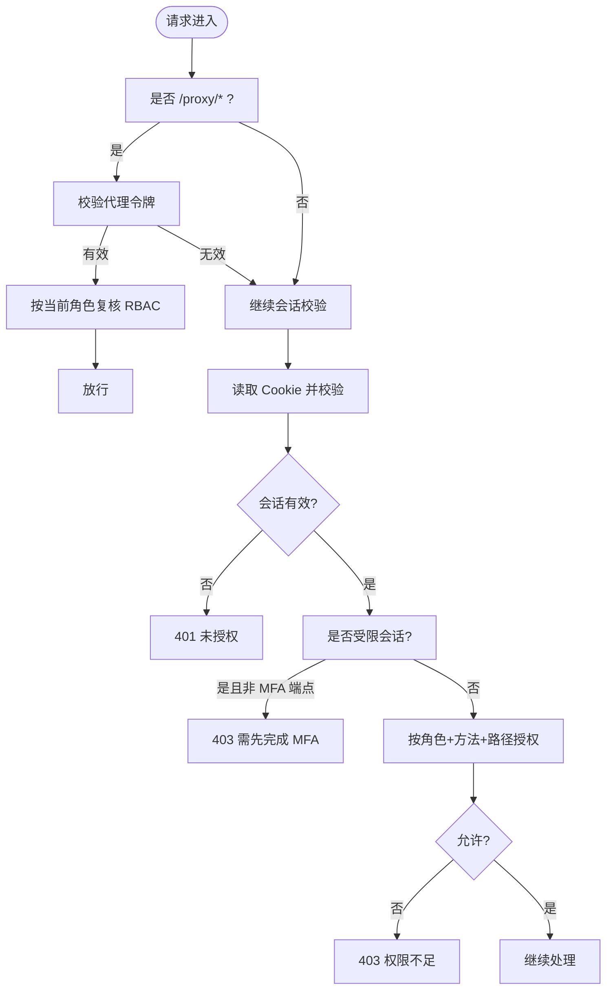
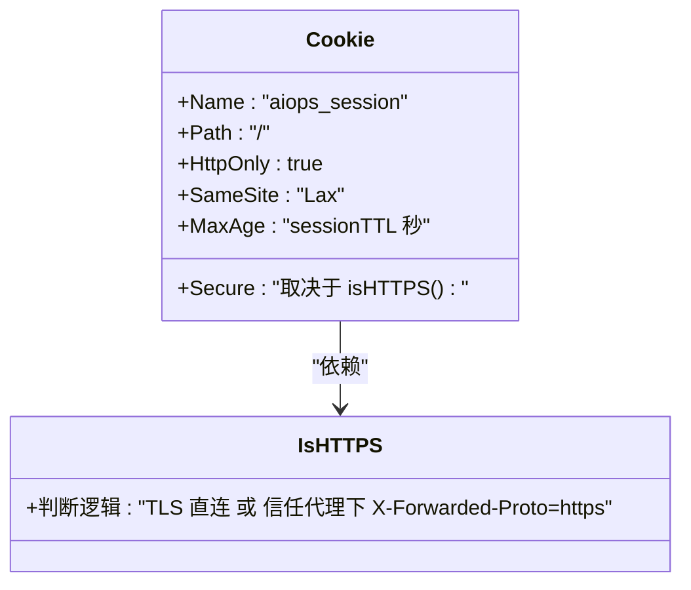
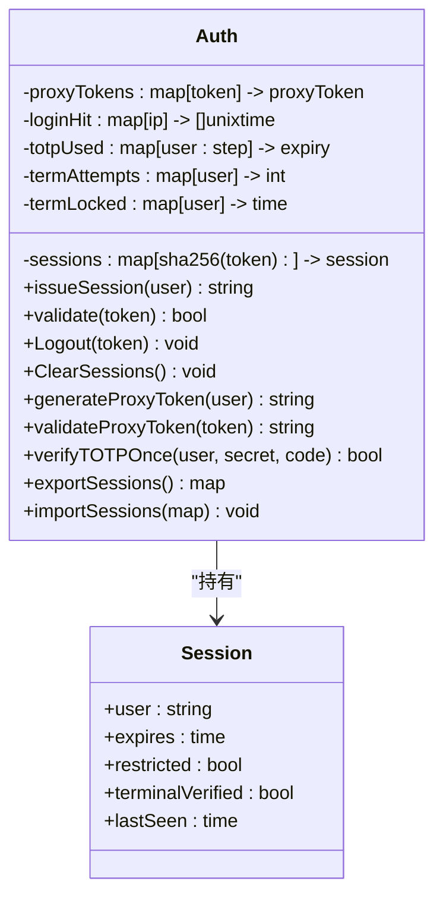
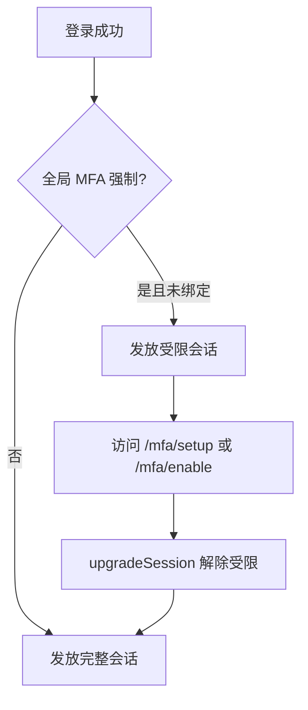
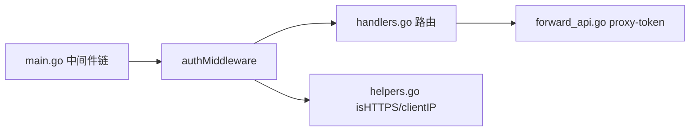

# 会话管理

<cite>
**本文引用的文件**   
- [cmd/server/auth.go](file://cmd/server/auth.go)
- [cmd/server/auth_core.go](file://cmd/server/auth_core.go)
- [cmd/server/handlers.go](file://cmd/server/handlers.go)
- [cmd/server/main.go](file://cmd/server/main.go)
- [cmd/server/helpers.go](file://cmd/server/helpers.go)
- [cmd/server/forward_api.go](file://cmd/server/forward_api.go)
- [cmd/server/auth_test.go](file://cmd/server/auth_test.go)
</cite>

## 目录
1. [简介](#简介)
2. [项目结构](#项目结构)
3. [核心组件](#核心组件)
4. [架构总览](#架构总览)
5. [详细组件分析](#详细组件分析)
6. [依赖关系分析](#依赖关系分析)
7. [性能与并发特性](#性能与并发特性)
8. [故障排查指南](#故障排查指南)
9. [结论](#结论)

## 简介
本文件面向 AIOps Monitor 的“会话管理”子系统，系统性阐述会话生命周期（创建、验证、续期、销毁）、Cookie 安全配置、存储策略、并发访问控制、会话劫持防护，以及代理令牌机制、受限会话升级、批量会话管理等高级能力。文档以源码为依据，提供可视化图示与可追溯来源，帮助读者快速理解并正确部署使用。

## 项目结构
与会话管理直接相关的后端代码集中在 cmd/server 目录下：
- auth.go：登录流程、RBAC 鉴权中间件、MFA 相关处理、Cookie 设置等
- auth_core.go：会话数据结构、令牌生成与校验、限流、代理令牌、持久化桥接等
- handlers.go：路由注册，将认证中间件与具体处理器组合
- main.go：HTTP 服务器启动、中间件链组装、TLS/HTTPS 支持
- helpers.go：客户端 IP 解析、是否 HTTPS 判定等辅助函数
- forward_api.go：代理令牌签发接口实现
- auth_test.go：会话与鉴权相关单元测试



图表来源
- [cmd/server/handlers.go:100-350](file://cmd/server/handlers.go#L100-L350)
- [cmd/server/auth.go:110-172](file://cmd/server/auth.go#L110-L172)
- [cmd/server/auth_core.go:107-135](file://cmd/server/auth_core.go#L107-L135)
- [cmd/server/main.go:294-304](file://cmd/server/main.go#L294-L304)
- [cmd/server/helpers.go:84-97](file://cmd/server/helpers.go#L84-L97)

章节来源
- [cmd/server/handlers.go:100-350](file://cmd/server/handlers.go#L100-L350)
- [cmd/server/main.go:294-304](file://cmd/server/main.go#L294-L304)

## 核心组件
- 会话模型与存储
  - session：包含用户、过期时间、是否受限、终端二次验证标记、最近活动时间等字段
  - Auth：维护内存中的会话表、代理令牌表、登录失败计数、TOTP 单用记录、终端密码尝试限制等
  - 会话键：原始 token 经哈希后作为存储键，避免泄露后可重放
- 认证与鉴权
  - authMiddleware：统一拦截非公开路径，校验代理令牌或会话 Cookie，执行 RBAC 与受限会话检查
  - routeAllowed：基于角色对路径与方法进行细粒度授权
- 登录与 MFA
  - handleLogin：用户名/手机号 + 密码，可选 TOTP 二次因子；默认口令强制修改检测
  - completeLogin：根据全局 MFA 策略发放受限会话或完整会话
  - MFA 设置/启用/禁用：支持全局强制策略与用户级开关
- 代理令牌
  - generateProxyToken/validateProxyToken：短生命周期、单次使用的 HTTP 代理令牌，用于 window.open 场景
- 会话续期与销毁
  - 滑动空闲超时 + 绝对过期双保险；Logout/clearUserSessions/ClearSessions 提供多种销毁粒度

章节来源
- [cmd/server/auth_core.go:96-105](file://cmd/server/auth_core.go#L96-L105)
- [cmd/server/auth_core.go:107-135](file://cmd/server/auth_core.go#L107-L135)
- [cmd/server/auth_core.go:323-354](file://cmd/server/auth_core.go#L323-L354)
- [cmd/server/auth.go:83-108](file://cmd/server/auth.go#L83-L108)
- [cmd/server/auth.go:110-172](file://cmd/server/auth.go#L110-L172)
- [cmd/server/auth.go:176-307](file://cmd/server/auth.go#L176-L307)
- [cmd/server/auth.go:531-640](file://cmd/server/auth.go#L531-L640)
- [cmd/server/forward_api.go:369-392](file://cmd/server/forward_api.go#L369-L392)

## 架构总览
下图展示一次受保护请求从进入路由到完成鉴权的调用序列，包括代理令牌优先、会话校验、受限会话检查与 RBAC 决策。



图表来源
- [cmd/server/handlers.go:100-350](file://cmd/server/handlers.go#L100-L350)
- [cmd/server/auth.go:110-172](file://cmd/server/auth.go#L110-L172)
- [cmd/server/auth_core.go:419-432](file://cmd/server/auth_core.go#L419-L432)
- [cmd/server/auth_core.go:434-448](file://cmd/server/auth_core.go#L434-L448)
- [cmd/server/auth.go:83-108](file://cmd/server/auth.go#L83-L108)

## 详细组件分析

### 会话生命周期管理
- 创建
  - 成功登录后，completeLogin 根据全局 MFA 策略选择 issueSession 或 issueRestrictedSession，并通过 http.SetCookie 下发 aiops_session Cookie
  - 受限会话仅允许访问 MFA 设置/启用/登出端点
- 验证
  - 每次请求由 authMiddleware 通过 userForRequest 读取 Cookie，Auth.validate 校验绝对过期与滑动空闲超时，命中则更新 lastSeen 实现续期
- 续期
  - 滑动空闲超时：在 sessionIdleTimeout 内活动会刷新 lastSeen；同时存在绝对过期 sessionTTL 作为硬上限
- 销毁
  - 登出：handleLogout 删除会话并清空 Cookie
  - 改密：clearUserSessions 仅清理当前用户所有会话，随后重新颁发新会话
  - 强制重置：ClearSessions 清空全部会话（例如管理员操作）



图表来源
- [cmd/server/auth.go:110-172](file://cmd/server/auth.go#L110-L172)
- [cmd/server/auth_core.go:331-354](file://cmd/server/auth_core.go#L331-L354)
- [cmd/server/auth.go:83-108](file://cmd/server/auth.go#L83-L108)

章节来源
- [cmd/server/auth.go:176-307](file://cmd/server/auth.go#L176-L307)
- [cmd/server/auth_core.go:380-402](file://cmd/server/auth_core.go#L380-L402)
- [cmd/server/auth_core.go:331-354](file://cmd/server/auth_core.go#L331-L354)
- [cmd/server/auth.go:309-315](file://cmd/server/auth.go#L309-L315)
- [cmd/server/auth.go:432-467](file://cmd/server/auth.go#L432-L467)

### Cookie 安全配置
- 名称与路径
  - Cookie 名称固定为 aiops_session，Path 为根路径
- HttpOnly
  - 所有会话 Cookie 均设置 HttpOnly，防止前端脚本读取
- Secure
  - 当 isHTTPS(r) 为真时设置 Secure；isHTTPS 优先依据 TLS，其次在信任代理模式下接受 X-Forwarded-Proto=https
- SameSite
  - 会话 Cookie 设置为 Lax；代理令牌 Cookie 也设置为 Lax
- 其他
  - MaxAge 与 TTL 一致；登出时将 MaxAge 置为 -1 立即失效



图表来源
- [cmd/server/auth.go:283-299](file://cmd/server/auth.go#L283-L299)
- [cmd/server/helpers.go:84-97](file://cmd/server/helpers.go#L84-L97)
- [cmd/server/forward_api.go:384-391](file://cmd/server/forward_api.go#L384-L391)

章节来源
- [cmd/server/auth.go:283-299](file://cmd/server/auth.go#L283-L299)
- [cmd/server/helpers.go:84-97](file://cmd/server/helpers.go#L84-L97)
- [cmd/server/forward_api.go:384-391](file://cmd/server/forward_api.go#L384-L391)

### 会话存储策略与并发访问控制
- 存储位置
  - 内存 map[string]session，键为 token 的 SHA-256 十六进制值，避免泄露后可重放
- 并发控制
  - 使用互斥锁保护会话表、代理令牌表、登录失败计数、TOTP 单用表、终端密码尝试计数
- 持久化桥接
  - exportSessions/importSessions 用于与外部数据库同步活跃会话（重启恢复），lastSeen 不持久化，重启后从零开始计算空闲超时
- 数据一致性
  - dirty 标志配合消费机制触发持久化写入



图表来源
- [cmd/server/auth_core.go:107-135](file://cmd/server/auth_core.go#L107-L135)
- [cmd/server/auth_core.go:323-354](file://cmd/server/auth_core.go#L323-L354)
- [cmd/server/auth_core.go:477-505](file://cmd/server/auth_core.go#L477-L505)

章节来源
- [cmd/server/auth_core.go:107-135](file://cmd/server/auth_core.go#L107-L135)
- [cmd/server/auth_core.go:323-354](file://cmd/server/auth_core.go#L323-L354)
- [cmd/server/auth_core.go:477-505](file://cmd/server/auth_core.go#L477-L505)

### 会话劫持防护
- 令牌不可重放
  - 存储键为 token 的哈希，泄露数据库无法直接重放
- 传输安全
  - 建议启用 TLS/HTTPS；isHTTPS 自动决定 Secure 标志
  - CSP 严格限制脚本来源，降低 XSS 窃取风险
- 防枚举与计时攻击
  - 未知用户登录路径执行等价耗时哈希，避免信息泄露
  - verifyPassword 使用常量时间比较
- 速率限制
  - 每 IP 滑动窗口失败次数限制
  - 每账号独立失败次数限制，抵御分布式撞库
- 代理令牌一次性
  - validateProxyToken 成功后即删除，防止重用

章节来源
- [cmd/server/auth_core.go:323-354](file://cmd/server/auth_core.go#L323-354)
- [cmd/server/auth_core.go:182-260](file://cmd/server/auth_core.go#L182-260)
- [cmd/server/auth_core.go:262-285](file://cmd/server/auth_core.go#L262-285)
- [cmd/server/main.go:113-136](file://cmd/server/main.go#L113-L136)

### 代理令牌机制（HTTP 代理）
- 签发
  - GET /api/v1/proxy-token：在当前会话有效前提下，生成短生命周期、单次使用的代理令牌，并以 SameSite=Lax、HttpOnly、可选 Secure 的 cookie 下发
- 使用
  - 后续 /proxy/* 请求携带该 cookie 即可免会话直接访问，但中间件仍会按令牌所属用户的当前角色进行 RBAC 复核
- 有效期
  - 固定 TTL（秒级），单次使用后立即失效

```mermaid
sequenceDiagram
participant B as "浏览器"
participant S as "服务端"
participant A as "Auth 核心"
B->>S : "GET /api/v1/proxy-token (带会话 Cookie)"
S->>A : "generateProxyToken(当前用户)"
A-->>S : "返回短命令牌"
S-->>B : "Set-Cookie : proxy_token=...; HttpOnly; SameSite=Lax; Secure(可选)"
Note over B,S : "新标签页打开 /proxy/* 时自动携带该 Cookie"
B->>S : "GET /proxy/{host}/{port}/{path} (带 proxy_token)"
S->>A : "validateProxyToken(proxy_token)"
A-->>S : "返回用户或空"
S->>S : "按当前角色复核 RBAC"
S-->>B : "响应目标资源或 403"
```

图表来源
- [cmd/server/forward_api.go:369-392](file://cmd/server/forward_api.go#L369-L392)
- [cmd/server/auth.go:133-152](file://cmd/server/auth.go#L133-L152)
- [cmd/server/auth_core.go:157-176](file://cmd/server/auth_core.go#L157-L176)

章节来源
- [cmd/server/forward_api.go:369-392](file://cmd/server/forward_api.go#L369-L392)
- [cmd/server/auth.go:133-152](file://cmd/server/auth.go#L133-L152)
- [cmd/server/auth_core.go:157-176](file://cmd/server/auth_core.go#L157-L176)

### 受限会话升级
- 触发条件
  - 全局 MFA 强制开启且用户尚未绑定 TOTP，登录成功后发放受限会话
- 行为约束
  - 仅允许访问 MFA 设置/启用/登出端点
- 升级流程
  - 用户完成 MFA 启用后，upgradeSession 将受限标记清除，会话升级为完整会话



图表来源
- [cmd/server/auth.go:279-307](file://cmd/server/auth.go#L279-L307)
- [cmd/server/auth_core.go:390-432](file://cmd/server/auth_core.go#L390-L432)

章节来源
- [cmd/server/auth.go:279-307](file://cmd/server/auth.go#L279-L307)
- [cmd/server/auth_core.go:390-432](file://cmd/server/auth_core.go#L390-L432)

### 批量会话管理
- 按用户批量失效
  - clearUserSessions：在改密或强制重置后，仅清理指定用户的所有会话，不影响其他用户
- 全量失效
  - ClearSessions：清空所有会话（如管理员紧急处置）
- 自改名后的会话迁移
  - renameSessions：用户自改名后，将其所有会话的用户名指向新值，保持 Cookie 可用

章节来源
- [cmd/server/auth_core.go:450-475](file://cmd/server/auth_core.go#L450-L475)
- [cmd/server/auth.go:432-467](file://cmd/server/auth.go#L432-L467)

## 依赖关系分析
- 中间件链顺序
  - securityHeaders → cors → gzip → bodyLimit → authMiddleware → Routes
  - 认证发生在压缩与安全头之后，确保所有响应都具备必要的安全头
- 关键依赖
  - helpers.isHTTPS 影响 Cookie Secure 标志
  - handlers.Routes 注册所有 API，其中 /proxy/* 与 /api/v1/proxy-token 与代理令牌机制紧密耦合
  - main 中 TLS 环境变量决定是否启用 HTTPS，直接影响 isHTTPS 结果



图表来源
- [cmd/server/main.go:294-304](file://cmd/server/main.go#L294-L304)
- [cmd/server/handlers.go:100-350](file://cmd/server/handlers.go#L100-L350)
- [cmd/server/helpers.go:84-97](file://cmd/server/helpers.go#L84-L97)
- [cmd/server/forward_api.go:369-392](file://cmd/server/forward_api.go#L369-L392)

章节来源
- [cmd/server/main.go:294-304](file://cmd/server/main.go#L294-L304)
- [cmd/server/handlers.go:100-350](file://cmd/server/handlers.go#L100-L350)
- [cmd/server/helpers.go:84-97](file://cmd/server/helpers.go#L84-L97)

## 性能与并发特性
- 并发安全
  - 所有共享状态（会话表、代理令牌表、限流表、TOTP 单用表、终端尝试计数）均以互斥锁保护，避免竞态
- 内存占用控制
  - 登录失败映射有容量上限保护，超过阈值会整体重置，防止无界增长
- 续期开销
  - 每次请求校验时更新 lastSeen，属于 O(1) 操作；绝对过期与滑动空闲双重判定，减少长期存活会话风险
- 代理令牌
  - 短生命周期与单次使用，降低泄露面与重放风险

章节来源
- [cmd/server/auth_core.go:182-260](file://cmd/server/auth_core.go#L182-260)
- [cmd/server/auth_core.go:331-354](file://cmd/server/auth_core.go#L331-L354)
- [cmd/server/auth_core.go:157-176](file://cmd/server/auth_core.go#L157-L176)

## 故障排查指南
- 登录被限流
  - 现象：频繁失败后出现“尝试过多”错误
  - 排查：确认 IP 与账号维度的失败计数是否达到阈值；等待滑动窗口过期或联系管理员
- 会话频繁失效
  - 现象：长时间无操作后被要求重新登录
  - 排查：检查是否超过滑动空闲超时或绝对过期；确认客户端时钟与网络延迟
- 代理令牌无效
  - 现象：window.open 打开的代理页面 401/403
  - 排查：确认是否已获取代理令牌且未被复用；检查浏览器是否发送了 proxy_token Cookie；核对 RBAC 是否允许
- 受限会话无法访问
  - 现象：提示需先完成 MFA
  - 排查：确认全局 MFA 强制策略是否开启；引导用户完成 MFA 绑定与启用

章节来源
- [cmd/server/auth_core.go:182-260](file://cmd/server/auth_core.go#L182-260)
- [cmd/server/auth_core.go:331-354](file://cmd/server/auth_core.go#L331-L354)
- [cmd/server/auth.go:158-171](file://cmd/server/auth.go#L158-L171)
- [cmd/server/forward_api.go:369-392](file://cmd/server/forward_api.go#L369-L392)

## 结论
AIOps Monitor 的会话管理采用“内存存储 + 哈希索引 + 互斥锁”的高内聚设计，结合滑动空闲与绝对过期双重续期策略，兼顾安全性与可用性。代理令牌机制为跨上下文场景提供了便捷而安全的替代方案，受限会话与 MFA 强制策略共同构成纵深防御。生产环境建议启用 TLS/HTTPS，并在反向代理中正确传递协议头，以确保 Cookie Secure 生效。