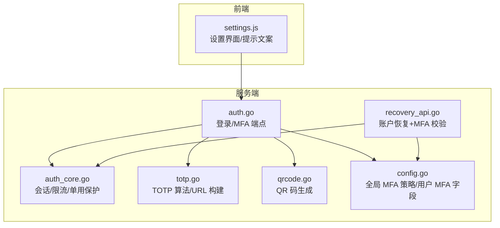
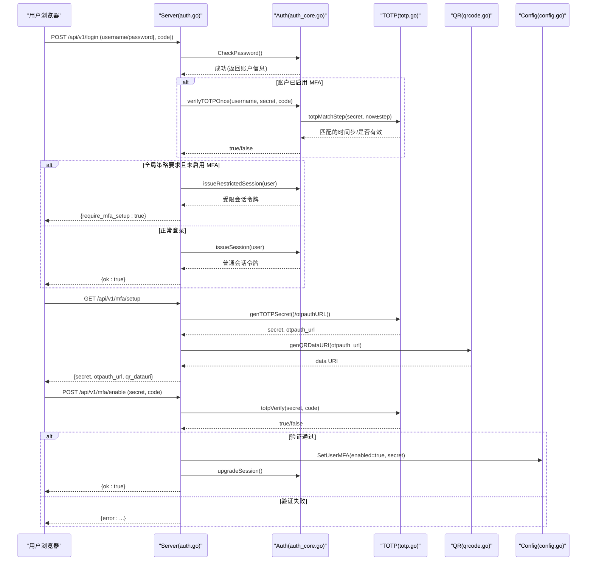
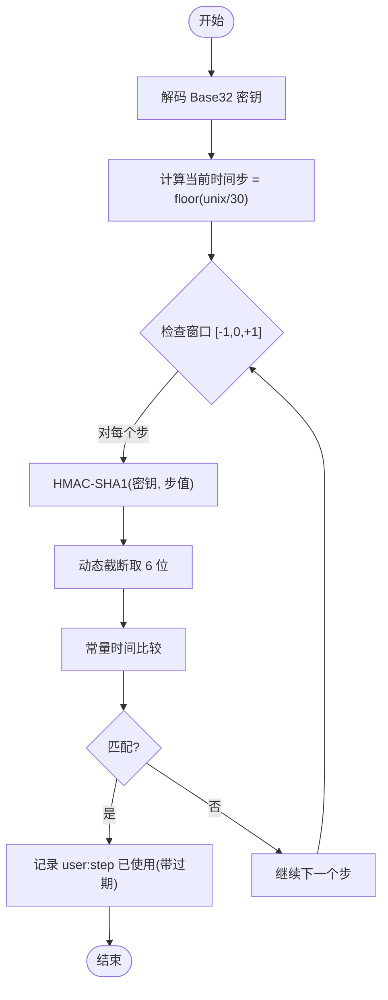
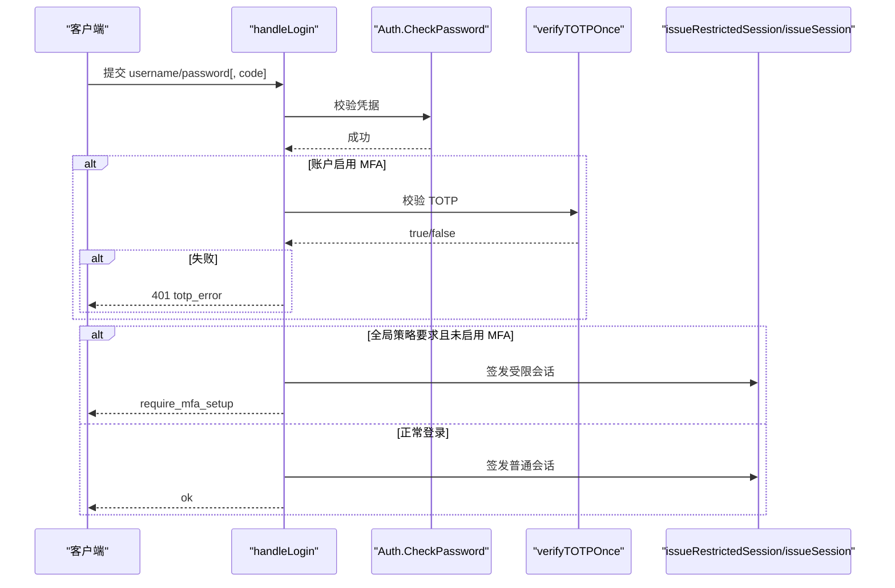
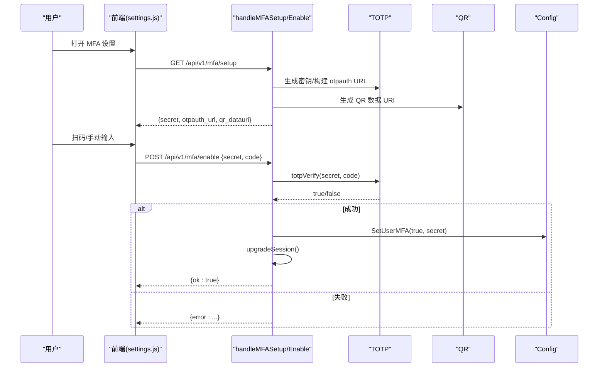
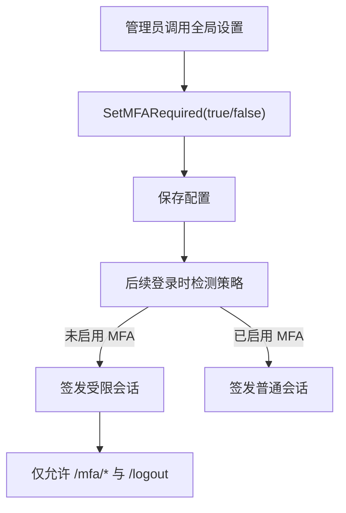
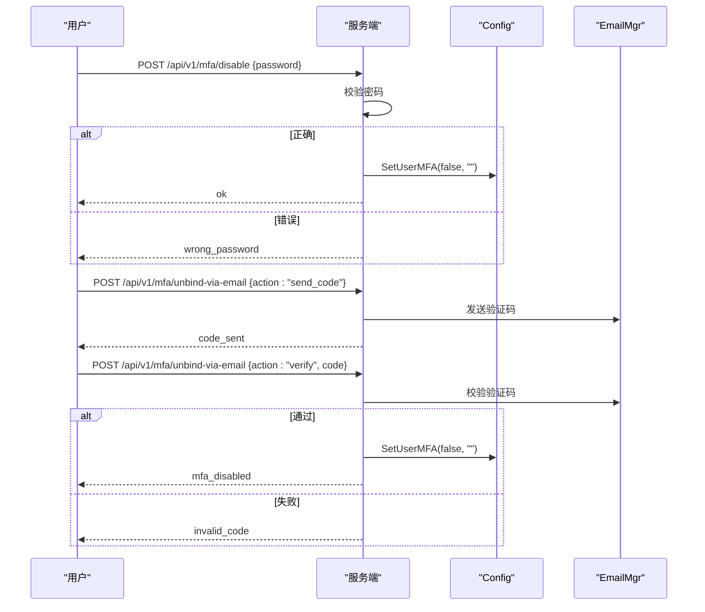
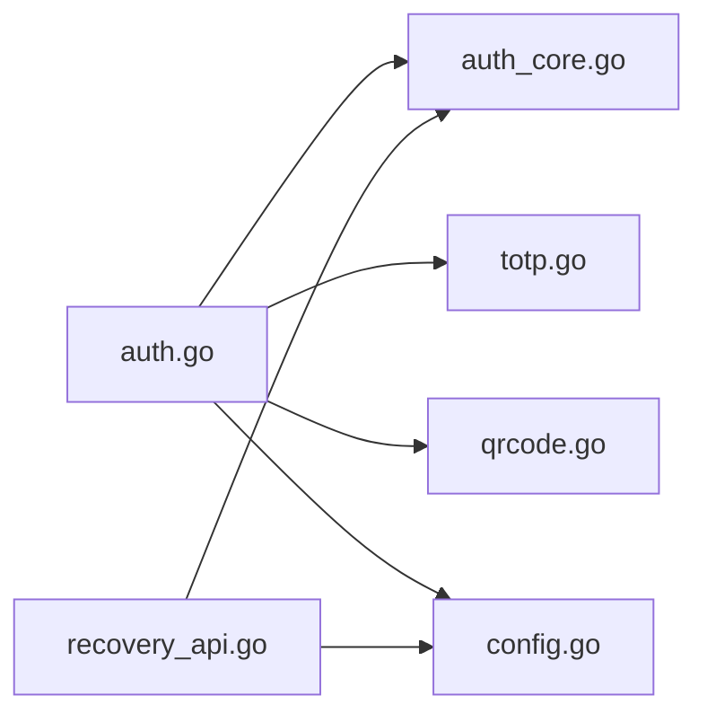

# 多因素认证

<cite>
**本文引用的文件**   
- [cmd/server/totp.go](file://cmd/server/totp.go)
- [cmd/server/auth.go](file://cmd/server/auth.go)
- [cmd/server/auth_core.go](file://cmd/server/auth_core.go)
- [cmd/server/qrcode.go](file://cmd/server/qrcode.go)
- [cmd/server/recovery_api.go](file://cmd/server/recovery_api.go)
- [cmd/server/config.go](file://cmd/server/config.go)
- [cmd/server/web/js/settings.js](file://cmd/server/web/js/settings.js)
</cite>

## 目录
1. [简介](#简介)
2. [项目结构](#项目结构)
3. [核心组件](#核心组件)
4. [架构总览](#架构总览)
5. [详细组件分析](#详细组件分析)
6. [依赖关系分析](#依赖关系分析)
7. [性能与安全考量](#性能与安全考量)
8. [故障排除指南](#故障排除指南)
9. [结论](#结论)
10. [附录：API 与配置参考](#附录api-与配置参考)

## 简介
本文件为 AIOps Monitor 的多因素认证（MFA）实现提供深入文档，重点覆盖 TOTP（基于时间的一次性密码）的密钥生成、二维码配置、验证码验证流程；全局 MFA 策略配置、强制启用机制与受限会话管理；以及 MFA 设置向导、禁用流程与恢复机制。同时给出集成示例、安全最佳实践与常见问题排查建议。

## 项目结构
与 MFA/TOTP 相关的后端逻辑主要分布在以下文件：
- TOTP 算法与工具：cmd/server/totp.go
- 登录/会话/MFA 端点与中间件：cmd/server/auth.go
- 会话与速率限制等认证内核：cmd/server/auth_core.go
- 二维码生成：cmd/server/qrcode.go
- 账户恢复（含 MFA 二次校验）：cmd/server/recovery_api.go
- 配置模型与持久化（含全局 MFA 开关）：cmd/server/config.go
- 前端交互（设置页与国际化文案）：cmd/server/web/js/settings.js

图表来源
- [cmd/server/auth.go:176-307](file://cmd/server/auth.go#L176-L307)
- [cmd/server/auth_core.go:262-285](file://cmd/server/auth_core.go#L262-L285)
- [cmd/server/totp.go:16-108](file://cmd/server/totp.go#L16-L108)
- [cmd/server/qrcode.go:10-22](file://cmd/server/qrcode.go#L10-L22)
- [cmd/server/recovery_api.go:94-186](file://cmd/server/recovery_api.go#L94-L186)
- [cmd/server/config.go:320-342](file://cmd/server/config.go#L320-L342)
- [cmd/server/web/js/settings.js:748-770](file://cmd/server/web/js/settings.js#L748-L770)

章节来源
- [cmd/server/auth.go:176-307](file://cmd/server/auth.go#L176-L307)
- [cmd/server/auth_core.go:262-285](file://cmd/server/auth_core.go#L262-L285)
- [cmd/server/totp.go:16-108](file://cmd/server/totp.go#L16-L108)
- [cmd/server/qrcode.go:10-22](file://cmd/server/qrcode.go#L10-L22)
- [cmd/server/recovery_api.go:94-186](file://cmd/server/recovery_api.go#L94-L186)
- [cmd/server/config.go:320-342](file://cmd/server/config.go#L320-L342)
- [cmd/server/web/js/settings.js:748-770](file://cmd/server/web/js/settings.js#L748-L770)

## 核心组件
- TOTP 计算与验证
  - 密钥生成：使用系统随机源生成 20 字节（160 位）Base32 编码密钥。
  - 时间步长：30 秒；支持 ±1 步时钟偏差容错。
  - 一次性保护：通过记录“用户:时间步”已使用状态，防止在滑动窗口内重放。
- 登录与 MFA 流程
  - 用户名/手机号 + 密码通过后，若账户开启 MFA，则要求输入 TOTP 验证码。
  - 全局策略开启时，未绑定 MFA 的用户将进入受限会话，仅允许完成 MFA 绑定或登出。
- 全局 MFA 策略
  - 管理员可切换全局强制策略；未绑定的用户在下次登录被引导至绑定流程。
- 恢复与解绑
  - 账户恢复流程中，若账户启用了 MFA，需额外提供 TOTP 作为第二因素。
  - 支持通过邮箱验证码解绑 MFA（需当前登录态）。

章节来源
- [cmd/server/totp.go:29-90](file://cmd/server/totp.go#L29-L90)
- [cmd/server/auth.go:252-307](file://cmd/server/auth.go#L252-L307)
- [cmd/server/auth_core.go:262-285](file://cmd/server/auth_core.go#L262-L285)
- [cmd/server/recovery_api.go:143-186](file://cmd/server/recovery_api.go#L143-L186)
- [cmd/server/config.go:784-805](file://cmd/server/config.go#L784-L805)

## 架构总览
下图展示了从登录到 MFA 校验、再到受限会话升级的完整调用链。

图表来源
- [cmd/server/auth.go:176-307](file://cmd/server/auth.go#L176-L307)
- [cmd/server/auth_core.go:262-285](file://cmd/server/auth_core.go#L262-L285)
- [cmd/server/totp.go:29-90](file://cmd/server/totp.go#L29-L90)
- [cmd/server/qrcode.go:10-22](file://cmd/server/qrcode.go#L10-L22)
- [cmd/server/config.go:881-893](file://cmd/server/config.go#L881-L893)

## 详细组件分析

### TOTP 实现原理与代码级细节
- 密钥长度与编码
  - 20 字节（160 位），Base32 无填充编码，兼容主流认证器应用。
- 时间步与动态截断
  - 每 30 秒一个时间步；采用 HMAC-SHA1 与动态截断生成 6 位数字。
- 时钟漂移容错
  - 验证时检查当前步及前后各一步，容忍 ±30 秒偏差。
- 一次性保护
  - 以“用户:时间步”为键记录已使用状态，过期清理，避免重放。

图表来源
- [cmd/server/totp.go:39-90](file://cmd/server/totp.go#L39-L90)
- [cmd/server/auth_core.go:262-285](file://cmd/server/auth_core.go#L262-L285)

章节来源
- [cmd/server/totp.go:29-90](file://cmd/server/totp.go#L29-L90)
- [cmd/server/auth_core.go:262-285](file://cmd/server/auth_core.go#L262-L285)

### 登录与 MFA 校验流程
- 登录入口
  - 先校验用户名/手机号与密码；成功后再判断是否需要 TOTP。
- 需要 MFA 时的响应
  - 若账户已启用 MFA 但未提交验证码，返回 mfa_required 提示客户端再次请求。
- 全局策略强制
  - 若全局策略要求且用户未启用 MFA，签发受限会话并返回 require_mfa_setup。
- 受限会话
  - 仅允许访问 MFA 绑定相关端点与登出；其他接口将被拒绝。

图表来源
- [cmd/server/auth.go:176-307](file://cmd/server/auth.go#L176-L307)
- [cmd/server/auth_core.go:262-285](file://cmd/server/auth_core.go#L262-L285)

章节来源
- [cmd/server/auth.go:176-307](file://cmd/server/auth.go#L176-L307)
- [cmd/server/auth_core.go:262-285](file://cmd/server/auth_core.go#L262-L285)

### MFA 设置向导（生成密钥、二维码、启用）
- 生成密钥与二维码
  - 调用生成随机密钥与 otpauth URL，并转换为数据 URI 供前端展示。
- 启用 MFA
  - 客户端提交 secret 与一次有效的 TOTP 码，服务端验证通过后写入用户配置，并将受限会话升级为普通会话。

图表来源
- [cmd/server/auth.go:536-585](file://cmd/server/auth.go#L536-L585)
- [cmd/server/totp.go:92-108](file://cmd/server/totp.go#L92-L108)
- [cmd/server/qrcode.go:10-22](file://cmd/server/qrcode.go#L10-L22)
- [cmd/server/config.go:881-893](file://cmd/server/config.go#L881-L893)

章节来源
- [cmd/server/auth.go:536-585](file://cmd/server/auth.go#L536-L585)
- [cmd/server/totp.go:92-108](file://cmd/server/totp.go#L92-L108)
- [cmd/server/qrcode.go:10-22](file://cmd/server/qrcode.go#L10-L22)
- [cmd/server/config.go:881-893](file://cmd/server/config.go#L881-L893)

### 全局 MFA 策略与受限会话
- 策略读取与切换
  - 管理员可通过专用端点查询与设置全局策略。
- 受限会话行为
  - 仅允许访问 MFA 绑定相关端点与登出；其他路径返回“需先完成 MFA”。

图表来源
- [cmd/server/auth.go:589-615](file://cmd/server/auth.go#L589-L615)
- [cmd/server/auth.go:158-171](file://cmd/server/auth.go#L158-L171)
- [cmd/server/config.go:784-805](file://cmd/server/config.go#L784-L805)

章节来源
- [cmd/server/auth.go:589-615](file://cmd/server/auth.go#L589-L615)
- [cmd/server/auth.go:158-171](file://cmd/server/auth.go#L158-L171)
- [cmd/server/config.go:784-805](file://cmd/server/config.go#L784-L805)

### 禁用与恢复机制
- 禁用 MFA
  - 需要重新输入当前密码进行确认，成功后清除用户 MFA 密钥。
- 邮箱解绑
  - 在当前登录态下，向绑定邮箱发送验证码，验证通过后解除 MFA。
- 账户恢复中的 MFA
  - 若账户启用 MFA，恢复流程需额外提供 TOTP 作为第二因素。

图表来源
- [cmd/server/auth.go:617-639](file://cmd/server/auth.go#L617-L639)
- [cmd/server/recovery_api.go:368-435](file://cmd/server/recovery_api.go#L368-L435)
- [cmd/server/config.go:881-893](file://cmd/server/config.go#L881-L893)

章节来源
- [cmd/server/auth.go:617-639](file://cmd/server/auth.go#L617-L639)
- [cmd/server/recovery_api.go:368-435](file://cmd/server/recovery_api.go#L368-L435)
- [cmd/server/config.go:881-893](file://cmd/server/config.go#L881-L893)

### 前端设置向导与国际化
- 初始化与登录视图控制
  - 前端在启动时调用 /me 获取当前用户信息，根据 must_change_password 等标志决定界面流程。
- 国际化文案
  - 包含 MFA 相关提示文本（如“请完成 2FA 绑定”、“请输入 6 位动态码”等）。

章节来源
- [cmd/server/web/js/settings.js:748-770](file://cmd/server/web/js/settings.js#L748-L770)

## 依赖关系分析
- 模块耦合
  - auth.go 依赖 auth_core.go（会话、限流、单用保护）、totp.go（算法）、qrcode.go（二维码）、config.go（配置读写）。
  - recovery_api.go 复用 auth_core.go 的单用保护与 config.go 的配置能力。
- 外部依赖
  - 二维码库用于生成 PNG 并转为 data URI。
- 潜在循环依赖
  - 当前实现未见循环导入；各模块职责清晰。

图表来源
- [cmd/server/auth.go:176-307](file://cmd/server/auth.go#L176-L307)
- [cmd/server/recovery_api.go:94-186](file://cmd/server/recovery_api.go#L94-L186)

章节来源
- [cmd/server/auth.go:176-307](file://cmd/server/auth.go#L176-L307)
- [cmd/server/recovery_api.go:94-186](file://cmd/server/recovery_api.go#L94-L186)

## 性能与安全考量
- 性能
  - TOTP 计算轻量，单次验证开销极小；±1 步窗口增加常数倍计算量，影响可忽略。
  - 会话验证使用哈希索引，避免泄露原始 token 的风险。
- 安全
  - 使用 PBKDF2-HMAC-SHA256 存储密码，迁移兼容旧格式。
  - TOTP 使用常量时间比较，防时序侧信道。
  - 单用保护防止同一时间步内的重放攻击。
  - 登录失败计数与账号维度限速，抵御暴力破解。
  - 配置文件权限收紧（0o600），敏感字段可选加密落盘。

[本节为通用指导，不直接分析具体文件]

## 故障排除指南
- 无法登录且提示需要 MFA
  - 检查账户是否已启用 MFA；若启用，请在认证器应用中查看当前 6 位码。
  - 若全局策略强制，未绑定的用户会被限制访问，请先完成绑定。
- 验证码总是失败
  - 确认设备时间与服务器时间偏差在 ±30 秒以内；必要时校准系统时间。
  - 检查是否在同一时间步重复使用验证码（已被单用保护拦截）。
- 无法禁用 MFA
  - 确保输入正确的当前密码；若忘记，可使用邮箱解绑流程。
- 恢复流程需要 MFA
  - 若账户启用 MFA，恢复密码时需要额外提供 TOTP 码。

章节来源
- [cmd/server/auth.go:252-307](file://cmd/server/auth.go#L252-L307)
- [cmd/server/auth_core.go:262-285](file://cmd/server/auth_core.go#L262-L285)
- [cmd/server/recovery_api.go:143-186](file://cmd/server/recovery_api.go#L143-L186)

## 结论
AIOps Monitor 的 MFA 实现遵循 RFC 6238，具备密钥生成、二维码配置、验证码校验、全局策略强制、受限会话管理与恢复解绑等完整能力。其设计兼顾安全性（常量时间比较、单用保护、PBKDF2 密码存储）与可用性（时钟漂移容错、受限会话引导绑定）。建议在生产环境启用 HTTPS、合理配置 SMTP 以支持邮箱解绑，并定期审计登录与 MFA 操作日志。

[本节为总结，不直接分析具体文件]

## 附录：API 与配置参考
- 登录与 MFA 相关端点
  - POST /api/v1/login：用户名/手机号 + 密码，必要时附加 TOTP 码
  - GET /api/v1/me：当前用户信息（含 mfa_enabled 等）
  - POST /api/v1/logout：登出
  - GET /api/v1/mfa/setup：生成密钥与二维码
  - POST /api/v1/mfa/enable：启用 MFA（需 secret 与一次有效 TOTP）
  - POST /api/v1/mfa/disable：禁用 MFA（需当前密码）
  - POST /api/v1/mfa/unbind-via-email：邮箱解绑（两步：发送验证码 → 验证）
  - GET/POST /api/v1/mfa/global：查询/设置全局 MFA 强制策略
- 账户恢复相关端点
  - POST /api/v1/account/recover-send-code：发送邮箱验证码
  - POST /api/v1/account/recover-verify：校验邮箱验证码（若启用 MFA 则返回需二次校验）
  - POST /api/v1/account/recover-verify-mfa：邮箱验证码 + TOTP 完成二次校验
  - POST /api/v1/account/reset-password：重置密码（支持新流程 reset_token 或旧流程 email+code）
- 关键配置项
  - ServerConfig.MFARequired：全局 MFA 强制策略
  - AccountConfig.MFAEnabled / MFASecret：用户级 MFA 开关与密钥

章节来源
- [cmd/server/auth.go:589-615](file://cmd/server/auth.go#L589-L615)
- [cmd/server/auth.go:536-585](file://cmd/server/auth.go#L536-L585)
- [cmd/server/auth.go:617-639](file://cmd/server/auth.go#L617-L639)
- [cmd/server/recovery_api.go:24-92](file://cmd/server/recovery_api.go#L24-L92)
- [cmd/server/recovery_api.go:94-186](file://cmd/server/recovery_api.go#L94-L186)
- [cmd/server/recovery_api.go:208-284](file://cmd/server/recovery_api.go#L208-L284)
- [cmd/server/config.go:479-483](file://cmd/server/config.go#L479-L483)
- [cmd/server/config.go:320-342](file://cmd/server/config.go#L320-L342)