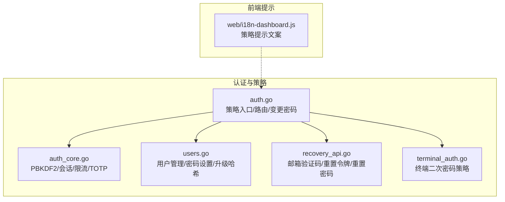
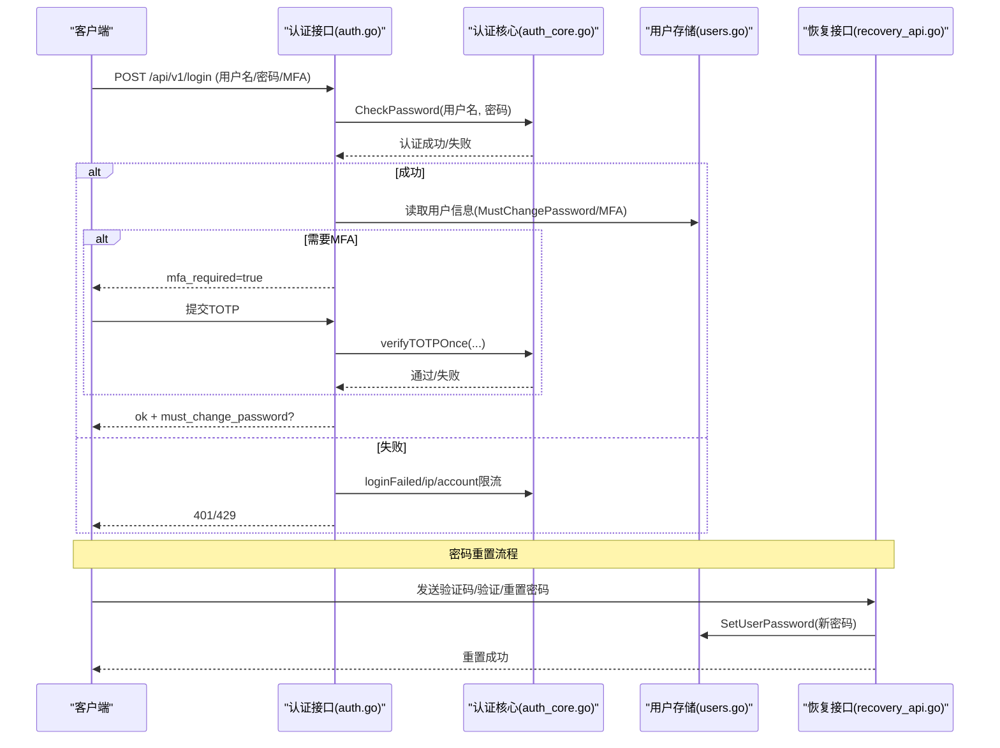
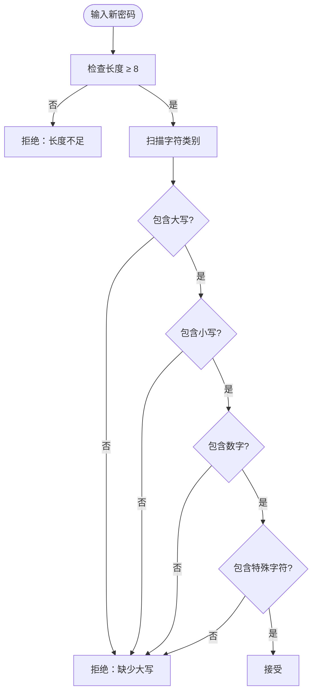
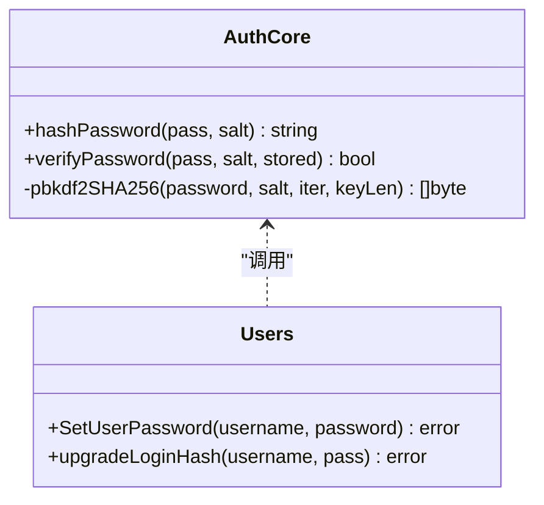
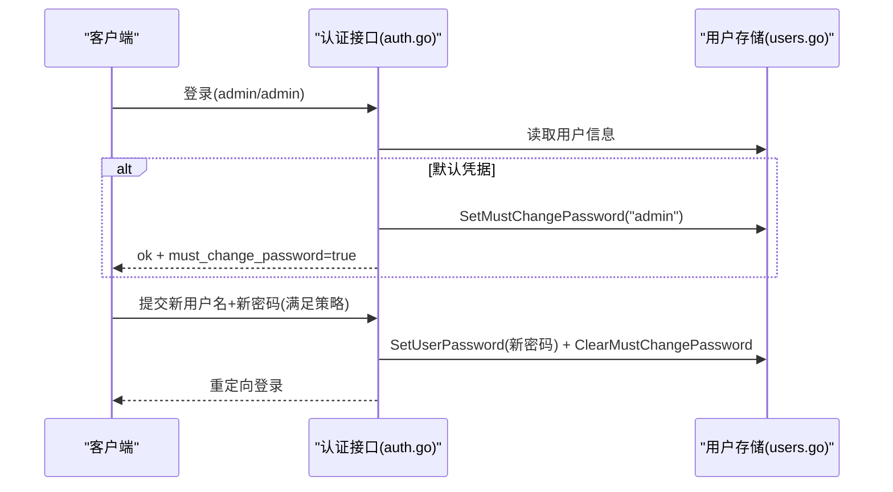
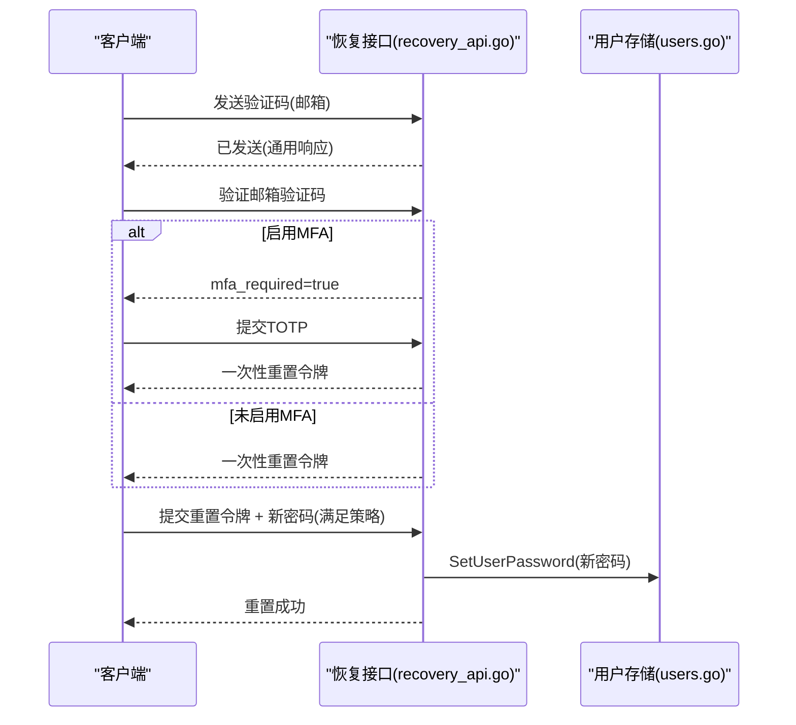
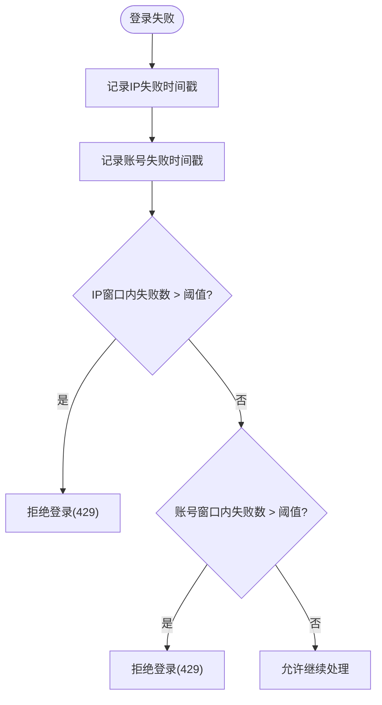
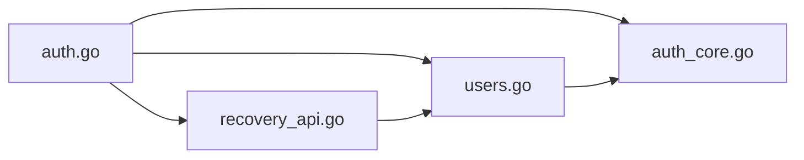

# 密码策略

<cite>
**本文引用的文件**   
- [auth.go](file://cmd/server/auth.go)
- [auth_core.go](file://cmd/server/auth_core.go)
- [users.go](file://cmd/server/users.go)
- [recovery_api.go](file://cmd/server/recovery_api.go)
- [terminal_auth.go](file://cmd/server/terminal_auth.go)
- [security_test.go](file://cmd/server/security_test.go)
- [storage_test.go](file://cmd/server/storage_test.go)
- [i18n-dashboard.js](file://cmd/server/web/i18n-dashboard.js)
</cite>

## 目录
1. [简介](#简介)
2. [项目结构](#项目结构)
3. [核心组件](#核心组件)
4. [架构总览](#架构总览)
5. [详细组件分析](#详细组件分析)
6. [依赖关系分析](#依赖关系分析)
7. [性能与安全特性](#性能与安全特性)
8. [故障排查指南](#故障排查指南)
9. [结论](#结论)
10. [附录：配置与最佳实践](#附录配置与最佳实践)

## 简介
本文件为 AIOps Monitor 的“密码策略”权威文档，覆盖以下主题：
- 密码强度验证规则（最小长度、字符类型组合）
- 密码哈希算法（PBKDF2-HMAC-SHA256）、盐值生成与安全存储
- 首次登录强制改密机制
- 密码重置流程（邮箱验证码 + 可选 MFA）
- 账户锁定策略（按 IP 与按账号维度的限流）
- 终端二次认证密码策略
- 密码策略配置示例、安全最佳实践与常见攻击防护

## 项目结构
与密码策略相关的后端实现集中在 cmd/server 目录下，关键文件如下：
- 认证与策略入口：auth.go
- 密码哈希与会话/限流核心：auth_core.go
- 用户管理与密码设置：users.go
- 账户找回与密码重置：recovery_api.go
- 终端二次认证密码校验：terminal_auth.go
- 相关测试用例：security_test.go、storage_test.go
- 前端提示文案（用于展示策略说明）：web/i18n-dashboard.js

图表来源
- [auth.go:1-120](file://cmd/server/auth.go#L1-L120)
- [auth_core.go:1-120](file://cmd/server/auth_core.go#L1-L120)
- [users.go:150-230](file://cmd/server/users.go#L150-L230)
- [recovery_api.go:200-285](file://cmd/server/recovery_api.go#L200-L285)
- [terminal_auth.go:17-40](file://cmd/server/terminal_auth.go#L17-L40)
- [i18n-dashboard.js:30-40](file://cmd/server/web/i18n-dashboard.js#L30-L40)

章节来源
- [auth.go:1-120](file://cmd/server/auth.go#L1-L120)
- [auth_core.go:1-120](file://cmd/server/auth_core.go#L1-L120)
- [users.go:150-230](file://cmd/server/users.go#L150-L230)
- [recovery_api.go:200-285](file://cmd/server/recovery_api.go#L200-L285)
- [terminal_auth.go:17-40](file://cmd/server/terminal_auth.go#L17-L40)
- [i18n-dashboard.js:30-40](file://cmd/server/web/i18n-dashboard.js#L30-L40)

## 核心组件
- 密码强度校验
  - 统一函数 validatePasswordStrength 在多处调用（修改密码、首次初始化、重置密码等），确保策略一致。
  - 规则：最少 8 个字符；必须同时包含大写字母、小写字母、数字和特殊字符（非字母数字）。
- 密码哈希与存储
  - 使用 PBKDF2-HMAC-SHA256，迭代次数固定为较高值，兼容旧版单轮 salted SHA-256，并在成功登录后自动升级为 PBKDF2。
  - 每个用户独立随机盐值，持久化时仅保存哈希与盐，不保存明文。
- 首次登录强制改密
  - 当检测到默认管理员凭据或管理员重置后，设置 MustChangePassword 标志，首次登录后返回 must_change_password 指示，并限制访问除初始化和 MFA 外的其他功能。
- 密码重置流程
  - 支持两步式邮箱验证码 + 一次性重置令牌；若启用 MFA，则需额外 TOTP 动态口令。
- 账户锁定策略
  - 基于 IP 的滑动窗口失败计数与基于账号维度的失败计数，达到阈值后拒绝登录请求。
- 终端二次认证密码
  - 独立的“终端密码”，同样要求 ≥8 位且含大小写+数字+特殊字符。

章节来源
- [auth.go:59-81](file://cmd/server/auth.go#L59-L81)
- [auth_core.go:22-88](file://cmd/server/auth_core.go#L22-L88)
- [auth.go:250-307](file://cmd/server/auth.go#L250-L307)
- [recovery_api.go:208-284](file://cmd/server/recovery_api.go#L208-L284)
- [auth_core.go:137-150](file://cmd/server/auth_core.go#L137-L150)
- [terminal_auth.go:17-40](file://cmd/server/terminal_auth.go#L17-L40)

## 架构总览
下图展示了从客户端发起登录到完成认证、以及后续密码变更/重置的关键交互路径。

图表来源
- [auth.go:176-307](file://cmd/server/auth.go#L176-L307)
- [auth_core.go:300-321](file://cmd/server/auth_core.go#L300-L321)
- [recovery_api.go:208-284](file://cmd/server/recovery_api.go#L208-L284)
- [users.go:193-208](file://cmd/server/users.go#L193-L208)

## 详细组件分析

### 密码强度验证规则
- 规则要点
  - 最小长度：≥8 字符
  - 字符类型组合：必须同时包含大写、小写、数字、特殊字符（非字母数字）
- 适用场景
  - 用户自行修改密码
  - 首次登录强制初始化密码
  - 邮箱验证码重置密码
  - 终端二次认证密码
- 前端提示
  - 多语言提示中明确显示策略要求，便于用户理解

图表来源
- [auth.go:59-81](file://cmd/server/auth.go#L59-L81)
- [terminal_auth.go:17-40](file://cmd/server/terminal_auth.go#L17-L40)
- [i18n-dashboard.js:30-40](file://cmd/server/web/i18n-dashboard.js#L30-L40)

章节来源
- [auth.go:59-81](file://cmd/server/auth.go#L59-L81)
- [terminal_auth.go:17-40](file://cmd/server/terminal_auth.go#L17-L40)
- [storage_test.go:123-144](file://cmd/server/storage_test.go#L123-L144)
- [i18n-dashboard.js:30-40](file://cmd/server/web/i18n-dashboard.js#L30-L40)

### 密码哈希算法与盐值生成
- 算法
  - PBKDF2-HMAC-SHA256，迭代次数固定为高值，符合 OWASP 建议
  - 兼容旧版单轮 salted SHA-256，并在成功登录后自动升级到 PBKDF2
- 盐值
  - 每次设置密码均生成新的随机盐值，避免彩虹表攻击
- 存储格式
  - 自描述格式，包含算法标识、迭代次数与哈希结果，便于未来演进
- 常量时间比较
  - 验证时使用常量时间比较，降低时序侧信道风险

图表来源
- [auth_core.go:22-88](file://cmd/server/auth_core.go#L22-L88)
- [users.go:193-228](file://cmd/server/users.go#L193-L228)

章节来源
- [auth_core.go:22-88](file://cmd/server/auth_core.go#L22-L88)
- [auth_core.go:300-321](file://cmd/server/auth_core.go#L300-L321)
- [users.go:193-228](file://cmd/server/users.go#L193-L228)
- [auth_test.go:13-54](file://cmd/server/auth_test.go#L13-L54)

### 首次登录强制改密
- 触发条件
  - 检测到默认管理员凭据或管理员重置后，设置 MustChangePassword 标志
- 行为
  - 首次登录成功后返回 must_change_password 指示
  - 全局 MFA 策略下，未启用 MFA 的用户会被限制访问，仅允许 MFA 设置/启用/登出
- 操作
  - 提供专用初始化接口，允许用户在一次操作中设置新用户名与新密码，完成后强制重新登录

图表来源
- [auth.go:250-307](file://cmd/server/auth.go#L250-L307)
- [auth.go:469-529](file://cmd/server/auth.go#L469-L529)
- [users.go:230-253](file://cmd/server/users.go#L230-L253)

章节来源
- [auth.go:250-307](file://cmd/server/auth.go#L250-L307)
- [auth.go:469-529](file://cmd/server/auth.go#L469-L529)
- [users.go:230-253](file://cmd/server/users.go#L230-L253)

### 密码重置流程
- 两种路径
  - 路径A：邮箱验证码 → 一次性重置令牌 → 设置新密码
  - 路径B：用户名 + 邮箱 + 验证码（旧流程），若启用 MFA 需额外 TOTP
- 安全控制
  - 所有路径均强制执行统一的密码强度策略
  - 重置成功后清除该用户的所有会话，强制重新登录
  - 对邮箱验证码进行速率限制与一次性消费

图表来源
- [recovery_api.go:24-92](file://cmd/server/recovery_api.go#L24-L92)
- [recovery_api.go:94-186](file://cmd/server/recovery_api.go#L94-L186)
- [recovery_api.go:208-284](file://cmd/server/recovery_api.go#L208-L284)
- [users.go:193-208](file://cmd/server/users.go#L193-L208)

章节来源
- [recovery_api.go:24-92](file://cmd/server/recovery_api.go#L24-L92)
- [recovery_api.go:94-186](file://cmd/server/recovery_api.go#L94-L186)
- [recovery_api.go:208-284](file://cmd/server/recovery_api.go#L208-L284)
- [users.go:193-208](file://cmd/server/users.go#L193-L208)

### 账户锁定策略
- 维度
  - 按 IP 的滑动窗口失败计数（防止同一来源暴力破解）
  - 按账号的滑动窗口失败计数（防止分布式轮换 IP 针对单一账号的攻击）
- 阈值与窗口
  - 每 IP 窗口内最大失败次数与每账号窗口内最大失败次数均有上限
- 行为
  - 超过阈值返回“尝试过多”错误码
  - 成功登录后会清零对应账号的失败计数

图表来源
- [auth_core.go:137-150](file://cmd/server/auth_core.go#L137-L150)
- [auth_core.go:182-260](file://cmd/server/auth_core.go#L182-L260)
- [auth.go:211-248](file://cmd/server/auth.go#L211-L248)
- [security_test.go:12-29](file://cmd/server/security_test.go#L12-L29)

章节来源
- [auth_core.go:137-150](file://cmd/server/auth_core.go#L137-L150)
- [auth_core.go:182-260](file://cmd/server/auth_core.go#L182-L260)
- [auth.go:211-248](file://cmd/server/auth.go#L211-L248)
- [security_test.go:12-29](file://cmd/server/security_test.go#L12-L29)

### 终端二次认证密码策略
- 目的
  - 远程终端具备最高权限，需在登录之外增加一层“守护密码”
- 策略
  - 与登录密码策略一致：≥8 位，含大写、小写、数字、特殊字符
- 验证
  - 每次会话可缓存一次验证结果，但设置/修改时需严格校验

章节来源
- [terminal_auth.go:17-40](file://cmd/server/terminal_auth.go#L17-L40)
- [users.go:270-315](file://cmd/server/users.go#L270-L315)

## 依赖关系分析
- 模块耦合
  - auth.go 作为策略入口，依赖 auth_core.go 的哈希与限流能力，依赖 users.go 的用户数据读写，依赖 recovery_api.go 的重置流程
  - users.go 依赖 auth_core.go 的哈希函数进行密码设置与升级
- 外部依赖
  - 无第三方库依赖，全部使用标准库实现（crypto/hmac、crypto/sha256、crypto/rand 等）

图表来源
- [auth.go:1-120](file://cmd/server/auth.go#L1-L120)
- [auth_core.go:1-120](file://cmd/server/auth_core.go#L1-L120)
- [users.go:150-230](file://cmd/server/users.go#L150-L230)
- [recovery_api.go:200-285](file://cmd/server/recovery_api.go#L200-L285)

章节来源
- [auth.go:1-120](file://cmd/server/auth.go#L1-L120)
- [auth_core.go:1-120](file://cmd/server/auth_core.go#L1-L120)
- [users.go:150-230](file://cmd/server/users.go#L150-L230)
- [recovery_api.go:200-285](file://cmd/server/recovery_api.go#L200-L285)

## 性能与安全特性
- 性能
  - PBKDF2 迭代次数较高，单次验证有一定 CPU 开销，但能有效抵御离线暴力破解
  - 会话与限流数据结构采用内存映射，定期清理过期条目，防止无限增长
- 安全
  - 常量时间比较避免时序侧信道
  - 兼容旧哈希并自动升级，平滑迁移
  - 邮箱验证码一次性消费与速率限制
  - 终端二次认证与 MFA 双重保护
  - 全局 MFA 策略可强制用户启用两步验证

[本节为通用指导，无需具体文件引用]

## 故障排查指南
- 常见问题
  - 密码不符合策略：确认是否满足长度与四类字符要求
  - 重置失败：检查邮箱验证码是否有效、是否已被消费；如启用 MFA，请确认 TOTP 正确
  - 登录被拒：检查是否达到 IP 或账号维度的失败阈值，等待窗口过期或联系管理员解锁
- 定位方法
  - 查看服务端日志中的认证与重置相关条目
  - 核对前端提示文案是否与策略一致

章节来源
- [recovery_api.go:24-92](file://cmd/server/recovery_api.go#L24-L92)
- [recovery_api.go:94-186](file://cmd/server/recovery_api.go#L94-L186)
- [auth.go:211-248](file://cmd/server/auth.go#L211-L248)
- [i18n-dashboard.js:30-40](file://cmd/server/web/i18n-dashboard.js#L30-L40)

## 结论
AIOps Monitor 的密码策略以强哈希（PBKDF2-HMAC-SHA256）、严格强度规则、完善的重置流程与多维限流为核心，结合 MFA 与终端二次认证，形成纵深防御体系。建议在部署环境中配合全局 MFA 策略与 HTTPS 传输，进一步提升安全性。

[本节为总结性内容，无需具体文件引用]

## 附录：配置与最佳实践

### 密码策略配置示例
- 统一策略（适用于登录密码与终端密码）
  - 最小长度：≥8 字符
  - 字符类型：必须包含大写、小写、数字、特殊字符
- 前端提示文案参考
  - “密码至少 8 位，且需同时包含大写字母、小写字母、数字和特殊字符”

章节来源
- [auth.go:59-81](file://cmd/server/auth.go#L59-L81)
- [terminal_auth.go:17-40](file://cmd/server/terminal_auth.go#L17-L40)
- [i18n-dashboard.js:30-40](file://cmd/server/web/i18n-dashboard.js#L30-L40)

### 安全最佳实践
- 启用全局 MFA 策略，强制管理员与操作员启用两步验证
- 使用 HTTPS 传输，避免中间人窃听
- 定期审查审计日志，关注异常登录与重置事件
- 合理调整限流阈值与窗口，平衡用户体验与安全性
- 谨慎管理 SMTP 配置，确保验证码邮件通道可靠

[本节为通用指导，无需具体文件引用]

### 常见密码攻击防护措施
- 暴力破解防护
  - 基于 IP 与账号维度的滑动窗口限流
  - 高迭代次数的 PBKDF2 哈希
- 凭证泄露防护
  - 禁止明文存储，仅存哈希与盐
  - 自动升级旧哈希至 PBKDF2
- 重放与枚举防护
  - 邮箱验证码一次性消费与速率限制
  - 统一响应避免枚举邮箱/用户名

章节来源
- [auth_core.go:137-150](file://cmd/server/auth_core.go#L137-L150)
- [auth_core.go:22-88](file://cmd/server/auth_core.go#L22-L88)
- [recovery_api.go:24-92](file://cmd/server/recovery_api.go#L24-L92)