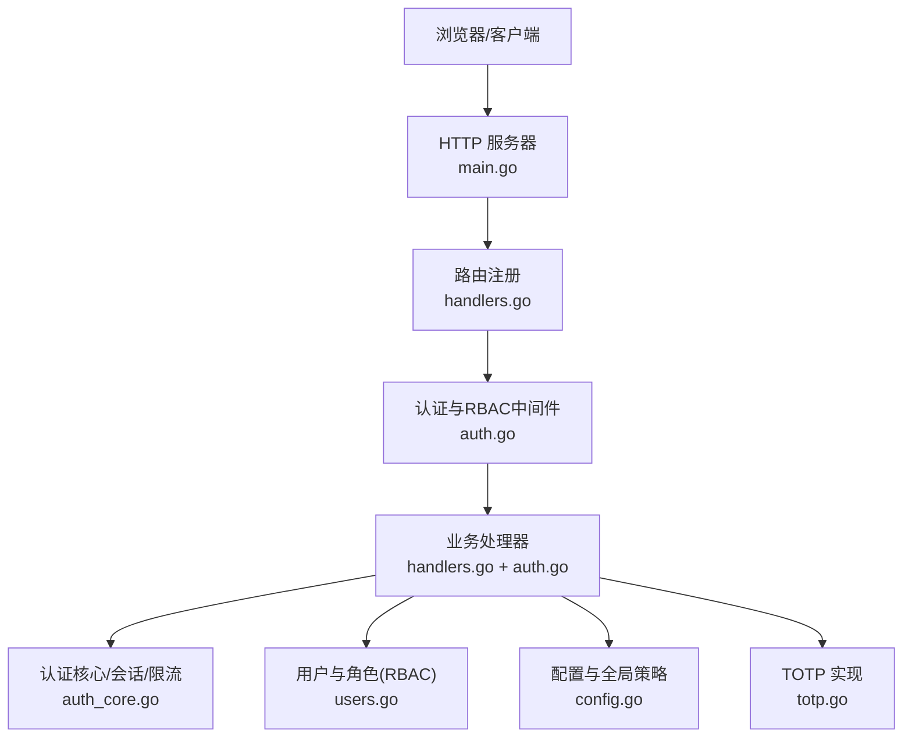
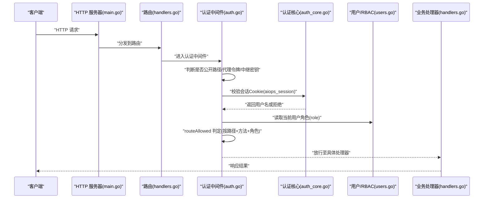
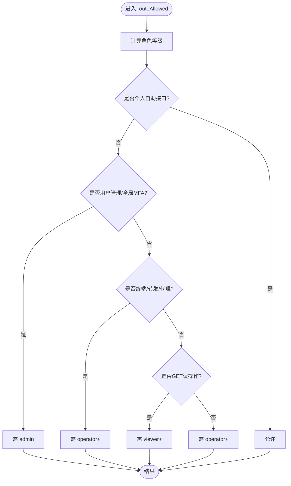
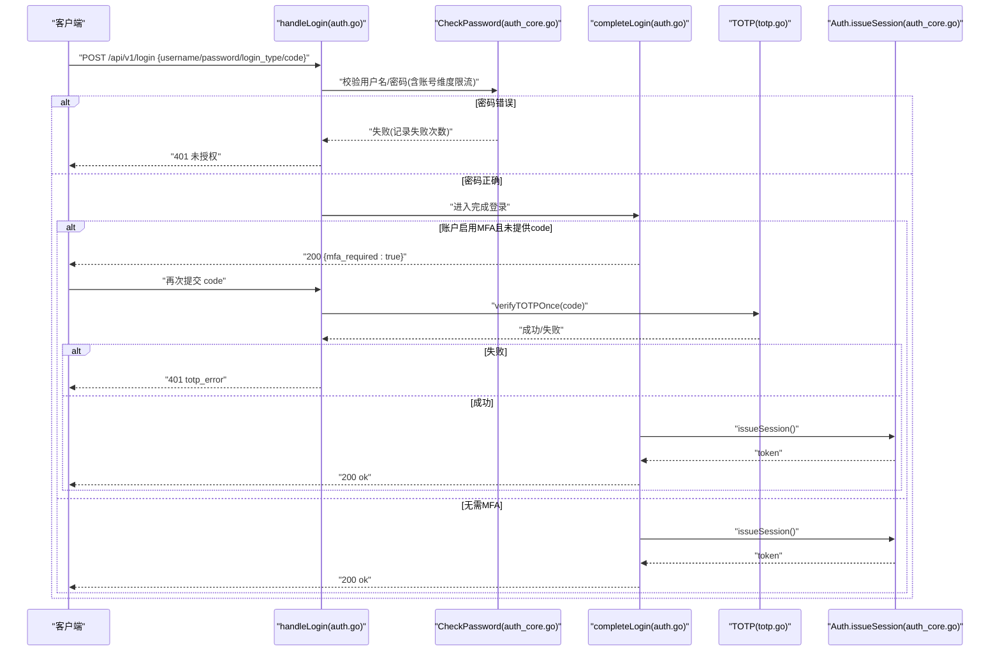
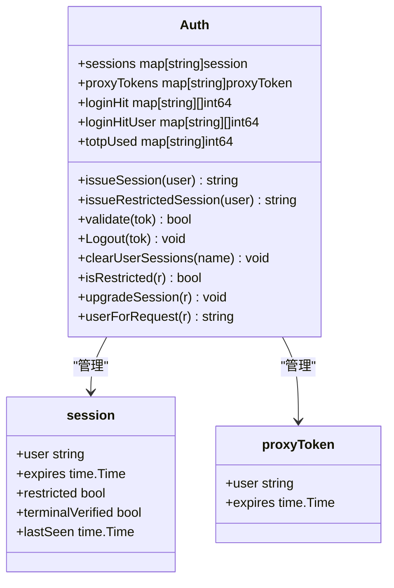
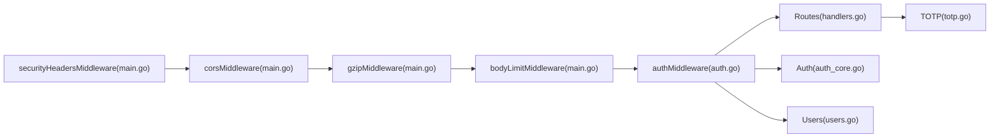

# 应用层安全

<cite>
**本文引用的文件**   
- [cmd/server/auth.go](file://cmd/server/auth.go)
- [cmd/server/auth_core.go](file://cmd/server/auth_core.go)
- [cmd/server/totp.go](file://cmd/server/totp.go)
- [cmd/server/users.go](file://cmd/server/users.go)
- [cmd/server/config.go](file://cmd/server/config.go)
- [cmd/server/handlers.go](file://cmd/server/handlers.go)
- [cmd/server/main.go](file://cmd/server/main.go)
</cite>

## 目录
1. [简介](#简介)
2. [项目结构（与安全相关）](#项目结构与安全相关)
3. [核心组件](#核心组件)
4. [架构总览](#架构总览)
5. [详细组件分析](#详细组件分析)
6. [依赖关系分析](#依赖关系分析)
7. [性能与可用性考量](#性能与可用性考量)
8. [故障排查指南](#故障排查指南)
9. [结论](#结论)
10. [附录：安全配置示例与最佳实践](#附录安全配置示例与最佳实践)

## 简介
本文件聚焦 AIOps Monitor 的应用层安全，覆盖以下主题：
- RBAC 权限模型与路由级访问控制
- 用户认证流程（用户名/手机号、默认凭据强制改密）
- 会话管理（令牌生成、持久化、滑动空闲超时、受限会话）
- 密码策略与强度校验
- MFA 两步验证（TOTP）与全局强制策略
- CSRF 防护现状与建议
- XSS 防护现状与建议
- 登录安全策略、会话超时控制
- 安全配置示例与常见攻击防护措施

## 项目结构（与安全相关）
与安全相关的核心代码集中在服务端 cmd/server 下：
- 认证与会话：auth.go、auth_core.go
- TOTP 实现：totp.go
- 多用户与 RBAC：users.go
- 配置与全局策略：config.go
- HTTP 路由与中间件：handlers.go、main.go

图表来源
- [cmd/server/main.go:72-136](file://cmd/server/main.go#L72-L136)
- [cmd/server/handlers.go:100-350](file://cmd/server/handlers.go#L100-L350)
- [cmd/server/auth.go:110-172](file://cmd/server/auth.go#L110-L172)
- [cmd/server/auth_core.go:107-180](file://cmd/server/auth_core.go#L107-L180)
- [cmd/server/users.go:19-41](file://cmd/server/users.go#L19-L41)
- [cmd/server/config.go:476-489](file://cmd/server/config.go#L476-L489)
- [cmd/server/totp.go:16-27](file://cmd/server/totp.go#L16-L27)

章节来源
- [cmd/server/main.go:72-136](file://cmd/server/main.go#L72-L136)
- [cmd/server/handlers.go:100-350](file://cmd/server/handlers.go#L100-L350)

## 核心组件
- 认证与授权中间件：统一鉴权入口，负责公开路径放行、代理令牌校验、会话有效性检查、受限会话限制、RBAC 判定。
- 会话管理器：会话令牌生命周期、绝对过期与滑动空闲超时、受限会话、终端二次认证标记、代理令牌等。
- 用户与 RBAC：三角色（admin/operator/viewer）、路由级权限矩阵、用户元数据与密码管理。
- TOTP 两步验证：RFC 6238 兼容实现、一次性使用保护、全局强制策略。
- 配置与策略：全局 MFA 强制、CORS 白名单、TrustProxy、中继密钥、转发监听地址等。

章节来源
- [cmd/server/auth.go:110-172](file://cmd/server/auth.go#L110-L172)
- [cmd/server/auth_core.go:96-150](file://cmd/server/auth_core.go#L96-L150)
- [cmd/server/users.go:19-41](file://cmd/server/users.go#L19-L41)
- [cmd/server/totp.go:16-27](file://cmd/server/totp.go#L16-L27)
- [cmd/server/config.go:476-489](file://cmd/server/config.go#L476-L489)

## 架构总览
下图展示一次受保护的 API 请求从进入服务器到通过认证与 RBAC 的完整链路。

图表来源
- [cmd/server/main.go:294-303](file://cmd/server/main.go#L294-L303)
- [cmd/server/handlers.go:100-350](file://cmd/server/handlers.go#L100-L350)
- [cmd/server/auth.go:110-172](file://cmd/server/auth.go#L110-L172)
- [cmd/server/auth_core.go:331-362](file://cmd/server/auth_core.go#L331-L362)
- [cmd/server/users.go:126-136](file://cmd/server/users.go#L126-L136)

## 详细组件分析

### RBAC 权限模型与路由级访问控制
- 角色定义与等级
  - admin（最高）、operator、viewer（最低），未知角色视为无权限。
- 路由允许规则
  - 个人自助接口（登出、修改密码、个人资料、MFA 设置/启用/禁用）：任意已登录角色均可。
  - 用户管理与全局 MFA 开关：仅 admin。
  - 远程终端、端口转发、反向代理：operator+。
  - GET 读操作：viewer+。
  - 其他写/动作：operator+。
- 代理令牌路径 /proxy/ 的特殊处理
  - 支持基于 cookie 或查询参数的短期令牌；即使通过令牌，仍会按当前用户角色再次执行 routeAllowed，防止签发后降权导致的越权窗口。

图表来源
- [cmd/server/auth.go:83-108](file://cmd/server/auth.go#L83-L108)
- [cmd/server/users.go:25-41](file://cmd/server/users.go#L25-L41)

章节来源
- [cmd/server/auth.go:83-108](file://cmd/server/auth.go#L83-L108)
- [cmd/server/users.go:19-41](file://cmd/server/users.go#L19-L41)

#### 角色权限矩阵
- admin：全部读写 + 用户管理 + 全局 MFA 策略
- operator：除用户管理外的所有写/动作 + 终端/转发/代理
- viewer：只读 + 个人自助（密码/资料/MFA）

章节来源
- [cmd/server/auth.go:83-108](file://cmd/server/auth.go#L83-L108)
- [cmd/server/users.go:19-41](file://cmd/server/users.go#L19-L41)

### 用户认证流程
- 登录入口
  - 支持用户名与手机号两种登录类型。
  - 失败时记录 IP 与账号维度的失败次数，触发限流。
- 密码校验与升级
  - 使用 PBKDF2-HMAC-SHA256 存储哈希；旧格式在首次成功登录后自动升级。
- 默认凭据检测与强制改密
  - 若检测到默认 admin/admin，首次登录将强制要求修改用户名和密码。
- MFA 第二因素
  - 若账户开启 MFA，需要输入 TOTP 动态口令；否则直接发放会话。
- 全局 MFA 强制策略
  - 管理员可开启“必须启用 MFA”策略；未启用的用户将被授予受限会话，仅允许访问 MFA 设置/启用/登出。
- 会话发放
  - 颁发 aiops_session Cookie，包含 HttpOnly、SameSite=Lax、Secure（HTTPS 时）。

图表来源
- [cmd/server/auth.go:176-307](file://cmd/server/auth.go#L176-L307)
- [cmd/server/auth_core.go:297-321](file://cmd/server/auth_core.go#L297-L321)
- [cmd/server/totp.go:57-90](file://cmd/server/totp.go#L57-L90)

章节来源
- [cmd/server/auth.go:176-307](file://cmd/server/auth.go#L176-L307)
- [cmd/server/auth_core.go:297-321](file://cmd/server/auth_core.go#L297-L321)
- [cmd/server/totp.go:57-90](file://cmd/server/totp.go#L57-L90)

### 会话管理机制
- 令牌与存储
  - 会话令牌为随机串，内部以 SHA-256 摘要索引，避免明文泄露可被重放。
  - 会话信息内存维护并持久化，重启后可恢复有效会话。
- 过期与空闲
  - 绝对过期时间（默认 7 天）与滑动空闲超时（默认 24 小时）双重控制。
- 受限会话
  - 当全局强制 MFA 策略生效且用户未启用 MFA 时，发放受限会话，仅允许访问 MFA 设置/启用/登出。
- 代理令牌
  - 用于 window.open 等新上下文场景的一次性短令牌，有效期短且单用即焚。
- 登出与会话失效
  - 登出删除会话；修改密码会清除该用户的所有会话并重新颁发新会话。

图表来源
- [cmd/server/auth_core.go:96-150](file://cmd/server/auth_core.go#L96-L150)
- [cmd/server/auth_core.go:331-432](file://cmd/server/auth_core.go#L331-L432)

章节来源
- [cmd/server/auth_core.go:96-150](file://cmd/server/auth_core.go#L96-L150)
- [cmd/server/auth_core.go:331-432](file://cmd/server/auth_core.go#L331-L432)

### 密码策略与强度验证
- 强度规则
  - 长度至少 8 位，且包含大写字母、小写字母、数字和特殊字符（非字母数字）。
- 存储与迁移
  - 采用 PBKDF2-HMAC-SHA256，迭代次数符合 OWASP 建议；旧格式在首次成功登录时透明升级。
- 强制改密
  - 首次登录检测到默认凭据或管理员重置后，强制走“账户初始化”流程，不可跳过。

章节来源
- [cmd/server/auth.go:60-81](file://cmd/server/auth.go#L60-81)
- [cmd/server/auth_core.go:22-88](file://cmd/server/auth_core.go#L22-88)
- [cmd/server/auth.go:250-307](file://cmd/server/auth.go#L250-L307)

### MFA 两步验证（TOTP）
- 标准与兼容性
  - RFC 6238，6 位、30 秒步长、Base32 密钥，兼容 Google Authenticator。
- 一次性使用保护
  - 同一时间步长的 TOTP 在同一用户范围内仅能使用一次，防重放。
- 全局强制策略
  - 管理员可开启全局强制 MFA；未启用用户将被限制访问范围直至完成绑定。
- 解除与降级
  - 关闭 MFA 需再次验证密码，防止会话劫持后直接关闭。

章节来源
- [cmd/server/totp.go:16-27](file://cmd/server/totp.go#L16-L27)
- [cmd/server/auth.go:531-639](file://cmd/server/auth.go#L531-L639)
- [cmd/server/auth_core.go:262-285](file://cmd/server/auth_core.go#L262-L285)

### CSRF 防护现状与建议
- 现状
  - 未发现显式的 CSRF Token 机制。
  - 会话 Cookie 设置了 SameSite=Lax，可在一定程度上缓解跨站请求伪造风险。
  - 安全响应头中未设置 Strict-Transport-Security（HSTS），但可通过反向代理或 TLS 环境启用。
- 建议
  - 对敏感写操作引入 CSRF Token 或双提交 Cookie 校验。
  - 在生产环境启用 HTTPS 并通过反向代理设置 HSTS。
  - 严格限定 CORS 白名单，避免使用通配符。

章节来源
- [cmd/server/auth.go:283-299](file://cmd/server/auth.go#L283-L299)
- [cmd/server/main.go:72-102](file://cmd/server/main.go#L72-L102)

### XSS 防护现状与建议
- 现状
  - 后端设置了 Content-Security-Policy（script-src 'self'，object-src 'none'，frame-ancestors 'none' 等），显著降低脚本注入风险。
  - 前端渲染强调转义与事件委托，避免 innerHTML 直写。
- 建议
  - 持续审计模板与翻译资源中的 HTML 注入点，确保仅可信数据写入 DOM。
  - 对 /proxy/ 等特殊路径保持最小化 CSP 放宽，避免破坏目标站点功能的同时维持安全基线。

章节来源
- [cmd/server/main.go:113-136](file://cmd/server/main.go#L113-L136)

### 登录安全策略与速率限制
- 登录限流
  - 基于 IP 的滑动窗口失败计数，超过阈值则暂时拒绝。
  - 基于账号维度的失败计数，抵御分布式撞库。
- 终端二次认证
  - 针对终端访问的二次密码验证具备独立的失败计数与锁定机制。

章节来源
- [cmd/server/auth_core.go:182-260](file://cmd/server/auth_core.go#L182-L260)
- [cmd/server/auth_core.go:555-585](file://cmd/server/auth_core.go#L555-L585)

## 依赖关系分析
- 中间件链顺序
  - securityHeadersMiddleware → corsMiddleware → gzipMiddleware → bodyLimitMiddleware → authMiddleware → Routes
- 关键依赖
  - authMiddleware 依赖 Auth（会话/限流/TOTP）、ConfigStore（角色/全局策略）、Users（角色映射）。
  - handlers 中各处理器依赖 Auth、ConfigStore、Users、TOTP。

图表来源
- [cmd/server/main.go:294-303](file://cmd/server/main.go#L294-L303)
- [cmd/server/auth.go:110-172](file://cmd/server/auth.go#L110-L172)
- [cmd/server/handlers.go:100-350](file://cmd/server/handlers.go#L100-L350)

章节来源
- [cmd/server/main.go:294-303](file://cmd/server/main.go#L294-L303)
- [cmd/server/auth.go:110-172](file://cmd/server/auth.go#L110-L172)
- [cmd/server/handlers.go:100-350](file://cmd/server/handlers.go#L100-L350)

## 性能与可用性考量
- 会话校验与滑动空闲更新在每次请求中进行，注意在高并发下的锁竞争。
- TOTP 一次性使用表与登录失败计数表存在清理逻辑，防止无限增长。
- 安全响应头与压缩中间件会增加少量 CPU 开销，但对带宽节省显著。

[本节为通用指导，不直接分析具体文件]

## 故障排查指南
- 无法登录或频繁 401
  - 检查 IP 与账号维度的失败计数是否达到限流阈值。
  - 确认是否处于受限会话状态（全局 MFA 强制但未启用）。
- 修改密码后仍被登出
  - 修改密码会清除该用户所有会话并重新颁发，属预期行为。
- 代理令牌无效
  - 代理令牌为一次性且短时效，请确认来源与有效期。
- 终端二次认证失败
  - 检查终端密码验证失败计数与锁定时间。

章节来源
- [cmd/server/auth_core.go:182-260](file://cmd/server/auth_core.go#L182-L260)
- [cmd/server/auth.go:432-467](file://cmd/server/auth.go#L432-L467)
- [cmd/server/auth_core.go:555-585](file://cmd/server/auth_core.go#L555-L585)

## 结论
AIOps Monitor 在应用层实现了较为完善的安全基线：
- 明确的 RBAC 与路由级拦截，覆盖读/写/高危能力。
- 强化的认证流程（PBKDF2、默认凭据强制改密、IP/账号双维度限流）。
- 完善的会话管理（绝对过期+滑动空闲、受限会话、代理令牌）。
- 可选的 TOTP 两步验证与全局强制策略。
- 合理的安全响应头与 CSP，降低 XSS 风险。
建议在后续版本中补充 CSRF Token 机制与生产环境的 HSTS 策略，进一步加固跨站攻击面。

[本节为总结，不直接分析具体文件]

## 附录：安全配置示例与最佳实践

- 全局 MFA 强制
  - 通过管理员接口切换全局 MFA 策略；未启用 MFA 的用户将被限制访问范围直至完成绑定。
- 会话 Cookie 安全属性
  - HttpOnly、SameSite=Lax、Secure（HTTPS 时）均已设置，生产务必启用 HTTPS。
- CORS 收敛
  - 建议配置 CORSOrigins 白名单，避免使用通配符。
- TrustProxy
  - 仅在可信反向代理后启用，以便正确识别真实客户端 IP 进行限流。
- 中继密钥
  - 配置 relay_secret 并在网关侧携带 X-Relay-Secret 头，防止非法中继接入。
- 转发监听地址
  - 默认 127.0.0.1，如需外部访问请在配置中显式设置为 0.0.0.0，并结合网络边界控制。

章节来源
- [cmd/server/config.go:476-489](file://cmd/server/config.go#L476-L489)
- [cmd/server/auth.go:283-299](file://cmd/server/auth.go#L283-L299)
- [cmd/server/main.go:72-102](file://cmd/server/main.go#L72-L102)