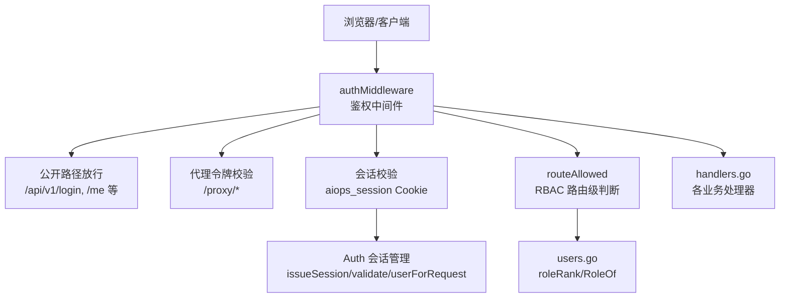
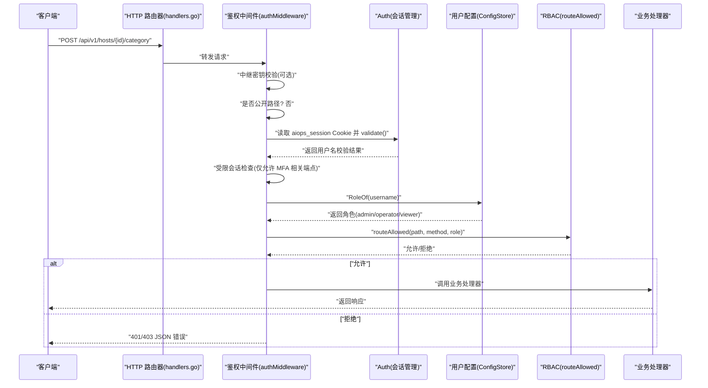
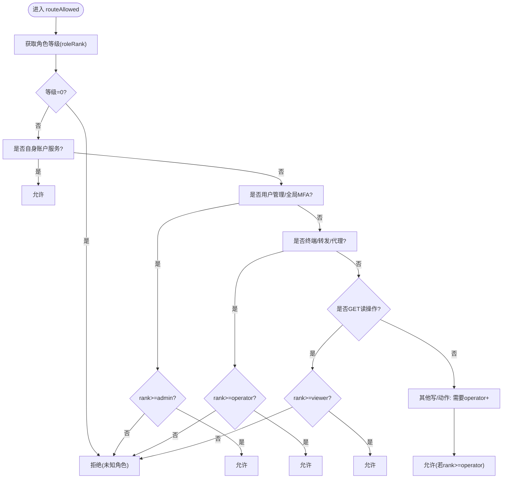
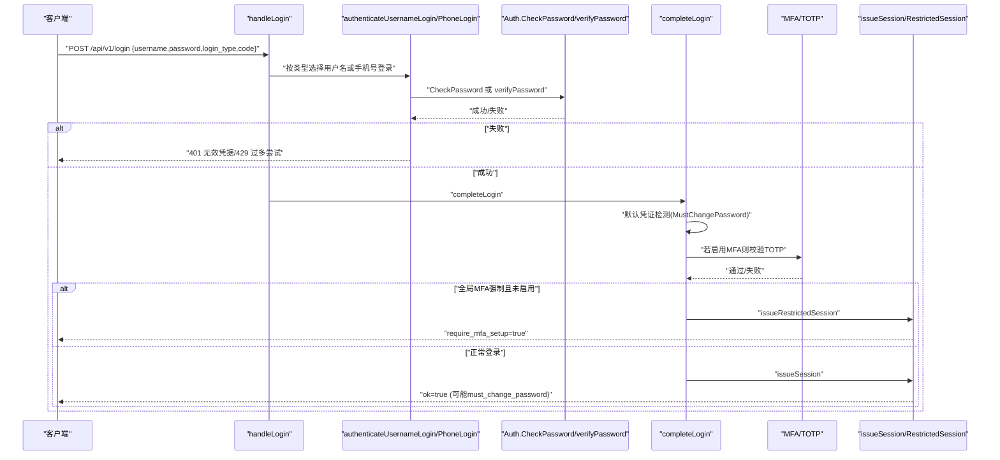
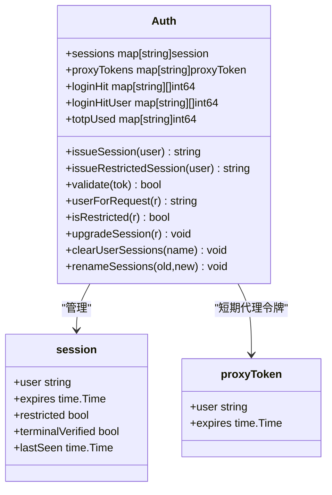
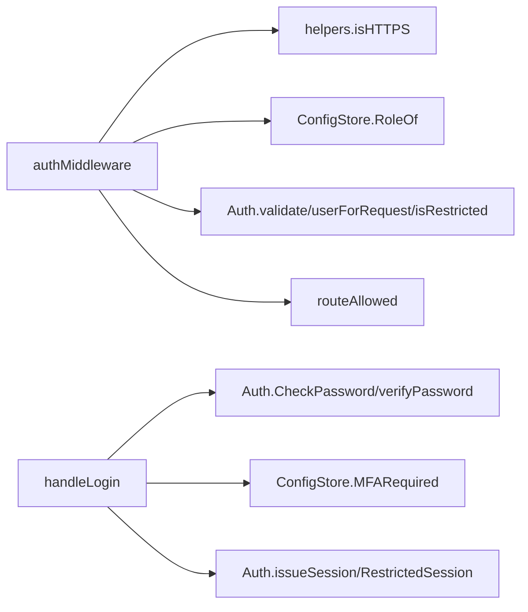

# 认证与授权

<cite>
**本文引用的文件**   
- [cmd/server/auth.go](file://cmd/server/auth.go)
- [cmd/server/auth_core.go](file://cmd/server/auth_core.go)
- [cmd/server/users.go](file://cmd/server/users.go)
- [cmd/server/handlers.go](file://cmd/server/handlers.go)
- [cmd/server/helpers.go](file://cmd/server/helpers.go)
- [cmd/server/config.go](file://cmd/server/config.go)
- [cmd/server/terminal_auth.go](file://cmd/server/terminal_auth.go)
</cite>

## 目录
1. [简介](#简介)
2. [项目结构](#项目结构)
3. [核心组件](#核心组件)
4. [架构总览](#架构总览)
5. [详细组件分析](#详细组件分析)
6. [依赖关系分析](#依赖关系分析)
7. [性能与安全特性](#性能与安全特性)
8. [故障排查指南](#故障排查指南)
9. [结论](#结论)
10. [附录：权限矩阵与路由示例](#附录权限矩阵与路由示例)

## 简介
本文件面向 AIOps Monitor 的认证与授权子系统，系统性阐述 RBAC 权限模型、用户认证流程（用户名/密码、手机号登录、默认凭证检测）、会话管理与 Cookie 安全配置、以及中间件实现原理。文档同时给出常见安全攻击防护策略与路由级权限控制示例，帮助读者快速理解并正确部署使用。

## 项目结构
认证与授权相关代码集中在服务端 cmd/server 目录下，关键文件职责如下：
- auth.go：HTTP 鉴权中间件、登录/登出、MFA、账户初始化、密码策略等处理逻辑
- auth_core.go：会话管理、令牌生成与校验、PBKDF2 密码哈希、限流与 TOTP 单用保护
- users.go：多用户与 RBAC 角色定义、角色等级映射、用户元数据与 MFA 开关等持久化操作
- handlers.go：路由注册，将 API 路径绑定到具体处理器
- helpers.go：客户端 IP 解析、HTTPS 判定、敏感信息脱敏等通用工具
- config.go：全局配置（含 MFA 强制策略、代理信任、中继密钥等）
- terminal_auth.go：终端二次密码设置与验证

图表来源
- [cmd/server/auth.go:112-172](file://cmd/server/auth.go#L112-L172)
- [cmd/server/auth_core.go:331-362](file://cmd/server/auth_core.go#L331-L362)
- [cmd/server/users.go:26-37](file://cmd/server/users.go#L26-L37)
- [cmd/server/handlers.go:100-160](file://cmd/server/handlers.go#L100-L160)

章节来源
- [cmd/server/auth.go:112-172](file://cmd/server/auth.go#L112-L172)
- [cmd/server/handlers.go:100-160](file://cmd/server/handlers.go#L100-L160)

## 核心组件
- 认证中间件（authMiddleware）：统一拦截非公开路径，完成中继密钥校验、代理令牌校验、会话有效性检查、受限会话限制、RBAC 路由判断。
- 会话管理（Auth）：基于随机令牌 + SHA-256 索引的内存会话表，支持绝对过期与滑动空闲超时；提供受限会话（仅允许 MFA 注册/启用/登出）。
- 密码存储与升级：PBKDF2-HMAC-SHA256，兼容旧版加盐 SHA-256，在首次成功登录后自动升级。
- RBAC 角色与等级：admin/operator/viewer，通过 roleRank 映射为数值等级，结合 routeAllowed 进行路由级访问控制。
- 登录流程：支持用户名/密码与手机号+密码两种模式，失败计数与账号维度限流，TOTP 二次校验，默认凭证检测与强制改密。
- Cookie 安全：HttpOnly、Secure（依据 TLS 或可信反代头）、SameSite=Lax，MaxAge 与 sessionTTL 一致。
- 终端二次认证：独立于登录口令的“终端密码”，用于进入远程终端前的二次确认。

章节来源
- [cmd/server/auth.go:112-172](file://cmd/server/auth.go#L112-L172)
- [cmd/server/auth_core.go:17-20](file://cmd/server/auth_core.go#L17-L20)
- [cmd/server/auth_core.go:22-88](file://cmd/server/auth_core.go#L22-L88)
- [cmd/server/users.go:19-37](file://cmd/server/users.go#L19-L37)
- [cmd/server/auth.go:176-307](file://cmd/server/auth.go#L176-L307)
- [cmd/server/helpers.go:84-97](file://cmd/server/helpers.go#L84-L97)
- [cmd/server/terminal_auth.go:105-142](file://cmd/server/terminal_auth.go#L105-L142)

## 架构总览
下图展示一次受保护的 API 请求从到达服务器到最终被放行的完整链路，包括中间件、会话校验、RBAC 判断与受限会话约束。

图表来源
- [cmd/server/handlers.go:100-160](file://cmd/server/handlers.go#L100-L160)
- [cmd/server/auth.go:112-172](file://cmd/server/auth.go#L112-L172)
- [cmd/server/auth_core.go:331-362](file://cmd/server/auth_core.go#L331-L362)
- [cmd/server/users.go:127-136](file://cmd/server/users.go#L127-L136)
- [cmd/server/auth.go:86-108](file://cmd/server/auth.go#L86-L108)

## 详细组件分析

### RBAC 权限模型与角色等级
- 角色常量与等级映射：
  - admin → 3
  - operator → 2
  - viewer → 1
  - 未知 → 0（直接拒绝）
- 路由级权限规则（routeAllowed）：
  - 自身账户服务（logout/password/profile/account/init/mfa/*）：任意已登录角色均可
  - 用户管理与全局 MFA（/api/v1/users*、/api/v1/mfa/global）：仅 admin
  - 远程终端、端口转发、HTTP 代理（包含 /terminal、/api/v1/forward*、/proxy/*、/api/v1/proxy-token）：operator+
  - GET 读操作：viewer+
  - 其他写/动作：operator+

图表来源
- [cmd/server/users.go:26-37](file://cmd/server/users.go#L26-L37)
- [cmd/server/auth.go:86-108](file://cmd/server/auth.go#L86-L108)

章节来源
- [cmd/server/users.go:19-41](file://cmd/server/users.go#L19-L41)
- [cmd/server/auth.go:86-108](file://cmd/server/auth.go#L86-L108)

### 用户认证流程
- 登录入口：POST /api/v1/login
  - 支持 login_type="username"（默认）与 "phone"
  - 失败时记录 IP 与账号维度的失败次数，触发限流
- 用户名/密码验证：
  - 通过 CheckPassword 匹配用户并验证 PBKDF2 哈希
  - 若为旧版加盐 SHA-256，则在成功后自动升级为 PBKDF2
- 手机号+密码验证：
  - 通过 UserByPhone 查找用户，再使用 verifyPassword 比对
- 默认凭证检测与强制改密：
  - 首次登录检测到 admin/admin 且未标记 MustChangePassword 时，设置 MustChangePassword=true，并在响应中提示
- MFA 二次校验：
  - 若用户启用了 MFA，则需提交 TOTP 码；否则返回 mfa_required
  - 全局 MFA 策略开启时，未启用 MFA 的用户将被发放受限会话，仅允许访问 MFA 注册/启用/登出
- 会话签发：
  - 签发 aiops_session Cookie，设置 HttpOnly、Secure（依据 TLS 或可信反代）、SameSite=Lax、MaxAge=sessionTTL（7天）

图表来源
- [cmd/server/auth.go:176-307](file://cmd/server/auth.go#L176-L307)
- [cmd/server/auth_core.go:297-321](file://cmd/server/auth_core.go#L297-L321)
- [cmd/server/auth_core.go:380-402](file://cmd/server/auth_core.go#L380-L402)

章节来源
- [cmd/server/auth.go:176-307](file://cmd/server/auth.go#L176-L307)
- [cmd/server/auth_core.go:297-321](file://cmd/server/auth_core.go#L297-L321)

### 会话管理机制与 Cookie 安全
- 会话令牌：
  - 使用 crypto/rand 生成随机 token，以 SHA-256 作为存储键，避免泄露可重放
- 会话生命周期：
  - 绝对过期：sessionTTL=7天
  - 滑动空闲超时：sessionIdleTimeout=24小时，每次活动更新 lastSeen
- 受限会话：
  - 当全局 MFA 强制且用户未启用 MFA 时，发放 restricted=true 的会话，仅允许 /mfa/setup、/mfa/enable、/logout
- Cookie 安全属性：
  - Name: aiops_session
  - HttpOnly: true（防止 JS 读取）
  - Secure: 根据 isHTTPS 判定（直连 TLS 或可信反代 X-Forwarded-Proto=https）
  - SameSite: Lax（跨站导航携带，阻止跨站 POST 附带）
  - MaxAge: sessionTTL（秒）

图表来源
- [cmd/server/auth_core.go:96-155](file://cmd/server/auth_core.go#L96-L155)
- [cmd/server/auth_core.go:380-402](file://cmd/server/auth_core.go#L380-L402)
- [cmd/server/auth_core.go:331-362](file://cmd/server/auth_core.go#L331-L362)
- [cmd/server/auth_core.go:404-432](file://cmd/server/auth_core.go#L404-L432)

章节来源
- [cmd/server/auth_core.go:17-20](file://cmd/server/auth_core.go#L17-L20)
- [cmd/server/auth_core.go:331-362](file://cmd/server/auth_core.go#L331-L362)
- [cmd/server/auth_core.go:380-402](file://cmd/server/auth_core.go#L380-L402)
- [cmd/server/helpers.go:84-97](file://cmd/server/helpers.go#L84-L97)

### 密码哈希与迁移
- 当前算法：PBKDF2-HMAC-SHA256，迭代次数 pbkdf2Iter=600000
- 兼容旧格式：加盐 SHA-256（64位十六进制），在首次成功登录后自动升级
- 验证函数 verifyPassword 使用常数时间比较，防时序侧信道

章节来源
- [cmd/server/auth_core.go:22-88](file://cmd/server/auth_core.go#L22-L88)
- [cmd/server/auth_core.go:297-321](file://cmd/server/auth_core.go#L297-L321)

### 终端二次认证
- 目的：在访问远程终端前再次确认身份，降低会话劫持风险
- 流程：
  - 设置终端密码：POST /api/user/terminal-password/set
  - 验证终端密码：POST /api/user/terminal-password/verify
  - 状态查询：GET /api/user/terminal-password/status
- 速率限制：同一用户多次失败会锁定一段时间

章节来源
- [cmd/server/terminal_auth.go:105-142](file://cmd/server/terminal_auth.go#L105-L142)

### 中间件实现原理与代理令牌
- authMiddleware 执行顺序：
  1) 中继共享密钥校验（可选）
  2) 公开路径放行
  3) /proxy/* 代理令牌优先（cookie > query pt），校验后仍走 RBAC
  4) 会话校验（aiops_session）
  5) 受限会话限制（仅 MFA 相关端点）
  6) RBAC 路由判断（routeAllowed）
- 代理令牌：
  - 短生命周期（proxyTokenTTL=60s），一次性使用，仅 operator+ 可签发
  - 通过 cookie 或 ?pt= 回退传递（注意：建议仅使用 cookie 以提升安全性）

章节来源
- [cmd/server/auth.go:112-172](file://cmd/server/auth.go#L112-L172)
- [cmd/server/auth_core.go:157-176](file://cmd/server/auth_core.go#L157-L176)

## 依赖关系分析
- 中间件依赖：
  - helpers.isHTTPS：决定 Cookie Secure 标志
  - ConfigStore.RoleOf：获取用户角色
  - Auth.userForRequest/validate/isRestricted：会话与受限状态
  - routeAllowed：RBAC 决策
- 登录流程依赖：
  - Auth.CheckPassword/verifyPassword：密码校验与哈希升级
  - ConfigStore.MFARequired：全局 MFA 策略
  - Auth.issueSession/issueRestrictedSession：会话签发

图表来源
- [cmd/server/auth.go:112-172](file://cmd/server/auth.go#L112-L172)
- [cmd/server/helpers.go:84-97](file://cmd/server/helpers.go#L84-L97)
- [cmd/server/users.go:127-136](file://cmd/server/users.go#L127-L136)
- [cmd/server/auth_core.go:297-321](file://cmd/server/auth_core.go#L297-L321)
- [cmd/server/auth_core.go:380-402](file://cmd/server/auth_core.go#L380-L402)

章节来源
- [cmd/server/auth.go:112-172](file://cmd/server/auth.go#L112-L172)
- [cmd/server/helpers.go:84-97](file://cmd/server/helpers.go#L84-L97)
- [cmd/server/users.go:127-136](file://cmd/server/users.go#L127-L136)
- [cmd/server/auth_core.go:297-321](file://cmd/server/auth_core.go#L297-L321)
- [cmd/server/auth_core.go:380-402](file://cmd/server/auth_core.go#L380-L402)

## 性能与安全特性
- 性能
  - 会话校验为内存 O(1) 查找，带互斥锁保护
  - 登录失败计数采用滑动窗口清理，防止无限增长
  - TOTP 单用保护维护最近时间步集合，定期清理过期项
- 安全
  - 密码哈希：PBKDF2，兼容旧格式并自动升级
  - 会话令牌：随机生成 + SHA-256 索引，避免泄露可重放
  - 会话过期：绝对过期 + 滑动空闲超时
  - Cookie 安全：HttpOnly、Secure（TLS 或可信反代）、SameSite=Lax
  - 限流：IP 维度与账号维度双重限流，防止暴力破解
  - 终端二次认证：独立口令 + 失败锁定
  - 中继密钥：X-Relay-Secret 常数时间比较
  - 代理令牌：短生命周期、一次性使用、仍需 RBAC 复核

[本节为通用指导，不直接分析具体文件]

## 故障排查指南
- 无法登录（401/429）
  - 检查 IP 与账号维度失败计数是否超限
  - 查看日志中的登录失败条目
- 登录后立即被要求 MFA 注册
  - 检查全局 MFA 策略是否开启
  - 确认用户是否已启用 MFA
- 代理令牌无效
  - 确认令牌是否在有效期内（60s）
  - 确认签发者角色是否为 operator+
- Cookie 未发送或被浏览器拒绝
  - 检查是否 HTTPS（Secure 标志）
  - 检查 SameSite 策略与跨域场景
- 终端二次认证失败
  - 检查是否设置了终端密码
  - 查看失败次数是否达到锁定阈值

章节来源
- [cmd/server/auth_core.go:182-260](file://cmd/server/auth_core.go#L182-L260)
- [cmd/server/auth.go:176-307](file://cmd/server/auth.go#L176-L307)
- [cmd/server/terminal_auth.go:105-142](file://cmd/server/terminal_auth.go#L105-L142)

## 结论
AIOps Monitor 的认证与授权体系围绕“强密码哈希 + 会话管理 + RBAC 路由级控制”构建，辅以 MFA、终端二次认证、中继密钥与代理令牌等纵深防御机制。Cookie 安全配置遵循现代最佳实践，限流与单用 TOTP 有效抵御暴力破解与重放攻击。建议在公网部署时始终启用 HTTPS 与可信反代，严格遵循最小权限原则分配角色，并定期审计与会话清理。

[本节为总结性内容，不直接分析具体文件]

## 附录：权限矩阵与路由示例
- 角色等级
  - admin=3、operator=2、viewer=1
- 路由级权限规则摘要
  - 自身账户服务：任意已登录角色
  - 用户管理/全局 MFA：admin
  - 终端/转发/代理：operator+
  - GET 读：viewer+
  - 其他写/动作：operator+
- 典型路由示例
  - GET /api/v1/hosts → viewer+
  - POST /api/v1/hosts/{id}/category → operator+
  - GET /api/v1/hosts/{id}/terminal → operator+
  - POST /api/v1/users → admin
  - POST /api/v1/mfa/global → admin
  - GET /api/v1/me → 任意已登录角色

章节来源
- [cmd/server/users.go:19-41](file://cmd/server/users.go#L19-L41)
- [cmd/server/auth.go:86-108](file://cmd/server/auth.go#L86-L108)
- [cmd/server/handlers.go:100-160](file://cmd/server/handlers.go#L100-L160)