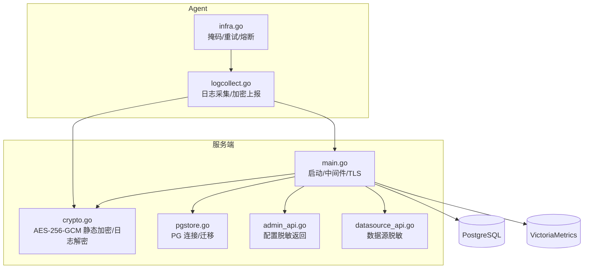
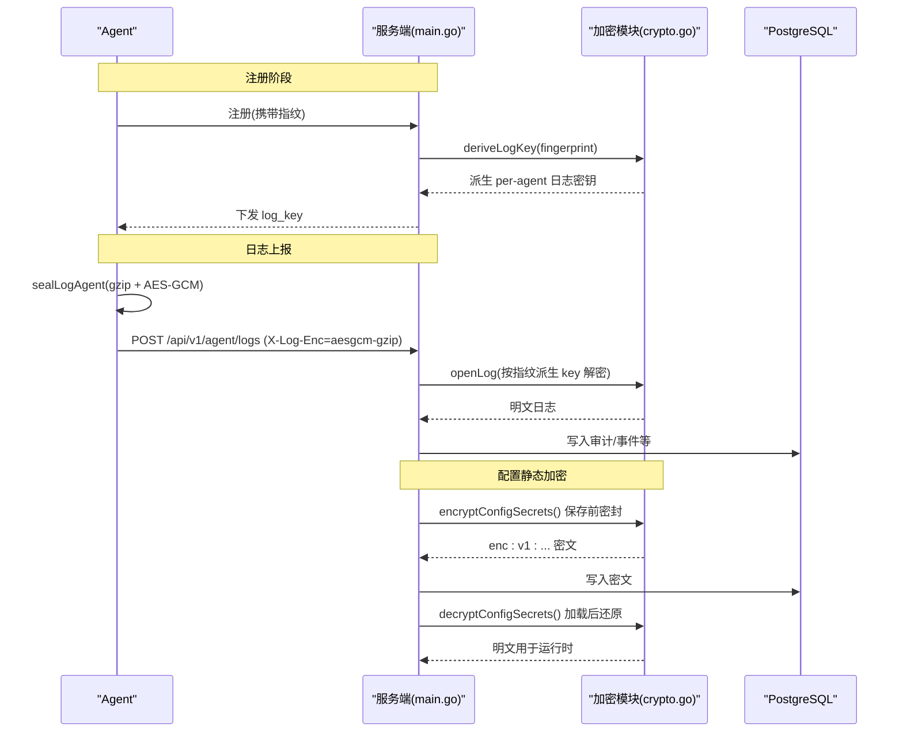
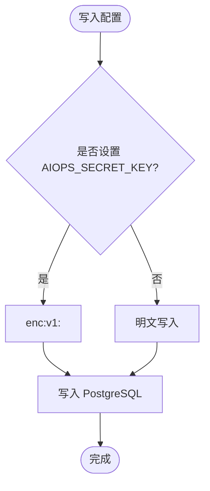
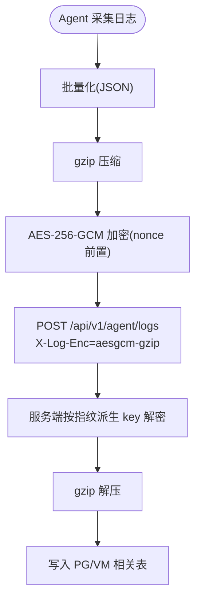
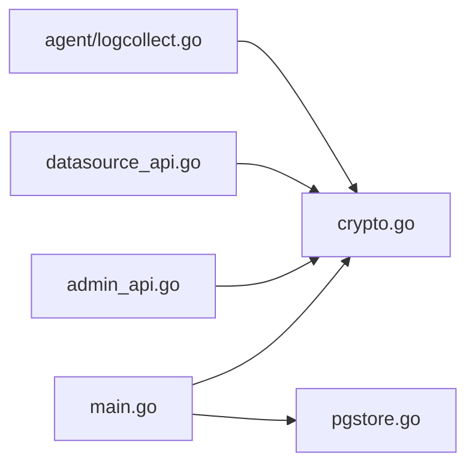

# 数据安全

<cite>
**本文引用的文件**   
- [README.md](file://README.md)
- [cmd/server/main.go](file://cmd/server/main.go)
- [cmd/server/crypto.go](file://cmd/server/crypto.go)
- [cmd/server/admin_api.go](file://cmd/server/admin_api.go)
- [cmd/server/datasource_api.go](file://cmd/server/datasource_api.go)
- [cmd/server/pgstore.go](file://cmd/server/pgstore.go)
- [cmd/agent/logcollect.go](file://cmd/agent/logcollect.go)
- [cmd/agent/infra.go](file://cmd/agent/infra.go)
- [config.example.json](file://config.example.json)
</cite>

## 目录
1. [简介](#简介)
2. [项目结构](#项目结构)
3. [核心组件](#核心组件)
4. [架构总览](#架构总览)
5. [详细组件分析](#详细组件分析)
6. [依赖关系分析](#依赖关系分析)
7. [性能与内存安全](#性能与内存安全)
8. [故障排查指南](#故障排查指南)
9. [结论](#结论)
10. [附录：配置示例与安全最佳实践](#附录配置示例与安全最佳实践)

## 简介
本文件面向 AIOps Monitor 的数据安全，覆盖静态数据加密（AES-256-GCM）、敏感信息保护、数据库安全、密钥管理、配置文件加密、内存数据清理、日志传输加密、SSRF 防护、备份与恢复安全等主题。文档同时给出可操作的配置建议与最佳实践，帮助在生产环境中实现端到端的数据保密性与完整性保障。

## 项目结构
AIOps Monitor 采用“服务端 + Agent”的架构：
- 服务端负责统一存储（PostgreSQL 关系型数据 + VictoriaMetrics 时序数据）、配置持久化、告警与审计、终端与会话录制、AI 能力集成等。
- Agent 负责主机采集、拨测、端口转发、远程终端通道、日志采集与上报。

图示来源
- [cmd/server/main.go:227-355](file://cmd/server/main.go#L227-L355)
- [cmd/server/crypto.go:1-205](file://cmd/server/crypto.go#L1-L205)
- [cmd/server/pgstore.go:1-75](file://cmd/server/pgstore.go#L1-L75)
- [cmd/server/admin_api.go:10-43](file://cmd/server/admin_api.go#L10-L43)
- [cmd/server/datasource_api.go:1-42](file://cmd/server/datasource_api.go#L1-L42)
- [cmd/agent/logcollect.go:1-231](file://cmd/agent/logcollect.go#L1-L231)
- [cmd/agent/infra.go:1-191](file://cmd/agent/infra.go#L1-L191)

章节来源
- [cmd/server/main.go:227-355](file://cmd/server/main.go#L227-L355)
- [README.md:869-885](file://README.md#L869-L885)

## 核心组件
- 静态数据加密（AES-256-GCM）
  - 通过环境变量 AIOPS_SECRET_KEY 派生主密钥，对 MFA/SMTP/AI/webhook/relay 等可逆凭据进行落库前密封；读取时自动解密。未设置主密钥则保持明文兼容。
  - 涉及函数：loadSecretKey、encryptSecret、decryptSecret、newGCM、encryptConfigSecrets、decryptConfigSecrets。
- 日志传输加密（gzip + AES-256-GCM）
  - 注册阶段服务端为每个 Agent 派发 per-agent 日志密钥；Agent 侧将日志批量 gzip 压缩后 AES-GCM 加密上报，服务端按指纹重新派生同一密钥解密入库。
  - 涉及函数：deriveLogKey、sealLog/openLog（服务端），sealLogAgent（Agent）。
- 敏感信息脱敏
  - 对外 API 返回配置或数据源时，对密码、密钥、DSN、安装 Token 等进行掩码处理，避免泄露。
- 数据库与传输安全
  - 强制使用 PostgreSQL（关系型）+ VictoriaMetrics（时序）；可选 TLS 终止 HTTPS；内置安全响应头与请求体上限。
- 出站 SSRF 防护
  - 默认拒绝云元数据与链路本地地址，支持严格模式拒绝私网。

章节来源
- [cmd/server/crypto.go:1-205](file://cmd/server/crypto.go#L1-L205)
- [cmd/agent/logcollect.go:1-231](file://cmd/agent/logcollect.go#L1-L231)
- [cmd/server/admin_api.go:10-43](file://cmd/server/admin_api.go#L10-L43)
- [cmd/server/datasource_api.go:1-42](file://cmd/server/datasource_api.go#L1-L42)
- [cmd/server/main.go:227-355](file://cmd/server/main.go#L227-L355)
- [README.md:869-885](file://README.md#L869-L885)

## 架构总览
下图展示从 Agent 到服务端的日志加密上报流程，以及服务端对配置密钥的静态加密与解密路径。

图示来源
- [cmd/server/crypto.go:120-173](file://cmd/server/crypto.go#L120-L173)
- [cmd/server/crypto.go:175-205](file://cmd/server/crypto.go#L175-L205)
- [cmd/agent/logcollect.go:183-231](file://cmd/agent/logcollect.go#L183-L231)
- [cmd/server/main.go:268-272](file://cmd/server/main.go#L268-L272)

## 详细组件分析

### 静态数据加密（AES-256-GCM）
- 算法与参数
  - 对称算法：AES-256-GCM（AEAD），每次加密生成随机 nonce，密文格式为 enc:v1:<base64(nonce||ciphertext)>。
  - 主密钥派生：AIOPS_SECRET_KEY → SHA-256 → 32 字节 AES 密钥。
- 作用范围
  - 可逆凭据：MFA 种子、SMTP 密码、AI API Key/Embed API Key、钉钉 Secret、自定义 Webhook Headers、中继共享密钥、用户 MFA 秘密等。
  - 不可逆凭据：用户密码哈希不加密（已单向哈希）。
- 向后兼容
  - 未设置 AIOPS_SECRET_KEY 时，读写均走明文；启用后下次保存即自动转密文。
- 关键实现
  - loadSecretKey、encryptSecret、decryptSecret、newGCM、encryptConfigSecrets、decryptConfigSecrets。

图示来源
- [cmd/server/crypto.go:28-67](file://cmd/server/crypto.go#L28-L67)
- [cmd/server/crypto.go:175-205](file://cmd/server/crypto.go#L175-L205)

章节来源
- [cmd/server/crypto.go:1-205](file://cmd/server/crypto.go#L1-L205)

### 日志传输加密（Agent ↔ 服务端）
- 密钥派生
  - 服务端根据 Agent 指纹与主密钥派生 per-agent 日志密钥，注册时一次性下发，无需持久化 per-agent 密钥。
- 传输流程
  - Agent 侧：gzip 压缩 → AES-256-GCM 加密（nonce 前置）→ 以二进制流上报，并附带 X-Log-Enc 与指纹头。
  - 服务端：按指纹派生相同密钥 → AES-GCM 解密 → gzip 解压 → 入库。
- 降级策略
  - 未设置主密钥或禁用加密时，走明文（便于调试）。

图示来源
- [cmd/agent/logcollect.go:183-231](file://cmd/agent/logcollect.go#L183-L231)
- [cmd/server/crypto.go:120-173](file://cmd/server/crypto.go#L120-L173)

章节来源
- [cmd/agent/logcollect.go:1-231](file://cmd/agent/logcollect.go#L1-L231)
- [cmd/server/crypto.go:113-173](file://cmd/server/crypto.go#L113-L173)

### 敏感信息保护与脱敏
- 对外接口脱敏
  - 管理员配置查询、数据源列表等接口返回前，对密码、密钥、DSN、安装 Token、Webhook 头部等字段进行掩码处理。
  - 用户密码哈希、盐值、MFA 秘密不会暴露给前端。
- 日志掩码
  - Agent 侧在日志中仅输出 token 前缀，避免完整令牌泄露。

章节来源
- [cmd/server/admin_api.go:10-43](file://cmd/server/admin_api.go#L10-L43)
- [cmd/server/datasource_api.go:1-42](file://cmd/server/datasource_api.go#L1-L42)
- [cmd/agent/infra.go:178-191](file://cmd/agent/infra.go#L178-L191)

### 数据库与传输安全
- 存储后端
  - 关系型数据统一落 PostgreSQL，时序数据统一落 VictoriaMetrics；未配置将拒绝启动。
- 传输安全
  - 可选 TLS（AIOPS_TLS_CERT/AIOPS_TLS_KEY），生产环境强烈建议启用；否则需置于 HTTPS 终止代理之后。
- 安全响应头与请求限制
  - 设置 nosniff、DENY、no-referrer 等安全头；限制请求体大小，防止内存耗尽。

章节来源
- [cmd/server/pgstore.go:1-75](file://cmd/server/pgstore.go#L1-L75)
- [cmd/server/main.go:227-355](file://cmd/server/main.go#L227-L355)
- [README.md:869-885](file://README.md#L869-L885)

### 出站 SSRF 防护
- 默认拒绝云元数据与链路本地地址；开启严格模式后可额外拒绝环回与 RFC1918 私网。
- 适用于 AI 端点、通知 Webhook 等由用户可控 URL 的出站请求。

章节来源
- [README.md:869-885](file://README.md#L869-L885)

## 依赖关系分析
- 组件耦合
  - main.go 作为入口，组合中间件、TLS、PG 连接、配置存储与加密开关。
  - crypto.go 提供静态加密与日志加解密工具，被服务端多处调用。
  - admin_api.go 与 datasource_api.go 复用脱敏逻辑，确保对外不泄露敏感字段。
  - pgstore.go 负责 PG 连接与迁移，main.go 强依赖其可用性。
  - agent/logcollect.go 与服务端 crypto.go 通过 per-agent 密钥派生协议协同工作。

图示来源
- [cmd/server/main.go:227-355](file://cmd/server/main.go#L227-L355)
- [cmd/server/crypto.go:1-205](file://cmd/server/crypto.go#L1-L205)
- [cmd/server/admin_api.go:10-43](file://cmd/server/admin_api.go#L10-L43)
- [cmd/server/datasource_api.go:1-42](file://cmd/server/datasource_api.go#L1-L42)
- [cmd/agent/logcollect.go:1-231](file://cmd/agent/logcollect.go#L1-L231)

## 性能与内存安全
- 内存安全
  - 请求体上限（最大 100 MiB）防止超大 JSON 导致内存耗尽。
  - Agent 侧使用缓冲池与指数退避、滑动窗口熔断，降低 GC 压力与雪崩风险。
- 传输与压缩
  - 响应 gzip 压缩提升带宽效率；日志上报先压缩再加密，兼顾体积与安全性。
- 资源回收
  - 优雅关闭时刷新 PG 状态并关闭连接，避免资源泄漏。

章节来源
- [cmd/server/main.go:104-205](file://cmd/server/main.go#L104-L205)
- [cmd/agent/infra.go:11-34](file://cmd/agent/infra.go#L11-L34)
- [cmd/agent/infra.go:35-176](file://cmd/agent/infra.go#L35-L176)
- [cmd/server/main.go:305-324](file://cmd/server/main.go#L305-L324)

## 故障排查指南
- 未设置 AIOPS_SECRET_KEY
  - 现象：配置中的密钥以明文存库，功能可用但无静态加密。
  - 处理：设置 AIOPS_SECRET_KEY 后重启，下次保存即自动转密文。
- 配置中存在密文字段但未设置主密钥
  - 现象：解密失败，相关凭据不可用。
  - 处理：正确设置 AIOPS_SECRET_KEY 并确保与历史一致。
- 日志无法解密
  - 现象：服务端提示密文过短或解密失败。
  - 处理：检查 per-agent 日志密钥派生一致性、网络传输完整性与时间同步。
- 未启用 TLS
  - 现象：明文 HTTP 提供服务，存在凭据与终端数据泄露风险。
  - 处理：配置 AIOPS_TLS_CERT/AIOPS_TLS_KEY 或通过反向代理终止 TLS。

章节来源
- [cmd/server/crypto.go:73-103](file://cmd/server/crypto.go#L73-L103)
- [cmd/server/crypto.go:153-173](file://cmd/server/crypto.go#L153-L173)
- [cmd/server/main.go:341-351](file://cmd/server/main.go#L341-L351)

## 结论
AIOps Monitor 在 v5.5.0 引入 AES-256-GCM 静态加密与日志传输加密，结合强制 PG+VM 存储、TLS 可选、SSRF 防护与严格的脱敏策略，形成较为完善的数据安全体系。生产部署应优先启用 AIOPS_SECRET_KEY 与 TLS，配合最小权限与访问控制，确保机密性、完整性与可审计性。

## 附录：配置示例与安全最佳实践

### 环境变量与配置项（节选）
- AIOPS_POSTGRES_DSN：必填，PostgreSQL 连接串（含密码）。
- AIOPS_VM_URL：必填，VictoriaMetrics 地址。
- AIOPS_SECRET_KEY：强烈建议，配置密钥主密钥（AES-256-GCM 静态加密）。
- AIOPS_TLS_CERT / AIOPS_TLS_KEY：可选，启用 HTTPS。
- AIOPS_FORWARD_LISTEN / AIOPS_FORWARD_PORT_RANGE：转发监听与端口范围。
- AIOPS_RELAY_SECRET：中继节点共享密钥。
- AIOPS_FORWARD_DISABLED / AIOPS_TERMINAL_DISABLED / AIOPS_ALLOW_ANONYMOUS_AGENTS / AIOPS_TRUST_PROXY / AIOPS_REQUIRE_TOKEN：功能开关与信任策略。

章节来源
- [README.md:556-576](file://README.md#L556-L576)

### Agent 配置示例（片段）
- config.example.json 包含 server/servers、token、插件目录、Python 解释器等基础项。生产建议为多服务端配置独立 token，并使用 https。

章节来源
- [config.example.json:1-16](file://config.example.json#L1-L16)

### 安全最佳实践清单
- 密钥管理
  - 使用高强度随机字符串作为 AIOPS_SECRET_KEY，并妥善备份；丢失将无法解密已存密钥。
  - 定期轮换主密钥：更新 AIOPS_SECRET_KEY 后，修改所有受保护凭据触发一次保存，使其以新密钥重密封。
- 传输安全
  - 生产环境务必启用 TLS 或置于 HTTPS 终止代理之后。
- 数据库安全
  - 使用强密码与最小权限账号；启用连接加密（如 sslmode=require 或更严格）。
  - 定期备份，并对备份文件实施加密与访问控制。
- 敏感信息保护
  - 禁止在日志中输出完整令牌或密钥；使用系统提供的掩码机制。
  - 对外 API 返回前必须脱敏。
- 出站 SSRF 防护
  - 保持默认严格策略；必要时开启严格模式拒绝私网。
- 内存与资源
  - 合理设置请求体上限；监控内存使用，避免长时间大对象驻留。
- 运维与审计
  - 启用审计日志与会话录制；定期审查异常与失败记录。