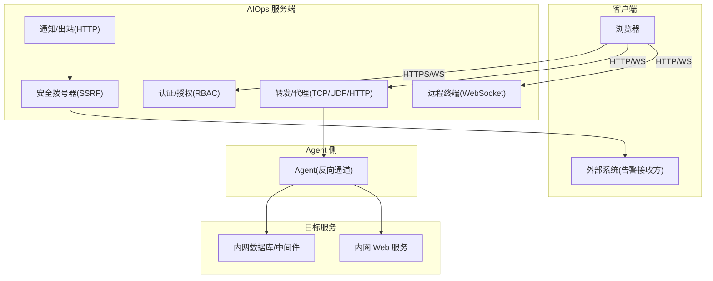
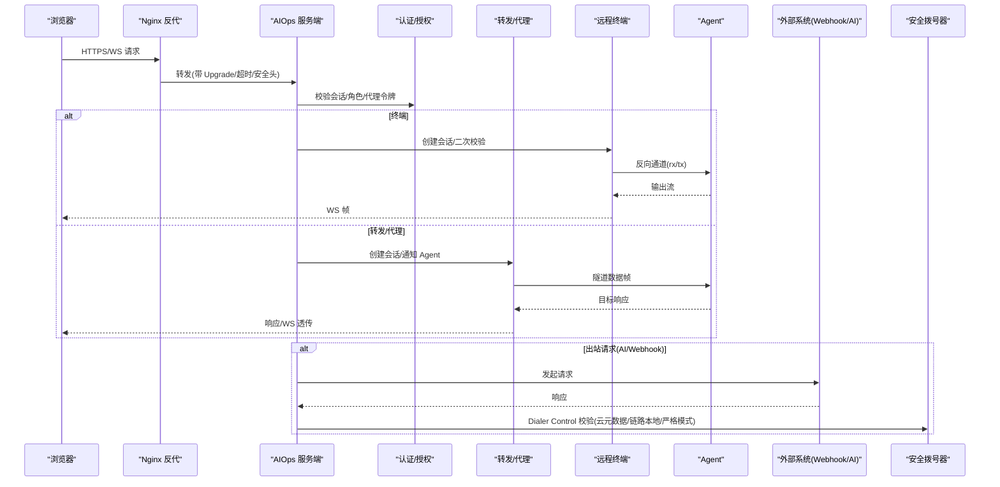
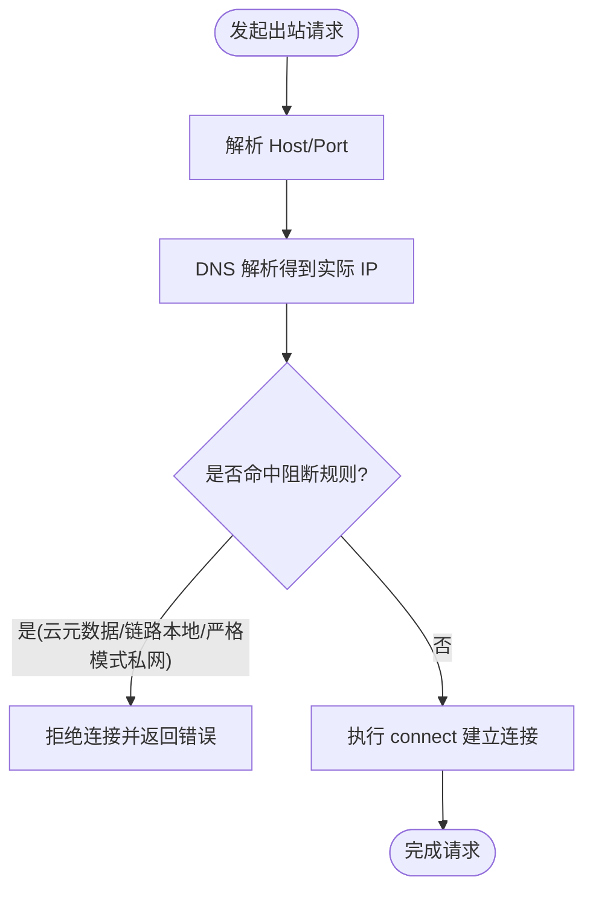
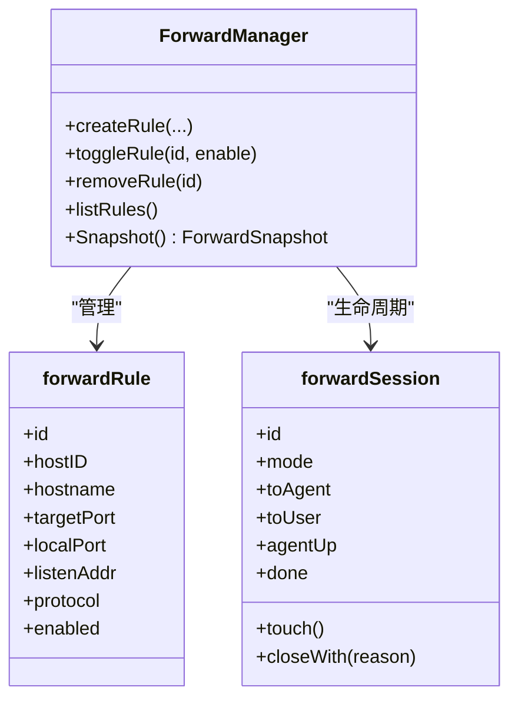
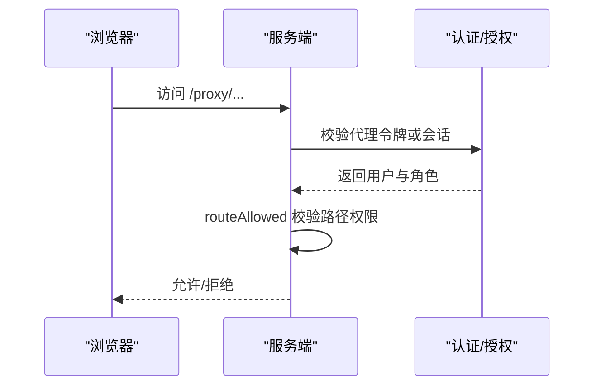
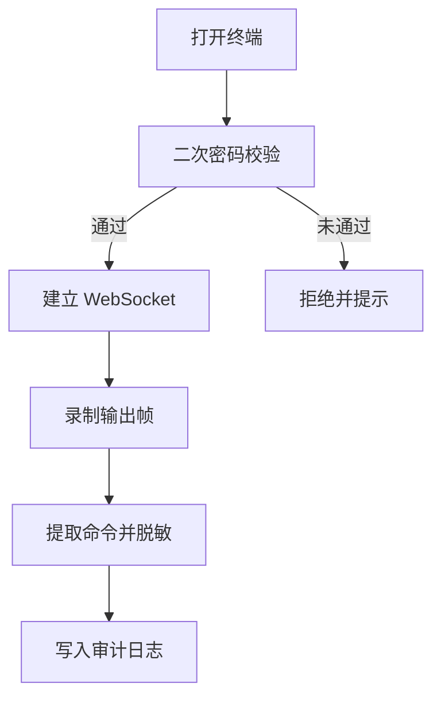
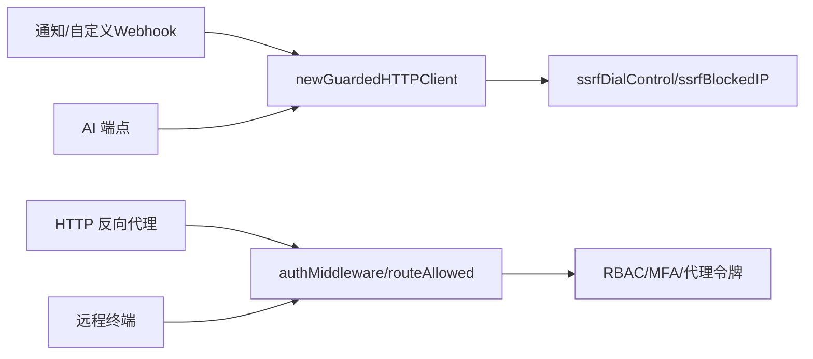

# 网络安全

<cite>
**本文引用的文件**   
- [safedial.go](file://cmd/server/safedial.go)
- [safedial_test.go](file://cmd/server/safedial_test.go)
- [notify.go](file://cmd/server/notify.go)
- [auth.go](file://cmd/server/auth.go)
- [auth_core.go](file://cmd/server/auth_core.go)
- [forward.go](file://cmd/server/forward.go)
- [terminal.go](file://cmd/server/terminal.go)
- [nginx-aiops.conf](file://deploy/nginx-aiops.conf)
- [nginx-frontend.conf](file://docker/nginx/nginx-frontend.conf)
</cite>

## 目录
1. [引言](#引言)
2. [项目结构](#项目结构)
3. [核心组件](#核心组件)
4. [架构总览](#架构总览)
5. [详细组件分析](#详细组件分析)
6. [依赖关系分析](#依赖关系分析)
7. [性能与安全权衡](#性能与安全权衡)
8. [故障排查指南](#故障排查指南)
9. [结论](#结论)
10. [附录：配置与渗透测试建议](#附录配置与渗透测试建议)

## 引言
本文件面向 AIOps Monitor 的网络安全设计与落地，聚焦以下主题：
- SSRF 出站防护（AI 端点、Webhook 等用户可影响 URL）
- 端口访问控制与网络隔离策略（TCP/UDP 转发、HTTP 反向代理）
- 安全拨号器实现与代理请求验证
- 内网访问限制与白名单思路
- 反向代理安全（Nginx）与防火墙规则建议
- 网络安全配置示例与渗透测试防护要点

## 项目结构
围绕网络安全的关键代码集中在服务端模块中：
- 出站安全：SSRF 防护通过自定义 Dialer Control 钩子实现，拦截云元数据与链路本地地址，支持严格模式。
- 认证与授权：基于会话 Cookie + RBAC，对终端、转发、代理等敏感路径进行角色校验；提供代理令牌机制用于无状态场景。
- 转发与代理：TCP/UDP 端口映射与 HTTP 反向代理，具备连接数上限、超时、缓冲控制与审计日志。
- 远程终端：Agent 反向通道 + WebSocket 透传，二次密码校验与会话录制审计。
- 反向代理：Nginx 示例配置覆盖 WebSocket 升级、长连接超时、安全头与上传大小对齐。

图表来源
- [safedial.go:1-96](file://cmd/server/safedial.go#L1-L96)
- [notify.go:1-120](file://cmd/server/notify.go#L1-L120)
- [forward.go:1160-1599](file://cmd/server/forward.go#L1160-L1599)
- [terminal.go:438-520](file://cmd/server/terminal.go#L438-L520)
- [auth.go:110-172](file://cmd/server/auth.go#L110-L172)

章节来源
- [safedial.go:1-96](file://cmd/server/safedial.go#L1-L96)
- [notify.go:1-120](file://cmd/server/notify.go#L1-L120)
- [forward.go:1160-1599](file://cmd/server/forward.go#L1160-L1599)
- [terminal.go:438-520](file://cmd/server/terminal.go#L438-L520)
- [auth.go:110-172](file://cmd/server/auth.go#L110-L172)

## 核心组件
- 安全拨号器（SSRF 防护）
  - 在 net.Dialer.Control 钩子中对实际 IP 做校验，拒绝云元数据与链路本地地址；可选严格模式拒绝环回与私网段。
  - 为 AI/Webhook 等“用户可影响 URL”的出站请求提供受保护的 http.Client。
- 认证与授权（RBAC）
  - 登录态基于 Cookie，路由级权限控制；对终端、转发、代理等敏感路径要求 operator+；支持全局 MFA 强制与受限会话。
  - 代理令牌（proxy_token）用于无状态窗口打开场景，签发后仍按当前角色复核权限。
- 端口转发与 HTTP 反向代理
  - TCP/UDP 监听绑定到配置地址（默认 127.0.0.1），暴露面需由防火墙/网络隔离控制；HTTP 代理 /proxy/{hostID}/{port}/... 经 Agent 隧道直通目标。
  - 会话上限、超时、缓冲、带宽与延迟统计、审计日志完善。
- 远程终端
  - 浏览器 WS 与服务端，服务端再经 Agent 反向通道建立 rx/tx 流；二次密码校验与会话录制、命令审计（含密钥脱敏）。
- 反向代理（Nginx）
  - 统一 HTTPS 终止、WebSocket 升级、关闭缓冲、长超时、安全响应头、上传大小与服务端一致。

章节来源
- [safedial.go:1-96](file://cmd/server/safedial.go#L1-L96)
- [auth.go:110-172](file://cmd/server/auth.go#L110-L172)
- [auth_core.go:152-176](file://cmd/server/auth_core.go#L152-L176)
- [forward.go:32-41](file://cmd/server/forward.go#L32-L41)
- [forward.go:1160-1599](file://cmd/server/forward.go#L1160-L1599)
- [terminal.go:438-520](file://cmd/server/terminal.go#L438-L520)
- [nginx-aiops.conf:1-68](file://deploy/nginx-aiops.conf#L1-L68)
- [nginx-frontend.conf:1-193](file://docker/nginx/nginx-frontend.conf#L1-L193)

## 架构总览
下图展示从浏览器到目标服务的典型安全路径，包括 SSRF 防护、RBAC、Agent 反向通道与 Nginx 反代关键点。

图表来源
- [nginx-aiops.conf:18-60](file://deploy/nginx-aiops.conf#L18-L60)
- [auth.go:110-172](file://cmd/server/auth.go#L110-L172)
- [terminal.go:438-520](file://cmd/server/terminal.go#L438-L520)
- [forward.go:1160-1599](file://cmd/server/forward.go#L1160-L1599)
- [safedial.go:67-96](file://cmd/server/safedial.go#L67-L96)
- [notify.go:1204-1215](file://cmd/server/notify.go#L1204-L1215)

## 详细组件分析

### SSRF 出站防护与安全拨号器
- 设计要点
  - 默认放行内网（便于对接自建 LLM/内网 Webhook），但始终拒绝云元数据与链路本地地址。
  - 严格模式（环境变量开启）额外拒绝环回与 RFC1918 私网段，适合强隔离部署。
  - 使用 net.Dialer.Control 在 DNS 解析之后、connect 之前校验实际 IP，天然覆盖重定向与 DNS rebinding。
- 关键流程
  - newGuardedHTTPClient 返回带 Control 钩子的 http.Client。
  - ssrfDialControl 解析 host/port，调用 ssrfBlockedIP 判断是否阻断。
  - 通知与自定义 Webhook 均使用该受保护客户端。

图表来源
- [safedial.go:45-78](file://cmd/server/safedial.go#L45-L78)
- [safedial.go:80-96](file://cmd/server/safedial.go#L80-L96)
- [notify.go:1204-1215](file://cmd/server/notify.go#L1204-L1215)

章节来源
- [safedial.go:1-96](file://cmd/server/safedial.go#L1-L96)
- [safedial_test.go:10-54](file://cmd/server/safedial_test.go#L10-L54)
- [notify.go:1204-1215](file://cmd/server/notify.go#L1204-L1215)

### 端口访问控制与网络隔离策略
- 监听地址与暴露面
  - TCP/UDP 转发默认监听 127.0.0.1；若绑定非回环地址（如 0.0.0.0），必须通过防火墙/网络隔离限制来源。
  - 启动时会对非回环监听发出警告，提醒管理员收敛暴露面。
- 会话与资源限制
  - 并发会话上限、HTTP 请求体上限、响应读取超时、KeepAlive 间隔、空闲会话清理等。
- 审计与可观测性
  - 每类操作均有审计日志（创建/删除/启用/停用、TCP/HTTP 连接、错误原因、字节量、平均延迟、带宽）。
- HTTP 反向代理
  - /proxy/{hostID}/{port}/... 经 Agent 隧道直达目标主机 Web 服务，支持 WebSocket 升级。
  - HTML 注入 <base> 以修正相对资源路径；对 hop-by-hop 头进行过滤。

图表来源
- [forward.go:234-258](file://cmd/server/forward.go#L234-L258)
- [forward.go:184-200](file://cmd/server/forward.go#L184-L200)
- [forward.go:137-175](file://cmd/server/forward.go#L137-L175)

章节来源
- [forward.go:32-41](file://cmd/server/forward.go#L32-L41)
- [forward.go:615-641](file://cmd/server/forward.go#L615-L641)
- [forward.go:1160-1599](file://cmd/server/forward.go#L1160-L1599)

### 代理请求验证与鉴权
- 会话与 RBAC
  - 非公开路径需有效会话；对终端、转发、代理等敏感路径要求 operator+；读操作 viewer+。
  - 全局 MFA 强制时，未绑定的用户仅允许访问 MFA 相关接口。
- 代理令牌（proxy_token）
  - 针对 window.open 等无 Cookie 场景，生成一次性短效令牌；校验后仍按当前角色复核权限。
- 中继共享密钥（可选）
  - 当配置了中继密钥时，携带 X-Relay-Secret 的请求需匹配，否则拒绝。

图表来源
- [auth.go:110-172](file://cmd/server/auth.go#L110-L172)
- [auth_core.go:152-176](file://cmd/server/auth_core.go#L152-L176)

章节来源
- [auth.go:110-172](file://cmd/server/auth.go#L110-L172)
- [auth_core.go:152-176](file://cmd/server/auth_core.go#L152-L176)

### 远程终端安全
- 二次密码校验：进入终端前检查会话是否已通过二次校验，未设置则提示管理员配置。
- 会话录制与审计：记录输出帧，提取命令并脱敏（password/token/mysql -p 等），避免将明文密码入库。
- 防泄露：输入行不直接落盘，仅记录完整命令；检测到密码提示时跳过下一条输入行的审计。

图表来源
- [terminal.go:438-520](file://cmd/server/terminal.go#L438-L520)
- [terminal.go:968-1031](file://cmd/server/terminal.go#L968-L1031)

章节来源
- [terminal.go:438-520](file://cmd/server/terminal.go#L438-L520)
- [terminal.go:968-1031](file://cmd/server/terminal.go#L968-L1031)

### 反向代理安全（Nginx）
- WebSocket 升级：全局 map 定义 $connection_upgrade，并在对应 location 转发 Upgrade/Connection。
- 关闭缓冲与长超时：终端与 Agent 反向通道需 proxy_buffering off、proxy_request_buffering off，并将读写超时提升至 24h。
- 安全头与上传大小：添加 X-Frame-Options、X-Content-Type-Options、X-XSS-Protection、Referrer-Policy；client_max_body_size 与服务端一致。
- 真实 IP 传递：X-Real-IP/X-Forwarded-For/X-Forwarded-Proto；如需信任反代，在服务端开启 trust_proxy。

章节来源
- [nginx-aiops.conf:1-68](file://deploy/nginx-aiops.conf#L1-L68)
- [nginx-frontend.conf:1-193](file://docker/nginx/nginx-frontend.conf#L1-L193)

## 依赖关系分析
- 出站请求（通知、Webhook、AI）统一通过 newGuardedHTTPClient，确保每次真实连接都经过 SSRF 校验。
- 转发与代理通过 Agent 反向通道，服务端负责鉴权、限流、审计与错误诊断。
- 认证与授权贯穿所有敏感路径，代理令牌作为补充手段，但仍遵循 RBAC。

图表来源
- [notify.go:43-52](file://cmd/server/notify.go#L43-L52)
- [notify.go:1204-1215](file://cmd/server/notify.go#L1204-L1215)
- [safedial.go:67-96](file://cmd/server/safedial.go#L67-L96)
- [auth.go:110-172](file://cmd/server/auth.go#L110-L172)

章节来源
- [notify.go:43-52](file://cmd/server/notify.go#L43-L52)
- [notify.go:1204-1215](file://cmd/server/notify.go#L1204-L1215)
- [safedial.go:67-96](file://cmd/server/safedial.go#L67-L96)
- [auth.go:110-172](file://cmd/server/auth.go#L110-L172)

## 性能与安全权衡
- SSRF 严格模式会拒绝内网地址，可能影响对接自建 LLM/内网 Webhook 的场景；建议在需要内网连通时保持默认模式，并通过网络层（VPC/安全组/ACL）实现隔离。
- 转发/代理的会话上限、超时与缓冲关闭有助于防止资源耗尽与延迟放大，但会增加 CPU/内存开销；应根据业务规模调整阈值。
- 终端录制与审计会带来磁盘 I/O 与存储成本；可按需持久化至文件或数据库，并设定保留策略。

[本节为通用指导，无需源码引用]

## 故障排查指南
- 终端无法连接
  - 检查 Nginx 是否正确转发 Upgrade/Connection 头，且关闭缓冲、设置长超时。
  - 确认服务端已启用终端功能且用户已通过二次密码校验。
- 代理访问失败
  - 确认 /proxy/{hostID}/{port}/... 路由存在且未被停用；查看服务端日志中的 agent 离线原因与解析失败预览。
- 出站请求被拒
  - 检查是否命中云元数据/链路本地/严格模式私网阻断；核对目标地址与网络可达性。
- 登录/权限问题
  - 确认会话有效、角色满足路径要求；全局 MFA 强制下未完成绑定的用户将被限制。

章节来源
- [nginx-aiops.conf:44-58](file://deploy/nginx-aiops.conf#L44-L58)
- [terminal.go:438-520](file://cmd/server/terminal.go#L438-L520)
- [forward.go:1260-1283](file://cmd/server/forward.go#L1260-L1283)
- [safedial.go:45-78](file://cmd/server/safedial.go#L45-L78)
- [auth.go:110-172](file://cmd/server/auth.go#L110-L172)

## 结论
AIOps Monitor 在网络层面提供了分层防护：
- 出站方向：SSRF 防护在连接建立前拦截高危地址，支持严格模式。
- 入站方向：RBAC 与代理令牌保障敏感路径访问控制；Nginx 反代强化传输与协议处理。
- 转发与代理：严格的资源限制、超时与审计，结合 Agent 反向通道降低暴露面。
- 终端：二次校验、录制与命令脱敏，兼顾可用性与合规。

生产环境建议结合网络层（VPC/安全组/ACL/防火墙）进一步收敛暴露面，并对关键路径实施最小权限原则与持续监控。

[本节为总结，无需源码引用]

## 附录：配置与渗透测试建议

- 网络安全配置清单
  - 出站防护
    - 根据是否需要内网连通选择 SSRF 模式；必要时开启严格模式并通过网络层放行必要域名/IP。
  - 端口转发
    - 默认监听 127.0.0.1；如需对外暴露，务必通过防火墙/安全组限制来源 IP 段。
  - 反向代理
    - 启用 HTTPS、HSTS、安全响应头；正确配置 WebSocket 升级与长超时；上传大小与服务端一致。
  - 认证与授权
    - 启用全局 MFA 强制；为不同角色分配最小权限；定期轮换安装 Token 与中继密钥。
  - 审计与留存
    - 开启终端录制与命令审计；合理设置保留周期与存储位置。

- 渗透测试防护要点
  - SSRF
    - 尝试访问云元数据、链路本地、环回与私网地址，应被阻断或明确拒绝。
  - 越权访问
    - 使用低权限账号访问终端/转发/代理路径，应被拒绝；代理令牌过期或被降权后应立即失效。
  - 资源耗尽
    - 构造超大请求体、超长响应、大量并发会话，应触发上限与超时保护。
  - 协议绕过
    - 利用重定向、DNS rebinding、Upgrade 头等进行探测，应在连接前或代理层被正确处理与校验。
  - 信息泄露
    - 终端录制不应包含明文密码；命令审计应对常见密钥参数脱敏。

- 参考实现路径
  - SSRF 防护与受保护客户端
    - [safedial.go:45-96](file://cmd/server/safedial.go#L45-L96)
  - 通知与自定义 Webhook 出站
    - [notify.go:43-52](file://cmd/server/notify.go#L43-L52)
    - [notify.go:1204-1215](file://cmd/server/notify.go#L1204-L1215)
  - 认证与 RBAC、代理令牌
    - [auth.go:110-172](file://cmd/server/auth.go#L110-L172)
    - [auth_core.go:152-176](file://cmd/server/auth_core.go#L152-L176)
  - 转发与代理、会话与审计
    - [forward.go:32-41](file://cmd/server/forward.go#L32-L41)
    - [forward.go:1160-1599](file://cmd/server/forward.go#L1160-L1599)
  - 终端二次校验与审计
    - [terminal.go:438-520](file://cmd/server/terminal.go#L438-L520)
    - [terminal.go:968-1031](file://cmd/server/terminal.go#L968-L1031)
  - Nginx 反代最佳实践
    - [nginx-aiops.conf:1-68](file://deploy/nginx-aiops.conf#L1-L68)
    - [nginx-frontend.conf:1-193](file://docker/nginx/nginx-frontend.conf#L1-L193)