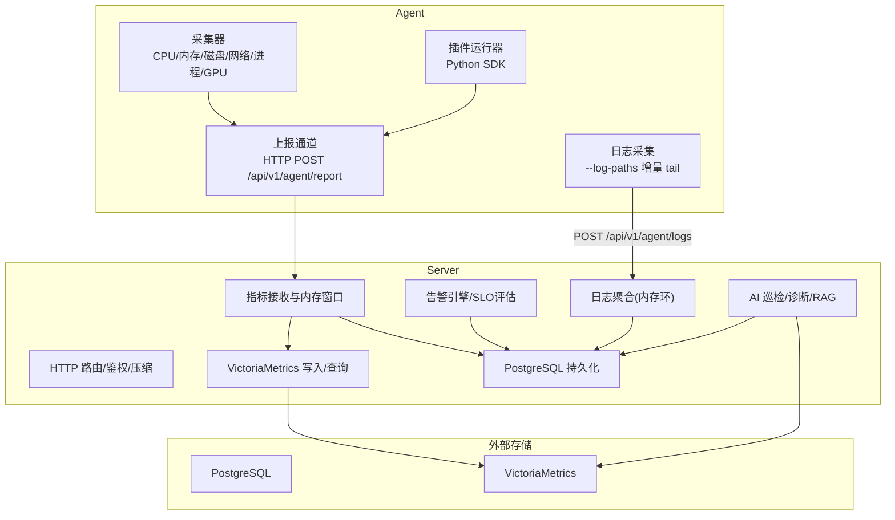
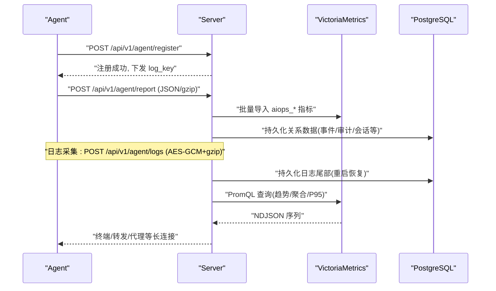
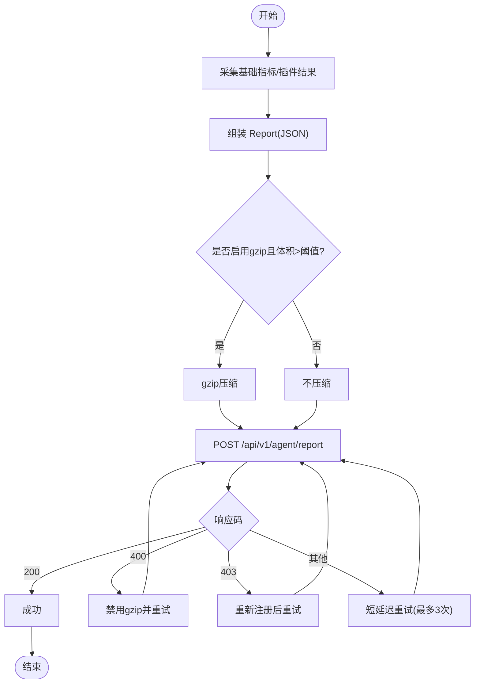
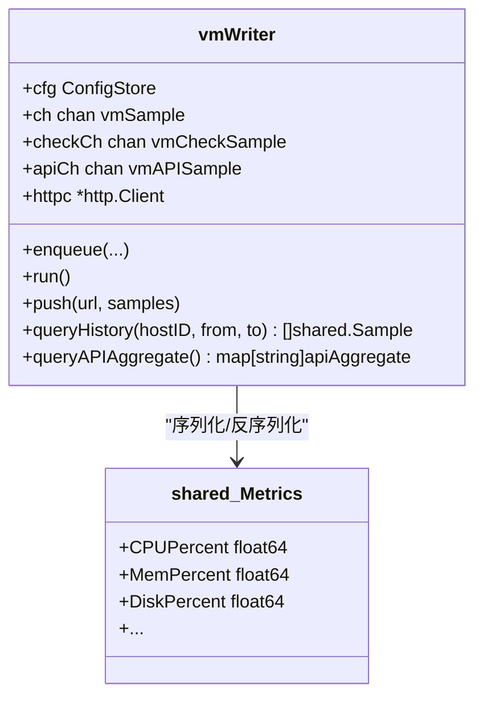
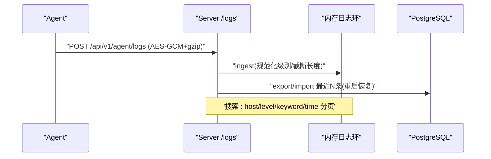
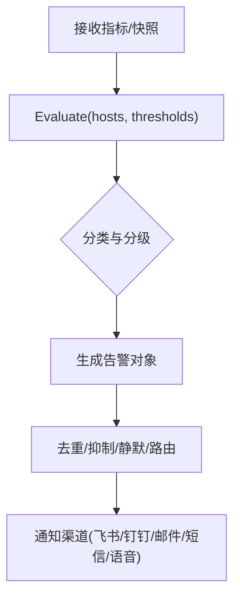
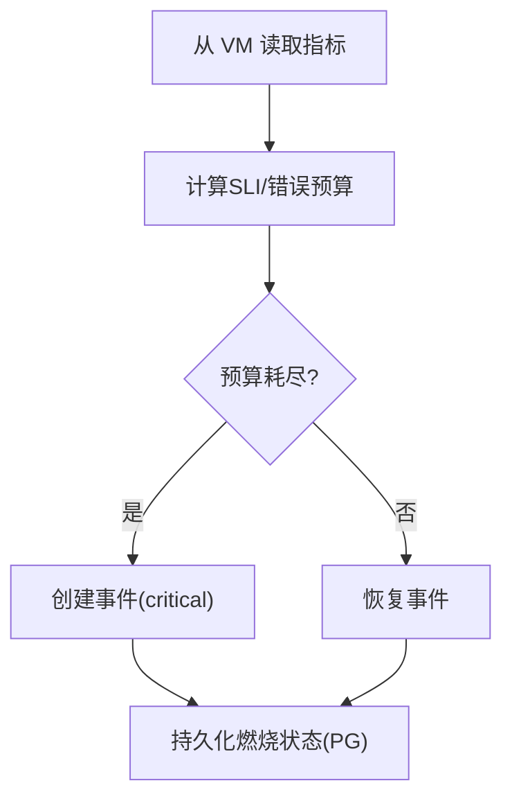
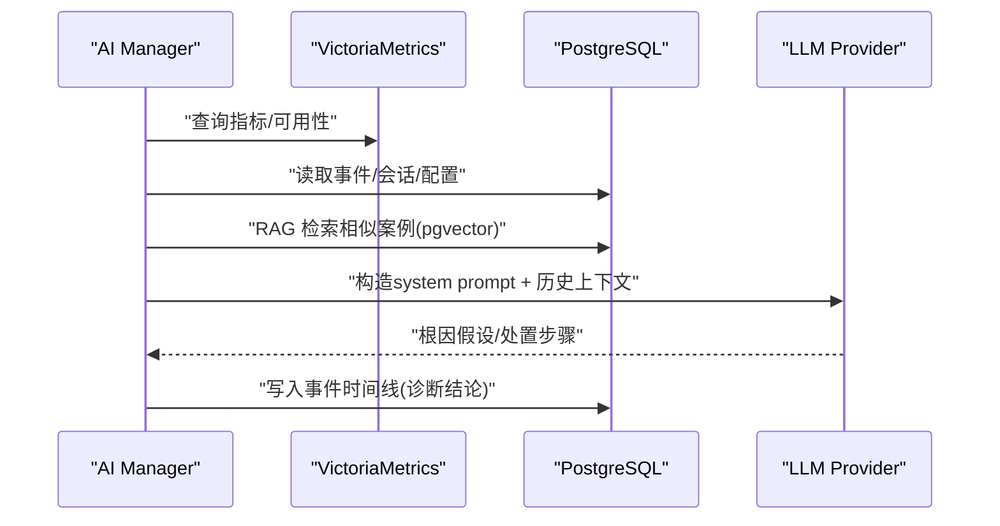
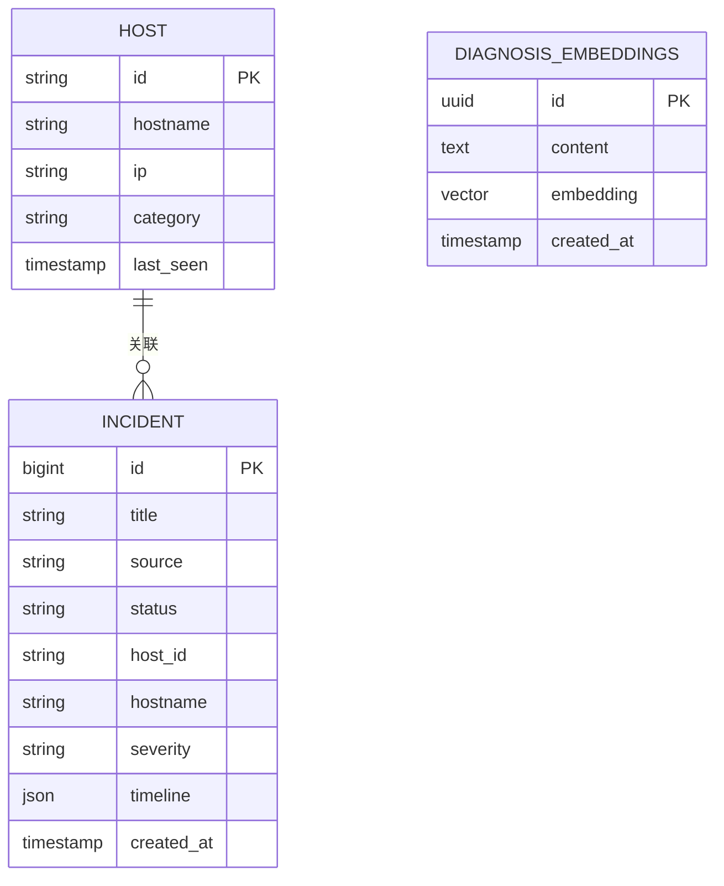
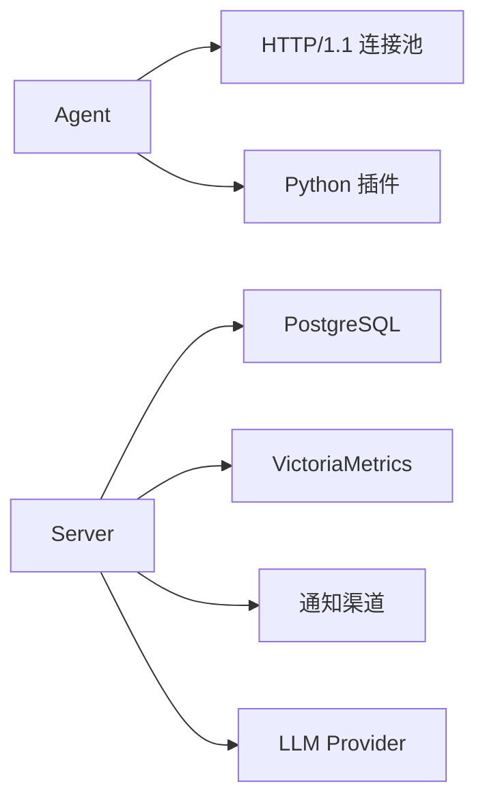

# 数据流设计

<cite>
**本文引用的文件列表**
- [README.md](file://README.md)
- [cmd/agent/main.go](file://cmd/agent/main.go)
- [cmd/agent/reporter.go](file://cmd/agent/reporter.go)
- [cmd/agent/logcollect.go](file://cmd/agent/logcollect.go)
- [cmd/server/main.go](file://cmd/server/main.go)
- [cmd/server/vm.go](file://cmd/server/vm.go)
- [cmd/server/push.go](file://cmd/server/push.go)
- [cmd/server/logstore.go](file://cmd/server/logstore.go)
- [cmd/server/alerts.go](file://cmd/server/alerts.go)
- [cmd/server/slo.go](file://cmd/server/slo.go)
- [cmd/server/aiops.go](file://cmd/server/aiops.go)
</cite>

## 目录
1. [引言](#引言)
2. [项目结构](#项目结构)
3. [核心组件](#核心组件)
4. [架构总览](#架构总览)
5. [详细组件分析](#详细组件分析)
6. [依赖关系分析](#依赖关系分析)
7. [性能与优化](#性能与优化)
8. [故障恢复与一致性](#故障恢复与一致性)
9. [排障指南](#排障指南)
10. [结论](#结论)

## 引言
本文件面向 AIOps Monitor 的数据流设计与实现，覆盖从 Agent 采集到 VictoriaMetrics 时序存储、PostgreSQL 关系存储的完整链路；并说明告警评估、日志聚合、AI 分析处理路径。文档同时给出数据模型图与流转图，解释缓存策略、查询优化与故障恢复机制，帮助读者快速理解系统如何以“PG + VM”双后端协同工作。

## 项目结构
- Agent（Go）：跨平台原生采集 CPU/内存/磁盘/网络/TCP/负载/进程/GPU，周期上报；可选 Python 插件扩展；支持多服务端广播、中继模式、日志增量采集与加密上报。
- Server（Go）：HTTP API 网关、鉴权、告警引擎、SLO 评估、端口转发/代理、远程终端、统一消息中心、AI 巡检与诊断、VictoriaMetrics 写入与查询、PostgreSQL 持久化。
- 存储：
  - PostgreSQL：配置、用户、审计、事件、工单、会话、RAG 向量等全部关系数据。
  - VictoriaMetrics：所有时序数据（主机指标、拨测、API 监控），提供长期存储与 PromQL 查询。

图表来源
- [cmd/agent/main.go:74-136](file://cmd/agent/main.go#L74-L136)
- [cmd/agent/reporter.go:21-49](file://cmd/agent/reporter.go#L21-L49)
- [cmd/agent/logcollect.go:22-34](file://cmd/agent/logcollect.go#L22-L34)
- [cmd/server/main.go:227-355](file://cmd/server/main.go#L227-L355)
- [cmd/server/vm.go:19-28](file://cmd/server/vm.go#L19-L28)
- [cmd/server/logstore.go:12-19](file://cmd/server/logstore.go#L12-L19)

章节来源
- [README.md:159-176](file://README.md#L159-L176)
- [cmd/server/main.go:251-272](file://cmd/server/main.go#L251-L272)

## 核心组件
- Agent 主循环与目标管理：解析配置、安全环境检测、注册与上报、多服务端并发广播、断路器与重试、日志采集。
- Server 启动与中间件：CORS、安全头、gzip 压缩、请求体限制、TLS 监听、优雅关闭。
- VictoriaMetrics 集成：批量写入 Prometheus 文本格式、PromQL 聚合查询、历史导出重组。
- 日志聚合：内存环形缓冲、分页搜索、统计面板、重启后从 PG 恢复尾部。
- 告警与 SLO：阈值评估、去重推送、错误预算燃烧状态持久化。
- AI 层：启发式兜底 + 可插拔 LLM、RAG 嵌入与 pgvector 检索、诊断上下文注入。

章节来源
- [cmd/agent/main.go:74-136](file://cmd/agent/main.go#L74-L136)
- [cmd/agent/reporter.go:255-370](file://cmd/agent/reporter.go#L255-L370)
- [cmd/server/main.go:72-205](file://cmd/server/main.go#L72-L205)
- [cmd/server/vm.go:125-172](file://cmd/server/vm.go#L125-L172)
- [cmd/server/logstore.go:38-78](file://cmd/server/logstore.go#L38-L78)
- [cmd/server/alerts.go:311-346](file://cmd/server/alerts.go#L311-L346)
- [cmd/server/slo.go:195-244](file://cmd/server/slo.go#L195-L244)
- [cmd/server/aiops.go:556-587](file://cmd/server/aiops.go#L556-L587)

## 架构总览
下图展示端到端数据流：Agent 采集 → HTTP POST 传输 → Server 接收处理 → 时序数据库（VictoriaMetrics）存储 → 查询返回；同时关系型数据（PostgreSQL）承载配置、事件、审计、会话、RAG 向量等。

图表来源
- [cmd/agent/reporter.go:86-121](file://cmd/agent/reporter.go#L86-L121)
- [cmd/agent/reporter.go:139-200](file://cmd/agent/reporter.go#L139-L200)
- [cmd/server/vm.go:505-571](file://cmd/server/vm.go#L505-L571)
- [cmd/server/vm.go:713-742](file://cmd/server/vm.go#L713-L742)
- [cmd/server/logstore.go:292-317](file://cmd/server/logstore.go#L292-L317)

## 详细组件分析

### 数据采集与上报（Agent）
- 采集源：原生采集器（Linux/macOS/Windows）+ Python 插件（自定义指标/事件）。
- 上报策略：
  - 每周期一次采集，结果广播至所有配置的服务端（独立连接池、独立 Token）。
  - 自动 gzip 压缩（阈值控制），遇 400 降级禁用压缩；403 触发重新注册。
  - 每目标独立退避重试与熔断（连续失败打开断路器，冷却后半开探测）。
- 日志采集：按路径 tail，增量读取，批量压缩并 AES-256-GCM 加密上报。

图表来源
- [cmd/agent/reporter.go:139-200](file://cmd/agent/reporter.go#L139-L200)
- [cmd/agent/reporter.go:213-253](file://cmd/agent/reporter.go#L213-L253)
- [cmd/agent/reporter.go:452-567](file://cmd/agent/reporter.go#L452-L567)

章节来源
- [cmd/agent/main.go:74-136](file://cmd/agent/main.go#L74-L136)
- [cmd/agent/reporter.go:21-49](file://cmd/agent/reporter.go#L21-L49)
- [cmd/agent/reporter.go:255-370](file://cmd/agent/reporter.go#L255-L370)
- [cmd/agent/logcollect.go:208-231](file://cmd/agent/logcollect.go#L208-L231)

### 指标接收与持久化（Server）
- 接收：HTTP 接口接收 JSON 报告，解压/校验，更新内存窗口（短期热缓存）。
- 时序落盘：将指标转换为 Prometheus 文本格式，批量写入 VictoriaMetrics（fire-and-forget，非阻塞）。
- 关系数据：事件、审计、会话、配置等写入 PostgreSQL。
- 查询：对 VM 使用 PromQL 进行瞬时聚合（平均/P95/可用率/吞吐），或导出 NDJSON 重组为样本序列。

图表来源
- [cmd/server/vm.go:67-77](file://cmd/server/vm.go#L67-L77)
- [cmd/server/vm.go:505-571](file://cmd/server/vm.go#L505-L571)
- [cmd/server/vm.go:713-742](file://cmd/server/vm.go#L713-L742)

章节来源
- [cmd/server/main.go:251-272](file://cmd/server/main.go#L251-L272)
- [cmd/server/vm.go:125-172](file://cmd/server/vm.go#L125-L172)
- [cmd/server/vm.go:467-498](file://cmd/server/vm.go#L467-L498)

### 日志聚合流程
- Agent 侧：按路径 tail，增量读取，批量压缩并 AES-256-GCM 加密上报。
- Server 侧：内存环形缓冲（上限固定），支持分页搜索、级别过滤、关键词匹配、时间分布统计；周期性将最近 N 条持久化到 PG，重启时恢复尾部。

图表来源
- [cmd/agent/logcollect.go:208-231](file://cmd/agent/logcollect.go#L208-L231)
- [cmd/server/logstore.go:59-78](file://cmd/server/logstore.go#L59-L78)
- [cmd/server/logstore.go:292-317](file://cmd/server/logstore.go#L292-L317)

章节来源
- [cmd/agent/logcollect.go:22-34](file://cmd/agent/logcollect.go#L22-L34)
- [cmd/server/logstore.go:38-78](file://cmd/server/logstore.go#L38-L78)
- [cmd/server/logstore.go:80-166](file://cmd/server/logstore.go#L80-L166)

### 告警评估数据流
- 输入：主机最新指标（内存窗口）、转发健康快照、阈值配置。
- 规则：CPU/内存/磁盘/IO/IOPS/进程异常变化/离线判定等。
- 输出：告警事件（含级别/类型/消息/值/时间戳），去重推送（仅触发/恢复态变更）。

图表来源
- [cmd/server/push.go:60-108](file://cmd/server/push.go#L60-L108)
- [cmd/server/alerts.go:311-346](file://cmd/server/alerts.go#L311-L346)

章节来源
- [cmd/server/push.go:60-108](file://cmd/server/push.go#L60-L108)
- [cmd/server/alerts.go:311-346](file://cmd/server/alerts.go#L311-L346)

### SLO 评估与事件
- 基于 VM 中的可用性/时延指标计算 SLI 与错误预算。
- 当错误预算耗尽时创建事件（critical），恢复时自动解决。
- 燃烧状态持久化到 PG，重启恢复。

图表来源
- [cmd/server/slo.go:195-244](file://cmd/server/slo.go#L195-L244)

章节来源
- [cmd/server/slo.go:195-244](file://cmd/server/slo.go#L195-L244)

### AI 分析数据处理路径
- 巡检：定时/手动触发，收集在线/离线主机、活跃告警、SLO 突破、错误日志，产出结构化发现；未配置 LLM 时使用内置启发式。
- 诊断：事件触发后构建 rich prompt（事件上下文 + 终端摘要 + RAG 相似案例），调用 LLM 或回退启发式，结果写入事件时间线。
- RAG：向量化模型与对话模型解耦，嵌入维度与 pgvector 列对齐，本地缓存减少重复调用。

图表来源
- [cmd/server/aiops.go:556-587](file://cmd/server/aiops.go#L556-L587)
- [cmd/server/aiops.go:772-787](file://cmd/server/aiops.go#L772-L787)
- [cmd/server/aiops.go:789-816](file://cmd/server/aiops.go#L789-L816)

章节来源
- [cmd/server/aiops.go:556-587](file://cmd/server/aiops.go#L556-L587)
- [cmd/server/aiops.go:772-787](file://cmd/server/aiops.go#L772-L787)
- [cmd/server/aiops.go:789-816](file://cmd/server/aiops.go#L789-L816)

### 数据模型图
- 时序数据（VictoriaMetrics）：以 aiops_ 前缀命名空间组织主机指标、拨测、API 监控系列，标签包含 host/instance/category/check_id/api_id/system/endpoint 等。
- 关系数据（PostgreSQL）：配置、用户、审计、事件、工单、会话、RAG 向量等。

图表来源
- [cmd/server/vm.go:505-571](file://cmd/server/vm.go#L505-L571)
- [cmd/server/aiops.go:789-816](file://cmd/server/aiops.go#L789-L816)

## 依赖关系分析
- Agent 依赖：
  - 操作系统接口（/proc/sysctl/Win32 API）用于采集。
  - 标准库 http.Transport（禁用 HTTP/2，提升重启恢复性）。
  - 可选 Python 插件执行器。
- Server 依赖：
  - PostgreSQL（强制，无本地回退）。
  - VictoriaMetrics（强制，无本地回退）。
  - 标准库 HTTP 服务（gzip 压缩、CORS、安全头、TLS）。
- 外部集成：
  - 通知渠道（飞书/钉钉/邮件/短信/语音）。
  - LLM 提供商（OpenAI 兼容）与向量化模型（/embeddings）。

图表来源
- [cmd/agent/reporter.go:21-49](file://cmd/agent/reporter.go#L21-L49)
- [cmd/server/main.go:251-272](file://cmd/server/main.go#L251-L272)

章节来源
- [cmd/agent/reporter.go:21-49](file://cmd/agent/reporter.go#L21-L49)
- [cmd/server/main.go:251-272](file://cmd/server/main.go#L251-L272)

## 性能与优化
- 带宽优化：
  - Agent→Server 报告默认 gzip（阈值控制），多主机轮询场景下显著降低带宽。
  - Server 响应 gzip（跳过 WS/代理/终端流式路径）。
- 写入优化：
  - VM 写入采用批量队列（5s flush 或达到批次大小），fire-and-forget 不阻塞摄入。
  - 拨测/API 监控结果分别入队，避免互相阻塞。
- 查询优化：
  - 通过 PromQL 在 VM 侧现算平均/P95/可用率/吞吐，减少服务端聚合开销。
  - 历史导出 NDJSON 重组为共享 Sample 结构，稳定排序（分区/连接键）。
- 前端优化：
  - PWA Service Worker 缓存静态资源，导航优先网络，其余 stale-while-revalidate。

章节来源
- [cmd/agent/reporter.go:139-200](file://cmd/agent/reporter.go#L139-L200)
- [cmd/server/main.go:147-205](file://cmd/server/main.go#L147-L205)
- [cmd/server/vm.go:125-172](file://cmd/server/vm.go#L125-L172)
- [cmd/server/vm.go:467-498](file://cmd/server/vm.go#L467-L498)
- [cmd/server/web/sw.js:26-58](file://cmd/server/web/sw.js#L26-L58)

## 故障恢复与一致性
- 启动强约束：
  - 必须配置 AIOPS_POSTGRES_DSN 与 AIOPS_VM_URL，否则拒绝启动，防止数据落入本地文件。
- 连接容错：
  - Agent 每目标独立重试、退避、熔断；403 触发重新注册；400 带 gzip 时降级禁用压缩并重试。
  - Server 启动时对 PG 连接做有限次数重试，冷启动期间避免误判。
- 数据一致性：
  - 关系数据与顺序数据分离：PG 负责一致性的配置/事件/审计/会话；VM 负责高吞吐时序数据。
  - 日志持久化仅保留尾部（重启恢复），不保证全量一致性，符合其“热数据”定位。
- 优雅关闭：
  - 停止接受新连接，等待活动请求完成，刷新 PG 状态后退出。

章节来源
- [cmd/server/main.go:251-272](file://cmd/server/main.go#L251-L272)
- [cmd/server/main.go:305-323](file://cmd/server/main.go#L305-L323)
- [cmd/agent/reporter.go:213-253](file://cmd/agent/reporter.go#L213-L253)
- [cmd/server/logstore.go:292-317](file://cmd/server/logstore.go#L292-L317)

## 排障指南
- 无法上报指标：
  - 检查 Agent 是否成功注册（403 会触发重新注册），确认 Token 与指纹绑定。
  - 若出现 400 且携带 gzip，Agent 会自动禁用压缩并重试；必要时检查外网代理是否破坏 gzip。
- VM 写入失败：
  - 确认 AIOPS_VM_URL 可达，查看 Server 日志中“VictoriaMetrics 写入失败”警告。
  - 检查指标名/标签是否符合 aiops_* 命名规范。
- 日志不可见：
  - 确认 --log-paths 配置正确，文件存在且可读取；注意只采集新增行。
  - 重启后仅恢复最近 N 条，如需更长时间范围需结合外部日志系统。
- AI 诊断未生效：
  - 确认已配置 LLM 端点与模型；如未配置，系统将回退启发式诊断。
  - 检查 RAG 向量化配置（端点/密钥/模型/维度）连通性与维度一致性。

章节来源
- [cmd/agent/reporter.go:139-200](file://cmd/agent/reporter.go#L139-L200)
- [cmd/server/vm.go:505-571](file://cmd/server/vm.go#L505-L571)
- [cmd/server/logstore.go:292-317](file://cmd/server/logstore.go#L292-L317)
- [cmd/server/aiops.go:772-787](file://cmd/server/aiops.go#L772-L787)

## 结论
AIOps Monitor 以“Agent 采集 + Server 处理 + PG/VM 双后端”为核心，实现了高吞吐、可扩展、易运维的监控体系。通过批量写入、PromQL 现算、内存窗口与熔断重试等机制，系统在大规模环境下仍保持良好性能与稳定性。关系数据与时序数据的职责清晰，配合日志聚合与 AI 分析，形成完整的可观测性与智能运维闭环。