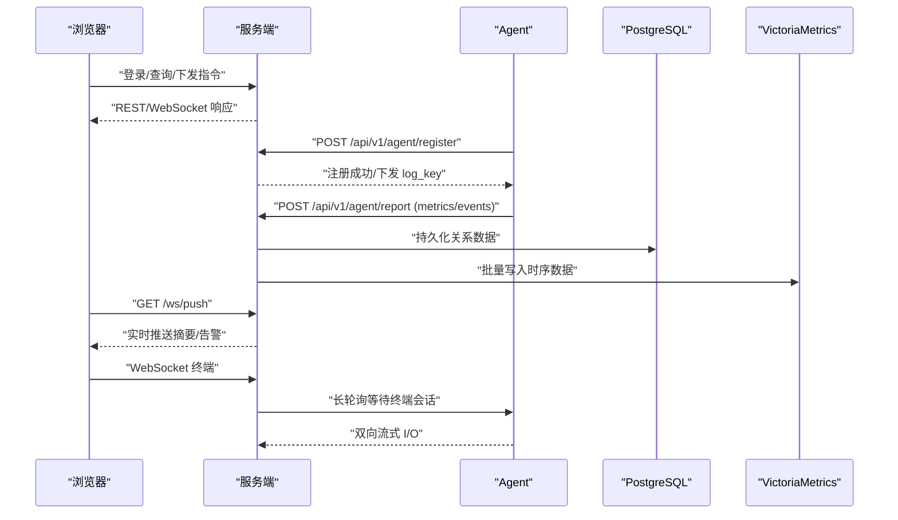
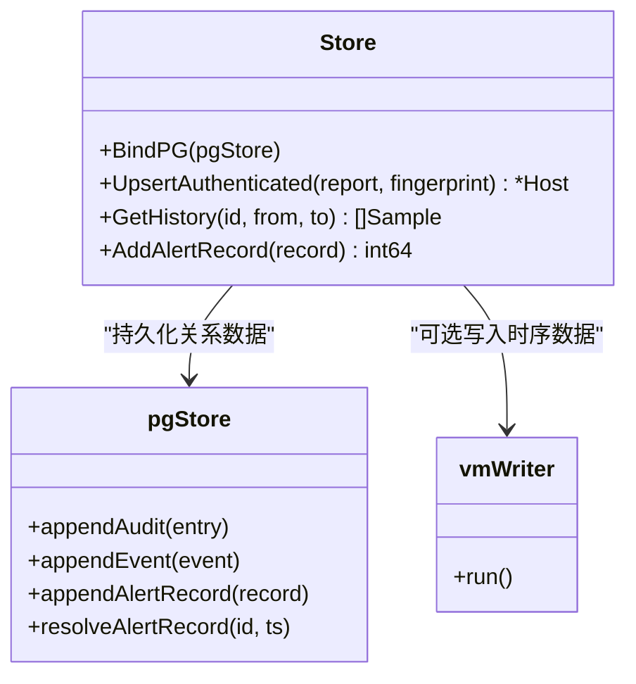
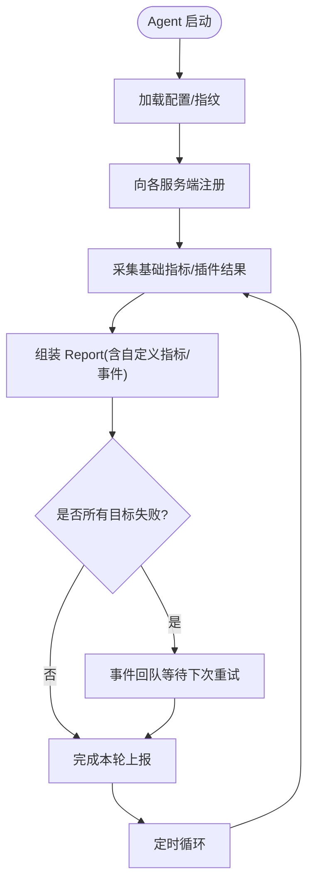
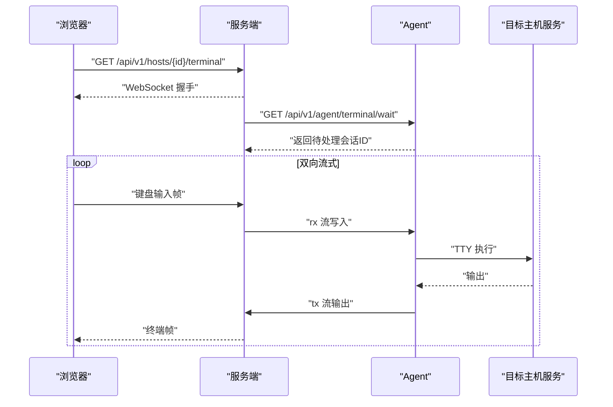
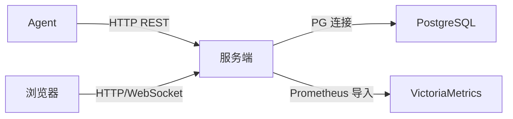

# 整体架构

<cite>
**本文引用的文件**   
- [README.md](file://README.md)
- [cmd/server/main.go](file://cmd/server/main.go)
- [cmd/server/handlers.go](file://cmd/server/handlers.go)
- [cmd/server/auth.go](file://cmd/server/auth.go)
- [cmd/server/agent_api.go](file://cmd/server/agent_api.go)
- [cmd/server/store.go](file://cmd/server/store.go)
- [cmd/server/pgstore.go](file://cmd/server/pgstore.go)
- [cmd/server/vm.go](file://cmd/server/vm.go)
- [cmd/server/ws.go](file://cmd/server/ws.go)
- [cmd/server/push.go](file://cmd/server/push.go)
- [cmd/server/terminal.go](file://cmd/server/terminal.go)
- [cmd/server/forward.go](file://cmd/server/forward.go)
- [cmd/agent/main.go](file://cmd/agent/main.go)
- [cmd/agent/reporter.go](file://cmd/agent/reporter.go)
- [cmd/agent/collector.go](file://cmd/agent/collector.go)
- [cmd/agent/logcollect.go](file://cmd/agent/logcollect.go)
- [plugins/plugin_sdk.py](file://plugins/plugin_sdk.py)
- [docker-compose.yml](file://docker-compose.yml)
</cite>

## 目录
1. [简介](#简介)
2. [项目结构](#项目结构)
3. [核心组件](#核心组件)
4. [架构总览](#架构总览)
5. [详细组件分析](#详细组件分析)
6. [依赖关系分析](#依赖关系分析)
7. [性能与可扩展性](#性能与可扩展性)
8. [故障排查指南](#故障排查指南)
9. [结论](#结论)

## 简介
AIOps Monitor 采用 Server-Agent 分离架构：Agent 负责在主机侧采集指标、执行插件、采集日志并建立反向通道；服务端提供 HTTP API、WebSocket 终端与转发代理、告警治理、SRE 工作流（事件/自动修复/SLO/工单）、统一消息中心，以及 AI 巡检与诊断。存储层统一为 PostgreSQL（关系数据）+ VictoriaMetrics（时序数据），内置 aiops.db 已停用。

## 项目结构
- 服务端（Go）
  - HTTP 路由与中间件：认证、CORS、gzip、安全头、限体等
  - Agent 接入：注册、上报、终端、端口转发、HTTP 代理
  - 业务逻辑：告警、拨测、API 监控、剧本编排、SRE 中枢、AI 助手、统一消息
  - 存储层：PostgreSQL 持久化 + VictoriaMetrics 时序写入
  - 前端资源内嵌：Dashboard、静态资源、Service Worker
- Agent（Go）
  - 平台原生采集器（Linux/Windows/macOS）
  - Python 插件运行器与 SDK
  - 多服务端并发上报、重试、熔断、gzip 降级
  - 日志采集与加密上报
  - 终端与端口转发反向通道
- 插件（Python）
  - 通过 stdout JSON 输出自定义指标与事件
- 部署
  - Docker Compose 一键拉起 server/postgres/victoriametrics
  - 环境变量覆盖配置项，强制要求 PG + VM

```mermaid
graph TB
subgraph "浏览器"
UI["Web 面板"]
end
subgraph "服务端Go"
MW["中间件<br/>认证/CORS/gzip/安全头"]
API["HTTP API 路由"]
WS["WebSocket 推送/终端"]
SRE["告警/拨测/剧本/SRE/AI/消息"]
PG["PostgreSQL 持久化"]
VM["VictoriaMetrics 时序写入"]
end
subgraph "AgentGo"
COL["原生采集器"]
PLG["Python 插件运行器"]
LOG["日志采集"]
CH["反向通道<br/>终端/转发"]
end
UI --> MW --> API
API --> SRE
API --> WS
SRE --> PG
SRE --> VM
COL --> API
PLG --> API
LOG --> API
CH < --> API
```

图表来源
- [cmd/server/main.go:227-354](file://cmd/server/main.go#L227-L354)
- [cmd/server/handlers.go:96-346](file://cmd/server/handlers.go#L96-L346)
- [cmd/server/ws.go:1-36](file://cmd/server/ws.go#L1-L36)
- [cmd/server/store.go:91-104](file://cmd/server/store.go#L91-L104)
- [cmd/server/vm.go:1-40](file://cmd/server/vm.go#L1-L40)
- [cmd/agent/main.go:74-238](file://cmd/agent/main.go#L74-L238)
- [cmd/agent/reporter.go:255-370](file://cmd/agent/reporter.go#L255-L370)

章节来源
- [README.md:1-176](file://README.md#L1-L176)
- [cmd/server/main.go:227-354](file://cmd/server/main.go#L227-L354)
- [cmd/server/handlers.go:96-346](file://cmd/server/handlers.go#L96-L346)
- [cmd/server/ws.go:1-36](file://cmd/server/ws.go#L1-L36)
- [cmd/server/store.go:91-104](file://cmd/server/store.go#L91-L104)
- [cmd/server/vm.go:1-40](file://cmd/server/vm.go#L1-L40)
- [cmd/agent/main.go:74-238](file://cmd/agent/main.go#L74-L238)
- [cmd/agent/reporter.go:255-370](file://cmd/agent/reporter.go#L255-L370)

## 核心组件
- 服务端 HTTP API 层
  - 统一路由注册、鉴权中间件、CORS、gzip、安全响应头、请求体大小限制
  - 面向浏览器的 REST API 与 WebSocket 推送端点
- 业务逻辑层
  - 告警评估与治理（静默/抑制/路由）
  - 自定义拨测与 API 性能监控
  - 自动化剧本编排与执行
  - SRE 中枢（事件/自动修复/SLO/工单）
  - AI 巡检与诊断（可插拔 LLM + RAG）
  - 统一消息中心
- 数据存储层
  - PostgreSQL：用户、配置、审计、事件、工单、会话、SRE 记录等
  - VictoriaMetrics：全部时序数据（指标/趋势）
- Agent 客户端
  - 指标采集（三平台原生采集器）
  - Python 插件执行（stdout JSON）
  - 日志采集与加密上报
  - 终端与端口转发的反向通道
  - 多服务端并发上报、重试、熔断、gzip 降级

章节来源
- [cmd/server/handlers.go:96-346](file://cmd/server/handlers.go#L96-L346)
- [cmd/server/auth.go:110-137](file://cmd/server/auth.go#L110-L137)
- [cmd/server/store.go:91-104](file://cmd/server/store.go#L91-L104)
- [cmd/server/vm.go:1-40](file://cmd/server/vm.go#L1-L40)
- [cmd/agent/collector.go:1-32](file://cmd/agent/collector.go#L1-L32)
- [plugins/plugin_sdk.py:1-58](file://plugins/plugin_sdk.py#L1-L58)
- [cmd/agent/logcollect.go:1-35](file://cmd/agent/logcollect.go#L1-L35)

## 架构总览
Server-Agent 分离设计要点：
- 通信协议
  - HTTP REST：Agent 注册/上报、日志上报、管理 API
  - WebSocket：浏览器到服务端的实时推送与远程终端交互
  - 反向通道：Agent 主动长轮询等待任务（终端/转发），再双向流式传输
- 数据流向
  - Agent 采集 → 上报至服务端 → 服务端落盘 PG（关系数据）与推送到 VM（时序数据）
  - 浏览器通过 REST/WebSocket 获取数据与下发指令
- 依赖关系
  - 服务端强依赖 PG + VM，缺失任一拒绝启动
  - Agent 支持多服务端广播，独立连接池与熔断



图表来源
- [cmd/server/handlers.go:96-346](file://cmd/server/handlers.go#L96-L346)
- [cmd/server/agent_api.go:38-64](file://cmd/server/agent_api.go#L38-L64)
- [cmd/server/push.go:1-58](file://cmd/server/push.go#L1-L58)
- [cmd/server/terminal.go:1-43](file://cmd/server/terminal.go#L1-L43)
- [cmd/server/vm.go:1-40](file://cmd/server/vm.go#L1-L40)
- [cmd/agent/reporter.go:255-370](file://cmd/agent/reporter.go#L255-L370)

## 详细组件分析

### 服务端 HTTP API 层与中间件
- 中间件链：安全头 → CORS → gzip → 请求体限制 → 认证
- 认证策略：基于会话的鉴权，部分路径公开；支持中继共享密钥校验；/proxy 支持一次性 token
- 压缩与带宽优化：对非流式接口启用 gzip，WebSocket/终端/转发/代理路径跳过缓冲
- 路由组织：按功能域划分，涵盖 Agent 接入、主机/告警/事件、拨测、剧本、SRE、AI、消息、转发、代理、安装脚本等

章节来源
- [cmd/server/main.go:72-205](file://cmd/server/main.go#L72-L205)
- [cmd/server/auth.go:110-137](file://cmd/server/auth.go#L110-L137)
- [cmd/server/handlers.go:96-346](file://cmd/server/handlers.go#L96-L346)

### 业务逻辑层（告警/拨测/剧本/SRE/AI/消息）
- 告警与治理：阈值触发、去重、静默/抑制/路由、恢复通知
- 拨测与 API 监控：HTTP/TCP/Ping/进程存活；复用高级探测引擎，结果入 VM
- 剧本编排：多步骤命令，目标选择（全部/分类/系统/主机），并行执行，历史报告
- SRE 中枢：事件汇聚、自动修复（护栏/审批）、SLO 错误预算、工单流转
- AI 运维助手：巡检、根因研判、RAG 相似案例检索、自主 Agent（Function Calling）
- 统一消息中心：事件/告警/SLO/自动修复/AI/工单统一收件箱

章节来源
- [cmd/server/handlers.go:115-238](file://cmd/server/handlers.go#L115-L238)
- [cmd/server/main.go:286-292](file://cmd/server/main.go#L286-L292)

### 数据存储层（PostgreSQL + VictoriaMetrics）
- PostgreSQL
  - 关系数据：配置、用户、审计、事件、工单、会话、SRE 记录等
  - 启动时强依赖 DSN，未配置则拒绝启动；支持可选 pgvector 用于 RAG
- VictoriaMetrics
  - 全部时序数据（指标/趋势）写入 VM，服务端以 Prometheus 文本格式批量写入
  - 可选开关，但生产建议开启；未配置将拒绝启动



图表来源
- [cmd/server/store.go:106-146](file://cmd/server/store.go#L106-L146)
- [cmd/server/pgstore.go:1-45](file://cmd/server/pgstore.go#L1-L45)
- [cmd/server/vm.go:1-40](file://cmd/server/vm.go#L1-L40)

章节来源
- [cmd/server/main.go:251-272](file://cmd/server/main.go#L251-L272)
- [cmd/server/store.go:91-104](file://cmd/server/store.go#L91-L104)
- [cmd/server/pgstore.go:1-45](file://cmd/server/pgstore.go#L1-L45)
- [cmd/server/vm.go:1-40](file://cmd/server/vm.go#L1-L40)

### Agent 客户端（采集/插件/日志/反向通道）
- 指标采集：三平台原生采集器（Linux/Windows/macOS），零第三方依赖
- 插件执行：Python 插件通过 stdout JSON 输出 metrics/events/base
- 日志采集：增量 tail，gzip + AES-256-GCM 加密上报（注册阶段下发 per-agent 密钥）
- 反向通道：终端与端口转发由 Agent 主动长轮询等待，再双向流式传输
- 多服务端上报：并发广播、独立连接池、重试、熔断、gzip 降级



图表来源
- [cmd/agent/main.go:74-238](file://cmd/agent/main.go#L74-L238)
- [cmd/agent/reporter.go:255-370](file://cmd/agent/reporter.go#L255-L370)
- [cmd/agent/collector.go:1-32](file://cmd/agent/collector.go#L1-L32)
- [plugins/plugin_sdk.py:1-58](file://plugins/plugin_sdk.py#L1-L58)
- [cmd/agent/logcollect.go:1-35](file://cmd/agent/logcollect.go#L1-L35)

章节来源
- [cmd/agent/main.go:74-238](file://cmd/agent/main.go#L74-L238)
- [cmd/agent/reporter.go:255-370](file://cmd/agent/reporter.go#L255-L370)
- [cmd/agent/collector.go:1-32](file://cmd/agent/collector.go#L1-L32)
- [plugins/plugin_sdk.py:1-58](file://plugins/plugin_sdk.py#L1-L58)
- [cmd/agent/logcollect.go:1-35](file://cmd/agent/logcollect.go#L1-L35)

### 终端代理与端口转发
- 终端
  - 浏览器 WebSocket ↔ 服务端 ↔ Agent 反向通道（wait/rx/tx）
  - 二次密码认证、会话录制回放、只读旁观、命令审计
- 端口转发
  - TCP/UDP 映射：持久规则、组操作、统计与健康检查
  - HTTP 反向代理：无状态代理，支持 WebSocket 升级
  - 安全：SSRF 出站防护、可选全局禁用



图表来源
- [cmd/server/terminal.go:1-43](file://cmd/server/terminal.go#L1-L43)
- [cmd/server/handlers.go:105-109](file://cmd/server/handlers.go#L105-L109)
- [cmd/server/forward.go:1535-1640](file://cmd/server/forward.go#L1535-L1640)

章节来源
- [cmd/server/terminal.go:1-43](file://cmd/server/terminal.go#L1-L43)
- [cmd/server/forward.go:1535-1640](file://cmd/server/forward.go#L1535-L1640)
- [cmd/server/handlers.go:243-284](file://cmd/server/handlers.go#L243-L284)

### 插件体系与扩展点
- 插件 SDK：Python 类 Plugin，metric/event/base/emit 约定
- 插件发现与执行：按周期扫描 plugins_dir，崩溃/超时不影响核心
- 扩展点
  - 自定义指标与事件（gauge + event）
  - 非 Linux 平台兜底基础指标（core_metrics.py）
  - 任意可执行脚本作为插件（语言无关）

章节来源
- [plugins/plugin_sdk.py:1-58](file://plugins/plugin_sdk.py#L1-L58)
- [cmd/agent/main.go:139-141](file://cmd/agent/main.go#L139-L141)

## 依赖关系分析
- 组件耦合与内聚
  - 服务端中间件与路由高内聚，业务模块通过 Server 聚合注入
  - 存储层解耦：Store 绑定 pgStore，vmWriter 可选
  - Agent 与多服务端解耦：每个 target 独立连接池、重试、熔断
- 外部依赖
  - PostgreSQL：必需（DSN 未配置拒绝启动）
  - VictoriaMetrics：必需（URL 未配置拒绝启动）
  - 可选 TLS：AIOPS_TLS_CERT/AIOPS_TLS_KEY
- 潜在环路与风险
  - 无直接循环依赖；注意 VM 写入失败不应阻塞 Agent 上报（fire-and-forget）



图表来源
- [cmd/server/main.go:251-272](file://cmd/server/main.go#L251-L272)
- [cmd/server/vm.go:1-40](file://cmd/server/vm.go#L1-L40)
- [cmd/agent/reporter.go:255-370](file://cmd/agent/reporter.go#L255-L370)

章节来源
- [cmd/server/main.go:251-272](file://cmd/server/main.go#L251-L272)
- [cmd/server/vm.go:1-40](file://cmd/server/vm.go#L1-L40)
- [cmd/agent/reporter.go:255-370](file://cmd/agent/reporter.go#L255-L370)

## 性能与可扩展性
- 性能特性
  - gzip 压缩：多主机轮询场景下显著降低带宽
  - 多级降采样：原始/1分钟/5分钟分层，兼顾近实时与长期趋势
  - 连接复用与熔断：Agent 侧连接池隔离、熔断保护
  - 异步写入：VM 写入 fire-and-forget，不阻塞上报
- 可扩展性
  - 多服务端广播：单 Agent 一次采集，广播到多个服务端
  - 插件生态：Python/任意可执行脚本，快速扩展指标与事件
  - 水平扩展：服务端无状态（除内存态与会话），可通过反代/负载均衡横向扩展
- 高可用考虑
  - 优雅关闭：信号处理、上下文超时、最终刷盘
  - 断路器与重试：网络抖动下的自愈能力
  - 中继模式：内网仅一台联网机器代理所有请求到云端

章节来源
- [cmd/server/main.go:147-205](file://cmd/server/main.go#L147-L205)
- [cmd/server/store.go:271-300](file://cmd/server/store.go#L271-L300)
- [cmd/agent/reporter.go:447-567](file://cmd/agent/reporter.go#L447-L567)
- [cmd/server/main.go:305-323](file://cmd/server/main.go#L305-L323)

## 故障排查指南
- 启动失败
  - 未配置 AIOPS_POSTGRES_DSN 或 AIOPS_VM_URL：服务端拒绝启动
  - TLS 证书/私钥未配置：以明文 HTTP 提供服务，生产建议启用
- 上报异常
  - 403：指纹未绑定或 Token 失效，Agent 会重新注册
  - 400：疑似外网代理损坏 gzip，Agent 自动禁用压缩并重试
  - 网络抖动：熔断打开后暂停上报，冷却期后试探恢复
- 终端/转发不可用
  - 检查 Agent 在线状态与反向通道长轮询是否就绪
  - 确认 Nginx 放行 WebSocket Upgrade 头
- 日志采集问题
  - 确认 --log-paths 配置与权限
  - 若未收到 log_key，可能为明文上报（调试时可关闭加密）

章节来源
- [cmd/server/main.go:251-272](file://cmd/server/main.go#L251-272)
- [cmd/server/main.go:335-354](file://cmd/server/main.go#L335-L354)
- [cmd/agent/reporter.go:139-253](file://cmd/agent/reporter.go#L139-L253)
- [cmd/agent/logcollect.go:1-35](file://cmd/agent/logcollect.go#L1-L35)

## 结论
AIOps Monitor 通过清晰的 Server-Agent 职责边界、稳定的 HTTP REST 与 WebSocket 通信、统一的 PG + VM 存储方案，实现了高可靠、可扩展的企业级监控与 SRE 平台。Agent 的多服务端广播、重试与熔断机制保障了弱网环境下的稳定性；服务端中间件与中间层模块化设计便于持续演进与扩展。