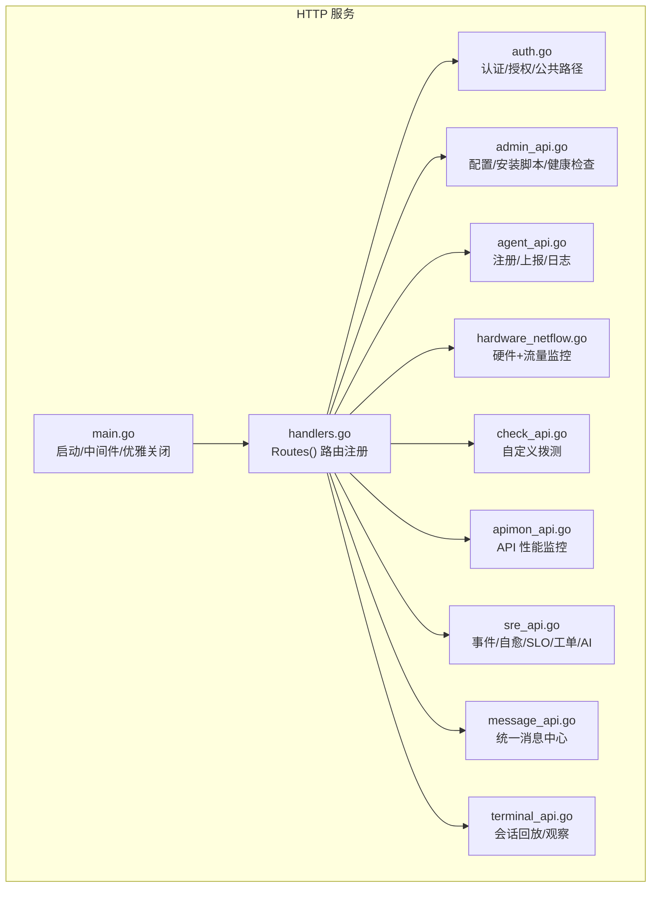
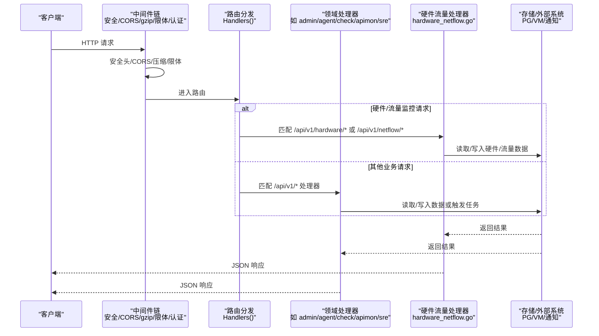
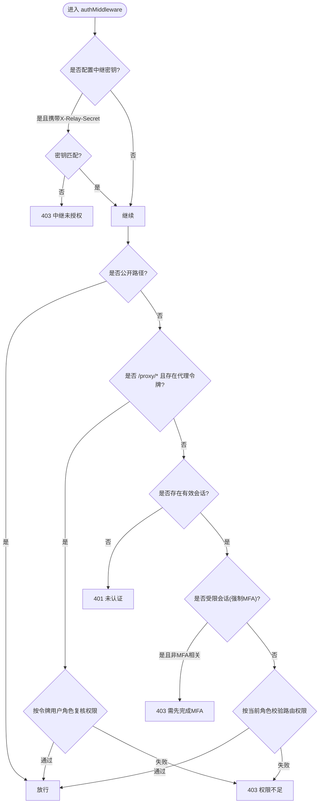
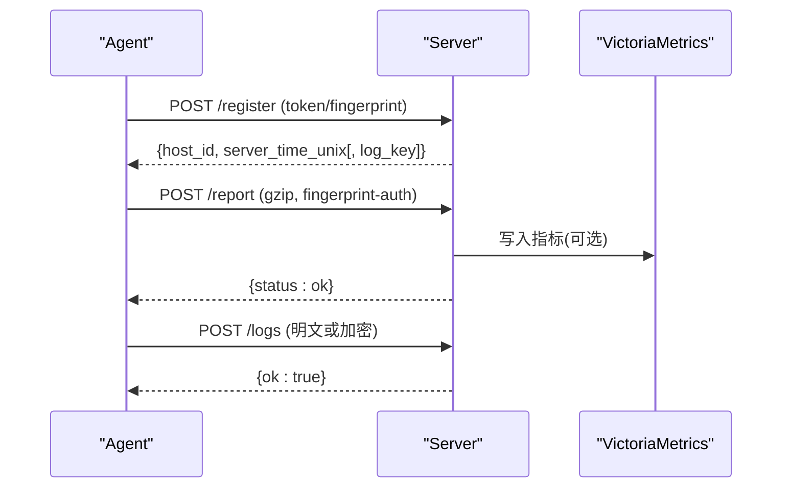
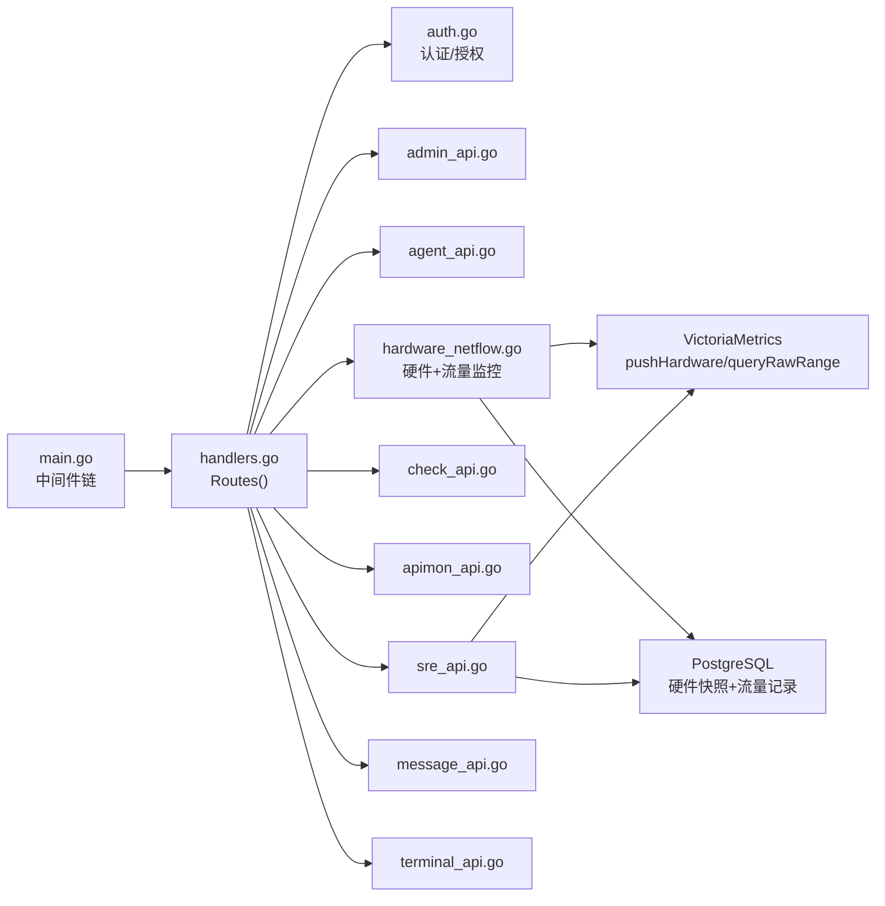

# API 路由设计

<cite>
**本文引用的文件**   
- [cmd/server/main.go](file://cmd/server/main.go)
- [cmd/server/handlers.go](file://cmd/server/handlers.go)
- [cmd/server/auth.go](file://cmd/server/auth.go)
- [cmd/server/admin_api.go](file://cmd/server/admin_api.go)
- [cmd/server/agent_api.go](file://cmd/server/agent_api.go)
- [cmd/server/check_api.go](file://cmd/server/check_api.go)
- [cmd/server/apimon_api.go](file://cmd/server/apimon_api.go)
- [cmd/server/sre_api.go](file://cmd/server/sre_api.go)
- [cmd/server/message_api.go](file://cmd/server/message_api.go)
- [cmd/server/terminal_api.go](file://cmd/server/terminal_api.go)
- [cmd/server/hardware_netflow.go](file://cmd/server/hardware_netflow.go)
- [cmd/server/vm.go](file://cmd/server/vm.go)
- [shared/wire.go](file://shared/wire.go)
</cite>

## 更新摘要
**变更内容**   
- 新增硬件健康监控API路由（7个端点）
- 新增网络流量监控API路由（4个端点）  
- 扩展VM存储层方法支持新指标类型和时间序列查询
- 完善Agent指纹认证机制
- 增强VictoriaMetrics集成能力

## 目录
1. [简介](#简介)
2. [项目结构](#项目结构)
3. [核心组件](#核心组件)
4. [架构总览](#架构总览)
5. [详细组件分析](#详细组件分析)
6. [依赖关系分析](#依赖关系分析)
7. [性能与扩展性](#性能与扩展性)
8. [故障排查指南](#故障排查指南)
9. [结论](#结论)
10. [附录：API 规范与示例](#附录api-规范与示例)

## 简介
本文件面向 AIOps Monitor 的 API 路由设计与实现，系统性阐述 RESTful 设计规范、路由分组策略、请求参数校验、响应格式标准化、错误码定义，以及管理员 API、Agent 通信 API、监控检查 API 与其他业务接口的设计模式。**最新更新**：新增硬件健康监控和网络流量监控功能，包含七个新的HTTP路由用于硬件健康监控和四个新的HTTP路由用于网络流量监控，同时扩展VM存储层方法以支持新指标类型和时间序列查询。

## 项目结构
服务端采用 Go 标准库 http.Server + Go 1.22 方法+路径模式进行路由注册；所有 HTTP 中间件在入口组装为统一处理链；各功能域按文件拆分（认证、管理员、Agent、拨测、SRE、消息、终端等）。

**图示来源**
- [cmd/server/main.go:227-355](file://cmd/server/main.go#L227-L355)
- [cmd/server/handlers.go:100-350](file://cmd/server/handlers.go#L100-L350)

章节来源
- [cmd/server/main.go:227-355](file://cmd/server/main.go#L227-L355)
- [cmd/server/handlers.go:100-350](file://cmd/server/handlers.go#L100-L350)

## 核心组件
- 服务器与中间件链
  - 安全头、CORS、gzip 压缩、请求体大小限制、认证鉴权依次串联。
- 路由注册器
  - 使用 Go 1.22 方法+路径模式集中注册 /api/v1/* 系列端点。
- 认证与授权
  - 基于 Cookie 会话 + RBAC（viewer/operator/admin），支持中继密钥校验、代理令牌、MFA 强制策略。
- 领域处理器
  - 管理员、Agent、拨测、API 性能监控、SRE、消息、终端等各自独立文件，职责清晰。
- **新增** 硬件与流量监控处理器
  - 专门处理 Redfish 硬件状态采集和 NetFlow 网络流量监控。

章节来源
- [cmd/server/main.go:72-205](file://cmd/server/main.go#L72-L205)
- [cmd/server/handlers.go:100-350](file://cmd/server/handlers.go#L100-L350)
- [cmd/server/auth.go:110-172](file://cmd/server/auth.go#L110-L172)

## 架构总览
整体请求链路从中间件到具体处理器，遵循"先鉴权、再授权、后执行业务"的分层模型。**新增**硬件和流量监控数据流，通过Agent指纹认证确保数据安全。

**图示来源**
- [cmd/server/main.go:294-303](file://cmd/server/main.go#L294-L303)
- [cmd/server/handlers.go:100-350](file://cmd/server/handlers.go#L100-L350)
- [cmd/server/hardware_netflow.go:19-90](file://cmd/server/hardware_netflow.go#L19-L90)

## 详细组件分析

### 路由分组与版本管理
- 版本前缀
  - 所有对外 API 统一使用 /api/v1 前缀，便于后续演进至 v2。
- 分组策略
  - 管理员：/api/v1/config、/api/v1/users、/api/v1/mfa/global 等
  - Agent：/api/v1/agent/*（注册、上报、日志、终端/转发通道）
  - **新增** 硬件监控：/api/v1/hardware/*（健康状态、历史指标）
  - **新增** 流量监控：/api/v1/netflow/*（汇总统计、明细查询、包统计）
  - 主机与告警：/api/v1/hosts、/api/v1/alerts、/api/v1/events、/api/v1/activity
  - 拨测：/api/v1/checks
  - API 性能监控：/api/v1/apimon/*
  - 编排与 SRE：/api/v1/playbooks、/api/v1/incidents、/api/v1/remediation、/api/v1/slos、/api/v1/tickets
  - 日志与诊断：/api/v1/logs、/api/v1/ai/*
  - 消息中心：/api/v1/messages
  - 终端与会话：/api/v1/terminal/*、/api/v1/forward/*
  - 安装与下载：/install.sh、/uninstall.sh、/dl/*
- 静态资源与仪表盘
  - /、/app.js、/style.css、/js/*、/css/*、/sw.js、/manifest.json 等由内嵌文件系统提供。

**更新** 新增硬件和流量监控路由分组，支持完整的硬件健康监控和网络流量分析功能。

章节来源
- [cmd/server/handlers.go:100-350](file://cmd/server/handlers.go#L100-L350)

### 认证与授权（RBAC、中继、代理令牌、MFA）
- 公开路径白名单
  - 登录、健康检查、静态资源、安装脚本、Agent 注册/上报/日志、**硬件/流量上报**、部分恢复流程等无需会话。
- 中继密钥校验
  - 当配置了中继共享密钥时，携带 X-Relay-Secret 的请求需严格匹配，否则拒绝。
- 代理令牌
  - /proxy/* 支持通过 cookie 或查询参数传递一次性代理令牌访问，仍受 RBAC 复核。
- 会话与角色
  - 基于 Cookie 的会话；viewer 仅读，operator+ 可写，用户管理与全局 MFA 需要 admin。
- MFA 强制策略
  - 全局开启后，未启用 TOTP 的用户将被限制为受限会话，仅允许完成 MFA 设置。
- **新增** Agent指纹认证
  - 硬件和流量监控API使用X-Agent-Fingerprint头部进行指纹验证，确保只有授权的Agent可以上报数据。

**更新** 新增对硬件和流量监控API的指纹认证支持，这些API不需要会话认证但需要有效的Agent指纹。

**图示来源**
- [cmd/server/auth.go:110-172](file://cmd/server/auth.go#L110-L172)
- [cmd/server/auth.go:15-49](file://cmd/server/auth.go#L15-L49)

章节来源
- [cmd/server/auth.go:110-172](file://cmd/server/auth.go#L110-L172)
- [cmd/server/auth.go:15-49](file://cmd/server/auth.go#L15-L49)

### 管理员 API
- 配置管理
  - GET/POST /api/v1/config：获取/更新配置；敏感字段脱敏返回；保存后重置告警状态并触发测试推送。
  - POST /api/v1/config/test：对当前配置执行一次测试发送。
- 安装信息
  - GET /api/v1/install/info：返回可达地址与安装令牌。
  - POST /api/v1/install/reset-token：轮换安装令牌。
- 安装/卸载脚本
  - GET /install.sh|.ps1、/install-relay.sh|.ps1、/uninstall.sh|.ps1：注入 server_url/token/category 等参数，输出脚本文本。
- 健康检查
  - GET /healthz：返回服务时间戳与状态。

章节来源
- [cmd/server/admin_api.go:11-174](file://cmd/server/admin_api.go#L11-L174)

### Agent 通信 API
- 注册
  - POST /api/v1/agent/register：支持 gzip 请求体；新 Agent 需安装令牌；已知主机指纹匹配时可免令牌重新注册（重启恢复）。
- 上报
  - POST /api/v1/agent/report：按机器指纹鉴权；支持 gzip；落盘时序并可选写入 VictoriaMetrics；异步慢退化检测。
- 日志采集
  - POST /api/v1/agent/logs：支持明文与加密上报（AES-256-GCM + gzip）；按指纹校验；批量入库。

**图示来源**
- [cmd/server/agent_api.go:30-130](file://cmd/server/agent_api.go#L30-L130)

章节来源
- [cmd/server/agent_api.go:30-130](file://cmd/server/agent_api.go#L30-L130)

### **新增** 硬件健康监控 API

#### Agent 硬件数据上报
- **POST /api/v1/agent/hardware**
  - 接收来自Agent的Redfish硬件快照数据
  - 支持X-Agent-Fingerprint头部或fp查询参数进行指纹认证
  - 自动将硬件指标写入VictoriaMetrics和PostgreSQL
  - 检测健康状态变化并生成硬件事件

#### 前端硬件查询接口
- **GET /api/v1/hardware/health**
  - 查询指定主机的最新硬件快照
  - 返回CPU、内存、存储、温度传感器、风扇、电源等信息
  - 支持按主机ID过滤

- **GET /api/v1/hardware/history**
  - 查询硬件指标历史数据
  - 支持多种指标类型：temperature（温度）、power（功耗）、fan_rpm（风扇转速）、health_score（健康评分）
  - 支持时间范围查询：range参数（如"24h"、"7d"）
  - 支持特定目标筛选：target参数

**更新** 新增完整的硬件健康监控API，支持Redfish数据采集、实时健康状态展示和历史趋势分析。

章节来源
- [cmd/server/hardware_netflow.go:19-158](file://cmd/server/hardware_netflow.go#L19-L158)

### **新增** 网络流量监控 API

#### Agent 流量数据上报
- **POST /api/v1/agent/netflow**
  - 接收来自Agent的NetFlow/五元组包聚合数据
  - 支持X-Agent-Fingerprint头部或fp查询参数进行指纹认证
  - 自动将流量指标写入VictoriaMetrics
  - 可选将详细流量记录存入PostgreSQL

#### 前端流量查询接口
- **GET /api/v1/netflow/summary**
  - 返回Top-N聚合流量统计数据
  - 支持多维度分析：src_ip、dst_ip、src_port、dst_port、protocol
  - 支持时间范围查询和topN数量限制

- **GET /api/v1/netflow/flows**
  - 返回详细的流量记录
  - 支持过滤查询：filter参数（如"src_ip:10.0.0.0/8"）
  - 支持分页限制：limit参数（默认200，最大1000）

- **GET /api/v1/netflow/packets**
  - 返回包采集统计数据
  - 支持时间范围查询
  - 专门用于五元组包报文采集场景

**更新** 新增完整的网络流量监控API，支持NetFlow v5/v9协议解析、五元组包采集、流量分析和可视化展示。

章节来源
- [cmd/server/hardware_netflow.go:60-277](file://cmd/server/hardware_netflow.go#L60-L277)

### 监控检查 API（拨测）
- 列表与详情
  - GET /api/v1/checks：返回内置自检与自定义检查项及最新状态。
- 增删改
  - POST /api/v1/checks：新增/更新检查项；自动回填默认值与最小间隔；立即触发一次探测。
  - DELETE /api/v1/checks/{id}：删除检查项。
- 手动触发与历史
  - POST /api/v1/checks/{id}/run：立即探测。
  - GET /api/v1/checks/{id}/history：优先从 VM 拉取历史，回退内存环。

章节来源
- [cmd/server/check_api.go:1-119](file://cmd/server/check_api.go#L1-L119)

### API 性能监控（APIMon）
- 概览
  - GET /api/v1/apimon/systems：聚合实时状态与 VM 聚合指标（平均/P95/可用率/吞吐/宕机时长）。
- 系统管理
  - POST /api/v1/apimon/systems：新增/更新业务系统与接口列表；清洗空名/URL、规范化 Method；保存后立即探测。
  - DELETE /api/v1/apimon/systems/{id}：删除系统。
  - POST /api/v1/apimon/systems/{id}/run：立即探测某系统全部接口。
- 历史
  - GET /api/v1/apimon/endpoints/{id}/history：从 VM 查询延迟/状态序列。

章节来源
- [cmd/server/apimon_api.go:1-134](file://cmd/server/apimon_api.go#L1-L134)

### SRE 工作流与 AI 能力
- 事件
  - GET/POST /api/v1/incidents、GET /api/v1/incidents/{id}、ACK/RESOLVE/COMMENT/ESCALATE
- 自愈规则与执行
  - /api/v1/remediation/rules、/api/v1/remediation/runs（审批/拒绝）
- SLO
  - /api/v1/slos（CRUD）
- 工单
  - /api/v1/tickets（CRUD、评论、与事件联动）
- 日志搜索与诊断
  - POST /api/v1/agent/logs、GET /api/v1/logs、POST /api/v1/logs/diagnose
- AI
  - /api/v1/ai/*（配置、测试、对话、模型、巡检、事件诊断与反馈）

章节来源
- [cmd/server/sre_api.go:1-800](file://cmd/server/sre_api.go#L1-L800)

### 消息中心
- 列表与标记已读
  - GET /api/v1/messages、POST /api/v1/messages/read、POST /api/v1/messages/read-all

章节来源
- [cmd/server/message_api.go:1-41](file://cmd/server/message_api.go#L1-L41)

### 终端增强
- 会话管理
  - GET /api/v1/terminal/sessions
- 回放与观察
  - GET /api/v1/terminal/sessions/{id}/replay（二次密码验证）
  - GET /api/v1/terminal/sessions/{id}/observe（WebSocket 只读观察，二次密码验证）

章节来源
- [cmd/server/terminal_api.go:1-77](file://cmd/server/terminal_api.go#L1-L77)

## 依赖关系分析
- 中间件耦合
  - 安全头、CORS、gzip、限体、认证中间件顺序固定，任何环节失败都会短路返回。
- 路由与处理器
  - handlers.go 中 Routes() 将路径映射到具体处理器，处理器内部依赖 Store/ConfigStore/Notifier/VM 等子系统。
- 外部依赖
  - PostgreSQL（关系型）、VictoriaMetrics（时序）、邮件/短信/语音/飞书/钉钉/自定义 Webhook（通知）。
- **新增** 硬件流量监控依赖
  - Redfish API（硬件数据采集）
  - NetFlow协议解析（网络流量采集）
  - Prometheus格式指标（VictoriaMetrics写入）

**图示来源**
- [cmd/server/main.go:294-303](file://cmd/server/main.go#L294-L303)
- [cmd/server/handlers.go:100-350](file://cmd/server/handlers.go#L100-L350)
- [cmd/server/hardware_netflow.go:283-336](file://cmd/server/hardware_netflow.go#L283-L336)

章节来源
- [cmd/server/main.go:294-303](file://cmd/server/main.go#L294-L303)
- [cmd/server/handlers.go:100-350](file://cmd/server/handlers.go#L100-L350)

## 性能与扩展性
- 响应压缩
  - 针对文本/JSON 响应启用 gzip，跳过 WebSocket 升级与流式代理路径，避免缓冲。
- 请求体限制
  - 统一 MaxBytesReader 限制，防止超大负载耗尽内存。
- 并发与后台任务
  - 定时拨测、API 性能监控、SLO 评估、AI 巡检、VM 远写泵等后台协程并行运行。
- **新增** 硬件流量监控性能优化
  - 硬件指标写入采用fire-and-forget模式，避免阻塞主请求处理
  - 流量数据批量聚合减少数据库写入压力
  - 支持异步查询VictoriaMetrics时间序列数据
- 可扩展点
  - 新增 API 只需在 Routes() 注册并实现处理器；鉴权与限流可在中间件层统一扩展。

**更新** 新增硬件和流量监控的性能优化策略，包括异步写入、批量处理和缓存机制。

章节来源
- [cmd/server/main.go:147-205](file://cmd/server/main.go#L147-L205)
- [cmd/server/main.go:286-293](file://cmd/server/main.go#L286-L293)

## 故障排查指南
- 常见错误码
  - 400：请求体解析失败、参数不合法、ID 无效
  - 401：未认证（缺少会话或会话失效）
  - 403：权限不足/中继密钥不匹配/MFA 强制未满足/代理令牌无效/**指纹不匹配**
  - 404：资源不存在
  - 429：登录/验证码频率限制
  - 500：内部错误
- **新增** 硬件流量监控故障排查
  - 检查Agent指纹是否正确配置
  - 验证Redfish API连接性和认证
  - 确认VictoriaMetrics连接状态
  - 查看硬件健康状态变化日志
  - 检查NetFlow数据包捕获状态
- 定位建议
  - 查看健康检查 /healthz 确认服务存活
  - 检查安装脚本注入参数是否正确（server_url/token/category）
  - 核对 Agent 指纹与安装令牌策略
  - 关注中继密钥与代理令牌的使用场景
  - 结合审计日志与消息中心快速定位问题

**更新** 新增硬件和流量监控相关的故障排查指南，涵盖指纹认证、Redfish连接、VictoriaMetrics集成等问题。

章节来源
- [cmd/server/admin_api.go:153-159](file://cmd/server/admin_api.go#L153-L159)
- [cmd/server/auth.go:110-172](file://cmd/server/auth.go#L110-L172)

## 结论
本项目采用清晰的 RESTful 分层与模块化路由组织，统一的中间件链保障安全与性能，RBAC 与多因子认证提升安全性，Agent 侧通过指纹与令牌双重机制保证接入安全。**最新更新**：新增的硬件健康监控和网络流量监控功能，通过Redfish和NetFlow协议实现了完整的硬件状态采集和网络流量分析能力。通过VM/PG双后端支撑高吞吐与时序持久化，配合消息中心与AI能力形成闭环运维体验。建议在后续演进中持续完善限流、审计与可观测性指标，保持API向后兼容与版本治理。

## 附录：API 规范与示例

### 通用规范
- 版本管理
  - 所有 API 使用 /api/v1 前缀；未来升级以 /api/v2 引入，旧版保留过渡期。
- 请求格式
  - 除特殊说明外，请求体均为 application/json；Agent 上报与日志支持 gzip 压缩。
- 响应格式
  - 统一 JSON 响应；成功返回业务对象或 {ok:true}；错误返回 {error:"..."}。
- 分页与过滤
  - 列表类接口支持 page/page_size/since_min 等查询参数（如日志搜索、检查历史）。
- 鉴权方式
  - 浏览器/控制台：Cookie 会话；Agent：安装令牌/指纹；中继：X-Relay-Secret；代理：proxy_token。

### 关键路由清单（节选）
- 管理员
  - GET/POST /api/v1/config、POST /api/v1/config/test、GET /api/v1/install/info、POST /api/v1/install/reset-token、GET /healthz
- Agent
  - POST /api/v1/agent/register、POST /api/v1/agent/report、POST /api/v1/agent/logs
- **新增** 硬件监控
  - POST /api/v1/agent/hardware、GET /api/v1/hardware/health、GET /api/v1/hardware/history
- **新增** 流量监控
  - POST /api/v1/agent/netflow、GET /api/v1/netflow/summary、GET /api/v1/netflow/flows、GET /api/v1/netflow/packets
- 拨测
  - GET/POST /api/v1/checks、POST /api/v1/checks/{id}/run、GET /api/v1/checks/{id}/history、DELETE /api/v1/checks/{id}
- API 性能监控
  - GET/POST /api/v1/apimon/systems、POST /api/v1/apimon/systems/{id}/run、DELETE /api/v1/apimon/systems/{id}、GET /api/v1/apimon/endpoints/{id}/history
- SRE
  - /api/v1/incidents、/api/v1/remediation、/api/v1/slos、/api/v1/tickets、/api/v1/logs、/api/v1/ai/*
- 消息
  - GET /api/v1/messages、POST /api/v1/messages/read、POST /api/v1/messages/read-all
- 终端
  - GET /api/v1/terminal/sessions、GET /api/v1/terminal/sessions/{id}/replay、GET /api/v1/terminal/sessions/{id}/observe

**更新** 新增硬件监控和流量监控相关的路由端点，提供完整的硬件健康监控和网络流量分析能力。

章节来源
- [cmd/server/handlers.go:100-350](file://cmd/server/handlers.go#L100-L350)
- [cmd/server/admin_api.go:11-174](file://cmd/server/admin_api.go#L11-L174)
- [cmd/server/agent_api.go:30-130](file://cmd/server/agent_api.go#L30-L130)
- [cmd/server/hardware_netflow.go:19-277](file://cmd/server/hardware_netflow.go#L19-L277)
- [cmd/server/check_api.go:1-119](file://cmd/server/check_api.go#L1-L119)
- [cmd/server/apimon_api.go:1-134](file://cmd/server/apimon_api.go#L1-L134)
- [cmd/server/sre_api.go:1-800](file://cmd/server/sre_api.go#L1-L800)
- [cmd/server/message_api.go:1-41](file://cmd/server/message_api.go#L1-L41)
- [cmd/server/terminal_api.go:1-77](file://cmd/server/terminal_api.go#L1-L77)

### **新增** VM存储层扩展方法

#### pushHardware方法
- 写入单个硬件指标到VictoriaMetrics
- 支持基础标签：host、target
- 采用fire-and-forget模式，异步写入

#### pushHardwareLabeled方法
- 写入带额外标签的硬件指标
- 支持动态标签键值对
- 适用于温度传感器、风扇等细粒度指标

#### pushRawLine方法
- 直接写入Prometheus格式文本行
- 用于不符合标准样本管道的指标
- 支持硬件和流量监控的特殊格式

#### queryRawRange方法
- 执行VictoriaMetrics范围查询
- 返回原始时间序列数据
- 支持PromQL查询语法
- 用于硬件历史和流量统计查询

**更新** 扩展VM存储层方法以支持新的硬件和流量监控指标类型，提供更灵活的时间序列数据处理能力。

章节来源
- [cmd/server/vm.go:808-865](file://cmd/server/vm.go#L808-L865)

### 示例：路由注册、参数绑定与响应处理
- 路由注册
  - 参考：[cmd/server/handlers.go:100-350](file://cmd/server/handlers.go#L100-L350)
- 参数绑定（JSON 解码）
  - 参考：[cmd/server/admin_api.go:45-62](file://cmd/server/admin_api.go#L45-L62)、[cmd/server/agent_api.go:38-47](file://cmd/server/agent_api.go#L38-L47)
- 响应处理（统一 JSON 写入）
  - 参考：[cmd/server/handlers.go:352-357](file://cmd/server/handlers.go#L352-L357)
- **新增** 硬件流量监控示例
  - 参考：[cmd/server/hardware_netflow.go:19-90](file://cmd/server/hardware_netflow.go#L19-L90)
  - 参考：[cmd/server/hardware_netflow.go:283-336](file://cmd/server/hardware_netflow.go#L283-L336)

**更新** 新增硬件和流量监控的示例代码路径，展示新的API实现模式。