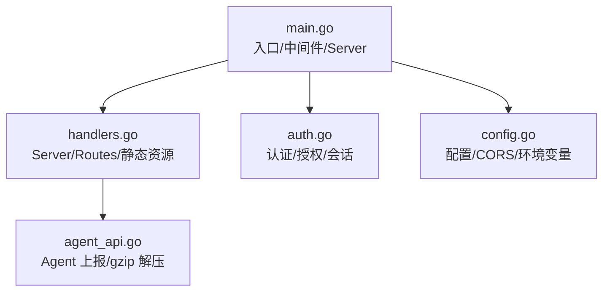
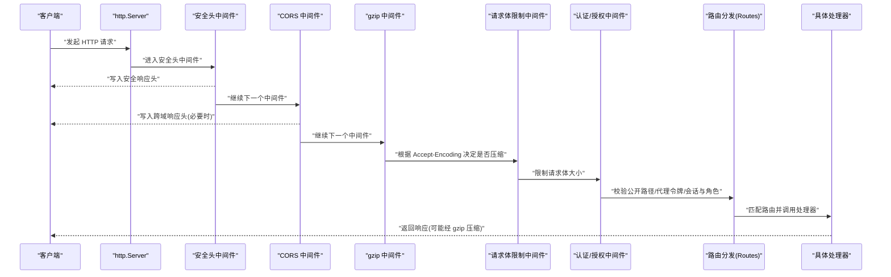
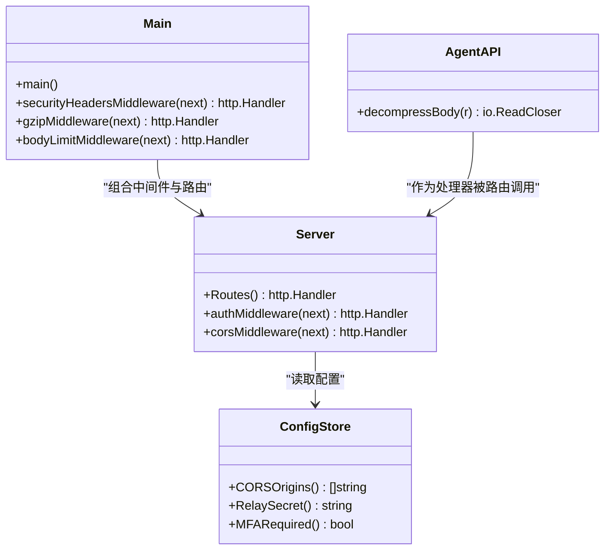

# HTTP 服务器核心

<cite>
**本文引用的文件**   
- [cmd/server/main.go](file://cmd/server/main.go)
- [cmd/server/handlers.go](file://cmd/server/handlers.go)
- [cmd/server/auth.go](file://cmd/server/auth.go)
- [cmd/server/config.go](file://cmd/server/config.go)
- [cmd/server/agent_api.go](file://cmd/server/agent_api.go)
</cite>

## 目录
1. [简介](#简介)
2. [项目结构](#项目结构)
3. [核心组件](#核心组件)
4. [架构总览](#架构总览)
5. [详细组件分析](#详细组件分析)
6. [依赖关系分析](#依赖关系分析)
7. [性能考量](#性能考量)
8. [故障排查指南](#故障排查指南)
9. [结论](#结论)

## 简介
本文件聚焦 AIOps Monitor 的 HTTP 服务器核心，系统性阐述以下主题：
- 服务器初始化流程与启动参数
- 中间件管道设计（CORS、安全头、压缩、请求体限制）
- 路由注册机制与处理器分发逻辑
- gzip 压缩优化策略与响应头安全加固
- 跨域配置管理与代理令牌鉴权
- 优雅关闭机制与信号处理
- 错误处理策略与性能优化措施

## 项目结构
HTTP 服务器核心位于 cmd/server 包中，关键文件职责如下：
- main.go：进程入口、中间件链组装、http.Server 配置、TLS 监听、优雅关闭与信号处理
- handlers.go：Server 结构体定义、Routes() 路由注册、静态资源与嵌入式前端服务
- auth.go：认证中间件、RBAC 权限控制、登录/会话/MFA 相关处理器
- config.go：配置模型、环境变量覆盖、CORS 白名单等运行时配置访问器
- agent_api.go：Agent 上报接口，包含请求体 gzip 解压适配

图表来源
- [cmd/server/main.go:227-355](file://cmd/server/main.go#L227-L355)
- [cmd/server/handlers.go:100-350](file://cmd/server/handlers.go#L100-L350)
- [cmd/server/auth.go:110-172](file://cmd/server/auth.go#L110-L172)
- [cmd/server/config.go:772-778](file://cmd/server/config.go#L772-L778)
- [cmd/server/agent_api.go:15-28](file://cmd/server/agent_api.go#L15-L28)

章节来源
- [cmd/server/main.go:227-355](file://cmd/server/main.go#L227-L355)
- [cmd/server/handlers.go:100-350](file://cmd/server/handlers.go#L100-L350)

## 核心组件
- Server 结构体：聚合存储、配置、通知、终端、转发、SRE、AI、消息中心等子系统，提供统一路由与业务编排。
- Routes()：基于 Go 1.22 方法+路径模式注册所有 API 与静态资源。
- 中间件链：securityHeadersMiddleware → corsMiddleware → gzipMiddleware → bodyLimitMiddleware → authMiddleware → Routes()。
- http.Server：设置 ReadHeaderTimeout 与 IdleTimeout，支持 TLS 或明文 HTTP。
- 优雅关闭：监听 SIGINT/SIGTERM，调用 srv.Shutdown 并持久化状态后退出。

章节来源
- [cmd/server/handlers.go:17-98](file://cmd/server/handlers.go#L17-L98)
- [cmd/server/handlers.go:100-350](file://cmd/server/handlers.go#L100-L350)
- [cmd/server/main.go:294-355](file://cmd/server/main.go#L294-L355)

## 架构总览
下图展示了从客户端到后端处理器的完整链路，包括中间件顺序、鉴权与路由分发。

图表来源
- [cmd/server/main.go:294-355](file://cmd/server/main.go#L294-L355)
- [cmd/server/handlers.go:100-350](file://cmd/server/handlers.go#L100-L350)
- [cmd/server/auth.go:110-172](file://cmd/server/auth.go#L110-L172)

## 详细组件分析

### 服务器初始化与启动流程
- 解析命令行参数：监听地址、配置文件路径、dist 目录、管理员重置开关等。
- 初始化日志、解析 dist 目录、创建 Store 与 ConfigStore。
- 强制要求外部存储：PostgreSQL 与 VictoriaMetrics；未配置则直接终止。
- 连接 PostgreSQL（带重试窗口），绑定审计与事件持久化。
- 构建 Server 实例，启动后台任务（告警评估、拨测、API 监控、SLO 评估、AI 巡检、VM 推送）。
- 组装中间件链并创建 http.Server，设置头部超时与空闲超时。
- 监听停止信号，执行优雅关闭：停止接受新连接、等待活跃请求完成、刷新 PG 状态后退出。
- 支持 TLS：若配置证书与私钥，则以 HTTPS 启动；否则以 HTTP 启动并输出生产警告。

章节来源
- [cmd/server/main.go:227-355](file://cmd/server/main.go#L227-L355)

### 中间件管道设计与实现

#### 安全头中间件（securityHeadersMiddleware）
- 为每个响应添加保守的安全头：禁止 MIME 嗅探、禁止嵌入框架、无 Referrer 泄露。
- 对非 /proxy/ 路径设置严格的 CSP，仅允许同源脚本与样式，阻断对象注入与点击劫持。
- /proxy/ 路径跳过 CSP，避免目标站点资源加载被拦截。

章节来源
- [cmd/server/main.go:113-136](file://cmd/server/main.go#L113-L136)

#### CORS 中间件（corsMiddleware）
- 当配置了 CORSOrigins 白名单时，仅回显匹配的 Origin，并设置 Vary: Origin。
- 未配置时保持向后兼容，使用通配符 "*"。
- 自动处理 OPTIONS 预检请求，返回 204 No Content。

章节来源
- [cmd/server/main.go:76-102](file://cmd/server/main.go#L76-L102)
- [cmd/server/config.go:772-778](file://cmd/server/config.go#L772-L778)

#### 请求体限制中间件（bodyLimitMiddleware）
- 通过 MaxBytesReader 限制请求体大小，防止恶意或异常客户端耗尽内存。
- 默认上限较大以支持端口转发文件上传场景。

章节来源
- [cmd/server/main.go:109-145](file://cmd/server/main.go#L109-L145)

#### gzip 压缩中间件（gzipMiddleware）
- 仅在客户端声明 Accept-Encoding 包含 gzip 且非流式/升级场景下启用压缩。
- 排除路径：WebSocket 升级、远程终端、端口转发、HTTP 代理隧道。
- 使用 sync.Pool 复用 gzip.Writer，减少高并发下的分配开销。
- 自定义 ResponseWriter 在首次写入时删除 Content-Length 并设置 Content-Encoding: gzip。

章节来源
- [cmd/server/main.go:147-205](file://cmd/server/main.go#L147-L205)

#### 认证与授权中间件（authMiddleware）
- 公开路径放行：仪表盘外壳、静态资源、安装脚本、健康检查、Agent 上报、登录与会话查询等。
- 可选中继共享密钥校验：携带 X-Relay-Secret 的请求需与配置一致。
- /proxy/ 特殊鉴权：优先读取 cookie proxy_token，其次查询参数 pt，校验通过后仍按当前用户角色进行 RBAC 复核。
- 受限会话（全局 MFA 强制）仅允许访问 MFA 相关端点。
- 最终依据 routeAllowed 判定角色权限：只读 viewer+，写操作 operator+，管理端 admin。

章节来源
- [cmd/server/auth.go:110-172](file://cmd/server/auth.go#L110-L172)
- [cmd/server/auth.go:15-49](file://cmd/server/auth.go#L15-L49)
- [cmd/server/auth.go:83-108](file://cmd/server/auth.go#L83-L108)

### 路由注册机制与处理器分发
- 使用 http.NewServeMux 与 Go 1.22 方法+路径模式注册大量 RESTful 接口。
- 静态资源通过 embed.FS 内嵌 web/ 目录，提供 index.html、CSS/JS 模块、PWA 清单与服务工作线程。
- 动态拼接 app.js 将多个 JS 模块合并为单脚本，确保函数提升生效。
- /dl/ 提供可下载的二进制与插件包。

章节来源
- [cmd/server/handlers.go:100-350](file://cmd/server/handlers.go#L100-L350)

### Agent 上报与请求体 gzip 解压
- Agent 上报接口支持请求体 gzip 压缩，服务端透明解压后再解析 JSON。
- 若 Content-Encoding 不为 gzip，则直接使用原始 Body，保证向后兼容。

章节来源
- [cmd/server/agent_api.go:15-28](file://cmd/server/agent_api.go#L15-L28)

### 优雅关闭与信号处理
- 监听 os.Interrupt 与 syscall.SIGTERM。
- 收到信号后，创建带超时的 context，调用 srv.Shutdown 停止接收新连接并等待活跃请求完成。
- 关闭前执行 pgFlush 持久化所有关系型数据，然后关闭数据库连接并退出进程。

章节来源
- [cmd/server/main.go:305-323](file://cmd/server/main.go#L305-L323)

### 跨域配置管理
- CORSOrigins 来自配置项，空列表表示使用通配符 "*" 兼容旧行为。
- 中间件仅在 Origin 在白名单中时回显 Access-Control-Allow-Origin，并设置 Vary: Origin。

章节来源
- [cmd/server/config.go:772-778](file://cmd/server/config.go#L772-L778)
- [cmd/server/main.go:76-102](file://cmd/server/main.go#L76-L102)

### 代理令牌鉴权与 RBAC 复核
- /proxy/ 路径支持 window.open 场景下的令牌鉴权，优先级：cookie > 查询参数。
- 即使令牌有效，仍需按令牌所属用户的当前角色进行 RBAC 复核，防止签发后被降权导致越权。

章节来源
- [cmd/server/auth.go:130-152](file://cmd/server/auth.go#L130-L152)

## 依赖关系分析
- main.go 依赖 handlers.go 中的 Server 与 Routes()，以及 auth.go 的认证中间件。
- auth.go 依赖 config.go 提供的配置访问器（如 RelaySecret、CORSOrigins、MFARequired）。
- agent_api.go 作为处理器之一，依赖通用工具函数与中间件链提供的能力。

图表来源
- [cmd/server/main.go:294-355](file://cmd/server/main.go#L294-L355)
- [cmd/server/handlers.go:100-350](file://cmd/server/handlers.go#L100-L350)
- [cmd/server/auth.go:110-172](file://cmd/server/auth.go#L110-L172)
- [cmd/server/config.go:772-778](file://cmd/server/config.go#L772-L778)
- [cmd/server/agent_api.go:15-28](file://cmd/server/agent_api.go#L15-L28)

章节来源
- [cmd/server/main.go:294-355](file://cmd/server/main.go#L294-L355)
- [cmd/server/handlers.go:100-350](file://cmd/server/handlers.go#L100-L350)
- [cmd/server/auth.go:110-172](file://cmd/server/auth.go#L110-L172)
- [cmd/server/config.go:772-778](file://cmd/server/config.go#L772-L778)
- [cmd/server/agent_api.go:15-28](file://cmd/server/agent_api.go#L15-L28)

## 性能考量
- gzip 压缩：针对高频轮询的 JSON 响应（如主机列表、活动流）显著降低带宽占用；使用 sync.Pool 复用 Writer 降低 GC 压力。
- 请求体限制：MaxBytesReader 防止超大请求体导致的内存膨胀。
- 头部超时：ReadHeaderTimeout 防御慢头攻击，同时保留长连接与流式传输不受限。
- 空闲超时：IdleTimeout 控制空闲连接回收，平衡资源占用与连接复用。
- 静态资源内嵌：减少磁盘 I/O 与部署复杂度，配合浏览器缓存策略提升加载速度。

[本节为通用性能建议，不直接分析具体代码文件]

## 故障排查指南
- 启动失败提示缺少 AIOPS_POSTGRES_DSN 或 AIOPS_VM_URL：确认环境变量已正确配置，并确保外部服务可达。
- 未配置 TLS 的警告：生产环境应启用 HTTPS 或通过反向代理终止 TLS，避免凭据与终端数据明文传输。
- 401/403 响应：检查是否命中公开路径、代理令牌是否正确、会话是否有效、角色权限是否满足。
- 跨域问题：确认 CORSOrigins 配置包含前端域名，或临时使用通配符用于开发调试。
- 压缩异常：确认客户端发送 Accept-Encoding: gzip，且请求未被 WebSocket 升级或属于流式路径。

章节来源
- [cmd/server/main.go:255-261](file://cmd/server/main.go#L255-L261)
- [cmd/server/main.go:341-353](file://cmd/server/main.go#L341-L353)
- [cmd/server/auth.go:110-172](file://cmd/server/auth.go#L110-L172)
- [cmd/server/main.go:76-102](file://cmd/server/main.go#L76-L102)
- [cmd/server/main.go:186-205](file://cmd/server/main.go#L186-L205)

## 结论
AIOps Monitor 的 HTTP 服务器核心采用清晰的中间件管道与模块化路由设计，兼顾安全性、可扩展性与性能。通过严格的安全头与 CSP、可控的跨域策略、合理的请求体限制与高效的 gzip 压缩，系统在保障安全的同时提升了吞吐与带宽利用率。优雅关闭与信号处理确保了服务在停机过程中的数据一致性与用户体验。结合环境变量覆盖与外部存储强制要求，系统在生产环境中具备更强的可运维性与可靠性。