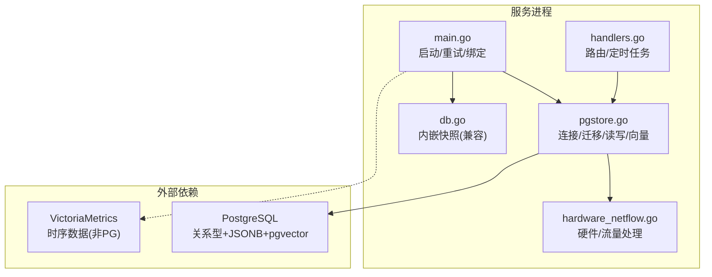
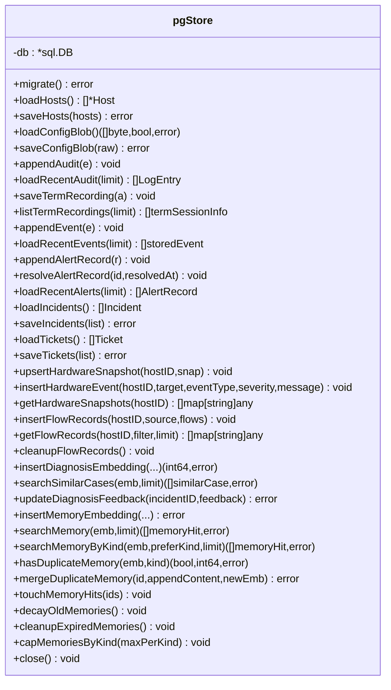
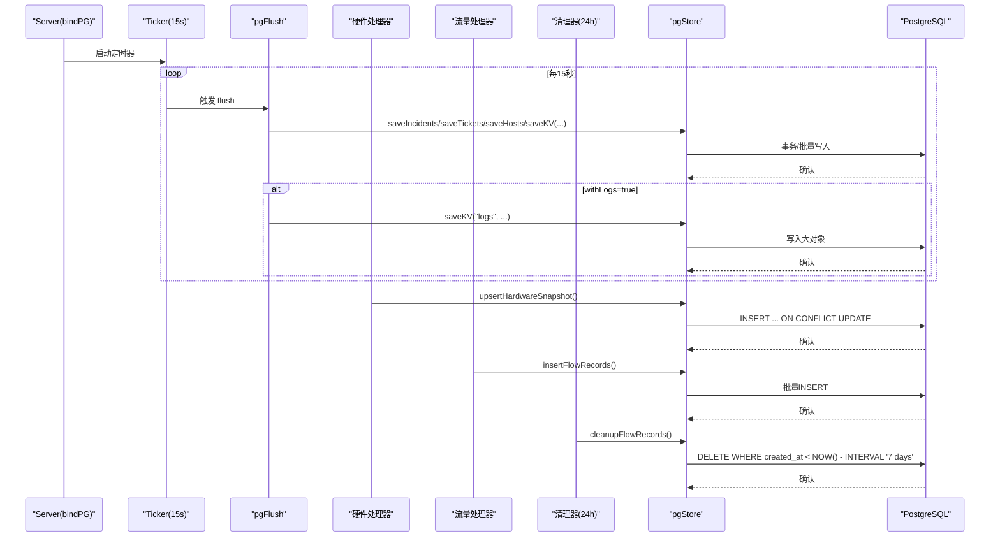
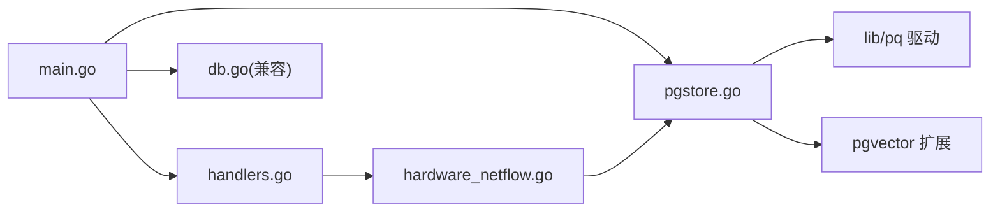

# PostgreSQL 持久化集成

<cite>
**本文引用的文件**   
- [cmd/server/pgstore.go](file://cmd/server/pgstore.go)
- [cmd/server/main.go](file://cmd/server/main.go)
- [cmd/server/db.go](file://cmd/server/db.go)
- [cmd/server/hardware_netflow.go](file://cmd/server/hardware_netflow.go)
- [cmd/server/handlers.go](file://cmd/server/handlers.go)
- [shared/wire.go](file://shared/wire.go)
- [pg-backup-vectorfix.sql](file://pg-backup-vectorfix.sql)
- [fresh-test-prev-backup.sql](file://fresh-test-prev-backup.sql)
</cite>

## 更新摘要
**所做更改**   
- 新增硬件快照、硬件事件和流量记录三个核心数据表的详细设计说明
- 更新数据库表结构图，包含新的硬件和流量相关表
- 新增硬件快照高效upsert操作的实现细节
- 新增流量记录批量插入和自动清理机制的说明
- 更新API端点章节，包含硬件健康和流量查询接口
- 扩展数据同步机制，涵盖硬件快照和流量数据的异步写入

## 目录
1. [简介](#简介)
2. [项目结构](#项目结构)
3. [核心组件](#核心组件)
4. [架构总览](#架构总览)
5. [详细组件分析](#详细组件分析)
6. [依赖关系分析](#依赖关系分析)
7. [性能与调优](#性能与调优)
8. [故障排除指南](#故障排除指南)
9. [结论](#结论)
10. [附录：初始化、迁移与备份恢复](#附录初始化迁移与备份恢复)

## 简介
本文件聚焦 AIOps Monitor 的 PostgreSQL 持久化集成，围绕 pgStore 结构体设计、数据库连接管理（连接池、健康检查、重试）、事务处理、错误处理与日志告警、表结构与索引策略、数据同步机制（内存到磁盘/PG 的异步批量写入）、以及初始化脚本、备份恢复流程与性能调优建议展开。文档同时提供连接配置示例与常见问题排查路径，帮助读者在生产环境稳定部署与运维。

**最新更新**：新增对硬件快照、硬件事件和流量记录的完整支持，包括高效的upsert操作、批量插入优化和自动数据清理机制。

## 项目结构
PostgreSQL 持久化相关代码集中在服务端模块中，关键文件如下：
- cmd/server/pgstore.go：PostgreSQL 持久化层实现（连接、迁移、读写、向量检索等）
- cmd/server/main.go：启动流程、DSN 校验、连接重试、绑定 PG 存储
- cmd/server/hardware_netflow.go：硬件快照和流量数据处理逻辑
- cmd/server/handlers.go：服务器路由和定时任务调度
- cmd/server/db.go：内嵌快照存储（已停用为默认，保留兼容），用于理解历史演进与对比
- shared/wire.go：共享数据结构定义（HardwareSnapshot、FlowRecord等）
- pg-backup-vectorfix.sql / fresh-test-prev-backup.sql：数据库导出样例，包含建表、索引与部分数据



**图表来源**
- [cmd/server/main.go:207-272](file://cmd/server/main.go#L207-L272)
- [cmd/server/pgstore.go:43-75](file://cmd/server/pgstore.go#L43-L75)
- [cmd/server/hardware_netflow.go:19-90](file://cmd/server/hardware_netflow.go#L19-L90)
- [cmd/server/handlers.go:80-98](file://cmd/server/handlers.go#L80-L98)
- [cmd/server/db.go:14-24](file://cmd/server/db.go#L14-L24)

**章节来源**
- [cmd/server/main.go:207-272](file://cmd/server/main.go#L207-L272)
- [cmd/server/pgstore.go:43-75](file://cmd/server/pgstore.go#L43-L75)
- [cmd/server/hardware_netflow.go:19-90](file://cmd/server/hardware_netflow.go#L19-L90)
- [cmd/server/handlers.go:80-98](file://cmd/server/handlers.go#L80-L98)
- [cmd/server/db.go:14-24](file://cmd/server/db.go#L14-L24)

## 核心组件
- pgStore 结构体：封装 sql.DB 连接，提供迁移、主机元数据、KV 状态、审计日志、事件、告警历史、会话录制索引、SRE 记录（事件/工单）、AI 记忆与诊断向量、硬件快照、硬件事件和流量记录等能力。
- 连接管理：通过环境变量 AIOPS_POSTGRES_DSN 驱动；openPGStore 负责建立连接、设置连接池参数、Ping 健康检查与超时保护；mustOpenPG 在启动阶段进行有界重试。
- 事务与批写：对 hosts、incidents、tickets、flow_records 等采用事务包裹的批量 upsert/delete+insert 模式，保证一致性。
- 异步与周期同步：bindPG 启动后台 goroutine 每 15s 触发一次 pgFlush，将内存中的 SRE、消息中心、SLO 燃烧状态、剧本执行历史等批量落库；大对象（聚合日志）按间隔或关闭时写入。
- 硬件数据采集：支持 Redfish 硬件快照的高效upsert操作，按 host_id + target_name 主键去重更新。
- 流量数据处理：支持 NetFlow 和五元组包采集数据的批量插入，自动清理超过7天的旧数据。
- 错误处理：多数写操作失败仅记录警告日志，避免阻塞主流程；迁移失败则终止启动。

**章节来源**
- [cmd/server/pgstore.go:43-75](file://cmd/server/pgstore.go#L43-L75)
- [cmd/server/pgstore.go:77-212](file://cmd/server/pgstore.go#L77-L212)
- [cmd/server/pgstore.go:237-263](file://cmd/server/pgstore.go#L237-L263)
- [cmd/server/pgstore.go:472-491](file://cmd/server/pgstore.go#L472-L491)
- [cmd/server/pgstore.go:515-534](file://cmd/server/pgstore.go#L515-L534)
- [cmd/server/pgstore.go:1116-1185](file://cmd/server/pgstore.go#L1116-L1185)
- [cmd/server/pgstore.go:1187-1232](file://cmd/server/pgstore.go#L1187-L1232)
- [cmd/server/pgstore.go:1277-1298](file://cmd/server/pgstore.go#L1277-L1298)
- [cmd/server/pgstore.go:1333-1354](file://cmd/server/pgstore.go#L1333-L1354)
- [cmd/server/pgstore.go:1421-1431](file://cmd/server/pgstore.go#L1421-L1431)
- [cmd/server/hardware_netflow.go:19-90](file://cmd/server/hardware_netflow.go#L19-L90)
- [cmd/server/main.go:207-272](file://cmd/server/main.go#L207-L272)

## 架构总览
下图展示从应用启动到持久化的整体流程，包括 DSN 校验、连接重试、迁移、以及周期性同步。新增的硬件快照和流量数据处理流程也包含在内。

```mermaid
sequenceDiagram
participant Boot as "启动(main)"
participant PG as "pgStore(openPGStore)"
participant DB as "PostgreSQL"
participant Sync as "周期同步(pgFlush)"
participant HW as "硬件处理器"
participant NF as "流量处理器"
Boot->>Boot : 读取 AIOPS_POSTGRES_DSN
alt 未配置
Boot-->>Boot : 直接退出并提示配置缺失
else 已配置
loop 最多10次, 每次等待2秒
Boot->>PG : openPGStore(dsn)
PG->>DB : sql.Open + SetMaxOpenConns/Idle/Lifetime
PG->>DB : Ping(带10s超时)
DB-->>PG : 成功/失败
alt 成功
PG->>DB : migrate() 创建扩展/表/索引
DB-->>PG : 完成
PG-->>Boot : 返回 *pgStore
break
else 失败
PG-->>Boot : 返回错误
end
end
alt 仍失败
Boot-->>Boot : 终止进程
end
Boot->>Sync : bindPG() 注册周期任务
loop 每15秒
Sync->>PG : saveIncidents/saveTickets/saveHosts/saveKV(...)
PG->>DB : 事务/批量写入
DB-->>PG : 确认
end
HW->>PG : upsertHardwareSnapshot()
PG->>DB : INSERT ... ON CONFLICT UPDATE
DB-->>PG : 确认
NF->>PG : insertFlowRecords()
PG->>DB : 批量INSERT
DB-->>PG : 确认
Note over PG,DB : 每日清理7天前的流量记录
```

**图表来源**
- [cmd/server/main.go:207-272](file://cmd/server/main.go#L207-L272)
- [cmd/server/pgstore.go:47-75](file://cmd/server/pgstore.go#L47-L75)
- [cmd/server/pgstore.go:77-212](file://cmd/server/pgstore.go#L77-L212)
- [cmd/server/pgstore.go:1116-1185](file://cmd/server/pgstore.go#L1116-L1185)
- [cmd/server/pgstore.go:1187-1232](file://cmd/server/pgstore.go#L1187-L1232)
- [cmd/server/pgstore.go:1277-1298](file://cmd/server/pgstore.go#L1277-L1298)
- [cmd/server/pgstore.go:1333-1354](file://cmd/server/pgstore.go#L1333-L1354)
- [cmd/server/pgstore.go:1421-1431](file://cmd/server/pgstore.go#L1421-L1431)
- [cmd/server/handlers.go:80-98](file://cmd/server/handlers.go#L80-L98)

## 详细组件分析

### pgStore 结构体与连接管理
- 结构体字段：仅持有 *sql.DB，保持轻量与可测试性。
- 连接池配置：最大并发连接数、空闲连接数、连接生命周期均显式设置，避免资源泄漏与长时间占用。
- 健康检查：使用 Ping 并在 goroutine 中执行，配合 select 超时保护，防止阻塞启动。
- 启动重试：mustOpenPG 在容器冷启动场景下容忍 PG 尚未就绪，达到上限后终止以避免静默降级。



**图表来源**
- [cmd/server/pgstore.go:43-75](file://cmd/server/pgstore.go#L43-L75)
- [cmd/server/pgstore.go:77-212](file://cmd/server/pgstore.go#L77-L212)
- [cmd/server/pgstore.go:214-263](file://cmd/server/pgstore.go#L214-L263)
- [cmd/server/pgstore.go:282-300](file://cmd/server/pgstore.go#L282-300)
- [cmd/server/pgstore.go:302-332](file://cmd/server/pgstore.go#L302-332)
- [cmd/server/pgstore.go:334-377](file://cmd/server/pgstore.go#L334-377)
- [cmd/server/pgstore.go:379-409](file://cmd/server/pgstore.go#L379-409)
- [cmd/server/pgstore.go:411-448](file://cmd/server/pgstore.go#L411-448)
- [cmd/server/pgstore.go:450-491](file://cmd/server/pgstore.go#L450-491)
- [cmd/server/pgstore.go:493-534](file://cmd/server/pgstore.go#L493-534)
- [cmd/server/pgstore.go:536-610](file://cmd/server/pgstore.go#L536-610)
- [cmd/server/pgstore.go:612-759](file://cmd/server/pgstore.go#L612-759)
- [cmd/server/pgstore.go:761-853](file://cmd/server/pgstore.go#L761-853)
- [cmd/server/pgstore.go:1106-1110](file://cmd/server/pgstore.go#L1106-1110)
- [cmd/server/pgstore.go:1277-1298](file://cmd/server/pgstore.go#L1277-1298)
- [cmd/server/pgstore.go:1300-1331](file://cmd/server/pgstore.go#L1300-1331)
- [cmd/server/pgstore.go:1333-1354](file://cmd/server/pgstore.go#L1333-1354)
- [cmd/server/pgstore.go:1356-1419](file://cmd/server/pgstore.go#L1356-1419)
- [cmd/server/pgstore.go:1421-1431](file://cmd/server/pgstore.go#L1421-1431)

**章节来源**
- [cmd/server/pgstore.go:43-75](file://cmd/server/pgstore.go#L43-L75)
- [cmd/server/pgstore.go:77-212](file://cmd/server/pgstore.go#L77-L212)
- [cmd/server/pgstore.go:1106-1110](file://cmd/server/pgstore.go#L1106-1110)

### 数据库表结构与索引优化
- 扩展：启用 vector 扩展以支持向量类型与相似度检索。
- 核心表：
  - incidents/tickets：SRE 事件与工单，status 列建索引以加速筛选。
  - app_config：应用配置 JSONB 行。
  - audit_log/events：审计与插件事件，ts/id 序列与时间索引。
  - hosts/kv_state：主机元数据与通用 KV 状态。
  - terminal_recordings：终端会话录制的元数据索引（内容存本地文件）。
  - diagnosis_embeddings/ai_memory_embeddings：诊断与通用 AI 记忆向量表，含时间、优先级、命中时间等辅助字段，便于排序与衰减。
  - experience_rules/hermes_rules/hermes_templates/hermes_sessions：经验规则与 Hermes Agent 的规则/模板/会话。
  - alert_history：告警历史，key/fired_at 建索引。
  - **hardware_snapshot**：硬件最新快照，按 host_id + target_name 复合主键，支持高效upsert操作。
  - **hardware_events**：硬件事件记录，记录健康状态变化、故障、固件升级等事件。
  - **flow_records**：网络流量明细记录，支持IP、端口、协议等多维度过滤查询。
- 索引策略：
  - 常用过滤列（status、ts、key）建立 B-tree 索引。
  - 向量检索依赖 pgvector 的 <=> 算子，结合 ORDER BY distance LIMIT N 的查询模式。
  - 复合索引（如 ai_memory_embeddings(kind, created_at DESC)）提升按 kind 和时间范围检索效率。
  - **hardware_events** 表建立 host_id + created_at 复合索引，优化按主机和时间范围查询。
  - **flow_records** 表建立 host_id + created_at 复合索引，支持按主机和时间范围的高效查询。

```mermaid
erDiagram
INCIDENTS {
bigint id PK
text status
bigint created_at
jsonb data
}
TICKETS {
bigint id PK
text status
bigint created_at
jsonb data
}
APP_CONFIG {
int id PK
jsonb data
}
AUDIT_LOG {
bigint id PK
bigint ts
jsonb data
}
EVENTS {
bigint id PK
bigint ts
jsonb data
}
HOSTS {
text id PK
jsonb data
}
KV_STATE {
text k PK
jsonb data
}
TERMINAL_RECORDINGS {
text id PK
bigint ts
jsonb info
}
DIAGNOSIS_EMBEDDINGS {
bigint id PK
bigint incident_id
vector embedding
text summary
text severity
text tags
text feedback
timestamptz created_at
}
AI_MEMORY_EMBEDDINGS {
bigint id PK
text kind
text source
text content
vector embedding
bigint created_at
bigint last_hit_at
real priority
}
EXPERIENCE_RULES {
bigint id PK
text pattern
text conclusion
text severity
bigint incident_id
timestamptz created_at
}
HERMES_RULES {
bigint id PK
text name
text description
int priority
boolean enabled
jsonb config
timestamptz created_at
timestamptz updated_at
}
HERMES_TEMPLATES {
bigint id PK
text name
text description
text content
text category
int version
boolean active
timestamptz created_at
timestamptz updated_at
}
HERMES_SESSIONS {
bigint id PK
bigint incident_id
text status
jsonb messages
timestamptz created_at
timestamptz updated_at
}
ALERT_HISTORY {
bigint id PK
text key
bigint fired_at
bigint resolved_at
jsonb data
}
HARDWARE_SNAPSHOT {
text host_id PK
text target_name PK
text target_url
jsonb snapshot
text health
timestamptz updated_at
}
HARDWARE_EVENTS {
bigint id PK
text host_id
text target_name
text event_type
text severity
text message
timestamptz created_at
}
FLOW_RECORDS {
bigint id PK
text host_id
text source
inet src_ip
inet dst_ip
int src_port
int dst_port
int protocol
bigint bytes
bigint packets
timestamptz first_seen
timestamptz last_seen
timestamptz created_at
}
```



**图表来源**
- [cmd/server/pgstore.go:77-212](file://cmd/server/pgstore.go#L77-L212)
- [cmd/server/pgstore.go:212-250](file://cmd/server/pgstore.go#L212-250)

**章节来源**
- [cmd/server/pgstore.go:77-212](file://cmd/server/pgstore.go#L77-L212)
- [cmd/server/pgstore.go:212-250](file://cmd/server/pgstore.go#L212-250)

### 事务处理与批量写入
- 主机集合替换：先删除再批量插入，确保"删除的主机不会残留"，整个操作在一个事务中提交。
- 事件/工单批量 upsert：使用 ON CONFLICT 更新状态与数据，减少多次往返。
- KV 状态：UPSERT 语义，键冲突时覆盖。
- 审计/事件/告警历史：追加写入，失败仅记录警告，不中断主流程。
- **硬件快照upsert**：使用 ON CONFLICT (host_id, target_name) DO UPDATE 实现幂等更新，避免重复数据。
- **流量记录批量插入**：在单个事务中批量插入多条流量记录，提高写入效率。

```mermaid
flowchart TD
Start(["开始"]) --> BeginTx["开启事务"]
BeginTx --> DeleteHosts["DELETE FROM hosts"]
DeleteHosts --> PrepareStmt["准备 INSERT 语句"]
PrepareStmt --> LoopHosts{"遍历主机列表"}
LoopHosts --> |存在| ExecInsert["Exec 插入(id,data)"]
LoopHosts --> |不存在| NextHost["跳过"]
ExecInsert --> NextHost
NextHost --> CommitTx["提交事务"]
CommitTx --> End(["结束"])
SubGraph HardwareUpsert["硬件快照Upsert流程"]
HWStart["接收硬件快照"] --> CheckConflict{"检查host_id+target_name是否存在"}
CheckConflict --> |存在| UpdateExisting["UPDATE现有记录"]
CheckConflict --> |不存在| InsertNew["INSERT新记录"]
UpdateExisting --> HWSuccess["更新成功"]
InsertNew --> HWSuccess
HWSuccess --> HWEnd["完成"]
End SubGraph
SubGraph FlowBatchInsert["流量记录批量插入"]
FlowStart["接收流量批次"] --> BeginFlowTx["开启事务"]
BeginFlowTx --> PrepareFlowStmt["准备INSERT语句"]
PrepareFlowStmt --> LoopFlows{"遍历流量记录"}
LoopFlows --> ExecFlowInsert["批量插入每条记录"]
ExecFlowInsert --> LoopFlows
LoopFlows --> |完成| CommitFlowTx["提交事务"]
CommitFlowTx --> FlowEnd["完成"]
End SubGraph
```

**图表来源**
- [cmd/server/pgstore.go:237-263](file://cmd/server/pgstore.go#L237-L263)
- [cmd/server/pgstore.go:1277-1298](file://cmd/server/pgstore.go#L1277-L1298)
- [cmd/server/pgstore.go:1333-1354](file://cmd/server/pgstore.go#L1333-L1354)

**章节来源**
- [cmd/server/pgstore.go:237-263](file://cmd/server/pgstore.go#L237-L263)
- [cmd/server/pgstore.go:472-491](file://cmd/server/pgstore.go#L472-L491)
- [cmd/server/pgstore.go:515-534](file://cmd/server/pgstore.go#L515-L534)
- [cmd/server/pgstore.go:276-280](file://cmd/server/pgstore.go#L276-L280)
- [cmd/server/pgstore.go:1277-1298](file://cmd/server/pgstore.go#L1277-L1298)
- [cmd/server/pgstore.go:1333-1354](file://cmd/server/pgstore.go#L1333-L1354)

### 错误处理与重试机制
- 连接阶段：openPGStore 内部 Ping 带 10s 超时保护；mustOpenPG 在启动阶段最多重试 10 次，每次等待 2s，超过则终止进程，避免静默回退。
- 写入阶段：审计/事件/告警历史等写入失败仅记录警告，不影响业务主流程；迁移失败则直接返回错误，阻止启动。
- 向量检索与记忆管理：去重、合并、衰减、清理等操作失败会记录警告，但不阻断调用方。
- **硬件快照写入**：upsert操作失败记录警告日志，包含host和目标名称信息，便于问题定位。
- **硬件事件插入**：插入失败记录警告，不影响主业务流程。
- **流量记录写入**：批量插入失败记录警告，事务回滚保证数据一致性。

**章节来源**
- [cmd/server/pgstore.go:47-75](file://cmd/server/pgstore.go#L47-L75)
- [cmd/server/main.go:207-272](file://cmd/server/main.go#L207-L272)
- [cmd/server/pgstore.go:302-332](file://cmd/server/pgstore.go#L302-332)
- [cmd/server/pgstore.go:379-409](file://cmd/server/pgstore.go#L379-409)
- [cmd/server/pgstore.go:411-448](file://cmd/server/pgstore.go#L411-448)
- [cmd/server/pgstore.go:761-853](file://cmd/server/pgstore.go#L761-853)
- [cmd/server/pgstore.go:1285-1287](file://cmd/server/pgstore.go#L1285-1287)
- [cmd/server/pgstore.go:1295-1297](file://cmd/server/pgstore.go#L1295-1297)
- [cmd/server/pgstore.go:1424-1426](file://cmd/server/pgstore.go#L1424-1426)

### 数据同步机制（内存到磁盘/PG）
- 周期同步：bindPG 启动后台 goroutine，每 15s 触发一次 pgFlush，将内存中的 SRE 事件、工单、主机元数据、KV 状态（会话、消息中心、SLO 燃烧状态、剧本执行历史等）批量写入 PG。
- 大对象控制：聚合日志等大对象仅在偶数次 flush 或关闭时写入，降低频繁 I/O 开销。
- 幂等与一致性：hosts 采用"全量替换"策略；incidents/tickets 使用 upsert；KV 使用 UPSERT 语义，保障重启后状态一致。
- 向量记忆：AI 记忆写入、去重、合并、命中时间更新、优先级衰减与过期清理由独立方法维护，支持按 kind 优先检索与时间衰减。
- **硬件快照同步**：实时upsert操作，每个硬件快照到达后立即写入PG，确保最新状态可用。
- **硬件事件同步**：健康状态变化时立即记录事件，支持后续分析和告警。
- **流量记录同步**：批量插入优化，支持高吞吐写入，每日自动清理7天前的旧数据。
- **自动清理机制**：每日执行一次清理任务，删除超过7天的流量记录，防止数据库膨胀。



**图表来源**
- [cmd/server/pgstore.go:1116-1185](file://cmd/server/pgstore.go#L1116-L1185)
- [cmd/server/pgstore.go:1187-1232](file://cmd/server/pgstore.go#L1187-L1232)
- [cmd/server/pgstore.go:1277-1298](file://cmd/server/pgstore.go#L1277-L1298)
- [cmd/server/pgstore.go:1333-1354](file://cmd/server/pgstore.go#L1333-L1354)
- [cmd/server/pgstore.go:1421-1431](file://cmd/server/pgstore.go#L1421-L1431)
- [cmd/server/handlers.go:80-98](file://cmd/server/handlers.go#L80-L98)

**章节来源**
- [cmd/server/pgstore.go:1116-1185](file://cmd/server/pgstore.go#L1116-L1185)
- [cmd/server/pgstore.go:1187-1232](file://cmd/server/pgstore.go#L1187-L1232)
- [cmd/server/pgstore.go:1277-1298](file://cmd/server/pgstore.go#L1277-L1298)
- [cmd/server/pgstore.go:1333-1354](file://cmd/server/pgstore.go#L1333-L1354)
- [cmd/server/pgstore.go:1421-1431](file://cmd/server/pgstore.go#L1421-L1431)
- [cmd/server/handlers.go:80-98](file://cmd/server/handlers.go#L80-L98)

### API端点与查询接口
**硬件健康查询**：
- `GET /api/v1/hardware/health?host={host_id}`：获取指定主机的最新硬件快照
- `GET /api/v1/hardware/history?host={host_id}&metric={temperature|power|fan_rpm|health_score}&range={24h|7d}`：获取硬件指标历史数据

**流量查询接口**：
- `GET /api/v1/netflow/summary?host={host_id}&range={24h|7d}&dimension={src_ip|dst_ip|src_port|dst_port|protocol}&top=20`：获取流量Top-N汇总
- `GET /api/v1/netflow/flows?host={host_id}&limit=200&filter={src_ip:10.0.0.0/8|dst_port:443}`：获取流量明细记录
- `GET /api/v1/netflow/packets?host={host_id}&range={24h|7d}`：获取包捕获统计

**数据源**：
- 硬件快照和历史数据：PostgreSQL + VictoriaMetrics
- 流量汇总数据：VictoriaMetrics（PromQL查询）
- 流量明细数据：PostgreSQL（支持多维度过滤）

**章节来源**
- [cmd/server/hardware_netflow.go:96-158](file://cmd/server/hardware_netflow.go#L96-L158)
- [cmd/server/hardware_netflow.go:160-277](file://cmd/server/hardware_netflow.go#L160-277)
- [cmd/server/pgstore.go:1300-1331](file://cmd/server/pgstore.go#L1300-1331)
- [cmd/server/pgstore.go:1356-1419](file://cmd/server/pgstore.go#L1356-1419)

### 连接配置示例
- 环境变量：AIOPS_POSTGRES_DSN
- 必填项：DSN 必须配置，否则服务启动即终止并提示配置缺失。
- 连接池参数（默认值）：
  - 最大连接数：8
  - 空闲连接数：2
  - 连接生命周期：30 分钟
- 健康检查：启动时 Ping，带 10s 超时保护。
- 启动重试：最多 10 次，每次等待 2s，失败则终止。

**章节来源**
- [cmd/server/main.go:251-272](file://cmd/server/main.go#L251-L272)
- [cmd/server/pgstore.go:47-75](file://cmd/server/pgstore.go#L47-L75)

## 依赖关系分析
- 外部依赖：
  - lib/pq：PostgreSQL 驱动（通过 _ 导入，隐式注册）。
  - pgvector：向量类型与相似度检索（通过 CREATE EXTENSION IF NOT EXISTS vector 启用）。
- 内部依赖：
  - main.go 负责启动、DSN 校验、连接重试与绑定 PG。
  - hardware_netflow.go 处理硬件快照和流量数据的接收、验证和持久化。
  - handlers.go 提供HTTP路由和定时任务调度。
  - db.go 提供内嵌快照存储（兼容），当前统一存储策略要求 PG 与 VictoriaMetrics 同时可用。



**图表来源**
- [cmd/server/pgstore.go:1-15](file://cmd/server/pgstore.go#L1-L15)
- [cmd/server/pgstore.go:77-80](file://cmd/server/pgstore.go#L77-L80)
- [cmd/server/main.go:251-272](file://cmd/server/main.go#L251-L272)
- [cmd/server/hardware_netflow.go:1-13](file://cmd/server/hardware_netflow.go#L1-13)
- [cmd/server/handlers.go:80-98](file://cmd/server/handlers.go#L80-L98)
- [cmd/server/db.go:14-24](file://cmd/server/db.go#L14-L24)

**章节来源**
- [cmd/server/pgstore.go:1-15](file://cmd/server/pgstore.go#L1-L15)
- [cmd/server/pgstore.go:77-80](file://cmd/server/pgstore.go#L77-L80)
- [cmd/server/main.go:251-272](file://cmd/server/main.go#L251-L272)
- [cmd/server/hardware_netflow.go:1-13](file://cmd/server/hardware_netflow.go#L1-13)
- [cmd/server/handlers.go:80-98](file://cmd/server/handlers.go#L80-L98)
- [cmd/server/db.go:14-24](file://cmd/server/db.go#L14-L24)

## 性能与调优
- 连接池调优：
  - 根据并发请求规模调整 MaxOpenConns 与 MaxIdleConns，避免连接不足或过多导致上下文切换开销。
  - ConnMaxLifetime 设置为 30 分钟，有助于规避长连接导致的中间设备断开问题。
- 查询优化：
  - 利用已有索引（status、ts、key、kind+created_at）进行高效过滤与排序。
  - 向量检索限制 limit，避免全表扫描；必要时考虑 ivfflat/hnsw 索引（需评估 pgvector 版本与数据规模）。
  - **硬件快照查询**：利用复合主键 (host_id, target_name) 实现O(1)查找，updated_at索引优化时间排序。
  - **流量记录查询**：利用 host_id + created_at 复合索引，支持按主机和时间范围的高效分页查询。
- 写入优化：
  - 批量 upsert 与事务包裹减少网络往返与锁竞争。
  - 大对象（聚合日志）降低写入频率，避免 IO 抖动。
  - **硬件快照upsert**：使用ON CONFLICT语法避免重复检查和更新，提高写入性能。
  - **流量记录批量插入**：单事务内批量插入，减少事务开销和网络往返。
- 存储优化：
  - **自动清理机制**：每日清理7天前的流量记录，防止数据库无限增长。
  - **硬件快照去重**：按host_id + target_name主键去重，避免重复数据存储。
- 监控与观测：
  - 关注 PG 慢查询日志与锁等待情况，结合 pg_stat_statements 定位热点 SQL。
  - 观察 pgvector 相似度检索的执行计划与耗时，必要时调整工作集大小与索引参数。
  - **监控硬件快照写入延迟**：监控upsert操作的性能，及时发现瓶颈。
  - **监控流量记录增长速度**：关注数据库增长趋势，及时调整清理策略。

## 故障排除指南
- 启动失败（DSN 未配置）：
  - 现象：服务启动即终止并提示缺少 AIOPS_POSTGRES_DSN。
  - 排查：确认环境变量是否设置，格式是否正确（host/port/user/password/database）。
- 连接失败（PG 未就绪）：
  - 现象：启动阶段反复重试直至上限后终止。
  - 排查：检查 PG 健康检查、网络连通性、认证信息；容器编排中确保 PG 就绪探针生效。
- 写入失败（审计/事件/告警历史）：
  - 现象：日志中出现"PG 写...失败"警告。
  - 排查：查看 PG 错误日志、权限、磁盘空间、连接池耗尽；必要时临时放宽写入频率或扩容 PG。
- 向量检索异常：
  - 现象：相似度检索报错或结果异常。
  - 排查：确认 vector 扩展已启用；检查 embedding 维度与数据类型；验证索引与查询参数。
- **硬件快照写入失败**：
  - 现象：日志中出现"Upsert 硬件快照失败"警告。
  - 排查：检查hardware_snapshot表结构、host_id和target_name字段约束、JSONB字段兼容性。
- **流量记录写入失败**：
  - 现象：批量插入失败或数据不一致。
  - 排查：检查flow_records表结构、INET类型字段格式、时间戳转换逻辑、事务完整性。
- **数据清理异常**：
  - 现象：流量记录持续增长或清理任务失败。
  - 排查：检查清理任务的cron表达式、权限设置、存储空间；监控清理日志输出。

**章节来源**
- [cmd/server/main.go:251-272](file://cmd/server/main.go#L251-L272)
- [cmd/server/pgstore.go:302-332](file://cmd/server/pgstore.go#L302-332)
- [cmd/server/pgstore.go:379-409](file://cmd/server/pgstore.go#L379-409)
- [cmd/server/pgstore.go:411-448](file://cmd/server/pgstore.go#L411-448)
- [cmd/server/pgstore.go:536-610](file://cmd/server/pgstore.go#L536-610)
- [cmd/server/pgstore.go:1285-1287](file://cmd/server/pgstore.go#L1285-1287)
- [cmd/server/pgstore.go:1424-1426](file://cmd/server/pgstore.go#L1424-1426)

## 结论
AIOps Monitor 的 PostgreSQL 持久化集成以 pgStore 为核心，采用轻量结构体封装连接、迁移与读写能力；通过连接池配置与健康检查、启动重试保障可用性；以事务与批量 upsert 提升一致性与吞吐；通过周期同步与异步写入平衡实时性与稳定性；表结构与索引策略兼顾常见查询与向量检索需求。**新增的硬件快照、硬件事件和流量记录功能进一步增强了系统的可观测性和数据分析能力**，支持高效的硬件状态监控、网络流量分析和自动化数据清理。生产部署应重点关注连接池与索引调优、错误日志观测与备份恢复演练，特别是针对新增硬件和流量数据的性能监控和数据生命周期管理。

## 附录：初始化、迁移与备份恢复

### 数据库初始化与迁移
- 启动时自动执行迁移：
  - 启用 vector 扩展。
  - 创建所有必要表与索引（若不存在）。
  - 兼容旧表结构（如 terminal_recordings 移除 recording 列）。
  - **新增硬件和流量相关表**：hardware_snapshot、hardware_events、flow_records及其索引。
- 参考实现位置：
  - 迁移逻辑位于 pgstore.migrate。

**章节来源**
- [cmd/server/pgstore.go:77-212](file://cmd/server/pgstore.go#L77-L212)
- [cmd/server/pgstore.go:212-250](file://cmd/server/pgstore.go#L212-250)

### 备份与恢复
- 备份：
  - 可使用 pg_dump 导出完整数据库（包含扩展、表结构、索引与数据）。
  - 仓库中包含导出样例，可用于参考结构与数据形态。
- 恢复：
  - 使用 psql 导入导出的 SQL 文件。
  - 注意扩展与权限设置。
  - **特别注意**：恢复后需要重新创建硬件快照和流量记录的索引，确保查询性能。

**章节来源**
- [pg-backup-vectorfix.sql](file://pg-backup-vectorfix.sql)
- [fresh-test-prev-backup.sql](file://fresh-test-prev-backup.sql)

### 硬件快照数据模型
**HardwareSnapshot 结构体**：
- TargetName：Redfish目标名称（如 Systems/1、Chassis/1）
- TargetURL：完整的Redfish API URL
- Timestamp：采集时间戳
- Health：健康状态（OK/Warning/Critical）
- State：设备状态（Enabled/Disabled）
- CPUs：CPU详细信息数组
- Memory：内存信息（总量、使用量、DIMM详情）
- Storage：存储设备信息（物理盘、RAID卷）
- Temps：温度传感器读数
- Fans：风扇转速和健康状态
- Power：电源信息（冗余状态、功耗）
- Firmware：固件版本信息
- Error：采集错误信息

**章节来源**
- [shared/wire.go:144-159](file://shared/wire.go#L144-159)
- [shared/wire.go:161-230](file://shared/wire.go#L161-230)

### 流量记录数据模型
**FlowRecord 结构体**：
- SrcIP/DstIP：源/目的IP地址
- SrcPort/DstPort：源/目的端口号
- Protocol：协议类型（TCP/UDP/ICMP等）
- Bytes/Packets：字节数和包数统计
- FirstSeen/LastSeen：首次和最后出现时间
- TCPFlags：TCP标志位（可选）
- SrcAS/DstAS：源/目的自治系统号（可选）
- InputIf/OutputIf：输入/输出接口号（可选）

**NetFlowReport 结构体**：
- HostID：主机标识符
- Source：数据来源（netflow/packet）
- Timestamp：报告时间戳
- WindowSec：聚合窗口时长
- Flows：流量记录数组
- Stats：统计数据（总流量、丢包率等）

**章节来源**
- [shared/wire.go:243-279](file://shared/wire.go#L243-279)