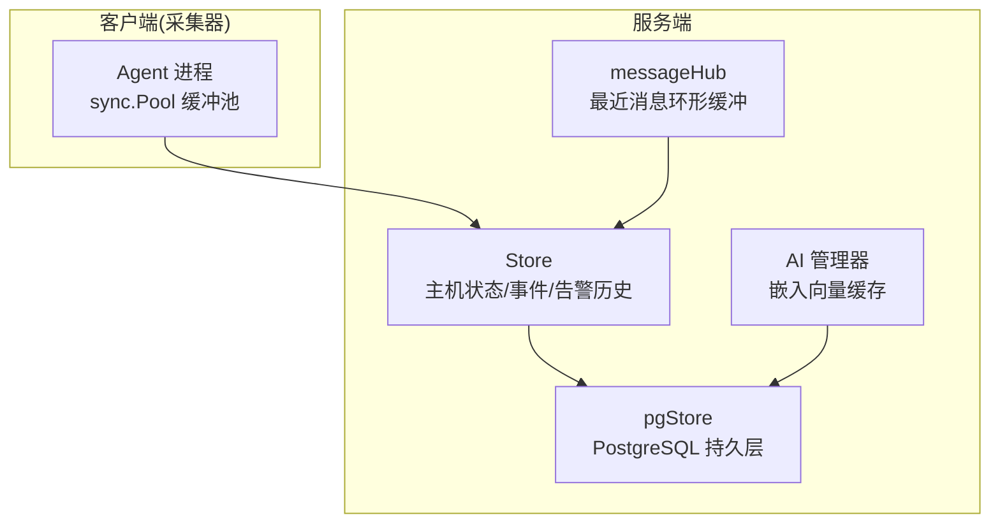
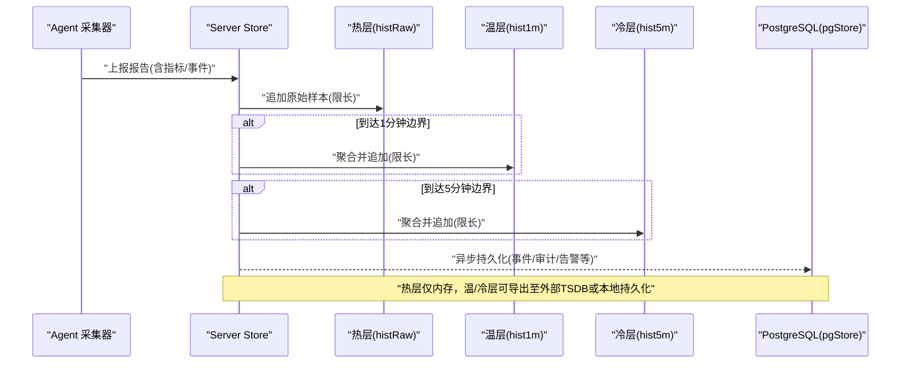
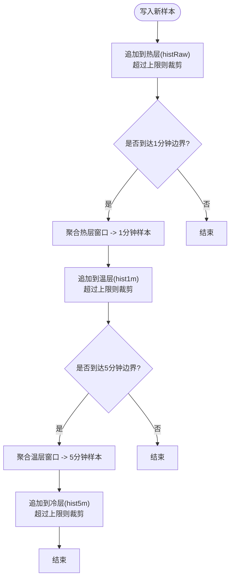
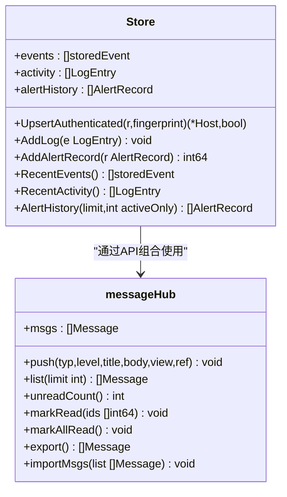
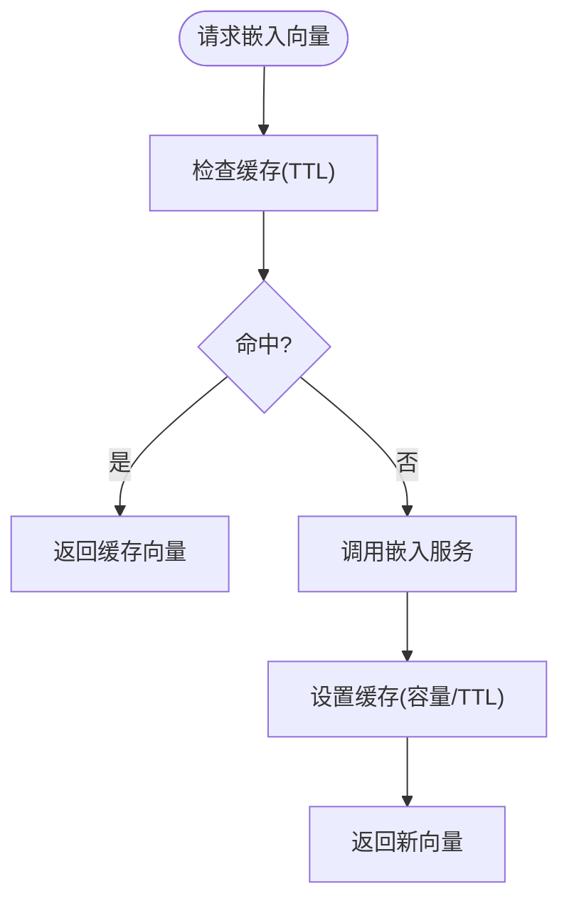
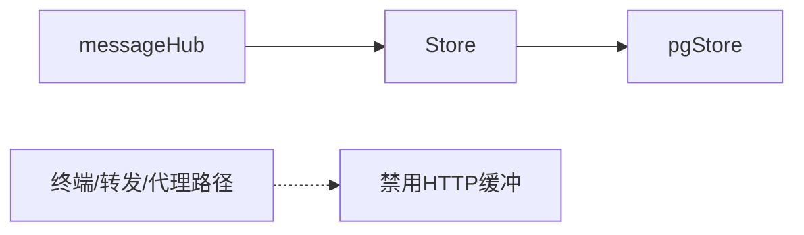

# 内存缓存策略

<cite>
**本文引用的文件列表**
- [cmd/server/store.go](file://cmd/server/store.go)
- [cmd/server/message.go](file://cmd/server/message.go)
- [cmd/server/aiops.go](file://cmd/server/aiops.go)
- [cmd/server/pgstore.go](file://cmd/server/pgstore.go)
- [cmd/server/main.go](file://cmd/server/main.go)
- [cmd/agent/infra.go](file://cmd/agent/infra.go)
</cite>

## 目录
1. [引言](#引言)
2. [项目结构](#项目结构)
3. [核心组件](#核心组件)
4. [架构总览](#架构总览)
5. [详细组件分析](#详细组件分析)
6. [依赖关系分析](#依赖关系分析)
7. [性能考量](#性能考量)
8. [故障排查指南](#故障排查指南)
9. [结论](#结论)
10. [附录：配置与调优](#附录配置与调优)

## 引言
本文件围绕 AIOps Monitor 的内存缓存策略进行系统化说明，重点覆盖多级缓存（热数据、冷数据归档）、环形缓冲区实现、内存使用控制与垃圾回收优化、缓存一致性、并发访问控制、性能监控指标、命中率优化、内存泄漏防护、容量规划建议、配置参数与调优方法，以及常见问题诊断路径。文档严格基于仓库源码进行分析与归纳，避免臆测。

## 项目结构
AIOps Monitor 在服务器端通过 Store 维护主机状态与多粒度时序历史，采用“热数据内存 + 冷数据持久化”的多级存储；消息中心 messageHub 提供最近通知的环形缓冲；AI 模块提供嵌入向量缓存以复用文本到向量的计算结果；Agent 侧通过 sync.Pool 复用字节缓冲以降低 GC 压力。

图表来源
- [cmd/server/store.go:91-104](file://cmd/server/store.go#L91-L104)
- [cmd/server/message.go:38-44](file://cmd/server/message.go#L38-L44)
- [cmd/server/aiops.go:838-850](file://cmd/server/aiops.go#L838-L850)
- [cmd/server/pgstore.go:119-151](file://cmd/server/pgstore.go#L119-L151)
- [cmd/agent/infra.go:15-20](file://cmd/agent/infra.go#L15-L20)

章节来源
- [cmd/server/store.go:91-104](file://cmd/server/store.go#L91-L104)
- [cmd/server/message.go:38-44](file://cmd/server/message.go#L38-L44)
- [cmd/server/aiops.go:838-850](file://cmd/server/aiops.go#L838-L850)
- [cmd/server/pgstore.go:119-151](file://cmd/server/pgstore.go#L119-L151)
- [cmd/agent/infra.go:15-20](file://cmd/agent/infra.go#L15-L20)

## 核心组件
- 多级时间序列缓存（热/温/冷）
  - 热层：原始样本（约 1.5 小时），用于短窗口查询与实时展示
  - 温层：1 分钟聚合（约 48 小时）
  - 冷层：5 分钟聚合（约 30 天）
  - 自动按时间跨度选择合适层级，减少大区间扫描成本
- 环形缓冲
  - 插件事件环形缓冲（全局最近 N 条）
  - 活动日志环形缓冲（操作审计）
  - 告警历史环形缓冲（生命周期记录）
  - 消息中心环形缓冲（最近通知）
- 嵌入向量缓存
  - 针对相同文本的向量结果做短期 TTL 缓存，降低外部 API 调用
- 缓冲池复用
  - Agent 侧使用 sync.Pool 复用 []byte 与 bytes.Buffer，降低 GC 压力

章节来源
- [cmd/server/store.go:12-27](file://cmd/server/store.go#L12-L27)
- [cmd/server/store.go:271-300](file://cmd/server/store.go#L271-L300)
- [cmd/server/store.go:335-337](file://cmd/server/store.go#L335-L337)
- [cmd/server/store.go:688-700](file://cmd/server/store.go#L688-L700)
- [cmd/server/store.go:768-776](file://cmd/server/store.go#L768-L776)
- [cmd/server/message.go:36-63](file://cmd/server/message.go#L36-L63)
- [cmd/server/aiops.go:838-884](file://cmd/server/aiops.go#L838-L884)
- [cmd/agent/infra.go:15-33](file://cmd/agent/infra.go#L15-L33)

## 架构总览
下图展示了从 Agent 上报到服务端多级缓存写入、聚合与读路径的整体流程，并体现冷热分层与持久化落盘点。

图表来源
- [cmd/server/store.go:271-300](file://cmd/server/store.go#L271-L300)
- [cmd/server/store.go:335-337](file://cmd/server/store.go#L335-L337)
- [cmd/server/pgstore.go:119-151](file://cmd/server/pgstore.go#L119-L151)

## 详细组件分析

### 多级时间序列缓存（热/温/冷）
- 设计要点
  - 热层 histRaw：保留最近约 1.5 小时的原始样本（5s 间隔），用于短窗口查询与 /metrics 兼容接口
  - 温层 hist1m：每 60s 对热层窗口聚合一次，保留约 48h
  - 冷层 hist5m：每 300s 对温层窗口聚合一次，保留约 30 天
  - GetHistory 根据查询跨度自动选择层级，避免全量扫描
- 数据结构与复杂度
  - 各层均为切片追加+尾部裁剪，均摊 O(1)
  - 聚合函数 aggregateSamples 遍历窗口内样本，O(n)，n 为窗口内样本数
- 并发与一致性
  - 所有写路径在单一互斥锁下执行，避免 TOCTOU 与竞态
  - 读路径使用 RWMutex 的读锁，保证快照一致性
- 失效与淘汰
  - 固定容量上限，超出时丢弃最旧数据（尾部裁剪）
  - 聚合触发条件基于时间戳差值，确保窗口推进
- 性能影响
  - 聚合仅在时间边界触发，避免频繁计算
  - 读取时按跨度选择层级，显著降低 I/O 与 CPU 开销

图表来源
- [cmd/server/store.go:271-300](file://cmd/server/store.go#L271-L300)
- [cmd/server/store.go:355-573](file://cmd/server/store.go#L355-L573)

章节来源
- [cmd/server/store.go:12-27](file://cmd/server/store.go#L12-L27)
- [cmd/server/store.go:271-300](file://cmd/server/store.go#L271-L300)
- [cmd/server/store.go:355-573](file://cmd/server/store.go#L355-L573)
- [cmd/server/store.go:620-648](file://cmd/server/store.go#L620-L648)

### 环形缓冲区实现（事件/日志/告警/消息）
- 插件事件环形缓冲
  - 全局最近 N 条，去抖键控（lastEvent map）限制重复事件频率
  - 插入后若超上限，直接裁剪头部
- 活动日志环形缓冲
  - 记录操作/系统/插件行为，支持异步持久化到 PostgreSQL
- 告警历史环形缓冲
  - 记录告警生命周期（触发/恢复），支持活跃过滤与导入恢复
- 消息中心环形缓冲
  - 最近通知条目，支持未读数统计、批量标记已读、导出/导入

图表来源
- [cmd/server/store.go:91-104](file://cmd/server/store.go#L91-L104)
- [cmd/server/store.go:335-337](file://cmd/server/store.go#L335-L337)
- [cmd/server/store.go:688-700](file://cmd/server/store.go#L688-L700)
- [cmd/server/store.go:768-776](file://cmd/server/store.go#L768-L776)
- [cmd/server/message.go:38-137](file://cmd/server/message.go#L38-L137)

章节来源
- [cmd/server/store.go:335-337](file://cmd/server/store.go#L335-L337)
- [cmd/server/store.go:688-700](file://cmd/server/store.go#L688-L700)
- [cmd/server/store.go:768-776](file://cmd/server/store.go#L768-L776)
- [cmd/server/message.go:36-137](file://cmd/server/message.go#L36-L137)

### 嵌入向量缓存（TTL + 容量控制）
- 目标
  - 对相同文本的向量结果进行短期缓存，避免重复调用外部嵌入服务
- 机制
  - 容量上限 embCacheCap，达到上限先清理过期项，仍满则随机淘汰一半
  - TTL 过期即视为不可用，下次请求重新计算
- 并发
  - 读写均加互斥锁，保证一致性与线程安全
- 适用场景
  - 对话/巡检等连续请求中，同一用户或相似输入的高命中

图表来源
- [cmd/server/aiops.go:838-884](file://cmd/server/aiops.go#L838-L884)

章节来源
- [cmd/server/aiops.go:838-884](file://cmd/server/aiops.go#L838-L884)

### 缓冲池复用（GC 压力缓解）
- 目的
  - 在热点路径（采集、编码、终端帧构建）复用 []byte 与 bytes.Buffer，减少分配与 GC
- 实现
  - 使用 sync.Pool 管理不同尺寸的缓冲池
  - 取用前 Reset，归还前不持有引用，避免泄露
- 注意
  - 不要在协程间跨作用域共享池对象
  - 避免将池对象逃逸到堆上（保持栈分配）

章节来源
- [cmd/agent/infra.go:15-33](file://cmd/agent/infra.go#L15-L33)

## 依赖关系分析
- Store 与 pgStore
  - Store 负责内存中的热/温/冷数据与环形缓冲；pgStore 负责持久化（审计日志、事件、告警记录、元数据）
  - 启动时从 PG 导入最近活动/事件/告警历史，恢复内存状态
- 消息中心与 Store
  - 消息中心独立于 Store，但整体由服务端统一编排，供前端铃铛/收件箱展示
- 流式通道与缓冲
  - 某些 HTTP 路径（终端、端口转发、代理隧道）明确禁用缓冲，避免延迟与内存堆积

图表来源
- [cmd/server/store.go:108-146](file://cmd/server/store.go#L108-L146)
- [cmd/server/pgstore.go:119-151](file://cmd/server/pgstore.go#L119-L151)
- [cmd/server/main.go:193-195](file://cmd/server/main.go#L193-L195)

章节来源
- [cmd/server/store.go:108-146](file://cmd/server/store.go#L108-L146)
- [cmd/server/pgstore.go:119-151](file://cmd/server/pgstore.go#L119-L151)
- [cmd/server/main.go:193-195](file://cmd/server/main.go#L193-L195)

## 性能考量
- 多级缓存命中率优化
  - 合理设置查询跨度阈值，优先命中温/冷层，减少热层扫描
  - 对高频短窗口查询，适当增大热层容量（需评估内存占用）
- 聚合开销控制
  - 聚合仅在时间边界触发，避免频繁计算；窗口大小受限于上层容量
- 并发与锁粒度
  - 读写分离（RWMutex）提升读吞吐；写路径集中处理，避免细粒度锁带来的复杂性
- 内存与 GC
  - 使用切片裁剪而非频繁扩容/缩容，减少分配
  - Agent 侧使用 sync.Pool 复用缓冲，降低 GC 压力
- 网络与外部依赖
  - 嵌入向量缓存降低外部 API 调用次数，提高响应速度

[本节为通用指导，无需具体文件引用]

## 故障排查指南
- 内存增长异常
  - 检查环形缓冲上限是否过小导致频繁复制，或过大导致内存占用高
  - 确认是否误将大对象（如进程列表）随历史返回，应通过 hostMeta 剥离
- 聚合不准确
  - 核对时间边界判断逻辑与 interval 常量，确保窗口推进正确
- 外部嵌入服务失败
  - 检查模型维度是否与存储列一致，错误会跳过入库并记录警告
- 流式通道卡顿
  - 确认终端/转发/代理路径未启用 HTTP 缓冲，避免阻塞

章节来源
- [cmd/server/store.go:345-353](file://cmd/server/store.go#L345-L353)
- [cmd/server/aiops.go:976-982](file://cmd/server/aiops.go#L976-L982)
- [cmd/server/main.go:193-195](file://cmd/server/main.go#L193-L195)

## 结论
AIOps Monitor 的内存缓存策略以“热/温/冷”多级分层为核心，结合环形缓冲与 TTL 缓存，兼顾低延迟读取与可控内存占用。通过严格的并发控制与容量上限，系统在稳定性与性能之间取得平衡。配合外部持久化层，实现了关键状态的恢复与审计能力。

[本节为总结性内容，无需具体文件引用]

## 附录：配置与调优
- 多级缓存容量与时间窗口
  - 热层最大样本数、温层最大点数、冷层最大点数及聚合间隔
  - 参考常量定义位置
- 环形缓冲上限
  - 插件事件、活动日志、告警历史、消息中心的容量上限
- 嵌入向量缓存
  - 容量上限与 TTL 时长
- 外部持久化
  - 启动导入最近记录数量，保障内存状态快速恢复

章节来源
- [cmd/server/store.go:12-27](file://cmd/server/store.go#L12-L27)
- [cmd/server/store.go:335-337](file://cmd/server/store.go#L335-L337)
- [cmd/server/store.go:688-700](file://cmd/server/store.go#L688-L700)
- [cmd/server/store.go:768-776](file://cmd/server/store.go#L768-L776)
- [cmd/server/message.go:36](file://cmd/server/message.go#L36)
- [cmd/server/aiops.go:846-850](file://cmd/server/aiops.go#L846-L850)
- [cmd/server/store.go:108-146](file://cmd/server/store.go#L108-L146)