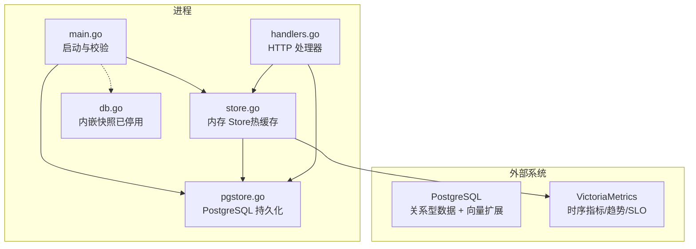
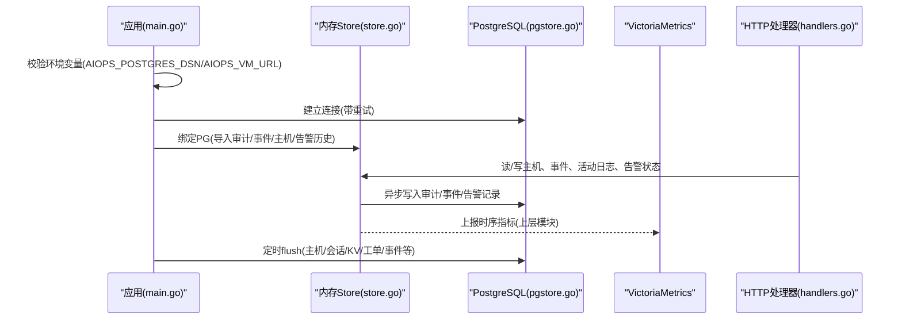
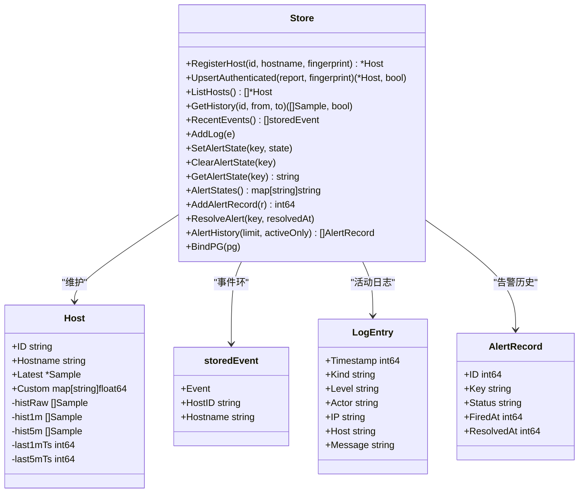
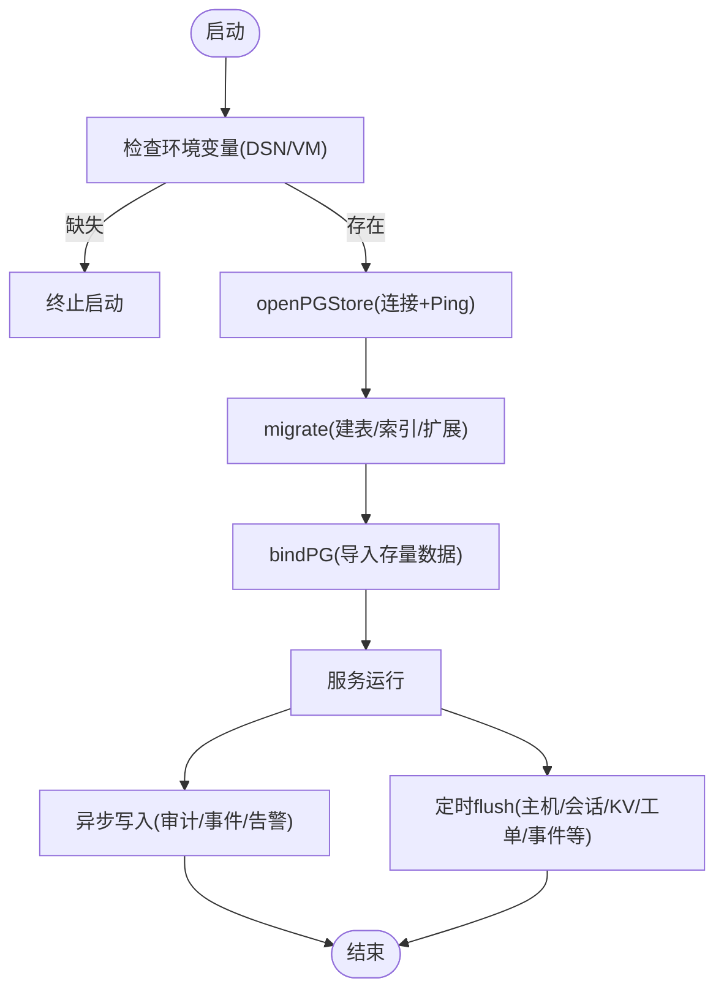
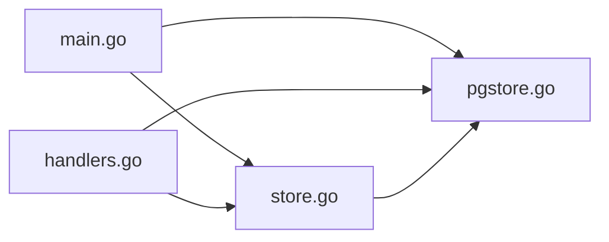

# 存储层架构

<cite>
**本文引用的文件**   
- [cmd/server/main.go](file://cmd/server/main.go)
- [cmd/server/pgstore.go](file://cmd/server/pgstore.go)
- [cmd/server/store.go](file://cmd/server/store.go)
- [cmd/server/db.go](file://cmd/server/db.go)
- [cmd/server/handlers.go](file://cmd/server/handlers.go)
- [docker-compose.yml](file://docker-compose.yml)
- [README.md](file://README.md)
- [pg-backup-vectorfix.sql](file://pg-backup-vectorfix.sql)
</cite>

## 目录
1. [简介](#简介)
2. [项目结构](#项目结构)
3. [核心组件](#核心组件)
4. [架构总览](#架构总览)
5. [详细组件分析](#详细组件分析)
6. [依赖关系分析](#依赖关系分析)
7. [性能与容量规划](#性能与容量规划)
8. [故障排查指南](#故障排查指南)
9. [结论](#结论)
10. [附录：数据模型与索引、备份恢复与调优建议](#附录数据模型与索引备份恢复与调优建议)

## 简介
本文件面向 AIOps Monitor 的“存储层”，系统性阐述统一存储抽象设计、PostgreSQL 连接管理、内存缓存机制与时序数据存储策略，覆盖数据模型定义、CRUD 封装、事务处理、连接池管理与错误重试机制；并提供数据库表结构设计、索引优化策略、备份恢复方案与性能调优建议。同时给出使用模式与最佳实践的代码片段路径，帮助读者快速上手并安全运维。

## 项目结构
存储相关代码集中在 cmd/server 下，围绕以下关键文件组织：
- main.go：启动流程、环境变量校验、强制要求 PostgreSQL + VictoriaMetrics 作为持久化/时序后端，内置 aiops.db 已停用。
- pgstore.go：PostgreSQL 持久化实现（迁移、CRUD、向量检索、会话/KV/审计/事件/告警历史等）。
- store.go：内存 Store（主机元数据、三级时间序列热缓存、事件环、活动日志、告警状态与历史），并通过 BindPG 与 PG 对接。
- db.go：内嵌快照式本地存储（aiops.db）的实现与自动保存逻辑（当前版本不再启用，仅保留兼容能力）。
- handlers.go：HTTP 处理器中注入的存储依赖（含 pgStore 引用）。
- docker-compose.yml：默认提供 PG 与 VM 的环境变量与镜像编排。
- README.md：统一存储策略说明与性能规模结论。

图表来源
- [cmd/server/main.go:207-272](file://cmd/server/main.go#L207-L272)
- [cmd/server/pgstore.go:43-75](file://cmd/server/pgstore.go#L43-L75)
- [cmd/server/store.go:91-146](file://cmd/server/store.go#L91-L146)
- [cmd/server/db.go:14-24](file://cmd/server/db.go#L14-L24)
- [cmd/server/handlers.go:39-45](file://cmd/server/handlers.go#L39-L45)

章节来源
- [cmd/server/main.go:207-272](file://cmd/server/main.go#L207-L272)
- [cmd/server/pgstore.go:43-75](file://cmd/server/pgstore.go#L43-L75)
- [cmd/server/store.go:91-146](file://cmd/server/store.go#L91-L146)
- [cmd/server/db.go:14-24](file://cmd/server/db.go#L14-L24)
- [cmd/server/handlers.go:39-45](file://cmd/server/handlers.go#L39-L45)
- [docker-compose.yml:68-71](file://docker-compose.yml#L68-L71)
- [README.md:1096-1116](file://README.md#L1096-L1116)

## 核心组件
- 统一存储抽象
  - 内存 Store：维护主机元数据、最近事件环、活动日志、告警状态与历史、以及三层时间序列热缓存（原始/1分钟聚合/5分钟聚合）。
  - PostgreSQL 持久化：通过 pgStore 将主机元数据、审计日志、插件事件、告警历史、会话/KV、SRE 工单/事件、AI 记忆与经验规则等落库。
  - 时序数据：指标/趋势/SLO 写入 VictoriaMetrics（由上层模块负责上报，存储层不直接写 VM）。
  - 内嵌快照（aiops.db）：已停用，不再作为生产持久化路径。

- 连接管理与初始化
  - 启动时从环境变量读取 AIOPS_POSTGRES_DSN，未配置则拒绝启动。
  - 使用 sql.DB 连接池，设置最大连接数、空闲连接数与连接生命周期。
  - 冷启动重试：在 mustOpenPG 中有限次数重试，避免容器编排冷启动竞争。

- 内存缓存机制
  - 主机列表与最新样本常驻内存。
  - 三级时间序列降采样：原始约 1.5h、1 分钟聚合 48h、5 分钟聚合 30 天。
  - 事件环与活动日志环形缓冲，限制大小防止内存膨胀。

- 事务与一致性
  - 批量写入（如 hosts、incidents、tickets）采用事务包裹，保证原子性。
  - KV 键值对（alert_states、sessions、messages 等）以 JSONB 行存储，支持幂等 upsert。

- 错误与重试
  - 启动阶段对 PG 连接进行有界重试。
  - 异步写入（审计日志、事件、告警记录）失败仅告警，不影响主流程。
  - 定期 flush 将内存态同步到 PG，降低重启丢失风险。

章节来源
- [cmd/server/main.go:207-272](file://cmd/server/main.go#L207-L272)
- [cmd/server/pgstore.go:43-75](file://cmd/server/pgstore.go#L43-L75)
- [cmd/server/store.go:91-146](file://cmd/server/store.go#L91-L146)
- [cmd/server/store.go:268-307](file://cmd/server/store.go#L268-L307)
- [cmd/server/pgstore.go:237-263](file://cmd/server/pgstore.go#L237-L263)
- [cmd/server/pgstore.go:472-491](file://cmd/server/pgstore.go#L472-L491)
- [cmd/server/pgstore.go:515-534](file://cmd/server/pgstore.go#L515-L534)
- [cmd/server/pgstore.go:304-332](file://cmd/server/pgstore.go#L304-L332)
- [cmd/server/pgstore.go:381-409](file://cmd/server/pgstore.go#L381-L409)
- [cmd/server/pgstore.go:413-448](file://cmd/server/pgstore.go#L413-L448)

## 架构总览
下图展示存储层整体交互：应用启动后强制要求 PG + VM；内存 Store 作为热缓存，周期性或触发式将关系数据落盘至 PG；时序数据由上层写入 VM；HTTP 处理器通过 Store 和 PG 完成读写。

图表来源
- [cmd/server/main.go:207-272](file://cmd/server/main.go#L207-L272)
- [cmd/server/store.go:106-146](file://cmd/server/store.go#L106-L146)
- [cmd/server/pgstore.go:1116-1185](file://cmd/server/pgstore.go#L1116-L1185)
- [cmd/server/handlers.go:39-45](file://cmd/server/handlers.go#L39-L45)

## 详细组件分析

### 组件A：内存 Store（主机、事件、活动日志、告警）
- 职责
  - 维护主机集合与最新样本。
  - 维护三级时间序列热缓存（原始/1m/5m）。
  - 维护最近事件环与活动日志环。
  - 维护告警状态（确认/静默）与告警历史（触发/恢复）。
  - 与 PG 双向同步：启动时导入，运行期异步追加，定时 flush。

- 关键数据结构
  - Host：主机元数据 + Latest + 自定义指标 + 三级历史切片。
  - storedEvent：插件事件 + 来源主机信息。
  - LogEntry：操作/系统/插件/终端四类活动日志。
  - AlertRecord：告警生命周期记录（firing/resolved/acknowledged/silenced）。

- 并发与一致性
  - 使用 RWMutex 保护热点路径，UpsertAuthenticated 在一次锁内完成指纹校验与更新，避免 TOCTOU。
  - 导出快照时复制必要切片，避免与并发 Upsert 共享底层数组导致数据竞争。

- 时间序列降采样
  - 按窗口计算均值/最大值/计数等聚合，保持 CPU/内存/磁盘/GPU/网络/负载/进程数等指标语义正确。

图表来源
- [cmd/server/store.go:29-90](file://cmd/server/store.go#L29-L90)
- [cmd/server/store.go:91-146](file://cmd/server/store.go#L91-L146)
- [cmd/server/store.go:230-340](file://cmd/server/store.go#L230-L340)
- [cmd/server/store.go:355-573](file://cmd/server/store.go#L355-L573)
- [cmd/server/store.go:756-834](file://cmd/server/store.go#L756-L834)

章节来源
- [cmd/server/store.go:29-90](file://cmd/server/store.go#L29-L90)
- [cmd/server/store.go:91-146](file://cmd/server/store.go#L91-L146)
- [cmd/server/store.go:230-340](file://cmd/server/store.go#L230-L340)
- [cmd/server/store.go:355-573](file://cmd/server/store.go#L355-L573)
- [cmd/server/store.go:756-834](file://cmd/server/store.go#L756-L834)

### 组件B：PostgreSQL 持久化（pgStore）
- 职责
  - 迁移：创建/升级表结构，启用 vector 扩展，建索引。
  - 持久化：主机元数据、KV 状态、审计日志、插件事件、告警历史、终端录制元数据、诊断与通用 AI 记忆、经验规则、Hermes 规则/模板/会话等。
  - 向量检索：基于 pgvector 的余弦距离相似案例检索与知识沉淀。

- 连接池与健壮性
  - 设置 MaxOpenConns/MaxIdleConns/ConnMaxLifetime。
  - 启动 Ping 检查，失败即返回错误供上层回退或终止。
  - 启动重试：mustOpenPG 多次尝试，避免冷启动竞态。

- 事务与幂等
  - 批量写入使用事务，确保一致性与原子性。
  - KV 写入使用 ON CONFLICT DO UPDATE 实现幂等 upsert。

- 异步与定期刷新
  - 审计/事件/告警记录异步写入，失败仅告警。
  - Server 侧定时 goroutine 周期 flush 所有关系数据（包括会话、消息、SLO 燃烧状态、剧本执行历史等）。

图表来源
- [cmd/server/main.go:207-272](file://cmd/server/main.go#L207-L272)
- [cmd/server/pgstore.go:43-75](file://cmd/server/pgstore.go#L43-L75)
- [cmd/server/pgstore.go:77-212](file://cmd/server/pgstore.go#L77-L212)
- [cmd/server/pgstore.go:1116-1185](file://cmd/server/pgstore.go#L1116-L1185)

章节来源
- [cmd/server/pgstore.go:43-75](file://cmd/server/pgstore.go#L43-L75)
- [cmd/server/pgstore.go:77-212](file://cmd/server/pgstore.go#L77-L212)
- [cmd/server/pgstore.go:1116-1185](file://cmd/server/pgstore.go#L1116-L1185)

### 组件C：内嵌快照存储（aiops.db，已停用）
- 职责
  - 将内存状态（主机、事件、活动日志、删除抑制、会话、告警状态、SRE 状态）序列化压缩为单个文件，支持加载与自动保存。
- 现状
  - 启动流程已强制要求 PG + VM，内置 aiops.db 不再启用。
  - 代码仍保留以便兼容或离线场景参考。

章节来源
- [cmd/server/db.go:14-24](file://cmd/server/db.go#L14-L24)
- [cmd/server/db.go:93-149](file://cmd/server/db.go#L93-L149)
- [cmd/server/db.go:151-179](file://cmd/server/db.go#L151-L179)
- [cmd/server/db.go:234-255](file://cmd/server/db.go#L234-L255)
- [cmd/server/main.go:251-261](file://cmd/server/main.go#L251-L261)

## 依赖关系分析
- 组件耦合
  - main.go 依赖 pgstore 与 store，并强制要求 PG + VM。
  - store 通过 BindPG 与 pgstore 关联，并在运行期异步写入。
  - handlers 依赖 store 与 pgstore 完成业务读写。
- 外部依赖
  - PostgreSQL：关系型数据与向量检索。
  - VictoriaMetrics：时序指标/趋势/SLO。
- 潜在循环
  - 无直接循环依赖；store 与 pgstore 单向依赖。

图表来源
- [cmd/server/main.go:207-272](file://cmd/server/main.go#L207-L272)
- [cmd/server/store.go:106-146](file://cmd/server/store.go#L106-L146)
- [cmd/server/pgstore.go:1116-1185](file://cmd/server/pgstore.go#L1116-L1185)
- [cmd/server/handlers.go:39-45](file://cmd/server/handlers.go#L39-L45)

章节来源
- [cmd/server/main.go:207-272](file://cmd/server/main.go#L207-L272)
- [cmd/server/store.go:106-146](file://cmd/server/store.go#L106-L146)
- [cmd/server/pgstore.go:1116-1185](file://cmd/server/pgstore.go#L1116-L1185)
- [cmd/server/handlers.go:39-45](file://cmd/server/handlers.go#L39-L45)

## 性能与容量规划
- 内存占用
  - 每台主机三层历史约 1-2 MB，3000 台约需 4-7 GB（可通过调整保留常量降低）。
- 吞吐与带宽
  - gzip 压缩使多主机轮询下行降至百 KB/s 级。
  - 上报吞吐可达数百次/秒，Upsert 仅短暂持写锁。
- 存储分层
  - 关系数据入 PG，时序数据入 VM，冷热分离清晰。
- 调优建议
  - 主机规模大时增大上报间隔以降低带宽与 CPU。
  - 合理设置 PG 连接池参数与索引，关注大表（audit_log/events/alert_history）增长。
  - 控制事件环与活动日志上限，避免内存膨胀。

章节来源
- [README.md:1096-1116](file://README.md#L1096-L1116)
- [cmd/server/store.go:12-27](file://cmd/server/store.go#L12-L27)
- [cmd/server/pgstore.go:53-56](file://cmd/server/pgstore.go#L53-L56)

## 故障排查指南
- 启动失败
  - 现象：未配置 AIOPS_POSTGRES_DSN 或 AIOPS_VM_URL 直接退出。
  - 处理：检查环境变量是否设置，确认 PG 可连通且 VM 地址正确。
- PG 连接失败
  - 现象：启动时反复重试后终止。
  - 处理：检查 DSN、网络、防火墙、PG 健康检查；必要时增加重试间隔或扩容 PG。
- 写入失败
  - 现象：审计/事件/告警写入失败仅告警，不影响主流程。
  - 处理：观察日志，定位 PG 压力或权限问题；必要时提升资源或限流。
- 数据不一致
  - 现象：重启后部分状态未恢复。
  - 处理：确认定时 flush 是否正常执行；检查 KV 键值是否被覆盖；核对事务是否成功提交。

章节来源
- [cmd/server/main.go:251-272](file://cmd/server/main.go#L251-L272)
- [cmd/server/pgstore.go:304-332](file://cmd/server/pgstore.go#L304-L332)
- [cmd/server/pgstore.go:381-409](file://cmd/server/pgstore.go#L381-L409)
- [cmd/server/pgstore.go:413-448](file://cmd/server/pgstore.go#L413-L448)
- [cmd/server/pgstore.go:1176-1185](file://cmd/server/pgstore.go#L1176-L1185)

## 结论
AIOps Monitor 的存储层采用“内存热缓存 + PostgreSQL 持久化 + VictoriaMetrics 时序”的统一架构。内存 Store 保障高吞吐与低延迟访问，PG 提供强一致的关系数据与向量检索能力，VM 承载海量时序数据。通过连接池、事务、异步写入与定时 flush 的组合，系统在可靠性与性能之间取得良好平衡。生产部署应严格配置环境变量、监控 PG 与 VM 健康，并结合索引与容量规划持续优化。

## 附录：数据模型与索引、备份恢复与调优建议

### 数据模型与索引（PG）
- 核心表
  - incidents：事件记录（JSONB data），索引 status。
  - tickets：工单记录（JSONB data），索引 status。
  - app_config：应用配置（JSONB data）。
  - audit_log：审计日志（JSONB data），索引 ts。
  - events：插件事件（JSONB data），索引 ts。
  - hosts：主机元数据（JSONB data）。
  - kv_state：KV 状态（JSONB data）。
  - terminal_recordings：终端录制元数据（info JSONB），索引 ts DESC。
  - diagnosis_embeddings：诊断向量记忆（vector(1536)），索引 incident_id。
  - ai_memory_embeddings：通用 AI 记忆（vector(1536)），索引 kind、created_at、kind+created_at。
  - experience_rules：经验规则。
  - hermes_rules / hermes_templates / hermes_sessions：Hermes Agent 相关。
  - alert_history：告警历史（key、fired_at、resolved_at、data JSONB），索引 key、fired_at DESC。

- 索引优化要点
  - 高频查询字段建索引（status、ts、key、incident_id、kind、created_at）。
  - 降采样与范围查询利用 DESC 索引提升分页与倒序查询效率。
  - 向量检索使用 pgvector 的 <=> 算子，结合 limit 与过滤条件减少扫描。

章节来源
- [cmd/server/pgstore.go:77-212](file://cmd/server/pgstore.go#L77-L212)
- [pg-backup-vectorfix.sql:1-312](file://pg-backup-vectorfix.sql#L1-L312)

### 备份与恢复
- 全量备份
  - 使用 pg_dump 导出 schema 与数据，包含 vector 扩展与索引。
- 增量/时间点恢复
  - 结合 WAL 归档与 PITR 实现细粒度恢复。
- 恢复步骤
  - 停止服务 → 恢复 PG 数据 → 启动服务 → 验证 KV/会话/事件/告警历史是否完整。
- 注意事项
  - 确保 vector 扩展可用，避免向量列类型不匹配。
  - 恢复后检查索引完整性与统计信息。

章节来源
- [pg-backup-vectorfix.sql:1-312](file://pg-backup-vectorfix.sql#L1-L312)

### 连接池与事务最佳实践
- 连接池
  - 根据并发与 PG 资源设置 MaxOpenConns/MaxIdleConns/ConnMaxLifetime。
- 事务
  - 批量写入使用事务，失败回滚，避免半写状态。
- 幂等
  - KV 使用 ON CONFLICT DO UPDATE，避免重复写入。
- 异步写入
  - 审计/事件/告警异步写入，失败仅告警，避免阻塞主流程。

章节来源
- [cmd/server/pgstore.go:53-56](file://cmd/server/pgstore.go#L53-L56)
- [cmd/server/pgstore.go:237-263](file://cmd/server/pgstore.go#L237-L263)
- [cmd/server/pgstore.go:276-280](file://cmd/server/pgstore.go#L276-L280)
- [cmd/server/pgstore.go:304-332](file://cmd/server/pgstore.go#L304-L332)
- [cmd/server/pgstore.go:381-409](file://cmd/server/pgstore.go#L381-L409)
- [cmd/server/pgstore.go:413-448](file://cmd/server/pgstore.go#L413-L448)

### 使用模式与最佳实践（代码片段路径）
- 启动与绑定
  - 启动流程与强制校验：[cmd/server/main.go:207-272](file://cmd/server/main.go#L207-L272)
  - 绑定 PG 并导入存量数据：[cmd/server/pgstore.go:1116-1185](file://cmd/server/pgstore.go#L1116-L1185)
- 主机注册与指标上报
  - 注册主机：[cmd/server/store.go:197-228](file://cmd/server/store.go#L197-L228)
  - 认证上报与三级历史聚合：[cmd/server/store.go:230-340](file://cmd/server/store.go#L230-L340)
- 事件与活动日志
  - 事件去重与追加：[cmd/server/store.go:309-337](file://cmd/server/store.go#L309-L337)
  - 活动日志追加与异步持久化：[cmd/server/store.go:687-707](file://cmd/server/store.go#L687-L707)
- 告警状态与历史
  - 设置/清除/获取告警状态：[cmd/server/store.go:720-754](file://cmd/server/store.go#L720-L754)
  - 添加/解析告警记录：[cmd/server/store.go:756-796](file://cmd/server/store.go#L756-L796)
- PG 持久化示例
  - 主机元数据批量写入（事务）：[cmd/server/pgstore.go:237-263](file://cmd/server/pgstore.go#L237-L263)
  - 审计日志追加（异步）：[cmd/server/pgstore.go:304-332](file://cmd/server/pgstore.go#L304-L332)
  - 插件事件追加（异步）：[cmd/server/pgstore.go:381-409](file://cmd/server/pgstore.go#L381-L409)
  - 告警历史追加/恢复（异步）：[cmd/server/pgstore.go:413-448](file://cmd/server/pgstore.go#L413-L448)
- HTTP 集成
  - 处理器注入存储依赖：[cmd/server/handlers.go:39-45](file://cmd/server/handlers.go#L39-L45)