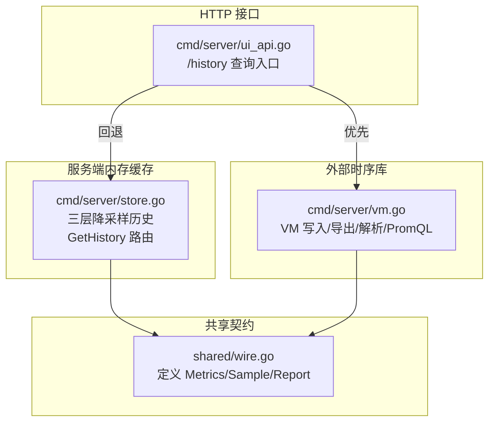
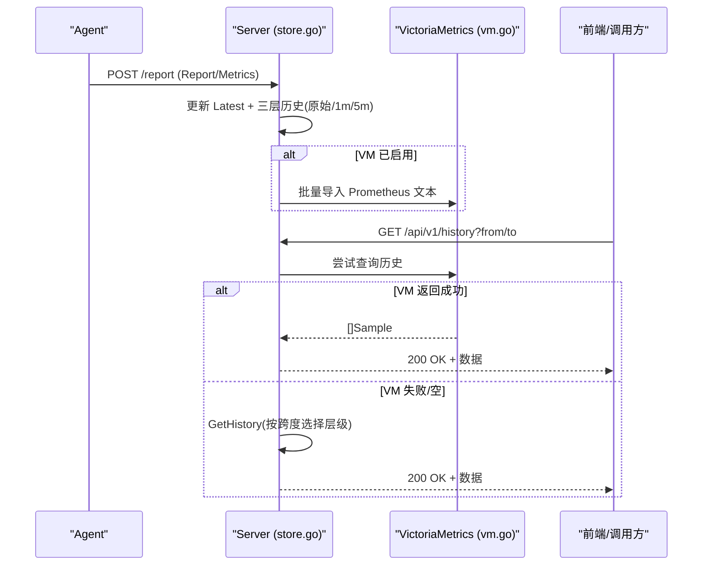
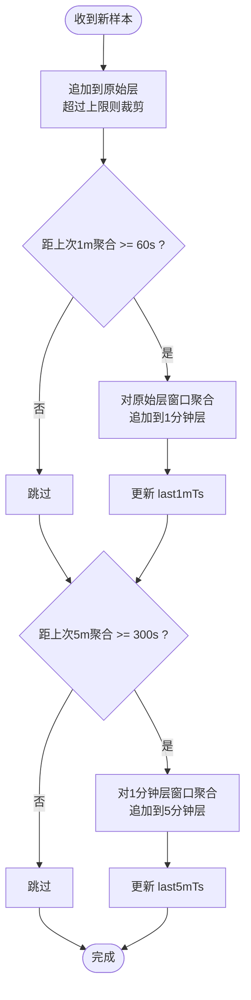
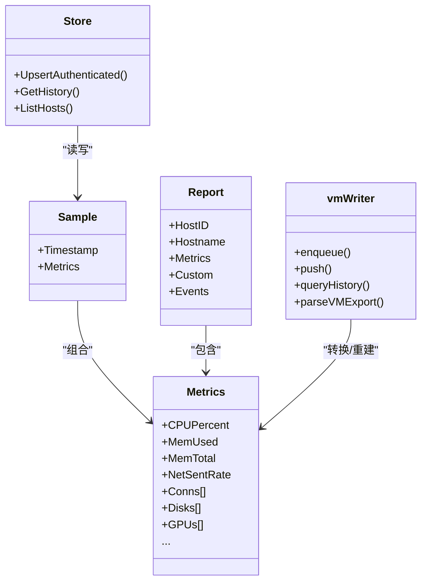

# 时序数据模型

<cite>
**本文引用的文件列表**
- [shared/wire.go](file://shared/wire.go)
- [cmd/server/store.go](file://cmd/server/store.go)
- [cmd/server/vm.go](file://cmd/server/vm.go)
- [cmd/server/ui_api.go](file://cmd/server/ui_api.go)
</cite>

## 目录
1. [引言](#引言)
2. [项目结构](#项目结构)
3. [核心组件](#核心组件)
4. [架构总览](#架构总览)
5. [详细组件分析](#详细组件分析)
6. [依赖关系分析](#依赖关系分析)
7. [性能与容量规划](#性能与容量规划)
8. [故障排查指南](#故障排查指南)
9. [结论](#结论)
10. [附录：示例与最佳实践](#附录示例与最佳实践)

## 引言
本文件面向 AIOps Monitor 的“时序数据模型”，系统性阐述多层级降采样架构、Sample 数据结构、指标类型与处理规则、时间窗口聚合算法、存储策略（内存环形缓冲 + VictoriaMetrics）、历史查询优化、数据保留策略、存储空间估算与查询性能分析，并提供插入/查询/管理的代码路径参考与监控指标最佳实践。

## 项目结构
与时序数据相关的核心实现分布在以下位置：
- shared/wire.go：定义跨进程/模块共享的数据契约（Metrics、Sample、Report 等）。
- cmd/server/store.go：服务端内存中的三层降采样历史缓存（原始层、1分钟聚合层、5分钟聚合层）及查询路由。
- cmd/server/vm.go：VictoriaMetrics 集成（写入、导出、解析、PromQL 聚合），作为权威长期时序存储。
- cmd/server/ui_api.go：对外 HTTP API 的历史查询入口，优先走 VM，回退到内存三层缓存。

图表来源
- [shared/wire.go:88-92](file://shared/wire.go#L88-L92)
- [cmd/server/store.go:268-300](file://cmd/server/store.go#L268-L300)
- [cmd/server/vm.go:715-742](file://cmd/server/vm.go#L715-L742)
- [cmd/server/ui_api.go:92-108](file://cmd/server/ui_api.go#L92-L108)

章节来源
- [shared/wire.go:88-92](file://shared/wire.go#L88-L92)
- [cmd/server/store.go:268-300](file://cmd/server/store.go#L268-L300)
- [cmd/server/vm.go:715-742](file://cmd/server/vm.go#L715-L742)
- [cmd/server/ui_api.go:92-108](file://cmd/server/ui_api.go#L92-L108)

## 核心组件
- Sample 结构体：承载一次采集快照的时间戳与指标集合，是时序数据的最小单元。
- Metrics 指标族：CPU、内存、Swap、磁盘、网络、连接数、负载、进程数、GPU、磁盘 IO/IOPS、API 业务指标、编排任务指标等。
- Report：Agent 上报的完整载荷，包含主机元信息、Metrics、自定义指标与事件。
- Host 内存记录：每个 Agent 对应一个 Host，维护三层历史缓存与最新样本。
- vmWriter：将样本批量转换为 Prometheus 文本格式并推送至 VictoriaMetrics；同时支持从 VM 导出并按时间戳重组为 Sample 序列。

章节来源
- [shared/wire.go:12-53](file://shared/wire.go#L12-L53)
- [shared/wire.go:88-92](file://shared/wire.go#L88-L92)
- [shared/wire.go:124-138](file://shared/wire.go#L124-L138)
- [cmd/server/store.go:29-51](file://cmd/server/store.go#L29-L51)
- [cmd/server/vm.go:67-77](file://cmd/server/vm.go#L67-L77)

## 架构总览
AIOps Monitor 采用“双写 + 分层”的时序数据架构：
- 热路径：Agent 每约 5 秒上报一次，服务端在内存中维护三层环形缓冲（原始层 ~1.5h、1分钟聚合层 48h、5分钟聚合层 30天），用于内置仪表盘快速渲染。
- 冷路径：可选地通过 VictoriaMetrics 持久化所有指标，提供长期存储与强大查询能力。UI 查询时优先从 VM 拉取，若不可用或无数据则回退到内存三层缓存。

图表来源
- [cmd/server/store.go:268-300](file://cmd/server/store.go#L268-L300)
- [cmd/server/vm.go:506-571](file://cmd/server/vm.go#L506-L571)
- [cmd/server/ui_api.go:92-108](file://cmd/server/ui_api.go#L92-L108)

## 详细组件分析

### 数据模型与指标分类
- Sample：带时间戳的指标快照，字段来自 Metrics。
- Metrics 分类
  - 资源类：CPU 使用率/核数、内存/交换空间使用量与百分比、磁盘总量/使用量/百分比、Uptime、Load1/5/15、进程数。
  - 设备类：多盘分区用量（path/total/used/percent）、GPU 利用率/温度/显存、磁盘 IO 速率与 IOPS。
  - 网络类：收发速率、TCP 连接总数、按协议+状态的连接计数。
  - 业务类：API 可用率、平均响应时间、P95 响应时间、吞吐量。
  - 编排类：定时任务失败次数、超时时长。
- Report：包含主机标识、平台信息、Metrics、自定义指标 map、插件事件数组。

章节来源
- [shared/wire.go:12-53](file://shared/wire.go#L12-L53)
- [shared/wire.go:88-92](file://shared/wire.go#L88-L92)
- [shared/wire.go:124-138](file://shared/wire.go#L124-L138)

### 多层级降采样与存储策略
- 原始层（~5s 间隔，约 1.5h）：直接追加新样本，超出上限裁剪尾部。
- 1分钟聚合层（最近 48h）：每隔 60s 对原始层窗口求均值/末值，生成一条聚合样本。
- 5分钟聚合层（最近 30天）：每隔 300s 对 1分钟层窗口求均值/末值，生成一条聚合样本。
- 查询路由：根据请求时间跨度自动选择层级（<2h 用原始层，<48h 用 1分钟层，>=48h 用 5分钟层）。

图表来源
- [cmd/server/store.go:268-300](file://cmd/server/store.go#L268-L300)
- [cmd/server/store.go:355-573](file://cmd/server/store.go#L355-L573)
- [cmd/server/store.go:620-648](file://cmd/server/store.go#L620-L648)

章节来源
- [cmd/server/store.go:21-27](file://cmd/server/store.go#L21-L27)
- [cmd/server/store.go:268-300](file://cmd/server/store.go#L268-L300)
- [cmd/server/store.go:355-573](file://cmd/server/store.go#L355-L573)
- [cmd/server/store.go:620-648](file://cmd/server/store.go#L620-L648)

### 时间窗口聚合算法
- 数值型指标：窗口内算术平均（如 CPU%、内存使用量、网络速率、IOPS 等）。
- 计数器/单调递增指标：取窗口末值（如 CPU 核数、Uptime）。
- 派生指标：基于平均值重新计算百分比（如 MemPercent = avg(MemUsed)/avg(MemTotal)*100）。
- 复合对象：
  - 多盘分区：按 path 分组后分别求平均 total/used，再算 percent。
  - GPU：按 gpu 名分组后求平均 util/temp/mem。
  - 连接计数：按 proto+state 分组后求平均 count。
- 复杂度：O(n) 扫描窗口样本，n 为窗口内样本数。

章节来源
- [cmd/server/store.go:355-573](file://cmd/server/store.go#L355-L573)

### VictoriaMetrics 集成与压缩策略
- 写入：将每条样本转为 Prometheus 文本格式，批量（默认 5s 或达到批大小）POST 到 /api/v1/import/prometheus。
- 标签设计：host、instance、category、gpu、path、proto、state 等，便于多维筛选与聚合。
- 读取：通过 /api/v1/export 获取 NDJSON，按时间戳重组为 Sample 序列，恢复复合对象（GPU、磁盘、连接）。
- 压缩：传输层由 HTTP 客户端/服务器协商 gzip；应用层以文本格式序列化，体积可控。
- 容错：写入失败仅告警不阻塞主流程；查询失败回退到内存三层缓存。

章节来源
- [cmd/server/vm.go:506-571](file://cmd/server/vm.go#L506-L571)
- [cmd/server/vm.go:715-742](file://cmd/server/vm.go#L715-L742)
- [cmd/server/vm.go:747-800](file://cmd/server/vm.go#L747-L800)
- [cmd/server/ui_api.go:92-108](file://cmd/server/ui_api.go#L92-L108)

### 历史查询优化
- 自动层级选择：根据 from-to 跨度选择最合适的层级，避免在大跨度上扫描原始层。
- 时间范围过滤：在选定层级内按时间区间过滤，减少返回数据量。
- VM 优先：当 VM 可用且返回数据时，直接返回 VM 结果，减轻内存压力。

章节来源
- [cmd/server/store.go:620-648](file://cmd/server/store.go#L620-L648)
- [cmd/server/ui_api.go:92-108](file://cmd/server/ui_api.go#L92-L108)

### 数据保留策略
- 内存三层保留上限（常量控制）：
  - 原始层：约 1.5h（~1200 点，5s 间隔）
  - 1分钟层：48h（2880 点）
  - 5分钟层：30天（8640 点）
- 过期清理：每层超过上限后裁剪尾部，保持固定长度环形缓冲。
- 长期保留：由 VictoriaMetrics 负责（取决于其自身保留配置）。

章节来源
- [cmd/server/store.go:21-27](file://cmd/server/store.go#L21-L27)
- [cmd/server/store.go:272-300](file://cmd/server/store.go#L272-L300)

## 依赖关系分析
- shared/wire.go 被 server 与 agent 共同引用，确保前后端/进程间契约一致。
- store.go 依赖 shared 的 Sample/Metrics，并在 UpsertAuthenticated 中执行三层聚合与裁剪。
- vm.go 依赖 shared 的 Metrics，负责将样本映射为 VM 指标族，并将 VM 返回的 NDJSON 重建为 Sample。
- ui_api.go 作为查询入口，协调 VM 与 store 的读路径。

图表来源
- [shared/wire.go:12-53](file://shared/wire.go#L12-L53)
- [shared/wire.go:88-92](file://shared/wire.go#L88-L92)
- [shared/wire.go:124-138](file://shared/wire.go#L124-L138)
- [cmd/server/store.go:230-340](file://cmd/server/store.go#L230-L340)
- [cmd/server/vm.go:506-571](file://cmd/server/vm.go#L506-L571)
- [cmd/server/vm.go:747-800](file://cmd/server/vm.go#L747-L800)

章节来源
- [shared/wire.go:12-53](file://shared/wire.go#L12-L53)
- [shared/wire.go:88-92](file://shared/wire.go#L88-L92)
- [shared/wire.go:124-138](file://shared/wire.go#L124-L138)
- [cmd/server/store.go:230-340](file://cmd/server/store.go#L230-L340)
- [cmd/server/vm.go:506-571](file://cmd/server/vm.go#L506-L571)
- [cmd/server/vm.go:747-800](file://cmd/server/vm.go#L747-L800)

## 性能与容量规划
- 写入吞吐：内存层为 O(1) 追加 + 周期性 O(n) 聚合；VM 写入为异步批量，不阻塞上报。
- 内存占用：每主机三层历史约 1-2MB（受保留上限影响），3000 主机约 4-7GB（可随保留上限调整）。
- 查询性能：短跨度（<2h）走原始层，长跨度自动降级到 1m/5m 层；VM 模式优先，降低内存压力。
- 带宽与压缩：HTTP 层 gzip 压缩显著降低传输体积；批量导入减少网络往返。

章节来源
- [cmd/server/store.go:21-27](file://cmd/server/store.go#L21-L27)
- [cmd/server/store.go:620-648](file://cmd/server/store.go#L620-L648)
- [cmd/server/vm.go:506-571](file://cmd/server/vm.go#L506-L571)

## 故障排查指南
- VM 写入失败：检查 AIOPS_VM_URL 是否配置、网络连通性、/api/v1/import/prometheus 端口与鉴权；日志中会输出警告。
- 查询为空：确认时间范围有效（from < to），VM 未启用或尚未落盘时会回退到内存层；若内存层也无数据，说明样本尚未到达或已被裁剪。
- 复合对象缺失：若从 VM 读回缺少 Disks/GPUs/Conns，需确认标签（path/gpu/proto/state）是否正确写入与导出。
- 聚合异常：检查窗口边界与 interval 设置，确认 last1mTs/last5mTs 更新逻辑未被干扰。

章节来源
- [cmd/server/vm.go:506-571](file://cmd/server/vm.go#L506-L571)
- [cmd/server/ui_api.go:92-108](file://cmd/server/ui_api.go#L92-L108)
- [cmd/server/store.go:355-573](file://cmd/server/store.go#L355-L573)

## 结论
AIOps Monitor 的时序数据模型以 Sample 为核心，结合三层降采样与 VictoriaMetrics 双写，兼顾低延迟可视化与长期可观测性。通过自动层级选择、批量写入与标签化建模，系统在可扩展性与查询性能之间取得良好平衡。建议在生产环境开启 VM 以获得更强大的历史分析与聚合能力，并根据规模调优保留上限与上报间隔。

## 附录：示例与最佳实践

### 插入时序数据（代码路径）
- Agent 上报：构造 Report，包含 Metrics 与可选 Custom/Events，POST 到服务端。
- 服务端处理：验证指纹后，更新 Latest 与三层历史，必要时推送到 VM。

章节来源
- [shared/wire.go:124-138](file://shared/wire.go#L124-L138)
- [cmd/server/store.go:230-340](file://cmd/server/store.go#L230-L340)
- [cmd/server/vm.go:506-571](file://cmd/server/vm.go#L506-L571)

### 查询历史数据（代码路径）
- 调用 /api/v1/history?id=...&from=...&to=...，服务端优先从 VM 查询，失败则回退到内存三层缓存。

章节来源
- [cmd/server/ui_api.go:92-108](file://cmd/server/ui_api.go#L92-L108)
- [cmd/server/store.go:620-648](file://cmd/server/store.go#L620-L648)

### 管理操作（代码路径）
- 删除主机：清除内存状态并记录审计日志。
- 设置分类：更新主机分类覆盖。

章节来源
- [cmd/server/ui_api.go:130-140](file://cmd/server/ui_api.go#L130-L140)
- [cmd/server/ui_api.go:110-128](file://cmd/server/ui_api.go#L110-L128)

### 监控指标最佳实践
- 指标命名与标签
  - 统一前缀 aiops_，区分主机维度（host/instance/category）、设备维度（gpu/path）、连接维度（proto/state）。
  - 避免高基数标签（如用户 ID、随机字符串），防止 VM 膨胀。
- 指标类型选择
  - 比率/百分比：CPU%、内存%、磁盘%、可用率等。
  - 绝对值：字节、数量、耗时（ms/s）。
  - 计数器：仅在需要差分时使用，聚合层取末值或差分。
- 聚合策略
  - 资源类指标优先使用均值；单调递增指标取末值；百分比基于平均分子/分母重算。
- 保留与容量
  - 根据业务需求调整三层上限；生产建议开启 VM 并配置合适保留周期。
- 查询优化
  - 合理设置 from/to 跨度，利用自动层级选择；大跨度优先走 VM。
- 错误与健壮性
  - VM 写入失败不阻塞上报；查询失败有回退；复合对象需保证标签一致性。

章节来源
- [cmd/server/vm.go:506-571](file://cmd/server/vm.go#L506-L571)
- [cmd/server/store.go:355-573](file://cmd/server/store.go#L355-L573)
- [cmd/server/ui_api.go:92-108](file://cmd/server/ui_api.go#L92-L108)