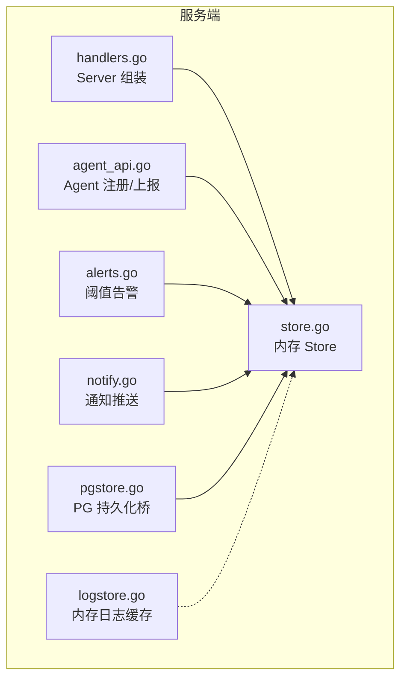
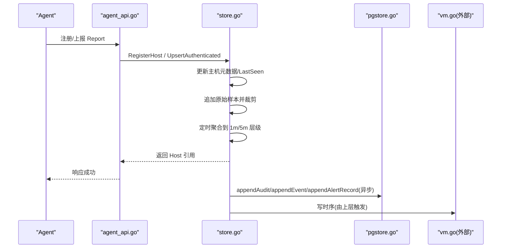
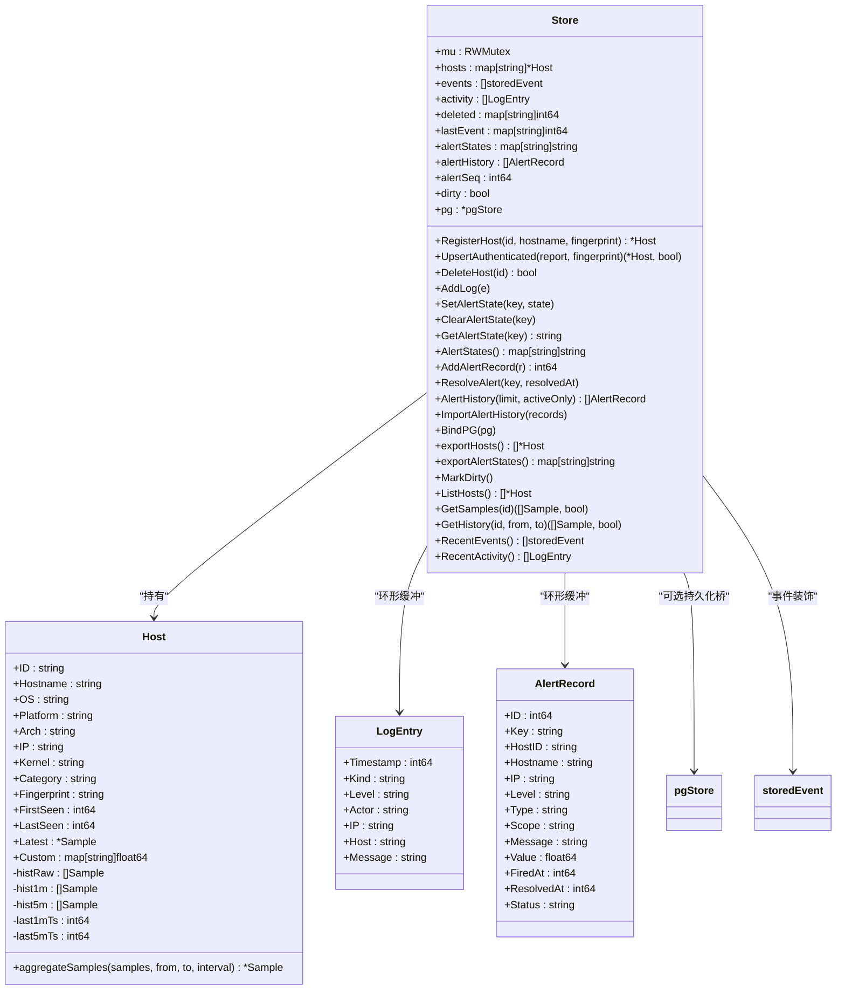
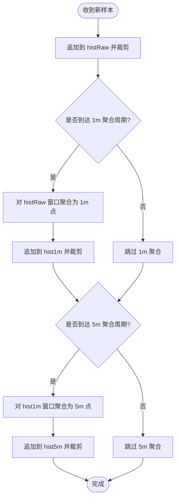
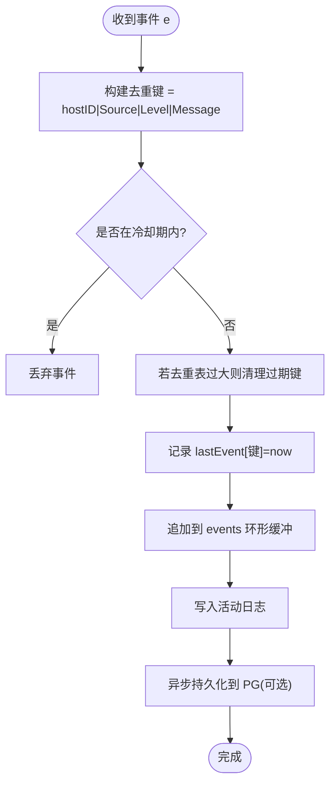
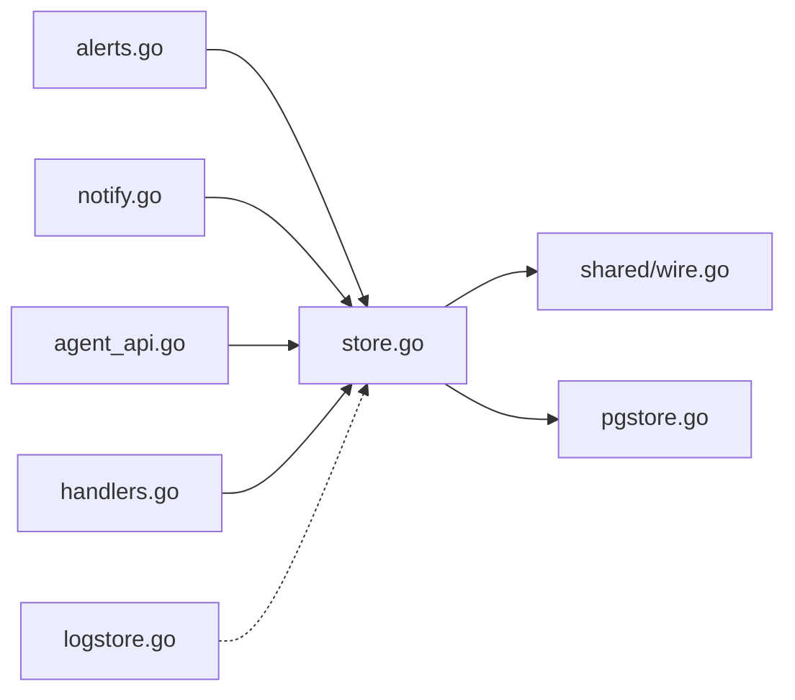

# 统一存储抽象层

<cite>
**本文引用的文件**   
- [store.go](file://cmd/server/store.go)
- [logstore.go](file://cmd/server/logstore.go)
- [pgstore.go](file://cmd/server/pgstore.go)
- [handlers.go](file://cmd/server/handlers.go)
- [agent_api.go](file://cmd/server/agent_api.go)
- [alerts.go](file://cmd/server/alerts.go)
- [notify.go](file://cmd/server/notify.go)
</cite>

## 目录
1. [引言](#引言)
2. [项目结构](#项目结构)
3. [核心组件](#核心组件)
4. [架构总览](#架构总览)
5. [详细组件分析](#详细组件分析)
6. [依赖关系分析](#依赖关系分析)
7. [性能与容量规划](#性能与容量规划)
8. [故障排查指南](#故障排查指南)
9. [结论](#结论)
10. [附录：使用示例与最佳实践](#附录使用示例与最佳实践)

## 引言
本文件面向 AIOps Monitor 的“统一存储抽象层”，聚焦内存 Store 的设计与实现，解释其并发安全、数据一致性、生命周期管理、多级降采样缓存、事件去重与抑制、告警状态与历史持久化等关键机制。同时给出与其他组件（Agent 上报、告警引擎、通知、审计日志）的集成模式与最佳实践建议。

## 项目结构
统一存储抽象层位于服务端模块中，主要涉及以下文件：
- cmd/server/store.go：内存 Store 定义、主机元数据、时间序列三级缓存、事件环形缓冲、活动日志、告警状态与历史、PostgreSQL 绑定与导入导出。
- cmd/server/logstore.go：纯内存日志聚合与检索（热缓存）。
- cmd/server/pgstore.go：PostgreSQL 持久化桥接（主机元数据、审计日志、事件、告警历史、KV 状态）。
- cmd/server/handlers.go：Server 组装与依赖注入（Store 作为核心依赖）。
- cmd/server/agent_api.go：Agent 注册与认证上报入口（调用 Store.RegisterHost/UpsertAuthenticated）。
- cmd/server/alerts.go：阈值告警评估（读取 Host 最新指标生成 Alert）。
- cmd/server/notify.go：告警通知（结合 Store 的告警状态与历史记录）。

图表来源
- [handlers.go:47-98](file://cmd/server/handlers.go#L47-L98)
- [agent_api.go:71-118](file://cmd/server/agent_api.go#L71-L118)
- [alerts.go:209-468](file://cmd/server/alerts.go#L209-L468)
- [notify.go:43-52](file://cmd/server/notify.go#L43-L52)
- [pgstore.go:216-263](file://cmd/server/pgstore.go#L216-L263)
- [logstore.go:38-78](file://cmd/server/logstore.go#L38-L78)

章节来源
- [handlers.go:47-98](file://cmd/server/handlers.go#L47-L98)
- [agent_api.go:71-118](file://cmd/server/agent_api.go#L71-L118)
- [alerts.go:209-468](file://cmd/server/alerts.go#L209-L468)
- [notify.go:43-52](file://cmd/server/notify.go#L43-L52)
- [pgstore.go:216-263](file://cmd/server/pgstore.go#L216-L263)
- [logstore.go:38-78](file://cmd/server/logstore.go#L38-L78)

## 核心组件
- Store：内存主存储，维护主机集合、最近事件环、活动日志环、删除抑制窗口、事件去重窗口、告警状态映射、告警历史环、自增 ID、脏标记、可选 PG 持久化桥。
- Host：每台 Agent 的主机聚合记录，包含元数据、Latest 样本、自定义指标以及三层时序历史（原始、1 分钟聚合、5 分钟聚合）。
- LogEntry：统一活动日志条目（操作/系统/插件/终端），用于审计与排障。
- AlertRecord：单条告警生命周期记录（触发/恢复/确认/静默），带单调递增 ID，支持环形缓冲与持久化。
- logStore：独立内存日志聚合与检索（按 host/level/keyword/time 过滤与分页统计）。

章节来源
- [store.go:29-51](file://cmd/server/store.go#L29-L51)
- [store.go:63-71](file://cmd/server/store.go#L63-L71)
- [store.go:75-89](file://cmd/server/store.go#L75-L89)
- [store.go:92-104](file://cmd/server/store.go#L92-L104)
- [logstore.go:22-41](file://cmd/server/logstore.go#L22-L41)

## 架构总览
统一存储抽象层采用“内存热缓存 + 外部持久化”的分层设计：
- 内存层（Store/logStore）：提供高吞吐写入与低延迟读取，承载热点数据与实时查询。
- 持久化层（pgstore）：将主机元数据、审计日志、事件、告警历史、KV 状态落库；启动时回填内存以恢复运行态。
- 时序层（VictoriaMetrics）：通过 vm.go 写入全部时序数据（不在本文件范围，但由 Store 的多级降采样结果驱动）。

图表来源
- [agent_api.go:71-118](file://cmd/server/agent_api.go#L71-L118)
- [store.go:237-340](file://cmd/server/store.go#L237-L340)
- [pgstore.go:304-332](file://cmd/server/pgstore.go#L304-L332)

## 详细组件分析

### Store 结构与并发安全
- 数据结构
  - hosts：hostID -> *Host 映射，保存主机元数据与 Latest。
  - events：全局最近事件环形缓冲（storedEvent）。
  - activity：活动日志环形缓冲（LogEntry）。
  - deleted：手动删除后的抑制窗口（hostID -> 删除时间戳）。
  - lastEvent：事件去重键 -> 上次时间戳（防抖/降噪）。
  - alertStates：告警键 -> 状态（acknowledged/silenced）。
  - alertHistory：告警历史环形缓冲（AlertRecord）。
  - alertSeq：单调递增 ID。
  - dirty：变更标记，供嵌入 DB 的自动保存消费。
  - pg：可选的 PostgreSQL 持久化桥指针。
- 并发模型
  - 使用 sync.RWMutex 保护所有读写路径。
  - 读多写少场景下，List/Get 类接口使用 RLock，避免阻塞。
  - 写路径（Upsert/Delete/AddLog/SetAlertState 等）持写锁，保证原子性与一致性。
- 一致性保证
  - 注册与上报在同一把锁内完成指纹校验与状态更新，避免 TOCTOU。
  - 删除后设置抑制窗口，防止被删主机在短时间窗内复活。
  - 事件去重基于 key 与冷却时间，限制重复事件风暴。
  - 告警状态与历史记录在修改时同步标记 dirty，并由持久化层异步落盘。

章节来源
- [store.go:92-104](file://cmd/server/store.go#L92-L104)
- [store.go:186-195](file://cmd/server/store.go#L186-L195)
- [store.go:201-228](file://cmd/server/store.go#L201-L228)
- [store.go:237-340](file://cmd/server/store.go#L237-L340)
- [store.go:668-685](file://cmd/server/store.go#L668-L685)
- [store.go:723-754](file://cmd/server/store.go#L723-L754)

#### 类图（代码级）

图表来源
- [store.go:29-51](file://cmd/server/store.go#L29-L51)
- [store.go:63-71](file://cmd/server/store.go#L63-L71)
- [store.go:75-89](file://cmd/server/store.go#L75-L89)
- [store.go:92-104](file://cmd/server/store.go#L92-L104)

### 内存缓存策略与多级降采样
- 原始层（histRaw）：保留约 1.5h 的 5s 间隔样本，上限固定。
- 1 分钟聚合层（hist1m）：每 60s 对原始层窗口进行平均/取末值聚合，保留 48h。
- 5 分钟聚合层（hist5m）：每 300s 对 1m 层窗口进行聚合，保留 30 天。
- 查询路由：根据请求时间跨度选择合适层级（<2h 用原始，<48h 用 1m，>=48h 用 5m）。
- 聚合规则：CPU/内存/磁盘/网络/连接数/负载/进程数等取平均或最大值，GPU/分盘信息按维度聚合。

图表来源
- [store.go:237-340](file://cmd/server/store.go#L237-L340)
- [store.go:357-573](file://cmd/server/store.go#L357-L573)
- [store.go:620-648](file://cmd/server/store.go#L620-L648)

章节来源
- [store.go:237-340](file://cmd/server/store.go#L237-L340)
- [store.go:357-573](file://cmd/server/store.go#L357-L573)
- [store.go:620-648](file://cmd/server/store.go#L620-L648)

### 事件去重与抑制逻辑
- 去重键：hostID + Source + Level + Message，形成稳定键空间。
- 冷却期：相同键在 eventCooldownSec 内只记录一次，避免误配探针刷屏。
- 内存边界：去重表大小超过阈值时清理过期键，控制内存增长。
- 事件环：全局 events 环形缓冲，限制最大长度，API 侧再限制返回数量。

图表来源
- [store.go:309-334](file://cmd/server/store.go#L309-L334)
- [store.go:651-663](file://cmd/server/store.go#L651-L663)
- [store.go:688-700](file://cmd/server/store.go#L688-L700)

章节来源
- [store.go:309-334](file://cmd/server/store.go#L309-L334)
- [store.go:651-663](file://cmd/server/store.go#L651-L663)
- [store.go:688-700](file://cmd/server/store.go#L688-L700)

### 告警状态与历史持久化
- 告警状态：支持 acknowledged/silenced，持久化 KV，重启恢复。
- 告警历史：环形缓冲，单调递增 ID，新增时异步写入 PG；恢复时反向查找最新 firing 记录并更新。
- 导入导出：启动时从 PG 加载最近告警历史与状态，恢复内存视图；导出时仅拷贝快照。

章节来源
- [store.go:723-754](file://cmd/server/store.go#L723-L754)
- [store.go:760-796](file://cmd/server/store.go#L760-L796)
- [store.go:800-833](file://cmd/server/store.go#L800-L833)
- [store.go:108-146](file://cmd/server/store.go#L108-L146)

### 生命周期管理与持久化桥
- BindPG：启动时将 PG 中的审计日志、事件、主机列表、告警历史与状态回填到内存。
- exportHosts/exportAlertStates：周期性导出主机元数据与告警状态至 PG（不含时序历史，时序走 VM）。
- MarkDirty：SRE 管理器（事件/工单等）修改自身状态后标记脏位，触发持久化。

章节来源
- [store.go:108-146](file://cmd/server/store.go#L108-L146)
- [store.go:150-171](file://cmd/server/store.go#L150-L171)
- [store.go:179-183](file://cmd/server/store.go#L179-L183)
- [pgstore.go:216-263](file://cmd/server/pgstore.go#L216-L263)

### 与外部组件的集成模式
- Agent 注册与上报：
  - RegisterHost：绑定主机指纹，创建/更新主机记录，处理删除抑制。
  - UpsertAuthenticated：指纹校验后更新主机元数据、Latest、时序历史、事件与活动日志。
- 告警引擎：
  - Evaluate：遍历 Host 列表，基于 Latest 指标计算告警，结合 Store 的告警状态与历史进行治理。
- 通知中心：
  - Notifier：结合告警状态与历史记录，仅在触发/恢复时推送，避免刷屏。
- Server 组装：
  - NewServer：注入 Store 作为核心依赖，协调各子系统。

章节来源
- [agent_api.go:71-118](file://cmd/server/agent_api.go#L71-L118)
- [alerts.go:209-468](file://cmd/server/alerts.go#L209-L468)
- [notify.go:43-52](file://cmd/server/notify.go#L43-L52)
- [handlers.go:47-98](file://cmd/server/handlers.go#L47-L98)

## 依赖关系分析
- 直接依赖
  - Store 依赖 shared.Sample/Event 等共享类型。
  - Store 可选依赖 pgStore 进行持久化。
  - logStore 独立于 Store，但常被 UI/AI 诊断等模块组合使用。
- 间接依赖
  - alerts.go 依赖 Store.ListHosts 获取主机集合。
  - notify.go 依赖 Store.AlertStates/AlertHistory 做告警治理与推送。
  - agent_api.go 调用 Store.RegisterHost/UpsertAuthenticated 完成注册与上报。

图表来源
- [store.go:92-104](file://cmd/server/store.go#L92-L104)
- [pgstore.go:216-263](file://cmd/server/pgstore.go#L216-L263)
- [alerts.go:209-468](file://cmd/server/alerts.go#L209-L468)
- [notify.go:43-52](file://cmd/server/notify.go#L43-L52)
- [agent_api.go:71-118](file://cmd/server/agent_api.go#L71-L118)
- [handlers.go:47-98](file://cmd/server/handlers.go#L47-L98)
- [logstore.go:38-78](file://cmd/server/logstore.go#L38-L78)

章节来源
- [store.go:92-104](file://cmd/server/store.go#L92-L104)
- [pgstore.go:216-263](file://cmd/server/pgstore.go#L216-L263)
- [alerts.go:209-468](file://cmd/server/alerts.go#L209-L468)
- [notify.go:43-52](file://cmd/server/notify.go#L43-L52)
- [agent_api.go:71-118](file://cmd/server/agent_api.go#L71-L118)
- [handlers.go:47-98](file://cmd/server/handlers.go#L47-L98)
- [logstore.go:38-78](file://cmd/server/logstore.go#L38-L78)

## 性能与容量规划
- 写入路径
  - UpsertAuthenticated 在写锁内完成指纹校验、元数据更新、原始样本追加、聚合判断与事件处理，适合高频上报。
  - 事件去重与活动日志写入在写锁内完成，必要时异步落盘 PG，降低 IO 抖动。
- 读取路径
  - ListHosts/GetHistory/RecentEvents/RecentActivity 均使用读锁，快速返回副本，避免阻塞写入。
- 内存占用
  - 每台主机三层历史约 1-2 MB，3000 台约需 4-7 GB（可通过调整保留常量优化）。
- 带宽与压缩
  - 配合 gzip 与分页，多主机轮询可显著降低下行带宽。
- 调优建议
  - 增大上报间隔（如 10-15s）以降低 CPU/带宽压力。
  - 合理设置 histRawMax/hist1mMax/hist5mMax 平衡内存与查询粒度。
  - 控制 eventsPerAPI 与 maxEvents，避免大对象传输。

章节来源
- [store.go:237-340](file://cmd/server/store.go#L237-L340)
- [store.go:576-648](file://cmd/server/store.go#L576-L648)
- [README.md:1108-1116](file://README.md#L1108-L1116)

## 故障排查指南
- 主机无法上报
  - 检查 RegisterHost 是否成功绑定指纹；UpsertAuthenticated 会拒绝未注册或指纹不匹配的上报。
  - 关注 deleted 抑制窗口：刚删除的主机在短时间内会被忽略。
- 事件刷屏
  - 检查事件去重键与冷却期配置；确认探针是否误配导致重复消息。
- 告警不生效或不恢复
  - 查看 AlertStates 与 AlertHistory，确认状态是否正确更新；ResolveAlert 会反向查找最新 firing 记录。
- 审计日志缺失
  - 确认 pgstore 已正确绑定且异步写入成功；必要时检查数据库连接与权限。

章节来源
- [store.go:201-228](file://cmd/server/store.go#L201-L228)
- [store.go:237-340](file://cmd/server/store.go#L237-L340)
- [store.go:760-796](file://cmd/server/store.go#L760-L796)
- [store.go:108-146](file://cmd/server/store.go#L108-L146)

## 结论
统一存储抽象层通过内存热缓存与外部持久化的分层设计，在保证高吞吐与低延迟的同时，提供了可靠的数据一致性与生命周期管理能力。多级降采样、事件去重与告警治理进一步提升了系统的可扩展性与稳定性。配合 PG 与 VictoriaMetrics，可在单机支撑数千台主机的监控需求。

## 附录：使用示例与最佳实践

### 正确使用存储抽象接口（示例路径）
- 注册主机
  - 参考路径：[agent_api.go:71-71](file://cmd/server/agent_api.go#L71-L71)
- 认证上报
  - 参考路径：[agent_api.go:118-118](file://cmd/server/agent_api.go#L118-L118)
- 列出主机
  - 参考路径：[store.go:576-584](file://cmd/server/store.go#L576-L584)
- 查询历史趋势
  - 参考路径：[store.go:620-648](file://cmd/server/store.go#L620-L648)
- 添加活动日志
  - 参考路径：[store.go:703-707](file://cmd/server/store.go#L703-L707)
- 告警状态管理
  - 参考路径：[store.go:723-754](file://cmd/server/store.go#L723-L754)
- 告警历史查询
  - 参考路径：[store.go:800-814](file://cmd/server/store.go#L800-L814)

### 与其他组件的集成模式
- 告警评估
  - 参考路径：[alerts.go:209-468](file://cmd/server/alerts.go#L209-L468)
- 通知推送
  - 参考路径：[notify.go:43-52](file://cmd/server/notify.go#L43-L52)
- Server 组装
  - 参考路径：[handlers.go:47-98](file://cmd/server/handlers.go#L47-L98)

### 最佳实践
- 控制上报频率与批量大小，避免写锁成为瓶颈。
- 合理设置去重冷却期与事件环容量，防止内存膨胀。
- 定期导出主机元数据与告警状态，确保重启后可恢复。
- 使用 Read 锁优先的接口进行查询，减少写锁竞争。
- 对大对象（如 Latest.ProcessNames）按需拉取，避免不必要的数据传输。