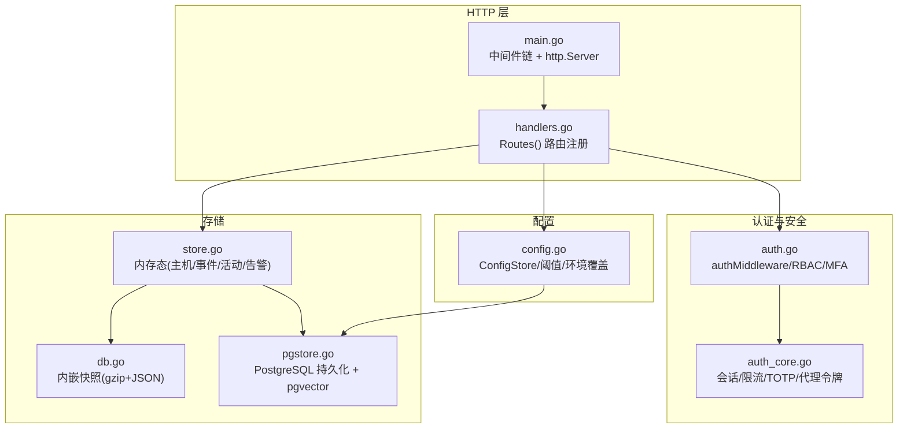
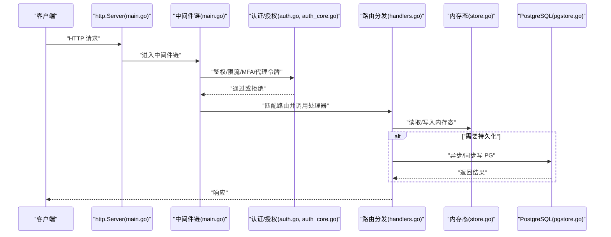
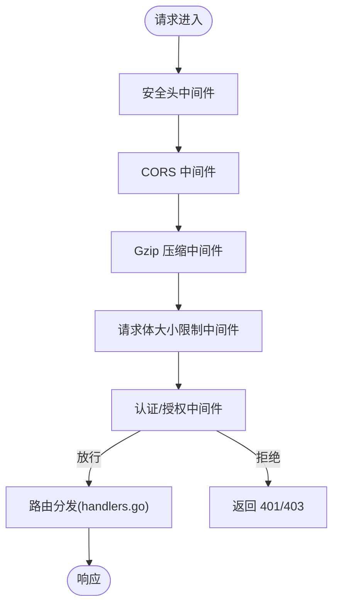
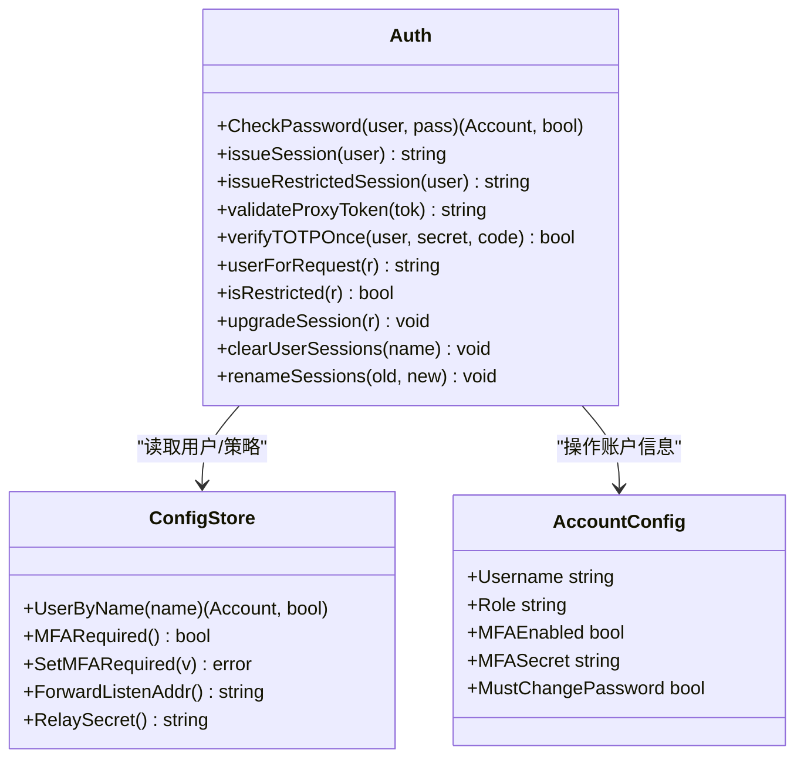
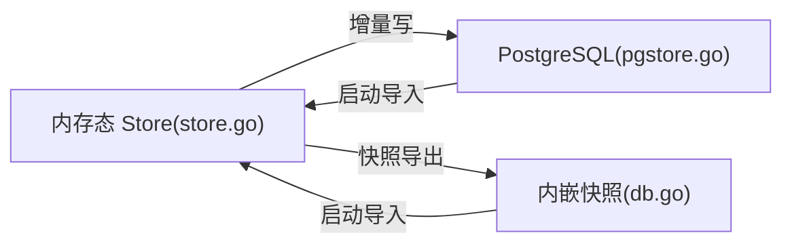
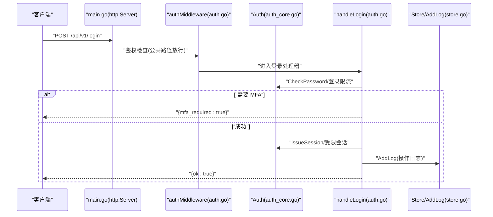
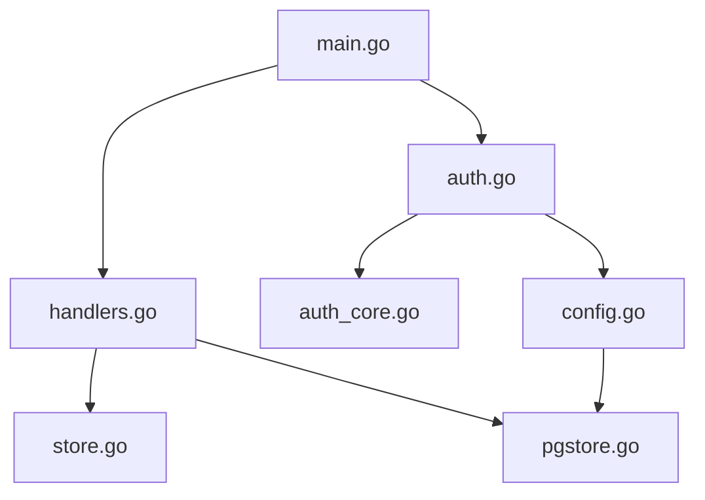

# 服务端架构

<cite>
**本文引用的文件**   
- [cmd/server/main.go](file://cmd/server/main.go)
- [cmd/server/handlers.go](file://cmd/server/handlers.go)
- [cmd/server/auth.go](file://cmd/server/auth.go)
- [cmd/server/auth_core.go](file://cmd/server/auth_core.go)
- [cmd/server/config.go](file://cmd/server/config.go)
- [cmd/server/store.go](file://cmd/server/store.go)
- [cmd/server/db.go](file://cmd/server/db.go)
- [cmd/server/pgstore.go](file://cmd/server/pgstore.go)
</cite>

## 目录
1. [简介](#简介)
2. [项目结构](#项目结构)
3. [核心组件](#核心组件)
4. [架构总览](#架构总览)
5. [详细组件分析](#详细组件分析)
6. [依赖关系分析](#依赖关系分析)
7. [性能考量](#性能考量)
8. [故障排查指南](#故障排查指南)
9. [结论](#结论)
10. [附录](#附录)

## 简介
本文件面向 AIOps Monitor 服务端的架构与实现，聚焦以下目标：
- HTTP 服务器初始化流程与中间件管道（CORS、安全头、压缩、认证）
- 路由注册机制与业务处理器分发
- 存储层抽象（PostgreSQL 连接管理、内存缓存/快照持久化）
- 认证授权中间件（RBAC、MFA、会话与限流）
- API 路由设计与请求处理生命周期
- 配置管理系统与环境变量覆盖
- 错误处理策略、优雅关闭机制、TLS 支持与整体安全加固措施

## 项目结构
服务端代码位于 cmd/server 下，关键文件职责如下：
- main.go：进程入口、HTTP 服务器启动、中间件链组装、优雅关闭、TLS 支持
- handlers.go：Server 聚合对象、Routes 路由注册、静态资源与前端打包
- auth.go / auth_core.go：认证授权、会话、TOTP MFA、登录限流、代理令牌
- config.go：可编辑配置模型、默认值回填、环境变量覆盖、校验
- store.go：内存态主机/事件/活动日志/告警状态等；多级降采样历史
- db.go：内嵌快照持久化（gzip+JSON），用于重启恢复
- pgstore.go：PostgreSQL 持久化（迁移、读写、pgvector RAG、Hermes 规则/模板/会话）

图表来源
- [cmd/server/main.go:294-303](file://cmd/server/main.go#L294-L303)
- [cmd/server/handlers.go:96-346](file://cmd/server/handlers.go#L96-L346)
- [cmd/server/auth.go:112-172](file://cmd/server/auth.go#L112-L307)
- [cmd/server/auth_core.go:178-432](file://cmd/server/auth_core.go#L178-L432)
- [cmd/server/config.go:533-651](file://cmd/server/config.go#L533-L651)
- [cmd/server/store.go:92-146](file://cmd/server/store.go#L92-L146)
- [cmd/server/db.go:93-149](file://cmd/server/db.go#L93-L149)
- [cmd/server/pgstore.go:47-75](file://cmd/server/pgstore.go#L47-L75)

章节来源
- [cmd/server/main.go:227-355](file://cmd/server/main.go#L227-L355)
- [cmd/server/handlers.go:96-346](file://cmd/server/handlers.go#L96-L346)

## 核心组件
- HTTP 服务器与中间件链
  - 顺序：安全头 → CORS → gzip 压缩 → 请求体大小限制 → 认证授权 → 路由分发
  - 关键：ReadHeaderTimeout/IdleTimeout、优雅关闭、可选 TLS
- 认证与授权
  - 基于 Cookie 的会话、IP 与账号维度的登录限流、TOTP MFA、全局 MFA 强制策略、代理令牌
  - RBAC 路由级拦截（viewer/operator/admin）
- 配置系统
  - JSON 文件 + PostgreSQL 双源（优先 PG），默认阈值回填，AIOPS_* 环境变量覆盖
- 存储层
  - 内存态 Store（主机/事件/活动/告警状态/历史降采样）
  - 内嵌快照持久化（重启恢复）
  - PostgreSQL 持久化（审计日志、事件、主机元数据、会话、SRE 工作流、AI 记忆）

章节来源
- [cmd/server/main.go:294-303](file://cmd/server/main.go#L294-L303)
- [cmd/server/auth.go:112-172](file://cmd/server/auth.go#L112-L172)
- [cmd/server/auth_core.go:178-432](file://cmd/server/auth_core.go#L178-L432)
- [cmd/server/config.go:533-651](file://cmd/server/config.go#L533-L651)
- [cmd/server/store.go:92-146](file://cmd/server/store.go#L92-L146)
- [cmd/server/db.go:93-149](file://cmd/server/db.go#L93-L149)
- [cmd/server/pgstore.go:47-75](file://cmd/server/pgstore.go#L47-L75)

## 架构总览
下图展示一次典型 API 请求从进入 HTTP 服务器到落库的全链路。

图表来源
- [cmd/server/main.go:294-303](file://cmd/server/main.go#L294-L303)
- [cmd/server/auth.go:112-172](file://cmd/server/auth.go#L112-L172)
- [cmd/server/handlers.go:96-346](file://cmd/server/handlers.go#L96-L346)
- [cmd/server/store.go:92-146](file://cmd/server/store.go#L92-L146)
- [cmd/server/pgstore.go:47-75](file://cmd/server/pgstore.go#L47-L75)

## 详细组件分析

### HTTP 服务器初始化与中间件管道
- 初始化要点
  - 解析命令行参数、加载 dist 目录、创建 Store、校验外部依赖（PostgreSQL、VictoriaMetrics）
  - 构建中间件链：securityHeaders → cors → gzip → bodyLimit → auth
  - 设置 ReadHeaderTimeout/IdleTimeout，监听端口，支持 TLS
  - 优雅关闭：SIGINT/SIGTERM 触发 Shutdown，最终 flush PG 并退出
- 中间件职责
  - 安全头：X-Content-Type-Options、X-Frame-Options、Referrer-Policy、CSP（排除 /proxy/*）
  - CORS：按白名单回显 Origin，否则兼容模式允许 *
  - 压缩：对文本/JSON 启用 gzip，跳过 WebSocket/终端/转发/代理路径
  - 请求体限制：MaxBytesReader 防超大负载
  - 认证：非公开路径需有效会话与足够角色

图表来源
- [cmd/server/main.go:113-205](file://cmd/server/main.go#L113-L205)
- [cmd/server/main.go:294-303](file://cmd/server/main.go#L294-L303)

章节来源
- [cmd/server/main.go:227-355](file://cmd/server/main.go#L227-L355)
- [cmd/server/main.go:113-205](file://cmd/server/main.go#L113-L205)

### 路由注册与业务处理器分发
- 使用 Go 1.22 方法+路径模式集中注册
- 主要域：Agent 上报/注册、主机/指标/历史、告警治理、用户与 RBAC、MFA、拨测、剧本编排、SRE 工作流（事件/工单/SLO）、日志检索、AI 巡检诊断、Hermes Agent、远程终端、端口转发、HTTP 反向代理、消息中心、WebSocket 推送、静态资源与安装脚本
- 静态资源：嵌入 web/ 目录，按需拼接 app.js 模块，提供主题初始化与 i18n 脚本

章节来源
- [cmd/server/handlers.go:96-346](file://cmd/server/handlers.go#L96-L346)

### 认证与授权（RBAC、MFA、会话与限流）
- 会话与会话键
  - 随机 Token 生成，内部以 SHA-256 哈希索引，避免泄露可重放
  - 绝对过期 + 滑动空闲超时
- 登录限流
  - IP 维度滑动窗口 + 账号维度独立窗口，防止分布式爆破
- TOTP MFA
  - 一次性验证（含时间步去重），支持全局强制策略（受限会话仅允许 MFA 相关端点）
- 代理令牌
  - 短时效、单次使用的临时令牌，用于 window.open 场景下的 /proxy/* 访问
- RBAC 路由级控制
  - viewer 读权限、operator+ 写权限、admin 用户管理权限、终端/转发/代理需 operator+

图表来源
- [cmd/server/auth_core.go:178-432](file://cmd/server/auth_core.go#L178-L432)
- [cmd/server/config.go:661-793](file://cmd/server/config.go#L661-L793)

章节来源
- [cmd/server/auth.go:112-172](file://cmd/server/auth.go#L112-L172)
- [cmd/server/auth_core.go:178-432](file://cmd/server/auth_core.go#L178-L432)

### 配置管理系统
- 配置来源优先级
  - PostgreSQL app_config 表 > server_config.json 文件
  - AIOPS_* 环境变量覆盖（如 AIOPS_POSTGRES_DSN、AIOPS_VM_URL、AIOPS_FORWARD_LISTEN 等）
- 默认值与自愈
  - 阈值零值自动回填为默认值，确保所有指标具备合理阈值
  - 首次运行自动生成 install_token，迁移旧单账户到多用户列表
- 校验与敏感字段
  - 阈值范围、SMTP 端口/密码长度等校验
  - 支持密钥静态加密（AES-256-GCM）

章节来源
- [cmd/server/config.go:533-651](file://cmd/server/config.go#L533-L651)
- [cmd/server/config.go:491-531](file://cmd/server/config.go#L491-L531)
- [cmd/server/main.go:268-272](file://cmd/server/main.go#L268-L272)

### 存储层抽象（PostgreSQL 与内存/快照）
- 内存态 Store
  - 主机元数据、最近事件环、活动日志环、告警状态、多级历史降采样（raw/1m/5m）
  - 与 PG 绑定后，将审计日志、事件、主机元数据、告警状态等增量写入 PG
- 内嵌快照持久化
  - gzip+JSON 原子写入（tmp+rename），重启时恢复主机、事件、活动、会话等
- PostgreSQL 持久化
  - 迁移建表（incidents/tickets/app_config/audit_log/events/hosts/kv_state/terminal_recordings/diagnosis_embeddings/ai_memory_embeddings/experience_rules/hermes_rules/templates/sessions 等）
  - 定期 flush（含 SRE 工作流、消息中心、AI 巡检、修复执行、SLO 燃烧状态、Playbook 执行记录等）
  - pgvector 向量检索（诊断案例与通用记忆），支持重复检测与合并、衰减策略

图表来源
- [cmd/server/store.go:92-146](file://cmd/server/store.go#L92-L146)
- [cmd/server/db.go:93-149](file://cmd/server/db.go#L93-L149)
- [cmd/server/pgstore.go:47-75](file://cmd/server/pgstore.go#L47-L75)

章节来源
- [cmd/server/store.go:92-146](file://cmd/server/store.go#L92-L146)
- [cmd/server/db.go:93-149](file://cmd/server/db.go#L93-L149)
- [cmd/server/pgstore.go:47-75](file://cmd/server/pgstore.go#L47-L75)

### 请求处理生命周期（示例：登录）

图表来源
- [cmd/server/auth.go:176-307](file://cmd/server/auth.go#L176-L307)
- [cmd/server/auth_core.go:297-432](file://cmd/server/auth_core.go#L297-L432)
- [cmd/server/store.go:702-707](file://cmd/server/store.go#L702-L707)

章节来源
- [cmd/server/auth.go:176-307](file://cmd/server/auth.go#L176-L307)
- [cmd/server/auth_core.go:297-432](file://cmd/server/auth_core.go#L297-L432)
- [cmd/server/store.go:702-707](file://cmd/server/store.go#L702-L707)

### 错误处理策略
- 统一 JSON 响应封装
  - writeJSON 统一 Content-Type 与编码
- 常见错误码
  - 400 无效 JSON/参数
  - 401 未认证
  - 403 权限不足/中继密钥不匹配
  - 429 登录尝试过多/短信验证码频率限制
  - 500 内部错误
- 审计与告警
  - 登录失败、TOTP 失败、中继密钥不匹配、PG 写入失败均记录日志或警告

章节来源
- [cmd/server/handlers.go:348-353](file://cmd/server/handlers.go#L348-L353)
- [cmd/server/auth.go:112-172](file://cmd/server/auth.go#L112-L172)
- [cmd/server/pgstore.go:304-312](file://cmd/server/pgstore.go#L304-L312)

### 优雅关闭机制
- 监听 SIGINT/SIGTERM，调用 http.Server.Shutdown 等待活跃请求完成
- 关闭前执行 pgFlush 持久化全部关系型状态，随后关闭 PG 连接并退出

章节来源
- [cmd/server/main.go:305-323](file://cmd/server/main.go#L305-L323)
- [cmd/server/pgstore.go:1126-1171](file://cmd/server/pgstore.go#L1126-L1171)

### TLS 支持与传输安全
- 当配置 AIOPS_TLS_CERT/AIOPS_TLS_KEY 时启用 HTTPS
- 未配置时输出生产环境警告，建议置于 HTTPS 终止代理之后
- 会话 Cookie 根据 isHTTPS 动态设置 Secure 标志

章节来源
- [cmd/server/main.go:335-351](file://cmd/server/main.go#L335-L351)
- [cmd/server/auth.go:283-307](file://cmd/server/auth.go#L283-L307)

### 安全加固措施
- 安全头：禁止 MIME 嗅探、禁止框架嵌套、严格 Referrer-Policy、CSP（排除 /proxy/*）
- CORS 白名单：精确匹配 Origin，否则浏览器侧阻止跨域
- 请求体限制：MaxBytesReader 防御超大负载
- 中继密钥校验：X-Relay-Secret 必须匹配
- 出站 SSRF 防护：safedial（见仓库其他文件）
- 配置密钥静态加密：AES-256-GCM（可选）

章节来源
- [cmd/server/main.go:113-136](file://cmd/server/main.go#L113-L136)
- [cmd/server/main.go:72-102](file://cmd/server/main.go#L72-L102)
- [cmd/server/main.go:138-145](file://cmd/server/main.go#L138-L145)
- [cmd/server/auth.go:112-126](file://cmd/server/auth.go#L112-L126)
- [cmd/server/main.go:268-272](file://cmd/server/main.go#L268-L272)

## 依赖关系分析
- 组件耦合
  - main.go 负责组装中间件与 http.Server，依赖 handlers.go 的路由与 auth.go 的鉴权
  - auth.go 依赖 auth_core.go 的会话与限流逻辑，依赖 config.go 的用户与策略
  - handlers.go 依赖 store.go 的内存态与 pgstore.go 的持久化
  - config.go 依赖 pgstore.go 的配置 blob 存取
- 外部依赖
  - PostgreSQL（lib/pq）：关系型数据与 pgvector 向量检索
  - VictoriaMetrics：时序数据（由环境变量驱动）

图表来源
- [cmd/server/main.go:294-303](file://cmd/server/main.go#L294-L303)
- [cmd/server/handlers.go:96-346](file://cmd/server/handlers.go#L96-L346)
- [cmd/server/auth.go:112-172](file://cmd/server/auth.go#L112-L172)
- [cmd/server/auth_core.go:178-432](file://cmd/server/auth_core.go#L178-L432)
- [cmd/server/config.go:533-651](file://cmd/server/config.go#L533-L651)
- [cmd/server/store.go:92-146](file://cmd/server/store.go#L92-L146)
- [cmd/server/pgstore.go:47-75](file://cmd/server/pgstore.go#L47-L75)

章节来源
- [cmd/server/main.go:294-303](file://cmd/server/main.go#L294-L303)
- [cmd/server/handlers.go:96-346](file://cmd/server/handlers.go#L96-L346)
- [cmd/server/auth.go:112-172](file://cmd/server/auth.go#L112-L172)
- [cmd/server/auth_core.go:178-432](file://cmd/server/auth_core.go#L178-L432)
- [cmd/server/config.go:533-651](file://cmd/server/config.go#L533-L651)
- [cmd/server/store.go:92-146](file://cmd/server/store.go#L92-L146)
- [cmd/server/pgstore.go:47-75](file://cmd/server/pgstore.go#L47-L75)

## 性能考量
- 压缩优化：gzip 中间件复用 Writer 池，显著降低高频轮询接口带宽
- 历史降采样：raw/1m/5m 三级聚合，减少长跨度查询开销
- 并发与限流：登录限流、代理令牌单次使用、终端二次验证限流
- 数据库连接池：PostgreSQL 最大连接数、空闲连接与生命周期控制
- 优雅关闭：避免中断长连接与流式通道（终端/转发/WebSocket）

[本节为通用指导，无需具体文件引用]

## 故障排查指南
- 启动阶段
  - 未配置 AIOPS_POSTGRES_DSN/AIOPS_VM_URL：服务直接退出并提示
  - PG 连接失败：重试若干次后致命退出
- 运行时
  - 登录失败/频繁尝试：检查 IP/账号限流与审计日志
  - MFA 校验失败：确认 TOTP 时间与设备同步
  - PG 写入失败：关注警告日志与网络连通性
- 关闭阶段
  - 优雅关闭超时：检查活跃请求与 PG flush 耗时

章节来源
- [cmd/server/main.go:255-272](file://cmd/server/main.go#L255-L272)
- [cmd/server/main.go:211-225](file://cmd/server/main.go#L211-L225)
- [cmd/server/auth.go:176-248](file://cmd/server/auth.go#L176-L248)
- [cmd/server/pgstore.go:304-312](file://cmd/server/pgstore.go#L304-L312)

## 结论
AIOps Monitor 服务端采用“中间件链 + 集中路由”的清晰分层，结合强安全的认证授权与多后端存储（内存态 + 内嵌快照 + PostgreSQL），在保障高可用与可扩展性的同时，提供了完善的安全加固与运维能力。通过环境变量覆盖与默认值自愈，部署与运维成本显著降低。

[本节为总结性内容，无需具体文件引用]

## 附录
- 关键实现细节参考路径
  - 中间件链与服务器启动：[cmd/server/main.go:294-303](file://cmd/server/main.go#L294-L303)
  - 安全头/CORS/gzip/BodyLimit：[cmd/server/main.go:113-205](file://cmd/server/main.go#L113-L205)
  - 认证中间件与 RBAC：[cmd/server/auth.go:112-172](file://cmd/server/auth.go#L112-L172)
  - 会话/限流/TOTP/代理令牌：[cmd/server/auth_core.go:178-432](file://cmd/server/auth_core.go#L178-L432)
  - 配置加载与环境覆盖：[cmd/server/config.go:533-651](file://cmd/server/config.go#L533-L651)
  - 内存态与多级降采样：[cmd/server/store.go:230-340](file://cmd/server/store.go#L230-L340)
  - 内嵌快照持久化：[cmd/server/db.go:93-149](file://cmd/server/db.go#L93-L149)
  - PostgreSQL 迁移与持久化：[cmd/server/pgstore.go:77-212](file://cmd/server/pgstore.go#L77-L212)