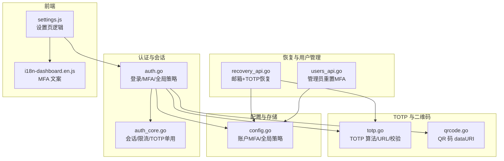
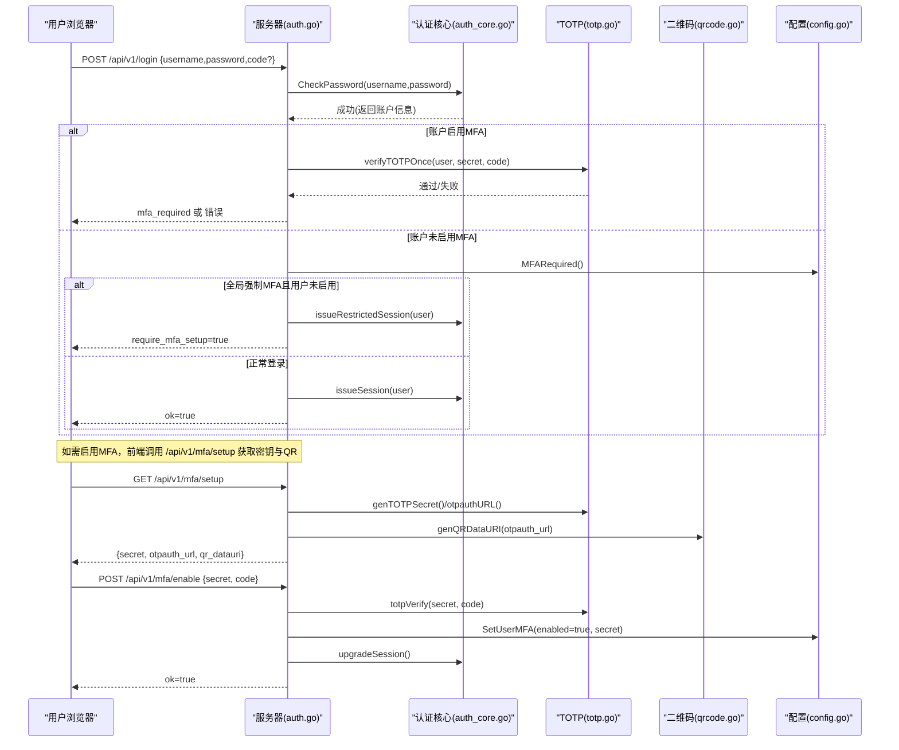
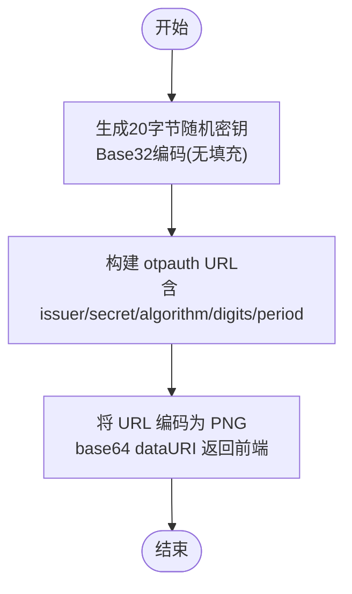
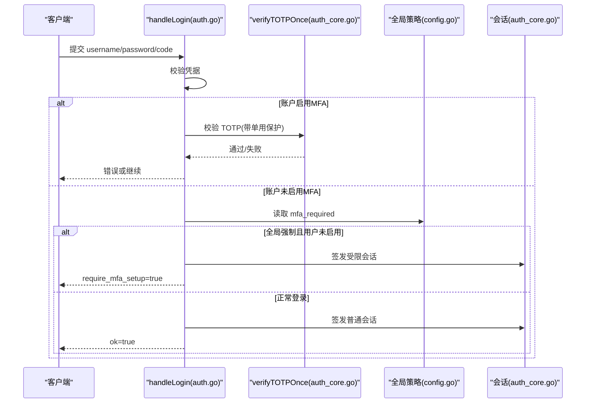
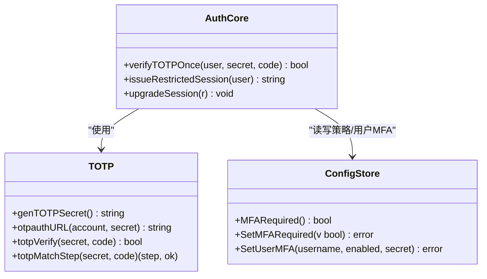
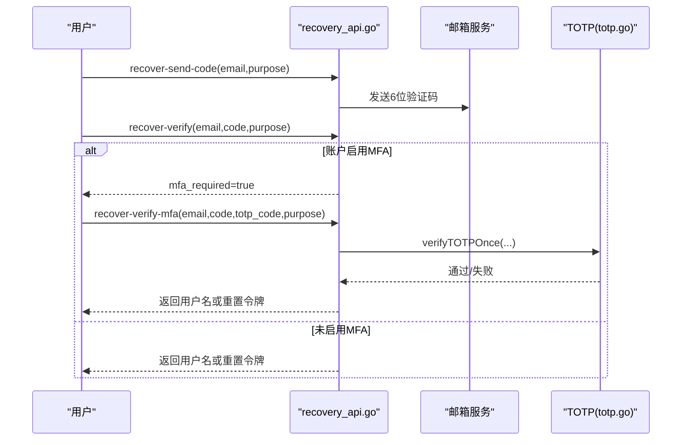
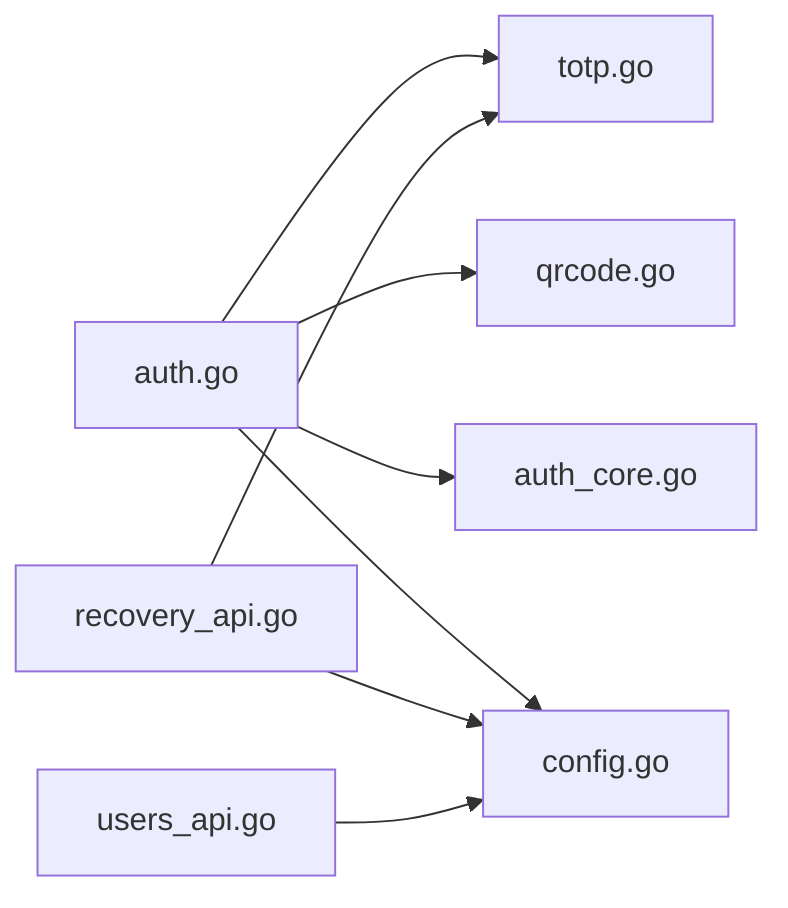

# MFA 两步验证

<cite>
**本文引用的文件**   
- [cmd/server/totp.go](file://cmd/server/totp.go)
- [cmd/server/qrcode.go](file://cmd/server/qrcode.go)
- [cmd/server/auth.go](file://cmd/server/auth.go)
- [cmd/server/auth_core.go](file://cmd/server/auth_core.go)
- [cmd/server/config.go](file://cmd/server/config.go)
- [cmd/server/recovery_api.go](file://cmd/server/recovery_api.go)
- [cmd/server/users_api.go](file://cmd/server/users_api.go)
- [cmd/server/web/js/settings.js](file://cmd/server/web/js/settings.js)
- [cmd/server/web/i18n-dashboard.en.js](file://cmd/server/web/i18n-dashboard.en.js)
</cite>

## 目录
1. [简介](#简介)
2. [项目结构](#项目结构)
3. [核心组件](#核心组件)
4. [架构总览](#架构总览)
5. [详细组件分析](#详细组件分析)
6. [依赖关系分析](#依赖关系分析)
7. [性能与安全考量](#性能与安全考量)
8. [故障排除指南](#故障排除指南)
9. [结论](#结论)
10. [附录：API 与集成示例](#附录api-与集成示例)

## 简介
本文件为 AIOps Monitor 的 MFA（多因素认证）两步验证系统提供深入技术文档。内容覆盖 TOTP 时间基一次性密码的实现原理、密钥生成与 QR 码生成、登录与恢复流程中的验证码校验、全局 MFA 策略配置、用户级 MFA 设置与会话升级机制，以及启用/禁用流程、备用恢复码（通过邮箱二次验证）和强制策略实施等。文末提供 API 参考与前端集成要点，帮助快速落地与排障。

## 项目结构
MFA 功能主要分布在以下模块：
- TOTP 算法与工具：实现 RFC 6238 兼容的 6 位动态口令生成与校验、otpauth URL 构建、QR 码数据 URI 生成
- 认证与会话：登录流程、会话签发与限制、全局 MFA 强制策略、会话升级
- 配置存储：账户 MFA 开关与密钥、全局 MFA 策略持久化
- 恢复流程：基于邮箱验证码 + 可选 TOTP 的账号找回与密码重置
- 用户管理：管理员重置用户 MFA
- 前端集成：国际化文案与部分设置页逻辑

图表来源
- [cmd/server/auth.go:176-307](file://cmd/server/auth.go#L176-L307)
- [cmd/server/auth_core.go:262-285](file://cmd/server/auth_core.go#L262-L285)
- [cmd/server/totp.go:16-109](file://cmd/server/totp.go#L16-L109)
- [cmd/server/qrcode.go:10-22](file://cmd/server/qrcode.go#L10-L22)
- [cmd/server/config.go:784-805](file://cmd/server/config.go#L784-L805)
- [cmd/server/recovery_api.go:94-186](file://cmd/server/recovery_api.go#L94-L186)
- [cmd/server/users_api.go:131-139](file://cmd/server/users_api.go#L131-L139)
- [cmd/server/web/js/settings.js:748-770](file://cmd/server/web/js/settings.js#L748-L770)
- [cmd/server/web/i18n-dashboard.en.js:325-338](file://cmd/server/web/i18n-dashboard.en.js#L325-L338)

章节来源
- [cmd/server/auth.go:176-307](file://cmd/server/auth.go#L176-L307)
- [cmd/server/auth_core.go:262-285](file://cmd/server/auth_core.go#L262-L285)
- [cmd/server/totp.go:16-109](file://cmd/server/totp.go#L16-L109)
- [cmd/server/qrcode.go:10-22](file://cmd/server/qrcode.go#L10-L22)
- [cmd/server/config.go:784-805](file://cmd/server/config.go#L784-L805)
- [cmd/server/recovery_api.go:94-186](file://cmd/server/recovery_api.go#L94-L186)
- [cmd/server/users_api.go:131-139](file://cmd/server/users_api.go#L131-L139)
- [cmd/server/web/js/settings.js:748-770](file://cmd/server/web/js/settings.js#L748-L770)
- [cmd/server/web/i18n-dashboard.en.js:325-338](file://cmd/server/web/i18n-dashboard.en.js#L325-L338)

## 核心组件
- TOTP 实现（RFC 6238）
  - 密钥生成：20 字节随机数，Base32 编码（无填充），符合 Google Authenticator 标准
  - 动态口令计算：HMAC-SHA1 + 时间步长 30s + 动态截断，输出 6 位数字
  - 容错窗口：当前步及前后各一步（±30s）进行比对，使用常量时间比较防时序攻击
  - otpauth URL 构建：包含 issuer、secret、algorithm、digits、period 等参数，兼容主流认证器
- QR 码生成
  - 将 otpauth URL 编码为 PNG，并以 base64 data URI 返回，便于前端直接渲染
- 认证与会话
  - 登录流程：用户名/密码通过后，若账户开启 MFA，则要求输入 TOTP；支持“受限会话”强制绑定
  - 会话类型：普通会话与受限会话（仅允许 MFA 设置/启用/登出）
  - 会话升级：完成 MFA 启用后，将受限会话升级为完整会话
  - TOTP 单用：同一时间步在 ±1 步窗口内不可重复使用，防止重放
- 配置与策略
  - 全局策略：mfa_required 控制是否强制所有未启用 MFA 的用户在下次登录时先完成绑定
  - 用户级设置：mfa_enabled/mfa_secret 存储于账户配置中，启用时需校验一次有效 TOTP
- 恢复与备用路径
  - 邮箱验证码 + 可选 TOTP 的恢复流程，用于找回用户名或重置密码
  - 通过邮箱验证码可解绑 MFA（需已登录）
- 用户管理
  - 管理员可重置指定用户的 MFA（关闭并清空密钥）

章节来源
- [cmd/server/totp.go:16-109](file://cmd/server/totp.go#L16-L109)
- [cmd/server/qrcode.go:10-22](file://cmd/server/qrcode.go#L10-L22)
- [cmd/server/auth.go:252-307](file://cmd/server/auth.go#L252-L307)
- [cmd/server/auth_core.go:262-285](file://cmd/server/auth_core.go#L262-L285)
- [cmd/server/config.go:784-805](file://cmd/server/config.go#L784-L805)
- [cmd/server/recovery_api.go:94-186](file://cmd/server/recovery_api.go#L94-L186)
- [cmd/server/users_api.go:131-139](file://cmd/server/users_api.go#L131-L139)

## 架构总览
下图展示登录与 MFA 的整体交互：客户端发起登录，服务端校验凭据，若账户启用 MFA 则进入第二因子校验；若全局策略强制 MFA 且用户未启用，则下发受限会话引导绑定；绑定完成后会话升级。

图表来源
- [cmd/server/auth.go:176-307](file://cmd/server/auth.go#L176-L307)
- [cmd/server/auth_core.go:380-432](file://cmd/server/auth_core.go#L380-L432)
- [cmd/server/totp.go:29-90](file://cmd/server/totp.go#L29-L90)
- [cmd/server/qrcode.go:10-22](file://cmd/server/qrcode.go#L10-L22)
- [cmd/server/config.go:784-805](file://cmd/server/config.go#L784-L805)

## 详细组件分析

### TOTP 算法与工具
- 密钥生成
  - 使用系统 CSPRNG 生成 20 字节随机数，Base32 编码（无填充），作为共享密钥
- 动态口令计算
  - 以 Unix 时间除以 30s 得到时间步，对时间步做 HMAC-SHA1，再按动态截断取 6 位数字
- 校验与容错
  - 校验当前步及前后各一步，使用常量时间比较避免时序侧信道
  - 返回匹配的时间步索引，供上层实现“单用”保护
- otpauth URL
  - 构造 otpauth://totp/issuer:account?secret=...&issuer=...&algorithm=SHA1&digits=6&period=30
  - 兼容 Google Authenticator 等主流应用

图表来源
- [cmd/server/totp.go:29-109](file://cmd/server/totp.go#L29-L109)
- [cmd/server/qrcode.go:10-22](file://cmd/server/qrcode.go#L10-L22)

章节来源
- [cmd/server/totp.go:16-109](file://cmd/server/totp.go#L16-L109)
- [cmd/server/qrcode.go:10-22](file://cmd/server/qrcode.go#L10-L22)

### 登录与 MFA 校验流程
- 登录入口
  - 校验用户名/密码成功后，若账户启用 MFA，则要求输入 TOTP
  - 使用 verifyTOTPOnce 进行单用保护，防止重放
- 全局强制策略
  - 若全局 mfa_required=true 且用户未启用 MFA，返回 require_mfa_setup，并下发受限会话
  - 受限会话仅允许访问 MFA 设置/启用/登出接口
- 会话升级
  - 用户完成 MFA 启用后，将受限会话升级为完整会话

图表来源
- [cmd/server/auth.go:176-307](file://cmd/server/auth.go#L176-L307)
- [cmd/server/auth_core.go:262-285](file://cmd/server/auth_core.go#L262-L285)
- [cmd/server/config.go:784-805](file://cmd/server/config.go#L784-L805)

章节来源
- [cmd/server/auth.go:176-307](file://cmd/server/auth.go#L176-L307)
- [cmd/server/auth_core.go:262-285](file://cmd/server/auth_core.go#L262-L285)
- [cmd/server/config.go:784-805](file://cmd/server/config.go#L784-L805)

### MFA 启用/禁用与全局策略
- 启用流程
  - 调用 /api/v1/mfa/setup 获取 secret、otpauth_url、qr_datauri
  - 用户在认证器中扫描 QR 或手动输入密钥
  - 调用 /api/v1/mfa/enable 提交 secret 与当前 TOTP 完成启用
  - 后端保存用户 MFA 状态并升级受限会话
- 禁用流程
  - 需要重新输入密码进行二次确认
  - 后端清除 MFA 密钥并记录审计日志
- 全局策略
  - 管理员可通过 /api/v1/mfa/global 查询与切换 mfa_required
  - 开启后，未启用 MFA 的用户将被强制引导绑定

图表来源
- [cmd/server/auth_core.go:262-285](file://cmd/server/auth_core.go#L262-L285)
- [cmd/server/auth_core.go:391-432](file://cmd/server/auth_core.go#L391-L432)
- [cmd/server/config.go:784-805](file://cmd/server/config.go#L784-L805)
- [cmd/server/totp.go:29-90](file://cmd/server/totp.go#L29-L90)

章节来源
- [cmd/server/auth.go:536-585](file://cmd/server/auth.go#L536-L585)
- [cmd/server/auth.go:617-639](file://cmd/server/auth.go#L617-L639)
- [cmd/server/config.go:784-805](file://cmd/server/config.go#L784-L805)
- [cmd/server/totp.go:29-90](file://cmd/server/totp.go#L29-L90)

### 恢复流程与备用路径
- 邮箱验证码 + 可选 TOTP
  - 发送验证码：/api/v1/account/recover-send-code
  - 校验验证码：/api/v1/account/recover-verify
    - 若账户启用 MFA，返回 mfa_required=true，需继续第二步
  - 校验 TOTP：/api/v1/account/recover-verify-mfa
    - 校验通过后消费邮箱验证码并完成恢复（返回用户名或重置令牌）
- 密码重置
  - 使用一次性重置令牌或直接走旧版流程（当账户启用 MFA 时需附带 TOTP）
- 通过邮箱解绑 MFA
  - 已登录用户可请求发送验证码到绑定邮箱，验证后解除 MFA

图表来源
- [cmd/server/recovery_api.go:28-186](file://cmd/server/recovery_api.go#L28-L186)
- [cmd/server/totp.go:29-90](file://cmd/server/totp.go#L29-L90)

章节来源
- [cmd/server/recovery_api.go:28-186](file://cmd/server/recovery_api.go#L28-L186)
- [cmd/server/recovery_api.go:368-435](file://cmd/server/recovery_api.go#L368-L435)
- [cmd/server/totp.go:29-90](file://cmd/server/totp.go#L29-L90)

### 管理员重置用户 MFA
- 管理员接口：/api/v1/users/{username}/mfa/reset
- 行为：关闭用户 MFA 并清空密钥，记录审计日志

章节来源
- [cmd/server/users_api.go:131-139](file://cmd/server/users_api.go#L131-L139)

### 前端集成要点
- 初始化与登录提示
  - settings.js 在页面初始化时调用 /api/v1/me 判断登录态，并根据 must_change_password 触发安全初始化弹窗
- MFA 相关文案
  - i18n-dashboard.en.js 提供 MFA 相关的国际化文本，如“请完成2FA绑定”、“请输入动态码”等
- 建议的前端交互
  - 登录时若响应包含 mfa_required，弹出 TOTP 输入框
  - 若响应包含 require_mfa_setup，跳转至 MFA 设置页，调用 setup/enable 完成绑定
  - 禁用 MFA 前提示输入密码进行二次确认

章节来源
- [cmd/server/web/js/settings.js:748-770](file://cmd/server/web/js/settings.js#L748-L770)
- [cmd/server/web/i18n-dashboard.en.js:325-338](file://cmd/server/web/i18n-dashboard.en.js#L325-L338)

## 依赖关系分析
- 组件耦合
  - auth.go 依赖 totp.go 与 qrcode.go 完成 MFA 能力
  - auth_core.go 提供会话管理与 TOTP 单用保护
  - config.go 提供全局策略与用户 MFA 配置的读写
  - recovery_api.go 复用 TOTP 单用与邮箱验证码机制
  - users_api.go 提供管理员重置用户 MFA 的能力
- 外部依赖
  - go-qrcode 用于生成 QR 码 PNG
- 潜在循环依赖
  - 当前实现未见循环依赖；各模块职责清晰

图表来源
- [cmd/server/auth.go:176-307](file://cmd/server/auth.go#L176-L307)
- [cmd/server/auth_core.go:262-285](file://cmd/server/auth_core.go#L262-L285)
- [cmd/server/totp.go:16-109](file://cmd/server/totp.go#L16-L109)
- [cmd/server/qrcode.go:10-22](file://cmd/server/qrcode.go#L10-L22)
- [cmd/server/config.go:784-805](file://cmd/server/config.go#L784-L805)
- [cmd/server/recovery_api.go:94-186](file://cmd/server/recovery_api.go#L94-L186)
- [cmd/server/users_api.go:131-139](file://cmd/server/users_api.go#L131-L139)

章节来源
- [cmd/server/auth.go:176-307](file://cmd/server/auth.go#L176-L307)
- [cmd/server/auth_core.go:262-285](file://cmd/server/auth_core.go#L262-L285)
- [cmd/server/totp.go:16-109](file://cmd/server/totp.go#L16-L109)
- [cmd/server/qrcode.go:10-22](file://cmd/server/qrcode.go#L10-L22)
- [cmd/server/config.go:784-805](file://cmd/server/config.go#L784-L805)
- [cmd/server/recovery_api.go:94-186](file://cmd/server/recovery_api.go#L94-L186)
- [cmd/server/users_api.go:131-139](file://cmd/server/users_api.go#L131-L139)

## 性能与安全考量
- 性能
  - TOTP 计算开销低（HMAC-SHA1 + 简单数学运算），每次登录仅少量 CPU 消耗
  - QR 码生成仅在启用阶段执行，不影响常规登录
- 安全
  - 使用系统 CSPRNG 生成密钥与会话令牌
  - 校验采用常量时间比较，抵御时序攻击
  - TOTP 单用保护：同一时间步在 ±1 步窗口内不可重复使用
  - 全局强制策略与会话限制：未启用 MFA 的用户只能访问绑定相关接口
  - 禁用 MFA 需二次密码确认，防止劫持会话直接关闭 MFA
  - 恢复流程结合邮箱验证码与 TOTP，降低被绕过风险

[本节为通用指导，不直接分析具体文件]

## 故障排除指南
- 无法生成 QR 码
  - 检查 QR 生成函数是否返回错误；确认依赖库可用
  - 参考：[cmd/server/qrcode.go:10-22](file://cmd/server/qrcode.go#L10-L22)
- TOTP 校验失败
  - 确认手机时间与服务器时间偏差在 ±30s 以内
  - 确认密钥 Base32 编码正确且无多余空格
  - 参考：[cmd/server/totp.go:57-90](file://cmd/server/totp.go#L57-L90)
- 全局强制 MFA 导致无法登录
  - 检查全局策略 mfa_required 是否为 true
  - 确保用户已完成 MFA 绑定
  - 参考：[cmd/server/config.go:784-805](file://cmd/server/config.go#L784-L805)
- 恢复流程报错
  - 确认邮箱验证码未过期且未被消费
  - 若账户启用 MFA，需在第二步提供正确的 TOTP
  - 参考：[cmd/server/recovery_api.go:94-186](file://cmd/server/recovery_api.go#L94-L186)
- 管理员重置用户 MFA 无效
  - 确认接口调用权限与用户名正确
  - 参考：[cmd/server/users_api.go:131-139](file://cmd/server/users_api.go#L131-L139)

章节来源
- [cmd/server/qrcode.go:10-22](file://cmd/server/qrcode.go#L10-L22)
- [cmd/server/totp.go:57-90](file://cmd/server/totp.go#L57-L90)
- [cmd/server/config.go:784-805](file://cmd/server/config.go#L784-L805)
- [cmd/server/recovery_api.go:94-186](file://cmd/server/recovery_api.go#L94-L186)
- [cmd/server/users_api.go:131-139](file://cmd/server/users_api.go#L131-L139)

## 结论
AIOps Monitor 的 MFA 系统以标准 TOTP 为核心，结合全局策略与会话限制，提供了完善的两步验证能力。其实现简洁可靠、零第三方依赖（除 QR 码外），并通过邮箱验证码与 TOTP 的组合保障恢复流程的安全性。配合前端国际化与清晰的 API 设计，易于集成与运维。

[本节为总结性内容，不直接分析具体文件]

## 附录：API 与集成示例
- 登录
  - POST /api/v1/login
    - 请求体：{username, password, login_type?, code?}
    - 响应：ok=true 或 mfa_required=true 或 require_mfa_setup=true
- MFA 设置与启用
  - GET /api/v1/mfa/setup → {secret, otpauth_url, qr_datauri}
  - POST /api/v1/mfa/enable → {secret, code}
- MFA 禁用
  - POST /api/v1/mfa/disable → {password}
- 全局策略
  - GET /api/v1/mfa/global → {mfa_required}
  - POST /api/v1/mfa/global → {required}
- 恢复流程
  - POST /api/v1/account/recover-send-code → {email, purpose}
  - POST /api/v1/account/recover-verify → {email, code, purpose}
  - POST /api/v1/account/recover-verify-mfa → {email, code, totp_code, purpose}
  - POST /api/v1/account/reset-password → {reset_token|username,email,code,new_password,totp_code?}
- 管理员重置用户 MFA
  - POST /api/v1/users/{username}/mfa/reset

章节来源
- [cmd/server/auth.go:176-307](file://cmd/server/auth.go#L176-L307)
- [cmd/server/auth.go:536-585](file://cmd/server/auth.go#L536-L585)
- [cmd/server/auth.go:589-615](file://cmd/server/auth.go#L589-L615)
- [cmd/server/auth.go:617-639](file://cmd/server/auth.go#L617-L639)
- [cmd/server/recovery_api.go:28-186](file://cmd/server/recovery_api.go#L28-L186)
- [cmd/server/users_api.go:131-139](file://cmd/server/users_api.go#L131-L139)