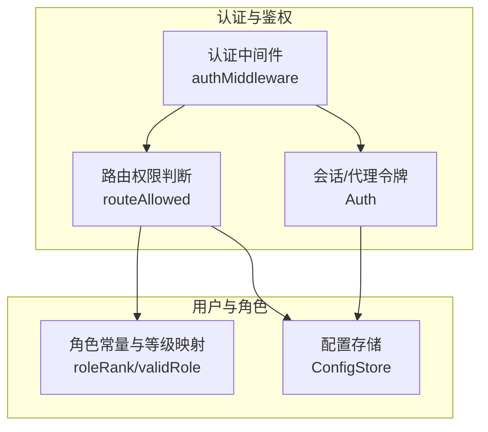
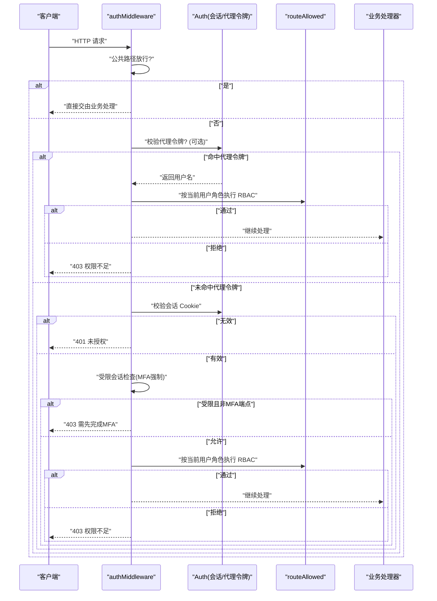
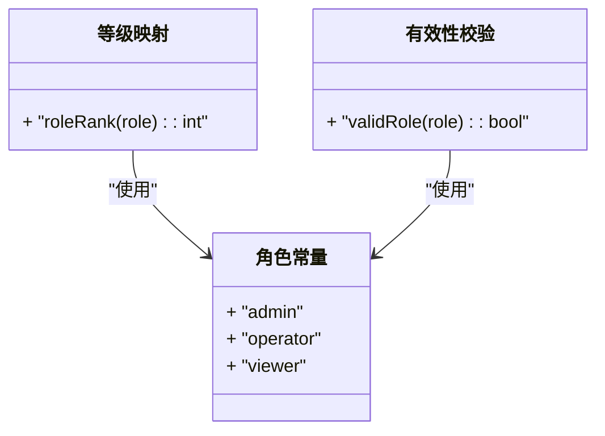
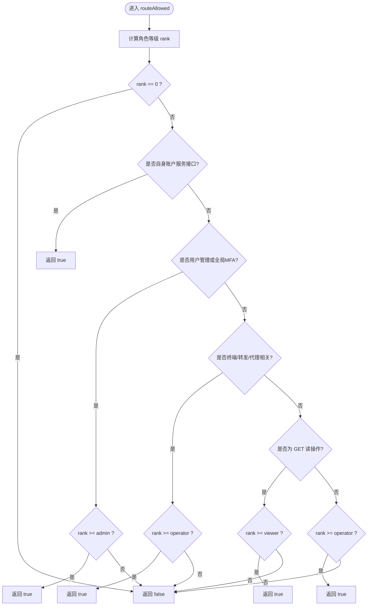
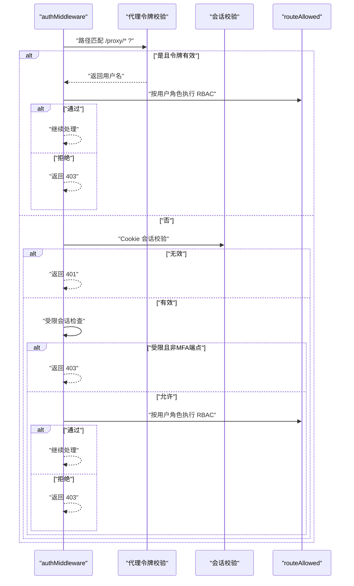
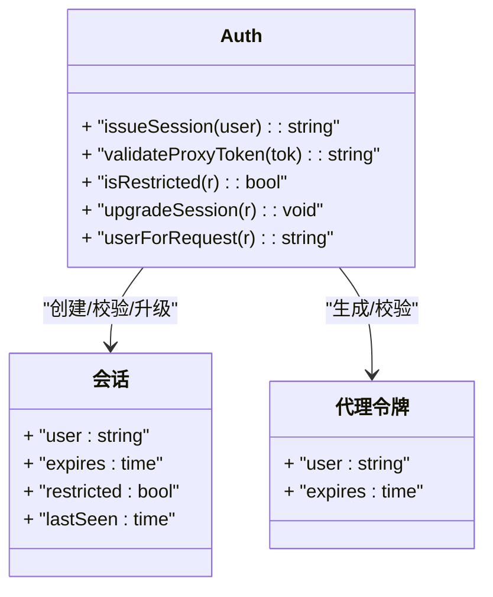
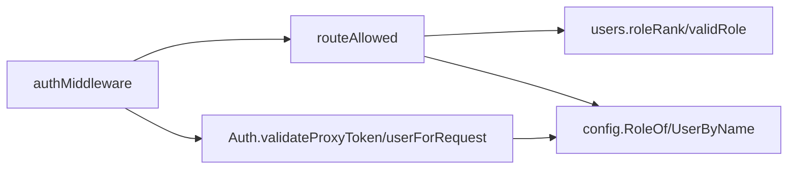

# RBAC 权限模型

<cite>
**本文引用的文件**
- [auth.go](file://cmd/server/auth.go)
- [auth_core.go](file://cmd/server/auth_core.go)
- [users.go](file://cmd/server/users.go)
- [config.go](file://cmd/server/config.go)
- [auth_test.go](file://cmd/server/auth_test.go)
</cite>

## 目录
1. [简介](#简介)
2. [项目结构](#项目结构)
3. [核心组件](#核心组件)
4. [架构总览](#架构总览)
5. [详细组件分析](#详细组件分析)
6. [依赖关系分析](#依赖关系分析)
7. [性能与可扩展性](#性能与可扩展性)
8. [故障排查指南](#故障排查指南)
9. [结论](#结论)
10. [附录](#附录)

## 简介
本文件面向 AIOps Monitor 的基于角色的访问控制（RBAC）权限模型，系统性阐述三种内置角色（Viewer、Operator、Admin）的权限层次与继承机制，深入解析路由级鉴权函数 routeAllowed 的判断逻辑、不同 HTTP 方法与路径的权限规则、以及角色等级比较算法。文档同时提供权限配置示例、自定义角色扩展方法、权限审计日志记录要点，并给出在中间件中实现权限验证的代码示例路径，帮助读者快速理解与落地。

## 项目结构
RBAC 相关代码集中在服务端认证与用户管理模块中：
- 角色定义与等级映射：位于用户管理模块
- 会话与代理令牌：位于认证核心模块
- 路由级鉴权与中间件：位于认证主模块
- 配置与账户持久化：位于配置存储模块
- 行为用例与断言：位于测试文件

图表来源
- [auth.go:112-171](file://cmd/server/auth.go#L112-L171)
- [auth.go:86-108](file://cmd/server/auth.go#L86-L108)
- [auth_core.go:107-180](file://cmd/server/auth_core.go#L107-L180)
- [users.go:19-41](file://cmd/server/users.go#L19-L41)
- [config.go:320-353](file://cmd/server/config.go#L320-L353)

章节来源
- [auth.go:86-171](file://cmd/server/auth.go#L86-L171)
- [auth_core.go:107-180](file://cmd/server/auth_core.go#L107-L180)
- [users.go:19-41](file://cmd/server/users.go#L19-L41)
- [config.go:320-353](file://cmd/server/config.go#L320-L353)

## 核心组件
- 角色常量与等级映射
  - 三个内置角色：admin、operator、viewer
  - 等级数值：admin=3，operator=2，viewer=1；未知角色为 0
- 路由级权限检查
  - 统一入口：authMiddleware 对每个非公开请求进行身份与会话校验后，调用 routeAllowed 判定是否允许访问
  - 特殊路径豁免：自身账户服务接口对所有已登录角色开放
  - 管理员专属：用户管理与全局 MFA 策略仅 admin 可操作
  - 高危能力：远程终端、端口转发、HTTP 代理等需要 operator+
  - 读写分离：GET 读操作 viewer+ 即可，其余写/动作需 operator+
- 会话与代理令牌
  - 会话 Cookie 有效期与滑动空闲超时
  - 代理令牌用于浏览器新标签页场景，单使用且短生命周期，仍受 RBAC 复核

章节来源
- [users.go:19-41](file://cmd/server/users.go#L19-L41)
- [auth.go:86-108](file://cmd/server/auth.go#L86-L108)
- [auth.go:112-171](file://cmd/server/auth.go#L112-L171)
- [auth_core.go:157-176](file://cmd/server/auth_core.go#L157-L176)

## 架构总览
下图展示一次典型 API 请求从进入中间件到最终鉴权的完整流程，包括代理令牌分支与受限会话分支。

图表来源
- [auth.go:112-171](file://cmd/server/auth.go#L112-L171)
- [auth.go:86-108](file://cmd/server/auth.go#L86-L108)
- [auth_core.go:356-362](file://cmd/server/auth_core.go#L356-L362)
- [auth_core.go:404-417](file://cmd/server/auth_core.go#L404-L417)

## 详细组件分析

### 角色与等级映射
- 角色常量
  - RoleAdmin = "admin"
  - RoleOperator = "operator"
  - RoleViewer = "viewer"
- 等级映射 roleRank
  - admin → 3
  - operator → 2
  - viewer → 1
  - 未知 → 0
- 角色有效性校验
  - validRole 仅接受上述三种值

图表来源
- [users.go:19-41](file://cmd/server/users.go#L19-L41)

章节来源
- [users.go:19-41](file://cmd/server/users.go#L19-L41)

### 路由级权限检查 routeAllowed
- 输入：HTTP 请求对象、当前用户角色字符串
- 输出：布尔值表示是否允许访问
- 决策顺序
  1) 计算角色等级 rank；若为 0（未知），直接拒绝
  2) 自身账户服务接口：任意已登录角色均可访问（如登出、修改密码、个人资料、MFA 设置/启用/禁用等）
  3) 用户管理与全局 MFA：仅 admin 可访问
  4) 远程终端、端口转发、HTTP 代理相关路径：需要 operator+
  5) GET 读操作：viewer+ 即可
  6) 其他写/动作：operator+

图表来源
- [auth.go:86-108](file://cmd/server/auth.go#L86-L108)

章节来源
- [auth.go:86-108](file://cmd/server/auth.go#L86-L108)

### 中间件 authMiddleware 与受限会话
- 公共路径放行：静态资源、安装脚本、登录/获取当前用户、Agent 上报等
- 代理令牌优先：当路径以 /proxy/ 开头时，支持从 Cookie 或查询参数读取代理令牌，校验成功后仍需按令牌所属用户的当前角色再次执行 RBAC
- 会话校验：无有效会话则返回 401
- 受限会话（全局 MFA 强制）：仅允许访问 MFA 设置/启用/登出端点，否则返回 403
- 最终 RBAC：调用 routeAllowed 判定

图表来源
- [auth.go:112-171](file://cmd/server/auth.go#L112-L171)
- [auth_core.go:404-417](file://cmd/server/auth_core.go#L404-L417)

章节来源
- [auth.go:112-171](file://cmd/server/auth.go#L112-L171)
- [auth_core.go:404-417](file://cmd/server/auth_core.go#L404-L417)

### 会话与代理令牌
- 会话 Cookie
  - 名称固定，默认 7 天绝对过期
  - 滑动空闲超时：最近活动时间超过 24 小时将失效
  - 支持受限会话标记（仅允许 MFA 相关端点）
- 代理令牌
  - 短生命周期（秒级），单使用
  - 用于浏览器新标签页打开代理 URL 的场景
  - 校验成功后仍会按用户角色执行 RBAC，防止降权后越权

图表来源
- [auth_core.go:107-180](file://cmd/server/auth_core.go#L107-L180)
- [auth_core.go:380-432](file://cmd/server/auth_core.go#L380-L432)
- [auth_core.go:157-176](file://cmd/server/auth_core.go#L157-L176)

章节来源
- [auth_core.go:107-180](file://cmd/server/auth_core.go#L107-L180)
- [auth_core.go:380-432](file://cmd/server/auth_core.go#L380-L432)
- [auth_core.go:157-176](file://cmd/server/auth_core.go#L157-L176)

### 权限规则矩阵（示例）
- 自身账户服务接口（登出、修改密码、个人资料、MFA 设置/启用/禁用等）：所有已登录角色均可
- 用户管理与全局 MFA：仅 admin
- 远程终端、端口转发、HTTP 代理相关路径：operator+
- 其他 GET 读操作：viewer+
- 其他写/动作：operator+

章节来源
- [auth.go:86-108](file://cmd/server/auth.go#L86-L108)
- [auth_test.go:212-230](file://cmd/server/auth_test.go#L212-L230)

## 依赖关系分析
- 中间件依赖
  - authMiddleware 依赖 Auth 进行会话与代理令牌校验
  - routeAllowed 依赖 users.go 的角色常量与等级映射，以及 config.go 的用户角色查询
- 配置依赖
  - ConfigStore 提供用户列表、角色查询、MFA 策略等
- 测试依赖
  - auth_test.go 覆盖多种角色与路径组合的行为断言

图表来源
- [auth.go:112-171](file://cmd/server/auth.go#L112-L171)
- [auth.go:86-108](file://cmd/server/auth.go#L86-L108)
- [users.go:19-41](file://cmd/server/users.go#L19-L41)
- [config.go:126-136](file://cmd/server/config.go#L126-L136)

章节来源
- [auth.go:86-171](file://cmd/server/auth.go#L86-L171)
- [users.go:19-41](file://cmd/server/users.go#L19-L41)
- [config.go:126-136](file://cmd/server/config.go#L126-L136)

## 性能与可扩展性
- 复杂度
  - routeAllowed 为常数时间 O(1)，仅涉及路径前缀匹配与角色等级比较
  - 中间件主要开销在于 Cookie 解析、会话查找与代理令牌校验，均为哈希表 O(1)
- 可扩展性建议
  - 新增角色：在 users.go 中添加常量并在 roleRank 中映射等级，同时在 routeAllowed 中按需调整路径分支
  - 新增路径组：在 routeAllowed 中增加新的前缀匹配分支，明确最低角色要求
  - 细粒度资源级权限：可在 handler 层结合资源 ID 与上下文进行二次校验（例如按主机归属或数据域）

[本节为通用指导，不直接分析具体文件]

## 故障排查指南
- 常见错误码
  - 401 未授权：会话无效或缺失
  - 403 权限不足：角色等级低于路径要求，或受限会话访问了非 MFA 端点
- 定位步骤
  - 确认是否命中公共路径白名单
  - 检查代理令牌是否有效且未被单使用消耗
  - 查看受限会话标志是否开启，是否仅允许 MFA 相关端点
  - 核对当前用户角色与路径要求的等级对比结果
- 审计日志
  - 登录失败、TOTP 失败、默认凭证检测、密码变更、MFA 开关等关键事件均有审计日志写入
  - 可通过系统日志检索 actor、IP、消息内容等字段进行追踪

章节来源
- [auth.go:176-307](file://cmd/server/auth.go#L176-L307)
- [auth.go:432-467](file://cmd/server/auth.go#L432-L467)
- [auth.go:536-585](file://cmd/server/auth.go#L536-L585)
- [auth.go:596-615](file://cmd/server/auth.go#L596-L615)
- [auth.go:617-639](file://cmd/server/auth.go#L617-L639)

## 结论
AIOps Monitor 的 RBAC 模型采用“角色等级 + 路径分组 + 方法区分”的组合策略，兼顾易用性与安全性。通过统一的中间件与集中式的路由权限判断，确保所有敏感能力（终端、转发、代理、用户管理）均受到严格限制。配合受限会话与代理令牌的纵深防御，进一步降低了越权风险。建议在后续演进中引入更细粒度的资源级权限与完善的审计报表，以满足企业合规需求。

[本节为总结性内容，不直接分析具体文件]

## 附录

### 权限配置示例（概念说明）
- 创建用户并分配角色
  - 通过用户管理接口创建用户，指定角色为 viewer/operator/admin
  - 注意：至少保留一个 admin 用户，避免系统不可用
- 全局 MFA 策略
  - 管理员可开启全局 MFA 强制，新用户首次登录将被引导完成 TOTP 绑定
- 代理令牌
  - 仅在具备 operator+ 角色的用户可签发，短生命周期且单使用，适合浏览器新标签页场景

章节来源
- [config.go:320-353](file://cmd/server/config.go#L320-L353)
- [auth.go:596-615](file://cmd/server/auth.go#L596-L615)
- [auth_core.go:157-176](file://cmd/server/auth_core.go#L157-L176)

### 自定义角色扩展方法（概念说明）
- 在角色常量处添加新角色名
- 在等级映射中为新角色赋予合适的等级数值
- 在路由权限判断中按需调整路径分支的最低角色要求
- 在用户管理接口中允许分配该角色，并确保至少保留一个高权限管理员

章节来源
- [users.go:19-41](file://cmd/server/users.go#L19-L41)
- [auth.go:86-108](file://cmd/server/auth.go#L86-L108)

### 中间件权限验证示例（代码片段路径）
- 中间件入口与代理令牌分支
  - [auth.go:112-171](file://cmd/server/auth.go#L112-L171)
- 路由权限判断核心
  - [auth.go:86-108](file://cmd/server/auth.go#L86-L108)
- 会话与代理令牌校验
  - [auth_core.go:356-362](file://cmd/server/auth_core.go#L356-L362)
  - [auth_core.go:157-176](file://cmd/server/auth_core.go#L157-L176)
- 受限会话与 MFA 强制
  - [auth_core.go:404-417](file://cmd/server/auth_core.go#L404-L417)
  - [auth.go:158-165](file://cmd/server/auth.go#L158-L165)

章节来源
- [auth.go:86-171](file://cmd/server/auth.go#L86-L171)
- [auth_core.go:157-176](file://cmd/server/auth_core.go#L157-L176)
- [auth_core.go:356-362](file://cmd/server/auth_core.go#L356-L362)
- [auth_core.go:404-417](file://cmd/server/auth_core.go#L404-L417)